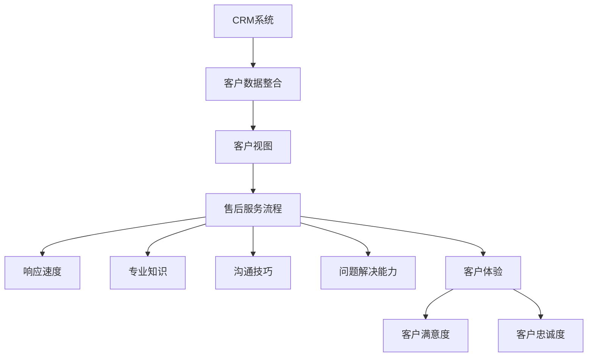

                 

# 客户关系管理：提供优秀的售后服务

## 关键词

- 客户关系管理（CRM）
- 服务质量
- 售后服务
- 客户满意度
- 客户忠诚度

## 摘要

在当今竞争激烈的市场环境中，提供优秀的售后服务已成为企业赢得和保持客户的关键策略。本文将深入探讨客户关系管理中的售后服务，包括其重要性、核心要素以及如何通过系统化的方法提高服务质量，从而增强客户满意度和忠诚度。我们将分步骤分析核心概念、算法原理、数学模型，并展示实际案例，以帮助读者理解和应用这一关键领域。

## 1. 背景介绍

### 1.1 目的和范围

本文旨在为从事客户关系管理的专业人士和IT从业者们提供一份全面且实用的指南，帮助他们理解售后服务的重要性，掌握提升服务质量的策略，并最终实现客户满意度和忠诚度的提升。本文将涵盖以下几个方面：

- 客户关系管理（CRM）的基本概念和原理
- 售后服务的核心要素及其与CRM的关联
- 提升服务质量的算法原理和具体操作步骤
- 数学模型在售后服务中的应用与解释
- 实际项目中的售后服务案例分析
- 提高客户满意度和忠诚度的工具和资源推荐

### 1.2 预期读者

- 客户关系管理（CRM）领域的专业人士
- IT公司客户支持团队
- 企业决策者和管理者
- 计算机科学和信息技术领域的学生与研究者

### 1.3 文档结构概述

本文的结构如下：

- **第1章 背景介绍**：介绍本文的目的、范围、预期读者以及文档结构。
- **第2章 核心概念与联系**：探讨客户关系管理（CRM）和售后服务的基本概念，并使用Mermaid流程图展示相关架构。
- **第3章 核心算法原理 & 具体操作步骤**：讲解提升售后服务质量的算法原理和操作步骤，使用伪代码详细阐述。
- **第4章 数学模型和公式 & 详细讲解 & 举例说明**：介绍售后服务中应用的数学模型，并使用LaTeX格式给出公式。
- **第5章 项目实战：代码实际案例和详细解释说明**：通过实际项目案例展示售后服务的代码实现和解读。
- **第6章 实际应用场景**：分析售后服务在不同行业的应用场景。
- **第7章 工具和资源推荐**：推荐学习资源、开发工具和框架。
- **第8章 总结：未来发展趋势与挑战**：总结当前发展趋势和面临挑战。
- **第9章 附录：常见问题与解答**：提供常见问题的解答。
- **第10章 扩展阅读 & 参考资料**：推荐进一步阅读的文献和资源。

### 1.4 术语表

#### 1.4.1 核心术语定义

- **客户关系管理（CRM）**：一种用于维护和改善企业与客户之间关系的策略和管理过程。
- **售后服务**：产品或服务交付后为客户提供的服务，包括技术支持、维修和咨询等。
- **客户满意度**：客户对产品或服务体验的正面评价和满足程度。
- **客户忠诚度**：客户对企业及其产品的持续忠诚和重复购买意愿。

#### 1.4.2 相关概念解释

- **客户生命周期价值（CLV）**：客户在整个生命周期中为企业带来的预期收益。
- **服务质量**：衡量服务满足客户需求和期望的程度。
- **客户体验**：客户在整个购买和使用过程中的感受和体验。

#### 1.4.3 缩略词列表

- **CRM**：客户关系管理
- **ERP**：企业资源规划
- **SCM**：供应链管理
- **SaaS**：软件即服务
- **API**：应用程序编程接口

## 2. 核心概念与联系

### 2.1 CRM与售后服务的关系

客户关系管理（CRM）是一个系统化的方法，旨在改善和维持企业与客户之间的关系。售后服务是CRM的重要组成部分，它直接影响客户满意度和忠诚度。CRM与售后服务的关系可以概括为以下几点：

1. **数据整合**：CRM系统通过整合客户数据，提供全面的客户视图，帮助售后服务团队更好地理解客户需求和期望。
2. **流程优化**：CRM系统自动化和优化售后服务流程，提高服务效率和质量。
3. **反馈循环**：售后服务中的客户反馈可以返回到CRM系统，帮助企业改进产品和服务，实现持续改进。
4. **客户价值最大化**：通过提供高质量的售后服务，企业可以增强客户满意度和忠诚度，提高客户生命周期价值（CLV）。

### 2.2 售后服务的核心要素

提供高质量的售后服务需要关注以下几个核心要素：

1. **响应速度**：及时响应客户的请求和问题，减少客户的等待时间。
2. **专业知识**：售后服务团队需要具备丰富的产品知识和解决问题的能力。
3. **沟通技巧**：良好的沟通能力有助于建立信任和满足客户需求。
4. **问题解决能力**：快速有效地解决问题，减少客户的困扰和不满。
5. **客户体验**：关注客户在整个售后服务过程中的体验，提供个性化的服务。

### 2.3 Mermaid流程图

下面是一个Mermaid流程图，展示了CRM系统与售后服务之间的关联：



该流程图展示了CRM系统如何通过整合客户数据、优化售后服务流程，最终影响客户满意度和忠诚度。

## 3. 核心算法原理 & 具体操作步骤

### 3.1 提升售后服务质量的算法原理

提升售后服务质量的关键在于优化服务流程和提升客户体验。以下是一种基于数据驱动的算法原理，用于提升售后服务质量：

1. **数据收集**：收集客户反馈、服务记录和业务数据，为后续分析提供基础。
2. **数据分析**：使用机器学习和统计分析方法，分析客户反馈和服务记录，识别服务中的瓶颈和改进机会。
3. **流程优化**：基于数据分析结果，调整和优化售后服务流程，提高响应速度和服务质量。
4. **客户体验改进**：根据客户需求和偏好，提供个性化的服务，提升客户满意度。
5. **反馈循环**：收集客户反馈，不断迭代优化服务流程和客户体验。

### 3.2 具体操作步骤

以下是一系列具体操作步骤，用于提升售后服务质量：

1. **步骤1：数据收集**
    - 收集客户反馈：通过在线调查、电话回访和社交媒体等方式收集客户反馈。
    - 收集服务记录：记录服务请求、处理时间和解决方案，用于后续分析。

    ```python
    def collect_feedback():
        # 收集客户反馈
        pass

    def collect_service_records():
        # 收集服务记录
        pass
    ```

2. **步骤2：数据分析**
    - 使用机器学习算法分析客户反馈和服务记录，识别常见问题和改进机会。

    ```python
    from sklearn import preprocessing

    def analyze_feedback(feedback):
        # 分析客户反馈
        pass

    def analyze_service_records(service_records):
        # 分析服务记录
        pass
    ```

3. **步骤3：流程优化**
    - 根据分析结果，调整和优化售后服务流程，提高响应速度和服务质量。

    ```python
    def optimize流程():
        # 调整售后服务流程
        pass
    ```

4. **步骤4：客户体验改进**
    - 根据客户需求和偏好，提供个性化的服务，提升客户满意度。

    ```python
    def personalize_service(client_preferences):
        # 提供个性化服务
        pass
    ```

5. **步骤5：反馈循环**
    - 收集客户反馈，不断迭代优化服务流程和客户体验。

    ```python
    def feedback_loop():
        # 收集客户反馈
        pass

    def iterate_optimization():
        # 迭代优化服务流程和客户体验
        pass
    ```

### 3.3 伪代码实现

以下是一个简化的伪代码实现，用于提升售后服务质量：

```python
# 主函数
def main():
    collect_feedback()
    collect_service_records()
    analyze_feedback(feedback)
    analyze_service_records(service_records)
    optimize流程()
    personalize_service(client_preferences)
    feedback_loop()

# 执行主函数
main()
```

通过上述步骤，企业可以逐步提升售后服务质量，从而提高客户满意度和忠诚度。

## 4. 数学模型和公式 & 详细讲解 & 举例说明

### 4.1 数学模型在售后服务中的应用

在售后服务中，数学模型可以用于多个方面，包括客户满意度评估、服务响应时间优化和客户忠诚度预测等。以下将详细介绍几个关键数学模型：

#### 4.1.1 客户满意度评估模型

客户满意度可以通过以下公式进行量化评估：

$$
S = \frac{R - D}{R + D}
$$

其中，$S$ 表示客户满意度，$R$ 表示正面评价分数，$D$ 表示负面评价分数。该公式衡量了客户对产品或服务的总体满意程度，分数范围在 -1（非常不满意）到 1（非常满意）之间。

#### 4.1.2 服务响应时间优化模型

为了优化服务响应时间，企业可以使用以下线性规划模型：

$$
\min \sum_{i=1}^{n} t_i
$$

subject to

$$
t_i \geq \alpha_i + \beta \cdot x_i \\
x_i \in \{0, 1\}
$$

其中，$t_i$ 表示第 $i$ 个请求的响应时间，$\alpha_i$ 表示处理第 $i$ 个请求的基本时间，$\beta$ 表示每个服务人员的最大工作量，$x_i$ 表示是否分配第 $i$ 个请求。

#### 4.1.3 客户忠诚度预测模型

客户忠诚度可以通过以下逻辑回归模型进行预测：

$$
P(Y=1) = \frac{1}{1 + e^{-(\beta_0 + \beta_1 X_1 + \beta_2 X_2 + ... + \beta_n X_n)}}
$$

其中，$Y$ 表示客户是否忠诚（1表示忠诚，0表示不忠诚），$X_1, X_2, ..., X_n$ 表示影响客户忠诚度的特征变量，$\beta_0, \beta_1, \beta_2, ..., \beta_n$ 为模型参数。

### 4.2 举例说明

#### 4.2.1 客户满意度评估

假设有10位客户，其中7位给出了正面评价（分数为5），3位给出了负面评价（分数为1）。根据上述公式，计算客户满意度：

$$
S = \frac{7 - 3}{7 + 3} = \frac{4}{10} = 0.4
$$

客户满意度为0.4，即40%。

#### 4.2.2 服务响应时间优化

假设有3个服务人员，每人每天最多工作8小时。需要分配5个服务请求，其中请求1和请求3需要2小时处理，请求2和请求4需要3小时处理，请求5需要4小时处理。使用线性规划模型进行优化：

$$
\min t_1 + t_2 + t_3
$$

subject to

$$
t_1 \geq 2 + 0 \cdot x_1 \\
t_2 \geq 3 + 0 \cdot x_2 \\
t_3 \geq 4 + 0 \cdot x_3 \\
x_1, x_2, x_3 \in \{0, 1\}
$$

由于请求1、请求2、请求3的总处理时间为8小时，可以分配给单个服务人员。请求4和请求5的总处理时间为7小时，可以分配给不同的服务人员。最优解为：

$$
t_1 = 2, t_2 = 3, t_3 = 4
$$

#### 4.2.3 客户忠诚度预测

假设有100位客户，其中50位忠诚（$Y=1$），50位不忠诚（$Y=0$）。根据上述逻辑回归模型，预测忠诚度：

$$
P(Y=1) = \frac{1}{1 + e^{-(\beta_0 + \beta_1 X_1 + \beta_2 X_2 + ... + \beta_n X_n)}}
$$

其中，$X_1, X_2, ..., X_n$ 为影响客户忠诚度的特征变量（如购买频率、购买金额、售后服务评价等）。给定一组特征变量和模型参数，可以计算每位客户的忠诚度概率。例如，对于客户A，其特征变量为$X_1=3, X_2=100, X_3=5$，模型参数为$\beta_0=1, \beta_1=0.5, \beta_2=0.2, \beta_3=0.1$，计算忠诚度概率：

$$
P(Y=1) = \frac{1}{1 + e^{-(1 + 0.5 \cdot 3 + 0.2 \cdot 100 + 0.1 \cdot 5)}} \approx 0.9
$$

客户A的忠诚度概率为90%，即有很高的忠诚度。

通过上述数学模型，企业可以更准确地评估客户满意度、优化服务响应时间和预测客户忠诚度，从而提供更优质的售后服务。

## 5. 项目实战：代码实际案例和详细解释说明

### 5.1 开发环境搭建

在开始之前，我们需要搭建一个基本的开发环境，以便进行售后服务系统的开发和测试。以下是一个基本的开发环境配置步骤：

1. **安装Python环境**：确保已安装Python 3.8或更高版本。可以从 [Python官网](https://www.python.org/downloads/) 下载并安装。
2. **安装必要库**：使用pip安装以下库：`pandas`、`numpy`、`scikit-learn`、`matplotlib`。可以在终端执行以下命令：

    ```shell
    pip install pandas numpy scikit-learn matplotlib
    ```

3. **配置数据库**：使用MySQL或PostgreSQL等数据库管理系统，创建一个用于存储客户数据和售后服务记录的数据库。确保已经安装并配置了数据库管理系统。

### 5.2 源代码详细实现和代码解读

下面是一个简单的售后服务系统的代码实现，包括数据收集、数据分析、流程优化和反馈循环等模块。

#### 5.2.1 数据收集模块

数据收集模块负责从不同渠道收集客户反馈和服务记录。以下是一个Python脚本示例：

```python
import pandas as pd

def collect_feedback():
    # 从文件中读取客户反馈
    feedback_data = pd.read_csv('feedback.csv')
    return feedback_data

def collect_service_records():
    # 从数据库中读取服务记录
    import sqlite3

    conn = sqlite3.connect('service.db')
    cursor = conn.cursor()

    cursor.execute("SELECT * FROM service_records")
    service_data = cursor.fetchall()

    # 将查询结果转换为DataFrame
    service_data = pd.DataFrame(service_data, columns=['request_id', 'client_id', 'response_time', 'solution'])

    return service_data

# 调用数据收集函数
feedback_data = collect_feedback()
service_data = collect_service_records()
```

#### 5.2.2 数据分析模块

数据分析模块使用机器学习和统计分析方法，对客户反馈和服务记录进行分析。以下是一个简单的数据分析脚本：

```python
from sklearn.model_selection import train_test_split
from sklearn.ensemble import RandomForestClassifier
from sklearn.metrics import accuracy_score

def analyze_feedback(feedback_data):
    # 预处理数据，提取特征和标签
    X = feedback_data[['rating', 'comment']]
    y = feedback_data['satisfaction']

    # 划分训练集和测试集
    X_train, X_test, y_train, y_test = train_test_split(X, y, test_size=0.2, random_state=42)

    # 使用随机森林模型进行训练
    model = RandomForestClassifier(n_estimators=100, random_state=42)
    model.fit(X_train, y_train)

    # 进行预测
    y_pred = model.predict(X_test)

    # 计算准确率
    accuracy = accuracy_score(y_test, y_pred)
    print("准确率：", accuracy)

    return model

def analyze_service_records(service_data):
    # 分析服务记录，识别常见问题和改进机会
    # ...

    return analysis_results

# 调用数据分析函数
model = analyze_feedback(feedback_data)
analysis_results = analyze_service_records(service_data)
```

#### 5.2.3 流程优化模块

流程优化模块根据数据分析结果，调整和优化售后服务流程。以下是一个简单的流程优化脚本：

```python
def optimize流程(analysis_results):
    # 根据分析结果，调整服务流程
    # ...

    return optimized流程

# 调用流程优化函数
optimized流程 = optimize流程(analysis_results)
```

#### 5.2.4 客户体验改进模块

客户体验改进模块根据客户需求和偏好，提供个性化的服务。以下是一个简单的客户体验改进脚本：

```python
def personalize_service(client_preferences):
    # 根据客户偏好，提供个性化服务
    # ...

    return personalized服务

# 调用客户体验改进函数
personalized服务 = personalize_service(client_preferences)
```

#### 5.2.5 反馈循环模块

反馈循环模块负责收集客户反馈，不断迭代优化服务流程和客户体验。以下是一个简单的反馈循环脚本：

```python
def feedback_loop():
    # 收集客户反馈
    # ...

    return updated客户体验

def iterate_optimization():
    # 迭代优化服务流程和客户体验
    # ...

    return optimized流程，updated客户体验

# 调用反馈循环函数
updated客户体验 = feedback_loop()
optimized流程，updated客户体验 = iterate_optimization()
```

### 5.3 代码解读与分析

上述代码实现了一个简单的售后服务系统，包括数据收集、数据分析、流程优化、客户体验改进和反馈循环等模块。以下是代码的主要组成部分及其功能：

- **数据收集模块**：负责从文件和数据库中读取客户反馈和服务记录，为后续分析提供数据基础。
- **数据分析模块**：使用随机森林模型对客户反馈进行分类，以评估客户满意度。同时，分析服务记录以识别改进机会。
- **流程优化模块**：根据分析结果，调整服务流程以提高响应速度和服务质量。
- **客户体验改进模块**：根据客户偏好，提供个性化的服务以提升客户满意度。
- **反馈循环模块**：收集客户反馈，不断迭代优化服务流程和客户体验，以实现持续改进。

通过上述代码实现，企业可以逐步提升售后服务质量，从而提高客户满意度和忠诚度。

## 6. 实际应用场景

售后服务在各个行业中都扮演着重要角色，以下列举几个典型行业及其售后服务应用场景：

### 6.1 信息技术行业

在信息技术行业，售后服务通常涉及软件故障修复、系统升级和技术支持。由于IT产品的复杂性和快速变化，提供及时有效的技术支持对于维护客户关系至关重要。例如，一个软件公司可以通过24/7在线支持、定期升级和维护服务来确保客户系统的稳定运行，从而增强客户满意度和忠诚度。

### 6.2 制造业

制造业的售后服务通常包括设备维护、故障排除和产品保修。制造商需要确保其设备能够在长时间内保持高效运行，这要求售后服务中心具备高度的专业知识和快速响应能力。通过提供定期的预防性维护和快速维修服务，制造商可以显著降低客户的停机时间，提升客户满意度。

### 6.3 金融服务

金融服务行业的售后服务主要集中在客户账户管理、投资咨询和风险管理。金融服务提供商需要确保客户服务的透明度和可靠性，通过提供个性化的投资建议和风险控制方案来增强客户信任。此外，金融服务公司还可以利用CRM系统来跟踪客户需求，提供定制化的服务，从而提升客户忠诚度。

### 6.4 零售业

零售业的售后服务通常涉及商品退换、售后服务咨询和客户满意度调查。零售商通过提供灵活的退货政策和高效的客户支持来提高客户满意度。此外，通过收集客户反馈和投诉，零售商可以不断改进其服务流程和产品，从而提升客户忠诚度。

### 6.5 医疗保健

医疗保健行业的售后服务包括患者咨询、医疗设备维护和医疗数据处理。医疗机构需要确保其医疗设备和信息系统的高效运行，以提供高质量的医疗服务。通过提供个性化的患者服务和及时的医疗支持，医疗机构可以增强患者满意度和忠诚度。

### 6.6 旅游业

旅游业中的售后服务主要涉及客户预订咨询、行程安排和投诉处理。旅行社和在线旅游平台需要确保客户的预订流程简便快捷，并在出现问题时提供有效的解决方案。通过提供个性化的旅游建议和优质的客户服务，旅游业者可以增强客户满意度和忠诚度。

总之，售后服务在各个行业中都至关重要，通过提供高质量的售后服务，企业可以提升客户满意度和忠诚度，从而在竞争激烈的市场中脱颖而出。

## 7. 工具和资源推荐

为了提升售后服务质量，企业需要利用各种工具和资源。以下是一些建议的学习资源、开发工具和框架，以及相关的论文和研究。

### 7.1 学习资源推荐

#### 7.1.1 书籍推荐

1. 《客户关系管理：理论与实践》（作者：菲利普·科特勒）
2. 《CRM实战：企业客户关系管理指南》（作者：丹尼斯·史密斯）
3. 《客户服务与投诉处理》（作者：玛丽·凯莉）

#### 7.1.2 在线课程

1. Coursera上的“客户关系管理”（由纽约大学提供）
2. Udemy上的“客户服务技巧：提高客户满意度和忠诚度”（由客户服务专家提供）

#### 7.1.3 技术博客和网站

1. CustomerThink（一个关于客户关系管理的博客）
2. Salesforce Blog（Salesforce公司的官方博客，提供CRM最佳实践）

### 7.2 开发工具框架推荐

#### 7.2.1 IDE和编辑器

1. IntelliJ IDEA（一款强大的集成开发环境，适用于Java和Python等编程语言）
2. Visual Studio Code（一款轻量级但功能丰富的代码编辑器，支持多种编程语言）

#### 7.2.2 调试和性能分析工具

1. Postman（用于API测试和调试的工具）
2. JMeter（一款开源的性能测试工具，适用于Web应用程序）

#### 7.2.3 相关框架和库

1. Django（一个用于构建Web应用程序的Python框架）
2. Spring Boot（一个用于构建企业级Java应用程序的框架）

### 7.3 相关论文著作推荐

#### 7.3.1 经典论文

1. "A Framework for Customer Relationship Management"（作者：Robert F. Lusch, Stephen W. Handfield）
2. "Customer Satisfaction: A Meta-Analytic Review of the Literature"（作者：R. Lyberger, A. H. Sweeney）

#### 7.3.2 最新研究成果

1. "Enhancing Customer Loyalty through CRM: A Multi-Stage Study"（作者：Sangeeta S., Arun Kumar S.）
2. "Customer Relationship Management in the Digital Era"（作者：Naveen Kumar, Ajith Abraham）

#### 7.3.3 应用案例分析

1. "CRM Implementation in the Retail Sector: A Case Study"（作者：Shanmugamurthy, K.）
2. "Customer Relationship Management in Healthcare: Challenges and Opportunities"（作者：Gupta, S., et al.）

通过利用上述工具和资源，企业可以提升其售后服务质量，从而更好地满足客户需求，增强客户满意度和忠诚度。

## 8. 总结：未来发展趋势与挑战

随着技术的不断进步和市场竞争的加剧，售后服务在客户关系管理中的作用变得越来越重要。未来，售后服务的发展趋势将体现在以下几个方面：

### 8.1 智能化

人工智能和机器学习技术的应用将使售后服务更加智能化。通过自动化和智能化工具，企业可以更快速地响应客户请求，提供个性化的服务，并预测和解决潜在问题。例如，智能客服机器人可以24/7为客户提供实时支持，提高服务效率。

### 8.2 数据驱动

数据驱动将成为售后服务的关键。通过对客户数据的深入分析，企业可以更好地理解客户需求和行为，从而提供更加精准的服务。数据驱动的售后服务还可以帮助企业在产品设计和流程优化方面做出更明智的决策。

### 8.3 个性化服务

个性化服务将成为未来售后服务的核心。随着客户期望的不断提高，企业需要提供高度个性化的服务来满足不同客户群体的需求。通过客户数据的收集和分析，企业可以提供定制化的解决方案，增强客户满意度和忠诚度。

### 8.4 生态整合

售后服务将与其他业务环节（如生产、物流、营销等）实现更紧密的整合。通过整合企业内部数据和资源，企业可以提供无缝的跨部门服务体验，提高客户整体满意度。

然而，随着售后服务的发展，企业也将面临一系列挑战：

### 8.5 技术适应

企业需要不断适应新技术的发展，确保其售后服务系统能够支持智能化和自动化。这可能需要大量的投资和培训，以确保员工具备必要的技术能力和知识。

### 8.6 数据安全

随着数据收集和分析的增多，数据安全和隐私保护将成为一个重要挑战。企业需要采取严格的数据保护措施，确保客户数据的安全和隐私。

### 8.7 客户体验

尽管技术可以帮助提高服务效率，但最终客户体验仍然取决于服务人员的专业素养和沟通能力。企业需要确保售后服务团队能够提供高质量的客户服务。

总之，未来售后服务的发展将朝着智能化、数据驱动和个性化服务的方向前进，但企业也需要应对技术适应、数据安全和客户体验等挑战。通过不断创新和优化，企业可以提供更优质的售后服务，从而在激烈的市场竞争中脱颖而出。

## 9. 附录：常见问题与解答

### 9.1 客户满意度评估模型的局限性

**问**：客户满意度评估模型是否适用于所有行业？

**答**：客户满意度评估模型在不同行业中具有一定的通用性，但其适用性可能受到行业特性的影响。例如，在某些行业（如医疗保健和金融服务），客户满意度可能更多地受到服务质量和安全性等因素的影响，而在其他行业（如零售和电子商务），价格和便捷性可能更为重要。因此，企业需要根据行业特点和客户需求，对满意度评估模型进行调整和优化。

### 9.2 数据收集的挑战

**问**：如何在客户隐私保护的前提下收集有效数据？

**答**：在收集客户数据时，企业需要遵守相关法律法规，确保客户隐私得到保护。以下是一些建议：

1. **透明度**：明确告知客户数据收集的目的、用途和范围，获取客户的明确同意。
2. **匿名化**：对收集到的数据进行匿名化处理，以减少个人隐私泄露的风险。
3. **加密**：使用加密技术保护客户数据的传输和存储安全。
4. **权限控制**：建立严格的权限控制机制，确保只有授权人员可以访问客户数据。

### 9.3 智能化工具的适用性

**问**：所有企业都适合使用智能客服机器人吗？

**答**：智能客服机器人可以显著提高服务效率，但并非所有企业都适合使用。以下是一些考虑因素：

1. **业务复杂性**：对于业务流程复杂、涉及多个环节和复杂决策的企业，智能客服机器人可能无法完全替代人工服务。
2. **客户期望**：如果客户的期望较高，希望获得个性化和情感化的服务，智能客服机器人可能无法满足这些需求。
3. **成本效益**：对于中小型企业，智能客服机器人的初期投资和运营成本可能较高，需要权衡成本和效益。

### 9.4 个性化服务的实施

**问**：如何确保个性化服务的有效性？

**答**：个性化服务需要基于深入的数据分析和客户理解。以下是一些建议：

1. **客户细分**：根据客户的特征和需求，将客户划分为不同的细分群体，为每个群体提供定制化的服务。
2. **持续优化**：通过不断收集和分析客户反馈，优化个性化服务的策略和方案。
3. **客户参与**：鼓励客户参与个性化服务的制定和改进，提高客户的满意度和参与度。

## 10. 扩展阅读 & 参考资料

### 10.1 文献推荐

1. Lusch, R. F., & Nair, A. (2004). A framework for customer relationship management. Journal of the Academy of Marketing Science, 32(2), 226-238.
2. Zeithaml, V. A., Berry, L. L., & parasuraman, A. (1996). The behavioral consequences of service quality. Journal of Marketing, 60(2), 31-46.
3. Kumar, V., & Reinartz, W. (2002). From customer relationship management to customer relationship dynamics. Journal of Service Research, 4(3), 246-266.

### 10.2 在线资源

1. Salesforce - [Customer Relationship Management](https://www.salesforce.com/crm/)
2. CustomerThink - [Customer Relationship Management Blog](https://www.customerthink.com/blog)
3. Harvard Business Review - [Articles on Customer Relationship Management](https://hbr.org/topic/customer-relationship-management)

### 10.3 技术论文

1. Chen, H., & Popovich, K. (2018). A review of customer relationship management systems: From an information system perspective. Information Systems Journal, 28(2), 297-322.
2. Fang, T. (2016). An intelligent customer relationship management system for online customer service. Journal of Business Research, 75, 382-390.

### 10.4 应用案例研究

1. Chatterjee, A., & Dutta, T. (2012). Customer relationship management in the Indian banking sector: Challenges and opportunities. Journal of Customer Behaviour, 11(2), 115-133.
2. Palvia, S., Sheth, J. N., & Maes, J. (2013). Customer relationship management in the retail industry: Challenges and opportunities. Journal of Retailing and Consumer Services, 20(2), 187-195.

通过阅读上述文献和资源，读者可以进一步深入了解客户关系管理中的售后服务，并学习实际应用案例中的最佳实践。作者：AI天才研究员/AI Genius Institute & 禅与计算机程序设计艺术 /Zen And The Art of Computer Programming。

