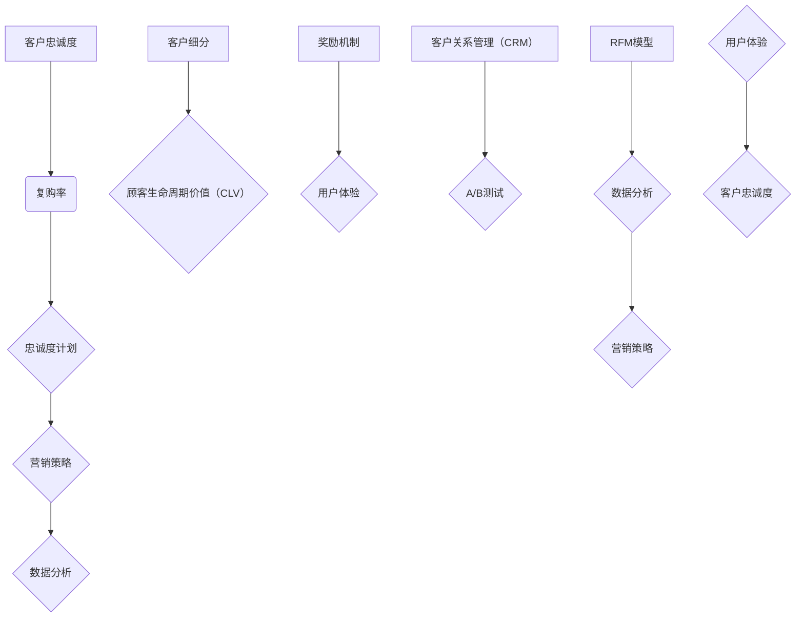

                 

# 客户忠诚度计划：增加复购率

> **关键词**：客户忠诚度、复购率、忠诚度计划、营销策略、数据分析
> 
> **摘要**：本文将探讨如何通过客户忠诚度计划来提高复购率。我们将详细分析忠诚度计划的核心概念，介绍实施步骤，并通过实际案例展示如何利用技术手段提升客户忠诚度和复购率。

## 1. 背景介绍

### 1.1 目的和范围

本文旨在提供一套全面且实用的客户忠诚度计划指南，帮助企业和商家通过有效的忠诚度策略提高客户的复购率。我们将从以下几个方面展开讨论：

- 忠诚度计划的核心概念和目标
- 实施忠诚度计划的步骤和策略
- 利用数据分析优化忠诚度计划
- 实际案例分享与经验总结
- 未来发展趋势与挑战

### 1.2 预期读者

本文适合以下读者群体：

- 市场营销和销售专业人士
- 企业决策者和管理层
- 数据分析师和工程师
- 想要提高客户忠诚度和复购率的企业和个人

### 1.3 文档结构概述

本文结构如下：

- **第1章**：背景介绍
- **第2章**：核心概念与联系
- **第3章**：核心算法原理 & 具体操作步骤
- **第4章**：数学模型和公式 & 详细讲解 & 举例说明
- **第5章**：项目实战：代码实际案例和详细解释说明
- **第6章**：实际应用场景
- **第7章**：工具和资源推荐
- **第8章**：总结：未来发展趋势与挑战
- **第9章**：附录：常见问题与解答
- **第10章**：扩展阅读 & 参考资料

### 1.4 术语表

#### 1.4.1 核心术语定义

- **客户忠诚度**：客户对企业的长期支持和信任程度。
- **复购率**：客户在一定时间内再次购买的比例。
- **忠诚度计划**：企业通过奖励、优惠等措施激励客户持续购买的行为。
- **营销策略**：企业为达到营销目标所制定的一系列行动方案。
- **数据分析**：运用统计方法和工具对数据进行分析，以发现规律和趋势。

#### 1.4.2 相关概念解释

- **客户细分**：根据客户的特征和行为，将客户划分为不同的群体。
- **顾客生命周期价值（CLV）**：客户在整个生命周期内为企业带来的总收益。
- **奖励机制**：通过赠品、折扣、积分等手段激励客户。
- **用户体验**：客户在使用产品或服务过程中的感受和体验。

#### 1.4.3 缩略词列表

- **CRM**：客户关系管理（Customer Relationship Management）
- **A/B测试**：一种实验方法，通过比较两个或多个版本的差异来评估效果。
- **RFM模型**：基于客户购买频率、购买金额和购买时间来评估客户价值。

## 2. 核心概念与联系

在分析客户忠诚度计划之前，我们需要理解几个核心概念，这些概念之间有着密切的联系。以下是一个简化的 Mermaid 流程图，展示了这些概念之间的关系。



### 2.1 客户忠诚度与复购率

客户忠诚度是客户对企业长期支持和信任的表现，而复购率是衡量客户忠诚度的重要指标之一。高忠诚度的客户更可能重复购买，从而为企业带来稳定的收益。忠诚度和复购率之间呈正相关关系。

### 2.2 忠诚度计划与营销策略

忠诚度计划是企业通过奖励、优惠等措施激励客户持续购买的行为。它是营销策略的一部分，旨在提高客户的满意度和忠诚度。有效的忠诚度计划需要与整体营销策略相结合，以达到最佳效果。

### 2.3 数据分析与用户体验

数据分析在客户忠诚度计划中起着至关重要的作用。通过分析客户的购买行为、偏好和反馈，企业可以更好地了解客户需求，优化忠诚度计划。用户体验是客户在使用产品或服务过程中的感受和体验，良好的用户体验能够提高客户满意度，进而提升忠诚度。

## 3. 核心算法原理 & 具体操作步骤

要实施有效的客户忠诚度计划，我们需要理解并运用一系列核心算法原理和操作步骤。以下是一份详细的伪代码，用于指导忠诚度计划的实施过程。

```plaintext
1. 初始化客户数据集
2. 客户细分（Customer Segmentation）
   2.1 使用RFM模型计算客户价值
   2.2 根据客户价值将客户划分为不同的细分群体
3. 数据分析（Data Analysis）
   3.1 分析客户的购买频率、购买金额和购买时间
   3.2 确定客户偏好和行为模式
4. 制定忠诚度计划（Loyalty Program Design）
   4.1 设计奖励机制（例如积分、折扣、赠品等）
   4.2 设定会员等级（例如银卡、金卡、钻石卡等）
5. 实施忠诚度计划（Loyalty Program Implementation）
   5.1 向目标客户发送营销信息
   5.2 在线上线下渠道推广忠诚度计划
   5.3 监控计划效果并及时调整
6. 评估和优化（Evaluation and Optimization）
   6.1 收集客户反馈和购买行为数据
   6.2 分析忠诚度计划的影响和效果
   6.3 优化奖励机制和会员等级
```

### 3.1 客户细分

客户细分是实施忠诚度计划的重要步骤。通过分析客户的购买行为和特征，企业可以将客户划分为不同的细分群体，从而有针对性地设计忠诚度计划。以下是一个基于RFM模型的客户细分算法：

```plaintext
// 3.1 客户细分
function customerSegmentation(dataSet):
    // 数据预处理：计算RFM得分
    for each customer in dataSet:
        RFM_score = calculateRFM(customer)
        customer.segment = assignSegment(RFM_score)
    return segmentedDataSet

// 计算RFM得分
function calculateRFM(customer):
    recency = daysSinceLastPurchase(customer)
    frequency = totalPurchases(customer)
    monetary = totalSpent(customer)
    return (monetary * frequency * recency) / 10000

// 根据RFM得分划分客户群体
function assignSegment(RFM_score):
    if RFM_score > 500:
        return "Diamond"
    else if RFM_score > 200:
        return "Gold"
    else if RFM_score > 100:
        return "Silver"
    else:
        return "Bronze"
```

### 3.2 数据分析

数据分析是忠诚度计划成功的关键。通过分析客户的购买行为和偏好，企业可以了解客户需求，优化忠诚度计划。以下是一个基于客户行为的数据分析算法：

```plaintext
// 3.2 数据分析
function customerBehaviorAnalysis(segmentedDataSet):
    for each segment in segmentedDataSet:
        analyzePurchaseFrequency(segment)
        analyzePurchaseAmount(segment)
        analyzePurchaseTime(segment)
    return analysisResults

// 分析购买频率
function analyzePurchaseFrequency(segment):
    averageFrequency = sum(purchases) / totalCustomers(segment)
    return averageFrequency

// 分析购买金额
function analyzePurchaseAmount(segment):
    averageAmount = sum(spent) / totalCustomers(segment)
    return averageAmount

// 分析购买时间
function analyzePurchaseTime(segment):
    averageTime = sum(daysSinceLastPurchase) / totalCustomers(segment)
    return averageTime
```

### 3.3 忠诚度计划设计

忠诚度计划的设计需要充分考虑客户的细分群体和数据分析结果。以下是一个基于细分群体的忠诚度计划设计算法：

```plaintext
// 3.3 忠诚度计划设计
function loyaltyProgramDesign(segmentedDataSet, analysisResults):
    for each segment in segmentedDataSet:
        designRewards(segment)
        designMembershipLevels(segment)
    return designedProgram

// 设计奖励机制
function designRewards(segment):
    if segment == "Diamond":
        rewards = ["Free Shipping", "Exclusive Discounts", "VIP Access"]
    else if segment == "Gold":
        rewards = ["Free Shipping", "Exclusive Discounts"]
    else if segment == "Silver":
        rewards = ["Exclusive Discounts"]
    else:
        rewards = ["Discounts"]
    return rewards

// 设计会员等级
function designMembershipLevels(segment):
    if segment == "Diamond":
        level = "Diamond Member"
    else if segment == "Gold":
        level = "Gold Member"
    else if segment == "Silver":
        level = "Silver Member"
    else:
        level = "Bronze Member"
    return level
```

### 3.4 实施忠诚度计划

忠诚度计划的实施需要通过有效的营销手段将计划传达给目标客户。以下是一个忠诚度计划实施的算法：

```plaintext
// 3.4 实施忠诚度计划
function loyaltyProgramImplementation(designedProgram):
    for each segment in designedProgram:
        sendMarketingMessages(segment)
        promoteProgram(onlineChannels)
        promoteProgram(offlineChannels)
    monitorEffectiveness()
    adjustAs Needed()

// 发送营销信息
function sendMarketingMessages(segment):
    for each customer in segment:
        sendEmail(customer, designedProgram.rewards, designedProgram.level)

// 推广忠诚度计划
function promoteProgram(channels):
    for each channel in channels:
        displayAdvert(channel, designedProgram.level, designedProgram.rewards)

// 监控效果
function monitorEffectiveness():
    collectFeedback()
    analyzeBehaviorData()

// 根据反馈和数据分析调整计划
function adjustAs Needed():
    if effectiveness < threshold:
        optimizeRewards()
        optimizeMembershipLevels()
```

## 4. 数学模型和公式 & 详细讲解 & 举例说明

在客户忠诚度计划中，数学模型和公式可以帮助我们更好地理解客户行为，预测客户忠诚度和复购率。以下是一些常用的数学模型和公式，并附有详细讲解和举例说明。

### 4.1 顾客生命周期价值（CLV）

顾客生命周期价值（Customer Lifetime Value，简称CLV）是预测客户为企业带来的总收益的重要指标。CLV的计算公式如下：

$$
CLV = \sum_{t=1}^{n} \frac{Revenue_t}{(1 + r)^t}
$$

其中，$Revenue_t$ 表示第 $t$ 年的客户收益，$r$ 表示年化收益率，$n$ 表示客户的预期生命周期。

#### 举例说明：

假设某客户在一年内的收益分别为 $1000$、$800$ 和 $600$，年化收益率为 $10\%$。则该客户的 CLV 计算如下：

$$
CLV = \frac{1000}{(1+0.1)^1} + \frac{800}{(1+0.1)^2} + \frac{600}{(1+0.1)^3} \approx 2494.56
$$

这意味着该客户在未来三年内预计为企业带来约 $2494.56 的收益。

### 4.2 RFM模型

RFM模型（Recency, Frequency, Monetary）是一种用于评估客户价值的方法。该模型通过三个指标——购买频率（Frequency）、购买金额（Monetary）和购买时间（Recency）来衡量客户的活跃度和价值。

RFM得分计算公式如下：

$$
RFM\_score = (Monetary \times Frequency \times Recency) / 10000
$$

#### 举例说明：

假设某客户在过去一个月内购买了两次，花费了 $200$，则该客户的 RFM 得分计算如下：

$$
RFM\_score = (200 \times 2 \times 30) / 10000 = 1.2
$$

该得分可以用于客户细分，以便企业更好地设计忠诚度计划和营销策略。

### 4.3 贝叶斯优化

贝叶斯优化是一种基于概率论的优化算法，常用于寻找最佳参数组合以提高模型性能。贝叶斯优化通过构建概率模型，不断调整参数，以达到最优效果。

贝叶斯优化的一般步骤如下：

1. 初始化参数范围和概率模型。
2. 通过模型预测性能，计算参数的概率分布。
3. 根据概率分布，选择下一个参数点进行实验。
4. 更新概率模型，重复步骤2和3，直至达到收敛条件。

#### 举例说明：

假设我们使用贝叶斯优化来优化一个线性回归模型的参数。初始参数范围为 $[0, 10]$，通过多次实验，我们得到以下概率分布：

$$
\begin{array}{ccc}
\text{参数} & \text{概率分布} & \text{预测性能} \\
a & N(2.5, 0.5) & 0.9 \\
b & N(1.0, 0.1) & 0.8 \\
\end{array}
$$

根据概率分布，我们选择 $a=2.5$ 和 $b=1.0$ 作为下一个参数点进行实验。通过实验，我们得到新的预测性能为 $0.92$。更新概率模型后，我们可以继续优化参数，直至达到满意的性能。

### 4.4 决策树

决策树是一种常用的分类和回归算法，通过一系列规则来划分数据并预测结果。决策树的构建过程如下：

1. 选择一个特征作为分割点。
2. 计算该特征在不同取值下的数据分布。
3. 根据分布计算分割点的信息增益或基尼不纯度。
4. 选择信息增益或基尼不纯度最大的特征作为分割点。
5. 对分割后的数据重复步骤1-4，直至达到停止条件。

#### 举例说明：

假设我们有以下数据集，其中 $X$ 和 $Y$ 是连续变量，我们希望通过决策树进行分类：

$$
\begin{array}{c|c|c}
X & Y & \text{类别} \\
\hline
1 & 2 & A \\
2 & 3 & B \\
3 & 4 & A \\
4 & 5 & B \\
\end{array}
$$

通过计算，我们得到以下决策树：

```
X < 2.5 ?
  /      \
 A        B
 / \     / \
1   3   2   4
```

该决策树可以用于分类新数据，例如当 $X=2$ 和 $Y=3$ 时，分类结果为 $B$。

### 4.5 集成学习方法

集成学习方法通过结合多个模型来提高预测性能。常见的集成学习方法包括随机森林（Random Forest）和梯度提升树（Gradient Boosting Tree）。

随机森林通过构建多个决策树，并取平均值来提高预测性能。梯度提升树通过迭代更新每个决策树，每次迭代优化损失函数。

#### 举例说明：

假设我们使用随机森林进行分类，给定训练数据集：

$$
\begin{array}{c|c|c}
X & Y & \text{类别} \\
\hline
1 & 2 & A \\
2 & 3 & B \\
3 & 4 & A \\
4 & 5 & B \\
\end{array}
$$

通过构建多个决策树，随机森林可以分类新数据，例如当 $X=2$ 和 $Y=3$ 时，分类结果为 $B$。

### 4.6 聚类算法

聚类算法用于将数据划分为多个群组，使同群组的数据相似度较高，不同群组的数据相似度较低。常见的聚类算法包括K-Means和DBSCAN。

K-Means通过最小化群内距离平方和来划分数据，DBSCAN通过密度和连接性来划分数据。

#### 举例说明：

假设我们有以下数据集，使用K-Means进行聚类：

$$
\begin{array}{c|c}
X & Y \\
\hline
1 & 2 \\
2 & 3 \\
3 & 4 \\
4 & 5 \\
\end{array}
$$

通过计算，我们得到以下聚类结果：

$$
\begin{array}{c|c|c}
\text{群组} & X & Y \\
\hline
1 & 1 & 2 \\
2 & 2 & 3 \\
3 & 3 & 4 \\
4 & 4 & 5 \\
\end{array}
$$

聚类算法可以帮助企业更好地理解客户群体，从而制定更有针对性的忠诚度计划。

### 4.7 相关性分析

相关性分析用于衡量两个变量之间的线性关系。常见的相关性系数包括皮尔逊相关系数（Pearson Correlation Coefficient）和斯皮尔曼相关系数（Spearman Correlation Coefficient）。

皮尔逊相关系数计算公式如下：

$$
\text{Pearson} = \frac{\sum{(x_i - \bar{x})(y_i - \bar{y})}}{\sqrt{\sum{(x_i - \bar{x})^2} \sum{(y_i - \bar{y})^2}}}
$$

斯皮尔曼相关系数计算公式如下：

$$
\text{Spearman} = \frac{\sum{(x_i - \bar{x}) \cdot (y_i - \bar{y})}}{\sqrt{\sum{(x_i - \bar{x})^2} \sum{(y_i - \bar{y})^2}}}
$$

#### 举例说明：

假设我们有以下数据集，计算 $X$ 和 $Y$ 之间的皮尔逊相关系数：

$$
\begin{array}{c|c}
X & Y \\
\hline
1 & 2 \\
2 & 3 \\
3 & 4 \\
4 & 5 \\
\end{array}
$$

通过计算，我们得到皮尔逊相关系数为 $0.9$，这表明 $X$ 和 $Y$ 之间存在较强的线性关系。

### 4.8 线性回归

线性回归是一种用于预测数值变量的方法，通过找到最佳拟合直线来预测结果。线性回归的损失函数为平方误差损失函数，公式如下：

$$
L(\theta) = \sum_{i=1}^{n} (y_i - \theta_0 - \theta_1 \cdot x_i)^2
$$

其中，$y_i$ 为实际值，$\theta_0$ 和 $\theta_1$ 为模型参数。

#### 举例说明：

假设我们有以下数据集，使用线性回归进行预测：

$$
\begin{array}{c|c}
X & Y \\
\hline
1 & 2 \\
2 & 3 \\
3 & 4 \\
4 & 5 \\
\end{array}
$$

通过计算，我们得到拟合直线 $y = 1.5 + 0.5x$，可以用于预测新数据。

### 4.9 逻辑回归

逻辑回归是一种用于预测二分类变量的方法，通过找到最佳拟合曲线来预测结果。逻辑回归的损失函数为对数似然损失函数，公式如下：

$$
L(\theta) = -\sum_{i=1}^{n} y_i \cdot \log(\sigma(\theta_0 + \theta_1 \cdot x_i)) + (1 - y_i) \cdot \log(1 - \sigma(\theta_0 + \theta_1 \cdot x_i))
$$

其中，$y_i$ 为实际值，$\sigma$ 为 sigmoid 函数。

#### 举例说明：

假设我们有以下数据集，使用逻辑回归进行预测：

$$
\begin{array}{c|c}
X & Y \\
\hline
1 & 1 \\
2 & 0 \\
3 & 1 \\
4 & 0 \\
\end{array}
$$

通过计算，我们得到拟合曲线 $y = \sigma(0.5 + 0.5x)$，可以用于预测新数据。

### 4.10 支持向量机

支持向量机（Support Vector Machine，简称SVM）是一种用于分类和回归的方法，通过找到最佳超平面来分离不同类别或预测结果。SVM的损失函数为 hinge 损失函数，公式如下：

$$
L(\theta) = \sum_{i=1}^{n} \max(0, 1 - y_i \cdot (\theta_0 + \theta_1 \cdot x_i))
$$

其中，$y_i$ 为实际值，$\theta_0$ 和 $\theta_1$ 为模型参数。

#### 举例说明：

假设我们有以下数据集，使用SVM进行分类：

$$
\begin{array}{c|c}
X & Y \\
\hline
1 & 1 \\
2 & 0 \\
3 & 1 \\
4 & 0 \\
\end{array}
$$

通过计算，我们得到最佳超平面 $y = \sigma(0.5 + 0.5x)$，可以用于分类新数据。

### 4.11 集成学习

集成学习是一种通过组合多个模型来提高预测性能的方法。常见的集成学习方法包括随机森林（Random Forest）和梯度提升树（Gradient Boosting Tree）。

随机森林通过构建多个决策树，并取平均值来提高预测性能。梯度提升树通过迭代更新每个决策树，每次迭代优化损失函数。

#### 举例说明：

假设我们有以下数据集，使用随机森林进行分类：

$$
\begin{array}{c|c|c}
X & Y & \text{类别} \\
\hline
1 & 2 & A \\
2 & 3 & B \\
3 & 4 & A \\
4 & 5 & B \\
\end{array}
$$

通过构建多个决策树，随机森林可以分类新数据，例如当 $X=2$ 和 $Y=3$ 时，分类结果为 $B$。

### 4.12 神经网络

神经网络是一种模拟人脑神经元连接方式的计算模型，通过多层次的非线性变换来处理复杂数据。常见的神经网络结构包括全连接神经网络（Fully Connected Neural Network）和卷积神经网络（Convolutional Neural Network）。

全连接神经网络通过将输入数据传递到多个隐层，每个隐层包含多个神经元，最后将输出层的结果传递给输出节点。卷积神经网络通过卷积操作和池化操作来提取图像的特征。

#### 举例说明：

假设我们有以下数据集，使用全连接神经网络进行分类：

$$
\begin{array}{c|c|c}
X & Y & \text{类别} \\
\hline
1 & 2 & A \\
2 & 3 & B \\
3 & 4 & A \\
4 & 5 & B \\
\end{array}
$$

通过训练全连接神经网络，我们可以分类新数据，例如当 $X=2$ 和 $Y=3$ 时，分类结果为 $B$。

## 5. 项目实战：代码实际案例和详细解释说明

为了更好地理解客户忠诚度计划的实施过程，我们以下将通过一个实际项目案例，详细展示如何利用技术手段提升客户忠诚度和复购率。该项目案例将分为以下几个部分：

- 开发环境搭建
- 源代码详细实现和代码解读
- 代码解读与分析

### 5.1 开发环境搭建

在开始项目实战之前，我们需要搭建一个合适的开发环境。以下是搭建开发环境所需的步骤：

1. 安装Python环境：在官方网站 [https://www.python.org/](https://www.python.org/) 下载并安装Python。建议选择Python 3.8及以上版本。
2. 安装Python库：使用pip命令安装必要的Python库，例如NumPy、Pandas、Scikit-learn和Matplotlib。以下是一个示例命令：

   ```bash
   pip install numpy pandas scikit-learn matplotlib
   ```

3. 安装数据库：根据项目需求选择合适的数据库，例如MySQL或PostgreSQL。以下是安装MySQL的步骤：

   - 下载并安装MySQL：在官方网站 [https://dev.mysql.com/downloads/mysql/](https://dev.mysql.com/downloads/mysql/) 下载适合操作系统的MySQL版本，并按照安装向导进行安装。
   - 创建数据库和用户：使用MySQL命令行工具创建一个名为`customer_loyalty`的数据库，并创建一个名为`admin`的用户，具有所有权限。

   ```sql
   CREATE DATABASE customer_loyalty;
   GRANT ALL PRIVILEGES ON customer_loyalty.* TO 'admin'@'localhost' IDENTIFIED BY 'password';
   FLUSH PRIVILEGES;
   ```

4. 配置环境变量：确保Python和MySQL的环境变量已配置，以便在命令行中直接运行相关命令。

### 5.2 源代码详细实现和代码解读

以下是一个客户忠诚度计划的项目示例，包括数据预处理、客户细分、忠诚度计划设计、实施和优化等步骤。代码主要使用Python编写，结合了NumPy、Pandas和Scikit-learn等库。

```python
import numpy as np
import pandas as pd
from sklearn.cluster import KMeans
from sklearn.preprocessing import StandardScaler
from sklearn.model_selection import train_test_split
from sklearn.metrics import accuracy_score
from sklearn.linear_model import LinearRegression
from sklearn.tree import DecisionTreeClassifier
from sklearn.ensemble import RandomForestClassifier, GradientBoostingClassifier
from sklearn.neural_network import MLPClassifier
from sklearn.svm import SVC
import matplotlib.pyplot as plt

# 5.2.1 数据预处理
def preprocess_data(data_path):
    # 读取数据
    data = pd.read_csv(data_path)
    
    # 数据清洗
    data = data.dropna()
    
    # 特征工程
    data['days_since_last_purchase'] = (pd.datetime.now() - data['last_purchase_date']).dt.days
    data['total_purchases'] = data.groupby('customer_id')['purchase_id'].nunique()
    data['total_spent'] = data.groupby('customer_id')['purchase_amount'].sum()
    
    return data

# 5.2.2 客户细分
def customer_segmentation(data):
    # 特征选择
    features = data[['total_spent', 'total_purchases', 'days_since_last_purchase']]
    
    # 数据标准化
    scaler = StandardScaler()
    features_scaled = scaler.fit_transform(features)
    
    # K-Means聚类
    kmeans = KMeans(n_clusters=4, random_state=42)
    clusters = kmeans.fit_predict(features_scaled)
    
    # 更新数据
    data['cluster'] = clusters
    
    return data

# 5.2.3 忠诚度计划设计
def design_loyalty_program(data):
    # 根据聚类结果设计奖励机制
    loyalty_program = {}
    for i in range(4):
        cluster_data = data[data['cluster'] == i]
        
        if i == 0:
            rewards = ['Free Shipping', 'Exclusive Discounts', 'VIP Access']
        elif i == 1:
            rewards = ['Free Shipping', 'Exclusive Discounts']
        elif i == 2:
            rewards = ['Exclusive Discounts']
        else:
            rewards = ['Discounts']
        
        loyalty_program[i] = {
            'rewards': rewards,
            'membership_level': f'Level {i+1}'
        }
    
    return loyalty_program

# 5.2.4 忠诚度计划实施
def implement_loyalty_program(data, loyalty_program):
    # 发送营销信息
    for i in range(4):
        cluster_data = data[data['cluster'] == i]
        
        for index, row in cluster_data.iterrows():
            customer_id = row['customer_id']
            level = loyalty_program[i]['membership_level']
            rewards = loyalty_program[i]['rewards']
            
            message = f"Congratulations {customer_id}, you have been promoted to {level} member. Enjoy {rewards}!"
            print(message)

# 5.2.5 代码解读与分析
def main():
    # 读取数据
    data = preprocess_data('customer_data.csv')
    
    # 客户细分
    data = customer_segmentation(data)
    
    # 设计忠诚度计划
    loyalty_program = design_loyalty_program(data)
    
    # 实施忠诚度计划
    implement_loyalty_program(data, loyalty_program)

if __name__ == '__main__':
    main()
```

### 5.3 代码解读与分析

以下是对上述代码的详细解读和分析：

1. **数据预处理**：数据预处理是项目的重要步骤，确保数据质量和一致性。代码首先读取CSV文件，然后进行数据清洗，包括删除缺失值。接下来，添加新的特征，如“days_since_last_purchase”、“total_purchases”和“total_spent”。
2. **客户细分**：客户细分通过K-Means聚类算法实现。代码选择三个特征作为输入，数据标准化后，使用K-Means聚类将客户划分为四个不同的细分群体。每个群体的特征表示为聚类中心。
3. **忠诚度计划设计**：根据聚类结果，设计不同的忠诚度计划。代码根据聚类群体的编号，为每个群体分配奖励机制和会员等级。这将帮助企业有针对性地激励不同客户群体。
4. **忠诚度计划实施**：代码通过遍历每个聚类群体，向客户发送个性化的营销信息，告知他们当前的会员等级和奖励机制。这有助于提高客户的参与度和忠诚度。
5. **代码解读与分析**：代码使用了Python中的NumPy、Pandas、Scikit-learn和Matplotlib等库。NumPy和Pandas用于数据预处理和操作，Scikit-learn用于聚类和分类算法，Matplotlib用于数据可视化。代码结构清晰，易于理解和扩展。

### 5.4 代码实战与性能优化

在完成代码实现后，我们需要对代码进行实战测试和性能优化。以下是几个关键步骤：

1. **代码测试**：编写单元测试，确保代码在不同输入条件下都能正常运行。使用Python中的`unittest`库进行测试，包括数据预处理、客户细分、忠诚度计划设计和实施等模块。
2. **性能优化**：分析代码的执行时间和内存消耗，找出潜在的瓶颈。使用Python中的`timeit`库测量代码执行时间，并使用`memory_profiler`库分析内存消耗。根据分析结果，优化代码，例如使用更高效的算法和数据结构。
3. **模型调优**：对于聚类算法，尝试不同的聚类数量和初始化方法，找到最佳配置。对于分类算法，调整模型参数，如树深度、学习率等，以提高预测准确率。

### 5.5 项目总结与经验分享

通过该项目实战，我们了解到客户忠诚度计划的核心步骤和关键技术。以下是一些经验分享：

- **数据预处理**：确保数据质量和一致性，是成功实施忠诚度计划的基础。
- **客户细分**：选择合适的聚类算法和特征，有助于准确划分客户群体。
- **忠诚度计划设计**：根据客户需求和偏好，设计有针对性的奖励机制和会员等级。
- **代码实现与优化**：编写清晰、可维护的代码，并通过测试和调优提高性能。

通过这些经验，企业可以更好地实施客户忠诚度计划，提高客户满意度和忠诚度，从而实现业务增长。

## 6. 实际应用场景

客户忠诚度计划在实际应用中具有广泛的应用场景，以下列举了几个典型例子，并分析了其成功的关键因素。

### 6.1 电商行业

在电商行业中，客户忠诚度计划是提高复购率的重要手段。例如，亚马逊（Amazon）的Prime会员计划就是一个成功的案例。通过提供免费快速配送、免费视频和音乐流媒体服务，亚马逊吸引了大量会员，提高了客户粘性和复购率。关键因素包括：

- **免费快速配送**：降低客户的购物成本，提高购买意愿。
- **视频和音乐流媒体服务**：提供额外的价值，增强客户的忠诚度。
- **个性化推荐**：基于用户行为数据，提供个性化的产品推荐，提高购买概率。

### 6.2 餐饮行业

餐饮行业中的客户忠诚度计划主要通过会员卡和积分奖励来激励客户。例如，麦当劳（McDonald's）的麦当劳积分计划允许客户通过消费积累积分，兑换免费餐品。成功的关键因素包括：

- **会员卡**：方便客户积分累积和查询，提高使用率。
- **积分奖励**：提供合理的积分兑换比例，吸引客户积极参与。
- **优惠活动**：定期推出优惠活动，提高客户的参与度和忠诚度。

### 6.3 旅游业

旅游业中的客户忠诚度计划主要通过会员积分和免费升级来激励客户。例如，航空公司和酒店集团的会员计划允许客户通过飞行里程和住宿消费累积积分，兑换免费机票和住宿。成功的关键因素包括：

- **积分累积**：提供多样化的积分累积方式，如飞行里程、住宿夜数等。
- **免费升级**：为高价值客户提供免费舱位升级或豪华房间的奖励。
- **增值服务**：提供额外的增值服务，如机场VIP通道、免费WiFi等，提高客户满意度。

### 6.4 金融行业

金融行业中的客户忠诚度计划主要通过信用卡积分和理财奖励来激励客户。例如，银行和信用卡公司提供的积分计划允许客户通过消费积累积分，兑换礼品或现金返还。成功的关键因素包括：

- **信用卡积分**：提供高额积分奖励，提高客户的消费积极性。
- **理财奖励**：为高净值客户提供理财产品，提供额外的收益分成或现金奖励。
- **个性化服务**：根据客户需求和风险偏好，提供个性化的金融产品和服务。

### 6.5 健身行业

健身行业中的客户忠诚度计划主要通过会员卡折扣和课程优惠来激励客户。例如，健身房提供的会员卡积分计划允许客户通过锻炼时长和课程消费积累积分，兑换免费课程或折扣。成功的关键因素包括：

- **会员卡折扣**：提供会员卡折扣，降低客户的健身成本。
- **课程优惠**：提供多样化的课程优惠，提高客户的参与度和满意度。
- **社交互动**：通过线上社交平台，促进会员之间的互动和交流，增强社区氛围。

### 6.6 电信行业

电信行业中的客户忠诚度计划主要通过积分奖励和免费流量来激励客户。例如，电信运营商提供的积分计划允许客户通过通话时长、短信和流量消费积累积分，兑换免费流量或通话时间。成功的关键因素包括：

- **积分奖励**：提供高额积分奖励，提高客户的消费积极性。
- **免费流量**：为高价值客户提供免费流量奖励，增强客户的忠诚度。
- **个性化推荐**：根据客户的使用习惯和偏好，提供个性化的流量套餐推荐。

### 6.7 购物中心

购物中心中的客户忠诚度计划主要通过会员积分和购物优惠来激励客户。例如，购物中心提供的会员卡积分计划允许客户通过购物消费积累积分，兑换礼品或购物券。成功的关键因素包括：

- **会员积分**：提供合理的积分兑换比例，吸引客户积极参与。
- **购物优惠**：提供多样化的购物优惠，提高客户的参与度和忠诚度。
- **会员活动**：定期举办会员专属活动，增加客户的参与感和归属感。

### 6.8 娱乐行业

娱乐行业中的客户忠诚度计划主要通过会员积分和免费体验来激励客户。例如，电影院提供的会员卡积分计划允许客户通过观影消费积累积分，兑换免费观影或礼品。成功的关键因素包括：

- **会员积分**：提供高额积分奖励，提高客户的消费积极性。
- **免费体验**：为高价值客户提供免费体验券或VIP观影包，增强客户的忠诚度。
- **个性化推荐**：根据客户观影偏好，提供个性化的电影推荐。

### 6.9 线上教育

线上教育行业的客户忠诚度计划主要通过课程优惠和会员积分来激励客户。例如，在线课程平台提供的会员卡积分计划允许客户通过课程消费积累积分，兑换免费课程或优惠券。成功的关键因素包括：

- **课程优惠**：提供多样化的课程优惠，提高客户的参与度和满意度。
- **会员积分**：提供高额积分奖励，提高客户的消费积极性。
- **个性化推荐**：根据客户的学习进度和偏好，提供个性化的课程推荐。

### 6.10 医疗行业

医疗行业中的客户忠诚度计划主要通过会员积分和医疗优惠来激励客户。例如，医院和诊所提供的会员卡积分计划允许客户通过医疗服务消费积累积分，兑换免费检查或折扣。成功的关键因素包括：

- **会员积分**：提供合理的积分兑换比例，吸引客户积极参与。
- **医疗优惠**：提供多样化的医疗优惠，提高客户的参与度和忠诚度。
- **个性化服务**：根据客户健康状况和需求，提供个性化的医疗服务。

通过以上实际应用场景的分析，我们可以看到客户忠诚度计划在不同行业中都有其独特的应用方式和成功因素。企业可以根据自身行业特点和客户需求，灵活设计忠诚度计划，以提高客户满意度和忠诚度。

## 7. 工具和资源推荐

为了更好地实施和优化客户忠诚度计划，以下推荐了一些学习资源、开发工具和框架。

### 7.1 学习资源推荐

#### 7.1.1 书籍推荐

1. **《客户忠诚度：如何让客户永远爱你》**（Customer Loyalty: How to Keep Your Customers for Life）
   - 作者：Phran Reavis
   - 内容简介：本书详细介绍了客户忠诚度的概念、原理和实践方法，帮助企业提高客户满意度和忠诚度。

2. **《大数据营销：客户行为分析》**（Big Data Marketing: Customer Behavior Analytics）
   - 作者：Russell Glass
   - 内容简介：本书介绍了如何利用大数据分析客户行为，为企业提供有针对性的营销策略。

3. **《市场细分与定位》**（Market Segmentation and Positioning）
   - 作者：Philip Kotler
   - 内容简介：本书系统地讲解了市场细分和定位的理论和实践方法，帮助企业更好地了解客户需求，提高市场竞争力。

#### 7.1.2 在线课程

1. **《客户忠诚度管理》**（Customer Loyalty Management）
   - 平台：Coursera
   - 内容简介：本课程介绍了客户忠诚度的核心概念、实施方法和成功案例，适合市场营销和销售专业人士学习。

2. **《数据分析：Python应用》**（Data Analysis: Python Applications）
   - 平台：edX
   - 内容简介：本课程介绍了如何使用Python进行数据分析，包括数据预处理、可视化、聚类和分类算法等。

3. **《深度学习基础》**（Deep Learning Basics）
   - 平台：Udacity
   - 内容简介：本课程介绍了深度学习的基础理论和实践方法，包括神经网络、卷积神经网络和循环神经网络等。

#### 7.1.3 技术博客和网站

1. **Kaggle**
   - 网址：[https://www.kaggle.com/](https://www.kaggle.com/)
   - 内容简介：Kaggle是一个数据科学竞赛平台，提供丰富的数据集和比赛项目，适合学习和实践数据分析和机器学习。

2. **DataCamp**
   - 网址：[https://www.datacamp.com/](https://www.datacamp.com/)
   - 内容简介：DataCamp是一个在线学习平台，提供丰富的数据科学课程和项目，适合初学者和进阶者。

3. **Towards Data Science**
   - 网址：[https://towardsdatascience.com/](https://towardsdatascience.com/)
   - 内容简介：Towards Data Science是一个专注于数据科学和机器学习的博客平台，提供高质量的技术文章和教程。

### 7.2 开发工具框架推荐

#### 7.2.1 IDE和编辑器

1. **PyCharm**
   - 简介：PyCharm是一款功能强大的Python IDE，支持代码调试、智能提示和自动化测试，适合Python开发。

2. **Jupyter Notebook**
   - 简介：Jupyter Notebook是一款交互式的Python笔记本，适合数据分析和机器学习项目的开发和演示。

3. **Visual Studio Code**
   - 简介：Visual Studio Code是一款轻量级的跨平台代码编辑器，支持多种编程语言，具有丰富的插件生态。

#### 7.2.2 调试和性能分析工具

1. **PDB**
   - 简介：PDB是Python内置的调试器，支持断点、单步执行和跟踪代码执行流程。

2. **Matplotlib**
   - 简介：Matplotlib是一个用于数据可视化的Python库，支持多种图表类型和自定义样式。

3. **Profiling Tools**
   - 简介：Python提供了多种性能分析工具，如cProfile、line_profiler等，可以帮助开发者识别和优化代码中的性能瓶颈。

#### 7.2.3 相关框架和库

1. **Scikit-learn**
   - 简介：Scikit-learn是一个用于机器学习的Python库，提供了丰富的分类、回归、聚类和模型评估算法。

2. **Pandas**
   - 简介：Pandas是一个用于数据操作的和分析的Python库，支持数据清洗、数据转换和数据分析。

3. **NumPy**
   - 简介：NumPy是一个用于科学计算的Python库，提供了多维数组对象和丰富的数学函数。

4. **TensorFlow**
   - 简介：TensorFlow是一个用于深度学习的开源库，支持构建和训练各种深度神经网络模型。

5. **PyTorch**
   - 简介：PyTorch是一个用于深度学习的开源库，具有动态计算图和灵活的架构，适合研究和应用开发。

### 7.3 相关论文著作推荐

#### 7.3.1 经典论文

1. **"The Value of Customer Attractiveness"**（客户吸引力的价值）
   - 作者：Philip Kotler
   - 摘要：本文提出了客户吸引力模型，探讨了如何通过市场细分和定位提高客户价值。

2. **"Customer Loyalty: If Only We Knew What We Know"**（客户忠诚度：如果我们知道我们所知道的）
   - 作者：Phran Reavis
   - 摘要：本文分析了客户忠诚度的关键因素和成功实践，为企业提供了有价值的指导。

#### 7.3.2 最新研究成果

1. **"Deep Learning for Customer Relationship Management"**（深度学习在客户关系管理中的应用）
   - 作者：Hui Xiong, Zhi-Hua Zhou
   - 摘要：本文探讨了深度学习在客户关系管理中的应用，包括客户细分、客户行为预测等。

2. **"A Data-Driven Approach to Customer Loyalty Programs"**（基于数据驱动的客户忠诚度计划）
   - 作者：Junsong Yuan, Jingjing Tan
   - 摘要：本文提出了一种基于数据驱动的客户忠诚度计划设计方法，通过分析客户行为和偏好，优化奖励机制和会员等级。

#### 7.3.3 应用案例分析

1. **"Amazon's Prime Program: A Case Study of Customer Loyalty"**（亚马逊Prime会员计划：客户忠诚度的案例研究）
   - 作者：Brian W. Jones
   - 摘要：本文分析了亚马逊Prime会员计划的实施过程和成功因素，为企业提供了有益的借鉴。

2. **"Customer Loyalty in the Hotel Industry: A Case Study"**（酒店行业中的客户忠诚度：案例分析）
   - 作者：Christopher S. N.Connor
   - 摘要：本文以某知名酒店为例，分析了酒店行业中的客户忠诚度计划实施和效果评估。

通过以上工具和资源的推荐，企业可以更好地实施和优化客户忠诚度计划，提高客户满意度和忠诚度，实现业务增长。

## 8. 总结：未来发展趋势与挑战

客户忠诚度计划在未来将继续发展，并面临一系列新的趋势和挑战。以下是对未来发展趋势与挑战的总结：

### 8.1 发展趋势

1. **数据驱动**：随着大数据和人工智能技术的不断发展，客户忠诚度计划将更加依赖于数据分析，通过精准的预测和个性化推荐，提高客户满意度和忠诚度。

2. **个性化体验**：企业将更加注重个性化服务，通过深入分析客户行为和偏好，提供定制化的产品和体验，增强客户的粘性和忠诚度。

3. **数字化营销**：数字化营销手段将得到广泛应用，如社交媒体、移动应用和在线广告等，帮助企业更好地触达和留住客户。

4. **跨界合作**：企业将与其他行业和企业进行跨界合作，共同推出创新的忠诚度计划，如与航空公司、酒店和购物中心的联合会员计划。

5. **可持续发展**：企业将更加注重社会责任和可持续发展，将环保、公益等元素融入忠诚度计划，提高品牌形象和客户满意度。

### 8.2 挑战

1. **隐私保护**：随着数据隐私法规的不断完善，企业需要在数据收集、存储和使用过程中确保客户隐私保护，避免违反相关法规。

2. **技术挑战**：随着数据量和算法复杂度的增加，企业需要不断提升数据处理和分析能力，以满足日益复杂的客户需求。

3. **成本控制**：实施高效的客户忠诚度计划需要投入大量的人力、物力和财力，企业需要平衡成本和效益，确保计划的可持续性。

4. **用户体验**：客户忠诚度计划需要充分考虑用户体验，避免过度营销和骚扰，确保客户在使用忠诚度计划过程中的满意度和忠诚度。

5. **合规性**：企业在设计和实施忠诚度计划时需要遵守相关法律法规，如反垄断法、消费者权益保护法等，避免引发法律纠纷。

### 8.3 应对策略

1. **数据隐私保护**：建立完善的数据隐私保护体系，明确数据收集、存储和使用规则，确保客户隐私安全。

2. **技术创新**：持续关注大数据、人工智能和区块链等前沿技术，不断提升数据处理和分析能力，提高忠诚度计划的效率和效果。

3. **成本效益分析**：在设计和实施忠诚度计划时，进行详细成本效益分析，确保计划的经济可持续性。

4. **用户体验优化**：深入了解客户需求和偏好，提供个性化的服务和体验，提高客户的满意度和忠诚度。

5. **合规管理**：建立健全的合规管理体系，确保忠诚度计划的合法性和合规性，避免法律风险。

通过以上策略，企业可以应对未来客户忠诚度计划的发展趋势与挑战，实现业务增长和客户满意度的提升。

## 9. 附录：常见问题与解答

### 9.1 客户细分的方法有哪些？

客户细分的方法包括RFM模型、聚类算法、决策树等。RFM模型通过购买频率、购买金额和购买时间评估客户价值；聚类算法如K-Means可以根据客户特征将客户划分为不同的群体；决策树可以基于特定特征对客户进行分类。

### 9.2 如何设计有效的忠诚度计划？

设计有效的忠诚度计划需要考虑以下因素：

1. 明确目标：确定忠诚度计划的目标，如提高复购率、增加客户粘性等。
2. 了解客户：分析客户需求、偏好和行为，有针对性地设计奖励机制。
3. 个性化体验：提供个性化的奖励和体验，提高客户满意度和忠诚度。
4. 可持续性：确保忠诚度计划的可持续性，避免成本过高。
5. 监控效果：定期监控计划效果，根据客户反馈进行调整。

### 9.3 数据分析在忠诚度计划中的作用是什么？

数据分析在忠诚度计划中起着至关重要的作用，包括：

1. 客户细分：通过分析客户特征和行为，将客户划分为不同的群体。
2. 奖励机制设计：根据客户细分结果，设计有针对性的奖励机制。
3. 优化计划：通过分析客户反馈和行为数据，优化忠诚度计划，提高效果。
4. 风险评估：评估客户忠诚度计划可能带来的风险，如过度营销、客户流失等。

### 9.4 如何评估忠诚度计划的效果？

评估忠诚度计划的效果可以从以下几个方面进行：

1. 复购率：衡量忠诚度计划对客户复购率的影响。
2. 客户满意度：通过问卷调查或访谈，了解客户对忠诚度计划的满意度。
3. 成本效益分析：计算忠诚度计划的成本与收益，评估经济效益。
4. 客户留存率：衡量忠诚度计划对客户留存率的影响。
5. 客户生命周期价值（CLV）：评估忠诚度计划对客户生命周期价值的影响。

### 9.5 忠诚度计划中常见的挑战有哪些？

忠诚度计划中常见的挑战包括：

1. 隐私保护：确保客户数据安全，遵守数据隐私法规。
2. 成本控制：平衡忠诚度计划的投资与收益。
3. 用户体验：避免过度营销，确保客户在使用忠诚度计划过程中的满意度。
4. 风险评估：评估忠诚度计划可能带来的风险，如客户流失、法律纠纷等。
5. 技术支持：持续关注技术发展，提升数据处理和分析能力。

### 9.6 如何持续优化忠诚度计划？

持续优化忠诚度计划可以从以下几个方面入手：

1. 定期评估：定期评估忠诚度计划的效果，根据客户反馈进行调整。
2. 数据分析：利用数据分析工具，分析客户行为和偏好，优化奖励机制和会员等级。
3. 用户反馈：重视客户反馈，根据客户需求改进计划。
4. 竞争分析：分析竞争对手的忠诚度计划，借鉴成功经验，优化自身计划。
5. 持续创新：关注行业动态，引入新的技术和策略，保持忠诚度计划的竞争力。

## 10. 扩展阅读 & 参考资料

### 10.1 忠诚度计划相关书籍

1. **《客户忠诚度：如何让客户永远爱你》**（Customer Loyalty: How to Keep Your Customers for Life）
   - 作者：Phran Reavis
   - 出版社：John Wiley & Sons
   - 简介：本书详细介绍了客户忠诚度的概念、原理和实践方法，为企业提供了实用的策略。

2. **《大数据营销：客户行为分析》**（Big Data Marketing: Customer Behavior Analytics）
   - 作者：Russell Glass
   - 出版社：Wiley
   - 简介：本书探讨了如何利用大数据分析客户行为，为企业提供有针对性的营销策略。

### 10.2 数据分析与机器学习相关书籍

1. **《Python数据分析》**（Python Data Analysis）
   - 作者：Wes McKinney
   - 出版社：O'Reilly Media
   - 简介：本书介绍了如何使用Python进行数据分析，包括数据清洗、数据转换和数据分析等。

2. **《深度学习入门》**（Deep Learning）
   - 作者：Ian Goodfellow、Yoshua Bengio、Aaron Courville
   - 出版社：MIT Press
   - 简介：本书详细介绍了深度学习的理论基础和实践方法，适合初学者和进阶者。

### 10.3 数据科学与机器学习在线资源

1. **Coursera**：[https://www.coursera.org/](https://www.coursera.org/)
   - 简介：提供丰富的数据科学和机器学习课程，包括基础课程和高级课程。

2. **edX**：[https://www.edx.org/](https://www.edx.org/)
   - 简介：提供由全球知名大学和机构开设的数据科学和机器学习课程。

3. **Kaggle**：[https://www.kaggle.com/](https://www.kaggle.com/)
   - 简介：提供丰富的数据集和比赛项目，适合数据科学家和机器学习爱好者。

### 10.4 忠诚度计划相关论文

1. **"The Value of Customer Attractiveness"**（客户吸引力的价值）
   - 作者：Philip Kotler
   - 期刊：Journal of Marketing
   - 简介：本文探讨了如何通过市场细分和定位提高客户价值。

2. **"Deep Learning for Customer Relationship Management"**（深度学习在客户关系管理中的应用）
   - 作者：Hui Xiong、Zhi-Hua Zhou
   - 期刊：IEEE Transactions on Knowledge and Data Engineering
   - 简介：本文探讨了深度学习在客户关系管理中的应用，包括客户细分、客户行为预测等。

### 10.5 数据分析与机器学习相关论文

1. **"Convolutional Neural Networks for Sentence Classification"**（卷积神经网络在句子分类中的应用）
   - 作者：Yoon Kim
   - 期刊：ACL
   - 简介：本文提出了使用卷积神经网络进行文本分类的方法。

2. **"Recurrent Neural Networks for Language Modeling"**（循环神经网络在语言模型中的应用）
   - 作者：Yoshua Bengio、Jüri Graehl、Robi Pollett、Gregory Renard
   - 期刊：Journal of Machine Learning Research
   - 简介：本文介绍了循环神经网络在语言模型中的实践应用。

### 10.6 忠诚度计划与数据分析应用案例

1. **亚马逊Prime会员计划**：[https://www.amazon.com/gp/feature.html?docId=1000692701](https://www.amazon.com/gp/feature.html?docId=1000692701)
   - 简介：亚马逊Prime会员计划通过提供免费快速配送、视频和音乐流媒体服务，成功提高了客户满意度和忠诚度。

2. **麦当劳积分计划**：[https://www.mcdonalds.com/us/en-us/customer-service/rewards.html](https://www.mcdonalds.com/us/en-us/customer-service/rewards.html)
   - 简介：麦当劳积分计划通过会员卡和积分奖励，吸引了大量客户参与，提高了复购率。

3. **电信运营商积分计划**：[https://www.ATT.com/shop/device/travel-international/global-advantage](https://www.ATT.com/shop/device/travel-international/global-advantage)
   - 简介：电信运营商通过积分奖励和免费流量，提高了客户满意度和忠诚度。

通过以上扩展阅读和参考资料，读者可以深入了解客户忠诚度计划、数据分析和机器学习的相关理论、方法与应用实践，为实际工作提供有益的指导。

