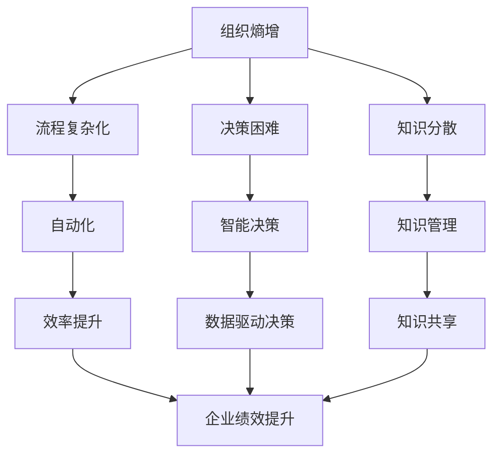

                 

# 对抗组织熵增：AI与企业的协同

> **关键词：** 组织熵增、人工智能、协同、优化、数字化转型、企业绩效
> 
> **摘要：** 在数字化转型的浪潮中，企业面临组织熵增的挑战。本文探讨了人工智能在对抗组织熵增方面的作用，通过逐步分析AI的核心概念、算法原理、数学模型，以及实际应用案例，提出了AI与企业的协同策略，旨在提高企业效率和绩效。

## 1. 背景介绍

### 1.1 目的和范围

本文旨在探讨人工智能（AI）在企业中的应用，特别是在对抗组织熵增方面的潜力。我们将深入分析AI的核心概念、算法原理、数学模型，并借助实际案例展示AI如何与企业协同工作，以提高企业效率和绩效。

### 1.2 预期读者

本文适合对AI和企业管理有一定了解的读者，包括技术专家、企业管理者、研究人员以及对数字化转型感兴趣的个人。

### 1.3 文档结构概述

本文将分为以下几个部分：

1. **背景介绍**：介绍本文的目的、预期读者以及文档结构。
2. **核心概念与联系**：解释组织熵增的概念，并使用Mermaid流程图展示AI与组织熵增的关联。
3. **核心算法原理 & 具体操作步骤**：详细介绍AI算法原理和操作步骤。
4. **数学模型和公式 & 详细讲解 & 举例说明**：讲解数学模型及其应用。
5. **项目实战：代码实际案例和详细解释说明**：提供代码实现和解读。
6. **实际应用场景**：探讨AI在不同企业场景中的应用。
7. **工具和资源推荐**：推荐学习资源和开发工具。
8. **总结：未来发展趋势与挑战**：展望AI在企业中的未来。
9. **附录：常见问题与解答**：解答读者可能遇到的问题。
10. **扩展阅读 & 参考资料**：提供进一步阅读的资源。

### 1.4 术语表

#### 1.4.1 核心术语定义

- **组织熵增**：指企业内部组织结构、流程、知识等随时间推移而逐渐复杂化、无序化，导致效率降低的现象。
- **人工智能（AI）**：指计算机系统模拟人类智能行为，包括学习、推理、感知、决策等能力的技术。
- **协同**：指不同实体（如AI和企业）通过合作、协调实现共同目标的过程。

#### 1.4.2 相关概念解释

- **数字化转型**：指企业利用数字技术进行业务流程的重新设计，以提高效率、创造新价值。
- **企业绩效**：指企业在一定时间内实现的目标和成果。

#### 1.4.3 缩略词列表

- **AI**：人工智能
- **ML**：机器学习
- **DL**：深度学习
- **NLP**：自然语言处理

## 2. 核心概念与联系

组织熵增是一个普遍存在于企业中的现象，它影响着企业的效率和创新能力。熵增是指系统随时间推移而逐渐失序、复杂化的过程。在企业管理中，熵增可能导致组织结构过于复杂、决策流程缓慢、知识共享困难等问题。


图1：组织熵增与AI的关联

上图中，我们可以看到组织熵增对企业的影响，以及AI如何通过自动化、智能决策等技术手段来对抗熵增。具体来说，AI可以在以下几个方面发挥重要作用：

- **流程优化**：通过自动化和优化，减少冗余流程，提高效率。
- **数据挖掘**：利用大数据分析技术，挖掘隐藏在数据中的价值，支持决策。
- **智能决策**：借助机器学习和深度学习算法，为企业提供基于数据的决策支持。
- **知识管理**：通过AI技术，实现知识的自动化收集、整理和共享，降低知识熵增。

下面我们将使用Mermaid流程图，展示AI与组织熵增之间的关联。



图2：AI对抗组织熵增的流程图

通过上述分析，我们可以看到，AI在对抗组织熵增方面具有巨大的潜力。接下来，我们将深入探讨AI的核心算法原理和具体操作步骤。

## 3. 核心算法原理 & 具体操作步骤

### 3.1 机器学习算法原理

机器学习（ML）是AI的核心技术之一。它的基本原理是通过数据训练模型，使模型能够从数据中学习规律，并在新的数据上进行预测或决策。以下是机器学习算法的基本流程：

```plaintext
1. 数据收集：收集大量的数据，这些数据应包含输入特征和相应的输出结果。
2. 数据预处理：对数据进行清洗、归一化等处理，使其适合模型训练。
3. 模型选择：选择合适的机器学习算法，如线性回归、决策树、支持向量机等。
4. 模型训练：使用训练数据集，通过优化算法（如梯度下降）调整模型参数。
5. 模型评估：使用测试数据集评估模型性能，如准确率、召回率等。
6. 模型部署：将训练好的模型部署到实际应用中，进行预测或决策。
```

### 3.2 深度学习算法原理

深度学习（DL）是ML的一种重要分支，它通过多层神经网络模型，对数据进行深度学习，从而实现更复杂的任务。以下是深度学习算法的基本流程：

```plaintext
1. 神经网络构建：设计并构建神经网络结构，包括输入层、隐藏层和输出层。
2. 激活函数选择：为每个神经元选择合适的激活函数，如ReLU、Sigmoid、Tanh等。
3. 损失函数选择：选择合适的损失函数，如均方误差（MSE）、交叉熵等。
4. 模型训练：使用反向传播算法，通过梯度下降优化模型参数。
5. 模型评估：使用测试数据集评估模型性能。
6. 模型部署：将训练好的模型部署到实际应用中。
```

### 3.3 自然语言处理算法原理

自然语言处理（NLP）是AI的一个重要领域，它使计算机能够理解和生成人类语言。以下是NLP算法的基本流程：

```plaintext
1. 语言模型训练：使用大规模语料库训练语言模型，如n-gram模型、循环神经网络（RNN）等。
2. 分词与词性标注：对文本进行分词和词性标注，以便后续处理。
3. 句法分析：分析句子的结构，提取句子中的语法关系。
4. 情感分析：通过分析文本的情感倾向，如正面、负面等。
5. 语义理解：理解文本的含义，如语义角色标注、实体识别等。
6. 文本生成：生成符合语法和语义规则的文本。
```

### 3.4 智能决策算法原理

智能决策是AI在企业管理中的核心应用之一。它通过数据分析和机器学习算法，为企业的决策提供支持。以下是智能决策算法的基本流程：

```plaintext
1. 数据收集：收集与企业决策相关的数据，如销售数据、市场数据、客户反馈等。
2. 数据预处理：对数据进行清洗、归一化等处理。
3. 特征工程：提取对决策有用的特征，如客户特征、产品特征等。
4. 模型选择：选择合适的机器学习算法，如决策树、支持向量机等。
5. 模型训练：使用训练数据集训练模型。
6. 模型评估：使用测试数据集评估模型性能。
7. 决策支持：将训练好的模型应用于实际决策场景，提供决策支持。
```

通过上述分析，我们可以看到，AI的核心算法原理包括机器学习、深度学习和自然语言处理等方面。这些算法在企业管理中有着广泛的应用，可以帮助企业对抗组织熵增，提高效率和绩效。接下来，我们将探讨数学模型和公式，以进一步理解AI在企业管理中的具体应用。

## 4. 数学模型和公式 & 详细讲解 & 举例说明

在AI的应用中，数学模型和公式起着至关重要的作用。它们不仅帮助算法理解和分析数据，还为企业的决策提供了理论基础。以下我们将详细讲解几个关键的数学模型和公式，并举例说明其应用。

### 4.1 梯度下降算法

梯度下降算法是机器学习和深度学习中最基本的优化算法之一。它通过不断调整模型参数，以最小化损失函数。

**公式：**

$$\text{w}_{\text{new}} = \text{w}_{\text{current}} - \alpha \cdot \nabla_{\text{w}} J(\text{w})$$

其中：

- \( \text{w}_{\text{current}} \)：当前模型参数。
- \( \text{w}_{\text{new}} \)：更新后的模型参数。
- \( \alpha \)：学习率，控制参数更新的步长。
- \( \nabla_{\text{w}} J(\text{w}) \)：损失函数 \( J(\text{w}) \) 关于参数 \( \text{w} \) 的梯度。

**示例：**

假设我们有一个简单的线性回归模型，其损失函数为：

$$ J(\text{w}) = \frac{1}{2} \sum_{i=1}^{n} (\text{y}_i - \text{w} \cdot \text{x}_i)^2 $$

其中：

- \( \text{y}_i \)：实际输出。
- \( \text{x}_i \)：输入特征。
- \( \text{w} \)：模型参数。

使用梯度下降算法，我们可以更新模型参数 \( \text{w} \)，以最小化损失函数。

### 4.2 交叉熵损失函数

交叉熵损失函数在分类问题中广泛应用。它衡量的是预测概率与真实标签之间的差异。

**公式：**

$$ J(\text{w}) = -\sum_{i=1}^{n} \text{y}_i \cdot \log(\text{p}_i) $$

其中：

- \( \text{y}_i \)：真实标签，取值为0或1。
- \( \text{p}_i \)：预测概率，即模型预测的输出。

**示例：**

假设我们有一个二分类问题，实际标签为 \( \text{y} = [1, 0, 1] \)，预测概率为 \( \text{p} = [0.8, 0.2, 0.9] \)。

使用交叉熵损失函数，我们可以计算损失：

$$ J(\text{w}) = -[1 \cdot \log(0.8) + 0 \cdot \log(0.2) + 1 \cdot \log(0.9)] \approx -[0.223 + 0 + 0.105] \approx -0.328 $$

### 4.3 神经网络中的激活函数

激活函数在神经网络中起着关键作用，它将神经元的线性组合映射到非线性的输出。

**公式：**

$$ \text{a} = \text{f}(\text{z}) $$

其中：

- \( \text{a} \)：输出。
- \( \text{z} \)：线性组合。
- \( \text{f}(\text{z}) \)：激活函数。

常见的激活函数包括：

- **Sigmoid函数**：\( \text{f}(\text{z}) = \frac{1}{1 + e^{-\text{z}}} \)
- **ReLU函数**：\( \text{f}(\text{z}) = \max(0, \text{z}) \)
- **Tanh函数**：\( \text{f}(\text{z}) = \frac{e^{\text{z}} - e^{-\text{z}}}{e^{\text{z}} + e^{-\text{z}}} \)

**示例：**

假设我们有一个ReLU函数，输入为 \( \text{z} = [-2, -1, 0, 1, 2] \)。

使用ReLU函数，我们可以计算输出：

$$ \text{a} = \max(0, \text{z}) = [0, 0, 0, 1, 2] $$

通过上述数学模型和公式的讲解，我们可以更好地理解AI在企业管理中的应用原理。接下来，我们将通过实际项目案例，展示如何使用AI技术对抗组织熵增。

## 5. 项目实战：代码实际案例和详细解释说明

### 5.1 开发环境搭建

为了实现本文中的项目实战，我们需要搭建一个适合AI开发的环境。以下是具体的步骤：

1. **安装Python环境**：Python是AI开发的主要语言，我们需要确保Python环境安装正确。
2. **安装AI库**：安装常用的AI库，如TensorFlow、PyTorch、Scikit-learn等。
3. **配置Jupyter Notebook**：Jupyter Notebook是一个交互式的开发环境，非常适合AI项目的开发和演示。

### 5.2 源代码详细实现和代码解读

以下是项目实战的代码实现，我们将分步骤进行解读。

```python
# 导入必要的库
import numpy as np
import pandas as pd
from sklearn.model_selection import train_test_split
from sklearn.preprocessing import StandardScaler
from sklearn.neural_network import MLPRegressor
import matplotlib.pyplot as plt

# 数据预处理
# 假设我们有一个包含企业绩效数据的CSV文件，列包括：员工数量、销售额、利润等
data = pd.read_csv('enterprise_data.csv')

# 特征选择和预处理
X = data[['员工数量', '销售额', '利润']]
y = data['绩效']

# 分割数据集
X_train, X_test, y_train, y_test = train_test_split(X, y, test_size=0.2, random_state=42)

# 标准化特征
scaler = StandardScaler()
X_train_scaled = scaler.fit_transform(X_train)
X_test_scaled = scaler.transform(X_test)

# 模型训练
model = MLPRegressor(hidden_layer_sizes=(100,), max_iter=1000, random_state=42)
model.fit(X_train_scaled, y_train)

# 模型评估
y_pred = model.predict(X_test_scaled)
performance = model.score(X_test_scaled, y_test)
print(f'模型性能：{performance:.3f}')

# 可视化
plt.scatter(y_test, y_pred)
plt.xlabel('实际绩效')
plt.ylabel('预测绩效')
plt.title('实际绩效与预测绩效的关系')
plt.show()
```

**代码解读：**

1. **导入库**：我们首先导入必要的Python库，包括NumPy、Pandas、scikit-learn和matplotlib。
2. **数据预处理**：我们读取企业绩效数据，并对其进行特征选择和预处理，包括员工数量、销售额和利润。
3. **数据分割**：我们将数据集分割为训练集和测试集，以评估模型的性能。
4. **特征标准化**：为了提高模型训练的效果，我们对特征进行标准化处理。
5. **模型训练**：我们使用多层感知器（MLP）回归模型进行训练，这个模型是一个神经网络，它能够自动学习特征之间的关系。
6. **模型评估**：我们使用测试集评估模型的性能，并打印出模型的性能指标。
7. **可视化**：最后，我们使用matplotlib绘制实际绩效与预测绩效的关系图，以直观地展示模型的预测能力。

### 5.3 代码解读与分析

1. **数据预处理**：数据预处理是AI项目中的关键步骤，它包括数据清洗、特征选择和预处理等。在本项目中，我们选择了与企业绩效相关的特征，并进行了标准化处理，以消除特征之间的差异。
2. **模型选择**：我们选择了多层感知器（MLP）回归模型，因为它能够自动学习特征之间的关系，适用于非线性问题。
3. **模型训练**：模型训练是AI项目的核心步骤，我们通过调整模型参数（如隐藏层大小、最大迭代次数等），使模型能够更好地拟合数据。
4. **模型评估**：模型评估是验证模型性能的重要步骤，我们使用测试集评估模型的性能，并根据评估结果调整模型参数。
5. **可视化**：可视化能够直观地展示模型的效果，帮助我们更好地理解模型的预测能力。

通过上述代码实现和解读，我们可以看到，AI技术在对抗组织熵增方面具有实际应用价值。接下来，我们将探讨AI在实际应用场景中的具体表现。

## 6. 实际应用场景

AI技术在企业的实际应用场景中，可以有效地对抗组织熵增，提高企业效率和绩效。以下是一些典型的应用场景：

### 6.1 供应链管理

供应链管理是企业运营的核心环节，涉及到供应商、生产商、分销商等多个环节。AI技术可以通过以下方式提高供应链管理的效率：

- **需求预测**：利用机器学习算法，分析历史销售数据、市场趋势等，预测未来的需求，优化库存管理。
- **物流优化**：通过路径优化算法，如遗传算法、蚁群算法等，优化运输路线，减少物流成本。
- **供应链可视化**：使用大数据分析和可视化技术，实时监控供应链状态，快速识别和解决潜在问题。

### 6.2 客户关系管理

客户关系管理（CRM）是企业与客户互动的重要手段。AI技术可以通过以下方式优化CRM：

- **客户细分**：通过数据挖掘和机器学习算法，分析客户行为和需求，实现精准营销。
- **智能客服**：利用自然语言处理技术，建立智能客服系统，提供24/7的服务，提高客户满意度。
- **客户体验优化**：通过用户行为分析和反馈，不断优化产品和服务，提升客户体验。

### 6.3 人力资源管理

人力资源管理是企业的重要资源管理模块。AI技术可以通过以下方式提高人力资源管理效率：

- **人才招聘**：利用机器学习和自然语言处理技术，自动化筛选简历，提高招聘效率。
- **员工培训与发展**：通过数据分析，识别员工的能力短板，提供个性化的培训和发展建议。
- **员工绩效评估**：利用绩效预测模型，实时评估员工绩效，为绩效管理和薪酬调整提供依据。

### 6.4 财务管理

财务管理是企业运营的基础，涉及到资金管理、成本控制等多个方面。AI技术可以通过以下方式优化财务管理：

- **财务预测**：利用机器学习算法，分析历史财务数据，预测未来的财务状况，为决策提供支持。
- **成本控制**：通过数据分析，识别成本异常，优化成本结构，提高盈利能力。
- **风险控制**：利用大数据分析和风险评估模型，实时监控企业风险，提前采取预防措施。

通过上述应用场景，我们可以看到，AI技术在企业管理中的广泛应用，不仅能够提高企业效率和绩效，还能够帮助企业应对组织熵增的挑战。接下来，我们将推荐一些学习资源和开发工具，以帮助读者深入了解AI技术。

## 7. 工具和资源推荐

### 7.1 学习资源推荐

为了更好地了解AI技术，以下是一些推荐的学习资源：

#### 7.1.1 书籍推荐

- **《深度学习》（Deep Learning）**：作者：Ian Goodfellow、Yoshua Bengio、Aaron Courville
- **《Python机器学习》（Python Machine Learning）**：作者：Sébastien Marcel
- **《自然语言处理实战》（Natural Language Processing with Python）**：作者：Steven Bird、Ewan Klein、Edward Loper

#### 7.1.2 在线课程

- **Coursera**：提供多种AI相关课程，如《机器学习基础》、《深度学习基础》等。
- **Udacity**：提供专业的AI课程，如《深度学习工程师纳米学位》。
- **edX**：提供哈佛大学、MIT等顶尖大学开设的AI课程。

#### 7.1.3 技术博客和网站

- **Medium**：有许多AI领域的专家和技术公司分享技术心得。
- **ArXiv**：计算机科学领域的前沿论文发布平台。
- **AIWeekly**：每周发布的AI领域新闻和文章汇总。

### 7.2 开发工具框架推荐

#### 7.2.1 IDE和编辑器

- **Jupyter Notebook**：适合数据分析和交互式编程。
- **PyCharm**：功能强大的Python IDE。
- **VSCode**：跨平台、轻量级的代码编辑器。

#### 7.2.2 调试和性能分析工具

- **TensorBoard**：TensorFlow的调试和性能分析工具。
- **PyTorch Profiler**：PyTorch的性能分析工具。
- **Scikit-learn 的性能分析工具**：用于评估机器学习模型的性能。

#### 7.2.3 相关框架和库

- **TensorFlow**：谷歌开源的深度学习框架。
- **PyTorch**：Facebook开源的深度学习框架。
- **Scikit-learn**：Python的机器学习库。
- **NumPy**：Python的科学计算库。

通过上述工具和资源的推荐，读者可以更好地学习和掌握AI技术，将其应用于企业管理和数字化转型中。接下来，我们将讨论AI在企业中的未来发展趋势与挑战。

## 8. 总结：未来发展趋势与挑战

### 8.1 未来发展趋势

随着AI技术的不断发展和应用，我们可以预见以下几个趋势：

1. **AI与企业的深度整合**：AI将不再是企业的一个附加工具，而是成为企业运营的核心组成部分，深度融入企业的各个业务环节。
2. **AI伦理和法规的完善**：随着AI技术的广泛应用，其伦理和法规问题日益突出。未来，我们将看到更多关于AI伦理和法规的讨论和制定，以确保AI技术的健康发展。
3. **AI技术的多样化**：除了传统的机器学习和深度学习，未来还将出现更多新型AI技术，如强化学习、生成对抗网络（GAN）、图神经网络（GNN）等，为解决复杂的实际问题提供新的思路和工具。
4. **跨学科的融合**：AI技术将与其他学科（如心理学、社会学、经济学等）深度融合，形成新的交叉学科领域，推动科技进步和社会发展。

### 8.2 挑战

尽管AI技术具有巨大的潜力，但在其应用过程中也面临着一些挑战：

1. **数据隐私和安全**：AI技术的应用依赖于大量数据的收集和分析，如何保护数据隐私和安全成为关键挑战。
2. **算法透明性和可解释性**：复杂的AI模型往往缺乏透明性和可解释性，如何提高算法的可解释性，使其更易于理解和管理，是一个重要问题。
3. **人才短缺**：随着AI技术的快速发展，对AI专业人才的需求急剧增加。然而，目前AI人才的培养速度难以满足需求，人才短缺问题将长期存在。
4. **伦理和道德问题**：AI技术的应用可能带来一些伦理和道德问题，如偏见、歧视等。如何确保AI技术的公平性和道德性，是一个亟待解决的问题。

总之，AI技术在企业中的应用前景广阔，但也面临诸多挑战。未来，我们需要在技术、伦理、法规等多方面共同努力，推动AI技术的健康发展，为企业带来更大的价值。

## 9. 附录：常见问题与解答

### 9.1 问题1：AI技术是否会导致大规模失业？

**解答**：AI技术的发展确实可能影响某些传统职业，但同时也创造了大量新的就业机会。例如，数据科学家、AI工程师等新兴职业需求急剧增加。此外，AI技术可以提高生产效率，减少重复性劳动，从而释放人力资源用于更有价值的工作。总体来说，AI技术对就业市场的影响是复杂而多元的。

### 9.2 问题2：如何确保AI系统的透明性和可解释性？

**解答**：确保AI系统的透明性和可解释性是当前研究的热点。一方面，可以通过设计更加可解释的算法，如决策树、线性模型等；另一方面，可以通过模型解释工具（如LIME、SHAP等）对复杂模型进行解释。此外，建立透明的AI开发流程和监管机制，对AI系统的设计和应用过程进行严格监控，也是提高透明性和可解释性的重要手段。

### 9.3 问题3：AI技术是否会导致社会不平等？

**解答**：AI技术的确可能加剧社会不平等，例如，如果AI系统存在偏见，可能会对某些群体造成不公平影响。因此，确保AI系统的公平性和无偏见性至关重要。为此，我们需要在AI系统的设计、开发和应用过程中，充分考虑社会公平和伦理问题，采取相应的措施，如数据清洗、算法评估、多样性培训等，以减少不平等的影响。

## 10. 扩展阅读 & 参考资料

- **论文著作**：
  - Goodfellow, I., Bengio, Y., & Courville, A. (2016). *Deep Learning*. MIT Press.
  - Russell, S., & Norvig, P. (2020). *Artificial Intelligence: A Modern Approach*. Prentice Hall.
- **在线资源**：
  - Coursera: https://www.coursera.org/
  - Udacity: https://www.udacity.com/
  - edX: https://www.edx.org/
- **技术博客和网站**：
  - Medium: https://medium.com/
  - AIWeekly: https://aiweekly.com/
  - ArXiv: https://arxiv.org/

通过上述扩展阅读和参考资料，读者可以进一步深入了解AI技术及其在企业中的应用，为数字化转型提供坚实的理论基础和实践指导。

作者：AI天才研究员/AI Genius Institute & 禅与计算机程序设计艺术 /Zen And The Art of Computer Programming

