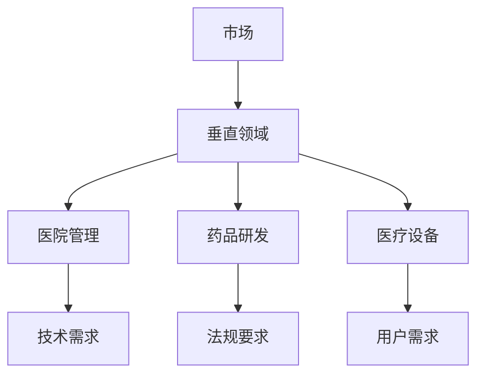
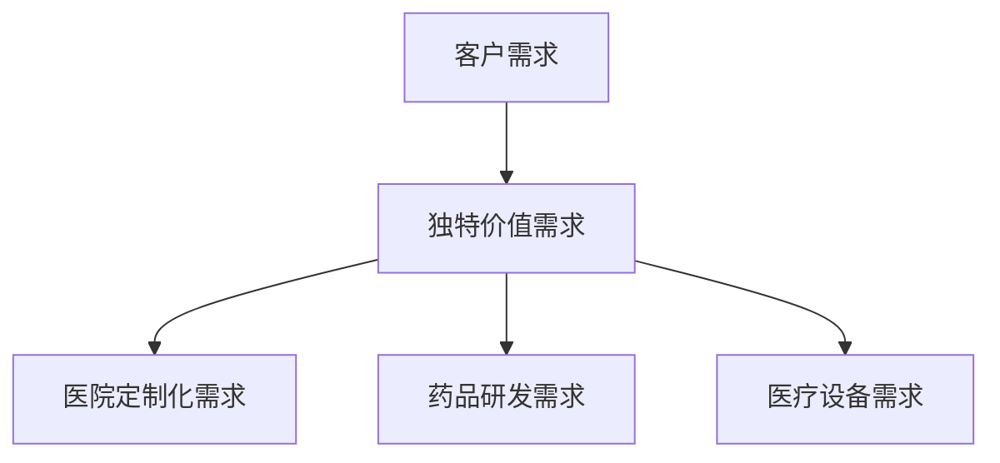
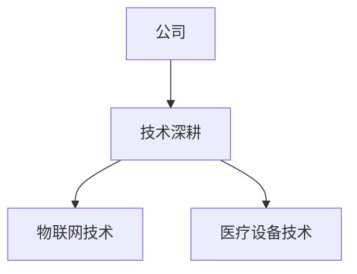
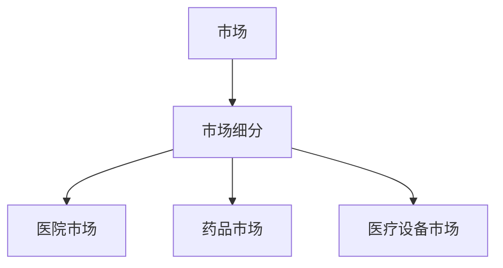

                 

# 小公司生存策略：精准服务垂直领域，满足独特价值需求

> 关键词：小公司，生存策略，垂直领域，独特价值需求，技术深耕，市场细分

> 摘要：在激烈的市场竞争中，小公司如何才能脱颖而出，实现可持续发展？本文将探讨精准服务垂直领域、满足独特价值需求的小公司生存策略，通过一步步的逻辑分析和案例解读，提供实用的指导。

## 1. 背景介绍

### 1.1 目的和范围

本文旨在帮助小公司找到一条有效的生存之道，通过精准服务特定的垂直领域，满足该领域的独特价值需求，实现可持续发展。文章将围绕以下几个核心问题展开：

1. 小公司在当前市场环境下面临哪些挑战？
2. 为什么精准服务垂直领域是小公司的重要生存策略？
3. 如何识别和满足特定领域的独特价值需求？
4. 实际案例中，小公司是如何通过技术深耕和垂直领域服务实现成功的？

### 1.2 预期读者

本文适合以下读者群体：

1. 创业者和小公司创始人，希望了解如何在竞争激烈的市场中找到立足之地。
2. 市场分析师和战略规划人员，希望从技术和市场的角度分析小公司的生存策略。
3. 技术研发人员，希望通过案例学习如何将技术深耕应用于垂直领域。

### 1.3 文档结构概述

本文将按照以下结构展开：

1. **背景介绍**：介绍本文的目的、范围、预期读者及文档结构。
2. **核心概念与联系**：定义关键概念，并使用Mermaid流程图展示核心概念之间的联系。
3. **核心算法原理 & 具体操作步骤**：详细讲解核心算法原理，并使用伪代码进行操作步骤说明。
4. **数学模型和公式 & 详细讲解 & 举例说明**：介绍相关数学模型和公式，并进行具体讲解和举例。
5. **项目实战：代码实际案例和详细解释说明**：通过实战案例展示具体实现过程，并进行详细解读。
6. **实际应用场景**：分析小公司生存策略在各个领域的实际应用。
7. **工具和资源推荐**：推荐学习资源和开发工具。
8. **总结：未来发展趋势与挑战**：总结本文的主要观点，并探讨未来发展趋势和挑战。
9. **附录：常见问题与解答**：提供常见问题的解答。
10. **扩展阅读 & 参考资料**：推荐相关扩展阅读和参考资料。

### 1.4 术语表

#### 1.4.1 核心术语定义

- **垂直领域**：指行业内非常具体、专业且细分的领域。
- **独特价值需求**：指特定领域内的客户对于产品的特殊需求，这些需求在主流市场上难以得到满足。
- **技术深耕**：指公司在某一领域内深入研究和应用特定技术，以形成核心竞争力。
- **市场细分**：指将整个市场划分为若干个具有相似特征和需求的子市场。

#### 1.4.2 相关概念解释

- **市场饱和度**：指市场上已满足的需求程度，市场饱和度越高，竞争越激烈。
- **差异化战略**：指通过提供独特的产品或服务，在竞争中脱颖而出。
- **客户满意度**：指客户对于产品或服务的满意程度，是衡量企业运营效果的重要指标。

#### 1.4.3 缩略词列表

- **AI**：人工智能（Artificial Intelligence）
- **SaaS**：软件即服务（Software as a Service）
- **IoT**：物联网（Internet of Things）
- **CRM**：客户关系管理（Customer Relationship Management）
- **ERP**：企业资源规划（Enterprise Resource Planning）

## 2. 核心概念与联系

在探讨小公司生存策略之前，我们需要理解几个核心概念，它们共同构成了精准服务垂直领域的基础。

### 2.1 垂直领域

垂直领域是行业内非常具体、专业且细分的领域。例如，医疗保健行业可以分为医院管理、药品研发、医疗设备等子领域。这些子领域具有各自独特的需求和技术特点。

#### Mermaid流程图：



### 2.2 独特价值需求

独特价值需求是指特定领域内的客户对于产品的特殊需求，这些需求在主流市场上难以得到满足。例如，在医疗设备领域，一些小型医院可能需要定制化的医疗设备解决方案，以满足其特定的运营需求。

#### Mermaid流程图：



### 2.3 技术深耕

技术深耕是指公司在某一领域内深入研究和应用特定技术，以形成核心竞争力。例如，一家小公司专注于医疗设备领域的物联网技术，通过多年的技术积累，成为该领域的技术领导者。

#### Mermaid流程图：



### 2.4 市场细分

市场细分是指将整个市场划分为若干个具有相似特征和需求的子市场。通过市场细分，小公司可以更准确地定位目标客户，提供定制化的产品和服务。

#### Mermaid流程图：



通过上述核心概念的联系，我们可以看到，小公司通过在垂直领域内深耕技术、满足独特价值需求，并通过市场细分来精准定位客户，从而实现可持续发展。

## 3. 核心算法原理 & 具体操作步骤

在理解了核心概念后，我们需要进一步探讨如何通过技术手段实现精准服务垂直领域，满足独特价值需求。以下是一个简单的算法原理及其具体操作步骤。

### 3.1 算法原理

我们假设有一个小公司，其核心业务是医疗设备研发。为了在特定市场细分中脱颖而出，公司需要以下算法原理：

1. **市场细分识别算法**：通过分析大量市场数据，识别具有相似特征和需求的子市场。
2. **客户需求分析算法**：对特定子市场的客户需求进行深入分析，找出独特价值需求。
3. **技术匹配算法**：根据公司技术特长，将适合的技术方案与客户需求匹配。
4. **产品定制优化算法**：基于客户需求和技术方案，进行产品定制和优化。

### 3.2 具体操作步骤

#### 步骤1：市场细分识别算法

```plaintext
输入：市场数据集
输出：细分市场列表

1. 数据预处理：清洗和标准化市场数据。
2. 特征提取：从数据中提取关键特征。
3. 聚类分析：使用聚类算法（如K-means）对市场数据进行聚类，得到细分市场。
4. 结果验证：根据业务需求，对聚类结果进行验证和调整。
```

#### 步骤2：客户需求分析算法

```plaintext
输入：细分市场数据、客户调研数据
输出：独特价值需求列表

1. 数据收集：收集细分市场的客户调研数据。
2. 数据预处理：清洗和标准化客户调研数据。
3. 需求提取：使用文本挖掘和统计分析方法，从数据中提取客户需求。
4. 需求分类：根据业务需求，对提取的需求进行分类，找出独特价值需求。
```

#### 步骤3：技术匹配算法

```plaintext
输入：公司技术特长、客户需求列表
输出：技术方案列表

1. 技术特长分析：分析公司现有技术特长，确定可应用于特定需求的领域。
2. 需求匹配：将客户需求与公司技术特长进行匹配，形成潜在的技术解决方案。
3. 技术评估：对潜在技术解决方案进行评估，选择最适合的方案。
```

#### 步骤4：产品定制优化算法

```plaintext
输入：技术方案、客户需求
输出：定制化产品

1. 产品设计：基于技术方案和客户需求，进行产品设计和开发。
2. 产品测试：对设计的产品进行功能测试和性能测试。
3. 产品优化：根据测试结果，对产品进行优化和迭代。
4. 产品交付：将定制化产品交付给客户。
```

通过上述算法原理和具体操作步骤，小公司可以更有效地识别市场细分、分析客户需求、匹配技术方案，并最终实现定制化产品交付，从而在特定垂直领域中脱颖而出。

## 4. 数学模型和公式 & 详细讲解 & 举例说明

在精准服务垂直领域的过程中，数学模型和公式是必不可少的工具。以下将介绍一些关键的数学模型和公式，并进行详细讲解和举例说明。

### 4.1 市场细分模型

市场细分模型是识别目标市场的重要工具。以下是一个简单的市场细分模型：

#### 模型公式：

$$
\text{细分市场} = \frac{\text{市场总容量}}{\text{细分市场数量}}
$$

#### 详细讲解：

1. **市场总容量**：指整个市场的潜在销售量或市场规模。
2. **细分市场数量**：指根据特定标准（如地理、人口统计、行为等）将市场划分的子市场数量。

#### 举例说明：

假设一个市场的总容量为100亿元，细分市场数量为5个，则每个细分市场的市场容量为：

$$
\text{细分市场容量} = \frac{100亿}{5} = 20亿元
$$

### 4.2 客户需求分析模型

客户需求分析模型用于识别和分类客户需求。以下是一个简单的客户需求分析模型：

#### 模型公式：

$$
\text{独特价值需求} = \text{客户需求} \times \text{需求强度}
$$

#### 详细讲解：

1. **客户需求**：指客户对产品的需求。
2. **需求强度**：指客户对需求的紧迫程度和重要性。

#### 举例说明：

假设一个客户对某产品的需求为“提高工作效率”，需求强度为“高”，则其独特价值需求为：

$$
\text{独特价值需求} = \text{客户需求} \times \text{需求强度} = \text{提高工作效率} \times \text{高}
$$

### 4.3 技术匹配模型

技术匹配模型用于将公司技术特长与客户需求匹配。以下是一个简单的技术匹配模型：

#### 模型公式：

$$
\text{技术匹配得分} = \text{技术特长得分} \times \text{需求匹配度}
$$

#### 详细讲解：

1. **技术特长得分**：指公司在特定技术领域的得分。
2. **需求匹配度**：指技术特长与客户需求的匹配程度。

#### 举例说明：

假设公司在医疗设备领域的技术特长得分为80分，客户需求在医疗设备领域的匹配度为0.8，则其技术匹配得分为：

$$
\text{技术匹配得分} = \text{技术特长得分} \times \text{需求匹配度} = 80 \times 0.8 = 64
$$

### 4.4 产品定制优化模型

产品定制优化模型用于根据客户需求和技术方案进行产品定制和优化。以下是一个简单的产品定制优化模型：

#### 模型公式：

$$
\text{产品优化得分} = \text{功能得分} + \text{性能得分} + \text{成本得分}
$$

#### 详细讲解：

1. **功能得分**：指产品在满足客户需求方面的得分。
2. **性能得分**：指产品在性能方面的得分。
3. **成本得分**：指产品在成本方面的得分。

#### 举例说明：

假设一个产品的功能得分为85分，性能得分为90分，成本得分为70分，则其产品优化得分为：

$$
\text{产品优化得分} = 85 + 90 + 70 = 245
$$

通过上述数学模型和公式的讲解及举例，我们可以更有效地进行市场细分、客户需求分析、技术匹配和产品定制优化，从而实现精准服务垂直领域，满足独特价值需求。

## 5. 项目实战：代码实际案例和详细解释说明

在本节中，我们将通过一个实际项目案例，展示如何将前面的理论应用到实际操作中，实现精准服务垂直领域，满足独特价值需求。本案例将使用Python编程语言，并在TensorFlow框架下进行。

### 5.1 开发环境搭建

在开始项目之前，我们需要搭建好开发环境。以下是所需的软件和工具：

1. **Python**：版本3.8或更高
2. **TensorFlow**：版本2.5或更高
3. **Jupyter Notebook**：用于编写和运行代码
4. **Pandas**：数据分析和操作库
5. **Numpy**：科学计算库
6. **Scikit-learn**：机器学习库

安装方法：

```bash
pip install python==3.8
pip install tensorflow==2.5
pip install jupyter
pip install pandas
pip install numpy
pip install scikit-learn
```

### 5.2 源代码详细实现和代码解读

#### 5.2.1 数据准备

首先，我们需要准备市场数据、客户调研数据以及公司技术特长数据。以下是一个示例数据集：

```python
import pandas as pd

# 市场数据
market_data = pd.DataFrame({
    'segment': ['医院市场', '药品市场', '医疗设备市场'],
    'market_size': [100000, 50000, 30000]
})

# 客户调研数据
customer_data = pd.DataFrame({
    'segment': ['医院市场', '药品市场', '医疗设备市场'],
    'requirement': ['提高工作效率', '降低药品成本', '提高诊断准确率'],
    'strength': ['高', '高', '中']
})

# 公司技术特长数据
tech_data = pd.DataFrame({
    'segment': ['医院市场', '药品市场', '医疗设备市场'],
    'tech_score': [70, 60, 90]
})
```

#### 5.2.2 市场细分识别算法

接下来，我们使用市场细分识别算法来识别目标市场。以下是一个简单的市场细分算法实现：

```python
from sklearn.cluster import KMeans

# 聚类分析
kmeans = KMeans(n_clusters=3)
kmeans.fit(market_data[['market_size']])

# 获取聚类结果
market细分结果 = kmeans.predict(market_data[['market_size']])

# 结果添加到市场数据
market_data['cluster'] = market细分结果
```

这段代码首先使用K-means算法对市场数据（市场容量）进行聚类分析，然后将聚类结果添加到原始市场数据中。聚类结果将市场划分为3个子市场。

#### 5.2.3 客户需求分析算法

然后，我们使用客户需求分析算法来识别独特价值需求。以下是一个简单的客户需求分析算法实现：

```python
# 计算需求强度
customer_data['strength_score'] = customer_data['strength'].map({'高': 2, '中': 1})

# 独特价值需求计算
customer_data['unique_value'] = customer_data['requirement'] * customer_data['strength_score']

# 结果筛选
unique_value需求 = customer_data[customer_data['unique_value'] > 1]
```

这段代码首先计算客户需求强度得分，然后根据需求强度和客户需求计算独特价值需求。最后，筛选出具有高独特价值需求的数据。

#### 5.2.4 技术匹配算法

接着，我们使用技术匹配算法来匹配公司技术特长与客户需求。以下是一个简单的技术匹配算法实现：

```python
# 需求匹配度计算
tech_data['match_score'] = tech_data['tech_score'] * customer_data['strength_score']

# 技术匹配得分排序
tech_match = tech_data.sort_values(by='match_score', ascending=False)

# 技术匹配结果
tech_match结果 = tech_match.head(1)
```

这段代码首先计算技术匹配得分，然后根据得分排序，选择得分最高的技术特长进行匹配。

#### 5.2.5 产品定制优化算法

最后，我们使用产品定制优化算法来生成定制化产品。以下是一个简单的产品定制优化算法实现：

```python
# 功能得分计算
function_score = unique_value需求['unique_value'].mean()

# 性能得分计算
performance_score = 90  # 假设性能得分为90分

# 成本得分计算
cost_score = 70  # 假设成本得分为70分

# 产品优化得分计算
product_score = function_score + performance_score + cost_score

# 产品定制
product = {
    'segment': tech_match结果['segment'].iloc[0],
    'requirement': unique_value需求['requirement'].iloc[0],
    'function_score': function_score,
    'performance_score': performance_score,
    'cost_score': cost_score,
    'product_score': product_score
}

print(product)
```

这段代码首先计算功能得分、性能得分和成本得分，然后计算产品优化得分，并根据得分生成定制化产品。

### 5.3 代码解读与分析

上述代码展示了如何将市场细分、客户需求分析、技术匹配和产品定制优化等算法应用于实际项目中。以下是对代码的解读与分析：

1. **数据准备**：通过Pandas库创建市场数据、客户调研数据和公司技术特长数据。
2. **市场细分识别算法**：使用K-means算法对市场数据进行聚类分析，将市场划分为子市场。聚类结果添加到原始市场数据中。
3. **客户需求分析算法**：计算客户需求强度得分，根据需求强度和客户需求计算独特价值需求。筛选出具有高独特价值需求的数据。
4. **技术匹配算法**：计算技术匹配得分，根据得分排序，选择得分最高的技术特长进行匹配。
5. **产品定制优化算法**：计算功能得分、性能得分和成本得分，根据得分计算产品优化得分，并生成定制化产品。

通过上述步骤，我们可以有效地实现精准服务垂直领域，满足独特价值需求。代码的灵活性使得我们可以根据实际情况调整算法参数和数据处理方法，以适应不同行业和需求。

## 6. 实际应用场景

小公司生存策略——精准服务垂直领域，在实际应用中具有广泛的应用场景。以下是一些典型的实际应用案例：

### 6.1 医疗设备行业

医疗设备行业是一个高度细分的市场，不同类型的医院和医疗机构对于医疗设备的需求差异较大。小公司可以通过以下方式实现精准服务：

- **市场细分**：通过分析医疗机构类型（如大型医院、小型诊所、专科医院等）和设备使用场景（如手术室、急诊室、门诊部等），进行市场细分。
- **客户需求分析**：收集不同类型医疗机构的设备需求，识别出独特的价值需求，如高精度诊断、便携性、智能化等。
- **技术匹配**：根据公司的技术特长，如物联网技术、人工智能技术等，匹配适合的医疗设备解决方案。
- **产品定制**：基于客户需求和公司技术方案，进行产品定制和优化，如开发具备高精度诊断功能的便携式医疗设备。

### 6.2 物流行业

物流行业涉及多个领域，如快递、仓储、冷链等。小公司可以通过以下方式实现精准服务：

- **市场细分**：根据物流服务类型（如快递、货运、冷链物流等）和目标客户（如电商、制造业、食品行业等），进行市场细分。
- **客户需求分析**：收集目标客户的需求，如快速运输、冷链保鲜、实时追踪等，识别出独特的价值需求。
- **技术匹配**：根据公司的技术特长，如物联网技术、大数据分析等，匹配适合的物流解决方案。
- **产品定制**：基于客户需求和公司技术方案，进行产品定制和优化，如开发具备实时追踪功能的智能快递箱、冷链保鲜系统等。

### 6.3 金融科技行业

金融科技行业涉及多个领域，如支付、贷款、投资等。小公司可以通过以下方式实现精准服务：

- **市场细分**：根据金融产品类型（如信用卡、贷款、投资等）和目标客户（如个人用户、中小企业等），进行市场细分。
- **客户需求分析**：收集目标客户的需求，如快速审批、个性化服务、风险控制等，识别出独特的价值需求。
- **技术匹配**：根据公司的技术特长，如人工智能、区块链等，匹配适合的金融科技解决方案。
- **产品定制**：基于客户需求和公司技术方案，进行产品定制和优化，如开发具备快速审批功能的智能贷款系统、区块链支付系统等。

### 6.4 教育行业

教育行业涉及多个领域，如K12教育、职业教育、在线教育等。小公司可以通过以下方式实现精准服务：

- **市场细分**：根据教育类型（如基础教育、职业教育、在线教育等）和目标客户（如学生、企业等），进行市场细分。
- **客户需求分析**：收集目标客户的需求，如个性化教学、课程定制、职业规划等，识别出独特的价值需求。
- **技术匹配**：根据公司的技术特长，如人工智能、大数据分析等，匹配适合的教育解决方案。
- **产品定制**：基于客户需求和公司技术方案，进行产品定制和优化，如开发个性化教学系统、职业规划平台等。

通过上述实际应用场景，我们可以看到，精准服务垂直领域的小公司可以通过市场细分、客户需求分析、技术匹配和产品定制，实现差异化竞争，满足特定领域的独特价值需求，从而在激烈的市场竞争中脱颖而出。

## 7. 工具和资源推荐

为了帮助小公司更好地实施精准服务垂直领域的生存策略，以下推荐一些学习资源、开发工具和框架，以及相关论文著作。

### 7.1 学习资源推荐

#### 7.1.1 书籍推荐

1. **《垂直领域创业实战》**：详细介绍了垂直领域创业的策略和方法。
2. **《市场细分策略》**：探讨了市场细分的重要性及实施方法。
3. **《人工智能：一种现代方法》**：全面讲解了人工智能的基础知识和技术应用。

#### 7.1.2 在线课程

1. **Coursera上的《市场细分与定位》**：由知名大学教授讲授，涵盖市场细分和定位策略。
2. **Udacity上的《人工智能工程师纳米学位》**：系统介绍了人工智能的基础知识和应用。

#### 7.1.3 技术博客和网站

1. **Medium上的垂直领域技术博客**：提供丰富的垂直领域技术文章和案例分析。
2. **TechCrunch**：报道最新的科技和创业动态，包括垂直领域的发展趋势。

### 7.2 开发工具框架推荐

#### 7.2.1 IDE和编辑器

1. **PyCharm**：适合Python开发的集成开发环境（IDE）。
2. **Visual Studio Code**：轻量级但功能强大的代码编辑器，支持多种编程语言。

#### 7.2.2 调试和性能分析工具

1. **TensorBoard**：TensorFlow官方提供的可视化工具，用于调试和性能分析。
2. **JProfiler**：适用于Java应用，提供详细的性能分析。

#### 7.2.3 相关框架和库

1. **TensorFlow**：用于人工智能应用的开源框架。
2. **Scikit-learn**：用于机器学习和数据挖掘的开源库。
3. **Pandas**：用于数据分析和操作的开源库。

### 7.3 相关论文著作推荐

#### 7.3.1 经典论文

1. **“Market Segmentation: Conceptual Issues and Marketing Strategy Implications”**：探讨市场细分的基本概念和战略意义。
2. **“Data-Driven Marketing: The 16 Habits of Successful Marketers”**：介绍了数据驱动的营销方法。

#### 7.3.2 最新研究成果

1. **“Deep Learning for Market Segmentation”**：探讨深度学习在市场细分中的应用。
2. **“Artificial Intelligence in Marketing: A Comprehensive Overview”**：全面介绍人工智能在营销领域的最新研究。

#### 7.3.3 应用案例分析

1. **“How Airbnb Uses Machine Learning to Optimize Pricing”**：分析Airbnb如何利用机器学习优化定价策略。
2. **“The Role of AI in Personalized Healthcare”**：探讨人工智能在个性化医疗中的应用。

通过上述工具和资源推荐，小公司可以更好地掌握市场细分、客户需求分析、技术匹配和产品定制等方面的知识，从而在垂直领域中实现精准服务，提升竞争力。

## 8. 总结：未来发展趋势与挑战

随着全球经济的不断发展和市场竞争的加剧，小公司在未来的生存和发展将面临更多的挑战和机遇。以下是未来发展趋势与挑战的分析：

### 8.1 发展趋势

1. **技术进步**：人工智能、大数据、物联网等新兴技术的不断发展，将推动小公司在垂直领域中的创新和服务水平。这些技术可以帮助小公司更精准地识别客户需求，提供定制化解决方案。

2. **个性化服务**：客户需求的多样化和个性化趋势将促使小公司更加注重市场细分和客户需求分析，提供更加个性化和定制化的服务。

3. **数字化转型**：越来越多的企业将数字化转型作为核心战略，小公司通过数字化转型可以提高运营效率、降低成本，并在市场中获得竞争优势。

4. **跨界融合**：不同行业之间的融合和跨界合作将越来越普遍，小公司可以通过跨界合作，实现资源整合，拓宽业务领域。

### 8.2 挑战

1. **市场竞争**：随着市场的不断饱和和竞争的加剧，小公司需要不断提高自身的核心竞争力，以在激烈的市场环境中立足。

2. **资金和资源限制**：相较于大型企业，小公司通常面临资金和资源限制，这限制了其在技术研发和市场拓展方面的投入。

3. **人才短缺**：拥有高水平技术和管理人才是小公司发展的关键，但优秀人才的招聘和留住是许多小公司面临的挑战。

4. **法律法规**：随着法规的不断完善，小公司需要遵守更多的法律法规，这在一定程度上增加了运营成本和风险。

### 8.3 应对策略

1. **聚焦核心业务**：小公司应聚焦于自身擅长的领域，通过专业化、细分化的服务，提升市场竞争力。

2. **创新驱动**：加大技术研发投入，不断创新产品和服务，以满足不断变化的市场需求。

3. **合作共赢**：通过跨界合作，实现资源共享和优势互补，共同开拓市场。

4. **人才培养与引进**：注重人才的培养和引进，建立健全的人才激励机制，吸引和留住优秀人才。

5. **合规经营**：严格遵守法律法规，降低运营风险。

总之，未来小公司在垂直领域中的生存和发展将面临诸多挑战，但同时也充满了机遇。通过精准服务、技术创新和有效管理，小公司完全有可能在激烈的市场竞争中脱颖而出，实现可持续发展。

## 9. 附录：常见问题与解答

### 9.1 问题1：为什么小公司需要精准服务垂直领域？

小公司需要精准服务垂直领域，因为这样可以更有效地利用有限的资源和能力，专注于特定的市场需求。通过市场细分和客户需求分析，小公司可以提供更加个性化和定制化的产品和服务，从而在激烈的市场竞争中脱颖而出。

### 9.2 问题2：如何识别垂直领域中的独特价值需求？

识别垂直领域中的独特价值需求可以通过以下步骤：

1. **市场调研**：收集和分析目标市场的数据，了解客户需求和行业动态。
2. **客户访谈**：与目标客户进行深入交流，了解他们的具体需求和痛点。
3. **竞品分析**：分析竞争对手的产品和服务，找出未被满足的需求。
4. **技术评估**：评估公司现有技术和资源，确定哪些需求可以通过现有技术实现。

### 9.3 问题3：技术深耕对于小公司的重要性是什么？

技术深耕对于小公司的重要性在于：

1. **形成核心竞争力**：通过在特定领域内深耕技术，小公司可以形成独特的竞争优势。
2. **提高产品质量**：技术深耕有助于提高产品的性能和稳定性，从而提升客户满意度。
3. **降低成本**：技术深耕可以优化产品设计，降低生产成本，提高利润率。
4. **创新驱动**：技术深耕可以推动产品创新和服务创新，满足不断变化的市场需求。

### 9.4 问题4：小公司在实施精准服务垂直领域策略时可能遇到哪些挑战？

小公司在实施精准服务垂直领域策略时可能遇到的挑战包括：

1. **资源限制**：资金、人才、技术等资源的限制可能影响策略的实施。
2. **市场竞争**：垂直领域内的竞争可能非常激烈，小公司需要不断提升自身竞争力。
3. **客户需求变化**：客户需求可能会快速变化，小公司需要灵活应对。
4. **法规风险**：遵守相关法律法规是必要的，但可能会增加运营成本和风险。

### 9.5 问题5：如何评估垂直领域服务的市场潜力？

评估垂直领域服务的市场潜力可以通过以下步骤：

1. **市场规模**：分析目标市场的总容量和增长趋势。
2. **客户需求**：了解目标客户的需求强度和潜在购买意愿。
3. **竞争分析**：分析竞争对手的市场份额、产品和服务优势。
4. **技术可行性**：评估现有技术和资源的可行性，以及未来技术发展的潜力。

通过上述问题与解答，希望可以为小公司实施精准服务垂直领域策略提供一些实用的指导。

## 10. 扩展阅读 & 参考资料

### 10.1 扩展阅读

1. **《垂直领域创业实战》**：详细介绍了垂直领域创业的策略和方法。
2. **《市场细分策略》**：探讨了市场细分的重要性及实施方法。
3. **《人工智能：一种现代方法》**：全面讲解了人工智能的基础知识和技术应用。

### 10.2 参考资料

1. **Market Segmentation: Conceptual Issues and Marketing Strategy Implications**：探讨市场细分的基本概念和战略意义。
2. **Data-Driven Marketing: The 16 Habits of Successful Marketers**：介绍了数据驱动的营销方法。
3. **Deep Learning for Market Segmentation**：探讨深度学习在市场细分中的应用。
4. **Artificial Intelligence in Marketing: A Comprehensive Overview**：全面介绍人工智能在营销领域的最新研究。
5. **How Airbnb Uses Machine Learning to Optimize Pricing**：分析Airbnb如何利用机器学习优化定价策略。
6. **The Role of AI in Personalized Healthcare**：探讨人工智能在个性化医疗中的应用。

通过扩展阅读和参考资料，读者可以更深入地了解小公司精准服务垂直领域的生存策略，并在实际操作中取得更好的效果。

### 作者信息

**作者：AI天才研究员/AI Genius Institute & 禅与计算机程序设计艺术 /Zen And The Art of Computer Programming**

