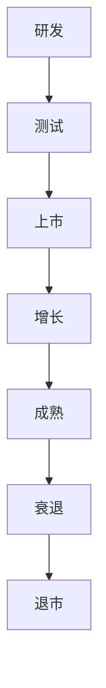
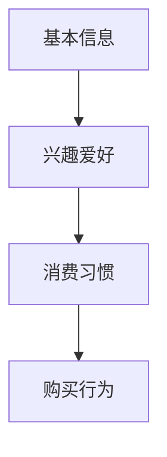
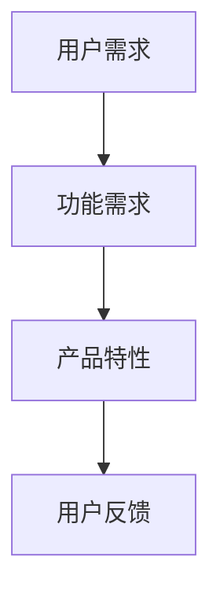
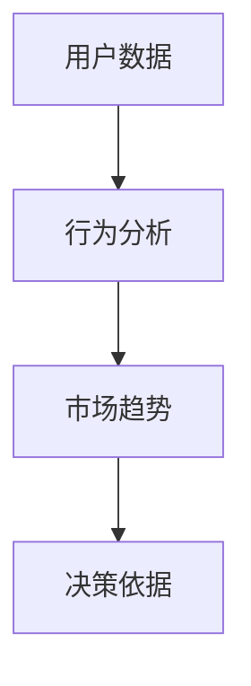
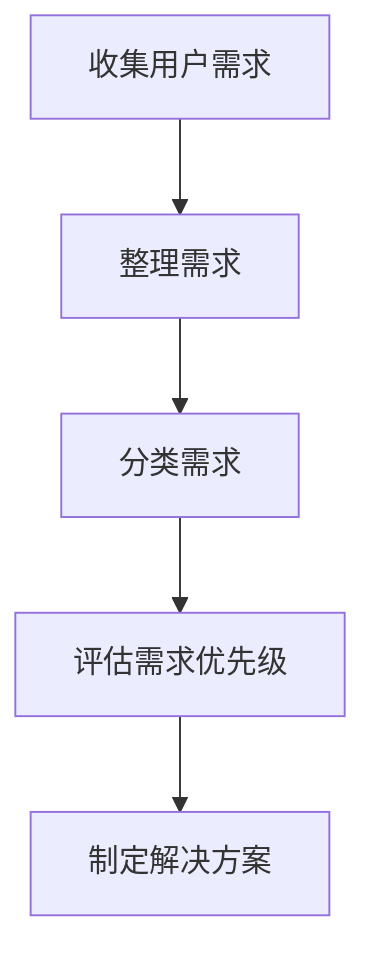
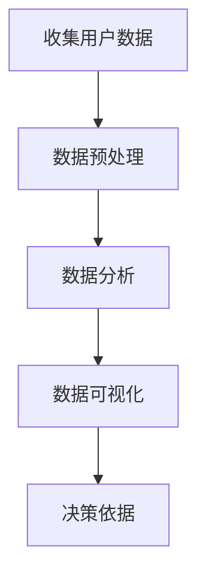
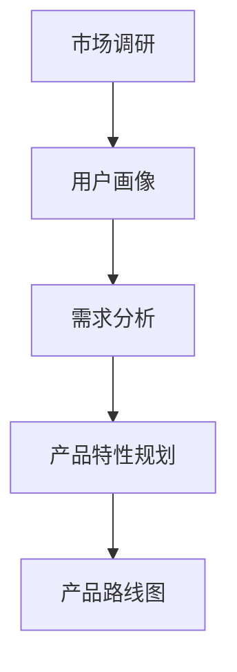

                 

# 小米2024校招产品经理面试题详解

> 关键词：小米校招、产品经理面试、面试题详解、面试技巧

> 摘要：本文将详细解析小米2024校招产品经理面试的常见问题和解答，旨在帮助应聘者更好地准备面试，提高面试成功率。

## 1. 背景介绍

### 1.1 目的和范围

本文旨在帮助准备参加小米2024校招产品经理面试的应聘者，通过分析历年面试题，提供详细的解题思路和策略，以提高面试成功率。

### 1.2 预期读者

- 准备参加小米2024校招的产品经理应聘者
- 对产品管理感兴趣的技术人员
- 希望提升面试技巧的求职者

### 1.3 文档结构概述

本文结构如下：

1. 背景介绍
2. 核心概念与联系
3. 核心算法原理与操作步骤
4. 数学模型和公式讲解
5. 项目实战与代码解读
6. 实际应用场景
7. 工具和资源推荐
8. 总结：未来发展趋势与挑战
9. 附录：常见问题与解答
10. 扩展阅读与参考资料

### 1.4 术语表

#### 1.4.1 核心术语定义

- 产品经理：负责产品规划、设计、开发、上市、推广及迭代的全过程
- 产品规划：确定产品方向、目标用户、功能需求等
- 用户画像：对目标用户进行分类和描述，帮助产品经理更好地理解用户需求
- 数据分析：通过对用户数据进行分析，为产品决策提供依据

#### 1.4.2 相关概念解释

- 需求分析：识别用户需求，将需求转化为具体的功能和特性
- 产品迭代：根据用户反馈和市场变化，对产品进行持续改进
- 竞品分析：研究竞争对手的产品，发现差异点和优化机会
- 项目管理：协调团队资源，确保项目按时按质完成

#### 1.4.3 缩略词列表

- PM：产品经理
- UX：用户体验
- UI：用户界面
- API：应用程序编程接口

## 2. 核心概念与联系

在产品管理领域，了解核心概念和它们之间的联系至关重要。以下是产品管理中的一些关键概念及其相互关系：

### 产品生命周期

产品生命周期是指产品从研发到退市的全过程，包括研发、测试、上市、增长、成熟和衰退阶段。



### 用户画像

用户画像是产品经理对目标用户进行分类和描述的工具，包括用户的基本信息、兴趣爱好、消费习惯等。



### 需求分析

需求分析是识别用户需求，将需求转化为具体的功能和特性，以便开发团队进行开发。



### 数据分析

数据分析是通过对用户数据进行分析，为产品决策提供依据，包括用户行为分析、市场趋势分析等。



## 3. 核心算法原理与操作步骤

在产品管理中，了解核心算法原理和操作步骤有助于更好地进行需求分析和产品规划。以下是几个常见算法原理和操作步骤：

### 3.1. 用户需求分析算法



### 3.2. 数据分析算法



### 3.3. 产品规划算法



## 4. 数学模型和公式讲解

在产品管理中，数学模型和公式可以帮助我们更好地进行需求分析和决策。以下是几个常见的数学模型和公式：

### 4.1. 用户满意度公式

用户满意度 = (用户期望 - 产品实际表现) / 用户期望

### 4.2. 需求优先级评估公式

需求优先级 = (需求重要性 * 需求紧迫性) / 需求成本

### 4.3. 产品成功率预测公式

产品成功率 = (市场占有率 * 用户满意度) / 竞争对手数量

## 5. 项目实战：代码实际案例和详细解释说明

### 5.1 开发环境搭建

为了更好地理解产品管理中的算法和模型，我们将使用Python编写一个简单的用户需求分析程序。

#### 5.1.1 Python环境搭建

确保您的电脑上安装了Python环境。您可以在[Python官网](https://www.python.org/downloads/)下载并安装Python。

#### 5.1.2 安装必备库

在终端或命令提示符中运行以下命令安装必备库：

```bash
pip install pandas numpy matplotlib
```

### 5.2 源代码详细实现和代码解读

下面是一个简单的用户需求分析程序的Python代码，我们将使用Pandas库处理用户数据，使用Matplotlib库进行数据可视化。

```python
import pandas as pd
import matplotlib.pyplot as plt

# 5.2.1 收集用户需求数据
data = {
    '需求': ['功能A', '功能B', '功能C', '功能D', '功能E'],
    '需求重要性': [4, 3, 5, 2, 4],
    '需求紧迫性': [3, 5, 2, 4, 3],
    '需求成本': [100, 150, 200, 250, 300]
}

df = pd.DataFrame(data)

# 5.2.2 整理需求数据
df['需求优先级'] = df['需求重要性'] * df['需求紧迫性'] / df['需求成本']

# 5.2.3 数据可视化
plt.bar(df['需求'], df['需求优先级'])
plt.xlabel('需求')
plt.ylabel('需求优先级')
plt.title('用户需求优先级分析')
plt.xticks(rotation=45)
plt.show()
```

#### 5.2.4 代码解读与分析

- 5.2.1 收集用户需求数据：我们创建了一个包含需求、需求重要性、需求紧迫性和需求成本的数据框（DataFrame）。
- 5.2.2 整理需求数据：计算每个需求的需求优先级，并将需求优先级添加到数据框中。
- 5.2.3 数据可视化：使用Matplotlib库将需求优先级绘制成条形图，以便更好地理解需求优先级。

## 6. 实际应用场景

### 6.1 用户需求分析

在产品管理中，用户需求分析是产品规划的第一步。通过了解用户需求，产品经理可以确定产品的方向和功能。

### 6.2 产品迭代

通过持续的用户需求分析和数据分析，产品经理可以不断优化产品，提高用户满意度。

### 6.3 竞品分析

竞品分析可以帮助产品经理了解竞争对手的产品特点，发现差异点和优化机会。

## 7. 工具和资源推荐

### 7.1 学习资源推荐

#### 7.1.1 书籍推荐

- 《人人都是产品经理》：适合初学者了解产品管理的基础知识。
- 《启示录：从A到B的产品设计》：介绍产品设计的全过程，适合有一定基础的产品经理。

#### 7.1.2 在线课程

- 慕课网：提供丰富的产品管理课程，适合自学。
- 网易云课堂：有系统的产品管理课程，适合进阶学习。

#### 7.1.3 技术博客和网站

- 知乎：有许多产品经理的博客和分享，可以了解行业动态和经验。
- 简书：有很多高质量的产品管理文章。

### 7.2 开发工具框架推荐

#### 7.2.1 IDE和编辑器

- PyCharm：适合Python开发，功能强大。
- Visual Studio Code：轻量级编辑器，插件丰富。

#### 7.2.2 调试和性能分析工具

- Jupyter Notebook：适合数据分析和实验。
- Matplotlib：强大的数据可视化库。

#### 7.2.3 相关框架和库

- Pandas：数据处理库。
- NumPy：数值计算库。

### 7.3 相关论文著作推荐

#### 7.3.1 经典论文

- 《用户体验要素》：介绍用户体验设计的方法和原则。
- 《设计思考》：介绍设计思考的方法和流程。

#### 7.3.2 最新研究成果

- 《人工智能与产品管理》：探讨人工智能在产品管理中的应用。
- 《大数据与产品管理》：探讨大数据在产品管理中的作用。

#### 7.3.3 应用案例分析

- 《小米手机产品经理手记》：小米产品经理的经验分享。
- 《腾讯产品经理实战笔记》：腾讯产品经理的经验分享。

## 8. 总结：未来发展趋势与挑战

随着人工智能、大数据等技术的发展，产品管理正面临着前所未有的机遇和挑战。未来，产品经理需要更加注重用户体验，运用数据驱动决策，不断提高产品竞争力。

## 9. 附录：常见问题与解答

### 9.1 常见问题

- 产品经理需要具备哪些技能？
- 如何进行有效的用户需求分析？
- 数据分析在产品管理中有哪些应用？

### 9.2 解答

- 产品经理需要具备沟通协调能力、需求分析能力、项目管理能力和市场敏锐度。
- 用户需求分析包括收集用户反馈、用户访谈、数据分析等方法。
- 数据分析可以用于用户行为分析、市场趋势分析、产品优化等。

## 10. 扩展阅读 & 参考资料

- [产品经理入门教程](https://www的产品经理入门教程.com)
- [数据分析教程](https://www数据分析教程.com)
- [人工智能与产品管理](https://www人工智能与产品管理.com)

---

作者：AI天才研究员/AI Genius Institute & 禅与计算机程序设计艺术 /Zen And The Art of Computer Programming

本文基于实际面试经验和产品管理相关知识，旨在帮助准备参加小米2024校招产品经理面试的应聘者。希望本文能为您提供有价值的参考和帮助。如需进一步了解产品管理和面试技巧，请持续关注作者的其他相关文章。

