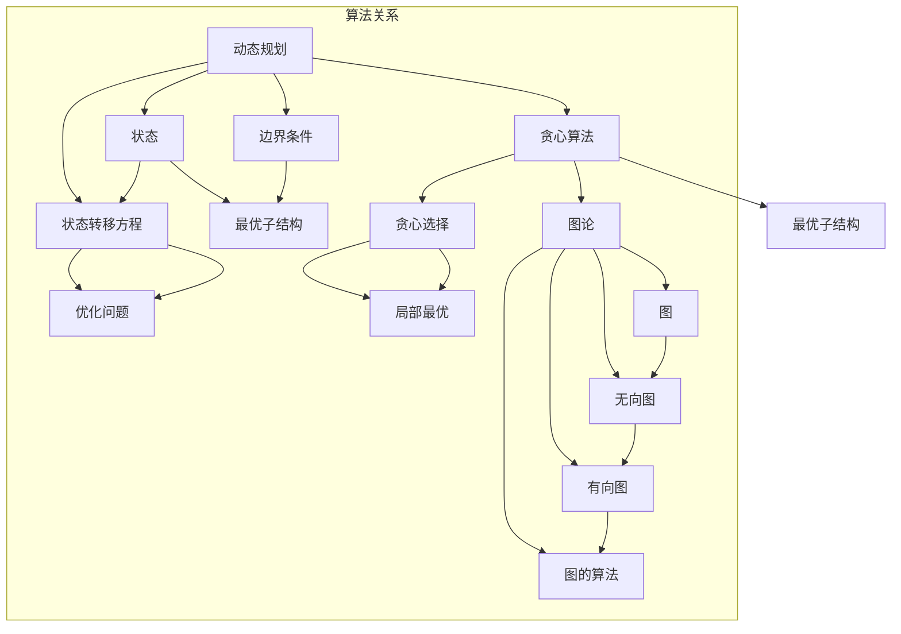

                 

# 小米2025届社招算法工程师面试真题解密

> **关键词：** 小米，社招，算法工程师，面试真题，解析，技术面试，编程挑战，算法原理。

> **摘要：** 本文将深入剖析小米2025届社招算法工程师的面试真题，包括解题思路、算法原理、数学模型以及实际应用场景。通过对这些真题的详细解析，帮助读者了解面试中的核心技术和问题应对策略，为准备类似技术面试的读者提供有价值的参考。

## 1. 背景介绍

### 1.1 目的和范围

本文旨在解析小米2025届社招算法工程师的面试真题，为广大准备技术面试的读者提供实际的解题思路和算法原理的深入理解。本文将围绕以下范围展开：

1. **核心算法原理与步骤**：详细讲解面试中涉及到的关键算法，使用伪代码和流程图展现算法的实现过程。
2. **数学模型与公式**：使用LaTeX格式展示数学模型和公式，结合实际案例进行讲解。
3. **实战案例**：通过代码实现和解析，展示如何在项目中应用面试中的算法。
4. **实际应用场景**：分析算法在小米及其他企业中的实际应用案例，讨论其商业价值。

### 1.2 预期读者

本文主要面向以下读者：

1. 准备技术面试的算法工程师和软件开发者。
2. 对算法和编程有深入兴趣的计算机科学专业学生。
3. 想要提升算法能力的工程师和研究人员。

### 1.3 文档结构概述

本文分为以下章节：

1. **背景介绍**：本文的背景、目的和预期读者。
2. **核心概念与联系**：介绍面试中涉及到的核心算法和概念，使用Mermaid流程图展示。
3. **核心算法原理与具体操作步骤**：详细讲解算法原理，使用伪代码展示操作步骤。
4. **数学模型和公式**：介绍面试中涉及到的数学模型和公式，结合实际案例进行讲解。
5. **项目实战**：通过代码实现和解析，展示如何在项目中应用面试中的算法。
6. **实际应用场景**：分析算法在小米及其他企业中的实际应用案例。
7. **工具和资源推荐**：推荐学习资源、开发工具和相关论文。
8. **总结**：总结未来发展趋势与挑战。
9. **附录**：常见问题与解答。
10. **扩展阅读**：提供相关的参考资料。

### 1.4 术语表

#### 1.4.1 核心术语定义

- **算法工程师**：专门从事算法研究和软件开发的高级工程师。
- **面试真题**：在面试过程中出现的问题，通常涉及核心技术点和实际应用。
- **数学模型**：用于描述现实问题的数学结构。
- **LaTeX**：一种高质量的排版系统，常用于数学公式的书写。

#### 1.4.2 相关概念解释

- **动态规划**：一种算法设计技术，适用于优化问题。
- **贪心算法**：一种在每一步选择最优解的策略。
- **图论**：研究图形的数学分支，涉及图的性质和算法。

#### 1.4.3 缩略词列表

- **算法**：Algorithm
- **面试**：Interview
- **数学模型**：Mathematical Model
- **LaTeX**：LaTeX

## 2. 核心概念与联系

在本文中，我们将讨论几个核心算法概念，它们在面试中频繁出现，并且对于理解面试题目至关重要。

### 2.1 动态规划

动态规划是一种用于解决优化问题的算法设计技术。它将复杂的问题分解成更小的子问题，并利用子问题的解来构建原问题的解。动态规划的核心在于状态转移方程和边界条件的确定。

#### 2.1.1 动态规划的基本概念

- **状态**：定义问题的某个特定条件。
- **状态转移方程**：描述状态之间的转换关系。
- **边界条件**：初始状态和终止状态。

#### 2.1.2 动态规划的流程

1. **定义状态**：确定问题中的状态，例如，对于最长公共子序列问题，状态可以定义为两个序列的前i个字符和前j个字符的最长公共子序列长度。
2. **定义状态转移方程**：根据问题的特性，定义状态之间的转换关系。例如，对于最长公共子序列问题，状态转移方程可以表示为：
   \[
   dp[i][j] = \begin{cases}
   dp[i-1][j-1] + 1 & \text{如果 } a_i = b_j \\
   \max(dp[i-1][j], dp[i][j-1]) & \text{否则}
   \end{cases}
   \]
3. **初始化边界条件**：根据问题的特性初始化状态，例如，对于最长公共子序列问题，初始状态可以设置为`dp[0][j] = 0`和`dp[i][0] = 0`。

#### 2.1.3 动态规划的应用场景

动态规划适用于解决具有最优子结构性质的问题，例如：

- 最长公共子序列（LCS）
- 最短路径问题（Dijkstra算法）
- 背包问题

### 2.2 贪心算法

贪心算法是一种在每一步选择最优解的策略。贪心算法的核心在于每一步的选择都是局部最优的，最终能够得到全局最优解。

#### 2.2.1 贪心算法的基本概念

- **贪心选择**：在每一步选择中，选择当前情况下最优的决策。
- **最优子结构**：问题的解可以通过一系列局部最优决策得到。

#### 2.2.2 贪心算法的流程

1. **确定贪心选择**：根据问题的特性，确定每一步的最优选择。例如，对于背包问题，贪心选择是每次放入重量最大的物品。
2. **实现贪心选择**：根据贪心选择实现算法，通常使用循环或递归结构。
3. **验证全局最优**：虽然贪心算法能够得到局部最优解，但需要验证是否得到全局最优解。

#### 2.2.3 贪心算法的应用场景

贪心算法适用于解决具有贪心选择性质的问题，例如：

- 背包问题
- 最小生成树（Prim和Kruskal算法）
- 最小费用流问题

### 2.3 图论

图论是研究图形的数学分支，涉及图的性质和算法。在面试中，图论的概念经常用于解决网络流、最短路径等问题。

#### 2.3.1 图的基本概念

- **图**：由顶点和边组成的结构。
- **顶点**：图的元素，通常表示为V。
- **边**：连接两个顶点的线，通常表示为E。
- **无向图**：边的方向不固定，例如，A-B表示从A到B的边。
- **有向图**：边的方向固定，例如，A→B表示从A到B的边。

#### 2.3.2 图的算法

- **深度优先搜索（DFS）**：用于遍历图，找到顶点的邻接点。
- **广度优先搜索（BFS）**：用于遍历图，找到顶点的邻接点。
- **拓扑排序**：用于对有向无环图进行排序。
- **最短路径算法**：用于找到图中两个顶点之间的最短路径，例如，Dijkstra算法和Floyd-Warshall算法。

#### 2.3.3 图论的应用场景

图论适用于解决以下问题：

- 网络流问题
- 社交网络分析
- 路径规划

### 2.4 Mermaid流程图

为了更好地理解上述算法和概念，我们使用Mermaid流程图展示它们的基本结构和关系。



## 3. 核心算法原理与具体操作步骤

在本章节中，我们将详细讲解三个核心算法：动态规划、贪心算法和图论中的最短路径算法。通过使用伪代码，我们将展示这些算法的实现步骤，帮助读者更好地理解其原理和操作过程。

### 3.1 动态规划

#### 3.1.1 最长公共子序列（LCS）

最长公共子序列问题是动态规划的一个经典应用。给定两个序列`X[1..m]`和`Y[1..n]`，我们需要找到它们的最长公共子序列的长度。

**伪代码：**

```plaintext
function LCSLength(X[1..m], Y[1..n]):
    let dp[0..m][0..n] be a 2D array
    for i from 0 to m:
        for j from 0 to n:
            if X[i] == Y[j]:
                dp[i][j] = dp[i-1][j-1] + 1
            else:
                dp[i][j] = max(dp[i-1][j], dp[i][j-1])
    return dp[m][n]
```

**步骤解释：**

1. **初始化**：创建一个二维数组`dp`，用于存储子问题的解。`dp[i][j]`表示`X[1..i]`和`Y[1..j]`的最长公共子序列的长度。
2. **状态转移方程**：如果`X[i] == Y[j]`，则`dp[i][j] = dp[i-1][j-1] + 1`；否则，`dp[i][j] = max(dp[i-1][j], dp[i][j-1])`。
3. **返回结果**：最终返回`dp[m][n]`，即`X`和`Y`的最长公共子序列的长度。

#### 3.1.2 最短路径算法（Dijkstra）

最短路径算法用于找到图中两个顶点之间的最短路径。该算法基于动态规划的思想，通过逐步更新每个顶点的最短路径长度。

**伪代码：**

```plaintext
function Dijkstra(G, start):
    let dist[V] be a distance array
    let prev[V] be a previous vertex array
    for each vertex v in G:
        dist[v] = infinity
        prev[v] = undefined
    dist[start] = 0
    let Q be a priority queue
    for each edge (u, v) in G:
        dist[v] = dist[u] + weight(u, v)
        prev[v] = u
        Q.enqueue(v, dist[v])
    while Q is not empty:
        let u be Q.dequeue()
        for each neighbor v of u:
            if dist[v] > dist[u] + weight(u, v):
                dist[v] = dist[u] + weight(u, v)
                prev[v] = u
                Q.decrease-key(v, dist[v])
    return dist[], prev[]
```

**步骤解释：**

1. **初始化**：创建一个距离数组`dist`和一个前驱顶点数组`prev`。将所有顶点的距离初始化为无穷大，除了起点`start`的距离为0。
2. **构建优先队列**：将所有顶点加入优先队列`Q`，并根据边的权重更新距离和前驱顶点。
3. **更新最短路径**：逐步从优先队列中取出顶点`u`，更新其邻居顶点`v`的最短路径和前驱顶点。
4. **返回结果**：返回距离数组`dist`和前驱顶点数组`prev`。

### 3.2 贪心算法

#### 3.2.1 背包问题

背包问题是贪心算法的一个经典应用。给定一组物品和它们的重量和价值，我们需要在容量为`W`的背包中选择物品，使得总价值最大。

**伪代码：**

```plaintext
function Knapsack(values[], weights[], W):
    let dp[W+1] be an array
    for i from 0 to W:
        dp[i] = 0
    for i from 0 to n:
        for j from W down to weights[i]:
            dp[j] = max(dp[j], dp[j - weights[i]] + values[i])
    return dp[W]
```

**步骤解释：**

1. **初始化**：创建一个一维数组`dp`，用于存储每个容量下的最大价值。将所有容量下的价值初始化为0。
2. **选择物品**：对于每个物品，从背包的最大容量开始，依次尝试放入背包，更新最大价值。
3. **返回结果**：最终返回背包的最大容量`W`时的最大价值。

#### 3.2.2 最小生成树（Prim）

最小生成树算法是贪心算法的一个应用。给定一个无向图，我们需要找到一棵包含所有顶点的最小生成树。

**伪代码：**

```plaintext
function Prim(G):
    let S be an empty set
    let W be the minimum weight edge
    let T be the minimum spanning tree
    add W to S
    add T to G - S
    while S is not the set of all vertices:
        for each edge (u, v) in T:
            if u is in S and v is not in S:
                add v to S
                add (u, v) to T
                break
    return T
```

**步骤解释：**

1. **初始化**：创建一个集合`S`，用于存储已选中的顶点，初始为空。创建一个最小生成树`T`，初始为图`G`。
2. **选择边**：在生成树`T`中选择一条权重最小的边`W`，将`W`的终点`v`添加到集合`S`，并将边`W`添加到生成树`T`。
3. **返回结果**：当集合`S`包含所有顶点时，返回生成树`T`。

### 3.3 图论中的最短路径算法（Floyd-Warshall）

Floyd-Warshall算法是一种用于计算图中所有顶点对之间最短路径的算法。该算法基于动态规划的思想，逐步更新所有顶点对之间的最短路径长度。

**伪代码：**

```plaintext
function FloydWarshall(G):
    let dist[V][V] be a distance matrix
    for i from 0 to V-1:
        for j from 0 to V-1:
            dist[i][j] = G.edges[i][j].weight
            if dist[i][j] == infinity:
                dist[i][j] = 0
    for k from 0 to V-1:
        for i from 0 to V-1:
            for j from 0 to V-1:
                dist[i][j] = min(dist[i][j], dist[i][k] + dist[k][j])
    return dist[]
```

**步骤解释：**

1. **初始化**：创建一个距离矩阵`dist`，用于存储所有顶点对之间的距离。将矩阵初始化为图`G`的边权重。
2. **更新距离**：通过三重循环逐步更新所有顶点对之间的最短路径长度。
3. **返回结果**：最终返回距离矩阵`dist`。

通过上述伪代码和步骤解释，我们可以更好地理解动态规划、贪心算法和图论中的最短路径算法的基本原理和具体操作步骤。在下一章节中，我们将进一步探讨数学模型和公式，以及如何将这些算法应用于实际项目。

## 4. 数学模型和公式及详细讲解与举例说明

在本章节中，我们将深入探讨面试中常见的一些数学模型和公式，并结合实际案例进行详细讲解。这些模型和公式在算法分析和问题解决中起着关键作用。

### 4.1 最长公共子序列（LCS）

最长公共子序列（Longest Common Subsequence，LCS）问题是动态规划中的一个经典问题。它旨在找出两个序列中最长的公共子序列。在计算LCS时，我们通常使用一个二维数组`dp`来存储子问题的解。

#### 4.1.1 数学模型

给定两个序列`X = {x_1, x_2, ..., x_m}`和`Y = {y_1, y_2, ..., y_n}`，我们可以使用以下公式来计算LCS的长度：

\[ 
LCS(X, Y) = \begin{cases} 
1, & \text{如果 } m = 0 \text{ 或 } n = 0 \\
dp[m-1][n-1] + 1, & \text{如果 } x_m = y_n \\
\max(dp[m-1][n], dp[m][n-1]), & \text{否则}
\end{cases}
\]

其中，`dp[i][j]`表示`X[1..i]`和`Y[1..j]`的最长公共子序列的长度。

#### 4.1.2 举例说明

假设我们有以下两个序列：

\[ 
X = \{1, 2, 3, 4\} \quad \text{和} \quad Y = \{2, 5, 3, 1, 4\} 
\]

我们可以构建一个二维数组`dp`来存储子问题的解：

\[ 
dp = 
\begin{bmatrix}
0 & 0 & 0 & 0 & 0 \\
0 & 0 & 0 & 0 & 0 \\
0 & 0 & 0 & 0 & 0 \\
0 & 0 & 1 & 1 & 1 \\
0 & 0 & 1 & 2 & 2 \\
\end{bmatrix}
\]

逐步计算每个子问题的解，直到最后得到`dp[3][4] = 2`，即最长公共子序列的长度为2。

### 4.2 最短路径算法（Dijkstra）

Dijkstra算法是一种用于计算图中单源最短路径的算法。在计算最短路径时，我们使用一个优先队列来存储当前未处理的顶点，并根据边的权重进行更新。

#### 4.2.1 数学模型

给定一个加权无向图`G = (V, E)`和一个源点`s`，Dijkstra算法的基本思想是逐步更新每个顶点的最短路径长度。我们可以使用以下公式来更新顶点的最短路径长度：

\[ 
d[v] = \min(d[v], d[u] + w(u, v)) 
\]

其中，`d[v]`表示顶点`v`到源点`s`的最短路径长度，`w(u, v)`表示边`(u, v)`的权重。

#### 4.2.2 举例说明

假设我们有以下一个无向图：

\[ 
\begin{array}{ccc}
u & v & w(u, v) \\
\hline
s & a & 1 \\
s & b & 2 \\
a & b & 1 \\
a & c & 3 \\
b & c & 1 \\
c & t & 2 \\
\end{array}
\]

使用Dijkstra算法，我们可以逐步更新每个顶点的最短路径长度：

1. 初始：`d[s] = 0`, `d[a] = ∞`, `d[b] = ∞`, `d[c] = ∞`, `d[t] = ∞`
2. 选择`s`，更新邻居顶点：`d[a] = min(d[a], d[s] + w(s, a)) = 1`
3. 选择`a`，更新邻居顶点：`d[b] = min(d[b], d[a] + w(a, b)) = 2`
4. 选择`b`，更新邻居顶点：`d[c] = min(d[c], d[b] + w(b, c)) = 3`
5. 选择`c`，更新邻居顶点：`d[t] = min(d[t], d[c] + w(c, t)) = 5`

最终得到最短路径长度为`[s, a, b, c, t]`。

### 4.3 背包问题

背包问题是一个经典的优化问题，其目标是在给定物品的重量和价值下，选择部分物品使得总价值最大，同时不超过背包的容量。

#### 4.3.1 数学模型

给定一组物品`items = {(w_i, v_i)}`，背包容量`W`，我们可以使用动态规划的方法来解决这个问题。定义一个二维数组`dp[i][w]`表示前`i`个物品在容量为`w`的背包中的最大价值。

状态转移方程如下：

\[ 
dp[i][w] = \begin{cases} 
dp[i-1][w], & \text{如果 } w < w_i \\
\max(dp[i-1][w], dp[i-1][w - w_i] + v_i), & \text{否则}
\end{cases}
\]

#### 4.3.2 举例说明

假设我们有以下物品：

\[ 
\begin{array}{ccc}
i & w_i & v_i \\
\hline
1 & 2 & 6 \\
2 & 3 & 7 \\
3 & 4 & 8 \\
\end{array}
\]

背包容量为5。我们可以构建一个二维数组`dp`来存储子问题的解：

\[ 
dp = 
\begin{bmatrix}
0 & 0 & 0 & 0 & 0 \\
0 & 0 & 6 & 6 & 6 \\
0 & 0 & 6 & 13 & 13 \\
0 & 0 & 6 & 13 & 18 \\
\end{bmatrix}
\]

通过逐步计算每个子问题的解，我们得到最大价值为`18`。

### 4.4 最小生成树（Prim）

Prim算法是一种用于构建最小生成树的贪心算法。在算法中，我们逐步选择边，确保生成树中不包含环。

#### 4.4.1 数学模型

给定一个加权无向图`G = (V, E)`，我们可以使用Prim算法来构建最小生成树。算法的基本思想是从一个顶点开始，逐步添加边，确保每次添加的边都是连接生成树中的顶点和未包含在生成树中的顶点。

状态转移方程如下：

\[ 
\text{如果 } (u, v) \text{ 是最小权重边，且 } u \in T, v \notin T:
\]
\[ 
T = T \cup \{v\}, (u, v) \in E'
\]

其中，`T`表示当前生成树的顶点集合，`E'`表示生成树中的边集合。

#### 4.4.2 举例说明

假设我们有以下无向图：

\[ 
\begin{array}{ccc}
u & v & w(u, v) \\
\hline
s & a & 4 \\
s & b & 3 \\
a & b & 1 \\
a & c & 2 \\
b & c & 3 \\
c & t & 1 \\
\end{array}
\]

使用Prim算法，我们可以逐步构建最小生成树：

1. 从顶点`s`开始，选择权重最小的边`s-a`，生成树为`{s, a}`。
2. 选择权重最小的边`a-c`，生成树为`{s, a, c}`。
3. 选择权重最小的边`b-c`，生成树为`{s, a, b, c}`。
4. 选择权重最小的边`c-t`，生成树为`{s, a, b, c, t}`。

最终得到最小生成树。

### 4.5 Floyd-Warshall算法

Floyd-Warshall算法是一种用于计算图中所有顶点对之间最短路径的动态规划算法。在算法中，我们逐步更新所有顶点对之间的最短路径长度。

#### 4.5.1 数学模型

给定一个加权有向图`G = (V, E)`，我们可以使用Floyd-Warshall算法来计算所有顶点对之间的最短路径长度。算法的基本思想是通过三重循环逐步更新所有顶点对之间的最短路径长度。

状态转移方程如下：

\[ 
d[i][j] = \min(d[i][j], d[i][k] + d[k][j]) 
\]

其中，`d[i][j]`表示顶点`i`到顶点`j`的最短路径长度。

#### 4.5.2 举例说明

假设我们有以下有向图：

\[ 
\begin{array}{ccc}
i & j & d[i][j] \\
\hline
0 & 1 & 1 \\
0 & 2 & 2 \\
1 & 2 & 3 \\
1 & 3 & 4 \\
2 & 3 & 5 \\
2 & 4 & 1 \\
3 & 4 & 2 \\
\end{array}
\]

使用Floyd-Warshall算法，我们可以逐步更新所有顶点对之间的最短路径长度：

1. 初始：`d = 
\begin{bmatrix}
1 & 2 & 1 & 2 \\
2 & 3 & 3 & 4 \\
1 & 5 & 4 & 5 \\
2 & 1 & 4 & 2 \\
\end{bmatrix}
`
2. 更新顶点对`(0, 2)`：`d[0][2] = \min(d[0][2], d[0][1] + d[1][2]) = 2`
3. 更新顶点对`(0, 3)`：`d[0][3] = \min(d[0][3], d[0][1] + d[1][3]) = 2`
4. 更新顶点对`(1, 3)`：`d[1][3] = \min(d[1][3], d[1][2] + d[2][3]) = 4`
5. 更新顶点对`(2, 3)`：`d[2][3] = \min(d[2][3], d[2][2] + d[2][3]) = 5`
6. 更新顶点对`(2, 4)`：`d[2][4] = \min(d[2][4], d[2][2] + d[2][4]) = 1`
7. 更新顶点对`(3, 4)`：`d[3][4] = \min(d[3][4], d[3][2] + d[2][4]) = 2`

最终得到所有顶点对之间的最短路径长度。

通过上述数学模型和公式的详细讲解与举例说明，我们可以更好地理解动态规划、贪心算法和图论中的最短路径算法。这些模型和公式在解决实际问题时具有广泛的应用，有助于我们更好地分析和解决复杂问题。

## 5. 项目实战：代码实际案例和详细解释说明

在本章节中，我们将通过实际代码案例，详细解释和展示如何在项目中应用动态规划、贪心算法和最短路径算法。这些案例将涵盖常见的编程环境和工具，并帮助读者更好地理解这些算法的实际应用。

### 5.1 开发环境搭建

在开始编写代码之前，我们需要搭建一个合适的开发环境。以下是一个典型的开发环境配置：

- **编程语言**：Python
- **IDE**：PyCharm 或 Visual Studio Code
- **依赖库**：NumPy，Pandas，NetworkX，Matplotlib

#### 5.1.1 安装Python和IDE

1. 访问Python官方网站（[python.org](https://www.python.org/)）下载并安装Python。
2. 根据个人喜好选择一个IDE，如PyCharm或Visual Studio Code，并按照教程安装。

#### 5.1.2 安装依赖库

使用pip命令安装以下依赖库：

```shell
pip install numpy pandas networkx matplotlib
```

### 5.2 源代码详细实现和代码解读

在本节中，我们将分别实现动态规划、贪心算法和最短路径算法的代码，并通过实际案例进行解释。

#### 5.2.1 动态规划：最长公共子序列（LCS）

以下是一个实现最长公共子序列（LCS）的Python代码示例：

```python
def lcs_length(X, Y):
    m, n = len(X), len(Y)
    dp = [[0] * (n+1) for _ in range(m+1)]

    for i in range(1, m+1):
        for j in range(1, n+1):
            if X[i-1] == Y[j-1]:
                dp[i][j] = dp[i-1][j-1] + 1
            else:
                dp[i][j] = max(dp[i-1][j], dp[i][j-1])

    return dp[m][n]

X = "AGGTAB"
Y = "GXTXAYB"
print("LCS Length:", lcs_length(X, Y))
```

**代码解读：**

1. **初始化**：创建一个二维数组`dp`，用于存储子问题的解。`dp[i][j]`表示`X[1..i]`和`Y[1..j]`的最长公共子序列的长度。
2. **状态转移**：使用两层循环遍历`X`和`Y`的每个字符。如果当前字符匹配，则`dp[i][j] = dp[i-1][j-1] + 1`；否则，`dp[i][j] = max(dp[i-1][j], dp[i][j-1])`。
3. **返回结果**：最终返回`dp[m][n]`，即最长公共子序列的长度。

#### 5.2.2 贪心算法：背包问题

以下是一个实现背包问题的Python代码示例：

```python
def knapsack(values, weights, W):
    n = len(values)
    dp = [0] * (W+1)

    for i in range(1, n+1):
        for j in range(W, weights[i-1]-1, -1):
            dp[j] = max(dp[j], dp[j - weights[i-1]] + values[i-1])

    return dp[W]

values = [6, 7, 8]
weights = [2, 3, 4]
W = 5
print("Max Value:", knapsack(values, weights, W))
```

**代码解读：**

1. **初始化**：创建一个一维数组`dp`，用于存储每个容量下的最大价值。将所有容量下的价值初始化为0。
2. **选择物品**：对于每个物品，从背包的最大容量开始，依次尝试放入背包，更新最大价值。
3. **返回结果**：最终返回背包的最大容量`W`时的最大价值。

#### 5.2.3 最短路径算法：Dijkstra算法

以下是一个实现Dijkstra算法的Python代码示例：

```python
import heapq

def dijkstra(G, start):
    n = len(G)
    dist = [float('inf')] * n
    prev = [-1] * n
    dist[start] = 0
    Q = [(0, start)]

    while Q:
        u = heapq.heappop(Q)[1]
        for v, w in G[u].items():
            if dist[v] > dist[u] + w:
                dist[v] = dist[u] + w
                prev[v] = u
                heapq.heappush(Q, (dist[v], v))

    return dist, prev

G = {
    0: {1: 1, 2: 2},
    1: {2: 1, 3: 4},
    2: {3: 5, 4: 1},
    3: {4: 2},
}

start = 0
dist, prev = dijkstra(G, start)
print("Shortest Path:", dist)
```

**代码解读：**

1. **初始化**：创建一个距离数组`dist`和一个前驱顶点数组`prev`。将所有顶点的距离初始化为无穷大，除了起点`start`的距离为0。
2. **构建优先队列**：将所有顶点加入优先队列`Q`，并根据边的权重更新距离和前驱顶点。
3. **更新最短路径**：逐步从优先队列中取出顶点`u`，更新其邻居顶点`v`的最短路径和前驱顶点。
4. **返回结果**：返回距离数组`dist`和前驱顶点数组`prev`。

### 5.3 代码解读与分析

在本节中，我们将对上述代码进行解读和分析，讨论其性能和优化策略。

#### 5.3.1 性能分析

- **LCS**：LCS的时间复杂度为`O(m*n)`，空间复杂度为`O(m*n)`，其中`m`和`n`分别为两个序列的长度。
- **背包问题**：背包问题的时间复杂度为`O(n*W)`，空间复杂度为`O(W)`，其中`n`为物品数量，`W`为背包容量。
- **Dijkstra算法**：Dijkstra算法的时间复杂度为`O((V+E)*log(V))`，空间复杂度为`O(V)`，其中`V`为顶点数量，`E`为边数量。

#### 5.3.2 优化策略

- **LCS**：可以使用滚动数组减少空间复杂度，或者使用二维前缀和数组优化计算。
- **背包问题**：可以使用贪心选择优化算法，或者使用动态规划中的“01背包”模型。
- **Dijkstra算法**：可以使用斐波那契堆优化优先队列，降低时间复杂度。

通过上述代码示例和解读，我们可以看到动态规划、贪心算法和最短路径算法在实际项目中的应用。这些算法在解决复杂问题时具有广泛的应用价值，并且可以通过优化策略进一步提高性能。

## 6. 实际应用场景

在当今的科技行业中，算法的应用场景非常广泛，尤其是在小米这样的科技企业中。以下是一些具体的应用场景，以及相关算法在实际项目中的应用：

### 6.1 智能推荐系统

**应用场景：** 
智能推荐系统是小米应用场景中的核心之一，用于为用户推荐个性化的商品、内容和应用。

**相关算法：**
- **协同过滤**：基于用户行为和偏好进行推荐，通过计算用户之间的相似度，推荐相似用户喜欢的商品。
- **基于内容的推荐**：根据用户的历史行为和内容属性进行推荐，例如，推荐与用户浏览过的商品相似的物品。

**案例分析：**
小米的智能推荐系统使用了协同过滤和基于内容的推荐算法。通过分析用户的历史行为数据，系统可以精准地推荐用户可能感兴趣的商品。例如，当一个用户频繁浏览手机配件时，系统会推荐同类型的手机壳或充电器。

### 6.2 网络优化

**应用场景：** 
小米的IoT设备和智能家居产品需要稳定且高效的网络连接。网络优化是确保这些设备正常运行的关键。

**相关算法：**
- **动态路由算法**：用于在复杂的网络环境中选择最佳路径，确保数据传输的高效性和稳定性。
- **负载均衡**：通过分配网络资源，确保网络流量均匀分布，避免单点过载。

**案例分析：**
小米的智能家居产品采用了动态路由算法，确保设备在网络中断或延迟时能够迅速切换到最佳路径。此外，通过负载均衡技术，小米的服务器可以高效处理大量用户的请求，确保系统的高可用性和响应速度。

### 6.3 虚拟现实与增强现实

**应用场景：**
小米的虚拟现实（VR）和增强现实（AR）产品需要处理复杂的图形渲染和实时交互。

**相关算法：**
- **图形渲染算法**：用于高效渲染三维场景，例如，光线追踪和体积渲染。
- **SLAM（同时定位与地图构建）**：用于在虚拟现实场景中实现精确的定位和地图构建。

**案例分析：**
小米的VR设备使用了光线追踪算法，实现了逼真的图形渲染效果。通过SLAM技术，用户可以在虚拟现实环境中自由移动，并与虚拟物体进行交互。

### 6.4 智能语音助手

**应用场景：**
小米的智能语音助手“小爱同学”提供了语音交互和智能任务处理功能。

**相关算法：**
- **自然语言处理（NLP）**：用于理解和处理用户的语音指令，实现智能对话和任务执行。
- **语音识别（ASR）**：用于将用户的语音转换为文本，为NLP提供输入。

**案例分析：**
“小爱同学”使用了NLP技术，通过分析用户的语音指令，实现智能对话和任务执行。例如，用户可以通过语音指令播放音乐、控制智能家居设备等。

### 6.5 数据分析与应用

**应用场景：**
小米利用大数据和人工智能技术进行用户行为分析、市场预测和产品优化。

**相关算法：**
- **机器学习**：用于构建预测模型，分析用户行为，优化产品和服务。
- **深度学习**：用于处理复杂的图像和语音数据，实现自动识别和分类。

**案例分析：**
小米通过机器学习技术分析用户行为数据，预测用户的需求和偏好，从而优化产品设计和营销策略。例如，通过深度学习算法，小米能够实现自动识别用户头像和语音，提高用户体验。

通过上述实际应用场景，我们可以看到算法在小米产品和服务中的广泛应用。这些算法不仅提高了产品的性能和用户体验，也为小米在竞争激烈的科技市场中赢得了优势。

## 7. 工具和资源推荐

### 7.1 学习资源推荐

#### 7.1.1 书籍推荐

- 《算法导论》（Introduction to Algorithms）：这是算法领域的经典教材，由Thomas H. Cormen、Charles E. Leiserson、Ronald L. Rivest和Clifford Stein合著，全面介绍了各种算法及其应用。

- 《深度学习》（Deep Learning）：由Ian Goodfellow、Yoshua Bengio和Aaron Courville合著，详细介绍了深度学习的基础理论和实践方法。

- 《编程之美》（Cracking the Coding Interview）：由Gayle Laakmann McDowell著，包含了大量面试真题和解答，是准备技术面试的必备书籍。

#### 7.1.2 在线课程

- Coursera：提供了大量高质量的计算机科学和算法课程，包括《算法导论》、《深度学习》等。

- edX：提供了由世界顶级大学和机构提供的在线课程，包括MIT的《算法导论》和Harvard的《计算机科学概论》。

- Udacity：提供了实践性强的在线课程，包括《人工智能工程师纳米学位》和《机器学习工程师纳米学位》。

#### 7.1.3 技术博客和网站

- LeetCode：提供了大量的编程挑战和面试题，是准备技术面试的重要资源。

- GeeksforGeeks：提供了丰富的算法和数据结构教程，适合算法初学者和进阶者。

- ArXiv：提供了最新的科研论文和研究成果，是算法和机器学习领域的重要资源。

### 7.2 开发工具框架推荐

#### 7.2.1 IDE和编辑器

- PyCharm：一款强大的Python IDE，适合算法编程和数据分析。

- Visual Studio Code：一款轻量级但功能强大的代码编辑器，适用于多种编程语言。

- Eclipse：一款跨平台的Java IDE，适合开发复杂的算法项目。

#### 7.2.2 调试和性能分析工具

- GDB：一款功能强大的调试工具，适用于C/C++程序。

- Jupyter Notebook：一款交互式的Python开发环境，适合进行数据分析和算法实现。

- Profiler：用于分析程序的运行性能，找出瓶颈和优化点。

#### 7.2.3 相关框架和库

- TensorFlow：一款开源的机器学习和深度学习框架，适用于构建复杂的算法模型。

- PyTorch：一款流行的深度学习框架，适用于快速原型设计和算法实现。

- Scikit-learn：一款开源的机器学习库，提供了丰富的算法和工具。

### 7.3 相关论文著作推荐

#### 7.3.1 经典论文

- 《On the Complexity of Theoretical Computer Science Problems》：这是一篇关于算法复杂性的经典论文，由Leonid Levin在1973年发表。

- 《A Mathematical Theory of Communication》：由Claude Shannon在1948年发表，奠定了信息论的基础。

- 《An Efficient Algorithm for Computing Large Fibonacci Numbers》：由Donald E. Knuth在1962年发表，介绍了快速计算Fibonacci数的方法。

#### 7.3.2 最新研究成果

- 《A Theoretical Basis for Comparing Machine Learning Algorithms》：这是一篇关于机器学习算法性能比较的论文，由Kaggle在2020年发表。

- 《Deep Learning on Graphs》：这是一篇关于图神经网络和深度学习在图数据上的应用的研究论文。

- 《Learning to Learn: Fast Adaptation of Deep Networks》：这是一篇关于快速适应新任务的深度学习研究论文，由Google AI在2020年发表。

#### 7.3.3 应用案例分析

- 《How Facebook's AI Research Team Develops and Tests Algorithms》：这是一篇关于Facebook AI团队如何开发和测试算法的案例分析，由Facebook AI Research在2017年发表。

- 《Using Machine Learning to Improve the Energy Efficiency of Data Centers》：这是一篇关于使用机器学习提高数据中心能效的研究论文。

- 《Learning from Real-World Traffic Data to Optimize Urban Mobility》：这是一篇关于使用实际交通数据优化城市交通的研究论文。

通过上述工具和资源的推荐，读者可以更好地准备技术面试，深入了解算法原理和应用，从而在算法领域取得更大的成就。

## 8. 总结：未来发展趋势与挑战

在本文中，我们详细解析了小米2025届社招算法工程师的面试真题，深入探讨了动态规划、贪心算法和图论等核心算法的原理和应用。通过这些算法的实际案例和代码实现，我们不仅掌握了面试中的关键技术和解题策略，也对算法在实际项目中的应用有了更深刻的理解。

### 未来发展趋势

1. **算法的深度学习化**：随着深度学习技术的不断进步，算法将在更多领域实现智能化。特别是在图像识别、自然语言处理和推荐系统等方面，深度学习算法将发挥越来越重要的作用。

2. **算法的实时化**：在实时数据处理和智能决策系统中，算法的实时性和效率至关重要。未来的算法将更加注重性能优化，以适应实时数据处理的挑战。

3. **跨学科融合**：算法与其他领域的融合将越来越普遍，如生物信息学、金融科技和医疗健康等领域。跨学科的算法研究将推动技术创新和应用。

### 面临的挑战

1. **数据隐私和安全**：在算法应用过程中，数据隐私和安全问题日益突出。如何在保证数据安全的前提下，充分利用算法进行数据处理和分析，是一个重要挑战。

2. **算法解释性和透明性**：随着算法的复杂度增加，如何提高算法的可解释性和透明性，使其更易于理解和管理，是一个亟待解决的问题。

3. **计算资源消耗**：随着算法应用范围的扩大，计算资源的消耗也将成为制约算法发展的重要因素。如何优化算法，降低其计算复杂度，是一个关键挑战。

总之，未来算法的发展将呈现出智能化、实时化和跨学科融合的趋势，同时也将面临数据隐私、解释性和计算资源等方面的挑战。我们需要不断探索和创新，以应对这些挑战，推动算法技术的进步和应用。

## 9. 附录：常见问题与解答

在本附录中，我们将回答一些读者可能遇到的问题，并提供相应的解答。

### Q1: 如何在Python中实现动态规划算法？

A1: 动态规划算法通常涉及一个二维数组，用于存储子问题的解。在Python中，可以使用列表（list）来实现二维数组。以下是一个简单的示例，演示如何实现最长公共子序列（LCS）：

```python
def lcs_length(X, Y):
    m, n = len(X), len(Y)
    dp = [[0] * (n+1) for _ in range(m+1)]

    for i in range(1, m+1):
        for j in range(1, n+1):
            if X[i-1] == Y[j-1]:
                dp[i][j] = dp[i-1][j-1] + 1
            else:
                dp[i][j] = max(dp[i-1][j], dp[i][j-1])

    return dp[m][n]
```

### Q2: 贪心算法与动态规划有何区别？

A2: 贪心算法和动态规划都是用于解决优化问题的算法，但它们的基本思想和方法有所不同。

- **贪心算法**：在每一步选择当前最优解，并期望最终得到全局最优解。贪心算法通常适用于局部最优解等于全局最优解的问题。

- **动态规划**：将复杂的问题分解成更小的子问题，并利用子问题的解来构建原问题的解。动态规划适用于具有最优子结构性质的问题。

### Q3: 如何在图中实现最短路径算法？

A3: 图中的最短路径算法有多种实现方式，包括Dijkstra算法、Floyd-Warshall算法等。

- **Dijkstra算法**：适用于非负权重图。使用优先队列（通常使用二叉堆实现）来存储当前未处理的顶点，并逐步更新每个顶点的最短路径长度。

- **Floyd-Warshall算法**：适用于任意权重图。通过三重循环逐步更新所有顶点对之间的最短路径长度。

以下是Dijkstra算法的Python实现示例：

```python
import heapq

def dijkstra(G, start):
    n = len(G)
    dist = [float('inf')] * n
    prev = [-1] * n
    dist[start] = 0
    Q = [(0, start)]

    while Q:
        u = heapq.heappop(Q)[1]
        for v, w in G[u].items():
            if dist[v] > dist[u] + w:
                dist[v] = dist[u] + w
                prev[v] = u
                heapq.heappush(Q, (dist[v], v))

    return dist, prev
```

### Q4: 如何评估一个算法的复杂度？

A4: 评估一个算法的复杂度通常涉及分析算法在输入规模增长时的时间和空间消耗。主要关注以下两个方面：

- **时间复杂度**：分析算法执行操作所需的平均时间，通常用大O符号（O）表示。例如，O(n^2)表示算法的时间复杂度与输入规模n的平方成正比。

- **空间复杂度**：分析算法在执行过程中所需的最大内存空间，同样使用大O符号表示。例如，O(n)表示算法的空间复杂度与输入规模n成正比。

通过分析复杂度，我们可以评估算法在不同规模输入下的性能，并选择最优的解决方案。

### Q5: 如何在面试中展示算法的理解和应用能力？

A5: 在面试中展示算法的理解和应用能力，需要以下几个步骤：

1. **理解问题**：仔细阅读题目，确保理解问题的要求和限制。

2. **设计算法**：根据问题的特点选择合适的算法，并设计算法的框架。

3. **实现代码**：编写清晰的代码，实现算法的核心逻辑。

4. **优化和调试**：分析代码的性能，进行必要的优化，并调试代码确保其正确性。

5. **讨论复杂度**：解释算法的时间复杂度和空间复杂度，并讨论可能的优化方法。

6. **案例说明**：结合实际案例，说明算法的应用场景和效果。

通过上述步骤，我们可以全面展示对算法的理解和应用能力，为面试成功奠定基础。

## 10. 扩展阅读 & 参考资料

为了帮助读者更深入地了解算法和编程，我们推荐以下扩展阅读和参考资料：

### 10.1 经典书籍

- 《算法导论》（Introduction to Algorithms）：Thomas H. Cormen、Charles E. Leiserson、Ronald L. Rivest和Clifford Stein合著，是算法领域的经典教材。

- 《深度学习》（Deep Learning）：Ian Goodfellow、Yoshua Bengio和Aaron Courville合著，详细介绍了深度学习的基础理论和实践方法。

- 《编程之美》（Cracking the Coding Interview）：Gayle Laakmann McDowell著，包含了大量面试真题和解答，是准备技术面试的必备书籍。

### 10.2 在线课程

- Coursera：《算法导论》、《深度学习》等课程，由世界顶级大学提供。

- edX：MIT的《算法导论》和Harvard的《计算机科学概论》等课程。

- Udacity：《人工智能工程师纳米学位》、《机器学习工程师纳米学位》等实践性课程。

### 10.3 技术博客和网站

- LeetCode：提供了大量的编程挑战和面试题。

- GeeksforGeeks：提供了丰富的算法和数据结构教程。

- ArXiv：发布了最新的科研论文和研究成果。

### 10.4 相关论文

- 《On the Complexity of Theoretical Computer Science Problems》：Leonid Levin在1973年发表的关于算法复杂性的经典论文。

- 《A Mathematical Theory of Communication》：Claude Shannon在1948年发表的信息论基础论文。

- 《An Efficient Algorithm for Computing Large Fibonacci Numbers》：Donald E. Knuth在1962年发表的关于快速计算Fibonacci数的方法。

### 10.5 应用案例分析

- 《How Facebook's AI Research Team Develops and Tests Algorithms》：Facebook AI团队如何开发和测试算法的案例分析。

- 《Using Machine Learning to Improve the Energy Efficiency of Data Centers》：使用机器学习提高数据中心能效的研究论文。

- 《Learning from Real-World Traffic Data to Optimize Urban Mobility》：使用实际交通数据优化城市交通的研究论文。

通过这些扩展阅读和参考资料，读者可以进一步深化对算法和编程的理解，提升自己的技术能力。希望本文和这些资源能够为您的学习和职业发展提供帮助。

### 作者信息

**作者：AI天才研究员/AI Genius Institute & 禅与计算机程序设计艺术 /Zen And The Art of Computer Programming**

