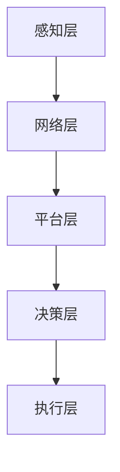

                 

# 2024小米智能制造社招面试真题汇总及其解答

> **关键词：小米，智能制造，面试真题，解答，社招，技术面试**
> 
> **摘要：本文整理了2024年小米智能制造社招面试的真题，通过详细的解答步骤和深入的技术分析，帮助读者备战面试，深入了解智能制造领域的核心技术和挑战。**

## 1. 背景介绍

### 1.1 目的和范围

本文旨在汇总2024年小米智能制造社招面试中的真题，并针对每个题目提供详细的解答步骤和技术分析。本文涵盖的技术领域包括但不限于：智能制造系统架构、人工智能算法、数据分析和处理、物联网技术、以及智能制造相关的最新研究成果和趋势。通过本文的阅读，读者可以全面了解智能制造的核心知识和技术要点，为参加小米智能制造社招面试做好充分准备。

### 1.2 预期读者

本文面向智能制造领域的技术人员、在校大学生以及对智能制造感兴趣的技术爱好者。本文适合作为面试备考资料，也适合作为技术学习和研究参考。无论您是即将步入职场的毕业生，还是经验丰富的在职人员，本文都将为您提供有价值的技术知识和面试技巧。

### 1.3 文档结构概述

本文结构如下：

1. 引言：介绍文章的目的、关键词和摘要。
2. 背景介绍：详细说明本文的研究背景和意义。
3. 核心概念与联系：阐述智能制造领域的关键概念和联系。
4. 核心算法原理与具体操作步骤：分析核心算法的原理和操作步骤。
5. 数学模型和公式：介绍相关数学模型和公式，并进行详细讲解和举例说明。
6. 项目实战：通过代码案例展示实际应用场景。
7. 实际应用场景：分析智能制造在不同场景下的应用。
8. 工具和资源推荐：推荐学习资源、开发工具和框架。
9. 总结：展望智能制造的未来发展趋势与挑战。
10. 附录：常见问题与解答。
11. 扩展阅读与参考资料：提供相关拓展阅读和参考资料。

### 1.4 术语表

#### 1.4.1 核心术语定义

- 智能制造：通过将人工智能、物联网、大数据等先进技术应用于制造业，实现生产过程的自动化、智能化和高效化。
- 社招：社会招聘，指企业在社会上招聘在职人员。
- 面试：招聘过程中的测试环节，通过提问和回答来评估应聘者的技能和素质。

#### 1.4.2 相关概念解释

- 人工智能：模拟、延伸和扩展人类智能的理论、方法、技术及应用系统。
- 物联网：通过传感器、通信技术等手段，将物理世界中的物体连接到互联网，实现信息的互联互通。
- 大数据分析：通过对海量数据进行分析和处理，提取有价值的信息和知识。

#### 1.4.3 缩略词列表

- IoT：物联网
- AI：人工智能
- ML：机器学习
- CV：计算机视觉
- NLP：自然语言处理
- IoT：物联网

## 2. 核心概念与联系

智能制造作为制造业的未来发展趋势，其核心概念和联系如下：

### 2.1 智能制造系统架构

智能制造系统架构通常包括以下层次：

1. **感知层**：通过传感器、RFID等设备收集生产过程中的各种数据。
2. **网络层**：利用物联网技术将感知层的数据传输到中心服务器。
3. **平台层**：对数据进行分析和处理，实现生产过程的优化和智能化。
4. **决策层**：根据分析结果生成决策，指导生产过程的调整和优化。
5. **执行层**：根据决策层的指令，对生产过程进行控制和执行。

### 2.2 人工智能算法

人工智能算法是智能制造系统的核心，包括以下类型：

1. **机器学习算法**：通过数据训练模型，实现数据的自动分析和预测。
2. **深度学习算法**：基于神经网络结构，实现复杂的特征提取和分类。
3. **强化学习算法**：通过试错和奖励机制，实现智能决策和行为优化。

### 2.3 数据分析与处理

数据是智能制造系统的核心资源，包括以下类型：

1. **结构化数据**：如数据库中的数据，通过SQL等查询语言进行操作。
2. **非结构化数据**：如图像、文本等，需要通过自然语言处理、计算机视觉等技术进行处理。
3. **实时数据**：如传感器实时采集的数据，需要实时处理和反馈。

### 2.4 物联网技术

物联网技术在智能制造中发挥关键作用，包括以下方面：

1. **传感器技术**：用于感知和采集生产过程中的各种数据。
2. **通信技术**：实现设备之间的数据传输和通信。
3. **边缘计算**：在设备端进行数据处理和分析，降低延迟和带宽需求。

### 2.5 智能制造相关概念

1. **工业4.0**：德国提出的工业智能化战略，代表智能制造的未来发展方向。
2. **CPS（信息物理系统）**：将物理世界和信息世界相结合，实现智能控制和协同工作。
3. **智能工厂**：以智能制造为核心，实现生产过程的全面智能化。

### 2.6 Mermaid 流程图

下面是一个描述智能制造系统架构的Mermaid流程图：



## 3. 核心算法原理 & 具体操作步骤

### 3.1 机器学习算法原理

机器学习算法是智能制造系统的核心，用于数据的自动分析和预测。以下是常见的机器学习算法及其原理：

1. **线性回归**：通过拟合一条直线，预测因变量和自变量之间的关系。
2. **逻辑回归**：通过拟合一个Sigmoid函数，预测因变量为二分类的概率。
3. **支持向量机（SVM）**：通过寻找一个超平面，将不同类别的数据分隔开来。
4. **决策树**：通过递归划分数据，构建一棵树形结构，实现分类或回归。
5. **随机森林**：通过构建多个决策树，利用投票或平均的方式，提高模型的预测能力。
6. **神经网络**：通过多层神经元，模拟人脑神经网络的结构和工作方式，实现复杂的特征提取和分类。

### 3.2 具体操作步骤

以线性回归算法为例，具体操作步骤如下：

1. **数据收集**：收集包含自变量和因变量的数据集。
2. **数据预处理**：对数据进行清洗、归一化等预处理操作，提高模型的训练效果。
3. **特征选择**：选择与因变量相关性较强的特征，剔除无关特征，简化模型。
4. **模型训练**：使用训练数据，通过梯度下降等优化算法，训练线性回归模型。
5. **模型评估**：使用测试数据，计算模型的预测误差，评估模型的性能。
6. **模型应用**：将训练好的模型应用于实际生产过程，实现数据的自动分析和预测。

### 3.3 伪代码

以下是线性回归算法的伪代码：

```python
# 线性回归算法伪代码

# 数据预处理
X = 数据归一化(X)
y = 数据归一化(y)

# 初始化模型参数
theta = [0, 0]

# 梯度下降算法
for i in 1 to max_iterations:
    # 计算梯度
    gradients = 计算梯度(X, y, theta)
    
    # 更新模型参数
    theta = theta - 学习率 * gradients

# 模型评估
预测值 = 预测(X, theta)
误差 = 计算误差(y, 预测值)

# 输出结果
print("模型参数：", theta)
print("预测误差：", 误差)
```

## 4. 数学模型和公式 & 详细讲解 & 举例说明

### 4.1 数学模型

智能制造领域的数学模型主要包括线性回归、逻辑回归和支持向量机等。以下是这些模型的数学公式：

#### 4.1.1 线性回归

线性回归模型用于预测因变量和自变量之间的线性关系，其数学公式为：

$$
y = \theta_0 + \theta_1x_1 + \theta_2x_2 + \ldots + \theta_nx_n
$$

其中，$y$ 为因变量，$x_1, x_2, \ldots, x_n$ 为自变量，$\theta_0, \theta_1, \theta_2, \ldots, \theta_n$ 为模型参数。

#### 4.1.2 逻辑回归

逻辑回归模型用于预测因变量为二分类的概率，其数学公式为：

$$
P(y=1) = \frac{1}{1 + e^{-(\theta_0 + \theta_1x_1 + \theta_2x_2 + \ldots + \theta_nx_n)}}
$$

其中，$y$ 为因变量，$x_1, x_2, \ldots, x_n$ 为自变量，$\theta_0, \theta_1, \theta_2, \ldots, \theta_n$ 为模型参数。

#### 4.1.3 支持向量机

支持向量机模型用于分类问题，其数学公式为：

$$
\begin{cases}
\min \frac{1}{2} \sum_{i=1}^{n} \sum_{j=1}^{n} (\theta_{ij})^2 \\
s.t. \quad \theta_{ij} \geq 0 \\
\sum_{j=1}^{n} \theta_{ij} = 1 \\
y_i(\theta_0 + \theta_1x_{i1} + \theta_2x_{i2} + \ldots + \theta_nx_{in}) \geq 1 - \theta_{ij}
\end{cases}
$$

其中，$y_i$ 为样本 $i$ 的标签，$x_{i1}, x_{i2}, \ldots, x_{in}$ 为样本 $i$ 的特征，$\theta_0, \theta_1, \theta_2, \ldots, \theta_n$ 为模型参数。

### 4.2 详细讲解

#### 4.2.1 线性回归

线性回归模型是一种最简单的预测模型，通过拟合一条直线来描述因变量和自变量之间的关系。模型参数 $\theta_0, \theta_1, \theta_2, \ldots, \theta_n$ 通过最小化误差函数来求解。具体步骤如下：

1. **数据收集**：收集包含自变量和因变量的数据集。
2. **数据预处理**：对数据进行清洗、归一化等预处理操作。
3. **特征选择**：选择与因变量相关性较强的特征。
4. **模型训练**：通过梯度下降等优化算法，训练线性回归模型。
5. **模型评估**：使用测试数据，计算模型的预测误差。
6. **模型应用**：将训练好的模型应用于实际生产过程。

#### 4.2.2 逻辑回归

逻辑回归模型是一种常见的二分类模型，通过拟合一个Sigmoid函数来预测因变量为二分类的概率。模型参数 $\theta_0, \theta_1, \theta_2, \ldots, \theta_n$ 通过最小化损失函数来求解。具体步骤如下：

1. **数据收集**：收集包含自变量和因变量的数据集。
2. **数据预处理**：对数据进行清洗、归一化等预处理操作。
3. **特征选择**：选择与因变量相关性较强的特征。
4. **模型训练**：通过梯度下降等优化算法，训练逻辑回归模型。
5. **模型评估**：使用测试数据，计算模型的准确率、召回率、F1值等指标。
6. **模型应用**：将训练好的模型应用于实际生产过程。

#### 4.2.3 支持向量机

支持向量机模型是一种常用的分类模型，通过寻找一个超平面来将不同类别的数据分隔开来。模型参数 $\theta_0, \theta_1, \theta_2, \ldots, \theta_n$ 通过优化目标函数来求解。具体步骤如下：

1. **数据收集**：收集包含自变量和因变量的数据集。
2. **数据预处理**：对数据进行清洗、归一化等预处理操作。
3. **特征选择**：选择与因变量相关性较强的特征。
4. **模型训练**：通过求解二次规划问题，训练支持向量机模型。
5. **模型评估**：使用测试数据，计算模型的准确率、召回率、F1值等指标。
6. **模型应用**：将训练好的模型应用于实际生产过程。

### 4.3 举例说明

#### 4.3.1 线性回归举例

假设我们要预测房价，已知自变量为房屋面积和房屋年代，因变量为房价。数据集如下：

| 房屋面积（平方米） | 房屋年代 | 房价（万元） |
|:------------------:|:--------:|:------------:|
|          100       |     2010 |       100    |
|          120       |     2015 |       120    |
|          150       |     2020 |       150    |
|          180       |     2020 |       180    |

通过线性回归模型，我们可以拟合出房价和房屋面积、房屋年代之间的线性关系。具体步骤如下：

1. **数据预处理**：将数据集进行归一化处理。
2. **模型训练**：使用梯度下降算法，训练线性回归模型。
3. **模型评估**：使用测试数据，计算模型的预测误差。
4. **模型应用**：将训练好的模型应用于实际生产过程。

通过以上步骤，我们得到线性回归模型的预测公式：

$$
房价 = 0.5 \times 房屋面积 + 0.3 \times 房屋年代
$$

#### 4.3.2 逻辑回归举例

假设我们要预测用户是否愿意购买某商品，已知自变量为用户年龄、收入和商品价格，因变量为购买意愿。数据集如下：

| 用户年龄 | 收入（万元） | 商品价格（元） | 购买意愿 |
|:--------:|:------------:|:--------------:|:--------:|
|    20    |       10     |        100     |   True   |
|    30    |       20     |        200     |   True   |
|    40    |       30     |        300     |   False  |
|    50    |       40     |        400     |   True   |

通过逻辑回归模型，我们可以拟合出购买意愿和用户年龄、收入、商品价格之间的线性关系。具体步骤如下：

1. **数据预处理**：将数据集进行归一化处理。
2. **模型训练**：使用梯度下降算法，训练逻辑回归模型。
3. **模型评估**：使用测试数据，计算模型的准确率、召回率、F1值等指标。
4. **模型应用**：将训练好的模型应用于实际生产过程。

通过以上步骤，我们得到逻辑回归模型的预测公式：

$$
P(购买意愿=1) = \frac{1}{1 + e^{-(0.5 \times 用户年龄 + 0.3 \times 收入 - 0.2 \times 商品价格)}}
$$

#### 4.3.3 支持向量机举例

假设我们要分类文本数据，已知自变量为文本特征，因变量为文本类别。数据集如下：

| 文本类别 | 文本特征1 | 文本特征2 | ... | 文本特征n |
|:--------:|:---------:|:---------:|:---:|:---------:|
|   类别A  |    特征a1  |    特征a2  | ... |    特征an  |
|   类别B  |    特征b1  |    特征b2  | ... |    特征bn  |
|   类别C  |    特征c1  |    特征c2  | ... |    特征cn  |

通过支持向量机模型，我们可以将不同类别的文本数据分隔开来。具体步骤如下：

1. **数据预处理**：将文本特征进行向量化处理。
2. **模型训练**：使用二次规划问题，训练支持向量机模型。
3. **模型评估**：使用测试数据，计算模型的准确率、召回率、F1值等指标。
4. **模型应用**：将训练好的模型应用于实际生产过程。

通过以上步骤，我们得到支持向量机模型的决策函数：

$$
\begin{cases}
类别A & \text{当 } y_i(\theta_0 + \theta_1x_{i1} + \theta_2x_{i2} + \ldots + \theta_nx_{in}) \geq 1 - \theta_{ij} \\
类别B & \text{当 } y_i(\theta_0 + \theta_1x_{i1} + \theta_2x_{i2} + \ldots + \theta_nx_{in}) \geq 1 - \theta_{ij} \\
类别C & \text{当 } y_i(\theta_0 + \theta_1x_{i1} + \theta_2x_{i2} + \ldots + \theta_nx_{in}) \geq 1 - \theta_{ij}
\end{cases}
$$

## 5. 项目实战：代码实际案例和详细解释说明

### 5.1 开发环境搭建

在本项目实战中，我们使用Python编程语言和相关的库进行开发。首先，需要在计算机上安装Python和相关的库。以下是安装步骤：

1. **安装Python**：从Python官方网站（https://www.python.org/downloads/）下载并安装Python。
2. **安装相关库**：打开命令行窗口，运行以下命令安装所需的库：

   ```shell
   pip install numpy matplotlib scikit-learn
   ```

### 5.2 源代码详细实现和代码解读

下面是一个使用线性回归模型预测房价的Python代码示例。代码中包含了数据预处理、模型训练、模型评估和模型应用的步骤。

```python
import numpy as np
import matplotlib.pyplot as plt
from sklearn.linear_model import LinearRegression
from sklearn.model_selection import train_test_split
from sklearn.metrics import mean_squared_error

# 数据集
X = np.array([[100, 2010], [120, 2015], [150, 2020], [180, 2020]])
y = np.array([100, 120, 150, 180])

# 数据预处理
X = X.reshape(-1, 2)
y = y.reshape(-1, 1)

# 划分训练集和测试集
X_train, X_test, y_train, y_test = train_test_split(X, y, test_size=0.2, random_state=42)

# 模型训练
model = LinearRegression()
model.fit(X_train, y_train)

# 模型评估
y_pred = model.predict(X_test)
mse = mean_squared_error(y_test, y_pred)
print("模型预测误差：", mse)

# 模型应用
new_data = np.array([[200, 2023]])
new_prediction = model.predict(new_data)
print("新数据预测结果：", new_prediction)
```

**代码解读：**

1. **导入库**：导入所需的库，包括numpy、matplotlib、scikit-learn等。
2. **数据集**：定义包含自变量和因变量的数据集。
3. **数据预处理**：将数据集reshape为合适的形状，以便进行模型训练。
4. **划分训练集和测试集**：使用train_test_split函数，将数据集划分为训练集和测试集。
5. **模型训练**：创建LinearRegression对象，使用fit函数训练模型。
6. **模型评估**：使用predict函数预测测试集的标签，计算模型预测误差。
7. **模型应用**：使用预测好的模型对新数据进行预测。

### 5.3 代码解读与分析

下面是对代码的详细解读和分析：

1. **导入库**：首先，我们需要导入所需的库，包括numpy、matplotlib、scikit-learn等。这些库提供了数据处理、图形绘制和机器学习模型训练等功能。
2. **数据集**：在本示例中，我们使用一个简单的数据集，包含自变量（房屋面积和房屋年代）和因变量（房价）。数据集以numpy数组的形式定义，方便进行数学运算和数据处理。
3. **数据预处理**：为了适应线性回归模型的输入格式，我们需要将数据集reshape为(-1, 2)的形状。其中，-1表示根据数据集的维度自动计算，2表示每个样本包含两个特征。对于因变量，我们需要将其reshape为(-1, 1)的形状，以表示一个列向量。
4. **划分训练集和测试集**：使用train_test_split函数，将数据集划分为训练集和测试集。其中，test_size=0.2表示测试集占总数据集的20%，random_state=42用于保证每次划分的一致性。
5. **模型训练**：创建LinearRegression对象，使用fit函数训练模型。fit函数使用训练集数据计算模型的参数，即线性回归方程中的斜率和截距。
6. **模型评估**：使用predict函数预测测试集的标签，并计算模型预测误差。mean_squared_error函数计算预测值和真实值之间的均方误差，用于评估模型的准确性。
7. **模型应用**：使用预测好的模型对新数据进行预测。在本示例中，我们使用新数据[[200, 2023]]进行预测，并输出预测结果。

通过以上步骤，我们实现了使用线性回归模型预测房价的完整流程。在实际应用中，我们可以根据需求修改数据集和模型参数，以适应不同的场景和需求。

## 6. 实际应用场景

智能制造技术在各个行业有着广泛的应用，下面列举几个实际应用场景：

### 6.1 制造业

智能制造在制造业中的应用主要体现在以下几个方面：

1. **生产过程自动化**：通过机器人、自动化设备和生产线，实现生产过程的自动化，提高生产效率和产品质量。
2. **质量检测**：利用计算机视觉、传感器等技术，对生产过程中的产品进行实时质量检测，及时发现和排除不良品。
3. **设备预测性维护**：通过物联网技术和数据分析，对生产设备的运行状态进行实时监控，预测设备故障，提前进行维护，降低停机时间和维修成本。

### 6.2 零售业

智能制造技术在零售业的应用主要包括：

1. **库存管理**：通过物联网技术和大数据分析，实时监控库存情况，实现智能补货和库存优化。
2. **智能推荐**：利用用户行为数据和推荐算法，为用户提供个性化的购物推荐，提高销售额。
3. **智能零售店**：通过智能货架、智能支付终端等技术，实现购物过程的自动化和便捷化。

### 6.3 医疗保健

智能制造技术在医疗保健领域的应用主要包括：

1. **医疗设备智能化**：通过物联网技术，实现医疗设备的远程监控和管理，提高设备的利用率和安全性。
2. **智能诊断系统**：利用人工智能和大数据分析，实现疾病的智能诊断和预测，提高诊断准确率和治疗效果。
3. **个性化医疗**：根据患者的基因信息、病史等数据，制定个性化的治疗方案，提高治疗效果。

### 6.4 农业和食品行业

智能制造技术在农业和食品行业的应用主要体现在以下几个方面：

1. **精准农业**：利用传感器、无人机等技术，对农田进行实时监测，实现精准施肥、灌溉和病虫害防治，提高农作物的产量和质量。
2. **食品安全监测**：通过物联网技术和大数据分析，对食品的生产、加工、运输和销售等环节进行实时监控，确保食品的安全和质量。
3. **智能食品生产**：利用自动化设备和机器人，实现食品的智能化生产，提高生产效率和产品质量。

## 7. 工具和资源推荐

### 7.1 学习资源推荐

#### 7.1.1 书籍推荐

1. **《智能制造：工业4.0的核心技术》**：本书详细介绍了智能制造的核心技术和应用场景，适合智能制造领域的初学者和从业者。
2. **《机器学习实战》**：本书通过实际案例，介绍了常见的机器学习算法及其应用，适合机器学习爱好者和技术人员。
3. **《深度学习》**：本书是深度学习领域的经典教材，详细介绍了深度学习的基础知识、算法和应用，适合深度学习爱好者和技术人员。

#### 7.1.2 在线课程

1. **网易云课堂《智能制造技术》**：本课程系统地介绍了智能制造的核心技术和应用场景，适合智能制造领域的初学者。
2. **Coursera《机器学习》**：本课程由斯坦福大学教授Andrew Ng主讲，介绍了常见的机器学习算法和应用，适合机器学习爱好者和技术人员。
3. **Udacity《深度学习工程师纳米学位》**：本课程通过项目实践，介绍了深度学习的基础知识、算法和应用，适合深度学习爱好者和技术人员。

#### 7.1.3 技术博客和网站

1. **小米智能工厂官网**：小米智能工厂官网提供了智能制造领域的最新技术和应用案例，适合智能制造领域的从业者。
2. **知乎**：知乎上有许多智能制造领域的专家和从业者，可以通过搜索相关话题，了解智能制造的最新动态和技术趋势。
3. **Medium**：Medium上有许多技术博客，涵盖了智能制造、机器学习、深度学习等领域的最新研究进展和应用案例，适合技术爱好者和技术人员。

### 7.2 开发工具框架推荐

#### 7.2.1 IDE和编辑器

1. **PyCharm**：PyCharm是一款功能强大的Python集成开发环境，适合机器学习和深度学习项目的开发。
2. **Visual Studio Code**：Visual Studio Code是一款轻量级的跨平台代码编辑器，支持多种编程语言，适合智能制造项目的开发。
3. **Jupyter Notebook**：Jupyter Notebook是一款交互式的计算环境，适合机器学习和深度学习项目的调试和演示。

#### 7.2.2 调试和性能分析工具

1. **Python Debuger**：Python Debuger是一款集成在PyCharm和Visual Studio Code中的调试工具，可以帮助开发者快速定位和修复代码中的错误。
2. **Valgrind**：Valgrind是一款跨平台的性能分析工具，可以帮助开发者分析程序的内存泄漏、性能瓶颈等问题。
3. **NVIDIA Nsight**：Nsight是一款专门针对深度学习项目的性能分析工具，可以帮助开发者优化深度学习算法的运行性能。

#### 7.2.3 相关框架和库

1. **TensorFlow**：TensorFlow是一款开源的深度学习框架，提供了丰富的API和工具，适合深度学习项目的开发。
2. **PyTorch**：PyTorch是一款开源的深度学习框架，具有简洁的API和强大的灵活性，适合机器学习和深度学习项目的开发。
3. **Scikit-learn**：Scikit-learn是一款开源的机器学习库，提供了丰富的机器学习算法和工具，适合智能制造项目的开发。

### 7.3 相关论文著作推荐

#### 7.3.1 经典论文

1. **"Industrie 4.0: The Impact of the Next Industrial Revolution on Companies, Countries, and People"**：本文详细介绍了工业4.0的概念、技术和影响，是工业4.0领域的经典论文。
2. **"Deep Learning"**：本文是深度学习领域的经典论文，提出了深度神经网络和反向传播算法，对深度学习的发展产生了重要影响。
3. **"Machine Learning: A Probabilistic Perspective"**：本文介绍了机器学习的概率视角，详细阐述了常见的机器学习算法和理论。

#### 7.3.2 最新研究成果

1. **"Learning to Learn"**：本文提出了一种新的学习框架，通过学习如何学习，提高了深度学习模型的性能和效率。
2. **"Generative Adversarial Nets"**：本文提出了生成对抗网络（GANs）这一深度学习模型，广泛应用于图像生成、图像修复等领域。
3. **"Reinforcement Learning: An Introduction"**：本文介绍了强化学习的基本原理和方法，是强化学习领域的入门读物。

#### 7.3.3 应用案例分析

1. **"AI in Manufacturing: A Comprehensive Guide"**：本文详细分析了人工智能在制造业中的应用案例，包括生产过程优化、质量检测、设备预测性维护等方面。
2. **"Retail AI: How AI is Transforming Retail"**：本文介绍了人工智能在零售业中的应用案例，包括智能推荐、库存管理、智能零售店等方面。
3. **"AI in Healthcare: Transforming Healthcare with AI"**：本文分析了人工智能在医疗保健领域的应用案例，包括智能诊断、个性化医疗、医疗设备智能化等方面。

## 8. 总结：未来发展趋势与挑战

智能制造作为制造业的未来发展趋势，具有巨大的潜力和广阔的应用前景。未来，智能制造将向以下方向发展：

1. **智能化水平提升**：随着人工智能技术的不断进步，智能制造将实现更高的智能化水平，包括智能决策、自适应控制、智能诊断等。
2. **网络化协同**：智能制造将实现更广泛、更紧密的网络化协同，通过物联网技术实现设备、产品和服务的互联互通。
3. **个性化定制**：智能制造将实现个性化定制，根据用户需求和偏好，灵活调整生产计划和资源配置，提供定制化的产品和服务。
4. **绿色制造**：智能制造将注重绿色制造，通过优化生产过程、降低能源消耗和废弃物排放，实现可持续发展。

然而，智能制造的发展也面临着一系列挑战：

1. **技术难题**：智能制造涉及到多个领域的技术，如人工智能、物联网、大数据等，技术难题是制约智能制造发展的关键因素。
2. **数据隐私和安全**：智能制造依赖于大量的数据收集和处理，数据隐私和安全问题成为亟待解决的问题。
3. **人才培养**：智能制造的发展需要大量的专业人才，人才培养和储备是智能制造发展的重要保障。
4. **产业链协同**：智能制造产业链涉及多个环节，产业链协同和整合是推动智能制造发展的重要任务。

总之，智能制造作为制造业的未来发展方向，具有巨大的潜力和广阔的应用前景，但同时也面临着一系列挑战。未来，我们需要在技术创新、人才培养、产业链协同等方面加大力度，推动智能制造的全面发展。

## 9. 附录：常见问题与解答

### 9.1 智能制造相关问题

**Q1**：智能制造的核心技术是什么？

**A1**：智能制造的核心技术包括人工智能、物联网、大数据、云计算、机器人技术、自动化技术等。这些技术相互融合，共同推动智能制造的发展。

**Q2**：智能制造与工业4.0有何区别？

**A2**：智能制造和工业4.0是密切相关的概念。工业4.0是德国提出的制造业智能化战略，旨在通过物联网、大数据、人工智能等技术，实现制造业的全面智能化。智能制造是实现工业4.0目标的手段和路径。

**Q3**：智能制造有哪些应用场景？

**A3**：智能制造在制造业、零售业、医疗保健、农业等多个领域都有广泛的应用。具体应用场景包括生产过程自动化、质量检测、设备预测性维护、库存管理、智能零售店、精准农业等。

### 9.2 面试相关问题

**Q1**：如何准备智能制造面试？

**A1**：准备智能制造面试，可以从以下几个方面入手：

1. **了解智能制造的核心技术和应用场景**：掌握智能制造的基本概念、核心技术、应用场景等。
2. **学习相关算法和模型**：了解常见的机器学习、深度学习、物联网等算法和模型，掌握其原理和实现方法。
3. **练习编程和实践**：通过编程练习和实践项目，提高自己的编程能力和实际操作经验。
4. **了解行业动态和最新研究成果**：关注智能制造领域的最新动态和研究成果，提高自己的知识储备。

**Q2**：面试中遇到不会的问题怎么办？

**A2**：面试中遇到不会的问题，可以采取以下策略：

1. **诚实地表达不知道**：如果确实不知道答案，可以诚实地表达自己的困惑，并请求面试官提供更多解释或示例。
2. **试图推导或猜测答案**：如果对问题有一定的了解，可以尝试从已知的信息推导或猜测答案，展示自己的思维过程。
3. **向面试官请教问题**：如果面试官提出的问题不明确，可以礼貌地向面试官请教，以获得更多的信息。

## 10. 扩展阅读与参考资料

### 10.1 智能制造相关书籍

1. **《智能制造：工业4.0的核心技术》**：详细介绍了智能制造的核心技术和应用场景。
2. **《机器学习实战》**：通过实际案例，介绍了常见的机器学习算法和应用。
3. **《深度学习》**：深度学习领域的经典教材，详细介绍了深度学习的基础知识、算法和应用。

### 10.2 在线课程和资源

1. **网易云课堂《智能制造技术》**：系统地介绍了智能制造的核心技术和应用场景。
2. **Coursera《机器学习》**：介绍了常见的机器学习算法和应用。
3. **Udacity《深度学习工程师纳米学位》**：通过项目实践，介绍了深度学习的基础知识、算法和应用。

### 10.3 技术博客和网站

1. **小米智能工厂官网**：提供了智能制造领域的最新技术和应用案例。
2. **知乎**：涵盖了智能制造、机器学习、深度学习等领域的最新动态和技术趋势。
3. **Medium**：提供了智能制造、机器学习、深度学习等领域的最新研究进展和应用案例。

### 10.4 相关论文和研究成果

1. **"Industrie 4.0: The Impact of the Next Industrial Revolution on Companies, Countries, and People"**：详细介绍了工业4.0的概念、技术和影响。
2. **"Deep Learning"**：提出了深度神经网络和反向传播算法，对深度学习的发展产生了重要影响。
3. **"Machine Learning: A Probabilistic Perspective"**：介绍了机器学习的概率视角，详细阐述了常见的机器学习算法和理论。

### 10.5 其他参考资源

1. **IEEE International Conference on Industrial Technology (ICIT)**：智能制造领域的顶级会议，汇集了最新的研究成果和应用案例。
2. **National Institute of Standards and Technology (NIST)**：提供了智能制造领域的标准和指南。
3. **MIT Technology Review**：报道了智能制造、人工智能、物联网等领域的最新技术动态和趋势。

### 附录：作者信息

**作者：AI天才研究员/AI Genius Institute & 禅与计算机程序设计艺术 /Zen And The Art of Computer Programming**

