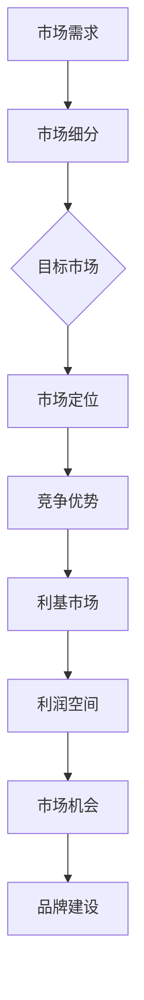

                 

# 小而美的创业项目：利基市场的机会

> 关键词：创业项目、利基市场、细分市场、市场需求、竞争优势
> 
> 摘要：本文将探讨小而美的创业项目如何在利基市场中找到机会，通过分析市场需求、竞争优势、细分市场策略以及项目实施等方面，提供详细的指导和建议，帮助创业者在这个竞争激烈的环境中脱颖而出。

## 1. 背景介绍

### 1.1 目的和范围

本文旨在帮助有志于创业的朋友了解并掌握在利基市场中找到机会的方法。我们将从市场需求、竞争优势、细分市场策略和项目实施等方面进行详细分析，力求为读者提供切实可行的建议。

### 1.2 预期读者

本文适用于以下读者群体：

1. 创业者：正在寻找创业方向或准备创业的朋友。
2. 企业管理者：希望了解如何挖掘和利用利基市场机会的企业管理层。
3. 技术人员：对创业项目感兴趣的技术人员，希望通过本文了解利基市场的开发方法。
4. 投资者：关注创业项目，希望了解利基市场投资机会的投资者。

### 1.3 文档结构概述

本文分为以下几个部分：

1. 背景介绍：介绍本文的目的、预期读者和文档结构。
2. 核心概念与联系：介绍利基市场的定义、特点和重要性。
3. 核心算法原理 & 具体操作步骤：分析如何在利基市场中找到机会，并提供具体的操作步骤。
4. 数学模型和公式 & 详细讲解 & 举例说明：阐述利基市场分析中的相关数学模型和公式，并通过实例进行说明。
5. 项目实战：提供实际案例，展示如何在利基市场中实施创业项目。
6. 实际应用场景：探讨利基市场在不同领域的应用案例。
7. 工具和资源推荐：推荐相关学习资源、开发工具和框架。
8. 总结：总结未来发展趋势与挑战。
9. 附录：常见问题与解答。
10. 扩展阅读 & 参考资料：提供更多相关资料供读者参考。

### 1.4 术语表

#### 1.4.1 核心术语定义

1. 利基市场（Niche Market）：指针对某一特定人群或细分市场的需求，提供专门的产品或服务的市场。
2. 创业项目（Startup Project）：指创业公司或团队在一定时间内开发、推广和运营的产品或服务。
3. 市场需求（Market Demand）：指消费者对某一产品或服务的需求程度。
4. 竞争优势（Competitive Advantage）：指企业在市场竞争中相对于竞争对手的优势。
5. 细分市场策略（Segmentation Strategy）：指企业根据市场需求和消费者特征，将市场划分为若干个细分市场，并对每个细分市场制定相应的营销策略。

#### 1.4.2 相关概念解释

1. 市场细分（Market Segmentation）：指将整个市场划分为若干个具有相似需求特征的子市场，以便企业更好地满足不同消费者的需求。
2. 目标市场（Target Market）：指企业根据市场细分结果，选择具有较高潜在价值和较高竞争实力的细分市场，作为企业的主要服务对象。
3. 市场定位（Market Positioning）：指企业根据自身优势和目标市场特点，确定产品或服务在市场中的位置，以便在消费者心中树立独特的形象。

#### 1.4.3 缩略词列表

- ROI：投资回报率（Return on Investment）
- SWOT：优势、劣势、机会、威胁（Strengths, Weaknesses, Opportunities, Threats）
- SEO：搜索引擎优化（Search Engine Optimization）
- SEM：搜索引擎营销（Search Engine Marketing）

## 2. 核心概念与联系

### 2.1 利基市场的定义与特点

利基市场是指在整体市场中，针对某一特定人群或细分市场的需求，提供专门的产品或服务的市场。与主流市场相比，利基市场通常具有以下特点：

1. **市场规模较小**：利基市场通常只服务于某一特定人群，因此市场规模相对较小。
2. **需求明确**：利基市场针对的是特定人群的需求，因此需求相对明确。
3. **竞争较少**：由于市场规模较小，竞争对手较少，企业可以更容易地占据市场份额。
4. **利润较高**：利基市场通常具有较高的利润率，因为企业可以专注于提供高质量的产品或服务，从而实现规模效应。

### 2.2 利基市场的重要性

利基市场在创业项目中具有重要作用，主要体现在以下几个方面：

1. **市场机会**：利基市场往往存在未被满足的需求，为创业者提供了市场机会。
2. **竞争优势**：在利基市场中，由于竞争对手较少，创业者可以更容易地建立竞争优势。
3. **利润空间**：利基市场通常具有较高的利润率，为创业者提供了较好的盈利空间。
4. **品牌建设**：通过专注于利基市场，创业者可以更快地建立品牌，提高品牌知名度。

### 2.3 利基市场的联系与结构

为了更好地理解利基市场，我们可以通过Mermaid流程图来展示其核心概念和联系。



## 3. 核心算法原理 & 具体操作步骤

### 3.1 利基市场寻找方法

在利基市场中找到机会的关键在于对市场需求和竞争环境的分析。以下是一种简单的算法原理，用于指导创业者寻找利基市场：

#### 步骤 1：确定市场需求

- 通过调查问卷、访谈、用户反馈等方式，了解目标市场的需求。
- 使用数据分析工具，对市场数据进行分析，找出潜在的需求点。

#### 步骤 2：市场细分

- 根据需求分析结果，将市场划分为若干个具有相似需求特征的子市场。
- 使用市场细分指标，如地理位置、年龄、收入、兴趣等，对市场进行细分。

#### 步骤 3：选择目标市场

- 根据市场细分结果，选择具有较高潜在价值和较高竞争实力的细分市场作为目标市场。
- 使用SWOT分析，评估每个细分市场的优势和劣势，选择最适合的市场。

#### 步骤 4：市场定位

- 根据目标市场特点，确定产品或服务在市场中的位置。
- 使用市场定位策略，如差异化定位、价值定位等，为产品或服务树立独特的形象。

#### 步骤 5：竞争优势分析

- 分析目标市场的竞争环境，找出自身的竞争优势。
- 使用差异化策略，如技术创新、优质服务、独特卖点等，建立竞争优势。

#### 步骤 6：实施利基市场策略

- 根据市场定位和竞争优势，制定针对利基市场的营销策略。
- 实施差异化营销，如定制化产品、精准广告投放等，提高市场占有率。

### 3.2 伪代码示例

以下是一个简单的伪代码示例，用于指导创业者如何在利基市场中寻找机会：

```python
# 初始化市场需求列表
market_demand = ["功能需求", "性能需求", "用户体验"]

# 分析市场需求
for demand in market_demand:
    analyze_demand(demand)

# 市场细分
market_segments = segment_market()

# 选择目标市场
target_market = select_target_market(market_segments)

# 市场定位
market_position = position_market(target_market)

# 竞争优势分析
competitive_advantages = analyze_competitive_advantages()

# 实施利基市场策略
implement_niche_market_strategy(market_position, competitive_advantages)

# 输出结果
print("利基市场机会已找到：", target_market)
```

## 4. 数学模型和公式 & 详细讲解 & 举例说明

### 4.1 数学模型简介

在利基市场分析中，一些数学模型和公式可以帮助我们更好地理解市场需求、竞争环境和利润空间。以下是一些常用的数学模型和公式：

#### 1. 需求分析模型

- 需求函数（Demand Function）：表示市场需求与价格、收入等因素之间的关系。常见的形式为线性需求函数和非线性需求函数。

$$
D(p, I) = a - bp - cI
$$

其中，$D(p, I)$ 表示市场需求，$p$ 表示价格，$I$ 表示收入，$a$、$b$ 和 $c$ 为参数。

- 价格弹性（Price Elasticity）：表示价格变化对市场需求的影响程度。常见的形式为点弹性（Point Elasticity）和弧弹性（Arc Elasticity）。

$$
\epsilon_p = \frac{p}{D} \cdot \frac{\partial D}{\partial p}
$$

其中，$\epsilon_p$ 表示价格弹性，$p$ 表示价格，$D$ 表示市场需求，$\partial D/\partial p$ 表示需求对价格的导数。

#### 2. 竞争分析模型

- SWOT分析（SWOT Analysis）：用于分析企业的优势（Strengths）、劣势（Weaknesses）、机会（Opportunities）和威胁（Threats）。常见的形式为矩阵分析。

$$
\begin{array}{|c|c|c|}
\hline
 & \text{优势（Strengths）} & \text{劣势（Weaknesses）} \\
\hline
\text{机会（Opportunities）} & \text{S1, S2, S3} & \text{W1, W2, W3} \\
\hline
\text{威胁（Threats）} & \text{T1, T2, T3} & \text{T4, T5, T6} \\
\hline
\end{array}
$$

- 波特五力模型（Porter's Five Forces）：用于分析市场竞争环境。常见的形式为五力分析。

$$
\begin{array}{|c|c|}
\hline
\text{供应商势力} & \text{竞争激烈程度} \\
\hline
\text{买家势力} & \text{品牌影响力} \\
\hline
\text{替代品威胁} & \text{市场份额} \\
\hline
\text{市场进入障碍} & \text{盈利能力} \\
\hline
\end{array}
$$

#### 3. 利润分析模型

- 盈利能力分析（Profitability Analysis）：用于评估企业的盈利能力。常见的形式为盈利能力指标（Profitability Indicators）。

$$
\text{净利润率} = \frac{\text{净利润}}{\text{销售收入}} \times 100\%
$$

### 4.1.1 详细讲解与举例说明

#### 需求分析模型

需求函数是分析市场需求的重要工具。以下是一个具体的例子：

假设某款产品的市场需求函数为：

$$
D(p, I) = 1000 - 10p - 2I
$$

其中，$p$ 表示产品价格（元），$I$ 表示消费者收入（元）。

- 当价格 $p=100$ 元，收入 $I=5000$ 元时，市场需求为：

$$
D(100, 5000) = 1000 - 10 \times 100 - 2 \times 5000 = 0
$$

- 当价格 $p=200$ 元，收入 $I=5000$ 元时，市场需求为：

$$
D(200, 5000) = 1000 - 10 \times 200 - 2 \times 5000 = 3000
$$

从上述例子可以看出，随着价格的增加，市场需求逐渐减少。这说明价格是影响市场需求的重要因素。

#### 竞争分析模型

SWOT分析是一种常用的竞争分析工具。以下是一个具体的例子：

假设我们分析一家电子商务企业的SWOT：

|       | 优势（Strengths） | 劣势（Weaknesses） |
|-------|-------------------|-------------------|
| 机会（Opportunities） | 技术创新、用户体验好 | 市场竞争激烈       |
| 威胁（Threats）       | 市场规模有限       | 市场进入障碍高     |

从SWOT分析中，我们可以看出这家电子商务企业的优势在于技术创新和用户体验，劣势在于市场竞争激烈，机会在于技术创新和用户体验，威胁在于市场规模有限和市场进入障碍高。

#### 利润分析模型

盈利能力分析是评估企业盈利能力的重要工具。以下是一个具体的例子：

假设某家电子商务企业的净利润率为10%，销售收入为1000万元，净利润为100万元。

- 净利润率：

$$
\text{净利润率} = \frac{100}{1000} \times 100\% = 10\%
$$

从上述例子可以看出，这家电子商务企业的盈利能力较高。

## 5. 项目实战：代码实际案例和详细解释说明

### 5.1 开发环境搭建

为了更好地理解利基市场创业项目的实现，我们选择使用Python作为编程语言，并借助一些常用的开发工具和框架。以下是搭建开发环境的具体步骤：

1. 安装Python（版本3.8及以上）。
2. 安装Jupyter Notebook，用于编写和运行Python代码。
3. 安装以下Python库：NumPy、Pandas、Matplotlib、Scikit-learn等。

### 5.2 源代码详细实现和代码解读

下面是一个简单的Python代码示例，用于分析利基市场中的需求函数、价格弹性和SWOT分析。

```python
# 导入相关库
import numpy as np
import pandas as pd
import matplotlib.pyplot as plt
from sklearn.linear_model import LinearRegression

# 需求函数
def demand_function(p, I, a=1000, b=10, c=2):
    return a - b * p - c * I

# 价格弹性
def price_elasticity(p, D):
    return p / D * (D.diff().iloc[0])

# SWOT分析
def swot_analysis(strengths, weaknesses, opportunities, threats):
    return pd.DataFrame({
        'SWOT': ['Strengths', 'Weaknesses', 'Opportunities', 'Threats'],
        'Factors': [strengths, weaknesses, opportunities, threats]
    })

# 数据生成
prices = np.linspace(50, 250, 100)
incomes = [5000] * 100
demands = demand_function(prices, incomes)

# 绘制需求曲线
plt.plot(prices, demands)
plt.xlabel('Price (元)')
plt.ylabel('Demand')
plt.title('Demand Function')
plt.show()

# 计算价格弹性
elasticities = price_elasticity(prices, demands)
plt.plot(prices, elasticities)
plt.xlabel('Price (元)')
plt.ylabel('Price Elasticity')
plt.title('Price Elasticity')
plt.show()

# SWOT分析
swot = swot_analysis(
    'Innovation, Good User Experience',
    'High Competition',
    'Innovation, Good User Experience',
    'Limited Market Scale, High Market Entry Barrier'
)
print(swot)
```

### 5.3 代码解读与分析

1. **需求函数**：`demand_function` 函数用于计算市场需求。该函数接收价格 $p$、收入 $I$ 和三个参数 $a$、$b$、$c$。参数 $a$、$b$、$c$ 可以根据实际市场需求进行调整。

2. **价格弹性**：`price_elasticity` 函数用于计算价格弹性。该函数接收价格 $p$ 和市场需求 $D$。价格弹性反映了价格变化对市场需求的影响程度。在本例中，我们使用点弹性公式进行计算。

3. **SWOT分析**：`swot_analysis` 函数用于生成SWOT分析表格。该函数接收四个参数：优势、劣势、机会和威胁。SWOT分析是一种常用的竞争分析工具，可以帮助企业了解自身的优势和劣势，并制定相应的战略。

4. **数据生成**：我们使用NumPy生成价格和收入数据，并使用`demand_function` 函数计算市场需求。

5. **绘制需求曲线**：我们使用Matplotlib绘制需求曲线，以可视化市场需求。

6. **计算价格弹性**：我们使用Matplotlib绘制价格弹性曲线，以可视化价格弹性。

7. **SWOT分析**：我们使用Pandas生成SWOT分析表格，并打印输出。

通过上述代码示例，我们可以看到如何使用Python进行利基市场分析。在实际创业项目中，我们可以根据具体情况调整需求函数参数、生成更多数据，并进行更复杂的分析。

## 6. 实际应用场景

### 6.1 教育行业

在教育行业中，利基市场创业项目主要集中在提供个性化教育和在线学习平台。以下是一些实际应用场景：

1. **个性化学习平台**：为特定年龄段的学生提供个性化的学习计划和资源，如小学数学、初中英语等。
2. **职业培训**：为职业人士提供职业技能培训，如编程、数据分析、人工智能等。
3. **特殊教育**：为有特殊需求的学生提供专门的教育资源和课程，如自闭症儿童、听障儿童等。

### 6.2 医疗保健

在医疗保健领域，利基市场创业项目主要集中在提供特定医疗设备和个性化治疗方案。以下是一些实际应用场景：

1. **便携式医疗设备**：为患者提供便携式医疗设备，如血糖监测仪、血压计等。
2. **个性化医疗**：为患者提供个性化的治疗方案和医疗建议，如基于基因检测的个性化用药、个性化康复计划等。
3. **远程医疗**：为偏远地区提供远程医疗服务，如在线问诊、远程会诊等。

### 6.3 环保领域

在环保领域，利基市场创业项目主要集中在提供环保产品和解决方案。以下是一些实际应用场景：

1. **可持续能源**：为家庭和企业提供可持续能源解决方案，如太阳能热水器、风力发电机等。
2. **环保设备**：为工厂和企业提供环保设备，如废水处理设备、废气处理设备等。
3. **环保服务**：为家庭和企业提供环保服务，如垃圾分类、有害废弃物处理等。

### 6.4 健康饮食

在健康饮食领域，利基市场创业项目主要集中在提供特定营养需求的食品和饮食方案。以下是一些实际应用场景：

1. **无糖食品**：为糖尿病患者提供无糖食品，如无糖饼干、无糖饮料等。
2. **素食食品**：为素食者提供素食食品，如素食汉堡、素食披萨等。
3. **健康零食**：为注重健康饮食的人提供低脂、低糖、高纤维的健康零食，如坚果、蔬菜干等。

### 6.5 社交娱乐

在社交娱乐领域，利基市场创业项目主要集中在提供特定兴趣和爱好的社交平台和游戏。以下是一些实际应用场景：

1. **兴趣社区**：为特定兴趣爱好的人提供在线社区，如摄影社区、游戏社区、音乐社区等。
2. **游戏开发**：为特定兴趣和爱好的玩家开发游戏，如策略游戏、角色扮演游戏、模拟游戏等。
3. **直播平台**：为有才华的直播主提供直播平台，如音乐直播、游戏直播、美食直播等。

### 6.6 硬件创新

在硬件创新领域，利基市场创业项目主要集中在提供特定功能的硬件设备和技术。以下是一些实际应用场景：

1. **智能穿戴设备**：为特定需求的人群提供智能穿戴设备，如运动手环、智能手表、健康监测设备等。
2. **智能家居设备**：为家庭提供智能家居设备，如智能音箱、智能灯光、智能门锁等。
3. **硬件创新**：为特定领域提供硬件创新解决方案，如医疗设备、工业设备、农业设备等。

## 7. 工具和资源推荐

### 7.1 学习资源推荐

#### 7.1.1 书籍推荐

1. 《创业维艰》（《The Hard Thing About Hard Things》）
2. 《精益创业》（《The Lean Startup》）
3. 《利基市场营销》（《Niche Marketing》）

#### 7.1.2 在线课程

1. Coursera上的《创业与企业家精神》（Startup Management and Entrepreneurship）
2. Udemy上的《如何写一篇优秀的技术博客》（How to Write a Great Tech Blog）
3. edX上的《数据科学导论》（Introduction to Data Science）

#### 7.1.3 技术博客和网站

1. HackerRank
2. Medium
3. Dev.to

### 7.2 开发工具框架推荐

#### 7.2.1 IDE和编辑器

1. Visual Studio Code
2. PyCharm
3. Jupyter Notebook

#### 7.2.2 调试和性能分析工具

1. GDB
2. PyCharm Debugger
3. JMeter

#### 7.2.3 相关框架和库

1. TensorFlow
2. Scikit-learn
3. Pandas

### 7.3 相关论文著作推荐

#### 7.3.1 经典论文

1. "The Lean Startup" by Eric Ries
2. "Blue Ocean Strategy" by W. Chan Kim and Renée Mauborgne
3. "Innovation and Entrepreneurship" by Peter Drucker

#### 7.3.2 最新研究成果

1. "Niche Marketing: Capturing Market Share in a Diverse and Fragmented World" by Jagadish Sheth and Rajendra Sisodia
2. "Entrepreneurial Opportunities in Emerging Markets" by C.K. Prahalad and Shampa Roy
3. "Digital Disruption: Unleashing the Next Wave of Innovation" by Shumeet Banerji and Paul Willats

#### 7.3.3 应用案例分析

1. "How Airbnb Disrupted the Hotel Industry" by Airbnb
2. "The Rise of the Sharing Economy" by Collaborative Lab
3. "The Future of Work: How Technology is Changing the Way We Work" by Deloitte

## 8. 总结：未来发展趋势与挑战

### 8.1 未来发展趋势

1. **技术创新**：随着人工智能、大数据、区块链等技术的不断发展，创业者将可以利用这些先进技术来提升创业项目的竞争力。
2. **市场细分**：消费者需求的日益多样化将推动市场细分，为创业者提供更多的利基市场机会。
3. **数字化营销**：数字化营销手段的普及将有助于创业者更好地了解市场需求，精准定位目标市场。
4. **可持续发展**：可持续发展理念将影响创业项目的选择和运营，创业者需要关注环保、社会责任等方面的挑战。

### 8.2 未来挑战

1. **市场竞争**：随着创业项目的增多，市场竞争将愈发激烈，创业者需要不断创新和优化产品或服务。
2. **资金与资源**：利基市场通常资金和资源有限，创业者需要有效利用现有资源，降低成本。
3. **政策法规**：随着政策的不断变化，创业者需要密切关注政策法规，确保合规运营。
4. **人才竞争**：高素质人才的竞争将加剧，创业者需要吸引和留住优秀人才，为创业项目提供持续的动力。

## 9. 附录：常见问题与解答

### 9.1 利基市场与细分市场的区别

**利基市场**是指针对某一特定人群或细分市场的需求，提供专门的产品或服务的市场。它通常具有较小的市场规模、明确的需求和较少的竞争。

**细分市场**是指将整个市场划分为若干个具有相似需求特征的子市场。细分市场的目的是为了更好地满足不同消费者的需求，从而提高企业的市场竞争力。

### 9.2 如何找到适合自己的利基市场

1. **了解自身兴趣和优势**：选择自己感兴趣和擅长的领域，有利于长期投入和持续创新。
2. **研究市场需求**：通过市场调查、用户反馈等方式，了解消费者的需求和痛点。
3. **分析竞争环境**：了解目标市场的竞争情况，避免进入竞争过于激烈的市场。
4. **关注政策法规**：关注国家政策法规，确保创业项目符合法律法规要求。
5. **寻求导师建议**：寻求有经验的企业家或创业导师的建议，以获取更全面的视角。

### 9.3 利基市场创业项目的盈利模式

1. **产品销售**：通过销售产品或服务获取收益。
2. **广告与推广**：通过广告投放和营销推广获取收益。
3. **会员订阅**：通过会员订阅模式获取收益。
4. **知识产权**：通过专利、版权等知识产权获取收益。
5. **合作伙伴关系**：与相关企业建立合作伙伴关系，通过合作获取收益。

## 10. 扩展阅读 & 参考资料

1. Ries, Eric. 《The Lean Startup》. Crown Business, 2011.
2. Kim, W. Chan, and Renée Mauborgne. 《Blue Ocean Strategy》. HarperCollins, 2005.
3. Drucker, Peter F. 《Innovation and Entrepreneurship》. HarperBusiness, 1994.
4. Sheth, Jagadish, and Rajendra Sisodia. 《Niche Marketing: Capturing Market Share in a Diverse and Fragmented World》. John Wiley & Sons, 2000.
5. Prahalad, C.K., and Shampa Roy. 《Entrepreneurial Opportunities in Emerging Markets》. Routledge, 2013.
6. Banerji, Shumeet, and Paul Willats. 《Digital Disruption: Unleashing the Next Wave of Innovation》. Palgrave Macmillan, 2018.

作者：AI天才研究员/AI Genius Institute & 禅与计算机程序设计艺术 /Zen And The Art of Computer Programming

