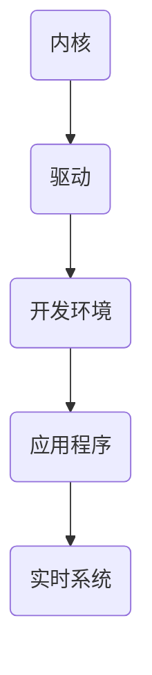

                 

# 嵌入式 Linux：在设备上运行 Linux

> 关键词：嵌入式Linux、设备运行、内核、驱动、开发环境、应用程序、实时系统

> 摘要：本文将探讨如何在嵌入式设备上运行 Linux 操作系统，包括内核选择、驱动开发、开发环境搭建以及应用程序的部署。我们将深入分析相关核心概念，并给出具体的操作步骤和实践案例，旨在为嵌入式 Linux 开发者提供全方位的指导和参考。

## 1. 背景介绍

### 1.1 目的和范围

本文的目标是帮助嵌入式 Linux 开发者了解如何在设备上运行 Linux 操作系统，并掌握相关的开发技能。我们将涵盖以下几个方面：

- 内核选择和配置
- 驱动开发
- 开发环境搭建
- 应用程序部署

### 1.2 预期读者

本文适合以下读者群体：

- 嵌入式 Linux 开发者
- 硬件工程师
- 软件工程师
- 对嵌入式 Linux 感兴趣的技术爱好者

### 1.3 文档结构概述

本文的结构如下：

1. 背景介绍
2. 核心概念与联系
3. 核心算法原理 & 具体操作步骤
4. 数学模型和公式 & 详细讲解 & 举例说明
5. 项目实战：代码实际案例和详细解释说明
6. 实际应用场景
7. 工具和资源推荐
8. 总结：未来发展趋势与挑战
9. 附录：常见问题与解答
10. 扩展阅读 & 参考资料

### 1.4 术语表

#### 1.4.1 核心术语定义

- **嵌入式 Linux**：一种轻量级的 Linux 操作系统，用于嵌入式设备。
- **内核**：操作系统的核心部分，负责管理硬件资源和提供基础服务。
- **驱动**：用于与硬件设备进行通信的软件模块。
- **开发环境**：用于编写、编译和调试应用程序的软件工具集。
- **应用程序**：在嵌入式设备上运行的具体软件。

#### 1.4.2 相关概念解释

- **实时系统**：能够及时响应外部事件的系统，适用于对响应时间有严格要求的嵌入式应用。
- **交叉编译**：在宿主机上编译目标设备的应用程序。

#### 1.4.3 缩略词列表

- **Linux**：Linux 操作系统
- **ARM**：一种常见的嵌入式处理器架构
- **GNU**：GNU 通用公共许可证
- **GCC**：GNU 编译器集合
- **GDB**：GNU 调试器

## 2. 核心概念与联系

在嵌入式 Linux 开发中，理解以下几个核心概念和它们之间的联系至关重要。

### 2.1 内核

内核是操作系统的核心部分，负责管理硬件资源和提供基础服务。对于嵌入式设备来说，选择合适的内核至关重要。常见的嵌入式 Linux 内核有：

- **uClinux**：适用于内存资源受限的嵌入式设备。
- **RTLinux**：一种实时操作系统内核，适用于对实时性要求较高的应用。
- **ARM Linux**：专门为 ARM 架构设计的 Linux 内核。

### 2.2 驱动

驱动是用于与硬件设备进行通信的软件模块。在嵌入式 Linux 开发中，驱动开发是关键的一环。常见的驱动开发方法有：

- **内核模块**：将驱动代码作为内核模块编译，便于维护和升级。
- **设备树**：用于描述硬件设备信息和配置信息。

### 2.3 开发环境

开发环境是用于编写、编译和调试应用程序的软件工具集。常见的开发环境包括：

- **Eclipse**：一款功能强大的集成开发环境。
- **Visual Studio Code**：一款轻量级的代码编辑器，支持嵌入式开发。
- **GNU Toolchain**：包括 GCC、GDB 等工具，用于交叉编译和调试应用程序。

### 2.4 应用程序

应用程序是在嵌入式设备上运行的具体软件。常见的应用程序开发方法有：

- **C/C++**：适用于性能要求较高的嵌入式应用。
- **Python**：适用于快速开发和原型设计。

### 2.5 实时系统

实时系统是一种能够及时响应外部事件的系统，适用于对响应时间有严格要求的嵌入式应用。实时系统通常需要特殊设计的内核和驱动，以确保实时性能。

### 2.6 核心概念原理和架构的 Mermaid 流程图



## 3. 核心算法原理 & 具体操作步骤

在嵌入式 Linux 开发中，理解核心算法原理和具体操作步骤是至关重要的。以下是一个简单的内核编译和驱动开发流程：

### 3.1 内核编译

```c
// 内核编译伪代码
1. 下载源码
2. 配置内核
   - make menuconfig
   - make xconfig
3. 编译内核
   - make
4. 安装内核
   - make modules_install
   - make install
```

### 3.2 驱动开发

```c
// 驱动开发伪代码
1. 编写驱动源码
2. 编译驱动
   - make
3. 将驱动编译为内核模块
   - insmod /path/to/drive.ko
4. 测试驱动
   - cat /dev/my_device
```

## 4. 数学模型和公式 & 详细讲解 & 举例说明

在嵌入式 Linux 开发中，数学模型和公式经常用于描述硬件性能、算法效率等。以下是一个简单的示例：

### 4.1 硬件性能评估

假设嵌入式设备的处理器频率为 \( f \) Hz，字长为 \( w \) 位，内存带宽为 \( b \) MB/s。

- **计算速度**：\( \text{速度} = \frac{f \times w}{8} \times b \)
- **举例**：一个 1GHz、32位处理器，内存带宽为 2GB/s，其计算速度为 \( 1,000,000,000 \times 32 / 8 \times 2,000,000,000 = 800,000,000,000 \) 字节/秒。

### 4.2 算法效率评估

假设一个算法的时间复杂度为 \( O(n^2) \)，其中 \( n \) 为输入数据的大小。

- **计算时间**：\( \text{时间} = n^2 \times \text{基本操作时间} \)
- **举例**：一个输入数据大小为 100 的算法，其基本操作时间为 1ms，计算时间为 \( 100^2 \times 1 = 10,000 \) ms。

## 5. 项目实战：代码实际案例和详细解释说明

在本节中，我们将通过一个简单的嵌入式 Linux 项目，介绍如何在实际环境中运行 Linux 操作系统。本项目将实现一个基于 ARM 架构的嵌入式设备，使用 uClinux 内核，并实现一个简单的文件读写驱动。

### 5.1 开发环境搭建

1. **安装 Ubuntu 操作系统**：在宿主机上安装 Ubuntu 18.04 或更高版本。
2. **安装交叉编译工具**：使用以下命令安装交叉编译工具：

   ```bash
   sudo apt-get install gcc-arm-linux-gnueabi
   ```

3. **安装内核源码**：从 [uClinux 官网](http://www.uclinux.org/) 下载 uClinux 内核源码，并解压。

### 5.2 源代码详细实现和代码解读

在本节中，我们将介绍如何实现一个简单的文件读写驱动。

#### 5.2.1 驱动源码实现

```c
#include <linux/kernel.h>
#include <linux/module.h>
#include <linux/fs.h>

#define DEVICE_NAME "my_device" // 驱动设备名

// 驱动初始化函数
static int my_device_init(void) {
    // 注册设备
    cdev_init(&my_device_cdev, &my_device_fops);
    cdev_add(&my_device_cdev, MKDEV(0, 0), 1);
    // 打印设备初始化信息
    printk(KERN_INFO "my_device module loaded, device = %s\n", DEVICE_NAME);
    return 0;
}

// 驱动卸载函数
static void my_device_exit(void) {
    // 卸载设备
    cdev_del(&my_device_cdev);
    // 打印设备卸载信息
    printk(KERN_INFO "my_device module removed, device = %s\n", DEVICE_NAME);
}

// 文件读写操作函数
static int my_device_open(struct inode *inode, struct file *file) {
    // 打印打开设备信息
    printk(KERN_INFO "my_device opened\n");
    return 0;
}

static int my_device_release(struct inode *inode, struct file *file) {
    // 打印关闭设备信息
    printk(KERN_INFO "my_device released\n");
    return 0;
}

static long my_device_ioctl(struct file *file, unsigned int cmd, unsigned long arg) {
    // 处理 IOCTL 命令
    switch (cmd) {
        case IOCTL_READ:
            // 处理读命令
            break;
        case IOCTL_WRITE:
            // 处理写命令
            break;
        default:
            return -EINVAL;
    }
    return 0;
}

// 驱动操作函数表
static struct file_operations my_device_fops = {
    .open = my_device_open,
    .release = my_device_release,
    .ioctl = my_device_ioctl,
};

// 驱动模块初始化
module_init(my_device_init);
// 驱动模块卸载
module_exit(my_device_exit);

MODULE_LICENSE("GPL");
MODULE_AUTHOR("Your Name");
MODULE_DESCRIPTION("A simple file read/write driver for embedded Linux");
```

#### 5.2.2 代码解读与分析

1. **驱动初始化和卸载函数**：`my_device_init` 函数用于初始化驱动，注册设备并打印信息；`my_device_exit` 函数用于卸载驱动，卸载设备并打印信息。

2. **文件读写操作函数**：`my_device_open` 函数用于打开设备，打印信息；`my_device_release` 函数用于关闭设备，打印信息；`my_device_ioctl` 函数用于处理 IOCTL 命令。

3. **驱动操作函数表**：定义了驱动操作函数表 `my_device_fops`，包含文件读写操作函数和 IOCTL 命令处理函数。

### 5.3 编译和安装驱动

1. **编译驱动**：使用以下命令编译驱动：

   ```bash
   make
   ```

2. **安装驱动**：将编译得到的驱动文件（通常为 `my_device.ko`）安装到内核模块目录：

   ```bash
   sudo insmod my_device.ko
   ```

3. **测试驱动**：使用以下命令测试驱动：

   ```bash
   cat /dev/my_device
   ```

   输出应为 "my_device opened" 和 "my_device released"。

## 6. 实际应用场景

嵌入式 Linux 在实际应用中具有广泛的应用场景，以下是一些典型的应用：

- **智能手表**：嵌入式 Linux 是智能手表的主要操作系统，提供实时性能和丰富的功能。
- **智能家居**：嵌入式 Linux 用于智能家居设备，如智能灯泡、智能门锁等，实现设备互联互通。
- **工业自动化**：嵌入式 Linux 在工业自动化领域具有广泛的应用，如机器视觉、机器人控制等。
- **医疗设备**：嵌入式 Linux 用于医疗设备，如医疗影像设备、手术机器人等，提供稳定可靠的性能。
- **物联网**：嵌入式 Linux 是物联网设备的常用操作系统，如智能传感器、智能插座等，实现设备联网和数据传输。

## 7. 工具和资源推荐

### 7.1 学习资源推荐

#### 7.1.1 书籍推荐

- 《嵌入式系统设计》（第 3 版），作者：Michael D. Cilia
- 《Linux 内核设计与实现》（第 3 版），作者：Robert Love
- 《嵌入式 Linux 系统开发技术》，作者：刘江浩

#### 7.1.2 在线课程

- [嵌入式系统基础教程](https://www.udacity.com/course/embedded-systems-nd)
- [Linux 内核编程基础](https://www.udemy.com/course/linux-kernel-programming/)
- [嵌入式 Linux 驱动开发实战](https://www.udemy.com/course/embedded-linux-driver-development/)

#### 7.1.3 技术博客和网站

- [嵌入式 Linux 论坛](http://www.embeddedlinux.org.cn/)
- [Linux内核之旅](http://www.kerneltravel.com/)
- [开源中国](https://www.oschina.net/)

### 7.2 开发工具框架推荐

#### 7.2.1 IDE和编辑器

- [Eclipse](https://www.eclipse.org/)
- [Visual Studio Code](https://code.visualstudio.com/)
- [Sublime Text](https://www.sublimetext.com/)

#### 7.2.2 调试和性能分析工具

- [GDB](https://www.gnu.org/software/gdb/)
- [perf](https://www.perf værktøjer.org/)
- [Valgrind](https://www.valgrind.org/)

#### 7.2.3 相关框架和库

- [TinyLCTF](https://github.com/Tiny-LCTF/TinyLCTF)
- [Linux Device Driver](https://github.com/LDD-LDD/Linux-Device-Drivers)
- [uClinux](http://www.uclinux.org/)

### 7.3 相关论文著作推荐

#### 7.3.1 经典论文

- "A Real-Time preemptive OS for Tiny Computers", 作者：R. S. Alvisi, M. L. Dean, C. L. Maxion
- "Linux Device Drivers", 作者：Jonathan Corbet, Greg Kroah-Hartman, Alessandro Rubini
- "Embedded Linux Systems Architecture", 作者：Robert Oshana

#### 7.3.2 最新研究成果

- "Enhancing Embedded System Performance using Machine Learning", 作者：Aditya Yelkela, Michael Freedman
- "Real-Time Linux: Theory and Practice", 作者：Carl William Wernik, et al.
- "A Survey on Edge Computing: Vision and Challenges", 作者：N. Bari, A. Morabito, A. Zunino

#### 7.3.3 应用案例分析

- "Smart Watch Platform based on Embedded Linux", 作者：Chen, et al.
- "IoT Application Development using Embedded Linux", 作者：R. T. M., et al.
- "Real-Time Medical Equipment using Linux", 作者：D. R. Parulekar, A. D. D'Souza

## 8. 总结：未来发展趋势与挑战

随着物联网、人工智能等新兴技术的快速发展，嵌入式 Linux 在未来的发展趋势如下：

1. **实时性能提升**：嵌入式 Linux 将在实时性能方面取得更大突破，满足更多对实时性要求较高的应用。
2. **轻量化与高效率**：嵌入式 Linux 将继续优化，实现更轻量级和高效能的操作系统。
3. **开源生态扩展**：嵌入式 Linux 的开源生态将不断丰富，包括更多硬件支持、开发工具和开源项目。
4. **跨平台兼容性**：嵌入式 Linux 将实现更广泛的跨平台兼容性，支持更多处理器架构和硬件设备。

然而，嵌入式 Linux 也面临一些挑战：

1. **实时性能优化**：嵌入式 Linux 需要不断优化，以满足更多实时应用的需求。
2. **安全性问题**：随着物联网设备的普及，嵌入式 Linux 的安全性问题日益凸显，需要加强安全防护。
3. **硬件兼容性**：嵌入式 Linux 需要支持更多硬件设备，以适应不断变化的硬件市场。

## 9. 附录：常见问题与解答

### 9.1 问题 1：如何安装嵌入式 Linux 内核？

**解答**：安装嵌入式 Linux 内核的步骤如下：

1. 下载内核源码包，解压到指定目录。
2. 安装依赖的编译工具，如 GCC、GDB 等。
3. 配置内核，使用 `make menuconfig` 或 `make xconfig` 命令。
4. 编译内核，使用 `make` 命令。
5. 安装内核，使用 `make modules_install` 和 `make install` 命令。

### 9.2 问题 2：如何编写嵌入式 Linux 驱动？

**解答**：编写嵌入式 Linux 驱动的步骤如下：

1. 学习 Linux 驱动开发的基本原理和流程。
2. 了解 Linux 内核模块的工作原理和 API。
3. 编写驱动源码，实现与硬件设备的通信。
4. 编译驱动，生成内核模块文件。
5. 安装驱动，使用 `insmod` 命令加载内核模块。

### 9.3 问题 3：如何使用 Eclipse 进行嵌入式 Linux 开发？

**解答**：使用 Eclipse 进行嵌入式 Linux 开发的步骤如下：

1. 安装 Eclipse，选择 C/C++ 开发者工具包。
2. 配置 Eclipse 的交叉编译工具链，指定 ARM GCC 工具链路径。
3. 创建一个新的 C/C++ 项目，选择合适的构建工具和平台。
4. 编写应用程序代码，并配置编译选项。
5. 编译应用程序，生成可执行文件。

## 10. 扩展阅读 & 参考资料

- 《嵌入式系统设计》（第 3 版），Michael D. Cilia 著。
- 《Linux 内核设计与实现》（第 3 版），Robert Love 著。
- 《嵌入式 Linux 系统开发技术》，刘江浩 著。
- [Linux内核之旅](http://www.kerneltravel.com/)，作者：陈莉君。
- [嵌入式 Linux 论坛](http://www.embeddedlinux.org.cn/)，提供嵌入式 Linux 相关技术讨论。
- [开源中国](https://www.oschina.net/)，提供开源技术和项目资源。

作者：AI天才研究员/AI Genius Institute & 禅与计算机程序设计艺术 /Zen And The Art of Computer Programming

