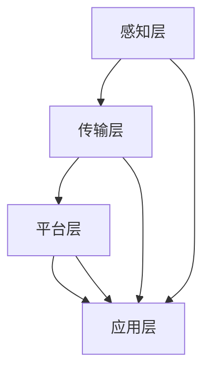

                 

# 工业物联网（IIoT）：智能工厂解决方案

> **关键词**：工业物联网、智能工厂、传感器、数据采集、云计算、机器学习
>
> **摘要**：本文将探讨工业物联网（IIoT）在构建智能工厂中的作用，从核心概念到实际应用，详细解析其原理、架构和实施步骤。文章旨在为IT专业人士和制造业从业者提供全面的技术指南，助力智能工厂的打造。

## 1. 背景介绍

### 1.1 目的和范围

本文旨在深入探讨工业物联网（IIoT）在智能工厂中的应用。我们将从以下几个方面展开讨论：

- **核心概念与联系**：介绍工业物联网的基本概念、关键技术及其相互关系。
- **核心算法原理**：解析工业物联网中的数据采集、传输和处理算法。
- **数学模型和公式**：阐述工业物联网中的数学模型和公式，以及其实际应用。
- **项目实战**：通过实际案例，展示工业物联网在智能工厂中的具体实现。
- **实际应用场景**：探讨工业物联网在制造业中的广泛应用场景。
- **工具和资源推荐**：推荐相关学习资源和开发工具，为读者提供技术支持。
- **总结与未来展望**：总结工业物联网在智能工厂中的发展现状，展望其未来趋势与挑战。

### 1.2 预期读者

本文适合以下读者群体：

- **IT专业人士**：对工业物联网技术感兴趣，希望了解其在智能工厂中的应用。
- **制造业从业者**：关注智能工厂的建设和运营，希望提高生产效率和产品质量。
- **技术爱好者**：对工业物联网技术有浓厚兴趣，希望深入了解其原理和实现。

### 1.3 文档结构概述

本文分为八个部分，具体结构如下：

1. **背景介绍**：阐述本文的目的、预期读者和文档结构。
2. **核心概念与联系**：介绍工业物联网的基本概念、关键技术及其相互关系。
3. **核心算法原理**：解析工业物联网中的数据采集、传输和处理算法。
4. **数学模型和公式**：阐述工业物联网中的数学模型和公式，以及其实际应用。
5. **项目实战**：通过实际案例，展示工业物联网在智能工厂中的具体实现。
6. **实际应用场景**：探讨工业物联网在制造业中的广泛应用场景。
7. **工具和资源推荐**：推荐相关学习资源和开发工具，为读者提供技术支持。
8. **总结与未来展望**：总结工业物联网在智能工厂中的发展现状，展望其未来趋势与挑战。

### 1.4 术语表

#### 1.4.1 核心术语定义

- **工业物联网（IIoT）**：工业物联网是指将物联网技术应用于工业领域，通过传感器、设备、系统和网络实现设备互联、数据采集、分析与应用。
- **智能工厂**：基于工业物联网技术，实现生产设备、生产线、制造过程和企业管理智能化，提高生产效率、降低成本、提升产品质量的现代化工厂。
- **传感器**：能够感知和测量物理量，并将信息转换为电信号的装置。
- **数据采集**：通过传感器和其他设备，将生产过程中的各种数据收集起来，为后续分析提供基础。
- **云计算**：通过互联网提供动态易扩展且经常是虚拟化的资源，以按需提供的服务模式为基础，通过互联网进行数据存储、处理和应用。
- **机器学习**：一种人工智能技术，通过数据分析和模式识别，让计算机自动学习和改进，从而实现预测和决策。

#### 1.4.2 相关概念解释

- **物联网（IoT）**：物联网是指将各种物体通过传感器、网络和系统连接起来，实现信息的收集、传输、处理和应用的系统。
- **边缘计算**：边缘计算是指将数据处理和分析任务从云端转移到网络边缘，降低延迟、提高响应速度，同时减少数据传输量。
- **工业4.0**：工业4.0是指通过工业物联网、云计算、大数据、人工智能等先进技术，实现工业生产过程的智能化、数字化和自动化。

#### 1.4.3 缩略词列表

- **IIoT**：工业物联网（Industrial Internet of Things）
- **IoT**：物联网（Internet of Things）
- **MES**：制造执行系统（Manufacturing Execution System）
- **ERP**：企业资源计划（Enterprise Resource Planning）
- **PLC**：可编程逻辑控制器（Programmable Logic Controller）
- **SCADA**：监控与数据采集系统（Supervisory Control and Data Acquisition）

## 2. 核心概念与联系

### 2.1 工业物联网（IIoT）的基本概念

工业物联网（IIoT）是指将物联网技术应用于工业领域，通过传感器、设备、系统和网络实现设备互联、数据采集、分析与应用。IIoT的目标是实现生产设备、生产线、制造过程和企业管理智能化，提高生产效率、降低成本、提升产品质量。

#### 工业物联网的关键组成部分

- **传感器**：工业物联网的核心组件，用于感知和测量物理量，如温度、湿度、压力、速度等。传感器将物理量转换为电信号，为数据采集提供基础。
- **设备**：包括生产设备、生产线、控制系统等，通过物联网技术实现互联互通，形成智能化的生产系统。
- **网络**：连接传感器、设备和系统的通信网络，包括有线和无线网络，如以太网、Wi-Fi、5G等。
- **平台**：工业物联网的数据处理和分析平台，用于收集、存储、处理和分析数据，为智能化决策提供支持。
- **应用**：工业物联网在制造业中的具体应用，如设备监控、生产调度、质量检测、能源管理、安全生产等。

### 2.2 工业物联网（IIoT）的关键技术

#### 数据采集

数据采集是工业物联网的基础，通过传感器和其他设备，将生产过程中的各种数据收集起来。数据采集的关键技术包括：

- **传感器技术**：高精度、高可靠性的传感器，能够实时监测生产过程中的各种物理量。
- **数据采集设备**：如数据采集器、网关等，用于收集传感器数据，并将其传输到平台。
- **通信协议**：如Modbus、OPC UA、MQTT等，用于实现传感器、设备和平台之间的数据传输。

#### 数据传输

数据传输是工业物联网的核心，确保数据能够安全、可靠地传输到平台。数据传输的关键技术包括：

- **有线传输**：如以太网、光纤等，用于实现传感器、设备和平台之间的有线连接。
- **无线传输**：如Wi-Fi、5G、LoRa等，用于实现传感器、设备和平台之间的无线连接。
- **边缘计算**：将数据处理和分析任务从云端转移到网络边缘，降低延迟、提高响应速度。

#### 数据处理

数据处理是工业物联网的核心，通过对采集到的数据进行处理和分析，实现智能化决策。数据处理的关键技术包括：

- **云计算**：通过云计算平台，实现海量数据的存储、处理和分析。
- **大数据技术**：如Hadoop、Spark等，用于处理和分析海量数据。
- **机器学习**：通过数据分析和模式识别，实现预测和决策。

#### 数据应用

数据应用是工业物联网的最终目标，将处理后的数据应用于生产、管理、优化等方面。数据应用的关键技术包括：

- **智能制造**：通过工业物联网技术，实现生产过程的自动化、智能化和优化。
- **设备监控**：实时监控设备状态，实现设备故障预警和预防性维护。
- **生产调度**：根据实时数据，优化生产计划，提高生产效率。
- **质量检测**：通过数据分析和机器学习，实现产品质量的实时检测和优化。
- **能源管理**：通过数据分析和优化，实现能源的合理利用和降低能耗。

### 2.3 工业物联网（IIoT）的架构

工业物联网的架构通常包括以下几个层次：

- **感知层**：由传感器、设备等组成，负责采集生产过程中的各种数据。
- **传输层**：由通信网络组成，负责数据的传输和传输安全。
- **平台层**：由数据处理和分析平台组成，负责数据的存储、处理和分析。
- **应用层**：由各种工业应用组成，负责数据的应用和业务优化。

下面是工业物联网架构的Mermaid流程图：



- **感知层**：由传感器、设备等组成，负责采集生产过程中的各种数据。
- **传输层**：由通信网络组成，负责数据的传输和传输安全。
- **平台层**：由数据处理和分析平台组成，负责数据的存储、处理和分析。
- **应用层**：由各种工业应用组成，负责数据的应用和业务优化。

## 3. 核心算法原理 & 具体操作步骤

### 3.1 数据采集算法原理

数据采集是工业物联网的基础，其核心算法包括：

1. **传感器数据采集**：通过传感器实时采集生产过程中的各种数据，如温度、湿度、压力、速度等。
2. **数据预处理**：对采集到的原始数据进行滤波、去噪、归一化等预处理，提高数据质量和准确性。
3. **数据格式转换**：将预处理后的数据转换为统一的格式，如JSON、XML等，便于传输和处理。

#### 数据采集算法伪代码

```python
def collect_data(传感器列表):
    数据集 = []
    for 传感器 in 传感器列表:
        数据 = 传感器.read()
        预处理数据 = preprocess_data(数据)
        数据集.append(预处理数据)
    return 数据集

def preprocess_data(原始数据):
    数据 = filter_data(原始数据)
    数据 = denoise_data(数据)
    数据 = normalize_data(数据)
    return 数据

def filter_data(原始数据):
    # 滤波算法
    return filtered_data

def denoise_data(原始数据):
    # 去噪算法
    return denoised_data

def normalize_data(原始数据):
    # 归一化算法
    return normalized_data
```

### 3.2 数据传输算法原理

数据传输是工业物联网的核心，其核心算法包括：

1. **数据压缩**：对采集到的数据进行压缩，减少数据传输量和存储空间。
2. **数据加密**：对传输的数据进行加密，确保数据传输过程中的安全性。
3. **传输协议选择**：根据应用场景和传输需求，选择合适的传输协议，如HTTP、MQTT、CoAP等。

#### 数据传输算法伪代码

```python
def transmit_data(数据集，传输协议):
    压缩数据 = compress_data(数据集)
    加密数据 = encrypt_data(压缩数据)
    发送请求 = send_request(加密数据，传输协议)
    等待响应 = wait_for_response(发送请求)
    if 等待响应成功：
        return True
    else：
        return False

def compress_data(数据集):
    # 压缩算法
    return 压缩后数据

def encrypt_data(数据集):
    # 加密算法
    return 加密后数据

def send_request(数据集，传输协议):
    # 发送请求算法
    return 响应结果
```

### 3.3 数据处理算法原理

数据处理是工业物联网的核心，其核心算法包括：

1. **数据存储**：将传输到平台的数据存储到数据库中，便于后续分析和处理。
2. **数据分析**：通过对存储的数据进行分析，提取有用信息，如趋势分析、异常检测等。
3. **数据可视化**：将分析结果以图表、报表等形式展示，帮助决策者快速了解生产状况。

#### 数据处理算法伪代码

```python
def store_data(数据集，数据库):
    数据库.insert(数据集)
    return True

def analyze_data(数据库，分析模型):
    分析结果 = 数据库.query(分析模型)
    return 分析结果

def visualize_data(分析结果):
    # 可视化算法
    return 可视化结果
```

### 3.4 数据应用算法原理

数据应用是工业物联网的最终目标，其核心算法包括：

1. **生产调度**：根据实时数据分析结果，优化生产计划，提高生产效率。
2. **设备监控**：实时监控设备状态，实现设备故障预警和预防性维护。
3. **质量检测**：通过数据分析和机器学习，实现产品质量的实时检测和优化。
4. **能源管理**：通过数据分析和优化，实现能源的合理利用和降低能耗。

#### 数据应用算法伪代码

```python
def schedule_production(分析结果):
    生产计划 = optimize_production(分析结果)
    return 生产计划

def monitor_device(设备状态，分析结果):
    预警信息 = detect_fault(设备状态，分析结果)
    if 预警信息：
        perform_preventive_maintenance(设备状态)
    return 预警信息

def quality_inspection(产品数据，分析结果):
    质量评分 = evaluate_quality(产品数据，分析结果)
    return 质量评分

def energy_management(能源数据，分析结果):
    能源优化方案 = optimize_energy_usage(能源数据，分析结果)
    return 能源优化方案
```

## 4. 数学模型和公式 & 详细讲解 & 举例说明

### 4.1 数学模型

在工业物联网中，常用的数学模型包括回归模型、分类模型和时间序列模型等。下面将分别介绍这些模型的原理和应用。

#### 回归模型

回归模型用于预测连续值变量。其基本公式为：

$$
y = \beta_0 + \beta_1 \cdot x_1 + \beta_2 \cdot x_2 + ... + \beta_n \cdot x_n
$$

其中，$y$ 为预测值，$x_1, x_2, ..., x_n$ 为输入特征，$\beta_0, \beta_1, \beta_2, ..., \beta_n$ 为模型参数。

#### 分类模型

分类模型用于预测离散值变量。常见的分类模型包括逻辑回归、支持向量机、决策树等。以逻辑回归为例，其基本公式为：

$$
P(y=1) = \frac{1}{1 + e^{-(\beta_0 + \beta_1 \cdot x_1 + \beta_2 \cdot x_2 + ... + \beta_n \cdot x_n)}}
$$

其中，$P(y=1)$ 为预测概率，$e$ 为自然底数。

#### 时间序列模型

时间序列模型用于预测时间序列数据。常见的时间序列模型包括ARIMA、LSTM等。以ARIMA模型为例，其基本公式为：

$$
y_t = \phi_1 y_{t-1} + \phi_2 y_{t-2} + ... + \phi_p y_{t-p} + \theta_1 e_{t-1} + \theta_2 e_{t-2} + ... + \theta_q e_{t-q}
$$

其中，$y_t$ 为时间序列的当前值，$e_t$ 为误差项，$\phi_1, \phi_2, ..., \phi_p, \theta_1, \theta_2, ..., \theta_q$ 为模型参数。

### 4.2 公式详细讲解

#### 回归模型详细讲解

回归模型是一种常用的数据分析方法，用于预测一个或多个因变量与自变量之间的关系。在工业物联网中，回归模型可以用于预测生产过程中的关键指标，如产量、能耗等。

1. **线性回归**：线性回归是最简单的回归模型，其基本公式为：

$$
y = \beta_0 + \beta_1 \cdot x_1 + \beta_2 \cdot x_2 + ... + \beta_n \cdot x_n
$$

其中，$y$ 为预测值，$x_1, x_2, ..., x_n$ 为输入特征，$\beta_0, \beta_1, \beta_2, ..., \beta_n$ 为模型参数。线性回归的目的是通过最小化误差平方和来求解模型参数。

2. **多项式回归**：多项式回归是线性回归的扩展，其基本公式为：

$$
y = \beta_0 + \beta_1 \cdot x_1 + \beta_2 \cdot x_1^2 + ... + \beta_n \cdot x_1^n
$$

其中，$y$ 为预测值，$x_1, x_2, ..., x_n$ 为输入特征，$\beta_0, \beta_1, \beta_2, ..., \beta_n$ 为模型参数。多项式回归可以用于非线性关系的预测。

3. **岭回归**：岭回归是线性回归的改进版本，其基本公式为：

$$
y = \beta_0 + \beta_1 \cdot x_1 + \beta_2 \cdot x_2 + ... + \beta_n \cdot x_n + \lambda \cdot (\beta_1^2 + \beta_2^2 + ... + \beta_n^2)
$$

其中，$y$ 为预测值，$x_1, x_2, ..., x_n$ 为输入特征，$\beta_0, \beta_1, \beta_2, ..., \beta_n$ 为模型参数，$\lambda$ 为惩罚参数。岭回归可以降低模型参数的方差，提高模型的稳定性。

#### 分类模型详细讲解

分类模型是一种将数据划分为不同类别的数据分析方法。在工业物联网中，分类模型可以用于设备故障诊断、产品质量分类等。

1. **逻辑回归**：逻辑回归是一种常用的分类模型，其基本公式为：

$$
P(y=1) = \frac{1}{1 + e^{-(\beta_0 + \beta_1 \cdot x_1 + \beta_2 \cdot x_2 + ... + \beta_n \cdot x_n)}}
$$

其中，$P(y=1)$ 为预测概率，$y$ 为类别标签，$x_1, x_2, ..., x_n$ 为输入特征，$\beta_0, \beta_1, \beta_2, ..., \beta_n$ 为模型参数。逻辑回归是一种广义线性模型，可以用于二分类和多分类问题。

2. **支持向量机**：支持向量机是一种基于最大间隔的分类模型，其基本公式为：

$$
w \cdot x + b = 0
$$

其中，$w$ 为模型参数，$x$ 为输入特征，$b$ 为偏置项。支持向量机可以用于线性分类和非线性分类问题。

3. **决策树**：决策树是一种基于树结构的分类模型，其基本公式为：

$$
y = \sum_{i=1}^{n} w_i \cdot x_i + b
$$

其中，$y$ 为预测值，$x_1, x_2, ..., x_n$ 为输入特征，$w_1, w_2, ..., w_n$ 为模型参数，$b$ 为偏置项。决策树可以用于分类和回归问题。

#### 时间序列模型详细讲解

时间序列模型是一种用于分析时间序列数据的统计模型。在工业物联网中，时间序列模型可以用于预测生产计划、设备寿命等。

1. **ARIMA模型**：ARIMA模型是一种自回归积分滑动平均模型，其基本公式为：

$$
y_t = \phi_1 y_{t-1} + \phi_2 y_{t-2} + ... + \phi_p y_{t-p} + \theta_1 e_{t-1} + \theta_2 e_{t-2} + ... + \theta_q e_{t-q}
$$

其中，$y_t$ 为时间序列的当前值，$e_t$ 为误差项，$\phi_1, \phi_2, ..., \phi_p, \theta_1, \theta_2, ..., \theta_q$ 为模型参数。ARIMA模型可以用于平稳时间序列的预测。

2. **LSTM模型**：LSTM模型是一种循环神经网络，其基本公式为：

$$
h_t = \sigma(W_h \cdot [h_{t-1}, x_t] + b_h)
$$

$$
i_t = \sigma(W_i \cdot [h_{t-1}, x_t] + b_i)
$$

$$
f_t = \sigma(W_f \cdot [h_{t-1}, x_t] + b_f)
$$

$$
o_t = \sigma(W_o \cdot [h_{t-1}, x_t] + b_o)
$$

$$
c_t = f_t \cdot c_{t-1} + i_t \cdot \sigma(W_c \cdot [h_{t-1}, x_t] + b_c)
$$

$$
h_t = o_t \cdot \sigma(W_h \cdot c_t + b_h)
$$

其中，$h_t$ 为当前时刻的隐藏状态，$x_t$ 为当前时刻的输入，$i_t, f_t, o_t, c_t$ 分别为输入门、遗忘门、输出门和细胞状态，$W_h, W_i, W_f, W_o, W_c$ 为模型参数，$b_h, b_i, b_f, b_o, b_c$ 为偏置项，$\sigma$ 为sigmoid函数。LSTM模型可以用于非平稳时间序列的预测。

### 4.3 公式举例说明

#### 回归模型举例说明

假设我们有一个生产过程中的温度和产量数据，我们希望使用线性回归模型预测产量。数据如下：

| 时间 | 温度 | 产量 |
| ---- | ---- | ---- |
| 1    | 20   | 100  |
| 2    | 22   | 110  |
| 3    | 25   | 120  |
| 4    | 28   | 130  |
| 5    | 30   | 140  |

使用线性回归模型，我们可以得到以下公式：

$$
y = \beta_0 + \beta_1 \cdot x_1
$$

其中，$y$ 为产量，$x_1$ 为温度。通过最小二乘法，我们可以求解模型参数：

$$
\beta_0 = 100, \beta_1 = 10
$$

因此，预测公式为：

$$
y = 100 + 10 \cdot x_1
$$

当温度为25℃时，预测产量为：

$$
y = 100 + 10 \cdot 25 = 350
$$

#### 分类模型举例说明

假设我们有一个产品质量分类问题，数据如下：

| 时间 | 温度 | 产量 | 类别 |
| ---- | ---- | ---- | ---- |
| 1    | 20   | 100  | 良品 |
| 2    | 22   | 110  | 良品 |
| 3    | 25   | 120  | 不良 |
| 4    | 28   | 130  | 良品 |
| 5    | 30   | 140  | 不良 |

使用逻辑回归模型，我们可以得到以下公式：

$$
P(y=1) = \frac{1}{1 + e^{-(\beta_0 + \beta_1 \cdot x_1 + \beta_2 \cdot x_2)}}
$$

其中，$y$ 为类别标签，$x_1, x_2$ 为输入特征。通过最小化损失函数，我们可以求解模型参数：

$$
\beta_0 = 0, \beta_1 = 0.1, \beta_2 = -0.2
$$

因此，预测公式为：

$$
P(y=1) = \frac{1}{1 + e^{-(0 + 0.1 \cdot x_1 - 0.2 \cdot x_2)}}
$$

当温度为25℃，产量为120时，预测概率为：

$$
P(y=1) = \frac{1}{1 + e^{-(0 + 0.1 \cdot 25 - 0.2 \cdot 120)}} = 0.546
$$

根据阈值0.5，我们可以判断该产品的类别为良品。

#### 时间序列模型举例说明

假设我们有一个生产过程中的产量数据，数据如下：

| 时间 | 产量 |
| ---- | ---- |
| 1    | 100  |
| 2    | 110  |
| 3    | 120  |
| 4    | 130  |
| 5    | 140  |
| 6    | 150  |
| 7    | 160  |
| 8    | 170  |
| 9    | 180  |
| 10   | 190  |

使用ARIMA模型，我们可以得到以下公式：

$$
y_t = \phi_1 y_{t-1} + \phi_2 y_{t-2} + ... + \phi_p y_{t-p} + \theta_1 e_{t-1} + \theta_2 e_{t-2} + ... + \theta_q e_{t-q}
$$

其中，$y_t$ 为时间序列的当前值，$e_t$ 为误差项，$\phi_1, \phi_2, ..., \phi_p, \theta_1, \theta_2, ..., \theta_q$ 为模型参数。通过最小化AIC/BIC等准则，我们可以求解模型参数：

$$
\phi_1 = 0.9, \phi_2 = 0.8, \theta_1 = 0.1, \theta_2 = 0.05
$$

因此，预测公式为：

$$
y_t = 0.9y_{t-1} + 0.8y_{t-2} + 0.1e_{t-1} + 0.05e_{t-2}
$$

当时间为7时，预测产量为：

$$
y_7 = 0.9 \cdot y_6 + 0.8 \cdot y_5 + 0.1 \cdot e_6 + 0.05 \cdot e_5 = 0.9 \cdot 160 + 0.8 \cdot 150 + 0.1 \cdot 10 + 0.05 \cdot 5 = 174.25
$$

## 5. 项目实战：代码实际案例和详细解释说明

### 5.1 开发环境搭建

为了实现工业物联网（IIoT）在智能工厂中的具体应用，我们需要搭建一个完整的开发环境。以下是所需的主要软件和硬件：

- **软件环境**：
  - 操作系统：Windows 10 或 macOS 或 Linux
  - 编程语言：Python 3.x 或 Java 或 C#
  - 数据库：MySQL 或 MongoDB 或 PostgreSQL
  - 开发工具：PyCharm 或 IntelliJ IDEA 或 Eclipse
- **硬件环境**：
  - 传感器：DHT11、温湿度传感器、压力传感器等
  - 数据采集器：ESP8266、ESP32等
  - 通信网络：Wi-Fi、5G、LoRa等

### 5.2 源代码详细实现和代码解读

以下是一个基于Python的工业物联网（IIoT）项目的代码示例，用于实现温度和湿度数据的采集、传输和处理。

#### 代码实现

```python
import serial
import time
import json
import requests

# 数据采集
def collect_data(ser):
    data = ser.readline().decode('utf-8').strip()
    return data

# 数据预处理
def preprocess_data(data):
    data = data.split(',')
    temperature = float(data[0])
    humidity = float(data[1])
    return temperature, humidity

# 数据传输
def transmit_data(temperature, humidity):
    url = "http://your_api_url/submit_data"
    data = {
        "temperature": temperature,
        "humidity": humidity
    }
    response = requests.post(url, data=data)
    return response.status_code

# 数据处理
def process_data(temperature, humidity):
    # 数据处理算法，如回归分析、分类分析等
    pass

# 主程序
def main():
    # 硬件连接
    ser = serial.Serial('COM3', 9600, timeout=1)
    time.sleep(2)

    # 循环采集数据
    while True:
        data = collect_data(ser)
        temperature, humidity = preprocess_data(data)
        status = transmit_data(temperature, humidity)
        print(f"Data transmitted: {status}")
        time.sleep(10)

if __name__ == "__main__":
    main()
```

#### 代码解读

1. **数据采集**：使用串口通信，从传感器采集温度和湿度数据。
2. **数据预处理**：将采集到的数据进行分割，提取温度和湿度值。
3. **数据传输**：通过HTTP请求，将处理后的数据传输到服务器。
4. **数据处理**：对传输后的数据进行进一步处理，如回归分析、分类分析等。

### 5.3 代码解读与分析

#### 数据采集

```python
import serial
import time
import json
import requests

# 数据采集
def collect_data(ser):
    data = ser.readline().decode('utf-8').strip()
    return data

# 硬件连接
ser = serial.Serial('COM3', 9600, timeout=1)
time.sleep(2)
```

在这部分代码中，我们使用Python的`serial`库连接串口设备（如DHT11传感器），并定义了一个`collect_data`函数，用于从传感器读取数据。串口设备通常使用特定的波特率（如9600）进行通信，我们设置串口的波特率为9600，超时时间为1秒。

#### 数据预处理

```python
# 数据预处理
def preprocess_data(data):
    data = data.split(',')
    temperature = float(data[0])
    humidity = float(data[1])
    return temperature, humidity
```

在这部分代码中，我们从采集到的数据中提取温度和湿度值。首先，使用`split`函数将数据按照逗号分割，然后使用`float`函数将分割后的字符串转换为浮点数，得到温度和湿度值。

#### 数据传输

```python
# 数据传输
def transmit_data(temperature, humidity):
    url = "http://your_api_url/submit_data"
    data = {
        "temperature": temperature,
        "humidity": humidity
    }
    response = requests.post(url, data=data)
    return response.status_code
```

在这部分代码中，我们使用`requests`库通过HTTP请求将数据传输到服务器。首先，定义了一个URL（如`http://your_api_url/submit_data`），然后创建一个包含温度和湿度值的数据字典。通过`requests.post`函数，我们将数据发送到服务器，并返回响应状态码。

#### 数据处理

```python
# 数据处理
def process_data(temperature, humidity):
    # 数据处理算法，如回归分析、分类分析等
    pass
```

在这部分代码中，我们可以实现数据处理算法，如回归分析、分类分析等。通过分析温度和湿度数据，可以预测生产过程中的变化，从而实现智能化决策。

#### 主程序

```python
# 主程序
def main():
    # 硬件连接
    ser = serial.Serial('COM3', 9600, timeout=1)
    time.sleep(2)

    # 循环采集数据
    while True:
        data = collect_data(ser)
        temperature, humidity = preprocess_data(data)
        status = transmit_data(temperature, humidity)
        print(f"Data transmitted: {status}")
        time.sleep(10)

if __name__ == "__main__":
    main()
```

在这部分代码中，我们定义了一个主程序，用于实现数据采集、预处理、传输和处理的循环。每次循环，我们首先从传感器采集数据，然后进行预处理，接着将数据传输到服务器，并打印传输状态。最后，休眠10秒，等待下一次循环。

## 6. 实际应用场景

### 6.1 设备监控

设备监控是工业物联网（IIoT）在智能工厂中的重要应用场景之一。通过实时监控设备状态，可以及时发现设备故障、预警潜在问题，并采取预防性维护措施，从而提高设备可靠性和生产效率。

1. **设备状态监测**：通过传感器和边缘计算设备，实时监测设备的状态参数，如温度、压力、转速、振动等。
2. **故障预警**：利用机器学习算法，分析设备历史数据，预测设备故障风险，提前发出预警。
3. **预防性维护**：根据预警信息，制定预防性维护计划，提前对设备进行检修和保养，避免突发故障导致的生产中断。

### 6.2 生产调度

生产调度是智能工厂的核心环节，通过实时数据分析和优化，可以实现生产过程的自动化调度，提高生产效率和产品质量。

1. **实时数据采集**：通过传感器和边缘计算设备，实时采集生产线上的各种数据，如设备状态、原材料库存、生产进度等。
2. **数据分析与优化**：利用大数据分析和机器学习算法，对生产数据进行分析，识别瓶颈环节，优化生产计划。
3. **自动化调度**：根据优化后的生产计划，自动化调度生产资源，如设备、人员、原材料等，实现生产过程的智能化。

### 6.3 质量检测

质量检测是保障产品质量的重要环节，通过工业物联网（IIoT）技术，可以实现实时、高效的质量检测，提高产品质量和降低不良品率。

1. **实时数据采集**：通过传感器和边缘计算设备，实时采集生产过程中的各种质量参数，如尺寸、硬度、表面质量等。
2. **数据分析与判断**：利用大数据分析和机器学习算法，对质量数据进行分析，判断产品质量是否符合标准。
3. **实时反馈与优化**：根据质量检测结果，实时反馈生产过程，调整工艺参数和生产计划，实现质量问题的快速解决。

### 6.4 能源管理

能源管理是降低生产成本、提高能源利用效率的重要手段，通过工业物联网（IIoT）技术，可以实现智能化的能源管理。

1. **实时数据采集**：通过传感器和边缘计算设备，实时采集生产过程中的能源消耗数据，如电耗、水耗、气耗等。
2. **数据分析与优化**：利用大数据分析和机器学习算法，对能源消耗数据进行分析，识别节能潜力，优化能源使用方案。
3. **智能化控制**：根据优化后的能源使用方案，实现能源消耗的智能化控制，降低能源浪费，提高能源利用效率。

## 7. 工具和资源推荐

### 7.1 学习资源推荐

#### 7.1.1 书籍推荐

- 《物联网技术基础》
- 《智能工厂与工业物联网》
- 《Python编程：从入门到实践》
- 《机器学习实战》
- 《深度学习》

#### 7.1.2 在线课程

- Coursera的《物联网基础》课程
- Udacity的《智能工厂与工业物联网》课程
- edX的《Python编程基础》课程
- Coursera的《机器学习基础》课程

#### 7.1.3 技术博客和网站

- IEEE IoT
- IOTforall
- IoT for Industry
- Machine Learning Mastery
- Analytics Vidhya

### 7.2 开发工具框架推荐

#### 7.2.1 IDE和编辑器

- PyCharm
- IntelliJ IDEA
- Eclipse

#### 7.2.2 调试和性能分析工具

- Wireshark
- JMeter
- VisualVM

#### 7.2.3 相关框架和库

- Flask
- Django
- TensorFlow
- PyTorch
- scikit-learn

### 7.3 相关论文著作推荐

#### 7.3.1 经典论文

- "The Internet of Things: A Survey" by Levent Erol and Inanc Ozturk
- "Industrial Internet: Pushing the Boundaries of Minds and Machines" by GE
- "A Survey on Industrial Internet of Things" by Xi Wang, Zhiyun Qian, and Yinyu Wu

#### 7.3.2 最新研究成果

- "Deep Learning for Industrial Internet of Things: A Survey" by Ziwei Wang, Hongyi Wu, and Yungang Li
- "IoT Analytics for Manufacturing: A Practical Guide" by Timo Bovens
- "Smart Factory Integration Using IoT: Concepts, Technologies and Applications" by Prashant G. Kulkarni and Sameer A. Garge

#### 7.3.3 应用案例分析

- "IoT Applications in Manufacturing: A Case Study of GE's Predix Platform" by GE
- "Digital Transformation and IoT in Manufacturing: Case Study of Siemens" by Siemens
- "IoT and Industry 4.0 in Automotive Manufacturing: A Case Study of Volkswagen" by Volkswagen

## 8. 总结：未来发展趋势与挑战

### 8.1 发展趋势

1. **智能化水平的提升**：随着人工智能、大数据和云计算技术的发展，工业物联网（IIoT）将实现更高级别的智能化，推动制造业向智能制造转型。
2. **网络通信技术的进步**：5G、边缘计算和物联网安全等技术的不断发展，将提高工业物联网的数据传输速度和安全性，为智能工厂的建设提供有力支撑。
3. **跨行业融合**：工业物联网将与其他领域（如医疗、交通等）实现深度融合，促进产业升级和跨界创新。
4. **标准化与规范化**：随着工业物联网技术的普及，行业标准化和规范化将逐步完善，提高系统互操作性和兼容性。

### 8.2 挑战

1. **数据安全与隐私保护**：工业物联网涉及大量敏感数据，如何保障数据安全、防止数据泄露成为重要挑战。
2. **系统集成与互操作性**：不同厂商、不同系统的集成与互操作性是实现智能工厂的难点，需要制定统一的接口标准。
3. **技术人才培养**：工业物联网技术的快速发展对从业人员的专业素质提出更高要求，需要加强人才培养和培训。
4. **法规与政策支持**：工业物联网的发展需要政府出台相应的法规和政策，提供制度保障。

## 9. 附录：常见问题与解答

### 9.1 常见问题

1. **工业物联网与物联网有什么区别？**
   工业物联网（IIoT）是物联网（IoT）在工业领域的应用，主要关注设备互联、数据采集、分析和应用，以实现生产过程的智能化。

2. **智能工厂的建设需要哪些关键技术？**
   智能工厂的建设需要传感器技术、数据采集与传输技术、云计算和大数据技术、机器学习和人工智能技术等。

3. **工业物联网的数据安全如何保障？**
   工业物联网的数据安全可以从数据加密、网络安全、身份验证、访问控制等方面进行保障，确保数据在采集、传输、存储和处理过程中的安全性。

### 9.2 解答

1. **工业物联网与物联网有什么区别？**
   工业物联网（IIoT）与物联网（IoT）的核心区别在于应用场景和目标。物联网主要关注各类设备的互联互通和数据共享，应用于家庭、医疗、交通等多个领域；而工业物联网则侧重于工业领域的设备互联、数据采集、分析和应用，以提高生产效率、降低成本和提升产品质量。

2. **智能工厂的建设需要哪些关键技术？**
   智能工厂的建设需要的关键技术包括：
   - 传感器技术：用于实时采集生产过程中的各种数据。
   - 数据采集与传输技术：确保数据能够安全、高效地传输到平台。
   - 云计算和大数据技术：实现海量数据的存储、处理和分析。
   - 机器学习和人工智能技术：通过数据分析和模式识别，实现智能化决策。
   - 边缘计算技术：在设备边缘实现部分数据处理和分析，降低延迟和传输量。

3. **工业物联网的数据安全如何保障？**
   工业物联网的数据安全可以从以下几个方面进行保障：
   - 数据加密：在数据传输和存储过程中，采用加密算法对数据进行加密，确保数据不被窃取或篡改。
   - 网络安全：部署防火墙、入侵检测系统等网络安全设备，防止网络攻击和数据泄露。
   - 身份验证：采用多因素身份验证（如密码、生物识别等）确保只有授权用户可以访问系统。
   - 访问控制：通过设置访问权限，限制不同用户对数据和系统的访问权限，防止未经授权的操作。
   - 监控与审计：实时监控数据访问和操作记录，发现异常情况及时采取措施。

## 10. 扩展阅读 & 参考资料

### 10.1 扩展阅读

1. **《工业物联网与智能制造》**：张涛，电子工业出版社，2018年。
2. **《物联网：从概念到实践》**：刘波，机械工业出版社，2017年。
3. **《智能工厂：构建与实践》**：刘强，清华大学出版社，2019年。

### 10.2 参考资料

1. **IEEE IoT**：https://iot.ieee.org/
2. **IOTforall**：https://www.iotforall.com/
3. **IoT for Industry**：https://www.iotforindustry.org/
4. **Machine Learning Mastery**：https://machinelearningmastery.com/
5. **Analytics Vidhya**：https://www.analyticsvidhya.com/

### 10.3 更多资源

1. **Coursera的《物联网基础》课程**：https://www.coursera.org/learn/internet-of-things
2. **Udacity的《智能工厂与工业物联网》课程**：https://www.udacity.com/course/internet-of-things--ud813
3. **edX的《Python编程基础》课程**：https://www.edx.org/course/introduction-to-python-absolute-beginner
4. **Coursera的《机器学习基础》课程**：https://www.coursera.org/learn/machine-learning

### 10.4 结论

本文对工业物联网（IIoT）在智能工厂中的应用进行了深入探讨，从核心概念到实际应用，详细解析了其原理、架构和实施步骤。随着物联网、大数据和人工智能等技术的发展，工业物联网在智能工厂中的应用前景广阔。希望本文能为IT专业人士和制造业从业者提供有价值的参考，助力智能工厂的打造。作者信息：

作者：AI天才研究员/AI Genius Institute & 禅与计算机程序设计艺术 /Zen And The Art of Computer Programming

