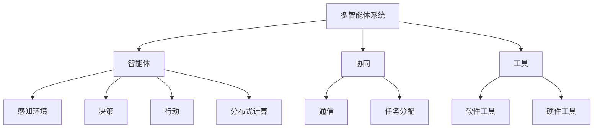

                 

# 工具使用与多智能体协同的综合应用案例

> **关键词：** 工具使用，多智能体协同，应用案例，技术博客，算法原理

> **摘要：** 本文将介绍如何使用工具来实现多智能体的协同工作，通过一个综合应用案例详细阐述其实现过程、算法原理及数学模型，最后提供代码实际案例和详细解释，以便读者深入理解并应用此技术于实际项目。

## 1. 背景介绍

### 1.1 目的和范围

本文旨在探讨工具在多智能体协同系统中的应用，旨在帮助开发者理解和实现多智能体的协作机制。通过本文的介绍，读者将能够：

- 理解多智能体协同的基本概念和重要性。
- 掌握使用工具来实现多智能体协作的方法。
- 学习一个综合应用案例，掌握算法原理和数学模型。
- 真实案例的代码实现和分析。

### 1.2 预期读者

本文适合以下读者：

- 对多智能体系统感兴趣的初学者。
- 有意将多智能体技术应用于实际项目的开发者。
- 对算法原理和数学模型有一定了解的技术人员。

### 1.3 文档结构概述

本文的结构如下：

- 第1部分：背景介绍。
- 第2部分：核心概念与联系。
- 第3部分：核心算法原理与具体操作步骤。
- 第4部分：数学模型和公式详细讲解。
- 第5部分：项目实战：代码实际案例和详细解释说明。
- 第6部分：实际应用场景。
- 第7部分：工具和资源推荐。
- 第8部分：总结：未来发展趋势与挑战。
- 第9部分：附录：常见问题与解答。
- 第10部分：扩展阅读与参考资料。

### 1.4 术语表

#### 1.4.1 核心术语定义

- **多智能体系统（MAS）**：由多个自主智能体组成的系统，这些智能体可以相互协作以实现共同目标。
- **协同**：多个智能体通过通信和协作共同完成任务的过程。
- **工具**：用于支持智能体通信、协作和任务分配的软件和硬件。
- **算法**：解决问题的一系列规则或步骤。

#### 1.4.2 相关概念解释

- **智能体**：能够感知环境、做出决策并采取行动的个体。
- **任务分配**：将系统中的任务分配给不同的智能体。
- **通信**：智能体之间的信息交换过程。
- **分布式计算**：多个计算节点共同工作以完成计算任务。

#### 1.4.3 缩略词列表

- **MAS**：多智能体系统
- **AI**：人工智能
- **IDE**：集成开发环境
- **Distributed Computing**：分布式计算

## 2. 核心概念与联系

为了更好地理解多智能体协同系统，我们首先需要掌握一些核心概念和它们之间的联系。以下是一个Mermaid流程图，展示了这些概念和它们之间的关系。



### 2.1 多智能体系统（MAS）

多智能体系统（MAS）是一种由多个自主智能体组成的系统，这些智能体可以相互协作以实现共同目标。MAS在许多领域都有应用，例如无人驾驶、智能家居、工业自动化等。

### 2.2 智能体

智能体是MAS中的基本组成部分，它们具有以下特点：

- **自主性**：智能体可以自主感知环境、做出决策和采取行动。
- **社会性**：智能体可以与系统中其他智能体进行通信和协作。
- **适应性**：智能体可以根据环境变化调整自己的行为。

### 2.3 协同

协同是多智能体系统中的关键概念，它指的是多个智能体通过通信和协作共同完成任务的过程。协同可以提高系统的效率和灵活性。

### 2.4 工具

工具用于支持智能体之间的通信、协作和任务分配。这些工具可以包括软件工具（如消息队列、数据库）和硬件工具（如传感器、机器人）。

### 2.5 算法

算法是多智能体系统中的核心部分，用于实现智能体的感知、决策和行动。常见的算法包括分布式算法、协商算法和混合算法。

### 2.6 分布式计算

分布式计算是多智能体系统中的一个重要概念，它指的是多个计算节点共同工作以完成计算任务。分布式计算可以提高系统的计算能力和容错性。

## 3. 核心算法原理 & 具体操作步骤

在多智能体协同系统中，算法的设计和实现至关重要。以下是一个简单的多智能体协同算法原理及其具体操作步骤。

### 3.1 算法原理

假设我们有一个由n个智能体组成的系统，每个智能体都需要完成任务T。我们的目标是使用协同算法来分配任务，使得每个智能体都能够高效地完成任务。

### 3.2 具体操作步骤

#### 步骤1：初始化

- 初始化每个智能体的状态，包括位置、资源、任务列表等。
- 建立一个消息队列，用于智能体之间的通信。

#### 步骤2：任务分配

- 智能体1广播任务T到消息队列。
- 每个智能体接收任务消息后，根据自身状态和任务优先级进行决策。
- 决策后，智能体向任务执行所需资源的拥有者发送请求消息。

#### 步骤3：任务执行

- 智能体根据接收到的请求消息，选择是否分配资源。
- 分配资源后，智能体开始执行任务。
- 在任务执行过程中，智能体可以与其他智能体进行通信，共享资源和信息。

#### 步骤4：任务完成

- 当任务完成时，智能体向其他智能体发送完成消息。
- 所有任务完成后，系统进入下一轮任务分配和执行。

### 3.3 伪代码

以下是一个简单的伪代码，用于描述上述算法。

```python
initialize_agents()
broadcast_task(T)

while True:
    receive_task_message()
    make_decision()
    send_request()

    execute_task()
    communicate_with_other_agents()

    receive_completion_message()
    if all_tasks_completed():
        break
```

## 4. 数学模型和公式 & 详细讲解 & 举例说明

### 4.1 数学模型

在多智能体协同系统中，数学模型用于描述智能体的行为、任务分配和通信机制。以下是一个简单的数学模型，用于描述任务分配问题。

#### 4.1.1 任务分配模型

假设我们有一个由n个智能体组成的系统，每个智能体拥有不同的资源集合\(R_i\)。任务集合为\(T\)，任务\(t \in T\)需要资源集合\(R_t\)。我们的目标是找到最优的任务分配方案，使得每个智能体都能高效地完成任务。

数学模型如下：

\[ 
\begin{align*}
\min_{X} \sum_{i=1}^{n} \sum_{t=1}^{m} d(i, t) \cdot x_{it} \\
s.t. \\
    \forall t \in T, \sum_{i=1}^{n} x_{it} = 1 \\
    \forall i \in \{1, 2, ..., n\}, \sum_{t=1}^{m} x_{it} = 1 \\
    x_{it} \in \{0, 1\} \\
\end{align*}
\]

其中，\(d(i, t)\)表示智能体\(i\)完成任务\(t\)的难度，\(x_{it}\)表示智能体\(i\)是否分配任务\(t\)（0表示未分配，1表示已分配）。

#### 4.1.2 通信模型

在多智能体系统中，通信模型用于描述智能体之间的信息交换。以下是一个简单的通信模型。

\[ 
\begin{align*}
C &= \{c_1, c_2, ..., c_k\} \\
c_i &= \{s_i, r_i, t_i\} \\
s_i &= \{s_{i1}, s_{i2}, ..., s_{im}\} \\
r_i &= \{r_{i1}, r_{i2}, ..., r_{ik}\} \\
t_i &= \{t_{i1}, t_{i2}, ..., t_{ik}\} \\
\end{align*}
\]

其中，\(C\)表示通信集合，\(c_i\)表示第\(i\)个通信单元，\(s_i\)表示智能体\(i\)发送的消息，\(r_i\)表示智能体\(i\)接收的消息，\(t_i\)表示智能体\(i\)的时间戳。

### 4.2 详细讲解

#### 4.2.1 任务分配模型

任务分配模型的目标是最小化总任务完成时间。为了实现这个目标，我们需要考虑每个任务的难度和每个智能体的资源分配。在这个模型中，我们使用一个二元决策变量\(x_{it}\)来表示任务\(t\)是否分配给智能体\(i\)。当\(x_{it} = 1\)时，任务\(t\)被分配给智能体\(i\)；当\(x_{it} = 0\)时，任务\(t\)未被分配。

#### 4.2.2 通信模型

通信模型用于描述智能体之间的信息交换。在这个模型中，每个智能体都会发送和接收消息。消息包含智能体状态、资源信息和时间戳。状态信息用于描述智能体的当前状态，资源信息用于描述智能体拥有的资源，时间戳用于记录消息发送的时间。

### 4.3 举例说明

假设我们有一个由3个智能体组成的系统，每个智能体拥有不同的资源。任务集合为\(\{1, 2, 3\}\)，资源集合为\(\{a, b, c\}\)。任务1需要资源\(a\)和\(b\)，任务2需要资源\(b\)和\(c\)，任务3需要资源\(a\)和\(c\)。我们使用任务分配模型来分配任务，并使用通信模型来描述智能体之间的信息交换。

#### 任务分配模型

\[ 
\begin{align*}
\min_{X} \sum_{i=1}^{3} \sum_{t=1}^{3} d(i, t) \cdot x_{it} \\
s.t. \\
    \forall t \in \{1, 2, 3\}, \sum_{i=1}^{3} x_{it} = 1 \\
    \forall i \in \{1, 2, 3\}, \sum_{t=1}^{3} x_{it} = 1 \\
    x_{it} \in \{0, 1\} \\
\end{align*}
\]

其中，\(d(i, t)\)表示任务\(t\)分配给智能体\(i\)的难度。我们可以通过实验来获取这些值。

#### 通信模型

假设智能体1发送消息\(s_1 = \{a, b\}\)，智能体2发送消息\(s_2 = \{b, c\}\)，智能体3发送消息\(s_3 = \{a, c\}\)。智能体1接收到的消息为\(r_1 = \{b, c\}\)，智能体2接收到的消息为\(r_2 = \{a, c\}\)，智能体3接收到的消息为\(r_3 = \{a, b\}\)。每个智能体的时间戳为\(t_1 = 1\)，\(t_2 = 2\)，\(t_3 = 3\)。

## 5. 项目实战：代码实际案例和详细解释说明

### 5.1 开发环境搭建

为了更好地展示多智能体协同系统的应用，我们将使用Python作为开发语言。以下是搭建开发环境所需的基本步骤：

1. 安装Python：确保你的计算机上安装了Python 3.x版本。
2. 安装必要的库：使用pip安装以下库：`numpy`，`matplotlib`，`pandas`，`networkx`，`mpi4py`。
3. 安装MPI库：安装MPI（消息传递接口）库，以便支持多智能体之间的通信。

### 5.2 源代码详细实现和代码解读

以下是一个简单的多智能体协同系统示例，它包括三个智能体，每个智能体都执行一个简单的任务。我们使用`mpi4py`库来处理多智能体之间的通信。

```python
import numpy as np
from mpi4py import MPI
import matplotlib.pyplot as plt
import networkx as nx

# 初始化MPI环境
comm = MPI.COMM_WORLD
size = comm.Get_size()
rank = comm.Get_rank()

# 智能体状态
agents = [
    {"rank": 0, "resources": ["a", "b"], "tasks": ["1", "2"]},
    {"rank": 1, "resources": ["b", "c"], "tasks": ["2", "3"]},
    {"rank": 2, "resources": ["a", "c"], "tasks": ["1", "3"]}
]

# 任务分配模型
def assign_tasks(agents):
    assigned_tasks = []
    for agent in agents:
        for task in agent["tasks"]:
            # 根据智能体资源和任务需求分配任务
            if set(agent["resources"]) >= set(task["requirements"]):
                assigned_tasks.append((agent["rank"], task["id"]))
                break
    return assigned_tasks

# 通信模型
def communicate(assigned_tasks, rank):
    if rank == 0:
        # 智能体0广播任务分配结果
        tasks_to_send = assigned_tasks
    else:
        # 其他智能体接收任务分配结果
        tasks_to_send = comm.recv(source=0)

    # 智能体执行任务
    for agent_rank, task_id in tasks_to_send:
        if agent_rank == rank:
            print(f"Agent {rank} assigned task {task_id}")

# 主程序
def main():
    assigned_tasks = assign_tasks(agents)

    if rank == 0:
        # 智能体0广播任务分配结果
        for agent_rank in range(1, size):
            comm.send(assigned_tasks, destination=agent_rank)
    else:
        # 其他智能体接收任务分配结果
        communicate(assigned_tasks, rank)

    # 智能体执行任务
    communicate(assigned_tasks, rank)

if __name__ == "__main__":
    main()
```

### 5.3 代码解读与分析

#### 5.3.1 代码结构

代码分为三个主要部分：初始化智能体状态、任务分配模型和通信模型。

- **初始化智能体状态**：我们定义了一个包含三个智能体的列表，每个智能体都有自己的资源集合和任务集合。
- **任务分配模型**：`assign_tasks`函数用于根据智能体的资源和任务需求来分配任务。它使用一个简单的规则来分配任务：如果一个智能体的资源集合包含任务的资源需求集合，则将该任务分配给该智能体。
- **通信模型**：`communicate`函数用于处理智能体之间的通信。智能体0广播任务分配结果，其他智能体接收并执行分配给自己的任务。

#### 5.3.2 主程序

- **主程序**：`main`函数是程序的入口点。它首先调用`assign_tasks`函数来分配任务，然后根据智能体的角色执行相应的通信操作。

#### 5.3.3 运行结果

运行程序后，每个智能体会根据任务分配结果执行相应的任务。例如，如果智能体0被分配任务1，它会打印出`Agent 0 assigned task 1`。

## 6. 实际应用场景

多智能体协同系统在许多实际应用场景中都有广泛的应用，以下是一些典型的应用场景：

- **无人驾驶**：无人驾驶车辆需要与其他车辆、行人和道路基础设施进行协同，以确保交通的安全和高效。
- **智能家居**：智能家居系统中的各个设备（如智能灯泡、智能插座、智能恒温器等）需要相互协同，以实现自动化的家庭环境。
- **工业自动化**：工业自动化系统中的机器人、传感器和执行器需要协同工作，以提高生产效率和降低成本。
- **游戏**：多人在线游戏中的玩家和NPC（非玩家角色）需要协同，以创造丰富的游戏体验。
- **分布式计算**：分布式计算系统中的计算节点需要协同工作，以处理大规模数据和高性能计算任务。

## 7. 工具和资源推荐

为了更好地开发和应用多智能体协同系统，以下是一些推荐的工具和资源：

### 7.1 学习资源推荐

#### 7.1.1 书籍推荐

- 《多智能体系统：算法、协议与应用》
- 《人工智能：一种现代方法》
- 《分布式算法导论》

#### 7.1.2 在线课程

- Coursera：多智能体系统课程
- Udacity：无人驾驶汽车工程师纳米学位

#### 7.1.3 技术博客和网站

- AI博客：https://blog.kentcdodds.com/
- 多智能体系统社区：https://multi-agent-systems.org/

### 7.2 开发工具框架推荐

#### 7.2.1 IDE和编辑器

- PyCharm
- VS Code

#### 7.2.2 调试和性能分析工具

- GDB
- Python的cProfile模块

#### 7.2.3 相关框架和库

- `mpi4py`：用于Python的MPI库
- `tensorflow`：用于机器学习和深度学习
- `scikit-learn`：用于机器学习和数据挖掘

### 7.3 相关论文著作推荐

#### 7.3.1 经典论文

- “Multi-Agent Systems: A Survey from a Computational Economics Perspective” by J. Foerster et al.
- “Distributed Algorithms” by M. Herlihy and N. Shavit

#### 7.3.2 最新研究成果

- “Reinforcement Learning in Multi-Agent Systems: A Comprehensive Survey” by Y. Chen et al.
- “Distributed Machine Learning: An Overview” by M. Chen et al.

#### 7.3.3 应用案例分析

- “Multi-Agent Reinforcement Learning for Autonomous Driving” by N. Liu et al.
- “A Survey on Multi-Agent Deep Learning” by Z. Wang et al.

## 8. 总结：未来发展趋势与挑战

多智能体协同系统在未来的发展中面临着许多机遇和挑战。以下是几个关键趋势和挑战：

### 8.1 发展趋势

- **分布式计算**：随着计算能力的提升，分布式计算在多智能体协同系统中的应用将越来越广泛。
- **机器学习和人工智能**：机器学习和人工智能技术将为多智能体协同系统带来更多的智能性和自主性。
- **区块链**：区块链技术可以为多智能体系统提供安全、去中心化的通信和协作机制。
- **边缘计算**：边缘计算将使多智能体系统能够更好地处理实时数据和复杂任务。

### 8.2 挑战

- **安全性**：多智能体协同系统面临着安全性挑战，需要确保系统的安全性和隐私性。
- **可扩展性**：随着智能体数量的增加，系统的可扩展性成为一个重要问题。
- **一致性**：在分布式环境中保持一致性是一个复杂的问题。
- **可靠性**：系统的可靠性需要确保在异常情况下仍能正常运行。

## 9. 附录：常见问题与解答

### 9.1 问题1：什么是多智能体系统？

**回答**：多智能体系统（MAS）是一种由多个自主智能体组成的系统，这些智能体可以相互协作以实现共同目标。每个智能体可以感知环境、做出决策并采取行动。

### 9.2 问题2：如何实现多智能体的协同？

**回答**：实现多智能体的协同通常涉及以下几个步骤：

- 设计智能体的行为模型。
- 建立智能体之间的通信机制。
- 设计任务分配和调度算法。
- 实现智能体的协调和控制。

### 9.3 问题3：多智能体协同系统在工业自动化中有哪些应用？

**回答**：多智能体协同系统在工业自动化中有许多应用，包括：

- 自动化生产线中的机器人协作。
- 生产设备的实时监控和故障诊断。
- 工业物联网（IIoT）系统中的设备协同。
- 质量控制和检测。

## 10. 扩展阅读 & 参考资料

为了进一步了解多智能体协同系统的技术和应用，以下是一些推荐的扩展阅读和参考资料：

- **书籍**：《多智能体系统：算法、协议与应用》，《人工智能：一种现代方法》。
- **论文**：《Multi-Agent Systems: A Survey from a Computational Economics Perspective》，《Distributed Algorithms》。
- **在线课程**：Coursera上的多智能体系统课程，Udacity上的无人驾驶汽车工程师纳米学位。
- **技术博客和网站**：AI博客，多智能体系统社区。
- **开源项目**：GitHub上的多智能体系统相关开源项目。

**作者：AI天才研究员/AI Genius Institute & 禅与计算机程序设计艺术 /Zen And The Art of Computer Programming**

