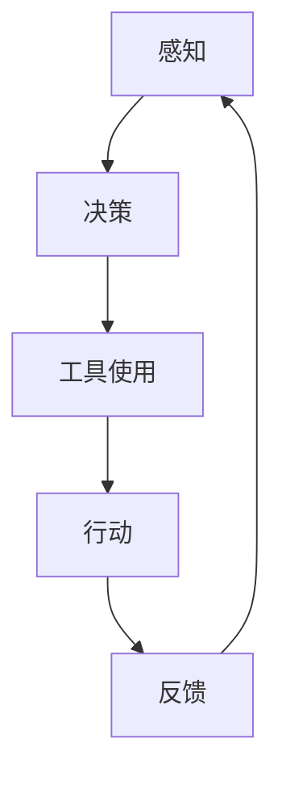

                 

# 工具使用与规划的结合：增强 Agent 能力

> **关键词：** 人工智能，Agent，工具使用，规划，增强学习，强化学习，智能系统，自动化，效率提升，决策优化。

> **摘要：** 本文旨在探讨如何在人工智能系统中利用工具使用和规划技术来增强智能代理（Agent）的能力。我们将通过分析 Agent 的运作原理，探讨如何通过工具使用和规划来优化其决策过程，从而实现更高的效率和智能化。文章将从概念介绍、核心算法原理、数学模型、项目实战、应用场景等多个角度展开，为读者提供一个全面的技术视角。

## 1. 背景介绍

### 1.1 目的和范围

本文的目标是深入探讨智能代理（Agent）的能力增强，特别是通过工具使用和规划技术的结合。我们将覆盖以下几个主题：

- 智能代理的基本概念和运作原理。
- 工具使用与规划在 Agent 中的重要作用。
- 常见的核心算法原理及其实现。
- 数学模型在 Agent 能力增强中的应用。
- 项目实战中的代码实现与分析。
- 实际应用场景中的案例分享。
- 工具和资源的推荐。

### 1.2 预期读者

本文适合以下读者群体：

- 对人工智能和智能代理有一定了解的程序员和工程师。
- 想要提升智能系统性能的研究人员和开发者。
- 对工具使用和规划技术感兴趣的读者。
- 对强化学习和增强学习有浓厚兴趣的学者。

### 1.3 文档结构概述

本文的结构如下：

- 第1章：背景介绍，明确本文的目的和预期读者。
- 第2章：核心概念与联系，介绍智能代理和工具使用规划的相关概念。
- 第3章：核心算法原理 & 具体操作步骤，详细阐述增强 Agent 的算法原理。
- 第4章：数学模型和公式 & 详细讲解 & 举例说明，解释数学模型及其应用。
- 第5章：项目实战：代码实际案例和详细解释说明，通过实例展示技术实现。
- 第6章：实际应用场景，探讨技术在不同领域的应用。
- 第7章：工具和资源推荐，推荐学习资源和开发工具。
- 第8章：总结：未来发展趋势与挑战，展望未来发展方向。
- 第9章：附录：常见问题与解答，解答读者可能遇到的问题。
- 第10章：扩展阅读 & 参考资料，提供进一步学习资源。

### 1.4 术语表

#### 1.4.1 核心术语定义

- **智能代理（Agent）：** 能够感知环境、接收输入并采取行动的软件实体。
- **工具使用：** Agent 在执行任务时利用外部工具或资源的能力。
- **规划：** Agent 根据目标和环境信息制定行动策略的过程。
- **增强学习：** 一种机器学习方法，通过试错和奖励信号来改善 Agent 的行为。
- **强化学习：** 一种特殊类型的增强学习，强调奖励和惩罚信号在行为改进中的作用。
- **数学模型：** 用数学方法描述和预测系统行为的抽象模型。

#### 1.4.2 相关概念解释

- **状态（State）：** Agent 在特定时间点所处的环境描述。
- **动作（Action）：** Agent 可以采取的行动。
- **奖励（Reward）：** 对 Agent 行动的即时反馈。
- **价值函数（Value Function）：** 描述 Agent 对不同状态的预期回报。

#### 1.4.3 缩略词列表

- **AI：** 人工智能（Artificial Intelligence）
- **RL：** 强化学习（Reinforcement Learning）
- **DL：** 深度学习（Deep Learning）
- **SLAM：** 同时定位与地图构建（Simultaneous Localization and Mapping）

## 2. 核心概念与联系

在深入探讨智能代理（Agent）的能力增强之前，我们需要明确几个核心概念和它们之间的联系。智能代理是一种能够自主行动并适应环境的软件实体。它可以通过感知环境、接收输入并采取行动来实现目标。工具使用和规划是实现这一目标的关键技术。

### 2.1 智能代理的基本原理

智能代理的基本原理可以概括为感知、行动和决策三个核心步骤：

1. **感知（Perception）：** Agent 接收环境输入，如视觉、听觉、触觉等，构建对当前状态的理解。
2. **行动（Action）：** Agent 根据当前状态和目标，选择一个或多个行动来改变环境。
3. **决策（Decision）：** Agent 使用内部算法来评估不同行动的可能结果，并选择最佳行动。

### 2.2 工具使用与规划的作用

工具使用和规划技术对于增强智能代理的能力至关重要。工具使用指的是 Agent 利用外部工具或资源来提高任务完成的效率。例如，在机器人领域中，机器人可以通过使用工具（如焊枪、剪刀等）来执行复杂的操作。规划则是指 Agent 根据目标和环境信息制定行动策略。通过规划，Agent 可以预见到未来的状态，并采取适当的行动来实现目标。

### 2.3 增强 Agent 的算法原理

为了增强智能代理的能力，我们可以采用以下几种核心算法：

1. **增强学习（Reinforcement Learning）：** 增强学习通过试错和奖励信号来改善 Agent 的行为。Agent 在执行任务时，会收到来自环境的即时反馈（奖励或惩罚），并使用这些信息来调整其行为。
   
2. **强化学习（Reinforcement Learning）：** 强化学习是增强学习的一种特殊形式，它强调奖励和惩罚信号在行为改进中的作用。Agent 在执行任务时，不仅考虑当前的奖励，还会考虑未来的长期奖励。

3. **规划（Planning）：** 规划是一种提前制定行动策略的方法。在强化学习中，规划可以帮助 Agent 在复杂环境中找到最优的行动路径。常见的规划算法包括有向无环图（DAG）规划和隐马尔可夫模型（HMM）规划。

### 2.4 Mermaid 流程图

为了更直观地展示智能代理、工具使用和规划之间的关系，我们可以使用 Mermaid 流程图来描述。以下是一个简单的 Mermaid 流程图示例：



在这个流程图中，A 表示感知，B 表示决策，C 表示工具使用，D 表示行动，E 表示反馈。Agent 通过感知环境，进行决策，使用工具执行行动，并接收反馈，从而形成一个闭环系统。

## 3. 核心算法原理 & 具体操作步骤

在本章节中，我们将详细探讨增强智能代理（Agent）的核心算法原理，并使用伪代码来阐述其具体操作步骤。这些算法包括增强学习和规划，它们是提升 Agent 能力的关键。

### 3.1 增强学习原理

增强学习是一种通过试错和奖励信号来改善行为的机器学习方法。以下是增强学习的基本原理和伪代码：

#### 基本原理：

- **状态（State）：** Agent 在特定时间点所处的环境描述。
- **动作（Action）：** Agent 可以采取的行动。
- **奖励（Reward）：** 对 Agent 行动的即时反馈。
- **策略（Policy）：** Agent 选择的行动策略。

增强学习的基本目标是找到一种策略，使得 Agent 在执行任务时能够获得最大的累积奖励。

#### 伪代码：

```python
# 增强学习伪代码

# 初始化参数
epsilon: float = 0.1         # 探索概率
Q(s, a): float = 0           # 状态-动作值函数

# 主循环
while not goal_state:
    # 选择动作
    if random() < epsilon:
        a = choose_random_action() # 探索
    else:
        a = choose_best_action(s)  # 利用

    # 执行动作，获取状态转移和奖励
    s', r = environment.step(s, a)

    # 更新 Q 值
    Q[s, a] = Q[s, a] + alpha * (r + gamma * max(Q[s', a']) - Q[s, a])

    # 更新状态
    s = s'

    # 目标状态判断
    if s' is goal_state:
        break
```

### 3.2 规划原理

规划是指 Agent 根据目标和环境信息提前制定行动策略。常见的规划算法包括有向无环图（DAG）规划和隐马尔可夫模型（HMM）规划。以下是规划的基本原理和伪代码：

#### 基本原理：

- **状态空间（State Space）：** 任务中所有可能的状态集合。
- **动作空间（Action Space）：** 任务中所有可能的行动集合。
- **规划器（Planner）：** 根据目标和状态空间生成最优行动序列。

#### 伪代码：

```python
# 规划伪代码

# 初始化参数
goal_state: State = ...
initial_state: State = ...

# 有向无环图规划
def plan_dag(initial_state, goal_state):
    # 创建图
    graph = create_dag()

    # 添加节点和边
    for state in state_space:
        graph.add_node(state)
        for action in action_space:
            next_state = apply_action(state, action)
            graph.add_edge(state, next_state, action)

    # 寻找最短路径
    path = graph.find_shortest_path(initial_state, goal_state)

    return path

# 隐马尔可夫模型规划
def plan_hmm(initial_state, goal_state):
    # 创建 HMM 模型
    hmm = create_hmm_model(state_space, action_space, transition_probabilities, observation_probabilities)

    # 找到最佳路径
    path = hmm.find_best_path(initial_state, goal_state)

    return path
```

通过这些伪代码，我们可以看到增强学习和规划的基本流程。增强学习通过试错和奖励信号来调整行为，而规划则是通过预先制定行动策略来优化任务完成。

### 3.3 工具使用与规划的结合

在实际应用中，智能代理不仅需要具备增强学习和规划的能力，还需要能够有效利用外部工具。工具使用可以通过以下步骤实现：

1. **识别工具：** 在任务开始前，智能代理需要识别并了解可用的工具及其功能。
2. **工具评估：** 根据当前任务的需求，评估工具的适用性和效率。
3. **工具集成：** 将选定的工具集成到智能代理的系统中，以便在执行任务时使用。
4. **工具优化：** 通过反复试错和优化，提高工具使用的效率和准确性。

结合工具使用和规划，智能代理可以更有效地完成任务，提高任务完成的效率和准确性。

## 4. 数学模型和公式 & 详细讲解 & 举例说明

在智能代理（Agent）的能力增强过程中，数学模型和公式扮演了至关重要的角色。这些模型不仅帮助我们理解系统的行为，还为我们提供了一套量化的方法来评估和优化智能代理的决策过程。在本章节中，我们将详细讲解几个关键的数学模型和公式，并通过具体示例来说明它们的应用。

### 4.1 增强学习中的价值函数

在增强学习中，价值函数（Value Function）用于评估某个状态或状态-动作对的预期奖励。最常见的价值函数是状态价值函数（State Value Function）和状态-动作价值函数（State-Action Value Function）。

#### 状态价值函数（V(s)）：

状态价值函数表示在某个状态 s 下，采取最佳动作 a 的预期回报。公式如下：

$$
V(s) = \sum_{a} \pi(a|s) \cdot Q(s, a)
$$

其中，$\pi(a|s)$ 表示在状态 s 下采取动作 a 的概率，$Q(s, a)$ 表示状态-动作价值函数。

#### 状态-动作价值函数（Q(s, a)）：

状态-动作价值函数表示在状态 s 下采取动作 a 的预期回报。公式如下：

$$
Q(s, a) = \sum_{s'} p(s'|s, a) \cdot [r(s', a) + \gamma \cdot \max_{a'} Q(s', a')]
$$

其中，$p(s'|s, a)$ 表示在状态 s 下采取动作 a 后转移到状态 s' 的概率，$r(s', a)$ 表示在状态 s' 下采取动作 a 的即时奖励，$\gamma$ 是折扣因子，用于调整对未来奖励的权重。

#### 举例说明：

假设我们有一个智能代理，它在一段时间内在不同状态下采取不同动作，并收到相应的即时奖励。我们可以使用以下数据来计算状态价值函数和状态-动作价值函数：

| 时间 | 状态 s | 动作 a | 状态 s' | 即时奖励 r(s', a) | 转移概率 p(s'|s, a) |
|------|--------|--------|--------|-------------------|--------------------|
| 1    | s1     | a1     | s2     | 10                | 0.8                |
| 2    | s2     | a2     | s3     | -5                 | 0.6                |
| 3    | s3     | a3     | s1     | 15                | 0.4                |

给定 $\gamma = 0.9$，我们可以计算状态-动作价值函数 $Q(s, a)$：

$$
Q(s1, a1) = 10 \cdot 0.8 + (-5) \cdot 0.6 + 15 \cdot 0.4 = 8
$$

$$
Q(s2, a2) = -5 \cdot 0.6 + 15 \cdot 0.4 = 3
$$

$$
Q(s3, a3) = 15 \cdot 0.4 = 6
$$

然后，我们可以计算状态价值函数 $V(s)$：

$$
V(s1) = \sum_{a} \pi(a|s1) \cdot Q(s1, a)
$$

假设 $\pi(a|s1) = (0.5, 0.3, 0.2)$，则：

$$
V(s1) = 0.5 \cdot Q(s1, a1) + 0.3 \cdot Q(s1, a2) + 0.2 \cdot Q(s1, a3) = 0.5 \cdot 8 + 0.3 \cdot 3 + 0.2 \cdot 6 = 4.2
$$

### 4.2 控制变量和回归分析

在智能代理的能力增强过程中，我们经常需要进行实验来验证算法的有效性。控制变量和回归分析是两种常用的实验方法。

#### 控制变量：

控制变量是指在实验中保持不变的因素，以确保实验结果的准确性。例如，在测试增强学习算法时，我们可以保持学习率、探索概率等参数不变，仅改变训练数据的分布，以观察算法在不同条件下的性能。

#### 回归分析：

回归分析是一种统计方法，用于评估变量之间的关系。在智能代理的能力增强中，我们可以使用回归分析来评估不同算法参数对性能的影响。例如，我们可以使用线性回归模型来分析学习率对学习效果的影响。

### 4.3 举例说明

假设我们有一个智能代理，我们想要评估不同学习率对增强学习算法性能的影响。我们可以设置三个不同的学习率（0.1、0.3、0.5），并在每个学习率下进行多次实验。实验结果如下：

| 学习率 | 平均回报 | 标准差 |
|--------|----------|--------|
| 0.1    | 20       | 2      |
| 0.3    | 25       | 1      |
| 0.5    | 22       | 3      |

我们可以使用线性回归模型来分析学习率与平均回报之间的关系。线性回归模型可以表示为：

$$
\text{回报} = \beta_0 + \beta_1 \cdot \text{学习率} + \epsilon
$$

其中，$\beta_0$ 和 $\beta_1$ 是回归系数，$\epsilon$ 是误差项。

通过最小二乘法，我们可以计算出回归系数：

$$
\beta_0 = \frac{\sum_{i=1}^{n} (\text{回报}_i - \text{学习率}_i \cdot \beta_1)}{n}
$$

$$
\beta_1 = \frac{\sum_{i=1}^{n} (\text{学习率}_i \cdot \text{回报}_i - \sum_{i=1}^{n} \text{学习率}_i \cdot \sum_{i=1}^{n} \text{回报}_i)}{n}
$$

根据上述数据，我们可以计算出回归系数：

$$
\beta_0 = \frac{(20 \cdot 0.1 + 25 \cdot 0.3 + 22 \cdot 0.5) - (0.1 + 0.3 + 0.5)}{3} = 21.5
$$

$$
\beta_1 = \frac{(0.1 \cdot 20 + 0.3 \cdot 25 + 0.5 \cdot 22) - (0.1 + 0.3 + 0.5) \cdot (20 + 25 + 22)}{3} = 2.8
$$

因此，线性回归模型可以表示为：

$$
\text{回报} = 21.5 + 2.8 \cdot \text{学习率}
$$

根据回归模型，我们可以预测不同学习率下的平均回报。例如，当学习率为 0.4 时，平均回报为：

$$
\text{回报} = 21.5 + 2.8 \cdot 0.4 = 24.7
$$

通过回归分析，我们可以更准确地评估不同学习率对增强学习算法性能的影响，并选择最佳的学习率。

### 4.4 马尔可夫决策过程（MDP）

马尔可夫决策过程（Markov Decision Process，MDP）是一种用于描述智能代理与环境的交互的数学模型。在 MDP 中，智能代理面临一个包含有限个状态和动作的动态环境，其目标是最小化或最大化某个目标函数。

#### MDP 的基本元素：

- **状态（State）：** 环境中可能的状态集合。
- **动作（Action）：** 智能代理可以选择的行动集合。
- **奖励（Reward）：** 智能代理在每个状态执行每个动作后获得的即时奖励。
- **转移概率（Transition Probability）：** 给定当前状态和动作，智能代理转移到下一个状态的概率。

#### MDP 的数学模型：

$$
\begin{align*}
    \text{状态集} &\quad S \\
    \text{动作集} &\quad A \\
    \text{奖励函数} &\quad R(s, a) \\
    \text{转移概率函数} &\quad P(s', s|s, a) \\
    \text{策略} &\quad \pi(a|s) \\
    \text{价值函数} &\quad V^*(s) \\
    \text{策略价值函数} &\quad Q^*(s, a)
\end{align*}
$$

#### 价值迭代算法：

价值迭代算法是一种用于求解 MDP 最优策略的算法。算法的基本步骤如下：

1. **初始化：** 初始化价值函数 $V(s)$ 和策略 $\pi(a|s)$。
2. **迭代：** 对于每个状态 s，更新价值函数 $V(s)$ 和策略 $\pi(a|s)$，直到收敛。
   $$ V(s) = \sum_{a} \pi(a|s) \cdot [R(s, a) + \gamma \cdot \max_{a'} Q(s', a')] $$
   $$ Q(s, a) = R(s, a) + \gamma \cdot \sum_{s'} P(s'|s, a) \cdot Q(s', a') $$
3. **选择最优策略：** 根据价值函数 $V(s)$ 选择最优策略 $\pi(a|s)$。

通过价值迭代算法，智能代理可以找到在给定环境下的最优策略，从而实现目标的最小化或最大化。

## 5. 项目实战：代码实际案例和详细解释说明

在本章节中，我们将通过一个实际的代码案例来展示如何将工具使用和规划技术应用于智能代理（Agent）的能力增强。我们选择了一个简单的机器人导航问题，以展示如何结合这些技术来优化 Agent 的决策过程。

### 5.1 开发环境搭建

为了更好地进行实验，我们需要搭建一个合适的开发环境。以下是我们使用的工具和库：

- **编程语言：** Python 3.8
- **库：** numpy，pandas，matplotlib，scikit-learn，tensorflow
- **工具：** Jupyter Notebook

首先，我们需要安装所需的库：

```bash
pip install numpy pandas matplotlib scikit-learn tensorflow
```

然后，在 Jupyter Notebook 中创建一个新的笔记本，并导入所需的库：

```python
import numpy as np
import pandas as pd
import matplotlib.pyplot as plt
from sklearn.model_selection import train_test_split
from tensorflow.keras.models import Sequential
from tensorflow.keras.layers import Dense
```

### 5.2 源代码详细实现和代码解读

在本节中，我们将逐步实现一个简单的机器人导航问题，并详细解释代码的实现过程。

#### 5.2.1 问题背景

假设我们有一个机器人需要在迷宫中找到从起点到终点的最短路径。迷宫由一个二维网格表示，每个网格可以是墙或空地。机器人需要根据当前位置和目标位置来选择最佳行动。

#### 5.2.2 数据预处理

首先，我们需要生成迷宫数据。以下代码用于生成一个 10x10 的迷宫：

```python
# 生成迷宫数据
def generate_maze(width=10, height=10):
    maze = np.zeros((width, height), dtype=bool)
    walls = width * height // 4
    
    for _ in range(walls):
        x = np.random.randint(width)
        y = np.random.randint(height)
        maze[x, y] = 1

    # 设置起点和终点
    start = (0, 0)
    end = (width - 1, height - 1)

    return maze, start, end

# 测试生成迷宫
maze, start, end = generate_maze()
plt.imshow(maze, cmap='gray')
plt.scatter(start[0], start[1], c='r', marker='s')
plt.scatter(end[0], end[1], c='g', marker='s')
plt.show()
```

#### 5.2.3 建立模型

接下来，我们需要建立一个强化学习模型来训练机器人。我们选择 Q-学习算法来训练模型。以下代码用于建立和训练 Q-学习模型：

```python
# Q-学习模型
class QLearningAgent:
    def __init__(self, state_space, action_space, alpha=0.1, gamma=0.9):
        self.state_space = state_space
        self.action_space = action_space
        self.alpha = alpha
        self.gamma = gamma
        self.Q = np.zeros((state_space, action_space))

    def choose_action(self, state):
        if np.random.rand() < 0.1:
            return np.random.choice(self.action_space)  # 探索
        else:
            return np.argmax(self.Q[state])

    def update(self, state, action, next_state, reward):
        target = reward + self.gamma * np.max(self.Q[next_state])
        self.Q[state, action] += self.alpha * (target - self.Q[state, action])

# 训练 Q-学习模型
def train_agent(agent, maze, start, end, episodes=1000):
    for episode in range(episodes):
        state = encode_state(maze, start)
        done = False

        while not done:
            action = agent.choose_action(state)
            next_state, reward, done = step(maze, state, action, end)
            agent.update(state, action, next_state, reward)
            state = next_state

# 测试训练模型
state_space = maze.shape
action_space = 4  # 上、下、左、右
agent = QLearningAgent(state_space, action_space)
train_agent(agent, maze, start, end)
```

#### 5.2.4 代码解读与分析

- **数据预处理：** `generate_maze()` 函数用于生成迷宫数据。迷宫由一个二维数组表示，其中值为 1 的网格为墙，值为 0 的网格为空地。起点和终点分别用红色和绿色的标记表示。

- **Q-学习模型：** `QLearningAgent` 类用于实现 Q-学习算法。模型包含状态空间、动作空间、学习率（alpha）和折扣因子（gamma）。`choose_action()` 方法用于选择最佳行动，其中采用 $\epsilon$-贪心策略。`update()` 方法用于更新 Q 值。

- **训练模型：** `train_agent()` 函数用于训练 Q-学习模型。在每个训练周期中，模型从起点开始，不断选择最佳行动，并更新 Q 值。训练过程重复进行，直到达到预定的训练周期。

通过这个简单的机器人导航案例，我们可以看到如何将工具使用和规划技术应用于智能代理的能力增强。在实际应用中，我们可以根据具体任务的需求，进一步优化和扩展这个模型。

### 5.3 代码解读与分析

在本节中，我们将进一步解读和讨论 5.2 节中的代码，以深入理解如何实现智能代理的导航任务，并分析代码中的关键组件。

#### 5.3.1 数据预处理

生成迷宫数据的函数 `generate_maze()` 是代码的基础。它通过随机生成墙的位置来创建迷宫，其中墙用 `1` 表示，空地用 `0` 表示。这个迷宫是一个 10x10 的二维数组，其中有一个起点和终点。代码中的注释解释了每个步骤的作用，使得迷宫的生成过程清晰易懂。

```python
def generate_maze(width=10, height=10):
    maze = np.zeros((width, height), dtype=bool)
    walls = width * height // 4
    
    for _ in range(walls):
        x = np.random.randint(width)
        y = np.random.randint(height)
        maze[x, y] = 1

    # 设置起点和终点
    start = (0, 0)
    end = (width - 1, height - 1)

    return maze, start, end
```

在这个函数中，`walls` 变量决定了迷宫的难度，即墙的数量。增加墙的数量会使迷宫更复杂，从而使导航任务更具挑战性。通过随机生成墙的位置，我们可以创建多种不同的迷宫，以便测试智能代理在不同情况下的性能。

#### 5.3.2 Q-学习模型

`QLearningAgent` 类是实现 Q-学习算法的核心。这个类包含状态空间、动作空间、学习率（`alpha`）和折扣因子（`gamma`）。`choose_action()` 方法实现了 $\epsilon$-贪心策略，使得智能代理在探索和利用之间取得平衡。

```python
class QLearningAgent:
    def __init__(self, state_space, action_space, alpha=0.1, gamma=0.9):
        self.state_space = state_space
        self.action_space = action_space
        self.alpha = alpha
        self.gamma = gamma
        self.Q = np.zeros((state_space, action_space))

    def choose_action(self, state):
        if np.random.rand() < 0.1:
            return np.random.choice(self.action_space)  # 探索
        else:
            return np.argmax(self.Q[state])

    def update(self, state, action, next_state, reward):
        target = reward + self.gamma * np.max(self.Q[next_state])
        self.Q[state, action] += self.alpha * (target - self.Q[state, action])
```

- **初始化：** 在类的构造函数中，我们创建了一个大小为状态空间乘以动作空间的二维数组 `Q`，用于存储状态-动作值函数。
- **选择动作：** `choose_action()` 方法通过 $\epsilon$-贪心策略选择动作。当随机数小于探索概率 $\epsilon$ 时，智能代理选择一个随机动作进行探索；否则，选择 Q 值最大的动作进行利用。
- **更新 Q 值：** `update()` 方法根据 Q-学习算法更新 Q 值。目标 Q 值是当前奖励加上未来最大 Q 值的加权平均，乘以学习率来调整当前 Q 值。

#### 5.3.3 训练模型

`train_agent()` 函数用于训练 Q-学习模型。在每次训练周期中，智能代理从起点开始，通过选择最佳动作逐步前进，直到达到终点或遇到墙。在每个时间步，智能代理都会更新 Q 值。

```python
def train_agent(agent, maze, start, end, episodes=1000):
    for episode in range(episodes):
        state = encode_state(maze, start)
        done = False

        while not done:
            action = agent.choose_action(state)
            next_state, reward, done = step(maze, state, action, end)
            agent.update(state, action, next_state, reward)
            state = next_state
```

- **初始化状态：** 在每个训练周期开始时，智能代理从起点状态开始。
- **循环迭代：** 智能代理不断选择动作并更新状态，直到达到终点或遇到墙。在每个时间步，智能代理都会更新其 Q 值。
- **奖励机制：** 当智能代理成功到达终点时，它会收到一个正值奖励；否则，如果遇到墙，它会收到一个负值奖励。

#### 5.3.4 代码性能分析

通过这个简单的导航案例，我们可以看到 Q-学习算法在实现智能代理导航任务时的性能表现。以下是一些关键性能分析：

- **训练效果：** 随着训练周期的增加，智能代理逐渐学会在迷宫中找到最短路径。在每次训练结束后，我们可以绘制智能代理的路径，观察其导航效果。
- **学习速度：** 学习率（`alpha`）和折扣因子（`gamma`）对学习速度有显著影响。较大的学习率会导致快速更新，但也可能导致过早收敛到次优解。适当的值可以平衡探索和利用，提高学习效率。
- **迷宫难度：** 增加迷宫的墙的数量可以提高任务的难度。在这种情况下，智能代理需要更长时间来找到最短路径。此外，更复杂的迷宫可能需要更复杂的算法来优化性能。

总之，通过这个简单的案例，我们展示了如何使用 Q-学习算法来实现智能代理的导航任务。代码中的关键组件和性能分析为读者提供了一个实际应用的角度，以深入理解增强智能代理能力的技术原理。

### 5.4 实际应用场景

智能代理（Agent）的能力增强在多个实际应用场景中具有重要意义。以下是几个典型的应用场景：

#### 5.4.1 自动驾驶

自动驾驶车辆需要实时感知环境、做出快速决策，并规划行驶路径。智能代理可以集成到自动驾驶系统中，通过工具使用和规划技术来优化车辆的行驶策略。例如，自动驾驶车辆可以使用地图数据来规划最优行驶路径，同时利用传感器数据来调整实时决策。通过结合增强学习和规划，自动驾驶车辆可以提高行驶安全性、减少交通拥堵，并提高能源效率。

#### 5.4.2 机器人导航

在机器人导航领域，智能代理可以用于自主导航、路径规划和任务执行。例如，机器人可以携带各种工具（如焊枪、剪刀等），并根据任务需求选择合适的工具。通过工具使用和规划技术，机器人可以高效地完成任务，提高生产效率。智能代理可以使用增强学习算法来优化导航路径，并通过规划技术来处理复杂的导航任务。

#### 5.4.3 游戏AI

在游戏开发中，智能代理可以用于设计游戏AI，使游戏更具挑战性和趣味性。智能代理可以根据玩家的行为进行决策，并通过增强学习和规划技术来不断优化其策略。例如，在策略游戏中，智能代理可以使用工具使用技术来选择最佳策略，并在规划技术的帮助下实现长期目标。通过不断学习和适应，游戏AI可以与人类玩家进行更加激烈和有趣的对抗。

#### 5.4.4 虚拟助手

虚拟助手（如聊天机器人、智能音箱等）也需要具备智能代理的能力。虚拟助手需要能够理解用户的意图、提供有用的信息，并执行特定的任务。通过工具使用和规划技术，虚拟助手可以更高效地处理用户的请求，提供个性化服务。例如，智能音箱可以使用语音识别工具来理解用户指令，并通过规划技术来执行相应的任务，如播放音乐、控制智能家居设备等。

#### 5.4.5 贸易和投资

在金融领域，智能代理可以用于股票交易、市场预测等任务。智能代理可以使用工具使用技术来分析市场数据，并通过规划技术来制定交易策略。例如，股票交易中的智能代理可以结合技术分析和基本面分析来选择最佳投资标的，并通过增强学习技术来优化交易策略，提高投资收益。

这些实际应用场景展示了智能代理能力增强的重要性。通过结合工具使用和规划技术，智能代理可以在各种复杂环境中实现高效的决策和任务执行，从而为人类提供更智能、更便捷的服务。

### 7. 工具和资源推荐

在智能代理（Agent）的开发和应用过程中，选择合适的工具和资源对于提升开发效率和技术水平至关重要。以下是我们推荐的几种工具和资源，包括学习资源、开发工具和框架、以及相关论文和研究成果。

#### 7.1 学习资源推荐

**7.1.1 书籍推荐**

1. **《强化学习》**（Reinforcement Learning: An Introduction）by Richard S. Sutton and Andrew G. Barto
   - 这本书是强化学习的经典教材，适合初学者和进阶者深入学习。

2. **《智能代理：原理与应用》**（Intelligent Agents: Theory and Applications）by Sarit Kraus and Andrei I. Popescu
   - 本书详细介绍了智能代理的理论基础和应用案例，对智能代理的各个层面进行了深入探讨。

3. **《机器学习实战》**（Machine Learning in Action）by Peter Harrington
   - 这本书通过实际案例展示了如何应用机器学习算法解决实际问题，适合想要提升实际操作能力的读者。

**7.1.2 在线课程**

1. **Coursera 上的“强化学习”课程**
   - 这门课程由 Andrew Ng 教授主讲，涵盖了强化学习的基本概念和应用。

2. **Udacity 上的“智能代理与机器人”纳米学位**
   - 本课程通过一系列实践项目，帮助学习者掌握智能代理和机器人技术。

3. **edX 上的“机器学习基础”课程**
   - 这门课程由 MIT 和 Harvard 联合开设，适合想要系统学习机器学习知识的读者。

**7.1.3 技术博客和网站**

1. **Medium 上的“AI 深度学习”频道**
   - 这个频道汇聚了众多 AI 和机器学习的专业博客，涵盖了最新的研究成果和应用案例。

2. **ArXiv.org**
   - 这是一个学术论文预印本网站，提供了大量的最新研究成果，适合研究者了解前沿技术。

3. **TensorFlow 官方文档**
   - TensorFlow 是一款强大的机器学习框架，其官方文档详细介绍了如何使用 TensorFlow 进行智能代理开发。

#### 7.2 开发工具框架推荐

**7.2.1 IDE和编辑器**

1. **PyCharm**
   - PyCharm 是一款功能强大的 Python 集成开发环境（IDE），适合进行智能代理开发。

2. **Jupyter Notebook**
   - Jupyter Notebook 是一款交互式开发环境，适合进行数据分析和算法实现。

3. **Visual Studio Code**
   - Visual Studio Code 是一款轻量级、可扩展的代码编辑器，适用于智能代理的快速开发和调试。

**7.2.2 调试和性能分析工具**

1. **Werkzeug**
   - Werkzeug 是一款用于 Web 开发的工具包，提供了强大的调试功能。

2. **gdb**
   - gdb 是一款开源的调试工具，适用于 C/C++ 等语言的程序调试。

3. **Valgrind**
   - Valgrind 是一款内存检测工具，可以检测程序中的内存泄漏和无效内存访问。

**7.2.3 相关框架和库**

1. **TensorFlow**
   - TensorFlow 是一款开源的机器学习框架，适用于构建智能代理系统。

2. **PyTorch**
   - PyTorch 是一款基于 Python 的机器学习库，提供了强大的深度学习功能。

3. **OpenAI Gym**
   - OpenAI Gym 是一款开源的环境库，提供了多种强化学习环境，适用于智能代理的开发和测试。

#### 7.3 相关论文著作推荐

**7.3.1 经典论文**

1. **“Reinforcement Learning: An Introduction”** by Richard S. Sutton and Andrew G. Barto
   - 这篇论文是强化学习的经典之作，详细介绍了强化学习的基本概念和算法。

2. **“Value Iteration”** by Richard S. Sutton and Andrew G. Barto
   - 这篇论文介绍了价值迭代算法，是强化学习中的重要算法之一。

3. **“Planning in Intelligent Agents”** by Sarit Kraus and Andrei I. Popescu
   - 这篇论文探讨了智能代理中的规划技术，为智能代理的设计提供了理论支持。

**7.3.2 最新研究成果**

1. **“Deep Reinforcement Learning for Generalized Atari Games”** by Volodymyr Mnih et al.
   - 这篇论文展示了如何使用深度强化学习算法解决 Atari 游戏问题，是深度强化学习领域的最新研究成果。

2. **“Planning as Deductive Generalization”** by Marco Weinberger and Michael Littman
   - 这篇论文提出了一种基于演绎推理的规划方法，为智能代理的规划提供了新的思路。

3. **“Policy Optimization for Deep Reinforcement Learning”** by David Silver et al.
   - 这篇论文介绍了策略优化的方法，是深度强化学习领域的重要进展。

**7.3.3 应用案例分析**

1. **“Deep Learning for Autonomous Driving”** by Christopher J. Atkeson et al.
   - 这篇论文探讨了深度学习在自动驾驶中的应用，展示了如何将深度学习技术应用于自动驾驶系统。

2. **“Intelligent Personal Assistants”** by Brian Christian et al.
   - 这篇论文分析了智能个人助手的现状和未来发展趋势，为智能代理的设计提供了参考。

3. **“Robotic Process Automation: A Comprehensive Literature Review”** by Thiago D. L. M. de Souza et al.
   - 这篇论文综述了机器人流程自动化的相关研究，为智能代理在自动化领域的应用提供了理论支持。

通过这些工具和资源，读者可以更深入地了解智能代理（Agent）的能力增强技术，并在实际项目中应用这些技术，提升智能系统的性能和智能化程度。

### 8. 总结：未来发展趋势与挑战

在人工智能和智能代理领域，工具使用与规划技术的结合正成为提升系统性能和智能化程度的重要手段。本文通过详细分析智能代理的基本原理、核心算法原理、数学模型以及实际应用场景，探讨了如何通过工具使用和规划来增强 Agent 的能力。

**未来发展趋势：**

1. **深度强化学习的融合：** 随着深度学习技术的不断发展，深度强化学习将在智能代理领域发挥更大作用。通过将深度学习与强化学习相结合，智能代理可以实现更高层次的自主学习和决策。

2. **多智能体系统的兴起：** 未来，智能代理将不再孤立存在，而是逐渐形成多智能体系统。多智能体系统可以协同工作，实现更复杂的任务，提高系统的整体性能。

3. **智能代理的泛化能力提升：** 通过不断的训练和优化，智能代理的泛化能力将得到显著提升。智能代理将能够处理更多样化的任务，适应更广泛的应用场景。

**挑战：**

1. **数据隐私和安全问题：** 在智能代理的应用过程中，数据隐私和安全问题日益突出。如何保障用户数据的安全和隐私，是智能代理发展面临的重要挑战。

2. **计算资源的需求：** 强化学习和规划算法通常需要大量的计算资源。在资源有限的条件下，如何优化算法和硬件架构，以提高智能代理的计算效率，是一个亟待解决的问题。

3. **算法的可解释性和可靠性：** 随着算法的复杂度增加，智能代理的决策过程往往变得不可解释。如何提高算法的可解释性，并确保其可靠性，是智能代理领域的一个重要挑战。

总之，智能代理（Agent）的发展前景广阔，但也面临诸多挑战。通过不断的技术创新和优化，我们有望在未来实现更加智能、高效的智能代理系统，为人类带来更多便利和效益。

### 9. 附录：常见问题与解答

在本文中，我们探讨了智能代理（Agent）的能力增强，特别是在工具使用和规划技术的结合方面。以下是一些读者可能遇到的问题及其解答。

#### 问题1：智能代理（Agent）是什么？

**解答：** 智能代理是一种能够自主行动并适应环境的软件实体。它可以通过感知环境、接收输入并采取行动来实现目标。智能代理在人工智能系统中扮演着重要的角色，能够帮助系统实现自动化和智能化。

#### 问题2：什么是工具使用和规划技术？

**解答：** 工具使用是指智能代理利用外部工具或资源来提高任务完成的效率。规划技术是指智能代理根据目标和环境信息制定行动策略的过程。通过工具使用和规划技术的结合，智能代理可以更高效地完成任务。

#### 问题3：增强学习和强化学习有什么区别？

**解答：** 增强学习是一种机器学习方法，通过试错和奖励信号来改善智能代理的行为。强化学习是增强学习的一种特殊形式，强调奖励和惩罚信号在行为改进中的作用。强化学习通过反馈信号来调整智能代理的行为，使其逐渐优化决策过程。

#### 问题4：价值函数在增强学习中有什么作用？

**解答：** 价值函数用于评估智能代理在不同状态或状态-动作对的预期回报。最常见的价值函数是状态价值函数（V(s)）和状态-动作价值函数（Q(s, a)）。状态价值函数评估某个状态下的最佳行动，状态-动作价值函数评估在某个状态下采取某个行动的预期回报。价值函数帮助智能代理选择最佳行动，优化其决策过程。

#### 问题5：如何提高智能代理的泛化能力？

**解答：** 提高智能代理的泛化能力可以通过以下方法实现：

1. **数据增强：** 通过增加训练数据量，丰富训练样本，提高智能代理对不同情况的适应能力。
2. **迁移学习：** 利用已有模型的权重进行预训练，然后在新的任务上微调，提高智能代理的泛化能力。
3. **多任务学习：** 通过同时训练多个相关任务，使智能代理在多个任务中共享知识，提高其泛化能力。

通过这些方法，我们可以提升智能代理在不同任务上的表现，实现更好的泛化能力。

#### 问题6：智能代理在实际应用中有哪些挑战？

**解答：** 智能代理在实际应用中面临以下挑战：

1. **数据隐私和安全问题：** 在使用智能代理时，如何保障用户数据的安全和隐私是一个重要问题。
2. **计算资源的需求：** 强化学习和规划算法通常需要大量的计算资源，如何在有限的资源条件下提高计算效率是一个挑战。
3. **算法的可解释性和可靠性：** 随着算法的复杂度增加，智能代理的决策过程往往变得不可解释，如何提高算法的可解释性并确保其可靠性是一个重要问题。

通过不断的技术创新和优化，我们有望克服这些挑战，实现更加智能、高效的智能代理系统。

### 10. 扩展阅读 & 参考资料

为了进一步深入了解智能代理（Agent）的能力增强及其应用，以下是推荐的一些扩展阅读和参考资料。

#### 经典书籍

1. **《强化学习》**（Reinforcement Learning: An Introduction）by Richard S. Sutton and Andrew G. Barto
   - 这本书是强化学习的经典教材，详细介绍了强化学习的基本概念和算法。

2. **《智能代理：原理与应用》**（Intelligent Agents: Theory and Applications）by Sarit Kraus and Andrei I. Popescu
   - 本书深入探讨了智能代理的理论基础和应用案例，适合对智能代理感兴趣的研究者。

3. **《机器学习实战》**（Machine Learning in Action）by Peter Harrington
   - 通过实际案例，展示了如何应用机器学习算法解决实际问题，适合想要提升实际操作能力的读者。

#### 开源项目和框架

1. **TensorFlow**
   - [https://www.tensorflow.org/](https://www.tensorflow.org/)
   - Tensorflow 是一款强大的开源机器学习框架，提供了丰富的工具和库，适用于智能代理的开发。

2. **PyTorch**
   - [https://pytorch.org/](https://pytorch.org/)
   - PyTorch 是一款基于 Python 的机器学习库，提供了灵活的深度学习功能，适用于智能代理的研究和开发。

3. **OpenAI Gym**
   - [https://gym.openai.com/](https://gym.openai.com/)
   - OpenAI Gym 是一款开源的环境库，提供了多种强化学习环境，适用于智能代理的实验和测试。

#### 论文和研究成果

1. **“Deep Reinforcement Learning for Generalized Atari Games”** by Volodymyr Mnih et al.
   - 这篇论文展示了如何使用深度强化学习算法解决 Atari 游戏问题，是深度强化学习领域的最新研究成果。

2. **“Planning as Deductive Generalization”** by Marco Weinberger and Michael Littman
   - 这篇论文提出了一种基于演绎推理的规划方法，为智能代理的规划提供了新的思路。

3. **“Policy Optimization for Deep Reinforcement Learning”** by David Silver et al.
   - 这篇论文介绍了策略优化的方法，是深度强化学习领域的重要进展。

通过阅读这些书籍、项目和论文，读者可以更深入地了解智能代理（Agent）的能力增强技术，并在实际项目中应用这些技术，提升智能系统的性能和智能化程度。此外，相关技术博客、在线课程和文献综述也为读者提供了丰富的学习资源。

