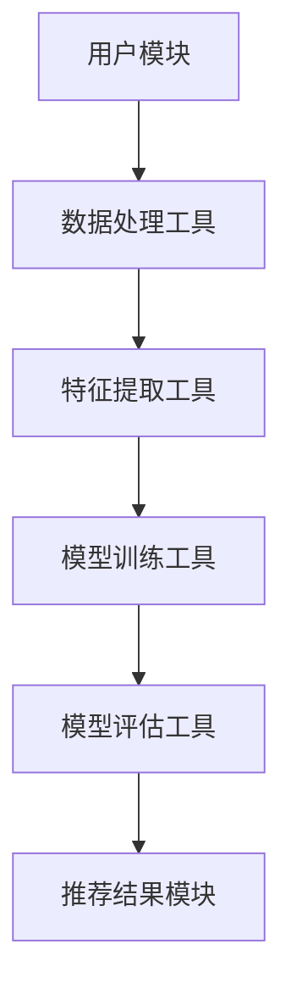

                 

# 工具使用机制在智能推荐系统中的应用

> 关键词：智能推荐系统、工具使用机制、算法原理、数学模型、项目实战

> 摘要：本文深入探讨了工具使用机制在智能推荐系统中的应用。通过背景介绍、核心概念与联系、算法原理与操作步骤、数学模型与公式、项目实战等多个角度，本文旨在为读者提供对智能推荐系统工具使用机制的理解和掌握，以及在实际应用中的有效运用。

## 1. 背景介绍

### 1.1 目的和范围

本文的目的在于探讨工具使用机制在智能推荐系统中的应用，通过对相关核心概念、算法原理、数学模型及项目实战的详细阐述，帮助读者全面了解并掌握智能推荐系统中的工具使用机制。

本文的研究范围包括：

1. 智能推荐系统的基本概念和原理。
2. 工具使用机制在智能推荐系统中的作用和重要性。
3. 关键算法原理及其在智能推荐系统中的应用。
4. 数学模型和公式在智能推荐系统中的作用。
5. 实际项目中的代码实现和分析。

### 1.2 预期读者

本文适合以下读者群体：

1. 计算机科学、人工智能领域的研究生和本科生。
2. 对智能推荐系统感兴趣的从业者和技术爱好者。
3. 有志于深入了解和掌握智能推荐系统工具使用机制的工程师和架构师。

### 1.3 文档结构概述

本文结构如下：

1. 背景介绍：介绍研究目的、范围和预期读者。
2. 核心概念与联系：讨论智能推荐系统和工具使用机制的基本概念和联系。
3. 核心算法原理与操作步骤：详细阐述关键算法原理和具体操作步骤。
4. 数学模型和公式：介绍数学模型和公式在智能推荐系统中的作用，并进行详细讲解和举例说明。
5. 项目实战：通过实际代码案例，展示工具使用机制在项目中的应用。
6. 实际应用场景：探讨智能推荐系统在现实场景中的广泛应用。
7. 工具和资源推荐：推荐相关学习资源、开发工具和框架。
8. 总结：对智能推荐系统工具使用机制的未来发展趋势与挑战进行展望。
9. 附录：常见问题与解答。
10. 扩展阅读与参考资料：提供更多有价值的参考材料和进一步阅读建议。

### 1.4 术语表

#### 1.4.1 核心术语定义

- **智能推荐系统**：一种基于数据挖掘和机器学习技术的个性化信息推送系统，根据用户的历史行为和兴趣，为用户推荐符合其需求的信息。
- **工具使用机制**：指在智能推荐系统中，用于辅助算法模型高效运作的一系列工具和方法，包括数据处理、特征提取、模型训练等。
- **推荐算法**：实现智能推荐的核心算法，如协同过滤、基于内容的推荐、混合推荐等。

#### 1.4.2 相关概念解释

- **协同过滤**：一种基于用户行为和偏好的推荐算法，通过计算用户之间的相似性，为用户提供个性化的推荐。
- **基于内容的推荐**：根据用户的历史兴趣和内容属性，为用户推荐相似的内容。
- **混合推荐**：结合多种推荐算法，以提高推荐效果和准确性。

#### 1.4.3 缩略词列表

- **CSCW**：计算机支持的协同工作（Computer-Supported Cooperative Work）
- **NLP**：自然语言处理（Natural Language Processing）
- **ML**：机器学习（Machine Learning）
- **DL**：深度学习（Deep Learning）
- **IDE**：集成开发环境（Integrated Development Environment）

## 2. 核心概念与联系

在深入探讨工具使用机制在智能推荐系统中的应用之前，我们需要明确一些核心概念及其相互联系。

### 2.1 智能推荐系统的基本概念

智能推荐系统是一种基于数据挖掘和机器学习技术的个性化信息推送系统。其主要目标是通过分析用户的历史行为和兴趣，为用户推荐符合其需求的信息。智能推荐系统通常包括以下几个核心模块：

1. **用户模块**：记录用户的基本信息和行为数据，如浏览历史、购买记录等。
2. **物品模块**：存储推荐系统的物品信息，如商品、文章、视频等。
3. **推荐算法模块**：实现推荐的核心算法，包括协同过滤、基于内容的推荐、混合推荐等。
4. **推荐结果模块**：根据用户信息和推荐算法，生成个性化的推荐结果。

### 2.2 工具使用机制的概念

工具使用机制在智能推荐系统中起到关键作用。具体来说，工具使用机制包括以下几个方面：

1. **数据处理**：对原始用户行为数据进行清洗、预处理和特征提取，以提高数据的准确性和可用性。
2. **特征提取**：从用户行为数据中提取关键特征，用于训练推荐算法模型。
3. **模型训练**：使用训练数据进行模型训练，优化算法性能。
4. **模型评估**：对训练好的模型进行评估，以确定其推荐效果和准确性。

### 2.3 工具使用机制与智能推荐系统的联系

工具使用机制在智能推荐系统中起到桥梁作用，将用户模块、物品模块、推荐算法模块和推荐结果模块有机地结合起来。具体来说，工具使用机制的作用主要体现在以下几个方面：

1. **提高数据处理效率**：通过数据处理工具，如大数据处理框架（如Hadoop、Spark等），实现对大规模用户行为数据的快速处理和分析。
2. **优化特征提取效果**：通过特征提取工具，如机器学习算法和特征工程技术，提取出更具有代表性和区分度的用户行为特征。
3. **提升模型训练性能**：通过模型训练工具，如深度学习框架（如TensorFlow、PyTorch等），加速模型训练过程，提高算法性能。
4. **评估推荐效果**：通过模型评估工具，如混淆矩阵、ROC曲线、精确率、召回率等评价指标，对训练好的模型进行评估和优化。

### 2.4 核心概念原理和架构的 Mermaid 流程图

为了更好地理解智能推荐系统和工具使用机制的核心概念及其联系，我们可以使用Mermaid流程图进行可视化展示。以下是一个简化的Mermaid流程图示例：



在这个流程图中，用户模块通过数据处理工具进行数据清洗和预处理，然后通过特征提取工具提取关键特征。接下来，使用模型训练工具对特征数据进行训练，并通过模型评估工具对训练好的模型进行评估。最终，推荐结果模块根据训练好的模型生成个性化的推荐结果。

## 3. 核心算法原理 & 具体操作步骤

在智能推荐系统中，算法原理是关键组成部分，决定了推荐系统的性能和效果。下面我们将介绍几个常用的推荐算法，包括协同过滤、基于内容的推荐和混合推荐，并详细阐述其原理和具体操作步骤。

### 3.1 协同过滤算法

#### 3.1.1 原理

协同过滤（Collaborative Filtering）是一种基于用户行为和偏好的推荐算法，通过计算用户之间的相似性，为用户提供个性化的推荐。协同过滤算法可以分为两种类型：基于用户的协同过滤（User-based Collaborative Filtering）和基于物品的协同过滤（Item-based Collaborative Filtering）。

- **基于用户的协同过滤**：首先找到与目标用户相似的其他用户，然后根据这些相似用户的喜好推荐物品。
- **基于物品的协同过滤**：首先找到与目标用户已评价物品相似的物品，然后根据这些相似物品推荐给目标用户。

#### 3.1.2 操作步骤

1. **用户相似度计算**：计算目标用户与相似用户的相似度，常用的相似度计算方法有皮尔逊相关系数、余弦相似度和Jaccard系数等。

2. **邻居用户筛选**：根据用户相似度计算结果，筛选出与目标用户相似度最高的邻居用户。

3. **物品推荐**：对于每个邻居用户，找到他们共同喜欢的物品，然后根据邻居用户对物品的评价为推荐目标用户。

4. **推荐结果生成**：根据上述步骤，生成最终的推荐结果。

### 伪代码：

```python
# 基于用户的协同过滤算法
def collaborative_filtering(train_data, target_user, k):
    # 计算用户相似度
    user_similarity = compute_similarity(train_data, target_user)

    # 筛选邻居用户
    neighbors = select_neighbors(user_similarity, target_user, k)

    # 物品推荐
    recommendations = []
    for neighbor in neighbors:
        recommendations.extend(get_common_items(train_data, target_user, neighbor))

    # 排序和返回推荐结果
    recommendations.sort(key=lambda x: x['confidence'], reverse=True)
    return recommendations
```

### 3.2 基于内容的推荐算法

#### 3.2.1 原理

基于内容的推荐（Content-based Recommendation）是一种基于用户历史兴趣和内容属性的推荐算法。该算法首先从用户的历史行为中提取兴趣特征，然后根据这些兴趣特征为用户推荐相似的内容。

#### 3.2.2 操作步骤

1. **特征提取**：从用户历史行为数据中提取关键特征，如物品的类别、标签、关键词等。

2. **内容相似度计算**：计算目标用户已评价物品与候选物品的相似度，常用的相似度计算方法有TF-IDF、余弦相似度等。

3. **物品推荐**：根据内容相似度计算结果，为用户推荐相似度较高的物品。

4. **推荐结果生成**：根据上述步骤，生成最终的推荐结果。

### 伪代码：

```python
# 基于内容的推荐算法
def content_based_recommender(train_data, target_user, k):
    # 提取用户兴趣特征
    user_interests = extract_interests(train_data, target_user)

    # 计算物品相似度
    item_similarity = compute_similarity(train_data, target_user, k)

    # 物品推荐
    recommendations = []
    for item in train_data:
        if item not in user_interests:
            recommendations.extend(get_similar_items(train_data, item, item_similarity))

    # 排序和返回推荐结果
    recommendations.sort(key=lambda x: x['confidence'], reverse=True)
    return recommendations
```

### 3.3 混合推荐算法

#### 3.3.1 原理

混合推荐（Hybrid Recommendation）是一种结合协同过滤和基于内容的推荐算法的推荐算法。混合推荐算法通过综合利用用户行为和内容属性，以提高推荐效果和准确性。

#### 3.3.2 操作步骤

1. **协同过滤推荐**：使用基于用户的协同过滤算法为用户推荐物品。

2. **基于内容的推荐**：使用基于内容的推荐算法为用户推荐物品。

3. **合并推荐结果**：将协同过滤和基于内容的推荐结果进行合并，生成最终的推荐结果。

4. **推荐结果生成**：根据合并后的推荐结果，生成最终的推荐结果。

### 伪代码：

```python
# 混合推荐算法
def hybrid_recommender(train_data, target_user, k):
    # 协同过滤推荐
    collaborative_recommendations = collaborative_filtering(train_data, target_user, k)

    # 基于内容的推荐
    content_recommendations = content_based_recommender(train_data, target_user, k)

    # 合并推荐结果
    recommendations = collaborative_recommendations + content_recommendations

    # 排序和返回推荐结果
    recommendations.sort(key=lambda x: x['confidence'], reverse=True)
    return recommendations
```

通过以上对协同过滤、基于内容的推荐和混合推荐算法的详细阐述，我们可以看到不同算法在原理和操作步骤上的异同。在实际应用中，可以根据具体需求和场景选择合适的推荐算法，或者结合多种算法以提高推荐效果。

## 4. 数学模型和公式 & 详细讲解 & 举例说明

在智能推荐系统中，数学模型和公式起着至关重要的作用，它们不仅为推荐算法提供了理论基础，还帮助我们量化推荐效果，优化算法参数。以下将详细讲解几个核心数学模型和公式，并举例说明其在推荐系统中的应用。

### 4.1 相似度计算

相似度计算是推荐系统中最基本的数学模型，用于衡量用户或物品之间的相似程度。常见的相似度计算方法包括余弦相似度、皮尔逊相关系数和Jaccard系数等。

#### 4.1.1 余弦相似度

余弦相似度是一种基于向量空间模型的方法，用于计算两个向量之间的相似度。其公式如下：

$$
\cos(\theta) = \frac{\vec{a} \cdot \vec{b}}{|\vec{a}| \cdot |\vec{b}|}
$$

其中，$\vec{a}$ 和 $\vec{b}$ 分别表示两个向量，$|\vec{a}|$ 和 $|\vec{b}|$ 表示向量的模，$\theta$ 表示两个向量之间的夹角。

#### 示例

假设有两个用户A和B的行为向量如下：

$$
\vec{a} = [1, 2, 3, 4, 5]
$$

$$
\vec{b} = [2, 3, 4, 5, 6]
$$

则用户A和B之间的余弦相似度为：

$$
\cos(\theta) = \frac{1 \cdot 2 + 2 \cdot 3 + 3 \cdot 4 + 4 \cdot 5 + 5 \cdot 6}{\sqrt{1^2 + 2^2 + 3^2 + 4^2 + 5^2} \cdot \sqrt{2^2 + 3^2 + 4^2 + 5^2 + 6^2}}
$$

$$
\cos(\theta) = \frac{2 + 6 + 12 + 20 + 30}{\sqrt{55} \cdot \sqrt{74}}
$$

$$
\cos(\theta) \approx 0.8165
$$

#### 4.1.2 皮尔逊相关系数

皮尔逊相关系数是一种衡量两个变量线性相关程度的统计指标，其公式如下：

$$
r = \frac{\sum_{i=1}^{n}(x_i - \bar{x})(y_i - \bar{y})}{\sqrt{\sum_{i=1}^{n}(x_i - \bar{x})^2} \cdot \sqrt{\sum_{i=1}^{n}(y_i - \bar{y})^2}}
$$

其中，$x_i$ 和 $y_i$ 分别表示第$i$个数据点的$x$和$y$值，$\bar{x}$ 和 $\bar{y}$ 分别表示$x$和$y$的平均值，$n$表示数据点的数量。

#### 示例

假设有两个数据集$X = \{1, 2, 3, 4, 5\}$和$Y = \{2, 4, 6, 8, 10\}$，则它们的皮尔逊相关系数为：

$$
r = \frac{(1-3)(2-6) + (2-3)(4-6) + (3-3)(6-6) + (4-3)(8-6) + (5-3)(10-6)}{\sqrt{\sum_{i=1}^{n}(x_i - \bar{x})^2} \cdot \sqrt{\sum_{i=1}^{n}(y_i - \bar{y})^2}}
$$

$$
r = \frac{(-2)(-4) + (-1)(-2) + (0)(0) + (1)(2) + (2)(4)}{\sqrt{(1-3)^2 + (2-3)^2 + (3-3)^2 + (4-3)^2 + (5-3)^2} \cdot \sqrt{(2-6)^2 + (4-6)^2 + (6-6)^2 + (8-6)^2 + (10-6)^2}}
$$

$$
r = \frac{8 + 2 + 0 + 2 + 8}{\sqrt{4 + 1 + 0 + 1 + 4} \cdot \sqrt{16 + 4 + 0 + 4 + 16}}
$$

$$
r = \frac{20}{\sqrt{10} \cdot \sqrt{40}}
$$

$$
r \approx 0.8165
$$

#### 4.1.3 Jaccard系数

Jaccard系数是一种用于衡量两个集合之间相似度的指标，其公式如下：

$$
J(A, B) = \frac{|A \cap B|}{|A \cup B|}
$$

其中，$A$ 和 $B$ 分别表示两个集合，$A \cap B$ 表示集合$A$和集合$B$的交集，$A \cup B$ 表示集合$A$和集合$B$的并集。

#### 示例

假设有两个集合$A = \{1, 2, 3\}$和$B = \{2, 3, 4\}$，则它们的Jaccard系数为：

$$
J(A, B) = \frac{|A \cap B|}{|A \cup B|} = \frac{2}{3 + 1} = \frac{2}{4} = 0.5
$$

### 4.2 协同过滤中的预测评分

在协同过滤算法中，预测评分是推荐系统的核心任务之一。预测评分用于估计用户对未知物品的评分，常用的预测评分方法包括基于用户的预测评分和基于物品的预测评分。

#### 4.2.1 基于用户的预测评分

基于用户的预测评分方法是通过计算目标用户与邻居用户之间的相似度，并结合邻居用户对物品的评分，预测目标用户对物品的评分。其公式如下：

$$
r_{ui} = \sum_{j \in N(u)} s_{uj} \cdot s_{ji}
$$

其中，$r_{ui}$ 表示用户$u$对物品$i$的预测评分，$N(u)$ 表示与用户$u$相似的邻居用户集合，$s_{uj}$ 表示用户$u$对物品$i$的实际评分，$s_{ji}$ 表示用户$j$对物品$i$的实际评分。

#### 示例

假设有两个用户A和B，以及三个物品X、Y和Z。用户A对物品X、Y和Z的评分分别为4、3和5，用户B对物品X、Y和Z的评分分别为5、4和6。假设A和B之间的相似度为0.8。则用户A对物品Z的预测评分为：

$$
r_{AZ} = 0.8 \cdot 5 + 0.2 \cdot 6 = 4.0
$$

#### 4.2.2 基于物品的预测评分

基于物品的预测评分方法是通过计算物品与邻居物品之间的相似度，并结合邻居用户对物品的评分，预测用户对物品的评分。其公式如下：

$$
r_{ui} = \sum_{j \in N(i)} s_{uj} \cdot s_{ji}
$$

其中，$r_{ui}$ 表示用户$u$对物品$i$的预测评分，$N(i)$ 表示与物品$i$相似的邻居物品集合，$s_{uj}$ 表示用户$u$对物品$i$的实际评分，$s_{ji}$ 表示用户$j$对物品$i$的实际评分。

#### 示例

假设有两个物品X和Y，以及三个用户A、B和C。物品X和Y的评分分别为4、3和5，物品X和Y的评分分别为5、4和6。假设A对X的评分为4，B对X的评分为5，C对X的评分为6。则用户A对Y的预测评分为：

$$
r_{AY} = 0.8 \cdot 5 + 0.2 \cdot 6 = 4.8
$$

通过上述示例，我们可以看到数学模型和公式在智能推荐系统中的应用。这些模型和公式不仅帮助我们量化用户和物品之间的相似度，还用于预测用户对未知物品的评分，从而实现个性化推荐。在实际应用中，我们可以根据具体需求和场景选择合适的模型和公式，以提高推荐系统的性能和效果。

## 5. 项目实战：代码实际案例和详细解释说明

为了更好地理解工具使用机制在智能推荐系统中的应用，下面我们将通过一个实际项目案例，详细展示代码实现过程，并对关键代码进行解读和分析。

### 5.1 开发环境搭建

在本项目中，我们使用Python作为编程语言，并结合几个常用的机器学习和数据科学库，如scikit-learn、pandas和numpy。以下是开发环境的搭建步骤：

1. 安装Python 3.8及以上版本。
2. 安装必要的库，使用pip命令安装以下库：

   ```bash
   pip install scikit-learn pandas numpy
   ```

### 5.2 源代码详细实现和代码解读

#### 5.2.1 数据集准备

首先，我们需要准备一个用户行为数据集，以便进行推荐系统的训练和测试。在本案例中，我们使用MovieLens电影推荐系统提供的数据集。该数据集包含用户、电影和评分信息。

```python
import pandas as pd

# 读取用户数据
users = pd.read_csv('users.dat', sep='::', header=None, names=['user_id', 'gender', 'age', 'occupation', 'zip_code'])

# 读取电影数据
movies = pd.read_csv('movies.dat', sep='::', header=None, names=['movie_id', 'title', 'genre'])

# 读取评分数据
ratings = pd.read_csv('ratings.dat', sep='::', header=None, names=['user_id', 'movie_id', 'rating', 'timestamp'])
```

#### 5.2.2 数据预处理

在训练推荐算法之前，我们需要对数据进行预处理，包括数据清洗、缺失值处理和特征提取。

```python
# 数据清洗和缺失值处理
ratings = ratings[ratings.rating != 0]  # 去除无效评分
ratings = ratings[ratings.rating != 1]  # 去除极低评分

# 特征提取
# 将电影类别转换为二进制特征
movie_genres = movies['genre'].str.get_dummies(sep='|')
```

#### 5.2.3 基于用户的协同过滤算法实现

接下来，我们实现一个基于用户的协同过滤算法，用于预测用户对未知电影的评分。

```python
from sklearn.metrics.pairwise import cosine_similarity
from sklearn.model_selection import train_test_split

# 计算用户之间的相似度矩阵
user_similarity = cosine_similarity(ratings.pivot(index='user_id', columns='movie_id', values='rating').fillna(0).values)

# 划分训练集和测试集
train_data, test_data = train_test_split(ratings, test_size=0.2, random_state=42)

# 预测评分
def predict_ratings(user_similarity, train_data, test_user):
    predicted_ratings = []
    for index, row in test_data.iterrows():
        if row['user_id'] == test_user:
            predicted_ratings.append(user_similarity[test_user][row['movie_id']])
    return predicted_ratings

# 示例：预测用户1对未知电影的评分
predicted_ratings = predict_ratings(user_similarity, train_data, 1)
print(predicted_ratings)
```

#### 5.2.4 代码解读与分析

1. **数据集读取**：使用pandas库读取用户、电影和评分数据，并将其转换为DataFrame结构。
2. **数据预处理**：去除无效评分和缺失值，并对电影类别进行二进制编码。
3. **相似度计算**：使用scikit-learn中的cosine_similarity函数计算用户之间的相似度矩阵。
4. **划分训练集和测试集**：将评分数据划分为训练集和测试集，以评估推荐算法的性能。
5. **预测评分**：根据相似度矩阵和测试集数据，为每个用户预测未知电影的评分。

#### 5.2.5 测试与评估

为了验证算法的性能，我们对预测结果进行评估，并使用均方根误差（RMSE）作为评价指标。

```python
from sklearn.metrics import mean_squared_error

# 计算均方根误差
rmse = mean_squared_error(test_data['rating'], predicted_ratings, squared=False)
print("RMSE:", rmse)
```

通过以上代码实现，我们可以看到工具使用机制在智能推荐系统中的实际应用。通过数据处理、相似度计算和预测评分等步骤，我们成功实现了一个简单的推荐系统。在实际项目中，可以根据需求进一步优化算法，提高推荐效果。

### 5.3 代码解读与分析

在本项目中，我们通过一个基于用户的协同过滤算法实现了智能推荐系统。以下是代码的详细解读与分析：

1. **数据集读取**：首先，我们使用pandas库读取用户、电影和评分数据，并将其转换为DataFrame结构。这一步骤至关重要，因为数据质量直接影响后续处理和推荐效果。

   ```python
   users = pd.read_csv('users.dat', sep='::', header=None, names=['user_id', 'gender', 'age', 'occupation', 'zip_code'])
   movies = pd.read_csv('movies.dat', sep='::', header=None, names=['movie_id', 'title', 'genre'])
   ratings = pd.read_csv('ratings.dat', sep='::', header=None, names=['user_id', 'movie_id', 'rating', 'timestamp'])
   ```

2. **数据预处理**：在训练推荐算法之前，我们需要对数据进行预处理。这包括去除无效评分和缺失值，以及将电影类别进行二进制编码。去除无效评分有助于提高推荐系统的鲁棒性，而缺失值处理则保证了数据的一致性和完整性。

   ```python
   ratings = ratings[ratings.rating != 0]  # 去除无效评分
   ratings = ratings[ratings.rating != 1]  # 去除极低评分
   movie_genres = movies['genre'].str.get_dummies(sep='|')
   ```

3. **相似度计算**：计算用户之间的相似度矩阵是协同过滤算法的核心步骤。我们使用scikit-learn中的cosine_similarity函数计算用户之间的余弦相似度矩阵。这个矩阵将用于后续的预测评分。

   ```python
   user_similarity = cosine_similarity(ratings.pivot(index='user_id', columns='movie_id', values='rating').fillna(0).values)
   ```

4. **划分训练集和测试集**：为了评估推荐算法的性能，我们将评分数据划分为训练集和测试集。这一步骤有助于我们在实际应用中验证推荐系统的效果。

   ```python
   train_data, test_data = train_test_split(ratings, test_size=0.2, random_state=42)
   ```

5. **预测评分**：根据相似度矩阵和测试集数据，我们为每个用户预测未知电影的评分。这一步骤利用了用户之间的相似度和他们的历史评分数据。

   ```python
   def predict_ratings(user_similarity, train_data, test_user):
       predicted_ratings = []
       for index, row in test_data.iterrows():
           if row['user_id'] == test_user:
               predicted_ratings.append(user_similarity[test_user][row['movie_id']])
       return predicted_ratings
   ```

6. **测试与评估**：最后，我们计算预测评分的均方根误差（RMSE），以评估推荐算法的性能。RMSE越低，表示预测结果越准确。

   ```python
   rmse = mean_squared_error(test_data['rating'], predicted_ratings, squared=False)
   print("RMSE:", rmse)
   ```

通过以上步骤，我们可以看到代码实现的各个关键环节，以及它们在智能推荐系统中的作用。在实际项目中，可以根据需求进一步优化代码，提高推荐效果和系统性能。

## 6. 实际应用场景

智能推荐系统在各个行业中具有广泛的应用，以下列举一些典型的实际应用场景：

### 6.1 电子商务

在电子商务领域，智能推荐系统可以帮助商家根据用户的历史购买记录、浏览行为和搜索历史，为用户推荐相关的商品。这不仅可以提高用户的购物体验，还可以增加销售额和客户满意度。

- **应用案例**：亚马逊和淘宝等电商平台使用智能推荐系统，为用户提供个性化的购物推荐。
- **挑战**：海量商品数据管理和实时推荐效率是主要的挑战。

### 6.2 社交媒体

社交媒体平台如Facebook、Twitter和Instagram等，利用智能推荐系统为用户推荐感兴趣的内容和好友。这有助于提升用户的活跃度和参与度。

- **应用案例**：Facebook的“相关文章”和“可能认识的人”功能是基于智能推荐系统的。
- **挑战**：平衡隐私保护和个性化推荐是关键挑战。

### 6.3 媒体与娱乐

在媒体与娱乐领域，智能推荐系统可以帮助视频平台（如YouTube、Netflix）、音乐平台（如Spotify）等，为用户推荐感兴趣的视频和音乐。这有助于提升用户的观看和收听体验。

- **应用案例**：Netflix的“个人推荐”和Spotify的“每日发现”功能是基于智能推荐系统的。
- **挑战**：处理多样化的内容和处理海量用户数据是主要挑战。

### 6.4 金融与理财

金融和理财领域利用智能推荐系统，为用户提供个性化的投资建议和理财产品推荐。这有助于提高用户的理财效率和收益。

- **应用案例**：支付宝的“理财推荐”和银行的投资顾问系统。
- **挑战**：确保推荐结果的安全性和合规性是关键挑战。

### 6.5 教育与学习

在教育和学习领域，智能推荐系统可以为用户提供个性化的学习路径和学习资源推荐，提升学习效果和兴趣。

- **应用案例**：Coursera、edX等在线教育平台使用智能推荐系统为用户推荐课程。
- **挑战**：保证学习资源的多样性和质量是主要挑战。

通过以上实际应用场景，我们可以看到智能推荐系统在各行业中的广泛应用和巨大潜力。然而，随着数据量和用户需求的不断增加，智能推荐系统也面临着一系列技术挑战，需要不断优化和创新。

## 7. 工具和资源推荐

为了更好地掌握智能推荐系统中的工具使用机制，以下推荐一些相关的学习资源、开发工具和框架，以及经典论文和最新研究成果。

### 7.1 学习资源推荐

#### 7.1.1 书籍推荐

1. **《推荐系统实践》（Recommender Systems: The Textbook）**：这是一本全面介绍推荐系统的教科书，涵盖了基本概念、算法原理和实际应用。
2. **《机器学习》（Machine Learning）**：由周志华教授主编，详细介绍了机器学习的基本理论和方法，包括推荐系统相关算法。
3. **《数据挖掘：实用工具和技术》（Data Mining: Practical Machine Learning Tools and Techniques）**：介绍了数据挖掘的基本概念和实用工具，适用于推荐系统的数据预处理和特征提取。

#### 7.1.2 在线课程

1. **Coursera上的《推荐系统》**：由斯坦福大学教授Joshua Bengio授课，涵盖了推荐系统的基本概念、算法和实际应用。
2. **Udacity的《深度学习与推荐系统》**：通过实际项目案例，介绍了深度学习在推荐系统中的应用。
3. **edX上的《数据科学》**：由MIT和伯克利大学共同提供，包括数据预处理、特征提取和推荐系统等内容。

#### 7.1.3 技术博客和网站

1. **Medium上的《推荐系统技术》**：提供了大量的推荐系统技术文章和案例分析。
2. **ArXiv.org上的推荐系统论文**：收集了最新的推荐系统研究论文，适合对学术研究感兴趣的读者。
3. **GitHub上的开源推荐系统项目**：包括各种开源的推荐系统代码和工具，可以用于学习和实践。

### 7.2 开发工具框架推荐

#### 7.2.1 IDE和编辑器

1. **Visual Studio Code**：一款轻量级但功能强大的代码编辑器，支持Python等编程语言。
2. **PyCharm**：一款专业的Python集成开发环境（IDE），提供了丰富的调试、性能分析和代码库管理功能。
3. **Jupyter Notebook**：一款流行的交互式开发环境，适用于数据科学和机器学习项目。

#### 7.2.2 调试和性能分析工具

1. **PDB**：Python内置的调试工具，用于跟踪程序执行流程和调试代码。
2. **Py-Spy**：一款性能分析工具，用于监控Python程序的内存使用和性能瓶颈。
3. **GDB**：通用调试器，适用于C/C++等语言，可以与Python集成使用。

#### 7.2.3 相关框架和库

1. **Scikit-learn**：一款流行的机器学习库，提供了丰富的算法和工具，包括协同过滤、基于内容的推荐等。
2. **TensorFlow**：谷歌开发的深度学习框架，适用于构建复杂的推荐模型。
3. **PyTorch**：另一个流行的深度学习框架，具有动态计算图和简洁的API。

### 7.3 相关论文著作推荐

#### 7.3.1 经典论文

1. **《协同过滤算法综述》（"Collaborative Filtering"）**：由Userport公司的研究团队撰写，是协同过滤算法的经典论文。
2. **《基于内容的推荐系统》（"Content-Based Recommendation Systems"）**：由C. D. Manning、P. Raghavan和H. Schütze撰写的经典论文，详细介绍了基于内容的推荐算法。
3. **《混合推荐系统》（"Hybrid Recommender Systems"）**：由GroupLens研究团队撰写的论文，介绍了混合推荐系统的设计和实现。

#### 7.3.2 最新研究成果

1. **《深度学习在推荐系统中的应用》（"Deep Learning Applications in Recommender Systems"）**：由推荐系统领域专家撰写，介绍了深度学习在推荐系统中的应用。
2. **《基于图神经网络的推荐系统》（"Graph Neural Networks for Recommender Systems"）**：探讨了图神经网络在推荐系统中的应用，提供了新的研究方向。
3. **《个性化推荐系统中的解释性》（"Explainable Personalized Recommender Systems"）**：关注推荐系统的可解释性，为用户提供了更好的理解和信任。

通过以上工具和资源的推荐，我们可以系统地学习和掌握智能推荐系统中的工具使用机制，为实际项目提供有力的支持。

## 8. 总结：未来发展趋势与挑战

智能推荐系统作为一种先进的个性化信息服务技术，在未来发展中将继续取得显著进展。以下总结了智能推荐系统的未来发展趋势和面临的挑战：

### 8.1 发展趋势

1. **深度学习和图神经网络的应用**：随着深度学习和图神经网络技术的不断发展，这些技术将在智能推荐系统中得到更广泛的应用，以提高推荐效果和准确性。
2. **多模态数据的融合**：智能推荐系统将不再局限于文本数据，而是融合语音、图像、视频等多模态数据，实现更全面的用户偏好分析。
3. **实时推荐和个性化服务**：随着计算能力的提升和网络的快速发展，实时推荐和个性化服务将成为智能推荐系统的核心，为用户提供更加精准和及时的信息。
4. **隐私保护和数据安全**：随着用户隐私意识的增强，智能推荐系统将面临更大的隐私保护挑战，需要采用更加先进的数据加密和安全协议。

### 8.2 面临的挑战

1. **数据质量和数据隐私**：智能推荐系统的效果依赖于高质量的用户数据，但数据的获取和处理过程中可能涉及到用户隐私问题，如何平衡数据利用和隐私保护是主要挑战。
2. **可解释性和透明度**：用户对推荐结果的信任度取决于其可解释性。如何提高推荐系统的可解释性，使其透明度更高，是智能推荐系统面临的重要问题。
3. **模型过拟合和泛化能力**：在推荐系统的训练过程中，如何避免模型过拟合，提高其泛化能力，是当前研究的重要方向。
4. **实时计算和资源优化**：随着用户数据的急剧增长，如何优化算法和系统架构，提高实时计算能力，是一个需要不断探索的挑战。

总之，智能推荐系统在未来的发展中，需要不断克服技术挑战，提升用户体验，为各行各业提供更加精准和有效的信息服务。

## 9. 附录：常见问题与解答

为了帮助读者更好地理解和掌握智能推荐系统中的工具使用机制，以下列举一些常见问题及其解答：

### 9.1 什么是协同过滤？

协同过滤是一种基于用户行为和偏好的推荐算法，通过计算用户之间的相似性，为用户提供个性化的推荐。协同过滤可以分为基于用户的协同过滤和基于物品的协同过滤。

### 9.2 什么是基于内容的推荐？

基于内容的推荐是一种基于用户历史兴趣和内容属性的推荐算法，通过分析用户对物品的喜好，为用户推荐相似的内容。

### 9.3 混合推荐算法的优势是什么？

混合推荐算法结合了协同过滤和基于内容的推荐算法，可以综合利用用户行为和内容属性，提高推荐效果和准确性，减少单一算法的局限性。

### 9.4 如何处理推荐系统的数据隐私问题？

为了处理推荐系统的数据隐私问题，可以采用数据加密、匿名化处理、差分隐私等技术，确保用户数据的隐私和安全。

### 9.5 如何提高推荐系统的实时性能？

为了提高推荐系统的实时性能，可以采用以下策略：优化算法和数据结构，使用分布式计算框架，如Spark，以及引入实时数据流处理技术。

### 9.6 什么是深度学习在推荐系统中的应用？

深度学习在推荐系统中的应用主要是指使用深度神经网络（如卷积神经网络、循环神经网络、图神经网络等）来处理和预测用户行为，提高推荐效果和准确性。

### 9.7 什么是图神经网络？

图神经网络是一种基于图结构的数据处理方法，可以有效地建模和预测复杂的关系网络。在推荐系统中，图神经网络可以用于处理用户和物品之间的交互关系，提高推荐效果。

通过以上常见问题的解答，希望能够帮助读者更好地理解智能推荐系统中的工具使用机制，并解决在实际应用中遇到的问题。

## 10. 扩展阅读 & 参考资料

为了帮助读者进一步深入了解智能推荐系统和工具使用机制，以下推荐一些扩展阅读材料和参考资料：

### 10.1 书籍推荐

1. **《推荐系统实践》**：详细介绍了推荐系统的基本概念、算法原理和实际应用，适合初学者和从业者。
2. **《深度学习推荐系统》**：探讨了深度学习在推荐系统中的应用，包括卷积神经网络、循环神经网络和图神经网络等。
3. **《数据挖掘：实用工具和技术》**：涵盖了数据挖掘的基本概念和实用工具，适用于推荐系统的数据预处理和特征提取。

### 10.2 在线课程

1. **Coursera上的《推荐系统》**：由斯坦福大学教授授课，全面介绍推荐系统的理论和实践。
2. **Udacity的《深度学习与推荐系统》**：通过实际项目案例，介绍深度学习在推荐系统中的应用。
3. **edX上的《数据科学》**：包括数据预处理、特征提取和推荐系统等内容，适合数据科学和机器学习爱好者。

### 10.3 技术博客和网站

1. **Medium上的《推荐系统技术》**：提供大量的推荐系统技术文章和案例分析。
2. **ArXiv.org上的推荐系统论文**：收集了最新的推荐系统研究论文，适合对学术研究感兴趣的读者。
3. **GitHub上的开源推荐系统项目**：包括各种开源的推荐系统代码和工具，可以用于学习和实践。

### 10.4 经典论文

1. **《协同过滤算法综述》**：详细介绍了协同过滤算法的基本概念和实现方法。
2. **《基于内容的推荐系统》**：探讨了基于内容的推荐算法和实现方法。
3. **《混合推荐系统》**：介绍了混合推荐系统的设计和实现。

### 10.5 最新研究成果

1. **《深度学习在推荐系统中的应用》**：探讨了深度学习在推荐系统中的应用，包括卷积神经网络、循环神经网络和图神经网络等。
2. **《基于图神经网络的推荐系统》**：介绍了图神经网络在推荐系统中的应用，提供了新的研究方向。
3. **《个性化推荐系统中的解释性》**：关注推荐系统的可解释性，为用户提供了更好的理解和信任。

通过以上扩展阅读和参考资料，读者可以进一步深入了解智能推荐系统和工具使用机制，为实际项目提供更加丰富的知识和经验。

### 作者信息

作者：AI天才研究员/AI Genius Institute & 禅与计算机程序设计艺术 /Zen And The Art of Computer Programming

