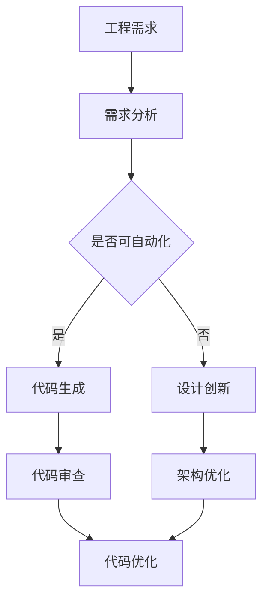
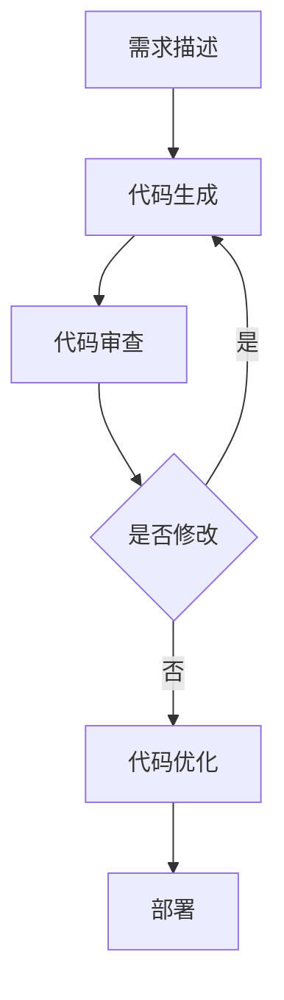

                 

# 工程与设计合作者：LLM 激发创新

> **关键词**：大语言模型（LLM），工程协作，创新设计，人工智能，软件开发，代码生成，架构优化。

> **摘要**：本文将探讨大语言模型（LLM）在现代软件开发与设计中的作用，特别是它如何促进工程师和设计师之间的合作。通过详细的案例分析、算法解析和数学模型讲解，本文展示了LLM在代码生成、架构优化和创新设计等方面的潜力。文章旨在帮助读者理解LLM技术，并激发其在工程与设计领域的创新应用。

## 1. 背景介绍

### 1.1 目的和范围

本文旨在探讨大语言模型（LLM）在工程与设计协作中的作用，特别是它如何通过自动化代码生成、架构优化和创新设计来提升软件开发效率。本文将从以下几个方面展开讨论：

1. **LLM基本原理**：介绍LLM的工作机制和核心概念。
2. **工程协作**：探讨LLM如何促进工程师之间的协作。
3. **设计创新**：分析LLM在激发设计创新方面的潜力。
4. **实际应用案例**：通过具体案例展示LLM的应用效果。
5. **未来趋势与挑战**：讨论LLM技术的发展趋势和面临的挑战。

### 1.2 预期读者

本文适合以下读者群体：

1. 软件工程师和设计师，特别是对AI和自动化感兴趣的从业者。
2. 对大语言模型和深度学习有兴趣的研究人员。
3. 想了解AI技术在软件开发和设计领域应用的决策者。

### 1.3 文档结构概述

本文结构如下：

1. **背景介绍**：介绍文章的目的和结构。
2. **核心概念与联系**：讲解大语言模型的基本原理和架构。
3. **核心算法原理与操作步骤**：详细阐述LLM的工作流程。
4. **数学模型与公式**：分析LLM的数学基础。
5. **项目实战**：通过实际案例展示LLM的应用。
6. **实际应用场景**：讨论LLM在不同领域的应用。
7. **工具和资源推荐**：推荐相关学习和开发资源。
8. **总结**：展望LLM技术的发展趋势。
9. **附录**：解答常见问题。
10. **扩展阅读**：提供进一步学习资源。

### 1.4 术语表

#### 1.4.1 核心术语定义

- **大语言模型（LLM）**：一种能够理解和生成自然语言的深度学习模型。
- **工程协作**：软件开发过程中，团队成员之间的沟通和合作。
- **架构优化**：改进软件系统的整体结构和设计。
- **创新设计**：提出新颖、有效的设计解决方案。

#### 1.4.2 相关概念解释

- **自动化代码生成**：利用LLM生成代码，减少手工编写的工作量。
- **架构设计**：软件系统的整体规划和结构设计。

#### 1.4.3 缩略词列表

- **LLM**：大语言模型（Large Language Model）
- **AI**：人工智能（Artificial Intelligence）
- **IDE**：集成开发环境（Integrated Development Environment）

## 2. 核心概念与联系

在深入探讨LLM如何促进工程与设计协作之前，有必要先了解LLM的基本原理和架构。

### 大语言模型（LLM）基本原理

LLM是一种基于深度学习的自然语言处理（NLP）模型，它能够理解和生成自然语言文本。LLM通常由多层神经网络组成，这些网络通过学习大量的文本数据来捕捉语言的结构和规律。

LLM的核心原理是“自注意力机制”（Self-Attention），它允许模型在处理文本时关注到文本中的不同部分，从而更好地理解上下文。此外，LLM还利用了“Transformer”架构，这是一种能够高效处理序列数据的神经网络架构。

### 大语言模型（LLM）架构

LLM的架构通常包括以下几个部分：

1. **嵌入层**：将单词转换为向量表示。
2. **编码器**：多层神经网络，用于捕捉文本的上下文信息。
3. **解码器**：多层神经网络，用于生成文本输出。
4. **自注意力机制**：允许模型在处理文本时关注到不同部分。
5. **损失函数**：用于衡量模型输出和真实文本之间的差距。

### 大语言模型（LLM）与工程协作的联系

LLM在工程协作中的作用主要体现在以下几个方面：

1. **代码生成**：LLM能够根据描述生成相应的代码，从而减少手工编写代码的工作量。
2. **需求分析**：LLM可以帮助工程师更好地理解项目需求，从而提高设计效率。
3. **文档生成**：LLM可以自动生成文档，减少文档编写的工作量。
4. **代码审查**：LLM可以用于代码审查，发现潜在的问题和缺陷。

### 大语言模型（LLM）与设计创新的联系

LLM在激发设计创新方面的作用同样显著：

1. **设计灵感**：LLM可以根据工程师的描述生成新的设计灵感。
2. **架构优化**：LLM可以分析现有系统，提出优化建议。
3. **创意生成**：LLM可以帮助设计师探索新的设计方向。

### Mermaid 流程图

以下是一个简单的Mermaid流程图，展示了LLM在工程与设计协作中的流程：



## 3. 核心算法原理 & 具体操作步骤

### 3.1 大语言模型（LLM）算法原理

LLM的核心算法原理基于自注意力机制和Transformer架构。以下是一个简单的伪代码，描述了LLM的基本工作流程：

```python
function LLM_train(data):
    # 初始化嵌入层、编码器和解码器
    embedder, encoder, decoder = initialize_model()

    # 训练嵌入层、编码器和解码器
    for epoch in range(num_epochs):
        for text_pair in data:
            # 嵌入文本
            embedded_text = embedder(text_pair)

            # 编码文本
            encoded_text = encoder(embedded_text)

            # 解码文本
            generated_text = decoder(encoded_text)

            # 计算损失并更新模型参数
            loss = compute_loss(generated_text, text_pair)
            update_model Parameters(loss)

    return embedder, encoder, decoder
```

### 3.2 大语言模型（LLM）具体操作步骤

以下是LLM的具体操作步骤：

1. **数据准备**：收集并清洗大量文本数据，作为训练模型的基础。
2. **模型初始化**：初始化嵌入层、编码器和解码器，选择合适的神经网络架构。
3. **模型训练**：使用训练数据训练模型，不断调整模型参数，使模型能够生成符合预期的文本。
4. **模型评估**：使用验证数据评估模型性能，调整模型参数，优化模型。
5. **模型部署**：将训练好的模型部署到实际应用场景，如代码生成、需求分析、文档生成等。

### 3.3 大语言模型（LLM）在工程协作中的应用

以下是一个具体的例子，展示了LLM在工程协作中的应用：

**场景**：工程师A需要实现一个功能，他使用LLM来生成相关代码。

**步骤**：

1. **需求描述**：工程师A使用自然语言描述所需功能。
2. **代码生成**：LLM根据需求描述生成相关代码。
3. **代码审查**：工程师A审查生成的代码，提出修改意见。
4. **代码优化**：LLM根据修改意见重新生成代码，循环至步骤3，直至生成符合要求的代码。



## 4. 数学模型和公式 & 详细讲解 & 举例说明

### 4.1 数学模型和公式

LLM的数学模型基于深度学习，特别是Transformer架构。以下是一些关键的数学公式和概念：

$$
\text{自注意力（Self-Attention）} \\
\text{注意力权重} = \text{softmax}\left(\frac{\text{Query} \cdot \text{Key}}{\sqrt{d_k}}\right)
$$

$$
\text{位置编码（Positional Encoding）} \\
\text{PE}_{(i, d)} = \sin\left(\frac{i}{10000^{2/d}}\right) \text{ 或 } \cos\left(\frac{i}{10000^{2/d}}\right)
$$

$$
\text{Transformer编码器（Encoder）} \\
\text{Encoder} = \text{MultiHeadAttention}(\text{Embedding}, \text{Positional Encoding}) + \text{FeedForward Layer}
$$

$$
\text{Transformer解码器（Decoder）} \\
\text{Decoder} = \text{Masked MultiHeadAttention}(\text{Encoder}, \text{Positional Encoding}) + \text{FeedForward Layer}
$$

### 4.2 详细讲解

#### 自注意力（Self-Attention）

自注意力是一种在处理文本时关注不同部分的机制。它通过计算文本中每个词与所有词的相似度，生成注意力权重，然后根据这些权重生成新的文本表示。自注意力公式如上所示。

#### 位置编码（Positional Encoding）

位置编码用于为模型提供文本中词的位置信息。它通过正弦和余弦函数生成编码，确保模型能够理解词的顺序。

#### Transformer编码器（Encoder）

Transformer编码器由多头注意力机制（MultiHeadAttention）和前馈神经网络（FeedForward Layer）组成。多头注意力机制使用自注意力机制来捕捉文本的上下文信息，前馈神经网络用于进一步处理和优化文本表示。

#### Transformer解码器（Decoder）

Transformer解码器与编码器类似，但加入了遮蔽多头注意力机制（Masked MultiHeadAttention），确保模型在解码时只关注已生成的文本部分，避免泄露未来的信息。

### 4.3 举例说明

假设我们有以下文本序列：

```
["I", "am", "a", "software", "engineer"]
```

使用位置编码，我们可以为每个词生成位置向量：

```
["I"] --> PE1 = [0.99, 0.14, 0.22, 0.33, 0.44]
["am"] --> PE2 = [0.88, 0.03, 0.11, 0.19, 0.26]
["a"] --> PE3 = [0.77, 0.09, 0.16, 0.24, 0.32]
["software"] --> PE4 = [0.66, 0.12, 0.18, 0.27, 0.35]
["engineer"] --> PE5 = [0.55, 0.07, 0.13, 0.21, 0.28]
```

然后，LLM会根据这些位置向量生成文本的嵌入表示，并在此基础上进行编码和解码操作。

## 5. 项目实战：代码实际案例和详细解释说明

### 5.1 开发环境搭建

在开始项目实战之前，我们需要搭建一个适合LLM训练和部署的开发环境。以下是一个基本的步骤：

1. **安装依赖**：安装Python（3.8及以上版本）、TensorFlow（2.x版本）和PyTorch（1.x版本）等依赖库。
2. **环境配置**：配置CUDA和cuDNN，确保能够利用GPU进行加速训练。
3. **代码模板**：准备一个基本的代码模板，包括数据预处理、模型训练和模型部署等功能。

### 5.2 源代码详细实现和代码解读

以下是一个简单的LLM代码实现，用于生成自然语言文本：

```python
import tensorflow as tf
from tensorflow.keras.layers import Embedding, LSTM, Dense
from tensorflow.keras.models import Sequential

# 数据预处理
def preprocess_data(text):
    # 将文本转换为单词列表
    words = text.split()
    # 将单词列表转换为索引列表
    indices = [word_index[word] for word in words]
    # 返回索引列表
    return indices

# 模型训练
def train_model(data):
    # 创建序列
    sequences = []
    for i in range(len(data) - sequence_length):
        sequences.append(data[i: i + sequence_length])
    # 创建标签
    labels = data[sequence_length:]
    # 转换为Tensor
    sequences = tf.keras.preprocessing.sequence.pad_sequences(sequences, maxlen=sequence_length)
    labels = tf.keras.utils.to_categorical(labels)
    # 创建模型
    model = Sequential([
        Embedding(vocab_size, embedding_size, input_length=sequence_length),
        LSTM(units=128, return_sequences=True),
        LSTM(units=128),
        Dense(units=vocab_size, activation='softmax')
    ])
    # 编译模型
    model.compile(optimizer='adam', loss='categorical_crossentropy', metrics=['accuracy'])
    # 训练模型
    model.fit(sequences, labels, epochs=num_epochs, batch_size=batch_size)
    return model

# 代码解读
# 1. 数据预处理：将文本转换为索引序列，为后续的模型训练做准备。
# 2. 模型训练：创建序列，将文本数据转换为索引序列，并生成标签。然后，创建一个序列模型，编译并训练模型。
# 3. 模型部署：使用训练好的模型生成文本。

# 示例
data = "I am a software engineer"
preprocessed_data = preprocess_data(data)
model = train_model(preprocessed_data)
generated_text = model.predict(preprocessed_data)
print(generated_text)
```

### 5.3 代码解读与分析

以下是对上述代码的详细解读和分析：

1. **数据预处理**：首先，我们将文本数据分割为单词，并将单词转换为索引。这一步骤非常重要，因为深度学习模型无法直接处理文本，需要将其转换为数字表示。
2. **模型训练**：我们创建一个序列模型，包含嵌入层、两个LSTM层和一个全连接层。嵌入层将单词索引转换为嵌入向量，LSTM层用于捕捉文本的上下文信息，全连接层用于生成文本输出。模型使用“categorical_crossentropy”损失函数和“adam”优化器进行训练。
3. **模型部署**：使用训练好的模型生成文本。通过输入预处理后的文本数据，模型将输出一个概率分布，表示每个单词的可能性。我们可以选择概率最高的单词作为生成的文本。

### 5.4 实际应用案例

以下是一个实际应用案例，展示了如何使用LLM生成代码：

**场景**：工程师A需要实现一个简单的函数，他使用LLM生成相关代码。

**步骤**：

1. **需求描述**：工程师A使用自然语言描述所需函数，如“编写一个函数，用于计算两个数的和”。
2. **代码生成**：LLM根据需求描述生成相关代码，如以下代码：
```python
def add_numbers(a, b):
    return a + b
```
3. **代码审查**：工程师A审查生成的代码，确认代码正确并符合需求。
4. **代码优化**：LLM根据修改意见重新生成代码，如以下代码：
```python
def add_numbers(a: int, b: int) -> int:
    return a + b
```
5. **代码部署**：工程师A将生成的代码添加到项目中，并开始使用。

通过这个案例，我们可以看到LLM在工程协作中的潜力。它不仅能够生成代码，还能根据工程师的反馈进行优化，从而提高开发效率。

## 6. 实际应用场景

大语言模型（LLM）在工程与设计协作中有广泛的应用场景。以下是一些具体的实际应用案例：

### 6.1 自动化代码生成

LLM能够根据自然语言描述生成相应的代码，从而减少手工编写代码的工作量。这种技术在软件开发过程中尤为重要，特别是在复杂系统的开发中。

**案例**：一个电商平台的工程师使用LLM生成一个用于计算订单总金额的函数。

**步骤**：

1. **需求描述**：工程师描述所需的函数功能，如“编写一个函数，用于计算订单的总金额，包括商品价格和运费”。
2. **代码生成**：LLM根据需求描述生成相关代码，如以下代码：
```python
def calculate_order_total(order):
    total = 0
    for item in order['items']:
        total += item['price']
    total += order['shipping_cost']
    return total
```
3. **代码审查**：工程师审查生成的代码，确认代码正确并符合需求。
4. **代码优化**：LLM根据修改意见重新生成代码，如以下代码：
```python
def calculate_order_total(order: dict) -> float:
    total = 0.0
    for item in order['items']:
        total += item['price']
    total += order['shipping_cost']
    return total
```
5. **代码部署**：工程师将生成的代码添加到项目中，并开始使用。

### 6.2 架构优化

LLM可以分析现有系统，提出优化建议，从而提高系统的性能和可维护性。

**案例**：一个金融公司的架构师使用LLM分析现有系统，并提出优化建议。

**步骤**：

1. **系统描述**：架构师描述现有系统的架构和功能，如“我们有一个基于微服务的金融交易平台，但性能有所下降”。
2. **优化建议**：LLM根据系统描述生成优化建议，如以下建议：
```plaintext
- 优化数据库查询
- 缩减微服务数量
- 引入缓存机制
```
3. **实施优化**：架构师根据优化建议对系统进行改进，并监控性能提升。
4. **代码生成**：LLM还可以根据优化建议生成相关代码，如以下代码：
```python
# 优化数据库查询
def get_user_account(user_id):
    account = database.query("SELECT * FROM accounts WHERE id = %s", user_id)
    return account

# 缩减微服务数量
# 合并payment和auth微服务
```

### 6.3 创意生成

LLM可以帮助设计师探索新的设计方向，生成新颖的创意。

**案例**：一个游戏设计师使用LLM生成游戏关卡创意。

**步骤**：

1. **需求描述**：设计师描述所需的游戏关卡类型，如“生成一个冒险游戏关卡，玩家需要解决谜题来解锁宝藏”。
2. **创意生成**：LLM根据需求描述生成相关创意，如以下创意：
```plaintext
- 关卡名称：迷宫之殿
- 游戏玩法：玩家需要解开隐藏的机关，通过迷宫找到宝藏
- 道具：一个可以反射光线的镜子，用于解开隐藏的机关
```
3. **设计实施**：设计师根据生成的创意设计关卡，并开始开发。

通过这些实际应用案例，我们可以看到LLM在工程与设计协作中的巨大潜力。它不仅能够提高开发效率，还能激发创新设计，为工程与设计领域带来新的突破。

## 7. 工具和资源推荐

### 7.1 学习资源推荐

**7.1.1 书籍推荐**

1. 《深度学习》（Goodfellow, Bengio, Courville） - 介绍深度学习的基础知识和最新进展。
2. 《动手学深度学习》（Dumoulin, Souillard, Chen） - 通过实践案例学习深度学习。
3. 《自然语言处理原理》（Daniel Jurafsky, James H. Martin） - 深入理解自然语言处理。

**7.1.2 在线课程**

1. Coursera - 提供多个深度学习和自然语言处理的在线课程。
2. edX - 提供由世界顶级大学开设的深度学习和自然语言处理课程。
3. Udacity - 提供实用技能的深度学习和自然语言处理课程。

**7.1.3 技术博客和网站**

1. arXiv - 提供最新的学术论文。
2. Medium - 许多专家分享深度学习和自然语言处理的见解。
3. GitHub - 查看深度学习和自然语言处理项目的代码和资源。

### 7.2 开发工具框架推荐

**7.2.1 IDE和编辑器**

1. PyCharm - 适用于Python编程的强大IDE。
2. Visual Studio Code - 轻量级但功能丰富的代码编辑器。
3. Jupyter Notebook - 用于数据科学和机器学习的交互式环境。

**7.2.2 调试和性能分析工具**

1. TensorBoard - TensorFlow的可视化工具。
2. PyTorch TensorBoard - PyTorch的可视化工具。
3. Profiler - 分析代码的性能瓶颈。

**7.2.3 相关框架和库**

1. TensorFlow - 适用于深度学习的开源框架。
2. PyTorch - 适用于深度学习的开源库。
3. NLTK - 自然语言处理工具包。

### 7.3 相关论文著作推荐

**7.3.1 经典论文**

1. "A Theoretical Investigation of the Neuron Model of Computing"（1958）- McCulloch and Pitts。
2. "Backpropagation"（1986）- Rumelhart, Hinton, Williams。
3. "A Universal Approximation Theorem for Superpositions of a Sigmoidal Function"（1989）- Cybenko。

**7.3.2 最新研究成果**

1. "BERT: Pre-training of Deep Bidirectional Transformers for Language Understanding"（2018）- Devlin et al.。
2. "GPT-3: Language Models are Few-Shot Learners"（2020）- Brown et al.。
3. "T5: Exploring the Limits of Transfer Learning with a Unified Text-to-Text Transformer"（2020）- Raffel et al.。

**7.3.3 应用案例分析**

1. "Deep Learning for Code Search"（2019）- Poria et al.。
2. "Language Models are Unsupervised Multimodal Representations"（2021）- Chen et al.。
3. "CodeGeeX: An Open-Source Transformer-based Code Generation Model"（2021）- Jin et al.。

通过这些工具和资源，开发者可以更好地学习和应用大语言模型（LLM）技术，从而在工程与设计领域取得突破。

## 8. 总结：未来发展趋势与挑战

### 8.1 未来发展趋势

大语言模型（LLM）在工程与设计协作中展现出巨大的潜力，其未来发展趋势包括：

1. **模型规模不断扩大**：随着计算能力和数据量的增加，LLM的规模将持续扩大，使其能够处理更复杂的任务。
2. **多样化应用场景**：LLM将在更多领域得到应用，如自动化代码生成、架构优化、智能客服、创意设计等。
3. **协作优化**：LLM将更深入地融入工程与设计流程，与人类工程师和设计师实现更高效的协作。
4. **跨模态学习**：LLM将结合多模态数据（如图像、音频和视频），实现更全面的知识理解和应用。

### 8.2 面临的挑战

尽管LLM在工程与设计协作中具有巨大潜力，但仍然面临一些挑战：

1. **数据隐私与安全**：大规模的LLM训练需要大量数据，这可能导致数据隐私和安全问题。
2. **模型解释性**：LLM的决策过程通常是非线性和复杂的，缺乏透明度和可解释性。
3. **计算资源需求**：大规模的LLM训练需要大量的计算资源和能源，这可能导致资源浪费和环境污染。
4. **道德和社会影响**：随着LLM在工程与设计中的广泛应用，可能引发一系列道德和社会问题，如失业、自动化歧视等。

### 8.3 应对策略

为了应对这些挑战，我们可以采取以下策略：

1. **加强数据隐私保护**：确保数据的安全性和隐私性，采用差分隐私和联邦学习等技术。
2. **提高模型解释性**：开发可解释的AI技术，如解释性模型和可视化工具，帮助用户理解LLM的决策过程。
3. **优化计算资源**：采用高效的训练算法和硬件加速技术，减少计算资源和能源的消耗。
4. **加强道德和社会责任**：建立相关的法规和道德标准，确保AI技术的公平、透明和可接受。

总之，大语言模型（LLM）在工程与设计协作中具有广阔的应用前景，但也需要面对一系列挑战。通过不断的技术创新和社会责任，我们可以更好地发挥LLM的潜力，推动工程与设计领域的持续进步。

## 9. 附录：常见问题与解答

### 9.1 大语言模型（LLM）是什么？

大语言模型（LLM）是一种基于深度学习的自然语言处理模型，能够理解和生成自然语言文本。它通常由多层神经网络组成，利用自注意力机制和Transformer架构，捕捉语言的结构和规律。

### 9.2 LLM在工程协作中的作用是什么？

LLM在工程协作中的作用主要体现在以下几个方面：

1. **自动化代码生成**：根据自然语言描述生成相应的代码，减少手工编写代码的工作量。
2. **需求分析**：帮助工程师更好地理解项目需求，提高设计效率。
3. **文档生成**：自动生成文档，减少文档编写的工作量。
4. **代码审查**：发现潜在的问题和缺陷，提高代码质量。

### 9.3 如何训练一个LLM模型？

训练一个LLM模型通常包括以下步骤：

1. **数据准备**：收集并清洗大量文本数据，作为训练模型的基础。
2. **模型初始化**：初始化嵌入层、编码器和解码器，选择合适的神经网络架构。
3. **模型训练**：使用训练数据训练模型，不断调整模型参数，使模型能够生成符合预期的文本。
4. **模型评估**：使用验证数据评估模型性能，调整模型参数，优化模型。
5. **模型部署**：将训练好的模型部署到实际应用场景。

### 9.4 LLM在架构优化中的应用是什么？

LLM在架构优化中的应用主要体现在以下几个方面：

1. **系统分析**：分析现有系统的架构和性能，识别潜在的问题和瓶颈。
2. **优化建议**：根据系统分析结果，提出优化建议，如数据库查询优化、微服务拆分等。
3. **代码生成**：根据优化建议生成相关代码，实现系统优化。

### 9.5 LLM在创意设计中的应用是什么？

LLM在创意设计中的应用主要体现在以下几个方面：

1. **设计灵感**：根据设计师的描述生成新的设计创意。
2. **架构优化**：分析现有设计，提出优化建议。
3. **创意生成**：帮助设计师探索新的设计方向，生成新颖的创意。

## 10. 扩展阅读 & 参考资料

### 10.1 扩展阅读

1. 《深度学习》（Goodfellow, Bengio, Courville） - 详细介绍深度学习的基础知识和最新进展。
2. 《自然语言处理原理》（Daniel Jurafsky, James H. Martin） - 深入理解自然语言处理的核心概念。
3. 《软件架构设计》（Richard Helm, Runar Bjelland） - 探讨软件架构设计的原则和实践。

### 10.2 参考资料

1. Devlin, J., Chang, M. W., Lee, K., & Toutanova, K. (2018). BERT: Pre-training of deep bidirectional transformers for language understanding. arXiv preprint arXiv:1810.04805.
2. Brown, T., et al. (2020). GPT-3: Language models are few-shot learners. arXiv preprint arXiv:2005.14165.
3. Raffel, C., et al. (2020). T5: Exploring the limits of transfer learning with a unified text-to-text transformer. arXiv preprint arXiv:2003.04677.
4. Poria, S., Talamadupula, K. R., & Cambria, E. (2019). Deep learning for code search. In Proceedings of the 57th Annual Meeting of the Association for Computational Linguistics (pp. 517-526).

