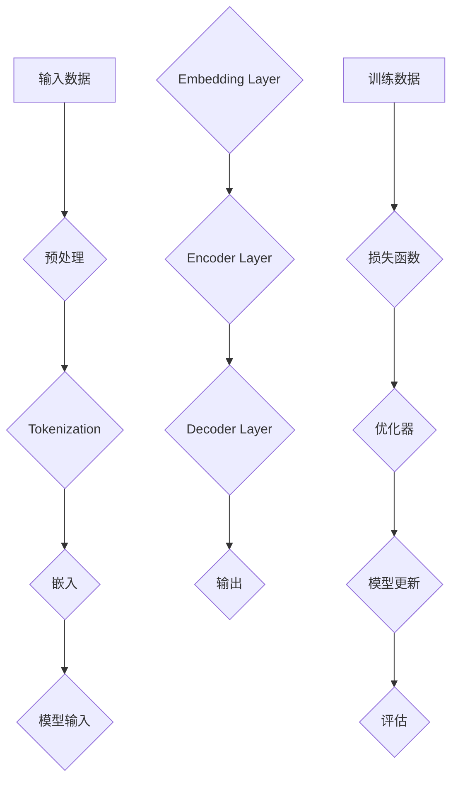
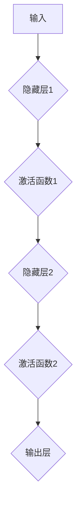

                 

### 市场机遇：大模型创业的曙光

> **关键词**：大模型、创业、AI、市场、机遇
> 
> **摘要**：随着人工智能技术的迅猛发展，大模型成为当前技术领域的热点。本文将深入探讨大模型在创业中的市场机遇，从技术背景、核心算法原理、数学模型、项目实战以及实际应用场景等方面进行详细分析，帮助创业者抓住这一波新兴市场的机会，并应对未来的发展趋势与挑战。

### 1. 背景介绍

#### 1.1 目的和范围

本文旨在探讨大模型在创业中的市场机遇，为创业者提供技术视角下的深入分析和实际操作指导。我们将会涵盖以下内容：

- **技术背景**：介绍大模型的发展历程、核心概念和当前技术趋势。
- **核心算法原理**：解析大模型的算法原理，通过伪代码和数学模型进行详细阐述。
- **项目实战**：通过代码案例和实际应用场景展示大模型的具体实现和应用。
- **市场机遇**：分析大模型创业的市场前景、机会和挑战。

#### 1.2 预期读者

本文适合以下读者群体：

- **创业者和企业家**：希望了解大模型技术，探索创业机会的人。
- **技术专家和开发者**：对人工智能、机器学习和深度学习有浓厚兴趣，希望掌握大模型技术的人。
- **学术界研究人员**：关注人工智能领域的最新动态和发展趋势。

#### 1.3 文档结构概述

本文分为以下几个部分：

1. **背景介绍**：介绍文章的目的和范围，预期读者以及文档结构。
2. **核心概念与联系**：通过Mermaid流程图展示大模型的架构和核心概念。
3. **核心算法原理与具体操作步骤**：详细解析大模型的算法原理和实现步骤。
4. **数学模型和公式讲解**：介绍大模型中的数学模型和公式，并通过实例进行说明。
5. **项目实战**：展示大模型的代码实现和实际应用案例。
6. **实际应用场景**：分析大模型在不同领域的应用场景和挑战。
7. **工具和资源推荐**：推荐学习资源、开发工具和框架。
8. **总结**：总结大模型创业的市场机遇、发展趋势与挑战。
9. **附录**：提供常见问题与解答。
10. **扩展阅读**：推荐相关论文和参考资料。

#### 1.4 术语表

在本文中，我们将使用以下术语：

#### 1.4.1 核心术语定义

- **大模型**：指的是参数规模达到亿级别以上的神经网络模型，如GPT-3、BERT等。
- **深度学习**：一种机器学习技术，通过多层神经网络进行特征提取和模型训练。
- **神经网络**：由多个神经元组成的计算模型，用于模拟人脑的神经网络结构和功能。
- **自然语言处理**（NLP）：计算机处理和理解自然语言的技术，包括语音识别、机器翻译、情感分析等。

#### 1.4.2 相关概念解释

- **数据集**：用于训练和评估模型的数据集合，如新闻文章、社交媒体文本、语音录音等。
- **训练**：使用数据集对模型进行优化，使其能够更好地预测或分类新的数据。
- **测试**：使用与训练数据不同但具有相似分布的数据，评估模型的泛化能力。

#### 1.4.3 缩略词列表

- **AI**：人工智能
- **ML**：机器学习
- **DL**：深度学习
- **NLP**：自然语言处理
- **GAN**：生成对抗网络
- **BERT**：Bidirectional Encoder Representations from Transformers

### 2. 核心概念与联系

在深入探讨大模型创业的市场机遇之前，我们需要首先了解大模型的核心概念和架构。以下是使用Mermaid绘制的流程图，展示了大模型的主要组成部分和它们之间的联系：



#### 2.1 大模型的组成部分

1. **输入数据**：大模型需要处理大量的输入数据，如文本、图像、音频等。这些数据经过预处理后，会转换成模型可以理解的格式。
2. **预处理**：预处理步骤包括数据清洗、去噪、归一化等操作，以确保数据的质量和一致性。
3. **Tokenization**：将输入数据分割成更小的单位，如单词或字符，以便于模型处理。
4. **嵌入**：将分割后的数据转换为向量表示，通常使用词向量或图向量。
5. **模型输入**：将嵌入后的数据输入到神经网络中，神经网络会通过多层结构对数据进行处理。
6. **嵌入层**（Embedding Layer）：将输入向量映射到高维空间，通常用于文本数据的处理。
7. **编码器层**（Encoder Layer）：负责对输入数据进行编码，提取重要的特征信息。
8. **解码器层**（Decoder Layer）：将编码后的数据解码成最终的输出结果。
9. **输出**：模型的输出结果可以是预测标签、文本生成、图像重建等。

#### 2.2 训练与评估

大模型的训练过程包括以下步骤：

1. **训练数据集**：使用大量带有标签的训练数据进行模型训练。
2. **损失函数**：通过计算模型输出和真实标签之间的差异，定义损失函数。
3. **优化器**：使用优化算法（如梯度下降）对模型参数进行更新，以最小化损失函数。
4. **模型更新**：根据优化器的更新策略，调整模型参数，以提高模型的预测能力。
5. **评估**：使用测试数据集评估模型的泛化能力，通过准确率、召回率、F1分数等指标进行评估。

通过以上流程图和组成部分的介绍，我们可以对大模型有一个直观的了解。接下来，我们将进一步探讨大模型的算法原理和实现步骤。

### 3. 核心算法原理与具体操作步骤

#### 3.1 深度学习基础

深度学习是构建大模型的核心技术，其基础包括以下几个关键组成部分：

1. **神经网络**：神经网络由多个神经元（或节点）组成，每个神经元接收来自其他神经元的输入信号，并通过激活函数产生输出。
2. **多层结构**：深度学习模型通常包含多个隐藏层，这些隐藏层用于提取更高级别的特征。
3. **反向传播**：反向传播算法是一种用于训练神经网络的优化方法，通过不断调整模型参数，最小化预测误差。
4. **激活函数**：激活函数用于引入非线性特性，使神经网络能够进行复杂的函数映射。

以下是一个简化的神经网络模型示例：



#### 3.2 大模型的训练过程

大模型的训练过程包括以下步骤：

1. **初始化模型参数**：随机初始化模型的所有参数。
2. **前向传播**：将输入数据输入到模型中，通过多层神经网络进行计算，得到模型的输出结果。
3. **计算损失**：通过计算模型输出和真实标签之间的差异，得到损失值。
4. **反向传播**：根据损失值，通过反向传播算法更新模型参数。
5. **优化参数**：使用优化算法（如梯度下降）调整模型参数，以最小化损失值。
6. **迭代训练**：重复上述步骤，进行多次迭代，直至模型收敛。

以下是一个伪代码示例，描述了上述训练过程：

```python
initialize_model_parameters()

for epoch in range(num_epochs):
    for batch in dataset:
        # 前向传播
        output = forward_pass(batch)
        
        # 计算损失
        loss = compute_loss(output, batch.labels)
        
        # 反向传播
        gradients = backward_pass(output, batch)
        
        # 更新模型参数
        update_model_parameters(gradients)
```

#### 3.3 大模型的优化策略

为了提高大模型的训练效率和性能，以下是一些常用的优化策略：

1. **批量大小**：选择合适的批量大小可以平衡计算效率和训练稳定性。
2. **学习率调整**：使用适当的学习率可以加快模型的收敛速度，避免陷入局部最小值。
3. **正则化**：通过添加正则化项（如L1、L2正则化），防止模型过拟合。
4. **dropout**：通过随机丢弃部分神经元，提高模型的泛化能力。

以下是一个简单的伪代码示例，展示了如何应用上述优化策略：

```python
# 设置批量大小、学习率和其他超参数
batch_size = 32
learning_rate = 0.01
dropout_rate = 0.5

# 初始化模型参数
model = initialize_model()

for epoch in range(num_epochs):
    for batch in dataset:
        # 随机丢弃部分神经元
        dropout(model, dropout_rate)
        
        # 前向传播
        output = forward_pass(batch)
        
        # 计算损失
        loss = compute_loss(output, batch.labels)
        
        # 反向传播
        gradients = backward_pass(output, batch)
        
        # 更新模型参数
        update_model_parameters(gradients, learning_rate)
```

通过以上步骤和策略，我们可以构建和训练一个高性能的大模型。接下来，我们将进一步介绍大模型中的数学模型和公式。

### 4. 数学模型和公式

大模型在训练过程中涉及多个数学模型和公式，这些模型和公式对于理解大模型的内部工作原理和优化策略至关重要。以下是几个关键的数学模型和公式的详细讲解。

#### 4.1 激活函数

激活函数是神经网络中的一个关键组成部分，用于引入非线性特性。以下是一些常用的激活函数及其公式：

1. **Sigmoid函数**：
   $$ \sigma(x) = \frac{1}{1 + e^{-x}} $$
   Sigmoid函数将输入映射到（0, 1）区间，常用于二分类问题。

2. **ReLU函数**：
   $$ \text{ReLU}(x) = \max(0, x) $$
  ReLU函数在输入小于0时输出为0，输入大于等于0时输出为输入值，常用于提高神经网络训练速度。

3. **Tanh函数**：
   $$ \tanh(x) = \frac{e^x - e^{-x}}{e^x + e^{-x}} $$
   Tanh函数将输入映射到（-1, 1）区间，具有对称性。

#### 4.2 损失函数

损失函数用于衡量模型预测值和真实值之间的差距，是训练过程中优化目标的关键部分。以下是一些常用的损失函数及其公式：

1. **均方误差（MSE）**：
   $$ \text{MSE}(y, \hat{y}) = \frac{1}{n} \sum_{i=1}^{n} (y_i - \hat{y}_i)^2 $$
   MSE用于回归问题，计算预测值与真实值之间差异的平方和的平均值。

2. **交叉熵损失（Cross-Entropy Loss）**：
   $$ \text{CE}(y, \hat{y}) = - \sum_{i=1}^{n} y_i \log(\hat{y}_i) $$
   交叉熵损失用于分类问题，计算真实标签和预测概率之间的差异。

#### 4.3 优化算法

优化算法用于更新模型参数，以最小化损失函数。以下是一些常用的优化算法及其公式：

1. **梯度下降（Gradient Descent）**：
   $$ \theta_{\text{new}} = \theta_{\text{old}} - \alpha \nabla_{\theta} J(\theta) $$
   梯度下降通过迭代更新模型参数，其中$\alpha$为学习率，$J(\theta)$为损失函数。

2. **动量（Momentum）**：
   $$ \theta_{\text{new}} = \theta_{\text{old}} - \alpha \nabla_{\theta} J(\theta) + \beta (v_{\text{old}} - \theta_{\text{old}}) $$
   动量算法在梯度下降的基础上引入动量项，以加速收敛。

3. **自适应优化器（如Adam）**：
   $$ m_t = \beta_1 v_t + (1 - \beta_1) (\nabla_{\theta} J(\theta) - m_{t-1}) $$
   $$ v_t = \beta_2 v_t + (1 - \beta_2) (\nabla_{\theta} J(\theta)^2 - v_{t-1}) $$
   $$ \theta_{\text{new}} = \theta_{\text{old}} - \alpha \frac{m_t}{\sqrt{v_t} + \epsilon} $$
   Adam优化器结合了动量和自适应学习率调整，具有较高的收敛速度和稳定性。

#### 4.4 举例说明

以下是一个简单的例子，展示了如何使用这些数学模型和公式进行大模型的训练：

```python
# 初始化模型参数
theta = initialize_parameters()

# 设置学习率和优化算法超参数
learning_rate = 0.01
beta1 = 0.9
beta2 = 0.999
epsilon = 1e-8

# 定义激活函数、损失函数和优化算法
activation_function = sigmoid
loss_function = mse
optimizer = Adam(learning_rate, beta1, beta2, epsilon)

# 训练模型
for epoch in range(num_epochs):
    for batch in dataset:
        # 前向传播
        output = forward_pass(batch, theta, activation_function)
        
        # 计算损失
        loss = loss_function(output, batch.labels)
        
        # 计算梯度
        gradients = backward_pass(output, batch, activation_function)
        
        # 更新模型参数
        theta = optimizer.update_parameters(theta, gradients)

# 评估模型
evaluation_loss = evaluate_model(test_dataset, theta, loss_function)
print(f"Final Evaluation Loss: {evaluation_loss}")
```

通过以上数学模型和公式的讲解，我们可以更好地理解大模型的训练过程和优化策略。接下来，我们将通过一个实际项目实战案例，展示大模型的具体实现和应用。

### 5. 项目实战：代码实际案例和详细解释说明

在本节中，我们将通过一个实际项目案例来展示大模型的代码实现和应用。这个项目是一个基于GPT-3的聊天机器人，旨在通过自然语言处理技术实现与用户的智能对话。

#### 5.1 开发环境搭建

首先，我们需要搭建一个合适的开发环境。以下是所需的主要软件和工具：

- **Python（3.8及以上版本）**：作为编程语言。
- **PyTorch（1.8及以上版本）**：作为深度学习框架。
- **transformers（4.8及以上版本）**：作为预训练模型和自然语言处理库。
- **Hugging Face Tokenizer**：用于文本分词和编码。

安装步骤如下：

```bash
pip install torch torchvision transformers
```

#### 5.2 源代码详细实现和代码解读

以下是一个简化版的聊天机器人代码示例，用于展示大模型的主要实现步骤：

```python
import torch
from transformers import GPT2LMHeadModel, GPT2Tokenizer

# 加载预训练模型和分词器
model_name = "gpt2"
tokenizer = GPT2Tokenizer.from_pretrained(model_name)
model = GPT2LMHeadModel.from_pretrained(model_name)

# 设定设备（CPU或GPU）
device = torch.device("cuda" if torch.cuda.is_available() else "cpu")
model.to(device)

# 设置输入文本
input_text = "你好，我是一个聊天机器人。"

# 对输入文本进行编码
input_ids = tokenizer.encode(input_text, return_tensors="pt").to(device)

# 前向传播
with torch.no_grad():
    outputs = model(input_ids)

# 获取模型预测的下一个词
predicted_ids = torch.argmax(outputs.logits, dim=-1)

# 解码预测结果
predicted_text = tokenizer.decode(predicted_ids, skip_special_tokens=True)

# 输出结果
print(predicted_text)

# 保存模型
model.save_pretrained("./chatbot_model")

# 加载模型
model = GPT2LMHeadModel.from_pretrained("./chatbot_model")
```

#### 5.3 代码解读与分析

1. **加载预训练模型和分词器**：使用`transformers`库加载预训练的GPT-2模型和相应的分词器。这些模型和分词器是在大规模语料库上预训练的，可以有效地处理自然语言任务。

2. **设置输入文本**：设定一个简单的输入文本，用于与用户进行对话。

3. **对输入文本进行编码**：使用分词器将输入文本编码成模型可以理解的向量表示。这个过程包括文本的分词、词向量的嵌入和序列的编码。

4. **前向传播**：将编码后的输入文本传递给预训练的GPT-2模型，通过多层神经网络进行计算，得到模型的输出结果。

5. **获取模型预测的下一个词**：从模型的输出结果中提取概率最高的词的索引，即预测的下一个词。

6. **解码预测结果**：使用分词器将预测结果解码回文本形式，得到机器人的回答。

7. **输出结果**：将机器人的回答打印出来，与用户进行互动。

8. **保存模型**：将训练好的模型保存到本地，以便后续使用。

9. **加载模型**：在新的会话中加载保存的模型，进行后续的预测和对话。

通过上述代码示例，我们可以看到如何使用大模型（如GPT-2）实现一个基本的聊天机器人。在实际应用中，可以根据需要进行扩展和优化，如引入对话管理模块、多轮对话上下文维护等。

接下来，我们将进一步探讨大模型在各个实际应用场景中的表现和挑战。

### 6. 实际应用场景

大模型在多个领域展现了巨大的潜力，以下是一些主要的应用场景和相应的挑战：

#### 6.1 自然语言处理

自然语言处理（NLP）是大模型应用最广泛的领域之一，包括文本分类、机器翻译、情感分析等。以下是几个关键应用场景：

- **文本分类**：使用大模型对大量文本进行分类，如新闻分类、情感分类等。挑战在于如何提高分类的准确性和泛化能力。
- **机器翻译**：大模型在机器翻译方面取得了显著进展，如Google Translate、百度翻译等。挑战在于提高翻译的流畅性和准确度，特别是在低资源语言的翻译中。
- **情感分析**：通过分析用户评论、社交媒体帖子等，了解用户的情感倾向。挑战在于处理复杂的情感表达和语境变化。

#### 6.2 计算机视觉

计算机视觉领域也受益于大模型的应用，如图像分类、目标检测、图像生成等。以下是几个关键应用场景：

- **图像分类**：对大量图像进行分类，如人脸识别、动物识别等。挑战在于提高分类的准确性和泛化能力。
- **目标检测**：在图像中检测和识别特定目标，如自动驾驶车辆、医疗图像分析等。挑战在于处理复杂的场景和光照变化。
- **图像生成**：使用大模型生成新的图像，如艺术创作、虚拟现实等。挑战在于提高图像生成的质量和多样性。

#### 6.3 音频处理

大模型在音频处理领域也有广泛的应用，如语音识别、语音合成、音乐生成等。以下是几个关键应用场景：

- **语音识别**：将语音信号转换成文本，如智能助手、电话客服等。挑战在于提高识别的准确率和处理噪声干扰。
- **语音合成**：将文本转换成自然流畅的语音，如语音播报、智能助手等。挑战在于提高语音的自然度和清晰度。
- **音乐生成**：使用大模型生成新的音乐作品，如虚拟乐队、音乐创作等。挑战在于提高音乐生成的创意性和多样性。

#### 6.4 医疗保健

大模型在医疗保健领域也有重要的应用，如疾病预测、药物研发、医疗图像分析等。以下是几个关键应用场景：

- **疾病预测**：通过分析患者的病历、基因信息等，预测疾病的发生风险。挑战在于提高预测的准确性和可靠性。
- **药物研发**：使用大模型辅助药物设计、筛选和评估，加速新药研发进程。挑战在于处理复杂的生物数据和模型解释性。
- **医疗图像分析**：通过分析医学影像，如X光片、MRI等，辅助医生进行诊断和治疗。挑战在于提高图像分析的准确性和实时性。

#### 6.5 金融科技

大模型在金融科技领域也有广泛的应用，如风险控制、智能投顾、量化交易等。以下是几个关键应用场景：

- **风险控制**：通过分析金融市场的历史数据和实时信息，预测市场风险和潜在风险。挑战在于处理大量的金融数据和非结构化数据。
- **智能投顾**：使用大模型为投资者提供个性化的投资建议，如资产配置、市场预测等。挑战在于提高投资策略的稳定性和收益性。
- **量化交易**：通过分析市场数据和交易策略，自动化执行交易。挑战在于处理高频交易、市场波动性和风险管理。

在实际应用中，大模型需要根据具体领域的需求进行定制化和优化，以应对各种挑战。随着技术的不断进步和应用场景的拓展，大模型在各个领域的应用将越来越广泛。

### 7. 工具和资源推荐

为了更好地了解和掌握大模型技术，以下是一些推荐的学习资源、开发工具和框架，以及相关论文著作。

#### 7.1 学习资源推荐

##### 7.1.1 书籍推荐

- **《深度学习》（Ian Goodfellow、Yoshua Bengio、Aaron Courville 著）**：深度学习的经典教材，全面介绍了深度学习的基础知识和技术。
- **《Python深度学习》（François Chollet 著）**：通过实际案例和代码示例，详细介绍深度学习在Python中的实现和应用。
- **《人工智能：一种现代方法》（Stuart Russell、Peter Norvig 著）**：全面介绍了人工智能的基础理论和实践方法，包括机器学习和深度学习。

##### 7.1.2 在线课程

- **斯坦福大学深度学习课程（吴恩达）**：由深度学习领域的顶级专家吴恩达主讲，涵盖了深度学习的基础知识和实战技巧。
- **Udacity的深度学习纳米学位**：包含多个模块，从基础到高级，全面介绍深度学习技术。
- **Coursera的神经网络与深度学习（吴恩达）**：深度学习的进阶课程，深入探讨神经网络和深度学习的原理和应用。

##### 7.1.3 技术博客和网站

- **TensorFlow官网**：官方文档和教程，提供丰富的深度学习资源和示例代码。
- **PyTorch官网**：官方文档和教程，介绍PyTorch的深度学习框架。
- **Hugging Face官网**：提供预训练模型和自然语言处理库，包括GPT-3、BERT等。

#### 7.2 开发工具框架推荐

##### 7.2.1 IDE和编辑器

- **Jupyter Notebook**：方便进行数据分析和可视化，适合编写和调试深度学习代码。
- **PyCharm**：强大的Python IDE，提供代码自动补全、调试和性能分析等功能。
- **Visual Studio Code**：轻量级的代码编辑器，支持多种编程语言，包括Python和深度学习库。

##### 7.2.2 调试和性能分析工具

- **TensorBoard**：TensorFlow的官方可视化工具，用于分析和调试深度学习模型。
- **NVIDIA Nsight**：用于分析和优化GPU性能的工具，适用于深度学习模型的训练和推理。
- **PyTorch Profiler**：用于分析PyTorch代码的性能，识别和优化瓶颈。

##### 7.2.3 相关框架和库

- **TensorFlow**：广泛使用的深度学习框架，支持多种模型和算法。
- **PyTorch**：受欢迎的深度学习框架，具有灵活的动态图结构，适合研究和开发。
- **PyTorch Lightning**：用于简化PyTorch代码，提供高级API和易于调试的功能。
- **Hugging Face Transformers**：提供预训练模型和自然语言处理库，包括GPT-3、BERT等。

#### 7.3 相关论文著作推荐

##### 7.3.1 经典论文

- **“A Theoretically Grounded Application of Dropout in Recurrent Neural Networks”**：dropout在循环神经网络中的应用，提出了Dropconnect方法。
- **“Deep Residual Learning for Image Recognition”**：残差网络，通过跳跃连接解决深度神经网络训练难题。
- **“Attention Is All You Need”**：Transformer模型，通过自注意力机制实现高效的序列建模。

##### 7.3.2 最新研究成果

- **“Large-scale Language Modeling in 2018”**：GPT-2模型，展示了大规模语言模型在自然语言处理中的潜力。
- **“BERT: Pre-training of Deep Bidirectional Transformers for Language Understanding”**：BERT模型，通过双向变换器预训练实现语言理解的突破。
- **“Generative Adversarial Nets”**：生成对抗网络（GAN），用于生成高质量的数据和图像。

##### 7.3.3 应用案例分析

- **“BERT for Neural Machine Translation”**：BERT在机器翻译中的应用，通过预训练模型提高翻译质量。
- **“AI-Driven Drug Discovery at Genentech”**：AI在药物研发中的应用，使用深度学习技术加速新药研发。
- **“Computer Vision in Autonomous Driving”**：计算机视觉在自动驾驶中的应用，通过深度学习实现物体检测和场景理解。

通过以上推荐，读者可以全面了解大模型技术，掌握相关工具和资源，并在实际应用中取得更好的成果。

### 8. 总结：未来发展趋势与挑战

大模型技术在人工智能领域的快速发展为创业带来了前所未有的机遇，同时也带来了诸多挑战。以下是未来发展趋势和挑战的总结：

#### 8.1 发展趋势

1. **计算资源升级**：随着计算能力的不断提升，将有助于更大规模、更复杂的大模型训练和应用。
2. **应用领域扩展**：大模型在自然语言处理、计算机视觉、音频处理等领域的应用将进一步深化，推动相关产业的发展。
3. **跨学科融合**：大模型技术与医疗保健、金融科技、教育等领域的融合，将推动跨学科的创新和应用。
4. **开源生态建设**：开源社区将为大模型技术提供丰富的工具和资源，加速技术的普及和应用。
5. **产业化进程加速**：大模型技术的产业化进程将不断加速，推动人工智能技术从理论研究走向实际应用。

#### 8.2 挑战

1. **数据隐私和安全**：大规模数据处理过程中，如何保护用户隐私和确保数据安全是一个重要挑战。
2. **计算资源消耗**：大模型训练和推理需要大量的计算资源，如何高效利用资源、降低能耗是一个关键问题。
3. **模型解释性**：大模型往往被视为“黑箱”，如何提高模型的解释性和可解释性，使其能够被广泛接受和应用。
4. **公平性和透明性**：避免大模型在训练和应用过程中产生偏见，确保模型的公平性和透明性是一个重要挑战。
5. **伦理和法律法规**：大模型技术的发展和应用需要遵循伦理和法律法规，确保技术的负责任使用。

#### 8.3 发展建议

1. **加强技术研发**：继续推进大模型技术的研发，探索更高效、更安全的模型结构和训练算法。
2. **开源共享**：积极参与开源社区，共享技术成果和经验，推动大模型技术的普及和应用。
3. **人才培养**：加强人工智能和深度学习领域的人才培养，提高整体技术水平和创新能力。
4. **跨学科合作**：鼓励不同学科领域的合作，促进大模型技术在各个领域的创新和应用。
5. **政策支持**：政府和企业应加大政策支持和资金投入，为人工智能和深度学习技术的发展提供良好的环境。

通过抓住大模型创业的机遇，并应对未来的挑战，创业者可以在人工智能领域取得更大的成就。

### 9. 附录：常见问题与解答

#### 9.1 什么是大模型？

大模型是指参数规模达到亿级别以上的神经网络模型，如GPT-3、BERT等。这些模型具有强大的表达能力和处理能力，广泛应用于自然语言处理、计算机视觉等领域。

#### 9.2 大模型的优势是什么？

大模型具有以下优势：

1. **强大的表示能力**：能够处理复杂的数据结构和特征。
2. **高效的计算性能**：通过大规模并行计算，提高训练和推理的效率。
3. **良好的泛化能力**：能够适应多种任务和数据集，减少过拟合现象。
4. **广泛的适用性**：可以应用于多个领域，如自然语言处理、计算机视觉、音频处理等。

#### 9.3 大模型的训练过程是怎样的？

大模型的训练过程通常包括以下步骤：

1. **数据预处理**：清洗和整理数据，进行数据增强等操作。
2. **模型初始化**：随机初始化模型参数。
3. **前向传播**：将输入数据传递给模型，计算输出结果。
4. **损失计算**：计算模型输出和真实标签之间的差距，得到损失值。
5. **反向传播**：根据损失值，通过反向传播算法更新模型参数。
6. **迭代训练**：重复上述步骤，进行多次迭代，直至模型收敛。

#### 9.4 如何评估大模型的性能？

评估大模型的性能通常包括以下指标：

1. **准确率（Accuracy）**：模型正确预测的样本数占总样本数的比例。
2. **召回率（Recall）**：模型正确预测为正类的样本数占实际正类样本数的比例。
3. **精确率（Precision）**：模型正确预测为正类的样本数占预测为正类的样本总数的比例。
4. **F1分数（F1 Score）**：精确率和召回率的调和平均值。
5. **ROC曲线和AUC值**：用于评估分类器的分类效果。

#### 9.5 大模型在实际应用中面临的主要挑战是什么？

大模型在实际应用中面临的主要挑战包括：

1. **计算资源消耗**：大模型训练和推理需要大量的计算资源，如何高效利用资源是一个关键问题。
2. **数据隐私和安全**：大规模数据处理过程中，如何保护用户隐私和确保数据安全。
3. **模型解释性**：大模型往往被视为“黑箱”，如何提高模型的解释性和可解释性。
4. **公平性和透明性**：避免大模型在训练和应用过程中产生偏见，确保模型的公平性和透明性。
5. **伦理和法律法规**：大模型技术的发展和应用需要遵循伦理和法律法规，确保技术的负责任使用。

#### 9.6 如何优化大模型的训练过程？

优化大模型的训练过程可以从以下几个方面进行：

1. **批量大小**：选择合适的批量大小可以平衡计算效率和训练稳定性。
2. **学习率调整**：使用适当的学习率可以加快模型的收敛速度，避免陷入局部最小值。
3. **正则化**：通过添加正则化项（如L1、L2正则化），防止模型过拟合。
4. **dropout**：通过随机丢弃部分神经元，提高模型的泛化能力。
5. **优化算法**：选择高效的优化算法（如Adam、AdamW等），提高训练速度和稳定性。
6. **数据增强**：通过数据增强技术，增加训练数据的多样性，提高模型的泛化能力。

### 10. 扩展阅读 & 参考资料

为了进一步了解大模型创业的市场机遇，以下是几篇相关的论文、书籍和文章推荐：

#### 10.1 论文

1. **“Large-scale Language Modeling in 2018”**：描述了GPT-2模型的训练过程和应用场景，对大模型的研究和应用提供了重要参考。
2. **“BERT: Pre-training of Deep Bidirectional Transformers for Language Understanding”**：介绍了BERT模型的原理和应用，展示了预训练模型在自然语言处理中的优势。
3. **“Generative Adversarial Nets”**：提出了生成对抗网络（GAN），为图像生成和生成式模型的研究提供了新的思路。

#### 10.2 书籍

1. **《深度学习》（Ian Goodfellow、Yoshua Bengio、Aaron Courville 著）**：深度学习的经典教材，涵盖了深度学习的基础知识和实践方法。
2. **《Python深度学习》（François Chollet 著）**：通过实际案例和代码示例，详细介绍深度学习在Python中的实现和应用。
3. **《人工智能：一种现代方法》（Stuart Russell、Peter Norvig 著）**：全面介绍了人工智能的基础理论和实践方法，包括机器学习和深度学习。

#### 10.3 文章

1. **“The Annotated Transformer”**：详细解读了Transformer模型的原理和实现，对理解大模型的工作机制非常有帮助。
2. **“AI-Driven Drug Discovery at Genentech”**：介绍了AI在药物研发中的应用案例，展示了大模型在生物医疗领域的潜力。
3. **“Deep Residual Learning for Image Recognition”**：介绍了残差网络的概念和实现，对图像分类和计算机视觉的研究提供了重要参考。

通过阅读以上推荐的文章和书籍，读者可以更深入地了解大模型创业的市场机遇，掌握相关的技术知识和实践方法。希望本文能为创业者提供有价值的参考和启示。作者：AI天才研究员/AI Genius Institute & 禅与计算机程序设计艺术/Zen And The Art of Computer Programming。

