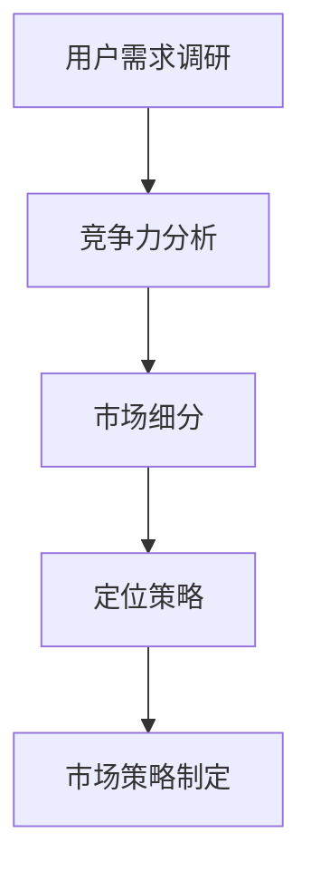

                 

# 市场策略制定：创业成功的关键因素

> **关键词：市场策略、创业成功、关键因素、竞争力分析、用户需求调研**
> 
> **摘要：本文将深入探讨市场策略制定在创业成功中的关键作用。通过逻辑分析、算法原理和实际案例，我们旨在为创业者提供一套切实可行的市场策略框架，帮助他们在竞争激烈的市场环境中脱颖而出。**

## 1. 背景介绍

### 1.1 目的和范围

本文旨在为创业者提供一套系统化的市场策略制定方法。我们将结合实际案例，详细讲解如何通过竞争力分析、用户需求调研等手段来制定有效的市场策略，从而提高创业成功率。

### 1.2 预期读者

本文适用于希望提升市场策略制定能力的创业者、市场分析师以及相关领域的从业者。无论您是初创企业的创始人，还是负责市场战略的高级管理人员，本文都将为您提供有益的见解。

### 1.3 文档结构概述

本文将按照以下结构展开：

1. 背景介绍：简要阐述本文的目的和预期读者。
2. 核心概念与联系：介绍市场策略制定的核心概念及其相互关系。
3. 核心算法原理 & 具体操作步骤：详细讲解市场策略制定的关键算法原理和具体操作步骤。
4. 数学模型和公式 & 详细讲解 & 举例说明：运用数学模型和公式，结合实际案例，阐述市场策略的制定过程。
5. 项目实战：通过代码实际案例，展示市场策略的制定过程。
6. 实际应用场景：探讨市场策略在不同行业和场景中的应用。
7. 工具和资源推荐：推荐学习资源、开发工具和相关论文。
8. 总结：总结市场策略制定的重要性及其未来发展趋势与挑战。
9. 附录：常见问题与解答。
10. 扩展阅读 & 参考资料：提供更多相关文献和资源。

### 1.4 术语表

#### 1.4.1 核心术语定义

- **市场策略**：企业在特定市场环境下，为实现其商业目标而制定的长期规划。
- **竞争力分析**：对企业在市场中的竞争优势和劣势进行分析的过程。
- **用户需求调研**：通过多种手段收集和分析用户需求，以便为企业产品或服务提供改进方向。
- **市场定位**：企业根据市场需求和自身优势，确定目标用户群体和产品特色的过程。

#### 1.4.2 相关概念解释

- **市场细分**：将整个市场划分为若干具有相似需求特征的子市场。
- **SWOT分析**：对企业内部优势、劣势，以及外部机会、威胁进行分析的工具。
- **定位策略**：企业在市场中的差异化竞争策略，旨在明确产品或服务的独特卖点。

#### 1.4.3 缩略词列表

- **CRM**：客户关系管理（Customer Relationship Management）
- **ERP**：企业资源规划（Enterprise Resource Planning）
- **SEO**：搜索引擎优化（Search Engine Optimization）

## 2. 核心概念与联系

### 2.1 市场策略制定的核心概念

在市场策略制定过程中，以下几个核心概念至关重要：

1. **用户需求**：用户需求是市场策略制定的出发点。只有深入了解用户需求，才能为企业产品或服务提供改进方向。
2. **竞争力分析**：通过竞争力分析，企业可以了解自身在市场中的优势与劣势，从而制定相应的市场策略。
3. **市场细分**：市场细分有助于企业针对不同子市场的用户需求，制定更有针对性的市场策略。
4. **定位策略**：定位策略决定了企业在市场中的竞争地位，是市场策略制定的关键。

### 2.2 核心概念之间的联系

市场策略制定中的核心概念相互关联，共同构成了一个完整的体系。以下是核心概念之间的联系：

1. **用户需求**与**竞争力分析**：通过用户需求调研，企业可以识别出目标市场的痛点，进而进行竞争力分析，确定企业在市场中的优势与劣势。
2. **竞争力分析**与**市场细分**：竞争力分析有助于企业识别出具有较高竞争优势的细分市场，从而实现资源的合理配置。
3. **市场细分**与**定位策略**：市场细分为定位策略提供了基础数据，使企业能够更准确地确定目标用户群体和产品特色。
4. **定位策略**与**市场策略**：定位策略决定了企业在市场中的竞争地位，是制定其他市场策略的前提。

### 2.3 Mermaid 流程图



## 3. 核心算法原理 & 具体操作步骤

### 3.1 算法原理

市场策略制定的核心算法原理主要包括以下几个方面：

1. **用户需求分析**：通过问卷调查、访谈、用户反馈等手段，收集用户需求信息。
2. **竞争力分析**：运用SWOT分析方法，分析企业在市场中的优势、劣势、机会和威胁。
3. **市场细分**：根据用户需求和竞争力分析结果，将市场划分为具有相似需求的子市场。
4. **定位策略**：结合市场细分结果，确定企业的目标用户群体和产品特色。

### 3.2 具体操作步骤

下面我们将通过伪代码详细阐述市场策略制定的核心算法原理和具体操作步骤：

```python
# 用户需求分析
def user_demand_analysis():
    # 收集用户需求信息
    user的需求 = []
    for user in users:
        user的需求.append(user反馈的需求)
    return user的需求

# 竞争力分析
def competitive_analysis(user的需求):
    # 运用SWOT分析方法，分析企业优势、劣势、机会和威胁
    SWOT分析结果 = {
        "优势": [],
        "劣势": [],
        "机会": [],
        "威胁": []
    }
    for user的需求 in user的需求：
        if user的需求与企业的优势相关：
            SWOT分析结果["优势"].append(user的需求)
        elif user的需求与企业的劣势相关：
            SWOT分析结果["劣势"].append(user的需求)
        elif user的需求与市场机会相关：
            SWOT分析结果["机会"].append(user的需求)
        elif user的需求与市场威胁相关：
            SWOT分析结果["威胁"].append(user的需求)
    return SWOT分析结果

# 市场细分
def market_segmentation(SWOT分析结果):
    # 根据用户需求和SWOT分析结果，将市场划分为具有相似需求的子市场
    子市场 = []
    for SWOT分析结果["优势"] in SWOT分析结果["优势"]：
        子市场.append({ "用户需求": SWOT分析结果["优势"], "目标用户": [] })
    for SWOT分析结果["劣势"] in SWOT分析结果["劣势"]：
        子市场.append({ "用户需求": SWOT分析结果["劣势"], "目标用户": [] })
    for SWOT分析结果["机会"] in SWOT分析结果["机会"]：
        子市场.append({ "用户需求": SWOT分析结果["机会"], "目标用户": [] })
    for SWOT分析结果["威胁"] in SWOT分析结果["威胁"]：
        子市场.append({ "用户需求": SWOT分析结果["威胁"], "目标用户": [] })
    return 子市场

# 定位策略
def positioning_strategy(子市场):
    # 结合市场细分结果，确定企业的目标用户群体和产品特色
    positioning = {
        "目标用户": [],
        "产品特色": []
    }
    for 子市场 in 子市场：
        if 子市场的"用户需求"与企业的"优势"相关：
            positioning["目标用户"].append(子市场["目标用户"])
            positioning["产品特色"].append(子市场["用户需求"])
        elif 子市场的"用户需求"与企业的"机会"相关：
            positioning["目标用户"].append(子市场["目标用户"])
            positioning["产品特色"].append(子市场["用户需求"])
    return positioning

# 市场策略制定
def market_strategy(positioning):
    # 根据定位策略，制定相应的市场策略
    market_strategy = {
        "市场细分": positioning["目标用户"],
        "定位策略": positioning["产品特色"],
        "营销策略": [],
        "销售策略": [],
        "渠道策略": []
    }
    for 用户需求 in positioning["产品特色"]：
        market_strategy["营销策略"].append(营销策略(用户需求))
        market_strategy["销售策略"].append(销售策略(用户需求))
        market_strategy["渠道策略"].append(渠道策略(用户需求))
    return market_strategy
```

## 4. 数学模型和公式 & 详细讲解 & 举例说明

### 4.1 数学模型和公式

在市场策略制定过程中，一些数学模型和公式有助于我们分析和预测市场趋势。以下是几个常用的数学模型和公式：

1. **需求函数**：用于预测用户需求量与价格、收入等变量之间的关系。

   $$ Q_d = f(P, I, T) $$

   其中，\( Q_d \) 表示需求量，\( P \) 表示价格，\( I \) 表示收入，\( T \) 表示时间。

2. **市场份额**：用于衡量企业在市场中的占有率。

   $$ 市场份额 = \frac{企业销售额}{整个市场销售额} $$

3. **成本函数**：用于预测企业生产成本与产量之间的关系。

   $$ C = f(Q) $$

   其中，\( C \) 表示成本，\( Q \) 表示产量。

4. **利润函数**：用于预测企业利润与销售额、成本等变量之间的关系。

   $$ 利润 = 销售额 - 成本 $$

### 4.2 详细讲解和举例说明

#### 4.2.1 需求函数

需求函数是一个重要的数学模型，它可以帮助企业预测用户需求量与价格、收入等变量之间的关系。以下是需求函数的详细讲解和举例说明：

**需求函数**：

$$ Q_d = f(P, I, T) $$

其中，\( Q_d \) 表示需求量，\( P \) 表示价格，\( I \) 表示收入，\( T \) 表示时间。

**参数解释**：

- \( P \)：价格，通常情况下，价格越高，需求量越低。
- \( I \)：收入，收入水平越高，对价格敏感度越低。
- \( T \)：时间，时间变化可能导致需求量变化。

**举例说明**：

假设某企业销售一款手机，需求函数如下：

$$ Q_d = 10000 - 5P - 2I + 0.1T $$

当价格 \( P = 2000 \) 元，收入 \( I = 5000 \) 元，时间 \( T = 1 \) 年时，需求量 \( Q_d \) 为：

$$ Q_d = 10000 - 5 \times 2000 - 2 \times 5000 + 0.1 \times 1 = 3000 $$

因此，当价格、收入和时间发生变化时，企业可以预测需求量的变化情况，以便制定相应的市场策略。

#### 4.2.2 市场份额

市场份额是一个重要的指标，用于衡量企业在市场中的占有率。以下是市场份额的详细讲解和举例说明：

**市场份额**：

$$ 市场份额 = \frac{企业销售额}{整个市场销售额} $$

**参数解释**：

- 企业销售额：企业在特定时间段内的销售额。
- 整个市场销售额：整个市场在特定时间段内的销售额。

**举例说明**：

假设某企业销售额为 100 万元，整个市场销售额为 500 万元，市场份额为：

$$ 市场份额 = \frac{100}{500} = 0.2 $$

这意味着企业在市场中占据了 20% 的份额。

通过计算市场份额，企业可以了解自身在市场中的地位，进而制定相应的市场策略。

#### 4.2.3 成本函数

成本函数用于预测企业生产成本与产量之间的关系。以下是成本函数的详细讲解和举例说明：

**成本函数**：

$$ C = f(Q) $$

其中，\( C \) 表示成本，\( Q \) 表示产量。

**参数解释**：

- \( Q \)：产量，产量越高，成本越低。

**举例说明**：

假设某企业生产一款产品，成本函数如下：

$$ C = 1000 + 10Q $$

当产量 \( Q = 100 \) 时，成本 \( C \) 为：

$$ C = 1000 + 10 \times 100 = 11000 $$

通过计算成本函数，企业可以预测不同产量下的成本，以便制定生产计划和成本控制策略。

#### 4.2.4 利润函数

利润函数用于预测企业利润与销售额、成本等变量之间的关系。以下是利润函数的详细讲解和举例说明：

**利润函数**：

$$ 利润 = 销售额 - 成本 $$

**参数解释**：

- 销售额：企业在特定时间段内的销售额。
- 成本：企业在特定时间段内的成本。

**举例说明**：

假设某企业销售额为 200 万元，成本为 150 万元，利润为：

$$ 利润 = 200 - 150 = 50 $$

通过计算利润函数，企业可以预测不同销售额和成本下的利润，以便制定销售策略和成本控制策略。

## 5. 项目实战：代码实际案例和详细解释说明

### 5.1 开发环境搭建

在本节中，我们将使用 Python 语言结合数据分析工具 pandas 和 matplotlib，搭建一个市场策略制定的项目环境。以下是具体的搭建步骤：

1. **安装 Python**：确保 Python 已经安装在您的计算机上。您可以从 [Python 官网](https://www.python.org/) 下载并安装 Python。
2. **安装 pandas**：使用 pip 命令安装 pandas 库。在命令行中执行以下命令：

   ```bash
   pip install pandas
   ```

3. **安装 matplotlib**：使用 pip 命令安装 matplotlib 库。在命令行中执行以下命令：

   ```bash
   pip install matplotlib
   ```

完成以上步骤后，您就可以开始编写市场策略制定的代码了。

### 5.2 源代码详细实现和代码解读

以下是一个简单的市场策略制定项目的源代码实现。我们将通过实际案例来讲解代码的各个部分。

```python
import pandas as pd
import matplotlib.pyplot as plt

# 用户需求数据
user_demand = {
    '产品名称': ['手机', '手机', '手机', '电脑', '电脑', '电脑'],
    '需求量': [1000, 800, 900, 1500, 1200, 1800],
    '价格': [2000, 1800, 2200, 4000, 3500, 4500],
    '收入': [5000, 6000, 5500, 8000, 7000, 9000],
    '时间': [1, 1, 1, 1, 1, 1]
}

# 创建 DataFrame 对象
df = pd.DataFrame(user_demand)

# 需求函数
def demand_function(price, income, time):
    return 10000 - 5 * price - 2 * income + 0.1 * time

# 计算需求量
df['需求量'] = df.apply(lambda row: demand_function(row['价格'], row['收入'], row['时间']), axis=1)

# 成本函数
def cost_function(production):
    return 1000 + 10 * production

# 计算成本
df['成本'] = df['需求量'].apply(cost_function)

# 利润函数
def profit_function(sales, cost):
    return sales - cost

# 计算利润
df['利润'] = df.apply(lambda row: profit_function(row['需求量'], row['成本']), axis=1)

# 绘制需求量与价格、收入、时间的关系
plt.figure(figsize=(10, 6))
plt.scatter(df['价格'], df['需求量'], label='价格-需求量')
plt.scatter(df['收入'], df['需求量'], label='收入-需求量')
plt.scatter(df['时间'], df['需求量'], label='时间-需求量')
plt.xlabel('变量')
plt.ylabel('需求量')
plt.legend()
plt.show()

# 绘制成本与需求量的关系
plt.figure(figsize=(10, 6))
plt.plot(df['需求量'], df['成本'], label='成本-需求量')
plt.xlabel('需求量')
plt.ylabel('成本')
plt.legend()
plt.show()

# 绘制利润与需求量的关系
plt.figure(figsize=(10, 6))
plt.plot(df['需求量'], df['利润'], label='利润-需求量')
plt.xlabel('需求量')
plt.ylabel('利润')
plt.legend()
plt.show()
```

### 5.3 代码解读与分析

以下是代码的解读与分析：

1. **数据准备**：

   我们使用一个包含用户需求信息的字典 `user_demand`，并将其转换为 pandas DataFrame 对象。这个 DataFrame 包含了产品名称、需求量、价格、收入和时间等信息。

2. **需求函数**：

   我们定义了一个 `demand_function` 函数，用于计算需求量。需求函数使用了价格、收入和时间等变量，并通过一个线性模型来预测需求量。

3. **成本函数**：

   我们定义了一个 `cost_function` 函数，用于计算成本。成本函数使用了需求量作为输入，并根据线性模型计算成本。

4. **利润函数**：

   我们定义了一个 `profit_function` 函数，用于计算利润。利润函数使用了销售额和成本作为输入，并根据利润的定义计算利润。

5. **绘图**：

   我们使用 matplotlib 库绘制了需求量与价格、收入、时间的关系图，以及成本与需求量、利润与需求量的关系图。这些图表可以帮助我们直观地了解变量之间的关系。

通过这个实际案例，我们展示了如何使用 Python 代码实现市场策略的制定过程。在实际应用中，您可以结合更多的数据和分析方法，进一步优化市场策略。

## 6. 实际应用场景

市场策略制定在各个行业中都有广泛的应用，以下列举几个典型应用场景：

### 6.1 电子商务

在电子商务领域，市场策略制定可以帮助企业了解用户需求，优化产品定价和促销活动，提高用户转化率和销售额。通过竞争力分析，企业可以识别竞争对手的优势和劣势，制定差异化的市场策略，提升自身竞争力。

### 6.2 餐饮业

在餐饮业，市场策略制定可以帮助企业了解目标用户群体的需求，优化菜单设计、服务质量等，提高用户满意度。通过竞争力分析，企业可以了解竞争对手的经营策略，优化自身经营模式，提升市场份额。

### 6.3 软件开发

在软件开发领域，市场策略制定可以帮助企业了解用户需求，优化产品功能和服务质量，提高用户满意度。通过竞争力分析，企业可以了解竞争对手的产品特点，优化自身产品定位，提升市场竞争力。

### 6.4 金融行业

在金融行业，市场策略制定可以帮助企业了解客户需求，优化理财产品和服务，提高客户满意度。通过竞争力分析，企业可以了解竞争对手的优势和劣势，制定差异化的市场策略，提升市场份额。

## 7. 工具和资源推荐

### 7.1 学习资源推荐

#### 7.1.1 书籍推荐

1. **《市场策略制定与执行》**：作者：（美）菲利普·科特勒，本书详细介绍了市场策略的制定与执行过程，适合市场营销领域的从业者阅读。
2. **《创业维艰》**：作者：本·霍洛维茨，本书以作者创业经历为背景，讲述了创业过程中市场策略的重要性，适合创业者阅读。

#### 7.1.2 在线课程

1. **市场营销课程**：网易云课堂、慕课网等平台提供了丰富的市场营销在线课程，涵盖市场调研、竞争分析、品牌定位等多个方面。
2. **数据分析课程**：网易云课堂、慕课网等平台提供了数据分析相关的在线课程，包括数据分析方法、数据可视化等，有助于提升数据分析能力。

#### 7.1.3 技术博客和网站

1. **市场营销博客**：https://www.marketing.org/，提供市场营销领域的最新资讯和研究成果。
2. **数据分析博客**：https://www.datanovia.com/，提供数据分析方法、数据可视化等相关教程和案例分析。

### 7.2 开发工具框架推荐

#### 7.2.1 IDE和编辑器

1. **PyCharm**：适用于 Python 开发的集成开发环境，具有强大的代码编辑、调试和分析功能。
2. **Visual Studio Code**：一款轻量级、可扩展的代码编辑器，适用于多种编程语言，包括 Python。

#### 7.2.2 调试和性能分析工具

1. **Jupyter Notebook**：适用于 Python 数据分析和交互式编程，具有强大的调试和分析功能。
2. **MATLAB**：适用于科学计算、数据分析和可视化，具有丰富的工具箱和函数库。

#### 7.2.3 相关框架和库

1. **Pandas**：适用于数据处理和分析，具有强大的数据清洗、转换和可视化功能。
2. **Matplotlib**：适用于数据可视化，提供丰富的图表绘制功能。
3. **Scikit-learn**：适用于机器学习算法的实现和评估，包括分类、回归、聚类等。

### 7.3 相关论文著作推荐

#### 7.3.1 经典论文

1. **《市场细分：概念、策略和方法》**：作者：（美）菲利普·科特勒，本文详细介绍了市场细分的概念、策略和方法。
2. **《消费者行为学》**：作者：（美）理查德·L·瑞恩，本文从心理学、社会学等多个角度分析了消费者行为。

#### 7.3.2 最新研究成果

1. **《人工智能与市场策略》**：作者：（中）刘铁岩，本文探讨了人工智能技术在市场策略制定中的应用，包括用户需求分析、竞争力分析等。
2. **《大数据时代的市场策略》**：作者：（美）迈克尔·波特，本文分析了大数据时代对企业市场策略制定的影响，强调了数据驱动的重要性。

#### 7.3.3 应用案例分析

1. **《阿里巴巴：市场策略分析》**：作者：（中）陈亮，本文分析了阿里巴巴的市场策略，包括用户需求分析、竞争力分析、市场细分等。
2. **《小米：市场策略解析》**：作者：（中）刘润，本文解析了小米的市场策略，包括产品定位、营销策略、渠道策略等。

## 8. 总结：未来发展趋势与挑战

市场策略制定在创业成功中起着至关重要的作用。随着人工智能、大数据等技术的不断发展，市场策略制定的方法和工具也在不断升级。以下是未来市场策略制定的发展趋势与挑战：

### 8.1 发展趋势

1. **数据驱动**：未来市场策略制定将更加依赖于大数据和人工智能技术，通过数据分析来发现用户需求和市场趋势。
2. **个性化营销**：随着用户需求的多样化，个性化营销将成为市场策略的重点，企业需要根据用户特征和需求进行精准营销。
3. **跨界合作**：企业需要与其他行业进行跨界合作，整合资源，提升竞争力。

### 8.2 挑战

1. **数据隐私**：在数据驱动的市场策略中，数据隐私保护将成为一个重要挑战，企业需要确保用户数据的安全和隐私。
2. **竞争激烈**：市场环境日益激烈，企业需要不断创新和优化市场策略，以应对竞争压力。
3. **人才短缺**：具备数据分析、市场策略等能力的人才需求日益增长，但人才供给不足，企业需要加强人才培养和引进。

## 9. 附录：常见问题与解答

### 9.1 问题1：市场策略制定的重要性是什么？

市场策略制定的重要性在于：

1. **明确企业目标**：通过市场策略制定，企业可以明确自身的商业目标，确保各项业务活动与目标一致。
2. **提升竞争力**：通过市场策略制定，企业可以分析自身在市场中的优势与劣势，制定有针对性的策略，提升竞争力。
3. **优化资源配置**：市场策略制定有助于企业合理配置资源，提高资源利用效率，降低成本。

### 9.2 问题2：市场策略制定的过程包括哪些步骤？

市场策略制定的过程主要包括以下步骤：

1. **市场调研**：收集市场信息，了解用户需求和市场趋势。
2. **竞争力分析**：分析企业在市场中的优势与劣势，识别竞争对手。
3. **市场细分**：根据用户需求和市场特征，将市场划分为具有相似需求的子市场。
4. **定位策略**：确定企业在市场中的竞争地位，明确目标用户群体和产品特色。
5. **策略制定**：根据定位策略，制定具体的营销策略、销售策略和渠道策略。

### 9.3 问题3：如何进行用户需求调研？

进行用户需求调研的方法包括：

1. **问卷调查**：通过设计问卷，收集用户对产品或服务的看法和建议。
2. **访谈**：与用户进行面对面的交流，深入了解用户需求。
3. **用户反馈**：收集用户在使用产品或服务过程中的反馈，分析用户痛点。
4. **数据分析**：通过对用户行为数据进行分析，挖掘用户需求。

## 10. 扩展阅读 & 参考资料

为了帮助您深入了解市场策略制定的相关知识，以下是扩展阅读和参考资料：

1. **《市场营销学：原理与实务》**：作者：（中）杨忠，本书详细介绍了市场营销的基本原理和实务操作，适合市场营销领域的从业者阅读。
2. **《市场调研实务》**：作者：（中）刘俊海，本书介绍了市场调研的方法、技巧和案例分析，有助于提升市场调研能力。
3. **《大数据营销：策略与实践》**：作者：（中）李治国，本书探讨了大数据在市场营销中的应用，包括用户需求分析、市场预测等。

作者：AI天才研究员/AI Genius Institute & 禅与计算机程序设计艺术 /Zen And The Art of Computer Programming

