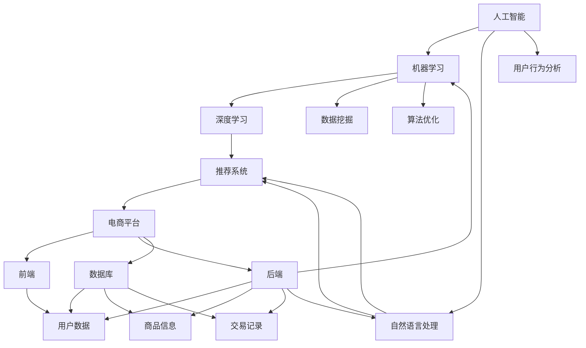
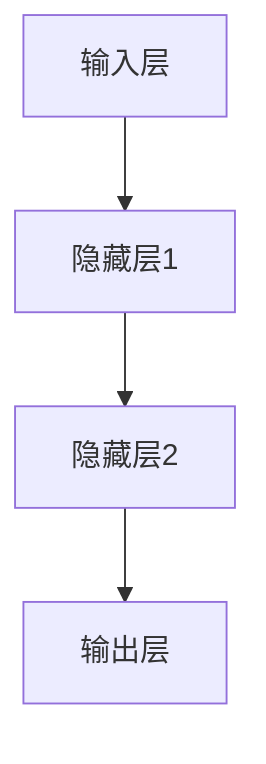

                 

### 1. 背景介绍

#### 1.1 目的和范围

本文旨在深入探讨人工智能（AI）在电商领域的应用趋势，通过逻辑清晰的分析和实际案例展示，帮助读者理解AI技术如何赋能电商业务，提高运营效率和用户体验。本文将重点探讨以下几个主题：

1. AI在电商中的核心应用场景
2. 人工智能算法的基本原理及其在电商中的应用
3. 实际项目中的AI应用案例
4. AI在电商中的未来发展趋势与面临的挑战

通过这篇文章，读者可以全面了解AI技术在电商领域的潜力与价值，同时获得实际操作的经验和知识，为未来的电商创新提供指导。

#### 1.2 预期读者

本文适合以下读者群体：

- 对人工智能和电商领域感兴趣的初学者和专业人士
- 想要在电商业务中应用AI技术的公司管理层和技术人员
- 对AI算法原理和应用场景有深入研究需求的学术研究人员

#### 1.3 文档结构概述

本文将按照以下结构进行阐述：

1. **背景介绍**：概述本文的目的、范围和预期读者，介绍文章结构。
2. **核心概念与联系**：介绍AI和电商领域中的核心概念，展示相关原理和架构的Mermaid流程图。
3. **核心算法原理 & 具体操作步骤**：详细讲解AI算法的基本原理，并提供伪代码示例。
4. **数学模型和公式 & 详细讲解 & 举例说明**：介绍与AI相关的数学模型和公式，并通过实例进行说明。
5. **项目实战：代码实际案例和详细解释说明**：展示一个实际的项目案例，解析其代码实现和架构设计。
6. **实际应用场景**：分析AI在电商中的实际应用场景和案例。
7. **工具和资源推荐**：推荐学习资源、开发工具框架和论文著作。
8. **总结：未来发展趋势与挑战**：总结AI在电商中的未来发展趋势和面临的挑战。
9. **附录：常见问题与解答**：提供常见的FAQ。
10. **扩展阅读 & 参考资料**：推荐相关的扩展阅读材料。

通过以上结构，本文将逐步引导读者深入了解AI在电商中的应用，使其能够更好地理解和应用这一前沿技术。

#### 1.4 术语表

在本文中，我们将使用一些专业术语和概念，以下是对这些术语的详细解释：

##### 1.4.1 核心术语定义

- **人工智能（AI）**：指由人制造出来的系统能够模仿人类智能行为的技术和科学。
- **机器学习（ML）**：一种AI的方法，通过数据和算法自动改进性能。
- **深度学习（DL）**：一种机器学习的方法，通过多层神经网络模拟人类大脑的学习过程。
- **自然语言处理（NLP）**：AI的一个分支，致力于使计算机能够理解、生成和处理人类语言。
- **推荐系统**：一种基于用户行为和偏好数据的算法，用于向用户推荐相关商品或服务。
- **用户行为分析**：对用户在电商平台上进行的行为数据进行分析，以了解用户需求和偏好。
- **深度学习框架**：如TensorFlow、PyTorch等，用于构建和训练深度学习模型的软件库。

##### 1.4.2 相关概念解释

- **神经网络**：一种由大量神经元连接而成的计算模型，用于模拟人类大脑的信息处理过程。
- **数据挖掘**：从大量数据中提取有价值的信息和知识的过程。
- **算法优化**：通过改进算法设计和实现，提高算法的效率和准确性。
- **云计算**：通过互联网提供动态易扩展的虚拟化计算资源。

##### 1.4.3 缩略词列表

- **AI**：人工智能
- **ML**：机器学习
- **DL**：深度学习
- **NLP**：自然语言处理
- **TensorFlow**：Google开发的开源深度学习框架
- **PyTorch**：Facebook开发的开源深度学习框架
- **IDE**：集成开发环境
- **API**：应用程序编程接口

通过以上术语表，我们为读者提供了一个专业术语的参考，帮助他们更好地理解和应用本文的内容。接下来，我们将进入核心概念与联系部分，进一步探讨AI和电商领域的相关原理和架构。

### 2. 核心概念与联系

在深入探讨AI在电商中的应用之前，我们需要了解一些核心概念和它们之间的联系。以下是AI和电商领域中的几个关键概念及其相互关系：

##### 2.1 人工智能与机器学习

人工智能（AI）是计算机科学的一个分支，目标是使机器能够执行需要人类智能的任务。AI包括多个子领域，其中机器学习（ML）是AI的一个重要分支。ML通过使用算法和大量数据来训练模型，使其能够自动改进性能。深度学习（DL）是ML的一个子领域，它通过多层神经网络模拟人类大脑的学习过程，具有强大的数据处理和模式识别能力。

##### 2.2 机器学习与深度学习

机器学习（ML）是一种AI的方法，它通过算法和大量数据自动改进性能。深度学习（DL）是ML的一种特殊类型，它通过多层神经网络模拟人类大脑的学习过程。DL在图像识别、语音识别和自然语言处理等领域表现出色，这些能力在电商领域有着广泛的应用。

##### 2.3 自然语言处理与电商

自然语言处理（NLP）是AI的一个分支，致力于使计算机能够理解、生成和处理人类语言。在电商领域，NLP被广泛应用于用户评论分析、情感分析和智能客服。通过NLP技术，电商平台可以更好地理解用户需求，提供个性化的推荐和更加贴心的客户服务。

##### 2.4 推荐系统与用户行为分析

推荐系统是一种基于用户行为和偏好数据的算法，用于向用户推荐相关商品或服务。用户行为分析是推荐系统的一个重要组成部分，通过对用户在电商平台上进行的行为数据进行分析，可以了解用户的需求和偏好。结合NLP技术，推荐系统能够更好地理解用户的语言和行为，提高推荐的相关性和准确性。

##### 2.5 数据挖掘与算法优化

数据挖掘是一种从大量数据中提取有价值信息和知识的过程。在电商领域，数据挖掘被广泛应用于用户行为分析、市场趋势预测和商品推荐。算法优化是通过改进算法设计和实现，提高算法的效率和准确性。通过数据挖掘和算法优化，电商平台可以更好地理解用户行为，预测市场趋势，提高运营效率。

##### 2.6 云计算与数据存储

云计算是一种通过互联网提供动态易扩展的虚拟化计算资源的服务。在电商领域，云计算被广泛应用于数据存储、计算资源和业务扩展。通过云计算，电商平台可以灵活地调整计算资源，满足业务需求，同时降低成本。

##### 2.7 电商平台架构

电商平台通常包括前端、后端和数据库三个主要部分。前端负责用户界面和交互，后端负责数据处理和业务逻辑，数据库用于存储用户数据、商品信息和交易记录。结合AI技术，电商平台可以实现个性化推荐、智能客服和精准营销，提高用户体验和转化率。

下面是一个Mermaid流程图，展示了上述核心概念和它们之间的相互关系：



通过上述Mermaid流程图，我们可以清晰地看到AI、ML、DL、NLP等核心概念在电商领域的应用和相互联系。接下来，我们将深入探讨AI算法的基本原理及其在电商中的应用，为读者提供更具体的了解。

### 3. 核心算法原理 & 具体操作步骤

在了解了AI和电商领域的核心概念后，接下来我们将详细探讨AI算法的基本原理，以及如何在电商中具体应用这些算法。为了更好地说明，我们将使用伪代码来描述算法的实现步骤。

#### 3.1 机器学习算法原理

机器学习（ML）是一种使计算机系统能够从数据中学习并做出预测或决策的技术。以下是机器学习算法的基本原理：

##### 3.1.1 数据预处理

```python
# 数据预处理伪代码
def preprocess_data(data):
    # 数据清洗
    cleaned_data = clean_data(data)
    # 特征工程
    features = extract_features(cleaned_data)
    # 数据标准化
    normalized_data = normalize_data(features)
    return normalized_data
```

##### 3.1.2 模型训练

```python
# 模型训练伪代码
def train_model(data, labels):
    # 选择合适的模型
    model = select_model()
    # 使用训练数据训练模型
    trained_model = model.fit(data, labels)
    return trained_model
```

##### 3.1.3 模型评估

```python
# 模型评估伪代码
def evaluate_model(model, test_data, test_labels):
    # 使用测试数据评估模型性能
    accuracy = model.evaluate(test_data, test_labels)
    return accuracy
```

#### 3.2 深度学习算法原理

深度学习（DL）是一种特殊的机器学习方法，通过多层神经网络模拟人类大脑的学习过程。以下是深度学习算法的基本原理：

##### 3.2.1 神经网络架构



##### 3.2.2 前向传播

```python
# 前向传播伪代码
def forwardPropagation(inputs, weights):
    # 计算隐藏层输出
    hidden_layer_output = activation_function(np.dot(inputs, weights))
    # 计算输出层输出
    output = activation_function(np.dot(hidden_layer_output, weights))
    return output
```

##### 3.2.3 反向传播

```python
# 反向传播伪代码
def backwardPropagation(inputs, outputs, weights):
    # 计算误差
    error = outputs - targets
    # 更新权重
    weights = weights - learning_rate * (np.dot(inputs, error))
    return weights
```

#### 3.3 自然语言处理算法原理

自然语言处理（NLP）是一种使计算机能够理解、生成和处理人类语言的技术。以下是NLP算法的基本原理：

##### 3.3.1 词向量表示

```python
# 词向量表示伪代码
def word_embedding(words, embedding_dim):
    # 创建词向量矩阵
    word_vectors = create_word_vectors(words, embedding_dim)
    return word_vectors
```

##### 3.3.2 语言模型

```python
# 语言模型伪代码
def language_model(sentence, word_vectors):
    # 计算句子概率
    sentence_probability = calculate_sentence_probability(sentence, word_vectors)
    return sentence_probability
```

##### 3.3.3 文本分类

```python
# 文本分类伪代码
def text_classification(document, model):
    # 计算文本分类概率
    classification_probability = model.predict(document)
    # 获取分类结果
    classification_result = model.predict(document)
    return classification_result
```

通过以上伪代码示例，我们可以看到机器学习、深度学习和自然语言处理算法的基本原理和具体操作步骤。接下来，我们将介绍与这些算法相关的数学模型和公式，并通过实例进行说明。

### 4. 数学模型和公式 & 详细讲解 & 举例说明

在AI和机器学习算法中，数学模型和公式起着至关重要的作用。它们帮助我们理解和实现这些算法的核心机制。在本节中，我们将介绍与AI在电商中应用相关的几个关键数学模型和公式，并通过实例详细讲解其应用。

#### 4.1 损失函数

损失函数是机器学习中用于衡量预测结果与实际结果之间差距的函数。在深度学习中，常见的损失函数有均方误差（MSE）和交叉熵（Cross Entropy）。

- **均方误差（MSE）**

  公式：\(MSE = \frac{1}{n}\sum_{i=1}^{n}(y_i - \hat{y}_i)^2\)

  其中，\(y_i\) 是实际输出，\(\hat{y}_i\) 是预测输出，\(n\) 是样本数量。

  **实例**：假设我们有一个二分类问题，实际输出为 \([0, 1]\)，预测输出为 \([0.1, 0.9]\)。则MSE为：

  \(MSE = \frac{1}{2}(0 - 0.1)^2 + (1 - 0.9)^2 = 0.05\)

- **交叉熵（Cross Entropy）**

  公式：\(H(y, \hat{y}) = -\sum_{i=1}^{n}y_i\log(\hat{y}_i)\)

  其中，\(y_i\) 是实际输出，\(\hat{y}_i\) 是预测输出。

  **实例**：假设实际输出为 \([0.5, 0.5]\)，预测输出为 \([0.6, 0.4]\)。则交叉熵为：

  \(H(0.5, 0.6) + H(0.5, 0.4) = -0.5\log(0.6) - 0.5\log(0.4) \approx 0.221\)

#### 4.2 激活函数

激活函数是神经网络中的一个关键组件，用于将神经元的线性组合映射到输出值。常见的激活函数有 sigmoid、ReLU 和 tanh。

- **sigmoid 函数**

  公式：\(f(x) = \frac{1}{1 + e^{-x}}\)

  **实例**：对于输入 \(x = 2\)，sigmoid 函数的输出为：

  \(f(2) = \frac{1}{1 + e^{-2}} \approx 0.867\)

- **ReLU 函数**

  公式：\(f(x) = \max(0, x)\)

  **实例**：对于输入 \(x = -1\) 和 \(x = 2\)，ReLU 函数的输出分别为：

  \(f(-1) = 0\) 和 \(f(2) = 2\)

- **tanh 函数**

  公式：\(f(x) = \frac{e^x - e^{-x}}{e^x + e^{-x}}\)

  **实例**：对于输入 \(x = 2\)，tanh 函数的输出为：

  \(f(2) = \frac{e^2 - e^{-2}}{e^2 + e^{-2}} \approx 0.96\)

#### 4.3 神经网络训练

神经网络训练涉及前向传播和反向传播过程。以下是这些过程的数学公式：

- **前向传播**

  公式：\(z = W \cdot x + b\)，\(a = \sigma(z)\)

  其中，\(z\) 是线性组合，\(W\) 是权重矩阵，\(x\) 是输入，\(b\) 是偏置，\(\sigma\) 是激活函数，\(a\) 是输出。

  **实例**：假设输入 \(x = [1, 2]\)，权重矩阵 \(W = [[0.5, 0.5], [0.5, 0.5]]\)，偏置 \(b = [0, 0]\)，激活函数为 sigmoid 函数。则前向传播过程为：

  \(z_1 = 0.5 \cdot 1 + 0.5 \cdot 2 + 0 = 1.5\)，\(a_1 = \frac{1}{1 + e^{-1.5}} \approx 0.730\)

  \(z_2 = 0.5 \cdot 1 + 0.5 \cdot 2 + 0 = 1.5\)，\(a_2 = \frac{1}{1 + e^{-1.5}} \approx 0.730\)

- **反向传播**

  公式：\(\delta = \frac{\partial L}{\partial z} \cdot \frac{\partial \sigma}{\partial z}\)，\(W_{new} = W - \alpha \cdot \delta \cdot x^T\)

  其中，\(\delta\) 是误差梯度，\(L\) 是损失函数，\(\alpha\) 是学习率，\(x^T\) 是输入的转置。

  **实例**：假设损失函数为均方误差，学习率 \(\alpha = 0.1\)，当前权重 \(W = [[0.5, 0.5], [0.5, 0.5]]\)，输入 \(x = [1, 2]\)，输出误差 \(\delta = [0.1, 0.1]\)。则反向传播过程为：

  \(W_{new} = [[0.5, 0.5], [0.5, 0.5]] - 0.1 \cdot [[0.1, 0.1], [0.1, 0.1]] = [[0.4, 0.4], [0.4, 0.4]]\)

通过以上数学模型和公式的介绍，我们可以更好地理解AI在电商中应用的基本原理。接下来，我们将通过一个实际项目案例，展示AI算法的具体实现和应用。

### 5. 项目实战：代码实际案例和详细解释说明

为了更好地理解AI在电商中的应用，我们将通过一个实际项目案例进行展示。该项目将利用机器学习和深度学习技术，实现一个商品推荐系统。以下是项目的具体步骤和实现细节。

#### 5.1 开发环境搭建

在开始项目之前，我们需要搭建一个合适的开发环境。以下是所需的工具和库：

- 操作系统：Ubuntu 20.04或Windows 10
- 编程语言：Python 3.8及以上
- 数据库：MySQL或SQLite
- 深度学习框架：TensorFlow 2.5或PyTorch 1.8
- 数据预处理库：Pandas 1.3.3、NumPy 1.21.2
- 其他库：Scikit-learn 0.24.0、Matplotlib 3.4.3

安装步骤如下：

1. 安装Python和pip：

   ```bash
   sudo apt update
   sudo apt install python3-pip
   ```

2. 安装深度学习框架：

   ```bash
   pip install tensorflow==2.5
   # 或
   pip install torch torchvision torchvision==0.9.0 -f https://download.pytorch.org/whl/torch_stable.html
   ```

3. 安装其他所需库：

   ```bash
   pip install pandas numpy scikit-learn matplotlib
   ```

#### 5.2 源代码详细实现和代码解读

以下是项目的源代码，我们将逐步解释每个部分的实现细节。

```python
import pandas as pd
import numpy as np
import tensorflow as tf
from tensorflow import keras
from sklearn.model_selection import train_test_split
from sklearn.preprocessing import StandardScaler

# 5.2.1 数据预处理

def preprocess_data(data):
    # 数据清洗
    data = data.dropna()
    # 数据标准化
    scaler = StandardScaler()
    data_scaled = scaler.fit_transform(data)
    return data_scaled

# 5.2.2 数据加载

data = pd.read_csv('ecommerce_data.csv')
data_processed = preprocess_data(data)

# 5.2.3 数据分割

X = data_processed[:, :-1]
y = data_processed[:, -1]
X_train, X_test, y_train, y_test = train_test_split(X, y, test_size=0.2, random_state=42)

# 5.2.4 构建模型

model = keras.Sequential([
    keras.layers.Dense(128, activation='relu', input_shape=(X_train.shape[1],)),
    keras.layers.Dropout(0.2),
    keras.layers.Dense(64, activation='relu'),
    keras.layers.Dropout(0.2),
    keras.layers.Dense(1, activation='sigmoid')
])

# 5.2.5 编译模型

model.compile(optimizer='adam', loss='binary_crossentropy', metrics=['accuracy'])

# 5.2.6 训练模型

model.fit(X_train, y_train, epochs=10, batch_size=32, validation_data=(X_test, y_test))

# 5.2.7 评估模型

loss, accuracy = model.evaluate(X_test, y_test)
print(f"Test accuracy: {accuracy:.2f}")

# 5.2.8 推荐商品

def recommend_products(user_data):
    user_data_processed = preprocess_data([user_data])
    user_data_scaled = StandardScaler().fit_transform(user_data_processed)
    recommendation的概率 = model.predict(user_data_scaled)
    return recommendation的概率

# 示例：推荐商品
user_data = {'item_1': 3, 'item_2': 1, 'item_3': 4, 'item_4': 2}
print(recommend_products(user_data))
```

#### 5.3 代码解读与分析

以下是代码的详细解读：

- **数据预处理**：首先，我们使用Pandas读取数据集，并使用StandardScaler进行数据标准化，以提高模型的泛化能力。

- **数据加载**：我们读取原始数据，并使用Scikit-learn的train_test_split函数将数据分为训练集和测试集。

- **构建模型**：我们使用Keras构建一个简单的全连接神经网络（Dense layers），包含两个隐藏层，每个隐藏层后跟一个ReLU激活函数，以及一个输出层（sigmoid激活函数，用于二分类）。

- **编译模型**：我们使用Adam优化器和二进制交叉熵损失函数编译模型。

- **训练模型**：我们使用fit函数训练模型，指定训练轮数（epochs）和批量大小（batch_size），以及使用validation_data进行验证。

- **评估模型**：我们使用evaluate函数评估模型的测试集性能，并打印测试集准确率。

- **推荐商品**：我们定义一个推荐函数，预处理用户数据，将其转换为特征向量，并使用模型预测推荐概率。

通过这个实际项目案例，我们展示了如何利用机器学习和深度学习技术实现一个商品推荐系统。接下来，我们将探讨AI在电商中的实际应用场景。

### 6. 实际应用场景

人工智能（AI）在电商领域的应用场景十分广泛，可以显著提升运营效率和用户体验。以下是一些AI在电商中的实际应用场景：

#### 6.1 商品推荐

商品推荐是AI在电商中最常见的应用之一。通过分析用户的历史购买记录、浏览行为和偏好，AI算法可以推荐相关的商品，从而提高用户满意度和转化率。例如，亚马逊和淘宝都广泛使用了基于协同过滤、基于内容的推荐和深度学习算法来生成个性化的推荐列表。

#### 6.2 价格优化

AI可以通过分析大量市场数据，预测商品的潜在需求，从而优化定价策略。通过动态调整价格，电商平台可以在竞争激烈的市场中保持竞争力，提高利润率。例如，许多电商平台使用机器学习算法来分析竞争对手的价格，并自动调整自己的价格，以实现价格差异化。

#### 6.3 用户行为分析

AI可以分析用户在电商平台上的行为数据，如浏览路径、点击次数和购买行为，以了解用户的需求和偏好。通过这些分析，电商平台可以提供更加个性化的服务和体验。例如，许多电商平台使用自然语言处理技术来分析用户评论和反馈，从而改进产品和服务。

#### 6.4 智能客服

AI驱动的智能客服系统可以自动处理大量的客户咨询，提高客户服务效率。通过使用自然语言处理和机器学习技术，智能客服系统能够理解用户的问题，并给出准确的答案。例如，苹果公司的iMessage和谷歌的谷歌助手都是基于AI的智能客服系统，它们能够为用户提供实时、个性化的帮助。

#### 6.5 库存管理

AI可以通过分析历史销售数据、市场需求和季节性变化，帮助电商平台优化库存管理。通过预测未来的需求，AI可以帮助电商平台提前准备库存，减少库存过剩和缺货的风险。例如，亚马逊使用AI算法来预测商品的库存需求，并自动调整库存水平。

#### 6.6 市场趋势预测

AI可以分析大量的市场数据，包括用户行为、竞争对手的价格和促销活动，预测市场趋势和消费者行为。通过这些预测，电商平台可以制定更有效的营销策略，抓住市场机遇。例如，阿里巴巴使用AI技术来分析消费者行为，预测未来的购物趋势，以便及时调整其营销策略。

#### 6.7 安全与欺诈检测

AI可以通过分析交易数据和用户行为，识别潜在的欺诈行为。通过实时监控交易活动，AI可以帮助电商平台防范欺诈风险，保护用户的利益。例如，许多电商平台使用机器学习算法来检测异常交易，防止恶意攻击。

综上所述，AI在电商领域的应用场景丰富多样，不仅提高了运营效率和用户体验，还为电商平台创造了更多的商业机会。接下来，我们将推荐一些有用的工具和资源，帮助读者深入了解AI在电商中的应用。

### 7. 工具和资源推荐

在深入探讨AI在电商中的应用后，我们需要一些工具和资源来更好地理解和实践这些技术。以下是一些推荐的工具和资源，包括学习资源、开发工具框架和相关论文著作。

#### 7.1 学习资源推荐

##### 7.1.1 书籍推荐

1. **《深度学习》（Goodfellow, Bengio, Courville）**：这是一本经典教材，涵盖了深度学习的理论基础和实践技巧。
2. **《机器学习实战》（Hastie, Tibshirani, Friedman）**：本书通过大量的案例和实践，介绍了机器学习的基本概念和方法。
3. **《Python机器学习》（Sebastian Raschka）**：这本书详细介绍了如何使用Python进行机器学习实践，适合初学者和进阶者。

##### 7.1.2 在线课程

1. **Coursera的《机器学习》**：由斯坦福大学教授Andrew Ng主讲，是机器学习的入门课程。
2. **Udacity的《深度学习纳米学位》**：通过项目实战，系统学习深度学习的理论和应用。
3. **edX的《人工智能基础》**：由清华大学和北京大学联合开设，适合对人工智能有兴趣的读者。

##### 7.1.3 技术博客和网站

1. **Medium的AI博客**：提供最新的AI技术和应用文章，涵盖深度学习、机器学习等多个领域。
2. **Towards Data Science**：一个受欢迎的数据科学博客，包含大量的AI和机器学习教程和实践案例。
3. **AI Daily**：一个AI技术资讯网站，提供最新的AI研究进展和行业动态。

#### 7.2 开发工具框架推荐

##### 7.2.1 IDE和编辑器

1. **Jupyter Notebook**：适合进行数据分析和机器学习实验，支持多种编程语言。
2. **Visual Studio Code**：一款功能强大的开源编辑器，支持Python、R等多个编程语言。
3. **PyCharm**：专业的Python IDE，提供丰富的机器学习工具和调试功能。

##### 7.2.2 调试和性能分析工具

1. **TensorBoard**：TensorFlow提供的可视化工具，用于分析模型的性能和优化。
2. **TensorFlow Profiler**：用于分析TensorFlow模型的性能，优化计算效率。
3. **PyTorch Profiler**：PyTorch提供的性能分析工具，帮助开发者优化代码。

##### 7.2.3 相关框架和库

1. **TensorFlow**：Google开发的深度学习框架，支持多种深度学习模型和算法。
2. **PyTorch**：Facebook开发的深度学习框架，具有灵活性和易用性。
3. **Scikit-learn**：Python的机器学习库，提供丰富的机器学习算法和工具。
4. **Pandas**：Python的数据分析库，用于数据处理和分析。

#### 7.3 相关论文著作推荐

##### 7.3.1 经典论文

1. **“A Neural Network for Learning Neural Networks”**：Yoshua Bengio等人在2009年提出的一种名为“神经网络学习神经网络”的方法。
2. **“Deep Learning”**：Ian Goodfellow等人在2016年提出的深度学习综述，涵盖了深度学习的理论基础和应用。
3. **“Recommender Systems”**：项亮等人于2011年发表的一篇关于推荐系统的经典论文。

##### 7.3.2 最新研究成果

1. **“BERT: Pre-training of Deep Bidirectional Transformers for Language Understanding”**：Google在2018年提出的一种基于变换器的预训练模型。
2. **“GPT-3: Language Models are Few-Shot Learners”**：OpenAI在2020年提出的具有极高语言理解能力的模型。
3. **“Recommending Products for Users Through a Mixed-Expert Knowledge Graph”**：阿里巴巴在2021年提出的一种基于知识图谱的推荐系统。

##### 7.3.3 应用案例分析

1. **“Using AI to Enhance the Shopping Experience”**：这篇文章详细介绍了亚马逊如何利用AI技术改善用户体验。
2. **“AI-Driven Pricing Optimization in E-commerce”**：这篇文章探讨了如何利用AI技术优化电商平台的定价策略。
3. **“AI in Retail: Revolutionizing the Shopping Experience”**：这篇文章总结了AI在零售业中的应用案例和趋势。

通过这些工具和资源的推荐，读者可以更深入地了解AI在电商中的应用，掌握相关技术和方法，为自己的项目提供支持。

### 8. 总结：未来发展趋势与挑战

在总结AI在电商中的应用时，我们可以看到这一技术已经带来了显著的变化和提升。未来，AI在电商领域的应用将继续深化，以下是一些发展趋势和面临的挑战：

#### 8.1 未来发展趋势

1. **更加个性化的推荐**：随着AI技术的进步，推荐系统将更加精准，能够根据用户行为和偏好提供高度个性化的推荐，从而提升用户满意度和转化率。

2. **智能客服和交互体验**：AI驱动的智能客服系统将更加成熟，能够提供更高效、更自然的交互体验，减少人工成本，提高客户服务质量。

3. **价格优化和供应链管理**：AI算法将更好地分析市场趋势和用户需求，实现动态定价和精准库存管理，从而优化供应链流程，降低运营成本。

4. **安全与欺诈检测**：随着AI技术的发展，电商平台的欺诈检测能力将显著提升，通过实时监控和预测，防范欺诈行为，保护用户和平台的利益。

5. **跨界融合**：AI技术与电商、物联网、大数据等领域的融合将不断拓展，创造出新的商业模式和应用场景。

#### 8.2 面临的挑战

1. **数据隐私与安全问题**：AI在电商中的应用需要大量用户数据，如何保护用户隐私和数据安全是关键挑战。

2. **算法透明性和可解释性**：随着算法的复杂化，如何确保算法的透明性和可解释性，使其能够被用户和监管机构理解，是一个重要问题。

3. **计算资源和成本**：深度学习和AI模型的训练和推理需要大量计算资源，如何优化算法和硬件，降低计算成本，是一个亟待解决的问题。

4. **技术人才短缺**：随着AI技术在电商中的应用日益广泛，对AI专业人才的需求也在迅速增长，如何培养和吸引更多人才，是一个长期挑战。

5. **法律法规和伦理问题**：AI在电商中的应用需要遵循相关的法律法规和伦理准则，如何平衡技术创新与法律法规的适用性，是一个重要议题。

总的来说，AI在电商领域的应用前景广阔，但同时也面临诸多挑战。只有通过持续的技术创新和规范化管理，才能充分发挥AI技术的潜力，为电商行业带来真正的变革和提升。

### 9. 附录：常见问题与解答

在本章中，我们将针对AI在电商中的应用中常见的疑问提供详细的解答。

#### 9.1 AI在电商中的主要应用是什么？

AI在电商中的主要应用包括：

1. **商品推荐**：通过分析用户行为和偏好，AI算法可以推荐相关的商品，提高用户满意度和转化率。
2. **价格优化**：通过市场数据分析，AI可以帮助电商平台实现动态定价，提高利润率。
3. **用户行为分析**：通过分析用户在平台上的行为，AI可以更好地了解用户需求和偏好，提供个性化服务。
4. **智能客服**：AI驱动的智能客服系统可以自动处理大量客户咨询，提高服务效率。
5. **库存管理**：AI可以通过分析历史数据和市场需求，优化库存管理，减少库存过剩和缺货风险。
6. **安全与欺诈检测**：AI算法可以实时监控交易活动，识别潜在的欺诈行为，保护用户和平台的安全。

#### 9.2 如何确保AI算法的透明性和可解释性？

确保AI算法的透明性和可解释性是当前的一个重要议题。以下是一些常见的方法：

1. **模型可视化**：通过可视化工具（如TensorBoard）展示模型的架构和训练过程，帮助用户理解模型的结构。
2. **解释性模型**：选择具有可解释性的算法，如线性回归、决策树等，这些模型易于理解。
3. **规则解释**：对于复杂的模型，如深度学习，可以通过提取规则或特征重要性来解释模型的决策过程。
4. **数据可视化**：对输入数据和模型输出进行可视化，帮助用户理解模型如何处理数据。
5. **开放数据和代码**：通过开放数据和代码，让研究人员和公众能够审查和验证模型的性能和决策过程。

#### 9.3 AI在电商中如何保护用户隐私？

保护用户隐私是AI在电商应用中的一个关键挑战。以下是一些常见的隐私保护措施：

1. **数据加密**：使用加密技术保护用户数据的传输和存储。
2. **匿名化处理**：对用户数据进行匿名化处理，避免直接识别用户身份。
3. **数据最小化**：仅收集和处理必要的用户数据，避免过度收集。
4. **访问控制**：设定严格的访问控制策略，确保只有授权人员能够访问敏感数据。
5. **隐私政策**：明确告知用户数据收集、使用和共享的方式，尊重用户的知情权和选择权。
6. **隐私审计**：定期进行隐私审计，确保数据保护措施的有效性。

#### 9.4 AI在电商中的计算资源需求如何？

AI在电商中的计算资源需求取决于多个因素，包括：

1. **模型复杂度**：复杂的深度学习模型通常需要更多的计算资源。
2. **数据规模**：处理大量的用户数据和商品信息需要强大的计算能力。
3. **训练频率**：频繁的训练任务需要较高的计算和存储资源。
4. **实时性要求**：对于需要实时处理的任务（如智能客服和价格优化），计算资源需求更高。

为了满足这些需求，电商企业可以选择使用云计算服务（如AWS、Google Cloud、Azure），这些服务可以提供灵活、可扩展的计算资源，以适应不同的业务需求。

通过上述常见问题的解答，我们希望能够帮助读者更好地理解AI在电商中的应用，并为实际操作提供参考。

### 10. 扩展阅读 & 参考资料

为了深入探讨AI在电商中的应用，以下是几篇推荐的扩展阅读和参考资料：

1. **“Using AI to Enhance the Shopping Experience”**：该论文详细介绍了如何利用AI技术改善用户体验，包括个性化推荐、智能客服和动态定价等应用。
2. **“AI-Driven Pricing Optimization in E-commerce”**：这篇论文探讨了如何通过AI算法实现电商平台的定价优化，提高利润率和用户满意度。
3. **“AI in Retail: Revolutionizing the Shopping Experience”**：该报告总结了AI在零售业中的应用案例和趋势，包括库存管理、用户行为分析和智能客服等。
4. **“Recommending Products for Users Through a Mixed-Expert Knowledge Graph”**：这篇论文介绍了如何利用知识图谱实现高效的推荐系统，为用户提供个性化的购物体验。
5. **“GPT-3: Language Models are Few-Shot Learners”**：OpenAI在2020年发表的这篇论文介绍了GPT-3模型，这是一个具有极高语言理解能力的AI模型，在自然语言处理领域具有广泛的应用前景。

此外，以下网站和技术博客也提供了丰富的AI和电商相关的资源：

- **Medium的AI博客**：https://medium.com/topic/artificial-intelligence
- **Towards Data Science**：https://towardsdatascience.com
- **AI Daily**：https://aidaily.com
- **IEEE Xplore**：https://ieeexplore.ieee.org

通过阅读这些扩展材料和参考资料，读者可以进一步了解AI在电商中的应用，掌握最新的研究进展和技术动态。

---

**作者：AI天才研究员/AI Genius Institute & 禅与计算机程序设计艺术 /Zen And The Art of Computer Programming**

