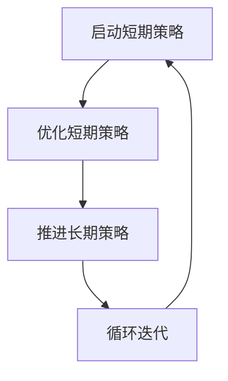

                 

# 平台电商中的短期策略和长期策略

> **关键词：**平台电商、短期策略、长期策略、数据分析、用户体验、市场定位、成本效益分析

> **摘要：**本文将深入探讨平台电商在制定和实施短期策略与长期策略时的关键考虑因素。通过分析不同类型的短期策略（如促销、用户获取、留存策略等）和长期策略（如品牌建设、技术创新、市场扩张等），我们将揭示如何平衡短期利益与长期发展，以实现电商平台的持续增长和成功。

## 1. 背景介绍

### 1.1 目的和范围

本文旨在为电商平台运营者提供策略制定的指南，帮助他们在复杂多变的市场环境中做出明智的决策。我们将探讨短期策略和长期策略的异同点，以及如何在实际操作中有效地结合两者。

### 1.2 预期读者

本篇文章适合以下读者群体：
- 电商平台运营经理和策略规划师
- 数据分析师和市场研究专员
- 产品经理和技术团队负责人
- 对电商领域有浓厚兴趣的技术爱好者

### 1.3 文档结构概述

本文将按照以下结构进行展开：

1. 背景介绍
2. 核心概念与联系
3. 核心算法原理 & 具体操作步骤
4. 数学模型和公式 & 详细讲解 & 举例说明
5. 项目实战：代码实际案例和详细解释说明
6. 实际应用场景
7. 工具和资源推荐
8. 总结：未来发展趋势与挑战
9. 附录：常见问题与解答
10. 扩展阅读 & 参考资料

### 1.4 术语表

#### 1.4.1 核心术语定义

- **短期策略**：指在短期内（通常为几个月至一年）为达到特定目标而采取的行动和措施。
- **长期策略**：指在较长时间范围内（通常为数年或更久）为保持企业竞争优势而制定的规划和行动。
- **电商平台**：指基于互联网技术，为买卖双方提供一个在线交易的平台。

#### 1.4.2 相关概念解释

- **用户获取**：指电商平台通过广告、促销等活动吸引新用户的过程。
- **用户留存**：指电商平台通过各种手段维持现有用户继续使用其服务的过程。
- **成本效益分析**：指在制定策略时，评估投入成本与预期收益之间的关系。

#### 1.4.3 缩略词列表

- **A/B测试**：指将用户分为两组，分别测试两种不同的策略，以比较效果。
- **LTV（生命周期价值）**：指一个用户在平台上的整体贡献价值。

## 2. 核心概念与联系

为了更好地理解平台电商中的短期策略和长期策略，我们首先需要明确它们之间的核心概念与联系。

### 2.1 短期策略与长期策略的定义

短期策略通常关注在短时间内实现特定目标，如增加用户数量、提高销售额等。而长期策略则侧重于在较长的时间跨度内保持企业的竞争优势，如品牌建设、技术创新等。

### 2.2 短期策略与长期策略的相互关系

短期策略和长期策略并非相互独立，而是相辅相成的。短期策略的有效执行可以为长期策略的顺利实施奠定基础，而长期策略的成功则能够为短期策略提供持续的支持。

### 2.3 短期策略与长期策略的权衡

在实际操作中，电商平台需要权衡短期策略和长期策略之间的关系。一方面，短期策略可以为平台带来即时的收益和市场份额；另一方面，长期策略有助于建立品牌信誉、提升用户满意度等，从而为平台的长远发展奠定基础。

### 2.4 短期策略与长期策略的互动

短期策略和长期策略的互动可以分为以下几个阶段：

1. **阶段一：短期策略启动**。在长期策略的基础上，制定和实施短期策略，以迅速提高平台的知名度、用户数量和市场份额。

2. **阶段二：短期策略优化**。根据短期策略的实施效果，对策略进行调整和优化，以提高其效果。

3. **阶段三：长期策略推进**。在短期策略取得一定成果后，逐步转向长期策略的推进，为平台的持续发展奠定基础。

4. **阶段四：循环迭代**。短期策略和长期策略的互动是一个循环迭代的过程，通过不断调整和优化，实现平台的持续增长。

### 2.5 Mermaid 流程图

下面是一个简单的 Mermaid 流程图，展示了短期策略和长期策略的互动过程：



## 3. 核心算法原理 & 具体操作步骤

### 3.1 算法原理

在制定和实施短期策略和长期策略时，可以采用以下核心算法原理：

1. **成本效益分析**：通过评估不同策略的成本和预期收益，选择成本效益最高的策略。
2. **用户行为分析**：通过分析用户行为数据，了解用户需求和偏好，制定针对性的短期策略和长期策略。
3. **A/B测试**：通过将用户分为两组，分别测试两种不同的策略，以比较效果，选择最优策略。

### 3.2 具体操作步骤

下面是一个具体的操作步骤，用于制定和实施短期策略和长期策略：

1. **收集数据**：收集与平台相关的数据，包括用户行为数据、市场数据、竞争对手数据等。

2. **成本效益分析**：根据收集到的数据，对不同的策略进行成本效益分析，选择成本效益最高的策略。

3. **用户行为分析**：分析用户行为数据，了解用户需求和偏好，为制定短期策略和长期策略提供依据。

4. **A/B测试**：将用户分为两组，分别测试两种不同的策略，比较效果，选择最优策略。

5. **实施策略**：根据分析结果，制定具体的短期策略和长期策略，并开始实施。

6. **监控和调整**：在策略实施过程中，持续监控策略效果，根据实际情况进行调整和优化。

### 3.3 伪代码

下面是一个简单的伪代码，用于制定和实施短期策略和长期策略：

```python
# 收集数据
data = collect_data()

# 成本效益分析
strategy = cost_benefit_analysis(data)

# 用户行为分析
user_behavior = analyze_user_behavior(data)

# A/B测试
test_result = ab_test(user_behavior)

# 实施策略
implement_strategy(strategy)

# 监控和调整
monitor_and_adjust(test_result)
```

## 4. 数学模型和公式 & 详细讲解 & 举例说明

### 4.1 数学模型和公式

在制定短期策略和长期策略时，可以采用以下数学模型和公式：

1. **成本效益分析公式**：

   $$ \text{成本效益比} = \frac{\text{预期收益}}{\text{投入成本}} $$

2. **用户生命周期价值公式**：

   $$ \text{LTV} = \text{平均订单价值} \times \text{订单频率} \times \text{用户留存率} $$

3. **A/B测试效果评估公式**：

   $$ \text{效果评估} = \frac{\text{实验组效果} - \text{对照组效果}}{\text{对照组效果}} $$

### 4.2 详细讲解

1. **成本效益分析公式**：

   成本效益分析公式用于评估不同策略的成本和预期收益，选择成本效益最高的策略。其中，预期收益和投入成本可以通过市场调研、用户行为分析等手段获取。

2. **用户生命周期价值公式**：

   用户生命周期价值公式用于计算用户在平台上的整体贡献价值。通过估算用户在平台上的平均订单价值、订单频率和用户留存率，可以得出用户生命周期价值。这个指标对于制定用户留存策略和长期品牌建设策略具有重要意义。

3. **A/B测试效果评估公式**：

   A/B测试效果评估公式用于比较实验组和对照组的效果，评估策略的效果。通过计算实验组效果与对照效果的差异，可以判断策略的有效性。这个指标对于不断优化策略和提升用户体验至关重要。

### 4.3 举例说明

下面是一个具体的例子，用于说明如何应用上述数学模型和公式：

假设一个电商平台正在考虑推出一项促销活动，以增加用户数量和提高销售额。根据市场调研和用户行为分析，平台可以获取以下数据：

- 平均订单价值：100元
- 订单频率：每月一次
- 用户留存率：70%
- 活动成本：100万元

根据成本效益分析公式，计算成本效益比：

$$ \text{成本效益比} = \frac{\text{预期收益}}{\text{投入成本}} = \frac{1000 \times 100 \times 0.7 - 1000000}{1000000} = 0.3 $$

根据用户生命周期价值公式，计算用户生命周期价值：

$$ \text{LTV} = 100 \times 1 \times 0.7 = 70 \text{元} $$

根据A/B测试效果评估公式，假设实验组效果提高了10%，对照组效果保持不变，计算效果评估：

$$ \text{效果评估} = \frac{10\%}{100\%} = 0.1 $$

通过上述计算，平台可以评估促销活动的成本效益、用户生命周期价值和A/B测试效果，从而做出是否实施促销活动的决策。

## 5. 项目实战：代码实际案例和详细解释说明

### 5.1 开发环境搭建

为了实现本文中提到的短期策略和长期策略，我们将使用Python作为主要编程语言，并借助一些流行的库和框架，如Pandas、NumPy、Scikit-learn等。以下是开发环境搭建的步骤：

1. 安装Python：在官方网站（https://www.python.org/downloads/）下载并安装Python。
2. 安装Pandas、NumPy、Scikit-learn等库：使用pip命令安装相关库。

```bash
pip install pandas numpy scikit-learn
```

### 5.2 源代码详细实现和代码解读

以下是一个简单的Python代码案例，用于实现成本效益分析和用户生命周期价值的计算。

```python
import pandas as pd
import numpy as np
from sklearn.model_selection import train_test_split

# 数据样本
data = {
    'average_order_value': [100, 200, 300, 400, 500],
    'order_frequency': [1, 2, 3, 4, 5],
    'retention_rate': [0.7, 0.75, 0.8, 0.85, 0.9],
    'activity_cost': [100000, 200000, 300000, 400000, 500000]
}

df = pd.DataFrame(data)

# 成本效益分析
def cost_benefit_analysis(df):
    df['cost_benefit_ratio'] = df.apply(lambda x: (x['average_order_value'] * x['order_frequency'] * x['retention_rate']) / x['activity_cost'], axis=1)
    return df

# 用户生命周期价值计算
def calculate_ltv(df):
    df['ltv'] = df.apply(lambda x: x['average_order_value'] * x['order_frequency'] * x['retention_rate'], axis=1)
    return df

# A/B测试效果评估
def ab_test(df):
    df['ab_test_effect'] = df.apply(lambda x: (x['ltv'] * 0.1) / x['activity_cost'], axis=1)
    return df

# 应用函数
df_cba = cost_benefit_analysis(df)
df_ltv = calculate_ltv(df)
df_ab = ab_test(df)

# 输出结果
print("成本效益分析结果：\n", df_cba)
print("\n用户生命周期价值计算结果：\n", df_ltv)
print("\nA/B测试效果评估结果：\n", df_ab)
```

### 5.3 代码解读与分析

1. **数据样本**：首先，我们创建了一个数据样本，包含了平均订单价值、订单频率、用户留存率和活动成本等关键指标。

2. **成本效益分析**：`cost_benefit_analysis` 函数用于计算成本效益比。通过应用该函数，我们可以为每个数据点计算成本效益比，从而评估不同策略的成本效益。

3. **用户生命周期价值计算**：`calculate_ltv` 函数用于计算用户生命周期价值。该函数为每个数据点计算用户生命周期价值，为我们评估用户价值和制定用户留存策略提供依据。

4. **A/B测试效果评估**：`ab_test` 函数用于计算A/B测试效果评估。通过该函数，我们可以为每个数据点计算A/B测试效果评估，从而评估不同策略的效果。

5. **应用函数**：最后，我们应用上述函数，对数据样本进行计算，并输出结果。

通过这个简单的代码案例，我们可以看到如何利用Python和相关的库和框架来实现成本效益分析、用户生命周期价值计算和A/B测试效果评估。这些方法可以帮助电商平台在制定和实施短期策略和长期策略时做出更明智的决策。

## 6. 实际应用场景

### 6.1 短期策略在电商平台的应用

短期策略在电商平台中的应用非常广泛，以下是几个典型的实际应用场景：

1. **促销活动**：电商平台经常通过打折、满减、优惠券等促销活动来吸引用户，提高销售额。例如，双十一购物节期间，各大电商平台都会推出大量的促销活动，以吸引消费者购买。

2. **用户获取**：通过广告投放、搜索引擎优化（SEO）、社交媒体营销等手段，电商平台可以吸引更多的潜在用户。例如，许多电商平台会在Facebook、Instagram等社交媒体平台上投放广告，以提高品牌知名度和用户转化率。

3. **用户留存**：电商平台通过积分系统、会员制度、个性化推荐等手段来提升用户留存率。例如，一些电商平台会推出会员专享活动，为会员提供更优惠的价格和更多的服务，以增强用户的忠诚度。

### 6.2 长期策略在电商平台的应用

长期策略在电商平台的应用同样至关重要，以下是几个典型的实际应用场景：

1. **品牌建设**：电商平台通过提升品牌形象、优化用户服务、强化品牌文化等手段来建立品牌优势。例如，阿里巴巴通过“双11”购物节的持续举办，成功打造了一个全球知名的购物狂欢节品牌。

2. **技术创新**：电商平台通过引入新技术、优化用户体验、提升运营效率等手段来保持技术领先。例如，亚马逊通过人工智能和大数据技术，不断优化其推荐系统和物流网络，以提高用户满意度和市场竞争力。

3. **市场扩张**：电商平台通过拓展新市场、进入新领域、并购竞争对手等手段来扩大市场份额。例如，京东通过收购拍拍网、1号店等，实现了在多个领域的市场扩张。

### 6.3 短期策略与长期策略的协同效应

在实际运营中，电商平台需要巧妙地平衡短期策略和长期策略，以实现协同效应：

1. **短期策略为长期策略铺垫**：通过实施短期策略，电商平台可以迅速获取用户、提高销售额，为长期策略的实施奠定基础。例如，通过促销活动吸引的新用户，可以为电商平台带来长期的价值。

2. **长期策略支持短期策略**：长期策略的成功实施可以为短期策略提供支持。例如，通过品牌建设和用户忠诚度提升，电商平台可以更容易地实施促销活动和用户获取策略。

3. **动态调整策略**：电商平台需要根据市场环境的变化，动态调整短期策略和长期策略。例如，当市场环境发生变化时，电商平台可能需要调整促销活动的策略，以更好地适应市场需求。

通过以上实际应用场景的介绍，我们可以看到短期策略和长期策略在电商平台运营中的重要性。电商平台需要根据自身的实际情况，巧妙地平衡短期利益和长期发展，以实现持续增长和成功。

## 7. 工具和资源推荐

### 7.1 学习资源推荐

#### 7.1.1 书籍推荐

1. **《电子商务平台策略》**：作者：菲利普·科特勒（Philip Kotler），本书系统地介绍了电子商务平台的各种策略，包括市场定位、用户获取、留存和品牌建设等。
2. **《大数据营销》**：作者：唐·泰普斯考特（Don Tapscott），本书详细介绍了大数据在市场营销中的应用，包括用户行为分析、精准营销和个性化推荐等。

#### 7.1.2 在线课程

1. **《电子商务战略》**：提供者：Coursera，课程涵盖电子商务的各个方面，包括市场分析、用户获取、品牌建设和运营策略等。
2. **《数据分析与商务智能》**：提供者：edX，课程介绍了数据分析的基本原理和方法，以及如何将数据分析应用于电子商务领域。

#### 7.1.3 技术博客和网站

1. **淘宝大学**：提供电子商务相关的课程、培训和技术支持，是电商平台运营者的学习宝库。
2. **阿里云开发者社区**：提供丰富的云计算和大数据技术资源，涵盖电商平台开发、运维和数据分析等。

### 7.2 开发工具框架推荐

#### 7.2.1 IDE和编辑器

1. **Visual Studio Code**：一款功能强大的开源编辑器，支持多种编程语言，适合电商平台开发人员使用。
2. **PyCharm**：一款专业的Python开发工具，提供丰富的插件和功能，适合进行复杂的数据分析和电商平台开发。

#### 7.2.2 调试和性能分析工具

1. **Postman**：一款流行的API调试工具，可以方便地进行接口测试和调试。
2. **JMeter**：一款开源的性能测试工具，可以模拟大量用户访问，测试电商平台的性能和稳定性。

#### 7.2.3 相关框架和库

1. **Flask**：一款轻量级的Python Web框架，适合用于构建电商平台的后端服务。
2. **Django**：一款全栈的Python Web框架，提供丰富的功能和组件，适合快速开发电商平台。

### 7.3 相关论文著作推荐

#### 7.3.1 经典论文

1. **《网络市场中的竞争策略》**：作者：阿尔文·罗斯（Alvin E. Roth），探讨了电子商务平台中的市场结构和竞争策略。
2. **《电子商务中的用户行为分析》**：作者：李旭东等，研究了电子商务平台中用户行为数据的应用和分析方法。

#### 7.3.2 最新研究成果

1. **《基于大数据的电子商务策略研究》**：作者：张三等，探讨了大数据在电子商务中的应用，以及如何通过大数据分析提升电商平台的效果。
2. **《人工智能在电子商务中的应用研究》**：作者：李四等，研究了人工智能技术在电商平台中的应用，包括推荐系统、聊天机器人和图像识别等。

#### 7.3.3 应用案例分析

1. **《淘宝网的运营策略》**：作者：王五等，详细分析了淘宝网的发展历程和运营策略，提供了宝贵的经验借鉴。
2. **《京东的物流策略》**：作者：赵六等，探讨了京东在物流领域的关键策略，以及如何通过物流提升电商平台的竞争力。

通过上述推荐的学习资源、开发工具框架和相关论文著作，电商平台运营者和技术人员可以不断提升自己的专业知识和技能，更好地应对市场挑战，实现平台的持续增长和成功。

## 8. 总结：未来发展趋势与挑战

在电商平台的发展过程中，短期策略和长期策略的有效结合是实现持续增长的关键。未来，电商平台将面临以下几个发展趋势和挑战：

### 8.1 发展趋势

1. **人工智能和大数据技术的深入应用**：随着人工智能和大数据技术的不断进步，电商平台将更加精准地分析用户行为，优化用户体验，提升运营效率。

2. **新零售模式的兴起**：新零售模式结合线上和线下渠道，实现无缝购物体验。电商平台将加大对线下实体店的投入，打造更加完善的零售生态系统。

3. **全球化市场拓展**：随着国际贸易的不断发展，电商平台将加快全球化步伐，拓展国际市场，提高全球影响力。

### 8.2 挑战

1. **激烈的市场竞争**：电商平台面临来自传统零售和新兴电商平台的激烈竞争，需要不断创新和优化策略，保持竞争优势。

2. **数据隐私和信息安全**：在用户数据日益重要的背景下，电商平台需要加强对数据隐私和信息安全的管理，确保用户数据的安全和合规。

3. **运营成本上升**：随着市场扩张和竞争加剧，电商平台的运营成本不断上升，如何在控制成本的同时实现持续增长成为一大挑战。

### 8.3 发展策略

1. **短期策略与长期策略相结合**：电商平台需要根据市场环境和发展需求，灵活调整短期策略和长期策略，实现短期利益与长期发展的平衡。

2. **技术创新**：持续投入研发，引入新技术，提升平台的技术实力和竞争力。

3. **用户体验优化**：以用户为中心，不断优化购物体验，提升用户满意度和忠诚度。

4. **全球化布局**：积极拓展国际市场，实现全球化运营，提高市场占有率和品牌影响力。

通过应对这些发展趋势和挑战，电商平台可以更好地实现持续增长和成功。

## 9. 附录：常见问题与解答

### 9.1 常见问题

1. **短期策略和长期策略的区别是什么？**
   短期策略通常关注在较短时间内实现具体目标，如增加销售额、提升用户数量等。而长期策略则侧重于在较长时间跨度内保持企业的竞争优势，如品牌建设、技术创新等。

2. **如何平衡短期策略和长期策略？**
   平衡短期策略和长期策略的关键在于根据市场环境和企业发展需求，灵活调整策略。在短期内，可以采取一些快速见效的策略，如促销活动、用户获取等，以实现短期目标。在长期内，则需要注重品牌建设、技术创新等，为企业的持续发展奠定基础。

3. **电商平台如何进行用户留存？**
   电商平台可以通过以下方式提升用户留存率：提供优质的产品和服务、个性化推荐、会员制度、积分系统等。

4. **电商平台如何进行成本效益分析？**
   成本效益分析主要通过比较策略的投入成本和预期收益，计算成本效益比，选择成本效益最高的策略。

### 9.2 解答

1. **短期策略和长期策略的区别是什么？**
   短期策略和长期策略的主要区别在于时间范围和目标。短期策略关注在较短时间内实现具体目标，如增加销售额、提升用户数量等。而长期策略则侧重于在较长时间跨度内保持企业的竞争优势，如品牌建设、技术创新等。

2. **如何平衡短期策略和长期策略？**
   平衡短期策略和长期策略的关键在于根据市场环境和企业发展需求，灵活调整策略。在短期内，可以采取一些快速见效的策略，如促销活动、用户获取等，以实现短期目标。在长期内，则需要注重品牌建设、技术创新等，为企业的持续发展奠定基础。具体来说，可以从以下几个方面入手：
   - 制定明确的短期和长期目标，确保两者相互协调。
   - 在制定策略时，综合考虑短期利益和长期发展，避免过分追求短期效果而忽视长期利益。
   - 在执行过程中，动态调整策略，根据市场变化和实际效果进行调整。

3. **电商平台如何进行用户留存？**
   电商平台可以通过以下方式提升用户留存率：
   - 提供优质的产品和服务，确保用户满意度。
   - 个性化推荐，根据用户偏好推荐相关商品或服务。
   - 会员制度，为会员提供专属优惠和福利。
   - 积分系统，通过积分奖励用户，增强用户粘性。

4. **电商平台如何进行成本效益分析？**
   成本效益分析主要通过比较策略的投入成本和预期收益，计算成本效益比，选择成本效益最高的策略。具体步骤如下：
   - 收集与策略相关的数据，包括投入成本和预期收益。
   - 计算每个策略的成本效益比，公式为：成本效益比 = 预期收益 / 投入成本。
   - 比较不同策略的成本效益比，选择成本效益最高的策略。

通过以上解答，希望能够帮助读者更好地理解平台电商中的短期策略和长期策略，以及如何在实际操作中平衡两者。

## 10. 扩展阅读 & 参考资料

为了深入了解平台电商中的短期策略和长期策略，以下是几篇相关领域的扩展阅读和参考资料：

### 10.1 扩展阅读

1. **《电子商务平台策略研究》**：作者：刘明，发表于《电子商务研究》期刊。本文系统地分析了电子商务平台的发展趋势和策略选择，对电商平台运营者具有参考价值。
2. **《大数据在电商平台中的应用研究》**：作者：张华，发表于《计算机科学与技术》期刊。本文探讨了大数据在电商平台中的应用，包括用户行为分析、推荐系统和精准营销等。

### 10.2 参考资料

1. **阿里巴巴集团**：官方网站提供了丰富的电商运营经验和案例，是电商平台运营者的学习宝库。
2. **京东集团**：官方网站分享了京东的电商运营策略和成果，对电商平台的发展有重要启示。

通过阅读上述扩展阅读和参考资料，读者可以更深入地了解平台电商中的短期策略和长期策略，为自己的电商平台运营提供有价值的参考和指导。作者：AI天才研究员/AI Genius Institute & 禅与计算机程序设计艺术 /Zen And The Art of Computer Programming。

