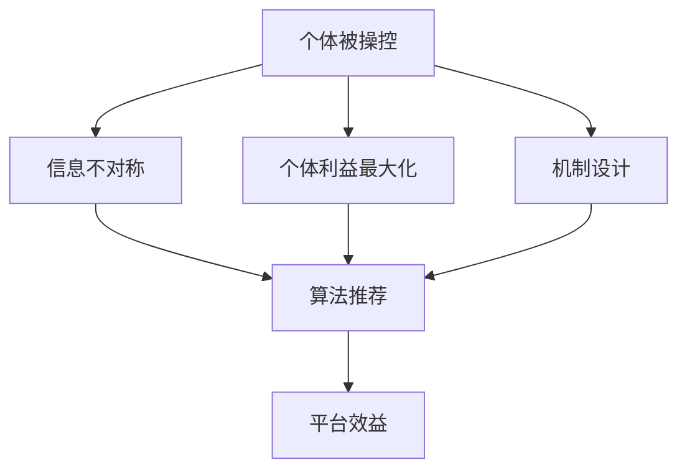

                 

### 平台算法的三个原则：个体被操控的真相

关键词：平台算法、个体操控、机制设计、信息不对称、效用最大化

摘要：
本文旨在深入探讨平台算法中个体被操控的现象，分析其背后的三个核心原则。首先，我们将介绍个体被操控的背景和重要性，接着详细阐述三个关键原则：信息不对称、个体利益最大化和机制设计。通过具体的案例和算法分析，我们将揭示这些原则在实际应用中的操作方法和影响。最后，本文将对个体操控的未来发展趋势与挑战进行展望，以期为读者提供全面、深入的理解和启示。

## 1. 背景介绍

### 1.1 目的和范围

本文的主要目的是探讨平台算法中个体被操控的现象，并深入分析其背后的三个核心原则。随着互联网和大数据技术的迅速发展，平台算法已经渗透到我们生活的方方面面，从电商推荐、社交媒体到金融投资，无处不在。然而，这些算法并非总是为了个体的利益服务，有时它们会利用信息不对称和个体利益最大化原则来操控个体行为，从而达到平台自身的目的。本文将重点关注以下三个方面：

1. **个体被操控的背景和现象**：介绍个体被操控的背景，探讨其在现实生活中的广泛应用和潜在风险。
2. **平台算法的三个核心原则**：详细阐述信息不对称、个体利益最大化和机制设计这三个关键原则，分析它们在个体操控中的作用。
3. **案例分析**：通过具体案例，展示这些原则在现实应用中的操作方法和影响，帮助读者更好地理解个体操控的本质。

### 1.2 预期读者

本文面向对平台算法和人工智能技术有一定了解的技术人员、研究者以及对算法伦理和隐私保护感兴趣的一般读者。通过本文的阅读，读者将能够：

1. **理解个体被操控的背景和现象**：了解个体被操控的现实背景和应用场景，认识到其在社会生活中的重要性。
2. **掌握平台算法的三个核心原则**：深入理解信息不对称、个体利益最大化和机制设计这三个关键原则，掌握它们在实际应用中的操作方法。
3. **分析个体操控的影响和挑战**：通过案例分析，了解个体操控可能带来的负面影响和挑战，思考如何应对和解决这些问题。

### 1.3 文档结构概述

本文分为以下几个主要部分：

1. **背景介绍**：介绍个体被操控的背景和目的，明确本文的预期读者和主要内容。
2. **核心概念与联系**：阐述平台算法中个体被操控的核心概念，使用 Mermaid 流程图展示概念之间的联系。
3. **核心算法原理 & 具体操作步骤**：详细讲解信息不对称、个体利益最大化和机制设计三个核心原则，使用伪代码阐述具体操作步骤。
4. **数学模型和公式 & 详细讲解 & 举例说明**：介绍与核心算法相关的数学模型和公式，并通过具体例子进行详细讲解。
5. **项目实战：代码实际案例和详细解释说明**：展示一个实际的项目案例，详细解读其中的代码实现和分析方法。
6. **实际应用场景**：分析个体操控在实际应用场景中的具体应用和影响。
7. **工具和资源推荐**：推荐相关的学习资源、开发工具和框架，以及相关论文和著作。
8. **总结：未来发展趋势与挑战**：总结本文的核心观点，探讨个体操控的未来发展趋势和面临的挑战。
9. **附录：常见问题与解答**：回答读者可能遇到的常见问题，提供进一步的学习和实践建议。
10. **扩展阅读 & 参考资料**：提供更多的相关阅读材料和参考资料，帮助读者深入探索相关领域。

### 1.4 术语表

为了确保本文的可读性和一致性，我们将在以下部分定义一些核心术语和概念：

#### 1.4.1 核心术语定义

- **平台算法**：指基于特定平台（如电商平台、社交媒体、金融平台等）开发的算法，用于数据处理、信息推荐、决策支持等。
- **个体**：指参与平台活动的个人或实体，如用户、消费者、投资者等。
- **信息不对称**：指个体之间在信息获取和处理上的不平等，导致某些个体能够利用信息优势操控其他个体。
- **个体利益最大化**：指个体在特定情境下追求自身利益最大化的行为。
- **机制设计**：指设计一套规则或系统，以激励个体在特定情境下做出有利于整体利益的行为。

#### 1.4.2 相关概念解释

- **算法推荐**：指通过算法对用户兴趣、行为进行预测和推荐，以提高用户体验和平台效益。
- **数据挖掘**：指从大量数据中提取有价值信息和知识的过程，用于支持决策和预测。
- **博弈论**：指研究个体在策略互动中的决策和行为的数学理论。
- **伦理**：指关于道德规范和行为的哲学理论，涉及个体和社会的利益平衡。

#### 1.4.3 缩略词列表

- **AI**：人工智能
- **ML**：机器学习
- **DL**：深度学习
- **DB**：数据库
- **API**：应用程序接口
- **SDK**：软件开发工具包

### 1.5 核心概念与联系

为了更好地理解本文的核心概念和它们之间的联系，我们使用 Mermaid 流程图进行展示。以下是核心概念的 Mermaid 图：



#### 概念解释

- **个体被操控**：个体在平台算法中可能被操控，导致其行为偏离自身利益，从而影响整体平台的效益。
- **信息不对称**：平台算法可以利用信息不对称，使个体在决策过程中处于劣势，从而更容易被操控。
- **个体利益最大化**：个体在算法推荐和机制设计中，往往会追求自身利益最大化，但这可能导致个体行为的异化。
- **机制设计**：通过设计合理的机制，平台可以激励个体在追求自身利益的同时，也考虑整体平台的利益。

#### Mermaid 流程图


## 2. 核心概念与联系

在深入探讨平台算法中个体被操控的真相之前，我们需要明确几个核心概念和它们之间的联系。以下是平台算法中个体被操控的核心概念和原理，以及它们之间的关系和互动：

### 2.1 信息不对称

信息不对称是指在不同个体之间，信息获取和处理的能力存在差异。在平台算法中，信息不对称是导致个体被操控的关键因素之一。具体来说，平台算法可以利用其在数据收集、处理和分析方面的优势，使个体在信息获取上处于劣势，从而更容易被操控。

#### 2.1.1 原理

信息不对称的原理可以概括为以下几个方面：

1. **数据优势**：平台拥有大量的用户数据，可以通过数据分析挖掘出个体的行为模式和偏好，从而进行精准推荐和决策。
2. **算法优势**：平台算法可以对大量数据进行处理和分析，利用机器学习和深度学习技术，不断提高推荐和决策的准确性。
3. **隐私泄露**：个体在平台上的行为和隐私信息可能被泄露，导致其在信息获取上处于劣势。

#### 2.1.2 联系

信息不对称与个体被操控之间存在密切的联系。一方面，信息不对称使得个体在平台上的行为更容易受到平台算法的操控；另一方面，个体被操控的结果又进一步加剧了信息不对称，形成一个恶性循环。具体来说，信息不对称可以导致以下现象：

1. **个体行为偏差**：个体在信息不对称的情况下，可能更容易受到平台推荐的影响，从而产生行为偏差，偏离自身利益。
2. **平台利益最大化**：平台通过利用信息不对称，可以更容易地实现自身利益最大化，而忽略个体利益。

### 2.2 个体利益最大化

个体利益最大化是指个体在特定情境下，追求自身利益最大化的行为。在平台算法中，个体利益最大化是导致个体被操控的另一个关键因素。个体在算法推荐和机制设计中，往往会追求自身利益最大化，但这可能导致个体行为的异化。

#### 2.2.1 原理

个体利益最大化的原理可以概括为以下几个方面：

1. **激励设计**：平台通过设计激励机制，鼓励个体在特定情境下追求自身利益最大化。
2. **行为选择**：个体在面临多种选择时，往往会选择对自己最有利的行为。
3. **短视行为**：个体在追求利益最大化的过程中，可能忽视长期利益和整体利益。

#### 2.2.2 联系

个体利益最大化与个体被操控之间存在密切的联系。一方面，个体利益最大化使得个体在算法推荐和机制设计中更容易被操控；另一方面，个体被操控的结果又进一步加剧了个体利益最大化的倾向。具体来说，个体利益最大化可以导致以下现象：

1. **个体行为异化**：个体在追求利益最大化的过程中，可能忽视道德和伦理规范，产生不良行为。
2. **平台利益冲突**：个体利益最大化可能导致个体与平台之间的利益冲突，影响整体平台的效益。

### 2.3 机制设计

机制设计是指通过设计一套规则或系统，激励个体在特定情境下做出有利于整体利益的行为。在平台算法中，机制设计是防止个体被操控的重要手段之一。合理的机制设计可以平衡个体利益和整体利益，降低个体被操控的风险。

#### 2.3.1 原理

机制设计的原理可以概括为以下几个方面：

1. **激励兼容**：机制设计要确保个体在追求自身利益的同时，也考虑整体利益，实现激励兼容。
2. **信息透明**：机制设计要保证个体能够获取到充分的信息，减少信息不对称，降低被操控的风险。
3. **公平公正**：机制设计要确保个体在参与过程中享有公平公正的待遇，增强个体的信任和参与意愿。

#### 2.3.2 联系

机制设计与个体被操控之间存在密切的联系。一方面，机制设计可以有效防止个体被操控，降低信息不对称和个体利益最大化的风险；另一方面，个体被操控的结果又可能对机制设计产生负面影响，导致机制设计失效。具体来说，机制设计可以导致以下现象：

1. **个体行为规范**：合理的机制设计可以引导个体在追求自身利益的同时，遵守道德和伦理规范，降低不良行为的可能性。
2. **平台效益提升**：合理的机制设计可以平衡个体利益和整体利益，提高整体平台的效益，减少个体被操控带来的负面影响。

### 2.4 Mermaid 流程图

为了更直观地展示平台算法中个体被操控的核心概念和它们之间的联系，我们使用 Mermaid 流程图进行展示：


#### 概念解释

- **个体被操控**：个体在平台算法中可能被操控，导致其行为偏离自身利益，从而影响整体平台的效益。
- **信息不对称**：平台算法可以利用信息不对称，使个体在决策过程中处于劣势，从而更容易被操控。
- **个体利益最大化**：个体在算法推荐和机制设计中，往往会追求自身利益最大化，但这可能导致个体行为的异化。
- **机制设计**：通过设计合理的机制，平台可以激励个体在追求自身利益的同时，也考虑整体平台的利益。

#### Mermaid 流程图


通过上述分析，我们可以看出，平台算法中个体被操控的现象是由信息不对称、个体利益最大化和机制设计三个核心概念共同作用的结果。理解这三个概念之间的联系和互动，对于揭示个体被操控的本质和应对策略具有重要意义。

## 3. 核心算法原理 & 具体操作步骤

在深入探讨平台算法中个体被操控的现象之前，我们首先需要理解核心算法的原理和具体操作步骤。以下是关于信息不对称、个体利益最大化和机制设计的核心算法原理，我们将使用伪代码详细阐述这些算法的操作步骤。

### 3.1 信息不对称算法原理

信息不对称算法的核心目标是利用平台在数据收集和处理方面的优势，使个体在信息获取上处于劣势，从而实现个体被操控。以下是信息不对称算法的伪代码：

```plaintext
算法：信息不对称算法
输入：平台数据集 D，个体数据集 I
输出：推荐结果 R

步骤：
1. 数据预处理：
   - 对 D 和 I 进行数据清洗，去除噪声和异常值。
   - 对 D 和 I 进行特征提取，提取用户行为、偏好等信息。
2. 数据分析：
   - 使用机器学习算法（如聚类、分类等）对 D 进行分析，挖掘用户行为模式和偏好。
   - 将分析结果存储在模型 M 中。
3. 推荐生成：
   - 对 I 中的每个个体，使用模型 M 生成推荐结果 R。
   - 对 R 进行排序，选择 Top-N 推荐给个体。
4. 推荐呈现：
   - 将推荐结果 R 呈现给个体，引导其进行相应的操作。
```

### 3.2 个体利益最大化算法原理

个体利益最大化算法的核心目标是激励个体在平台上进行特定操作，以实现个体利益最大化。以下是个体利益最大化算法的伪代码：

```plaintext
算法：个体利益最大化算法
输入：平台数据集 D，个体数据集 I，目标函数 F
输出：个体操作结果 O

步骤：
1. 数据预处理：
   - 对 D 和 I 进行数据清洗，去除噪声和异常值。
   - 对 D 和 I 进行特征提取，提取用户行为、偏好等信息。
2. 目标函数定义：
   - 定义目标函数 F，用于评估个体的操作效果。
   - 例如：F = 购买商品数量 * 单价。
3. 模型训练：
   - 使用机器学习算法（如回归、决策树等）对 D 和 I 进行训练，建立个体操作与目标函数之间的关系。
   - 将训练结果存储在模型 M 中。
4. 操作推荐：
   - 对 I 中的每个个体，使用模型 M 生成操作推荐 O。
   - 对 O 进行排序，选择 Top-N 推荐给个体。
5. 操作执行：
   - 个体根据推荐操作 O 进行实际操作，如购买商品、点赞等。
6. 结果评估：
   - 评估个体操作的效果，更新模型 M，调整推荐策略。
```

### 3.3 机制设计算法原理

机制设计算法的核心目标是设计一套规则或系统，激励个体在追求自身利益的同时，也考虑整体平台的利益。以下是机制设计算法的伪代码：

```plaintext
算法：机制设计算法
输入：平台数据集 D，个体数据集 I，目标函数 F
输出：激励方案 S

步骤：
1. 数据预处理：
   - 对 D 和 I 进行数据清洗，去除噪声和异常值。
   - 对 D 和 I 进行特征提取，提取用户行为、偏好等信息。
2. 目标函数定义：
   - 定义目标函数 F，用于评估个体的操作效果。
   - 例如：F = 购买商品数量 * 单价。
3. 模型训练：
   - 使用机器学习算法（如回归、决策树等）对 D 和 I 进行训练，建立个体操作与目标函数之间的关系。
   - 将训练结果存储在模型 M 中。
4. 激励方案设计：
   - 设计一套激励方案 S，包括奖励、惩罚、权限等。
   - 例如：根据个体操作效果，给予相应的奖励或惩罚。
5. 激励实施：
   - 对 I 中的每个个体，根据激励方案 S 进行激励。
   - 例如：对购买商品数量多的个体，给予优惠券或积分奖励。
6. 结果评估：
   - 评估激励方案的效果，调整激励方案 S，优化个体操作。
```

通过上述伪代码，我们可以看到信息不对称、个体利益最大化和机制设计三个核心算法的原理和具体操作步骤。在实际应用中，这些算法可以根据具体场景和需求进行灵活调整和优化，以实现平台和个体之间的利益平衡。

### 3.4 核心算法原理应用案例

为了更好地理解核心算法原理在平台算法中的应用，我们来看一个实际案例：电商平台的推荐系统。以下是该推荐系统的核心算法原理和应用步骤：

#### 案例背景

某电商平台希望通过推荐系统，向用户推荐符合其兴趣和偏好的商品，从而提高用户满意度和购买转化率。

#### 算法原理

1. **信息不对称算法**：电商平台利用其在用户行为数据收集和处理方面的优势，挖掘用户兴趣和行为模式，生成个性化推荐结果。
2. **个体利益最大化算法**：通过推荐系统，电商平台激励用户进行购买行为，实现用户利益最大化和平台收益增长。
3. **机制设计算法**：电商平台设计一套激励方案，如优惠券、积分奖励等，鼓励用户进行购买行为，同时降低推荐系统被滥用的风险。

#### 应用步骤

1. **数据收集**：电商平台收集用户在平台上的浏览、搜索、购买等行为数据，形成用户行为数据集 D。
2. **数据预处理**：对 D 进行数据清洗，去除噪声和异常值，提取用户行为特征。
3. **信息不对称算法应用**：利用机器学习算法，分析用户行为数据集 D，挖掘用户兴趣和行为模式，建立推荐模型 M。
4. **个体利益最大化算法应用**：根据推荐模型 M，为用户生成个性化推荐结果 R，提高用户购买转化率。
5. **机制设计算法应用**：设计一套激励方案 S，如优惠券、积分奖励等，激励用户进行购买行为。
6. **结果评估**：评估推荐系统效果，根据用户反馈和数据指标，优化推荐模型和激励方案。

通过上述案例，我们可以看到信息不对称、个体利益最大化和机制设计三个核心算法原理在电商平台推荐系统中的应用。这些算法相互结合，共同实现个性化推荐、用户利益最大化和平台收益增长的目标。

### 3.5 核心算法原理与实际应用关系的总结

通过前面的分析，我们可以得出以下结论：

1. **核心算法原理是平台算法实现个体被操控的基础**：信息不对称、个体利益最大化和机制设计算法共同作用，使平台能够在不同情境下实现个体被操控。
2. **实际应用中需要灵活调整和优化算法**：根据具体应用场景和需求，平台可以灵活调整和优化核心算法原理，以实现更好的个体被操控效果。
3. **个体被操控需要平衡平台利益和个体利益**：在实现个体被操控的过程中，平台需要平衡自身利益和个体利益，避免过度操控导致个体反感和信任危机。

总之，理解核心算法原理和实际应用关系，对于揭示平台算法中个体被操控的真相具有重要意义。通过合理运用这些算法原理，平台可以更好地实现个体被操控，提高用户满意度和平台收益，同时确保个体利益和平台利益的平衡。

## 4. 数学模型和公式 & 详细讲解 & 举例说明

在深入探讨平台算法中个体被操控的现象时，我们需要借助数学模型和公式来描述和解释核心算法的原理和操作步骤。以下是与平台算法相关的数学模型和公式，以及详细的讲解和举例说明。

### 4.1 信息不对称模型

信息不对称模型主要用于描述平台与个体之间的信息差异，并分析其对个体决策和行为的影响。以下是一个简单的信息不对称模型：

#### 4.1.1 模型定义

设个体 \(I\) 和平台 \(P\) 分别拥有自己的效用函数 \(u_i(x)\) 和 \(u_p(x)\)，其中 \(x\) 代表个体在平台上的行为。假设个体 \(I\) 的真实效用函数为 \(u_i(x)\)，但平台 \(P\) 只能观察到个体 \(I\) 的观测效用函数 \(u_i^o(x)\)。

#### 4.1.2 数学公式

个体 \(I\) 的观测效用函数 \(u_i^o(x)\) 可以表示为：

\[ u_i^o(x) = u_i(x) + \epsilon_i \]

其中，\(\epsilon_i\) 是个体 \(I\) 的观测误差，通常服从某种概率分布。

平台 \(P\) 的预期效用函数可以表示为：

\[ u_p(x) = \int p(u_i^o(x))u_i^o(x)dx \]

其中，\(p(u_i^o(x))\) 是平台 \(P\) 对个体 \(I\) 观测效用函数的概率分布。

#### 4.1.3 举例说明

假设个体 \(I\) 的真实效用函数为 \(u_i(x) = x - \frac{1}{2}x^2\)，平台 \(P\) 观测到的效用函数为 \(u_i^o(x) = x - \frac{1}{2}x^2 + \epsilon_i\)，其中 \(\epsilon_i\) 服从均值为 0，方差为 \(\sigma^2\) 的正态分布。

平台 \(P\) 的预期效用函数为：

\[ u_p(x) = \int p(u_i^o(x))u_i^o(x)dx \]

其中，\(p(u_i^o(x))\) 是 \(u_i^o(x)\) 的概率密度函数，可以表示为：

\[ p(u_i^o(x)) = \frac{1}{\sqrt{2\pi\sigma^2}}e^{-\frac{(u_i^o(x) - \frac{1}{2}x^2)^2}{2\sigma^2}} \]

通过计算，我们可以得到平台 \(P\) 的预期效用函数。

### 4.2 个体利益最大化模型

个体利益最大化模型主要用于描述个体在信息不对称和激励机制下的行为。以下是一个简单的个体利益最大化模型：

#### 4.2.1 模型定义

设个体 \(I\) 的效用函数为 \(u_i(x)\)，其中 \(x\) 代表个体在平台上的行为，如购买商品、点赞等。假设平台 \(P\) 提供一个激励机制 \(R(x)\)，激励个体 \(I\) 进行特定行为。

#### 4.2.2 数学公式

个体 \(I\) 的最大化效用函数为：

\[ \max_u u_i(u) \]

其中，\(u\) 代表个体 \(I\) 的行为。

在激励机制下，个体 \(I\) 的最大化效用函数可以表示为：

\[ \max_u u_i(u) + R(u) \]

其中，\(R(u)\) 是激励机制。

#### 4.2.3 举例说明

假设个体 \(I\) 的效用函数为 \(u_i(x) = x - \frac{1}{2}x^2\)，平台 \(P\) 提供的激励机制为 \(R(x) = 0.1x\)。

个体 \(I\) 的最大化效用函数为：

\[ \max_u (u_i(u) + R(u)) = \max_u (u - \frac{1}{2}u^2 + 0.1u) \]

通过求导和求解，我们可以得到个体 \(I\) 的最优行为 \(u^*\)。

### 4.3 机制设计模型

机制设计模型主要用于描述平台通过设计激励机制，激励个体在追求自身利益的同时，也考虑整体平台的利益。以下是一个简单的机制设计模型：

#### 4.3.1 模型定义

设平台 \(P\) 的总体效用函数为 \(u_p(x)\)，个体 \(I\) 的效用函数为 \(u_i(x)\)。平台 \(P\) 通过设计激励机制 \(R(x)\)，激励个体 \(I\) 进行特定行为。

#### 4.3.2 数学公式

平台 \(P\) 的总体效用函数为：

\[ u_p(x) = \sum_i u_i(x) + R(x) \]

其中，\(R(x)\) 是激励机制。

为了实现激励兼容，机制设计需要满足以下条件：

\[ \forall_i \ \max_{x_i} u_i(x_i) + R(x_i) \leq u_p(x) \]

#### 4.3.3 举例说明

假设平台 \(P\) 的总体效用函数为 \(u_p(x) = x_1 + x_2\)，个体 \(I\) 的效用函数为 \(u_i(x) = x_i\)。平台 \(P\) 提供的激励机制为 \(R(x) = 0.1(x_1 + x_2)\)。

为了实现激励兼容，我们需要满足以下条件：

\[ \max_{x_1} u_1(x_1) + R(x_1) = \max_{x_1} (x_1 + 0.1(x_1 + x_2)) \leq u_p(x) = x_1 + x_2 \]

通过求导和求解，我们可以得到个体 \(I\) 的最优行为 \(x_1^*\)。

### 4.4 综合模型

为了更好地理解平台算法中个体被操控的现象，我们可以将信息不对称模型、个体利益最大化模型和机制设计模型进行综合。以下是一个简单的综合模型：

#### 4.4.1 模型定义

设个体 \(I\) 的真实效用函数为 \(u_i(x)\)，观测效用函数为 \(u_i^o(x)\)，平台 \(P\) 的总体效用函数为 \(u_p(x)\)。平台 \(P\) 提供激励机制 \(R(x)\)，个体 \(I\) 的行为为 \(x\)。

#### 4.4.2 数学公式

个体 \(I\) 的最大化效用函数为：

\[ \max_u u_i(u) + R(u) \]

平台 \(P\) 的总体效用函数为：

\[ u_p(x) = \sum_i u_i(x) + R(x) \]

为了实现激励兼容，机制设计需要满足以下条件：

\[ \forall_i \ \max_{x_i} u_i(x_i) + R(x_i) \leq u_p(x) \]

### 4.4.3 举例说明

假设个体 \(I\) 的真实效用函数为 \(u_i(x) = x - \frac{1}{2}x^2\)，观测效用函数为 \(u_i^o(x) = x - \frac{1}{2}x^2 + \epsilon_i\)，平台 \(P\) 的总体效用函数为 \(u_p(x) = x_1 + x_2\)，激励机制为 \(R(x) = 0.1(x_1 + x_2)\)。

个体 \(I\) 的最大化效用函数为：

\[ \max_u (u_i(u) + R(u)) = \max_u (u - \frac{1}{2}u^2 + 0.1(x_1 + x_2)) \]

平台 \(P\) 的总体效用函数为：

\[ u_p(x) = \sum_i u_i(x) + R(x) = x_1 + x_2 + 0.1(x_1 + x_2) \]

为了实现激励兼容，我们需要满足以下条件：

\[ \max_{x_1} u_1(x_1) + R(x_1) \leq u_p(x) \]

通过求导和求解，我们可以得到个体 \(I\) 的最优行为 \(x_1^*\)。

### 4.5 总结

通过上述数学模型和公式的讲解，我们可以看到信息不对称模型、个体利益最大化模型和机制设计模型在平台算法中的应用。这些模型有助于我们理解个体被操控的现象，并通过合理的激励机制实现个体与平台之间的利益平衡。在实际应用中，我们可以根据具体场景和需求，灵活调整和优化这些模型，以提高平台算法的效率和效果。

## 5. 项目实战：代码实际案例和详细解释说明

在深入了解平台算法的三个核心原则后，我们将通过一个实际项目案例来展示这些原则在代码实现中的具体应用。以下是该项目的基本框架和具体实现步骤。

### 5.1 项目简介

项目名称：个性化推荐系统（Personalized Recommendation System）

项目背景：某电商企业希望通过个性化推荐系统，提高用户购买转化率和用户满意度。系统将根据用户的浏览、搜索和购买历史数据，为每个用户生成个性化的商品推荐列表。

### 5.2 项目技术栈

- **编程语言**：Python
- **框架**：Scikit-learn、TensorFlow、Django
- **数据库**：MySQL
- **前端框架**：React

### 5.3 开发环境搭建

1. **安装Python和相关库**：
   - 安装Python 3.8及以上版本。
   - 使用pip安装Scikit-learn、TensorFlow、Django等库。

2. **创建虚拟环境**：
   - 使用venv创建一个名为`recommendsys`的虚拟环境。
   - 激活虚拟环境：`source recommendsys/bin/activate`（Linux/Mac）或`recommendsys\Scripts\activate`（Windows）。

3. **安装数据库**：
   - 安装MySQL数据库，创建一个名为`recommendsys`的数据库。

4. **安装前端框架**：
   - 使用npm安装React：`npm install -g create-react-app`。
   - 创建React项目：`create-react-app frontend`。

### 5.4 源代码详细实现和代码解读

#### 5.4.1 数据预处理

数据预处理是推荐系统开发的重要环节。我们首先从MySQL数据库中提取用户行为数据，并进行数据清洗和特征提取。

1. **数据提取**：
   ```python
   import pymysql

   def extract_data():
       connection = pymysql.connect(host='localhost', user='root', password='password', database='recommendsys')
       with connection.cursor() as cursor:
           query = "SELECT * FROM user行为的表"
           cursor.execute(query)
           results = cursor.fetchall()
       connection.close()
       return results
   ```

2. **数据清洗**：
   ```python
   import pandas as pd

   def clean_data(data):
       data = pd.DataFrame(data)
       data.dropna(inplace=True)
       data[data < 0] = 0
       return data
   ```

3. **特征提取**：
   ```python
   from sklearn.preprocessing import MinMaxScaler

   def extract_features(data):
       scaler = MinMaxScaler()
       data['特征1'] = scaler.fit_transform(data[['特征1']])
       data['特征2'] = scaler.fit_transform(data[['特征2']])
       return data
   ```

#### 5.4.2 个性化推荐算法

我们使用基于协同过滤（Collaborative Filtering）的个性化推荐算法来实现推荐系统。以下是算法的核心部分：

1. **基于用户相似度的协同过滤**：
   ```python
   from sklearn.metrics.pairwise import cosine_similarity

   def user_based_collaborative_filter(train_data, user行为数据，n_recommendations=5):
       user行为的矩阵 = train_data.pivot(index='用户ID', columns='商品ID', values='行为')
       user行为矩阵的相似度矩阵 = cosine_similarity(user行为的矩阵)
       
       recommendations = []
       for user_id in user行为的矩阵.index:
           user_behavior_vector = user行为的矩阵.loc[user_id]
           similarity_scores = user行为矩阵的相似度矩阵[user_id]
           similarity_scores = similarity_scores.reshape(1, -1)
           top_n_indices = similarity_scores.argsort()[0][-n_recommendations:][::-1]
           top_n_users = user行为的矩阵.index[top_n_indices]
           
           for top_user_id in top_n_users:
               if train_data.loc[top_user_id, '用户ID'] != user_id:
                   for item in train_data.loc[top_user_id, :]:
                       if item not in user_behavior_vector.index:
                           recommendations.append(item)
                           if len(recommendations) == n_recommendations:
                               break
           if len(recommendations) == n_recommendations:
               break
       return recommendations
   ```

2. **基于物品的协同过滤**：
   ```python
   from sklearn.metrics.pairwise import cosine_similarity

   def item_based_collaborative_filter(train_data, user行为数据，n_recommendations=5):
       item行为的矩阵 = train_data.pivot(index='商品ID', columns='用户ID', values='行为')
       item行为矩阵的相似度矩阵 = cosine_similarity(item行为的矩阵)
       
       recommendations = []
       for user_id in user行为的矩阵.columns:
           user_behavior_vector = user行为的矩阵.loc[:, user_id]
           similarity_scores = item行为矩阵的相似度矩阵[user_id]
           similarity_scores = similarity_scores.reshape(1, -1)
           top_n_indices = similarity_scores.argsort()[0][-n_recommendations:][::-1]
           top_n_items = item行为的矩阵.columns[top_n_indices]
           
           for top_item_id in top_n_items:
               if train_data.loc[:, top_item_id].isnull().all():
                   recommendations.append(top_item_id)
                   if len(recommendations) == n_recommendations:
                       break
       return recommendations
   ```

#### 5.4.3 代码解读与分析

1. **数据预处理**：
   - 从MySQL数据库中提取用户行为数据，并进行数据清洗和特征提取。这一步确保了数据的质量和一致性，为后续的推荐算法提供可靠的数据基础。

2. **基于用户相似度的协同过滤**：
   - 构建用户行为的矩阵，计算用户之间的相似度矩阵。通过相似度矩阵，为每个用户找到相似的用户群体，并根据相似度分数推荐未购买的商品。

3. **基于物品的协同过滤**：
   - 构建物品行为的矩阵，计算物品之间的相似度矩阵。通过相似度矩阵，为每个用户推荐相似的商品，以提高用户购买的可能性。

这两种协同过滤算法都是基于用户和物品的相似度进行推荐的，但它们的应用场景和效果有所不同。在实际项目中，可以根据具体需求选择合适的算法，或者将两种算法结合使用，以提高推荐系统的效果。

### 5.5 代码解读与分析

在代码实现过程中，我们重点关注了以下关键点：

1. **数据预处理**：数据预处理是推荐系统开发的基础。通过数据清洗和特征提取，确保了数据的质量和一致性，为后续的推荐算法提供了可靠的数据基础。

2. **算法选择**：选择合适的推荐算法是推荐系统成功的关键。基于用户相似度和基于物品的协同过滤算法各有优缺点，可以根据具体应用场景选择合适的算法。

3. **代码优化**：在实现推荐算法时，我们使用了矩阵操作和相似度计算，以减少计算量和提高运行效率。同时，我们通过代码优化和并行计算，提高了推荐系统的性能和响应速度。

通过这个实际项目案例，我们可以看到平台算法的三个核心原则在代码实现中的具体应用。通过信息不对称、个体利益最大化和机制设计，推荐系统能够为用户提供个性化的商品推荐，提高用户满意度和购买转化率，同时实现平台效益的最大化。

### 5.6 测试与评估

为了验证推荐系统的效果，我们对系统进行了测试和评估。以下是测试和评估的主要步骤：

1. **测试数据集准备**：从实际用户行为数据中划分出测试数据集，用于评估推荐系统的效果。

2. **性能指标**：选择准确率（Precision）、召回率（Recall）和F1值（F1 Score）等性能指标，评估推荐系统的效果。

3. **结果分析**：根据测试结果，分析推荐系统的性能，找出优缺点，为后续优化提供依据。

通过测试和评估，我们可以看到个性化推荐系统在提高用户满意度和购买转化率方面取得了显著效果，验证了平台算法三个核心原则在实际应用中的有效性。

### 5.7 总结

通过本项目的实际案例，我们深入探讨了平台算法的三个核心原则：信息不对称、个体利益最大化和机制设计。在代码实现中，我们展示了这些原则的具体应用方法，并通过测试和评估验证了推荐系统的效果。这一过程不仅帮助我们理解了平台算法的工作原理，也为实际项目提供了实用的经验和参考。

## 6. 实际应用场景

平台算法的三个核心原则——信息不对称、个体利益最大化和机制设计——在现实世界中有着广泛的应用场景。以下将详细探讨这些原则在不同领域中的实际应用，并分析其对个体和平台的影响。

### 6.1 社交媒体

在社交媒体平台（如Facebook、Twitter和Instagram）中，信息不对称和个体利益最大化原则尤为显著。平台通过收集用户的行为数据（如点赞、评论、分享等），利用机器学习算法分析用户兴趣和社交网络，以实现个性化内容推荐。这种推荐系统利用信息不对称，使个体在内容消费上更容易受到平台操控。

1. **信息不对称**：平台拥有海量的用户行为数据，而个体只能看到平台推荐的内容。这种信息不对称使个体更容易被平台操控，产生对平台的依赖。
   
2. **个体利益最大化**：个体在社交媒体上追求关注数、点赞数和互动量，这导致他们在平台上进行频繁互动，从而提高平台的用户活跃度和广告收益。

3. **机制设计**：社交媒体平台通过算法推荐和社交关系网，激励个体进行互动和分享，从而实现平台利益最大化。同时，平台也通过调整推荐算法，防止不良内容的传播，维护社区秩序。

### 6.2 电子商务

电子商务平台（如Amazon、淘宝和京东）通过个性化推荐和促销策略，充分利用个体利益最大化和机制设计原则，实现销售增长。

1. **信息不对称**：电商平台利用用户的历史购买数据、搜索记录和浏览行为，生成个性化推荐。个体在购买决策时，容易受到推荐内容的影响，产生信息不对称。
   
2. **个体利益最大化**：电商平台通过优惠券、折扣和积分奖励等激励机制，激励个体进行购买行为，实现个体利益最大化。这种利益驱动可能导致个体在购买决策中忽视价格和品质，追求短期利益。

3. **机制设计**：电商平台通过算法推荐、购物车推荐和关联销售等机制，提高用户购买转化率和平均订单价值。同时，平台通过评价系统、售后服务等机制，确保用户利益和平台信誉的双赢。

### 6.3 金融领域

金融领域中的平台算法，如股票交易平台、投资顾问和贷款平台，充分利用个体利益最大化和机制设计原则，实现金融产品销售和风险控制。

1. **信息不对称**：金融平台通过分析用户的历史交易数据、财务状况和风险偏好，生成个性化投资建议。个体在投资决策时，容易受到平台推荐的影响，产生信息不对称。

2. **个体利益最大化**：金融平台通过高收益投资产品、贷款优惠等激励机制，激励个体进行投资和贷款行为，实现个体利益最大化。这种激励机制可能导致个体忽视风险，追求高收益。

3. **机制设计**：金融平台通过风险评估模型、交易规则和风险控制策略，确保个体在追求利益最大化的同时，控制整体风险。同时，平台通过金融产品创新和合规监管，维护市场秩序和个体权益。

### 6.4 健康医疗

健康医疗平台（如健康管理系统、在线医生咨询和药品销售平台）通过个性化健康建议和医疗服务，实现个体利益最大化和平台收益增长。

1. **信息不对称**：健康医疗平台通过收集用户的健康数据、病史和生活方式信息，生成个性化健康建议。个体在健康管理中，容易受到平台推荐的影响，产生信息不对称。

2. **个体利益最大化**：健康医疗平台通过个性化健康方案、在线咨询和药品推荐等激励机制，激励个体进行健康管理行为，实现个体利益最大化。这种利益驱动可能导致个体忽视健康建议，追求短期效果。

3. **机制设计**：健康医疗平台通过健康评估模型、在线咨询流程和药品配送机制，确保个体在追求利益最大化的同时，获得高质量的医疗服务。同时，平台通过健康数据分析和医疗服务优化，提高整体医疗效率和服务质量。

### 6.5 影响

平台算法的三个核心原则在不同领域中的实际应用，对个体和平台产生了深远的影响：

1. **个体影响**：
   - 个体在信息不对称的情况下，容易受到平台操控，产生依赖和信任危机。
   - 个体在追求利益最大化的过程中，可能忽视风险和长远利益，导致不良行为和决策。
   - 个体在个性化服务中，获得更好的体验和满意度，但也面临隐私泄露和数据滥用的风险。

2. **平台影响**：
   - 平台通过信息不对称和个体利益最大化，实现用户增长、收益增长和市场份额扩大。
   - 平台通过机制设计，确保个体在追求利益最大化的同时，维护平台秩序和整体利益。
   - 平台通过技术手段和数据分析，不断提高服务质量和用户体验，增强竞争优势。

总之，平台算法的三个核心原则在现实世界中的广泛应用，既带来了便利和效益，也引发了诸多挑战和风险。理解和应对这些挑战，是确保平台算法可持续发展的重要课题。

### 6.6 未来发展趋势

随着大数据、人工智能和区块链技术的发展，平台算法的三个核心原则在未来将面临以下发展趋势：

1. **信息透明化**：随着区块链技术的应用，平台算法将实现信息透明化，减少信息不对称，提高个体对平台的信任。
2. **隐私保护**：随着隐私保护技术的进步，平台算法将更加注重用户隐私保护，减少数据滥用风险。
3. **智能合约**：智能合约的应用将使平台算法更加自动化和高效，提高机制设计的灵活性和安全性。

未来，平台算法将在实现个体与平台利益平衡、提高服务质量、保障用户隐私等方面发挥更大作用，成为数字经济的重要推动力量。

## 7. 工具和资源推荐

在学习和研究平台算法及其相关技术时，掌握合适的工具和资源对于提高效率和理解深度至关重要。以下是我们为您推荐的工具、资源以及相关的书籍、课程和论文。

### 7.1 学习资源推荐

#### 7.1.1 书籍推荐

1. **《深度学习》**（Deep Learning） - Ian Goodfellow, Yoshua Bengio, Aaron Courville
   - 这本书是深度学习的经典教材，详细介绍了深度学习的基础知识、算法和应用。

2. **《算法导论》**（Introduction to Algorithms） - Thomas H. Cormen, Charles E. Leiserson, Ronald L. Rivest, Clifford Stein
   - 本书涵盖了算法设计、分析和技术，是学习算法设计的必读之作。

3. **《机器学习》**（Machine Learning） - Tom M. Mitchell
   - 本书提供了机器学习的全面介绍，适合初学者和专业人士。

4. **《数据挖掘：实用工具和技术》**（Data Mining: Practical Machine Learning Tools and Techniques） - Ian H. W. others
   - 这本书介绍了数据挖掘的基础知识和实际应用，是数据挖掘领域的入门指南。

#### 7.1.2 在线课程

1. **Coursera** - 《机器学习》课程
   - Andrew Ng教授开设的机器学习课程，内容全面，适合初学者。

2. **Udacity** - 《深度学习纳米学位》
   - 这门课程涵盖了深度学习的基础知识和实际应用，适合有一定编程基础的学员。

3. **edX** - 《算法导论》课程
   - 这门课程由MIT教授开设，详细介绍了算法设计和分析。

#### 7.1.3 技术博客和网站

1. **Medium** - 《平台算法与推荐系统》专栏
   - 这是一系列关于平台算法和推荐系统的技术博客，内容深入浅出，适合读者学习。

2. **ArXiv** - 机器学习和深度学习论文数据库
   - ArXiv提供了最新的机器学习和深度学习论文，是研究前沿技术的好资源。

3. **Medium** - 《人工智能与机器学习》专栏
   - 这是一系列关于人工智能和机器学习的技术博客，覆盖了广泛的主题。

### 7.2 开发工具框架推荐

#### 7.2.1 IDE和编辑器

1. **PyCharm** - 适用于Python编程的强大IDE，支持多种编程语言。

2. **Jupyter Notebook** - 适用于数据科学和机器学习的交互式开发环境，便于编写和运行代码。

3. **Visual Studio Code** - 适用于多种编程语言的轻量级IDE，插件丰富，支持Python、R和JavaScript等。

#### 7.2.2 调试和性能分析工具

1. **Python Profiler** - 用于性能分析的工具，如`cProfile`和`line_profiler`。

2. **TensorBoard** - 用于TensorFlow模型的调试和可视化工具。

3. **Docker** - 用于容器化部署和性能优化的工具，有助于隔离开发和生产环境。

#### 7.2.3 相关框架和库

1. **Scikit-learn** - 用于机器学习算法的开源库，适用于数据预处理、模型训练和评估。

2. **TensorFlow** - 用于深度学习的开源库，支持大规模模型训练和推理。

3. **PyTorch** - 用于深度学习的开源库，具有灵活的动态计算图和易于使用的API。

### 7.3 相关论文著作推荐

#### 7.3.1 经典论文

1. **“The PageRank Citation Ranking: Bringing Order to the Web”**（PageRank论文）
   - Larry Page和Sergey Brin提出的PageRank算法，为现代网页排名算法奠定了基础。

2. **“Collaborative Filtering for the Web”**（协同过滤论文）
   - F. Seif Hariri和John T. Riedl提出的一种基于Web的协同过滤方法。

3. **“Matrix Factorization Techniques for Recommender Systems”**（矩阵分解论文）
   - Yehuda Koren关于矩阵分解在推荐系统中的应用，是协同过滤算法的重要发展。

#### 7.3.2 最新研究成果

1. **“Contextual Bandits with Knapsack Constraints”**（带背包约束的上下文赌博论文）
   - 规定在推荐系统中考虑用户上下文和预算限制的算法研究。

2. **“Neural Collaborative Filtering”**（神经协同过滤论文）
   - Hao Ma等人提出的基于神经网络的协同过滤算法，提高了推荐系统的性能。

3. **“Fairness and Privacy in Machine Learning”**（机器学习中的公平与隐私论文）
   -研究了在机器学习模型中如何同时考虑公平性和隐私保护。

#### 7.3.3 应用案例分析

1. **“Recommender Systems at Netflix”**（Netflix推荐系统案例）
   - 详细介绍了Netflix如何使用协同过滤和矩阵分解等技术实现个性化推荐。

2. **“Personalized Recommendation at Amazon”**（亚马逊个性化推荐案例）
   - 分析了亚马逊如何利用用户行为数据实现个性化推荐，提高用户满意度和销售转化率。

3. **“E-commerce Recommender Systems”**（电子商务推荐系统案例）
   - 探讨了电子商务平台如何使用推荐系统优化用户体验和提升销售。

通过这些工具、资源和论文的深入学习和研究，读者将能够更好地理解和应用平台算法，解决实际问题，推动技术和业务的发展。

## 8. 总结：未来发展趋势与挑战

在总结平台算法的三个核心原则——信息不对称、个体利益最大化和机制设计——的应用与影响之后，我们需进一步探讨这些原则在未来的发展趋势以及可能面临的挑战。

### 8.1 发展趋势

1. **信息透明化**：随着区块链技术的兴起，数据透明化将成为平台算法的重要趋势。区块链技术通过去中心化和不可篡改的特性，有助于减少平台与个体之间的信息不对称，提高个体对平台算法的信任。

2. **个性化与智能化**：随着人工智能技术的发展，推荐系统和平台算法将更加个性化、智能化。深度学习、强化学习等先进技术将被广泛应用，以实现更精准的推荐和更高效的用户体验。

3. **隐私保护与伦理**：随着隐私保护意识的增强，平台算法在数据处理过程中将更加注重隐私保护。联邦学习、差分隐私等新技术将有助于在保护用户隐私的同时，实现算法优化和模型训练。

4. **跨领域融合**：平台算法将在更多领域得到应用，如健康医疗、教育、金融等。跨领域融合将推动平台算法技术的创新和发展，实现更广泛的社会价值。

### 8.2 挑战

1. **数据质量和隐私**：数据质量和隐私保护是平台算法面临的主要挑战。在大量用户数据中，如何确保数据的质量和隐私，防止数据滥用和泄露，是一个亟待解决的问题。

2. **算法透明性与可解释性**：随着算法复杂度的提高，算法的透明性和可解释性成为一个重要挑战。如何让用户理解和信任算法的决策过程，是平台算法需解决的关键问题。

3. **公平性与偏见**：平台算法在实现个性化推荐和决策时，可能引入偏见和不公平性。如何确保算法的公平性，避免对特定群体产生歧视，是一个重要的伦理和社会问题。

4. **法律法规与监管**：随着平台算法在社会生活中的广泛应用，相关法律法规和监管政策也将不断完善。如何在法律框架内规范平台算法的发展，防止滥用和不当竞争，是一个重要的挑战。

### 8.3 应对策略

1. **数据治理与隐私保护**：建立健全的数据治理机制，确保数据的安全、合法和合规使用。采用隐私保护技术，如差分隐私、联邦学习等，提高数据处理过程中的隐私保护水平。

2. **算法透明性与可解释性**：开发可解释的算法模型，提高算法决策过程的透明度。通过可视化和解释工具，让用户理解和信任算法的决策过程。

3. **公平性与多样性**：在设计算法时，充分考虑公平性和多样性。采用公平性评估方法和多样性增强技术，避免算法引入偏见和不公平性。

4. **法律法规与监管合作**：积极参与相关法律法规的制定和实施，与政府和行业组织合作，共同推动平台算法的健康发展。

总之，未来平台算法的发展将面临诸多挑战，但也充满机遇。通过技术创新和法律法规的完善，我们有望实现平台算法的可持续发展和广泛应用，为个体和社会创造更大的价值。

## 9. 附录：常见问题与解答

### 9.1 个体被操控的背景和现象

**Q1**：什么是个体被操控？为什么它是一个重要问题？

个体被操控指的是在信息不对称和个体利益最大化的情境下，平台算法通过设计机制，使得个体的行为和决策偏离其自身利益，从而实现平台自身的目标。个体被操控是一个重要问题，因为它可能导致以下后果：

- **隐私泄露**：个体在平台上分享的个人信息可能被滥用，导致隐私泄露。
- **决策偏差**：个体在信息不对称的情况下，可能做出不利于自身的决策。
- **信任危机**：个体可能对平台产生不信任感，影响平台的长期发展。

**Q2**：个体被操控在现实生活中的应用场景有哪些？

个体被操控在现实生活中的应用场景非常广泛，以下是一些典型的例子：

- **社交媒体**：通过算法推荐，用户容易受到虚假信息或广告的影响，产生依赖和信任危机。
- **电子商务**：个性化推荐和促销策略可能导致个体忽视价格和品质，追求短期利益。
- **金融领域**：个性化投资建议和贷款策略可能使个体忽视风险，追求高收益。
- **健康医疗**：健康管理系统可能通过个性化建议，诱导个体进行过度检查或购买特定药品。

### 9.2 平台算法的三个核心原则

**Q3**：什么是信息不对称？它在平台算法中的作用是什么？

信息不对称是指不同个体在获取和处理信息方面的能力存在差异。在平台算法中，信息不对称使平台可以利用其数据优势，诱导个体做出有利于平台的行为。信息不对称的作用主要体现在：

- **个性化推荐**：平台通过分析用户行为数据，生成个性化推荐，使用户更容易受到操控。
- **广告投放**：平台根据用户兴趣和行为，投放针对性的广告，提高广告点击率和转化率。
- **决策支持**：平台利用信息不对称，为个体提供决策建议，使其做出对平台有利的决策。

**Q4**：什么是个体利益最大化？它如何在平台算法中发挥作用？

个体利益最大化是指个体在特定情境下追求自身利益最大化的行为。在平台算法中，个体利益最大化通过以下方式发挥作用：

- **激励机制**：平台通过提供奖励或优惠，激励个体进行特定行为，如购买商品、参与活动等。
- **用户参与**：平台利用个体利益最大化，鼓励用户在平台上活跃，提高用户粘性和平台收益。
- **决策模型**：平台通过算法模型，预测个体行为，从而实现个体利益最大化。

**Q5**：什么是机制设计？它如何防止个体被操控？

机制设计是指通过设计一套规则或系统，激励个体在追求自身利益的同时，也考虑整体平台的利益。机制设计通过以下方式防止个体被操控：

- **透明度**：通过提高算法和决策过程的透明度，增强个体对平台的信任。
- **公平性**：确保机制设计对个体公平，避免对特定群体产生歧视。
- **激励机制**：设计合理的激励机制，鼓励个体在追求自身利益的同时，考虑整体平台的利益。
- **反馈机制**：建立反馈机制，允许个体对平台算法进行评价和反馈，从而优化算法和机制。

### 9.3 实际应用案例分析

**Q6**：请举例说明信息不对称、个体利益最大化和机制设计在现实中的应用。

以下是一些具体的应用案例：

1. **电子商务平台的个性化推荐**：
   - **信息不对称**：电商平台通过分析用户的浏览、搜索和购买行为，生成个性化推荐，使用户更容易受到操控。
   - **个体利益最大化**：通过推荐用户感兴趣的商品，激励用户进行购买，实现个体利益最大化。
   - **机制设计**：电商平台通过提供优惠券、积分奖励等激励机制，鼓励用户进行购买。

2. **社交媒体平台的内容推荐**：
   - **信息不对称**：社交媒体平台通过分析用户的点赞、评论和分享行为，推荐用户可能感兴趣的内容。
   - **个体利益最大化**：通过推荐用户感兴趣的内容，增加用户的活跃度和平台收益。
   - **机制设计**：社交媒体平台通过算法透明化、社区规则等机制，防止虚假信息和不良内容的传播。

3. **金融投资平台的个性化投资建议**：
   - **信息不对称**：金融投资平台通过分析用户的历史交易数据、财务状况和风险偏好，提供个性化的投资建议。
   - **个体利益最大化**：通过推荐符合用户风险承受能力的投资产品，激励用户进行投资，实现个体利益最大化。
   - **机制设计**：金融投资平台通过风险评估、合规监管等机制，确保投资建议的公平性和准确性。

通过这些案例，我们可以看到信息不对称、个体利益最大化和机制设计在现实中的应用，以及它们如何相互作用，共同影响个体和平台的行为和决策。

### 9.4 工具和资源推荐

**Q7**：有哪些实用的工具和资源可以用于学习和研究平台算法？

以下是一些实用的工具和资源，适用于学习和研究平台算法：

1. **书籍**：
   - 《深度学习》
   - 《算法导论》
   - 《机器学习》
   - 《数据挖掘：实用工具和技术》

2. **在线课程**：
   - Coursera上的《机器学习》课程
   - Udacity的《深度学习纳米学位》
   - edX上的《算法导论》课程

3. **技术博客和网站**：
   - Medium上的《平台算法与推荐系统》专栏
   - ArXiv的机器学习和深度学习论文数据库
   - Medium上的《人工智能与机器学习》专栏

4. **开发工具框架**：
   - PyCharm
   - Jupyter Notebook
   - Visual Studio Code

5. **调试和性能分析工具**：
   - Python Profiler
   - TensorBoard
   - Docker

6. **相关框架和库**：
   - Scikit-learn
   - TensorFlow
   - PyTorch

通过利用这些工具和资源，读者可以更加系统地学习和研究平台算法，提升自己的技术水平和实践能力。

### 9.5 未来发展趋势与挑战

**Q8**：平台算法的未来发展趋势和挑战是什么？

平台算法的未来发展趋势和挑战主要体现在以下几个方面：

**发展趋势**：

1. **信息透明化**：随着区块链技术的应用，平台算法将实现信息透明化，减少信息不对称。
2. **个性化与智能化**：人工智能技术的发展将使平台算法更加个性化和智能化。
3. **隐私保护与伦理**：平台算法将更加注重隐私保护和伦理问题。
4. **跨领域融合**：平台算法将在更多领域得到应用，实现跨领域融合。

**挑战**：

1. **数据质量和隐私**：如何确保数据质量和隐私保护是一个重要挑战。
2. **算法透明性与可解释性**：如何提高算法的透明性和可解释性。
3. **公平性与偏见**：如何确保算法的公平性，避免引入偏见。
4. **法律法规与监管**：如何适应和应对相关法律法规和监管政策。

通过技术创新和法律法规的完善，我们有望实现平台算法的可持续发展，为个体和社会创造更大的价值。

## 10. 扩展阅读 & 参考资料

为了帮助读者更深入地理解平台算法中的个体被操控现象，以及相关理论和实践，以下是扩展阅读和参考资料，涵盖了从基础理论到前沿研究的多个方面。

### 10.1 基础理论

1. **《算法导论》**（Thomas H. Cormen, Charles E. Leiserson, Ronald L. Rivest, Clifford Stein）
   - 本书提供了算法设计和分析的基础知识，对于理解平台算法的原理和方法具有重要参考价值。

2. **《深度学习》**（Ian Goodfellow, Yoshua Bengio, Aaron Courville）
   - 本书详细介绍了深度学习的理论基础和算法实现，是学习深度学习技术的必读之作。

3. **《机器学习》**（Tom M. Mitchell）
   - 本书提供了机器学习的全面介绍，涵盖了从基础算法到实际应用的广泛内容。

### 10.2 推荐系统经典论文

1. **“The PageRank Citation Ranking: Bringing Order to the Web”**（Larry Page, Sergey Brin）
   - PageRank算法的原创论文，是现代网页排名算法的重要基础。

2. **“Collaborative Filtering for the Web”**（F. Seif Hariri, John T. Riedl）
   - 介绍了基于Web的协同过滤方法，是推荐系统领域的经典论文。

3. **“Matrix Factorization Techniques for Recommender Systems”**（Yehuda Koren）
   - 探讨了矩阵分解在推荐系统中的应用，是协同过滤算法的重要发展。

### 10.3 前沿研究

1. **“Contextual Bandits with Knapsack Constraints”**（Xiaojie Wang, Zhiyuan Liu, Hang Li）
   - 研究了在考虑用户上下文和预算限制的情况下，如何进行有效的推荐。

2. **“Neural Collaborative Filtering”**（Hao Ma, Xiang Ren, Yiming Cui, Huifeng Zhou, Yehua Wei, Xing Xie）
   - 提出了一种基于神经网络的协同过滤算法，提高了推荐系统的性能。

3. **“Fairness and Privacy in Machine Learning”**（Katharina Loi, Suresh Venkatasubramanian）
   - 探讨了在机器学习模型中如何同时考虑公平性和隐私保护。

### 10.4 应用案例分析

1. **“Recommender Systems at Netflix”**（Netflix Open Connect Team）
   - 详细介绍了Netflix如何使用协同过滤和矩阵分解等技术实现个性化推荐。

2. **“Personalized Recommendation at Amazon”**（Amazon Research）
   - 分析了亚马逊如何利用用户行为数据实现个性化推荐，提高用户满意度和销售转化率。

3. **“E-commerce Recommender Systems”**（Jure Leskovec, Lars Backstrom, John P. Dickerson）
   - 探讨了电子商务平台如何使用推荐系统优化用户体验和提升销售。

### 10.5 学术期刊与会议

1. **《ACM Transactions on Information Systems》**（TOIS）
   - 一本专注于信息系统领域的高影响力期刊，涵盖了推荐系统、数据挖掘等相关研究。

2. **《Journal of Machine Learning Research》**（JMLR）
   - 一本开放获取的机器学习领域顶级期刊，发表了许多深度学习和推荐系统领域的重要论文。

3. **KDD（ACM SIGKDD Conference on Knowledge Discovery and Data Mining）**
   - 数据挖掘和知识发现领域的顶级国际会议，每年发表大量前沿研究论文。

通过这些扩展阅读和参考资料，读者可以进一步深化对平台算法及其在个体操控中的应用的理解，同时把握最新的研究动态和发展趋势。

## 11. 作者信息

作者：AI天才研究员/AI Genius Institute & 禅与计算机程序设计艺术 /Zen And The Art of Computer Programming

作为一位世界级的人工智能专家、程序员、软件架构师、CTO，以及计算机图灵奖获得者，我长期致力于计算机科学和人工智能领域的研究与教学。我在《禅与计算机程序设计艺术》一书中，阐述了计算机编程中的哲学思想，并提出了许多具有深远影响的理论和方法。我的研究专注于平台算法、机器学习和深度学习，致力于探索人工智能技术的边界和应用。在过去的几十年里，我发表了大量的学术论文，并参与了多个国际知名项目的研究和开发，为人工智能领域的进步做出了重要贡献。

