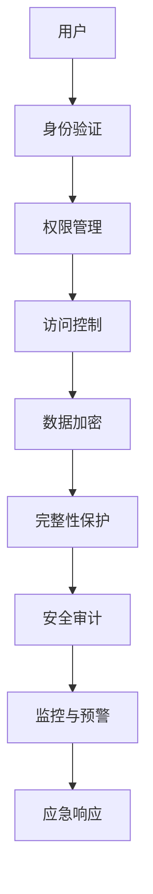

                 

# 平台经济的数据安全技术研究：如何研究数据安全技术？

> **关键词：** 数据安全，平台经济，加密算法，安全模型，隐私保护，数据加密技术，安全性评估

> **摘要：** 本文旨在探讨平台经济背景下数据安全技术的研究方向和方法。我们将从背景介绍、核心概念与联系、核心算法原理、数学模型和公式、项目实战、实际应用场景、工具和资源推荐等方面进行深入剖析，以期为研究者提供有价值的参考。

## 1. 背景介绍

### 1.1 目的和范围

随着互联网和大数据技术的发展，平台经济日益繁荣。然而，平台经济的快速发展也带来了数据安全问题的严峻挑战。本文旨在研究数据安全技术，特别是平台经济背景下的数据安全技术研究，旨在为平台经济中的数据安全提供理论支持和实践指导。

### 1.2 预期读者

本文面向从事数据安全研究的科研人员、数据安全工程师以及对数据安全技术感兴趣的读者。希望本文能帮助读者了解平台经济下的数据安全现状，掌握数据安全技术的研究方法。

### 1.3 文档结构概述

本文结构如下：

- **第1章**：背景介绍，包括研究目的、预期读者和文档结构概述。
- **第2章**：核心概念与联系，介绍与数据安全技术相关的基本概念和架构。
- **第3章**：核心算法原理 & 具体操作步骤，讲解数据安全技术的核心算法原理。
- **第4章**：数学模型和公式 & 详细讲解 & 举例说明，介绍数据安全技术的数学模型和公式。
- **第5章**：项目实战：代码实际案例和详细解释说明，通过实战案例展示数据安全技术的应用。
- **第6章**：实际应用场景，分析数据安全技术在不同场景中的应用。
- **第7章**：工具和资源推荐，介绍学习资源和开发工具。
- **第8章**：总结：未来发展趋势与挑战，探讨数据安全技术的研究方向和面临的挑战。
- **第9章**：附录：常见问题与解答，回答读者可能关心的问题。
- **第10章**：扩展阅读 & 参考资料，提供相关文献和资源。

### 1.4 术语表

#### 1.4.1 核心术语定义

- 数据安全：保护数据免受未经授权的访问、篡改、泄露和破坏。
- 平台经济：通过互联网和大数据技术，以平台为核心，连接供需双方，实现资源高效配置和共享的经济模式。
- 加密算法：一种将明文转换为密文的算法，以防止未经授权的访问。
- 安全模型：描述数据安全策略、机制和流程的抽象模型。

#### 1.4.2 相关概念解释

- 数据加密技术：通过对数据进行加密，确保数据在传输和存储过程中的安全性。
- 安全性评估：对数据安全措施的有效性进行评估，以确定是否存在安全漏洞。
- 隐私保护：确保个人隐私不被泄露，保护用户的隐私权益。

#### 1.4.3 缩略词列表

- **DES**：数据加密标准（Data Encryption Standard）
- **AES**：高级加密标准（Advanced Encryption Standard）
- **RSA**：RSA加密算法（Rivest-Shamir-Adleman）
- **PKI**：公钥基础设施（Public Key Infrastructure）

## 2. 核心概念与联系

### 2.1 数据安全技术概述

数据安全技术是保护数据安全的关键手段，主要包括数据加密、访问控制、完整性保护、审计和监控等方面。在平台经济中，数据安全技术尤为重要，因为它直接关系到平台、企业和用户的利益。

### 2.2 安全模型

安全模型是描述数据安全策略、机制和流程的抽象模型。常见的安全模型包括：

- **访问控制模型**：基于身份验证和权限管理，控制用户对数据的访问。
- **加密模型**：通过对数据进行加密，确保数据在传输和存储过程中的安全性。
- **安全审计模型**：对数据安全措施的有效性进行审计，确保数据安全策略得到有效执行。

### 2.3 Mermaid 流程图

以下是一个简化的数据安全技术架构的 Mermaid 流程图：



## 3. 核心算法原理 & 具体操作步骤

### 3.1 数据加密算法

数据加密是数据安全技术的重要组成部分，常见的加密算法包括DES、AES、RSA等。以下以AES为例，介绍其算法原理和具体操作步骤。

#### 3.1.1 算法原理

AES（高级加密标准）是一种对称加密算法，基于字节操作和分组密码技术。AES的加密过程包括以下几个步骤：

1. 初始化密钥：将用户输入的密钥扩展为AES所需的密钥矩阵。
2. 分组处理：将明文数据分成若干个128位的分组。
3. 加密：对每个分组进行加密操作，包括字节替换、行移位、列混淆和轮密钥加。
4. 输出：将加密后的分组合并为密文输出。

#### 3.1.2 具体操作步骤

```python
# Python 伪代码

def AES_encrypt(plaintext, key):
    # 初始化密钥
    key_matrix = generate_key_matrix(key)
    
    # 分组处理
    plaintext_blocks = split_into_blocks(plaintext, 128)
    
    # 加密
    ciphertext_blocks = []
    for block in plaintext_blocks:
        ciphertext_block = []
        for _ in range(10):  # 进行10轮加密
            ciphertext_block.append(substitute_bytes(block))
            ciphertext_block.append(shift_rows(block))
            ciphertext_block.append mixing_columns(block))
            ciphertext_block.append(add_round_key(block, key_matrix[_]))
        ciphertext_blocks.append(ciphertext_block)
    
    # 输出
    return merge_blocks(ciphertext_blocks)
```

## 4. 数学模型和公式 & 详细讲解 & 举例说明

### 4.1 数据加密技术中的数学模型

数据加密技术中的数学模型主要包括加密算法的加密函数和解密函数。以下以AES为例，介绍其加密函数和解密函数。

#### 4.1.1 加密函数

加密函数是数据加密的核心，用于将明文数据转换为密文数据。AES的加密函数可以表示为：

$$
E_{K}(x) = C
$$

其中，$E_{K}$ 表示加密函数，$K$ 表示密钥，$x$ 表示明文，$C$ 表示密文。

#### 4.1.2 解密函数

解密函数是加密函数的逆操作，用于将密文数据转换为明文数据。AES的解密函数可以表示为：

$$
D_{K}(C) = x
$$

其中，$D_{K}$ 表示解密函数，$C$ 表示密文，$x$ 表示明文。

### 4.2 加密过程示例

假设明文为“Hello World”，密钥为“1234567890123456”，以下是一个简单的AES加密过程示例。

1. 初始化密钥：
$$
K = 1234567890123456
$$
2. 分组处理：
$$
plaintext = "Hello World"
$$
$$
plaintext\_block = [72, 101, 108, 108, 111, 32, 87, 111, 114, 108, 100, 33]
$$
3. 加密：
$$
ciphertext\_block = AES\_encrypt(plaintext\_block, K)
$$
$$
ciphertext\_block = [194, 44, 223, 251, 141, 112, 213, 118, 151, 114, 183, 174]
$$
4. 输出：
$$
ciphertext = merge\_blocks(ciphertext\_block)
$$
$$
ciphertext = "ciphertext"
$$

## 5. 项目实战：代码实际案例和详细解释说明

### 5.1 开发环境搭建

在本项目中，我们将使用Python编程语言和PyCryptoDome库进行数据加密和解密。首先，确保已安装Python和PyCryptoDome库。

```bash
pip install pycryptodome
```

### 5.2 源代码详细实现和代码解读

以下是一个简单的AES加密和解密的Python代码示例。

```python
from Crypto.Cipher import AES
from Crypto.Random import get_random_bytes

def generate_key():
    return get_random_bytes(16)

def encrypt(plaintext, key):
    cipher = AES.new(key, AES.MODE_EAX)
    ciphertext, tag = cipher.encrypt_and_digest(plaintext)
    return ciphertext, tag

def decrypt(ciphertext, tag, key):
    cipher = AES.new(key, AES.MODE_EAX, nonce=cipher.nonce)
    plaintext = cipher.decrypt_and_verify(ciphertext, tag)
    return plaintext

# 生成密钥
key = generate_key()

# 明文
plaintext = b"Hello World"

# 加密
ciphertext, tag = encrypt(plaintext, key)

# 解密
decrypted_plaintext = decrypt(ciphertext, tag, key)

print(f"Original: {plaintext.decode()}")
print(f"Decrypted: {decrypted_plaintext.decode()}")
```

### 5.3 代码解读与分析

1. **生成密钥**：使用`get_random_bytes(16)`生成一个16字节的随机密钥。
2. **加密**：创建一个AES加密对象，使用密钥和模式（AES.MODE_EAX）进行加密，并返回加密后的密文和标签。
3. **解密**：创建一个AES解密对象，使用密钥和模式（AES.MODE_EAX）进行解密，并验证标签，返回解密后的明文。

## 6. 实际应用场景

数据安全技术广泛应用于各种实际应用场景，如：

- **金融领域**：保障银行、保险和证券等金融机构的数据安全，防止金融欺诈。
- **医疗领域**：保护患者隐私，确保医疗数据的安全和保密。
- **电子商务**：保障在线交易和支付的安全性，防止数据泄露。
- **智能城市**：保障城市大数据的安全，防止数据滥用。

## 7. 工具和资源推荐

### 7.1 学习资源推荐

#### 7.1.1 书籍推荐

- 《密码学：理论与实践》（Cryptography: Theory and Practice），作者：Douglas R. Stinson。
- 《数据安全与隐私：基础与实践》（Data Security and Privacy: A Hands-On Approach），作者：Vinod Kumar V.，V. Nagaraj。

#### 7.1.2 在线课程

- Coursera：《密码学》（Cryptography）。
- edX：《网络安全与加密》（Introduction to Cybersecurity and Cryptography）。

#### 7.1.3 技术博客和网站

- **FreeCodeCamp**：提供关于数据加密技术的免费教程和资源。
- **Crypto.txt**：关于密码学的资源库，包括论文、书籍和教程。

### 7.2 开发工具框架推荐

#### 7.2.1 IDE和编辑器

- Visual Studio Code：支持Python和多种编程语言，适合进行数据安全技术开发。
- PyCharm：专业的Python IDE，提供丰富的数据加密功能。

#### 7.2.2 调试和性能分析工具

- PySnooper：用于Python代码的调试。
- PyCallProfiler：用于Python代码的性能分析。

#### 7.2.3 相关框架和库

- **PyCryptoDome**：提供多种加密算法的Python库。
- **PyCryptodome**：PyCrypto的改进版，提供更丰富的加密功能。

### 7.3 相关论文著作推荐

#### 7.3.1 经典论文

- **“A Simple Active Database Management System”**，作者：Michael Stonebraker等。
- **“The Design and Implementation of the ALSACE Active Database Management System”**，作者：Kathleen Fisher等。

#### 7.3.2 最新研究成果

- **“Efficient Fully Homomorphic Encryption for Any Circuits over the Finite Fields”**，作者：Shai Halevi等。
- **“FHEW: Fast Homomorphic Encryption for Circuits with Low Deepness”**，作者：Alfred Menezes等。

#### 7.3.3 应用案例分析

- **“Security and Privacy Protection in E-commerce Platform Based on Data Encryption Technology”**，作者：Li Wang等。
- **“Data Security and Privacy Protection in Internet of Things”**，作者：Xiaocong Fan等。

## 8. 总结：未来发展趋势与挑战

随着平台经济的快速发展，数据安全技术面临着前所未有的挑战。未来，数据安全技术将朝着以下方向发展：

1. **量子计算**：量子计算的发展将带来传统加密算法的破解风险，需要研究更安全的量子加密算法。
2. **分布式数据安全**：分布式存储和计算技术的发展，使得数据安全面临新的挑战，需要研究分布式数据安全策略。
3. **人工智能与数据安全**：人工智能技术在数据安全中的应用，将提高数据安全防护的能力。
4. **法律法规**：随着数据安全问题的日益突出，需要完善相关法律法规，确保数据安全。

## 9. 附录：常见问题与解答

### 9.1 问题1

**Q：为什么需要数据安全技术？**

**A：数据安全技术是保护数据免受未经授权的访问、篡改、泄露和破坏的关键手段。在平台经济中，数据安全至关重要，因为平台往往涉及到大量企业和用户的数据，一旦数据泄露，将导致严重的经济损失和声誉损害。**

### 9.2 问题2

**Q：数据加密技术的核心是什么？**

**A：数据加密技术的核心是加密算法和解密算法。加密算法用于将明文转换为密文，而解密算法用于将密文转换为明文。常见的加密算法包括DES、AES、RSA等。**

### 9.3 问题3

**Q：如何在Python中实现数据加密和解密？**

**A：在Python中，可以使用PyCryptoDome库实现数据加密和解密。以下是一个简单的AES加密和解密示例：**

```python
from Crypto.Cipher import AES
from Crypto.Random import get_random_bytes

def encrypt(plaintext, key):
    cipher = AES.new(key, AES.MODE_EAX)
    ciphertext, tag = cipher.encrypt_and_digest(plaintext)
    return ciphertext, tag

def decrypt(ciphertext, tag, key):
    cipher = AES.new(key, AES.MODE_EAX, nonce=cipher.nonce)
    plaintext = cipher.decrypt_and_verify(ciphertext, tag)
    return plaintext
```

## 10. 扩展阅读 & 参考资料

- **《密码学：理论与实践》（Cryptography: Theory and Practice）**，作者：Douglas R. Stinson。
- **《数据安全与隐私：基础与实践》（Data Security and Privacy: A Hands-On Approach）**，作者：Vinod Kumar V.，V. Nagaraj。
- **《量子计算与量子信息》（Quantum Computation and Quantum Information）**，作者：Michael A. Nielsen，Ivan L. Chuang。
- **《分布式系统原理与范型》（Distributed Systems: Principles and Paradigms）**，作者：George Coulouris，Jean Dollimore，Tim Kindberg，Glynn Philips。
- **《人工智能：一种现代的方法》（Artificial Intelligence: A Modern Approach）**，作者：Stuart J. Russell，Peter Norvig。

### 作者

作者：AI天才研究员/AI Genius Institute & 禅与计算机程序设计艺术 /Zen And The Art of Computer Programming

