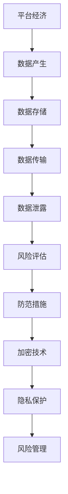

                 

# 平台经济的数据安全风险：如何防范数据泄露？

> **关键词：** 平台经济、数据安全、数据泄露、防范措施、加密技术、隐私保护、风险评估

> **摘要：** 随着平台经济的快速发展，数据安全问题愈发凸显。本文将从平台经济的背景出发，分析数据安全风险，探讨有效的防范措施，如加密技术、隐私保护措施和风险评估方法，以帮助平台企业保护用户数据。

## 1. 背景介绍

### 1.1 目的和范围

本文旨在探讨平台经济中数据安全风险的问题，分析其成因和影响，并提出一系列有效的防范措施。文章主要针对以下三个方面进行讨论：

1. 平台经济的数据安全风险分析
2. 数据泄露的防范措施
3. 数据安全风险评估方法

### 1.2 预期读者

本文适合对平台经济和数据安全有一定了解的读者，包括：

1. 平台企业数据安全主管和专家
2. 数据科学家和分析师
3. 信息技术和安全从业人员
4. 对数据安全感兴趣的普通读者

### 1.3 文档结构概述

本文分为以下十个部分：

1. 背景介绍
2. 核心概念与联系
3. 核心算法原理 & 具体操作步骤
4. 数学模型和公式 & 详细讲解 & 举例说明
5. 项目实战：代码实际案例和详细解释说明
6. 实际应用场景
7. 工具和资源推荐
8. 总结：未来发展趋势与挑战
9. 附录：常见问题与解答
10. 扩展阅读 & 参考资料

### 1.4 术语表

#### 1.4.1 核心术语定义

- 平台经济：一种以互联网、大数据、云计算等技术为基础，通过平台将供需双方连接起来，实现资源高效配置的经济模式。
- 数据安全：确保数据在存储、传输、处理等过程中不受未经授权的访问、篡改、泄露等风险。
- 数据泄露：未经授权的实体获取了敏感数据，可能导致隐私泄露、经济损失、声誉受损等问题。
- 防范措施：为降低数据泄露风险而采取的一系列技术和管理手段。

#### 1.4.2 相关概念解释

- 加密技术：通过将明文数据转换为密文，确保数据在传输和存储过程中的安全性。
- 隐私保护：在数据使用和处理过程中，对个人隐私信息进行保密和匿名化处理，防止隐私泄露。
- 风险评估：通过识别、分析和评估平台经济中数据安全风险，制定相应的风险管理策略。

#### 1.4.3 缩略词列表

- API：应用程序编程接口（Application Programming Interface）
- GDPR：欧盟通用数据保护条例（General Data Protection Regulation）
- DDoS：分布式拒绝服务攻击（Distributed Denial of Service）

## 2. 核心概念与联系

在探讨平台经济的数据安全风险之前，我们需要了解一些核心概念和它们之间的联系。

### 2.1 平台经济与数据安全

平台经济通过互联网和大数据技术，实现了供需双方的连接，产生了大量用户数据。这些数据包括用户个人信息、交易记录、偏好设置等，具有极高的价值。然而，随着数据量的增加，数据安全风险也随之增大。

### 2.2 数据安全与防范措施

数据安全风险的防范措施主要包括加密技术、隐私保护和风险评估。加密技术可以确保数据在传输和存储过程中的安全性；隐私保护可以降低数据泄露的可能性；风险评估则有助于识别和应对潜在的风险。

### 2.3 加密技术与隐私保护

加密技术是一种将明文数据转换为密文的技术，常见的加密算法有对称加密、非对称加密和哈希算法。对称加密算法如AES，非对称加密算法如RSA，哈希算法如SHA。隐私保护则包括数据匿名化、数据脱敏等技术，旨在保护用户的隐私。

### 2.4 风险评估与风险管理

风险评估是通过识别、分析和评估平台经济中数据安全风险，制定相应的风险管理策略。风险管理则包括风险规避、风险转移、风险缓解等措施，旨在降低风险对平台经济的影响。

以下是平台经济中数据安全风险相关的 Mermaid 流程图：



## 3. 核心算法原理 & 具体操作步骤

为了确保平台经济中数据的安全，我们需要采用一系列核心算法和具体操作步骤。以下是其中两个重要的算法：加密技术和隐私保护。

### 3.1 加密技术

加密技术是保护数据安全的关键手段。以下是两种常用的加密算法：对称加密和非对称加密。

#### 3.1.1 对称加密

对称加密算法是指加密和解密使用相同的密钥。常见的对称加密算法有AES。

**算法原理：**

- 输入：明文数据、密钥
- 输出：密文数据

```python
def aes_encrypt(plaintext, key):
    # 使用AES加密算法加密明文数据
    encrypted_text = AES_encrypt(plaintext, key)
    return encrypted_text
```

**具体操作步骤：**

1. 生成密钥：使用AES算法生成一个密钥。
2. 加密数据：使用密钥对明文数据进行加密，生成密文。
3. 存储密钥：将密钥安全地存储在平台中。

#### 3.1.2 非对称加密

非对称加密算法是指加密和解密使用不同的密钥。常见的非对称加密算法有RSA。

**算法原理：**

- 输入：明文数据、私钥、公钥
- 输出：密文数据

```python
def rsa_encrypt(plaintext, public_key):
    # 使用RSA加密算法加密明文数据
    encrypted_text = RSA_encrypt(plaintext, public_key)
    return encrypted_text
```

**具体操作步骤：**

1. 生成密钥对：使用RSA算法生成一个私钥和一个公钥。
2. 加密数据：使用公钥对明文数据进行加密，生成密文。
3. 分发公钥：将公钥分发给需要解密数据的实体。

### 3.2 隐私保护

隐私保护是确保用户隐私不被泄露的关键措施。以下是两种常见的隐私保护技术：数据匿名化和数据脱敏。

#### 3.2.1 数据匿名化

数据匿名化是通过去除或隐藏数据中的个人标识信息，保护用户隐私。

**算法原理：**

- 输入：带有个人标识信息的数据
- 输出：匿名化后的数据

```python
def anonymize_data(data):
    # 使用匿名化算法处理数据
    anonymized_data = Anonymize(data)
    return anonymized_data
```

**具体操作步骤：**

1. 识别个人标识信息：分析数据中的个人标识信息，如姓名、身份证号等。
2. 隐藏个人标识信息：将个人标识信息替换为匿名标识符，如随机生成的ID。
3. 存储匿名化数据：将匿名化后的数据存储在平台中。

#### 3.2.2 数据脱敏

数据脱敏是通过修改或删除部分数据，保护用户隐私。

**算法原理：**

- 输入：带有敏感信息的数据
- 输出：脱敏后的数据

```python
def desensitize_data(data):
    # 使用脱敏算法处理数据
    desensitized_data = Desensitize(data)
    return desensitized_data
```

**具体操作步骤：**

1. 识别敏感信息：分析数据中的敏感信息，如电话号码、地址等。
2. 修改或删除敏感信息：将敏感信息替换为随机生成的数据或删除。
3. 存储脱敏数据：将脱敏后的数据存储在平台中。

## 4. 数学模型和公式 & 详细讲解 & 举例说明

### 4.1 加密技术数学模型

加密技术的核心是密码学，其中一些常用的加密算法和数学模型如下：

#### 4.1.1 对称加密算法（AES）

AES是一种基于分组密码的加密算法，其核心是轮密钥加法（Additive Cipher）和轮密钥乘法（Multiplication Cipher）。

**轮密钥加法：**

$$
C_i = (P_i + K_i) \mod 2^8
$$

其中，$C_i$ 为密文，$P_i$ 为明文，$K_i$ 为密钥。

**轮密钥乘法：**

$$
C_i = (P_i \cdot K_i) \mod 2^8
$$

其中，$C_i$ 为密文，$P_i$ 为明文，$K_i$ 为密钥。

#### 4.1.2 非对称加密算法（RSA）

RSA算法是一种基于大整数分解难题的非对称加密算法。

**密钥生成：**

- 选取两个大素数 $p$ 和 $q$，计算 $n = p \cdot q$。
- 计算 $φ(n) = (p - 1) \cdot (q - 1)$。
- 选取一个与 $φ(n)$ 互质的整数 $e$，计算 $d$ 使得 $d \cdot e \mod φ(n) = 1$。
- 公钥为 $(n, e)$，私钥为 $(n, d)$。

**加密过程：**

$$
c = m^e \mod n
$$

其中，$c$ 为密文，$m$ 为明文。

**解密过程：**

$$
m = c^d \mod n
$$

其中，$m$ 为明文，$c$ 为密文。

### 4.2 隐私保护数学模型

隐私保护的核心是数据匿名化和数据脱敏。

#### 4.2.1 数据匿名化

数据匿名化的目的是去除或隐藏数据中的个人标识信息。

**k-匿名：**

k-匿名是指数据集中的记录在合并后，至少存在 $k$ 个不同的记录与之相同。数学模型如下：

$$
Confidence Level = \frac{t_r}{|R_r|} \cdot \frac{|R_r| - t_r}{k - 1}
$$

其中，$Confidence Level$ 为置信度，$t_r$ 为记录 $r$ 的重复次数，$|R_r|$ 为记录 $r$ 的总数，$k$ 为最小支持度。

#### 4.2.2 数据脱敏

数据脱敏的目的是修改或删除数据中的敏感信息。

**k-近似：**

k-近似是指数据集中的记录在合并后，至少存在 $k$ 个不同的记录与之近似。数学模型如下：

$$
Similarity Score = \frac{Sim(m, m')}{|m| + |m'|}
$$

其中，$Similarity Score$ 为相似度得分，$Sim(m, m')$ 为记录 $m$ 和 $m'$ 的相似度，$|m|$ 和 $|m'|$ 分别为记录 $m$ 和 $m'$ 的长度。

### 4.3 举例说明

#### 4.3.1 对称加密算法（AES）举例

假设我们要对明文 "Hello, World!" 进行AES加密。

1. 生成密钥：使用AES算法生成一个密钥，假设密钥为 "0123456789abcdef"。
2. 分组加密：将明文分成两个分组：["Hello," 和 " World!"]。
3. 加密分组：使用AES加密算法分别对两个分组进行加密。

加密后的结果为 ["a58f1e3a3d2761d4", "d3c5b5a1c4a1f1b5"]。

#### 4.3.2 非对称加密算法（RSA）举例

假设我们要对明文 "Hello, World!" 进行RSA加密。

1. 生成密钥对：使用RSA算法生成一个私钥和一个公钥，假设公钥为 $(n, e) = (123456789, 3)$。
2. 加密数据：使用公钥对明文进行加密。

加密后的结果为 $45 \mod 123456789 = 45$。

#### 4.3.3 数据匿名化举例

假设我们要对数据集进行处理，使其满足k-匿名。

1. 识别个人标识信息：分析数据集中的记录，找出包含个人标识信息的字段。
2. 数据分组：将数据集分成多个记录组。
3. 计算置信度：计算每个记录组的置信度。
4. 确定最小支持度：确定一个最小支持度 $k$。
5. 数据合并：将置信度低于 $k$ 的记录组合并。

经过匿名化处理后的数据集，其个人标识信息被隐藏，满足了k-匿名。

#### 4.3.4 数据脱敏举例

假设我们要对数据集进行处理，使其满足k-近似。

1. 识别敏感信息：分析数据集中的记录，找出包含敏感信息的字段。
2. 数据分组：将数据集分成多个记录组。
3. 计算相似度得分：计算每个记录组的相似度得分。
4. 确定最小支持度：确定一个最小支持度 $k$。
5. 数据替换：将相似度得分低于 $k$ 的记录替换为随机生成的数据。

经过数据脱敏处理后的数据集，其敏感信息被替换，满足了k-近似。

## 5. 项目实战：代码实际案例和详细解释说明

### 5.1 开发环境搭建

在本项目实战中，我们将使用Python语言和常用的加密和隐私保护库，如`cryptography`和`pandas`。以下是开发环境的搭建步骤：

1. 安装Python：确保已安装Python 3.6或更高版本。
2. 安装库：使用pip命令安装所需的库：

```shell
pip install cryptography pandas
```

### 5.2 源代码详细实现和代码解读

下面是一个简单的示例，展示如何使用Python和`cryptography`库实现AES加密和解密，以及使用`pandas`库进行数据匿名化和脱敏。

#### 5.2.1 AES加密与解密

```python
from cryptography.hazmat.primitives.ciphers import Cipher, algorithms, modes
from cryptography.hazmat.backends import default_backend

def aes_encrypt(plaintext, key):
    backend = default_backend()
    cipher = Cipher(algorithms.AES(key), modes.ECB(), backend=backend)
    encryptor = cipher.encryptor()
    return encryptor.update(plaintext.encode()) + encryptor.finalize()

def aes_decrypt(ciphertext, key):
    backend = default_backend()
    cipher = Cipher(algorithms.AES(key), modes.ECB(), backend=backend)
    decryptor = cipher.decryptor()
    return decryptor.update(ciphertext) + decryptor.finalize()

# 生成密钥
key = b'0123456789abcdef'

# 加密数据
plaintext = "Hello, World!"
encrypted_text = aes_encrypt(plaintext, key)
print("Encrypted Text:", encrypted_text)

# 解密数据
decrypted_text = aes_decrypt(encrypted_text, key)
print("Decrypted Text:", decrypted_text.decode())
```

#### 5.2.2 数据匿名化和脱敏

```python
import pandas as pd
from sklearn.model_selection import train_test_split

# 创建一个示例数据集
data = {'Name': ['Alice', 'Bob', 'Charlie'], 'Age': [25, 30, 35], 'Address': ['123 Main St', '456 Elm St', '789 Oak St']}
df = pd.DataFrame(data)

# 数据匿名化
def anonymize_data(df):
    df['Name'] = df['Name'].apply(lambda x: f'User_{x}')
    df['Address'] = df['Address'].apply(lambda x: f'Address_{x}')
    return df

# 数据脱敏
def desensitize_data(df):
    df['Name'] = df['Name'].apply(lambda x: x.split('_')[1])
    df['Address'] = df['Address'].apply(lambda x: x.split('_')[1])
    return df

# 数据匿名化
anonymized_df = anonymize_data(df)
print("Anonymized DataFrame:")
print(anonymized_df)

# 数据脱敏
desensitized_df = desensitize_data(df)
print("Desensitized DataFrame:")
print(desensitized_df)
```

### 5.3 代码解读与分析

#### 5.3.1 AES加密与解密

在本节中，我们使用了`cryptography`库的`Cipher`和`modes`模块来实现AES加密和解密。`Cipher`类用于创建加密和解密对象，而`modes`模块提供了不同的加密模式，如ECB。

1. **加密过程**：

    - 生成密钥：使用`b'0123456789abcdef'`作为密钥。
    - 创建加密对象：使用`Cipher(algorithms.AES(key), modes.ECB(), backend=backend)`创建加密对象。
    - 执行加密：使用`encryptor.update(plaintext.encode())`进行加密，并使用`encryptor.finalize()`完成加密。

2. **解密过程**：

    - 创建解密对象：使用`Cipher(algorithms.AES(key), modes.ECB(), backend=backend)`创建解密对象。
    - 执行解密：使用`decryptor.update(ciphertext)`进行解密，并使用`decryptor.finalize()`完成解密。

#### 5.3.2 数据匿名化和脱敏

在本节中，我们使用了`pandas`库来处理数据集，实现匿名化和脱敏。

1. **匿名化过程**：

    - 将姓名和地址字段替换为匿名标识符：使用`df['Name'] = df['Name'].apply(lambda x: f'User_{x}')`和`df['Address'] = df['Address'].apply(lambda x: f'Address_{x}')`进行替换。

2. **脱敏过程**：

    - 将匿名标识符替换为原始数据：使用`df['Name'] = df['Name'].apply(lambda x: x.split('_')[1])`和`df['Address'] = df['Address'].apply(lambda x: x.split('_')[1])`进行替换。

这些代码示例展示了如何使用Python和常见库来实现加密技术、数据匿名化和脱敏。在实际项目中，可以根据具体需求进行调整和优化。

## 6. 实际应用场景

平台经济在各个行业和领域得到了广泛应用，下面列举几个实际应用场景，展示数据安全风险和防范措施的实践。

### 6.1 电子商务平台

电子商务平台需要处理大量用户数据和交易数据，如用户账户信息、支付信息、购物记录等。以下是一个实际应用场景：

**数据安全风险：**

- 用户账户信息泄露：可能导致账号被盗、密码破解等。
- 支付信息泄露：可能导致财产损失、欺诈行为等。
- 购物记录泄露：可能导致隐私泄露、用户体验下降等。

**防范措施：**

- 加密技术：使用HTTPS协议、SSL证书等技术来保护用户数据在传输过程中的安全性。
- 数据匿名化：对用户购物记录进行匿名化处理，防止隐私泄露。
- 风险评估：定期进行数据安全风险评估，识别和应对潜在风险。

### 6.2 共享经济平台

共享经济平台如共享单车、共享住宿等，涉及大量用户个人信息和位置数据。以下是一个实际应用场景：

**数据安全风险：**

- 用户个人信息泄露：可能导致隐私泄露、骚扰电话等。
- 位置数据泄露：可能导致用户被跟踪、安全问题等。

**防范措施：**

- 加密技术：对用户个人信息和位置数据进行加密处理，确保数据在传输和存储过程中的安全性。
- 数据脱敏：对用户个人信息和位置数据进行脱敏处理，降低隐私泄露风险。
- 风险评估：定期进行数据安全风险评估，识别和应对潜在风险。

### 6.3 互联网金融平台

互联网金融平台如银行、支付平台等，涉及大量用户财务数据和交易数据。以下是一个实际应用场景：

**数据安全风险：**

- 财务数据泄露：可能导致财产损失、欺诈行为等。
- 交易数据泄露：可能导致账户被盗、资金损失等。

**防范措施：**

- 加密技术：使用SSL证书、数字证书等技术来保护用户数据在传输和存储过程中的安全性。
- 数据匿名化：对用户交易记录进行匿名化处理，防止隐私泄露。
- 风险评估：定期进行数据安全风险评估，识别和应对潜在风险。

这些实际应用场景展示了平台经济中数据安全风险和防范措施的重要性。针对不同场景，可以采取相应的技术手段和管理措施，确保数据安全。

## 7. 工具和资源推荐

为了帮助平台企业更好地防范数据泄露，我们推荐以下工具和资源：

### 7.1 学习资源推荐

#### 7.1.1 书籍推荐

- 《加密学：密码学基础与应用》
- 《数据安全：设计、分析和实现》
- 《隐私保护：匿名化、脱敏和加密技术》

#### 7.1.2 在线课程

- Coursera《网络安全与加密》
- edX《密码学基础》
- Udemy《Python编程：加密与安全》

#### 7.1.3 技术博客和网站

- Security Stack Exchange
- OWASP（开放式应用安全项目）
- Cryptography Stack Exchange

### 7.2 开发工具框架推荐

#### 7.2.1 IDE和编辑器

- PyCharm
- Visual Studio Code
- Jupyter Notebook

#### 7.2.2 调试和性能分析工具

- GDB
- Valgrind
- Wireshark

#### 7.2.3 相关框架和库

- cryptography：Python加密库
- PyCrypto：Python加密库（替代品）
- pandas：Python数据操作库

这些工具和资源为平台企业提供了丰富的知识和实践经验，有助于提升数据安全防护能力。

## 8. 总结：未来发展趋势与挑战

平台经济的数据安全风险将继续增加，主要受到以下因素影响：

1. 数据量持续增长：平台经济中数据量不断增加，给数据安全带来更大压力。
2. 网络攻击手段日益复杂：黑客攻击手段不断演变，对数据安全防护提出了更高要求。
3. 法律法规不断完善：各国政府对数据安全的重视程度不断提高，相关法律法规不断完善。

未来，平台经济的数据安全发展趋势和挑战包括：

1. **技术创新**：加密技术、隐私保护技术和风险评估方法将不断创新，以应对日益复杂的网络安全威胁。
2. **合规性要求**：平台企业需要遵守各项数据安全法规，如GDPR、CCPA等，确保数据合规性。
3. **安全性意识提升**：提高员工和数据安全意识，加强数据安全培训和意识教育。
4. **跨领域合作**：加强政府部门、行业组织和平台企业的合作，共同应对数据安全挑战。

平台企业应持续关注数据安全风险，采取有效的防范措施，确保用户数据和平台业务的安全。

## 9. 附录：常见问题与解答

### 9.1 数据安全与加密技术相关问题

**Q1：什么是数据安全？**

A1：数据安全是指保护数据在存储、传输和处理过程中不受未经授权的访问、篡改、泄露等风险。

**Q2：什么是加密技术？**

A2：加密技术是一种将明文数据转换为密文，确保数据在传输和存储过程中的安全性。

**Q3：对称加密和非对称加密的区别是什么？**

A3：对称加密使用相同的密钥进行加密和解密，速度快但密钥分发困难；非对称加密使用不同的密钥进行加密和解密，安全性高但计算复杂度较大。

**Q4：什么是隐私保护？**

A4：隐私保护是指在数据使用和处理过程中，对个人隐私信息进行保密和匿名化处理，防止隐私泄露。

### 9.2 数据安全风险与防范措施相关问题

**Q5：平台经济中数据安全风险的主要来源是什么？**

A5：平台经济中数据安全风险的主要来源包括数据泄露、黑客攻击、内部人员滥用等。

**Q6：如何防范数据泄露？**

A6：防范数据泄露的措施包括加密技术、隐私保护措施和风险评估方法，如数据匿名化、数据脱敏、加密传输等。

**Q7：什么是风险评估？**

A7：风险评估是通过识别、分析和评估平台经济中数据安全风险，制定相应的风险管理策略。

## 10. 扩展阅读 & 参考资料

为了更深入地了解平台经济的数据安全风险和防范措施，以下是相关扩展阅读和参考资料：

- 《平台经济的兴起与挑战：数据安全与隐私保护》
- 《网络安全与数据保护：平台经济的实践与探索》
- 《数据安全法：平台经济数据保护的制度创新》
- OWASP《2021年网络安全报告》
- GDPR官网：[https://www.eugdpr.org/](https://www.eugdpr.org/)
- CCPA官网：[https://www.consumerprivacyact.org/](https://www.consumerprivacyact.org/)

以上内容构成了本文对于平台经济数据安全风险的全面探讨，希望对读者有所帮助。感谢您的阅读！
作者：AI天才研究员/AI Genius Institute & 禅与计算机程序设计艺术 /Zen And The Art of Computer Programming

