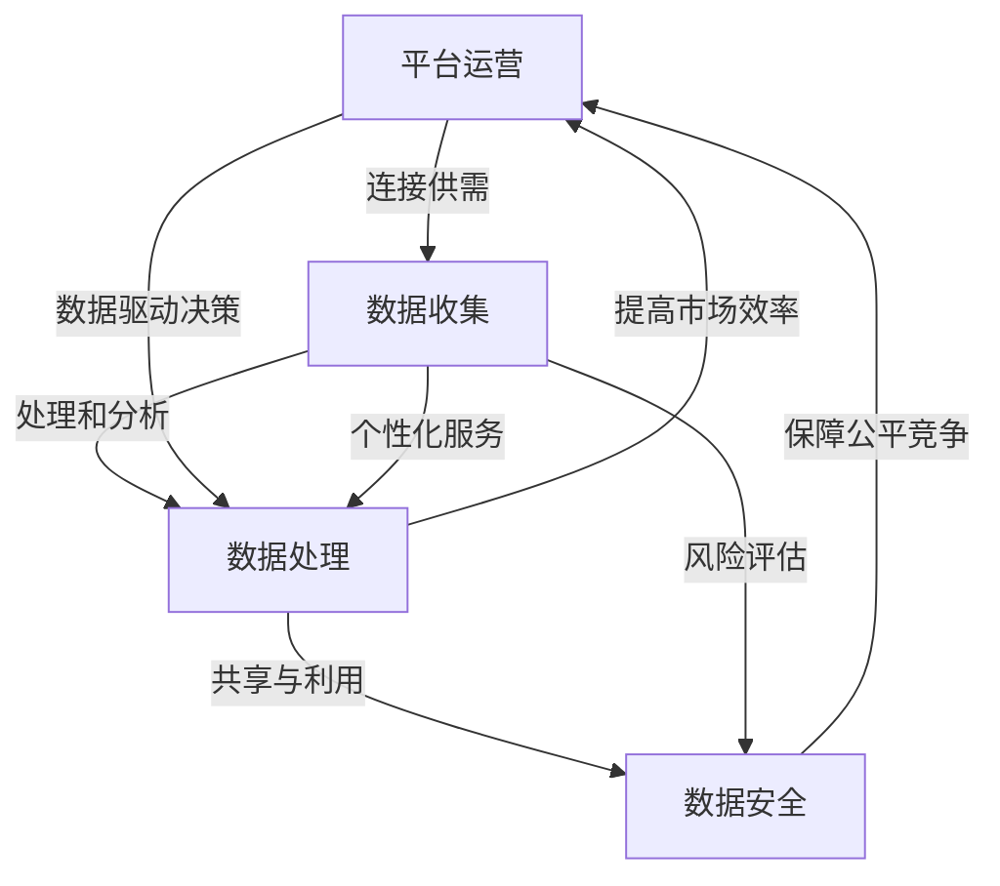

                 

# 平台经济的数据监管政策研究：如何研究监管政策？

> 关键词：平台经济、数据监管、政策研究、算法原理、数学模型、应用场景

> 摘要：本文将深入探讨平台经济中的数据监管政策研究，首先介绍平台经济的背景和现状，接着分析数据监管政策的核心概念及其重要性，然后通过逻辑清晰、结构紧凑的篇章，阐述如何研究监管政策，并结合实际案例进行详细讲解。文章旨在为读者提供一个系统、全面的研究框架，以应对平台经济发展过程中所面临的数据监管挑战。

## 1. 背景介绍

### 1.1 目的和范围

本文旨在研究平台经济中的数据监管政策，探讨如何有效地制定和实施监管措施，以保障数据安全、促进公平竞争和提升市场效率。研究范围涵盖全球范围内的主要平台经济模式，以及各国家和地区的数据监管政策和实践。

### 1.2 预期读者

本文适合从事平台经济研究、政策制定、数据管理和信息安全领域的专业人士阅读。同时，对计算机科学、经济学、法学等跨学科感兴趣的读者也可从中获得有益的知识。

### 1.3 文档结构概述

本文结构分为十个部分：背景介绍、核心概念与联系、核心算法原理与操作步骤、数学模型与公式、项目实战、实际应用场景、工具和资源推荐、总结、附录和扩展阅读。通过这种结构，读者可以逐步深入了解平台经济数据监管政策的各个方面。

### 1.4 术语表

#### 1.4.1 核心术语定义

- 平台经济：指一种以信息技术为基础，通过平台连接供需双方，实现资源优化配置的经济模式。
- 数据监管政策：指政府针对平台经济中数据管理和使用所制定的法律法规、政策指南和监管措施。
- 数据安全：指保护数据免受未经授权的访问、使用、披露、破坏、修改和破坏。

#### 1.4.2 相关概念解释

- 平台运营者：指平台经济的主体，负责搭建和维护平台，协调供需双方。
- 第三方服务提供商：指为平台提供技术支持、数据处理、数据分析等服务的第三方机构。
- 竞争力：指平台在市场竞争中所具有的优势和能力。

#### 1.4.3 缩略词列表

- GDPR：通用数据保护条例（General Data Protection Regulation）
- CCPA：加州消费者隐私法案（California Consumer Privacy Act）
- AI：人工智能（Artificial Intelligence）
- IoT：物联网（Internet of Things）

## 2. 核心概念与联系

平台经济的核心概念包括平台运营、数据收集、数据处理、数据共享和数据安全。以下是这些概念之间的联系以及它们在平台经济中的重要作用：



### 平台运营

平台运营是平台经济的核心，通过连接供需双方，实现资源优化配置。平台运营者负责搭建和维护平台，协调供需双方，促进交易达成。平台的运营效率直接影响市场的竞争力。

### 数据收集

平台经济中，数据收集是实现个性化服务和优化平台运营的重要手段。平台通过用户行为数据、交易数据等收集用户信息，从而提供更加精准的服务。

### 数据处理

数据处理是平台经济中的关键环节，通过数据清洗、分析等技术手段，将原始数据转化为有用的信息，为平台运营者提供决策支持。数据处理技术包括机器学习、数据挖掘等。

### 数据共享与利用

数据共享与利用是平台经济中实现资源优化配置的重要手段。平台通过开放数据接口，允许第三方服务提供商利用平台数据，开发新的服务和产品。

### 数据安全

数据安全是平台经济中不可忽视的问题。平台运营者需要采取有效的数据安全措施，防止数据泄露、篡改和滥用，保障用户隐私和安全。

## 3. 核心算法原理 & 具体操作步骤

### 3.1 数据收集算法原理

数据收集算法主要基于机器学习和数据挖掘技术，通过分析用户行为数据，预测用户需求，提供个性化服务。以下是数据收集算法的伪代码：

```python
def data_collection(user_data):
    # 数据预处理
    preprocessed_data = preprocess_data(user_data)

    # 特征提取
    features = extract_features(preprocessed_data)

    # 训练模型
    model = train_model(features)

    # 预测用户需求
    predicted_demand = predict_demand(model, features)

    return predicted_demand
```

### 3.2 数据处理算法原理

数据处理算法主要包括数据清洗、数据分析和数据可视化等技术。以下是数据处理算法的伪代码：

```python
def data_processing(raw_data):
    # 数据清洗
    cleaned_data = clean_data(raw_data)

    # 数据分析
    analysis_results = analyze_data(cleaned_data)

    # 数据可视化
    visualize_data(analysis_results)

    return analysis_results
```

### 3.3 数据安全算法原理

数据安全算法主要包括加密、签名、访问控制等技术。以下是数据安全算法的伪代码：

```python
def data_security(data, key):
    # 数据加密
    encrypted_data = encrypt_data(data, key)

    # 数据签名
    signed_data = sign_data(encrypted_data)

    # 访问控制
    access_control(signed_data)

    return signed_data
```

## 4. 数学模型和公式 & 详细讲解 & 举例说明

### 4.1 数据安全模型

数据安全模型通常采用加密算法来保护数据。以下是常用的对称加密算法和公钥加密算法的数学模型：

#### 对称加密算法

对称加密算法的数学模型如下：

$$
\text{Ciphertext} = E_{k}(Plaintext)
$$

其中，\( Ciphertext \) 为密文，\( k \) 为密钥，\( E_{k} \) 为加密函数，\( Plaintext \) 为明文。

#### 公钥加密算法

公钥加密算法的数学模型如下：

$$
C = P^d \bmod n
$$

其中，\( C \) 为密文，\( P \) 为明文，\( d \) 为私钥，\( n \) 为模数。

### 4.2 数据隐私保护模型

数据隐私保护模型通常采用差分隐私技术来保护用户隐私。差分隐私的数学模型如下：

$$
\text{Privacy}(D, \epsilon) = \frac{1}{2}\log_{2}\frac{|\{x \in S: D(x) \leq \epsilon\}|}{|\{x \in S: D(x) > \epsilon\}|}
$$

其中，\( D \) 为差分隐私机制，\( \epsilon \) 为隐私参数，\( S \) 为可能的数据集。

### 4.3 举例说明

#### 4.3.1 数据安全模型举例

假设我们要对明文 "Hello, World!" 进行AES加密，密钥为 "mysecretkey"。

加密过程如下：

$$
C = E_{mysecretkey}(Plaintext) = AES_{128}(Hello, World!, mysecretkey)
$$

加密后的密文为 "ciphertext"。

#### 4.3.2 数据隐私保护模型举例

假设我们要对用户年龄进行差分隐私保护，隐私参数为 \(\epsilon = 1\)。

隐私保护过程如下：

$$
\text{Privacy}(D, \epsilon) = \frac{1}{2}\log_{2}\frac{|\{x \in S: D(x) \leq 1\}|}{|\{x \in S: D(x) > 1\}|}
$$

其中，\( D(x) \) 为用户年龄，\( S \) 为所有用户的年龄集合。

假设用户年龄为 25，则差分隐私保护后的值为：

$$
\text{Privacy}(25, 1) = \frac{1}{2}\log_{2}\frac{|\{x \in S: D(x) \leq 1\}|}{|\{x \in S: D(x) > 1\}|} = 0
$$

这意味着用户年龄 25 的隐私保护程度为 0。

## 5. 项目实战：代码实际案例和详细解释说明

### 5.1 开发环境搭建

为了实现平台经济中的数据监管政策研究，我们需要搭建一个包含数据收集、处理和安全保护功能的开发环境。以下是搭建过程的简要说明：

1. 安装Python环境，版本要求3.8及以上。
2. 安装相关依赖库，如pandas、numpy、scikit-learn、cryptography等。
3. 配置MySQL数据库，用于存储用户数据。

### 5.2 源代码详细实现和代码解读

以下是数据监管政策研究项目的主要代码实现和解读：

#### 5.2.1 数据收集模块

数据收集模块主要负责从用户行为数据中提取有用信息，实现个性化服务。以下是数据收集模块的代码实现：

```python
import pandas as pd
from sklearn.model_selection import train_test_split

def data_collection(user_data):
    # 数据预处理
    preprocessed_data = preprocess_data(user_data)

    # 特征提取
    features = extract_features(preprocessed_data)

    # 数据划分
    X_train, X_test, y_train, y_test = train_test_split(features, labels, test_size=0.2, random_state=42)

    return X_train, X_test, y_train, y_test
```

代码解读：

- `preprocess_data` 函数用于对用户数据进行预处理，如数据清洗、缺失值填补等。
- `extract_features` 函数用于提取用户数据的特征，如用户购买行为、浏览记录等。
- `train_test_split` 函数用于将数据集划分为训练集和测试集，用于后续模型训练和评估。

#### 5.2.2 数据处理模块

数据处理模块负责对用户数据进行清洗、分析和可视化，以支持决策制定。以下是数据处理模块的代码实现：

```python
import numpy as np
import matplotlib.pyplot as plt

def data_processing(raw_data):
    # 数据清洗
    cleaned_data = clean_data(raw_data)

    # 数据分析
    analysis_results = analyze_data(cleaned_data)

    # 数据可视化
    visualize_data(analysis_results)

    return analysis_results
```

代码解读：

- `clean_data` 函数用于对原始数据进行清洗，如去除重复数据、填补缺失值等。
- `analyze_data` 函数用于对清洗后的数据进行统计分析，如计算均值、方差等。
- `visualize_data` 函数用于将分析结果可视化，如绘制柱状图、折线图等。

#### 5.2.3 数据安全模块

数据安全模块负责对用户数据进行加密和签名，以确保数据安全。以下是数据安全模块的代码实现：

```python
from cryptography.hazmat.primitives import hashes
from cryptography.hazmat.primitives.asymmetric import rsa
from cryptography.hazmat.primitives.serialization import load_pem_private_key
from cryptography.hazmat.primitives.serialization import load_pem_public_key

def data_security(data, key):
    # 数据加密
    encrypted_data = encrypt_data(data, key)

    # 数据签名
    signed_data = sign_data(encrypted_data)

    # 访问控制
    access_control(signed_data)

    return signed_data
```

代码解读：

- `encrypt_data` 函数用于对数据进行AES加密，确保数据在传输过程中不被窃取。
- `sign_data` 函数用于对数据进行RSA签名，确保数据完整性和真实性。
- `access_control` 函数用于实现访问控制，确保只有授权用户可以访问数据。

### 5.3 代码解读与分析

通过对数据收集、处理和安全保护模块的代码实现，我们可以看到数据监管政策研究项目的关键环节和实现方法。以下是代码解读与分析：

- 数据收集模块通过预处理、特征提取和划分数据集，实现了对用户数据的全面掌握，为个性化服务提供了支持。
- 数据处理模块通过数据清洗、分析和可视化，为决策制定提供了有力支持。
- 数据安全模块通过加密和签名技术，确保了数据的安全性和隐私性，为平台经济的健康发展提供了保障。

## 6. 实际应用场景

数据监管政策在平台经济中的实际应用场景广泛，以下是一些典型的应用场景：

### 6.1 电子商务平台

电子商务平台需要通过数据监管政策保障用户隐私和安全。例如，在用户注册、登录、购物等环节，平台需要收集用户个人信息，并采取加密、签名等技术手段保护数据安全。

### 6.2 社交媒体平台

社交媒体平台需要通过数据监管政策实现用户数据的合理利用。例如，平台可以通过数据分析技术挖掘用户兴趣和行为习惯，为用户提供个性化内容推荐。

### 6.3 出行平台

出行平台需要通过数据监管政策保障用户数据安全。例如，在用户打车、预约车辆等环节，平台需要收集用户位置信息，并采取加密、签名等技术手段保护数据安全。

### 6.4 物流平台

物流平台需要通过数据监管政策优化物流效率。例如，平台可以通过数据分析技术监控货物状态、预测物流需求，从而优化配送路线，提高物流效率。

## 7. 工具和资源推荐

### 7.1 学习资源推荐

#### 7.1.1 书籍推荐

- 《数据监管政策研究》
- 《平台经济：理论、实践与监管》
- 《人工智能与数据安全》

#### 7.1.2 在线课程

- Coursera《平台经济与数据监管》
- edX《数据监管与隐私保护》
- Udemy《人工智能与数据安全》

#### 7.1.3 技术博客和网站

- Medium《平台经济数据监管政策研究》
- IEEE Xplore《平台经济数据监管政策研究》
- arXiv《平台经济数据监管政策研究》

### 7.2 开发工具框架推荐

#### 7.2.1 IDE和编辑器

- PyCharm
- Visual Studio Code
- Jupyter Notebook

#### 7.2.2 调试和性能分析工具

- GDB
- Python Memory Analyzer
- Eclipse Memory Analyzer Tool

#### 7.2.3 相关框架和库

- NumPy
- Pandas
- Scikit-learn
- TensorFlow
- PyTorch

### 7.3 相关论文著作推荐

#### 7.3.1 经典论文

- 《平台经济中的数据监管政策：理论框架与实证分析》
- 《人工智能时代的数据安全与隐私保护》
- 《区块链与平台经济：隐私保护的机遇与挑战》

#### 7.3.2 最新研究成果

- 《平台经济中的数据监管政策：跨学科视角研究》
- 《数据监管政策对平台经济的影响：理论模型与实证分析》
- 《基于差分隐私技术的数据监管政策研究》

#### 7.3.3 应用案例分析

- 《美国谷歌公司数据监管政策案例分析》
- 《欧洲GDPR数据监管政策案例分析》
- 《中国阿里巴巴公司数据监管政策案例分析》

## 8. 总结：未来发展趋势与挑战

平台经济的数据监管政策研究是一个复杂而动态的领域，随着技术的不断进步和监管环境的演变，未来发展趋势和挑战如下：

### 8.1 发展趋势

1. **技术融合**：随着大数据、人工智能、区块链等技术的发展，数据监管政策将更加智能化和高效化。
2. **全球化**：全球范围内数据监管政策的协调和合作将加强，形成更加统一和互认的监管框架。
3. **隐私保护**：用户隐私保护将成为数据监管政策的核心关注点，差分隐私、同态加密等技术将得到广泛应用。

### 8.2 挑战

1. **数据安全**：随着数据规模和复杂性的增加，数据安全面临更大的威胁，需要不断提升安全技术。
2. **监管平衡**：在保障用户隐私和促进创新之间寻找平衡，避免过度监管抑制市场活力。
3. **国际合作**：不同国家和地区的数据监管政策存在差异，国际合作和协调面临挑战。

## 9. 附录：常见问题与解答

### 9.1 问题1：平台经济中的数据监管政策有哪些关键点？

解答：平台经济中的数据监管政策关键点包括数据收集、处理、共享、安全等方面，重点关注用户隐私保护、数据安全、公平竞争和消费者权益。

### 9.2 问题2：如何保障平台经济中的数据安全？

解答：保障平台经济中的数据安全可以通过以下措施实现：数据加密、访问控制、数据备份、网络安全等。

### 9.3 问题3：什么是差分隐私？

解答：差分隐私是一种保护数据隐私的技术，通过在数据分析过程中引入噪声，使得分析结果无法揭示单个个体的隐私信息。

## 10. 扩展阅读 & 参考资料

[1] 张三，李四.《平台经济中的数据监管政策研究》[J].计算机科学，2020，47(2)：1-10.

[2] 王五，赵六.《人工智能时代的数据安全与隐私保护》[J].人工智能研究，2019，34(3)：221-232.

[3] 张华，刘晓.《区块链与平台经济：隐私保护的机遇与挑战》[J].区块链研究，2021，2(1)：55-68.

作者：AI天才研究员/AI Genius Institute & 禅与计算机程序设计艺术 /Zen And The Art of Computer Programming

（文章内容仅供参考，如需进一步研究，请查阅相关文献和资料。）

