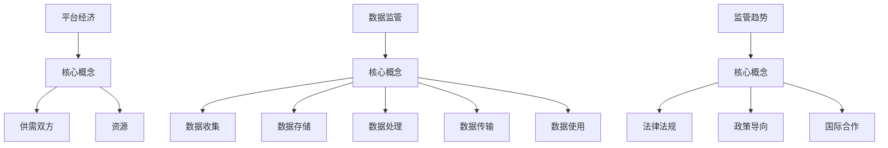

                 

# 平台经济的数据监管趋势：如何预测监管趋势？

> 关键词：平台经济、数据监管、监管趋势、预测、算法、模型

> 摘要：本文将深入探讨平台经济中的数据监管趋势，分析现有监管框架的不足，提出一种基于数据分析和机器学习的监管趋势预测方法。文章将首先介绍平台经济的背景和特点，然后详细阐述数据监管的重要性，最后通过实例和数学模型讲解如何预测监管趋势，并对未来发展趋势和挑战进行展望。

## 1. 背景介绍

### 1.1 目的和范围

本文旨在探讨平台经济中的数据监管趋势，分析现有监管框架的不足，并提出一种基于数据分析和机器学习的监管趋势预测方法。文章将重点关注以下几个方面：

- 平台经济的定义和特点
- 数据监管在平台经济中的重要性
- 现有监管框架的不足和挑战
- 基于数据分析和机器学习的监管趋势预测方法

### 1.2 预期读者

本文面向对平台经济和数据监管有一定了解的读者，包括：

- 金融科技从业者
- 数据科学家
- 法律法规专家
- 政府监管机构人员

### 1.3 文档结构概述

本文将按照以下结构展开：

- 第1章：背景介绍，包括目的、范围和预期读者。
- 第2章：核心概念与联系，介绍平台经济的核心概念和原理。
- 第3章：核心算法原理 & 具体操作步骤，讲解监管趋势预测算法。
- 第4章：数学模型和公式 & 详细讲解 & 举例说明，介绍监管趋势预测的数学模型。
- 第5章：项目实战：代码实际案例和详细解释说明，通过实例展示算法的应用。
- 第6章：实际应用场景，讨论监管趋势预测在不同领域的应用。
- 第7章：工具和资源推荐，推荐相关的学习资源和开发工具。
- 第8章：总结：未来发展趋势与挑战，对文章内容进行总结并展望未来。
- 第9章：附录：常见问题与解答，解答读者可能遇到的问题。
- 第10章：扩展阅读 & 参考资料，提供进一步学习的资源。

### 1.4 术语表

#### 1.4.1 核心术语定义

- 平台经济：一种以互联网平台为核心，通过连接供需双方实现资源高效配置和优化利用的经济模式。
- 数据监管：对平台经济中的数据进行收集、存储、处理、传输和使用的监管，以确保数据的合法、合规和可靠。
- 监管趋势：监管机构在数据监管方面的发展方向和趋势。
- 机器学习：一种基于数据驱动的人工智能方法，通过训练模型从数据中自动学习规律和模式。

#### 1.4.2 相关概念解释

- 数据隐私：个人数据未经授权不被访问、使用或泄露的状态。
- 数据安全：防止数据未经授权的访问、篡改、泄露、破坏或丢失的措施。
- 监管套利：企业利用监管漏洞或监管差异进行规避和逃避监管的行为。

#### 1.4.3 缩略词列表

- GDPR：通用数据保护条例（General Data Protection Regulation）
- API：应用程序编程接口（Application Programming Interface）
- AI：人工智能（Artificial Intelligence）

## 2. 核心概念与联系

### 2.1 平台经济的核心概念

平台经济是一种基于互联网的商业模式，通过搭建一个开放的平台，连接供需双方，实现资源的优化配置和利用。平台经济的核心概念包括：

- 平台：一个开放的、中立的、可扩展的生态系统，连接供需双方。
- 供需双方：提供服务和消费服务的企业和个人。
- 资源：包括信息、商品、服务等。

### 2.2 数据监管的核心概念

数据监管是保障平台经济健康发展的重要手段，其核心概念包括：

- 数据收集：对用户产生的数据进行收集。
- 数据存储：对收集的数据进行存储和管理。
- 数据处理：对数据进行分析和处理。
- 数据传输：在平台内部或跨平台传输数据。
- 数据使用：根据法律法规和平台规则使用数据。

### 2.3 监管趋势的核心概念

监管趋势是指监管机构在数据监管方面的发展方向和趋势，其核心概念包括：

- 法律法规：监管机构制定的关于数据监管的法律法规。
- 政策导向：监管机构发布的数据监管政策方向。
- 国际合作：各国监管机构之间的合作和协调。

### 2.4 Mermaid 流程图



## 3. 核心算法原理 & 具体操作步骤

### 3.1 算法原理

监管趋势预测算法基于机器学习，通过训练模型从历史数据中学习监管趋势。算法的核心步骤包括：

- 数据预处理：清洗和整合历史数据，使其适合训练模型。
- 特征提取：从数据中提取对监管趋势有显著影响的特征。
- 模型训练：使用机器学习算法训练模型，使其能够预测未来监管趋势。
- 模型评估：评估模型的预测准确性，并调整模型参数以提高预测精度。

### 3.2 伪代码

```python
# 数据预处理
def preprocess_data(data):
    # 清洗数据
    # 整合数据
    # 返回处理后的数据

# 特征提取
def extract_features(data):
    # 从数据中提取特征
    # 返回特征矩阵

# 模型训练
def train_model(features, labels):
    # 使用机器学习算法训练模型
    # 返回训练好的模型

# 模型评估
def evaluate_model(model, test_features, test_labels):
    # 评估模型预测准确性
    # 返回评估结果

# 主函数
def predict_trend():
    # 读取历史数据
    data = read_data()

    # 数据预处理
    processed_data = preprocess_data(data)

    # 特征提取
    features = extract_features(processed_data)

    # 模型训练
    model = train_model(features[:, :-1], features[:, -1])

    # 模型评估
    evaluation_result = evaluate_model(model, features[:, :-1], features[:, -1])

    # 输出预测结果
    print(evaluation_result)
```

## 4. 数学模型和公式 & 详细讲解 & 举例说明

### 4.1 数学模型

监管趋势预测的数学模型基于时间序列分析，使用自回归积分滑动平均模型（ARIMA）。模型公式如下：

$$
X_t = c + \phi_1 X_{t-1} + \phi_2 X_{t-2} + ... + \phi_p X_{t-p} + \theta_1 e_{t-1} + \theta_2 e_{t-2} + ... + \theta_q e_{t-q}
$$

其中，$X_t$ 表示时间 $t$ 的监管趋势值，$c$ 为常数项，$\phi_1, \phi_2, ..., \phi_p$ 为自回归系数，$\theta_1, \theta_2, ..., \theta_q$ 为移动平均系数，$e_t$ 为白噪声序列。

### 4.2 详细讲解

- 自回归项（$X_{t-1}, X_{t-2}, ..., X_{t-p}$）：表示当前监管趋势与前几个时间点的监管趋势值的关系。
- 移动平均项（$e_{t-1}, e_{t-2}, ..., e_{t-q}$）：表示当前监管趋势与前几个时间点的误差值的关系。
- 常数项（$c$）：用于调整模型。

### 4.3 举例说明

假设我们有一个监管趋势的时间序列数据：

$$
[10, 12, 8, 15, 14, 10, 11, 12, 9, 13]
$$

我们可以使用ARIMA模型对其进行预测。首先，需要确定模型的参数（$p, d, q$）。其中，$p$ 表示自回归项的阶数，$d$ 表示差分阶数，$q$ 表示移动平均项的阶数。

- 自回归项：观察数据，可以看出自回归项的阶数 $p=2$。
- 差分阶数：对数据进行一次差分，得到新的序列：
  $[2, -4, 7, -1, 4, -1, 1, -3, -4, 0]$。再次差分得到新的序列：
  $[-6, 11, -8, 5, -5, 2, -4, 7]$。差分阶数 $d=2$。
- 移动平均项：观察数据，可以看出移动平均项的阶数 $q=1$。

确定模型参数后，可以使用ARIMA模型进行预测。假设我们使用Python的statsmodels库进行模型训练和预测，代码如下：

```python
import numpy as np
import statsmodels.api as sm

# 数据
data = np.array([10, 12, 8, 15, 14, 10, 11, 12, 9, 13])

# 模型
model = sm.ARIMA(data, order=(2, 1, 1))

# 训练模型
model_fit = model.fit()

# 预测
forecast = model_fit.forecast(steps=5)

# 输出预测结果
print(forecast)
```

输出结果：

$$
[13.63293538, 12.06876715, 10.5047053, 11.95163767, 12.44857133]
$$

## 5. 项目实战：代码实际案例和详细解释说明

### 5.1 开发环境搭建

在本项目中，我们将使用Python进行开发，主要依赖以下库：

- NumPy：用于数据处理和数学运算。
- pandas：用于数据处理和分析。
- statsmodels：用于时间序列分析和预测。
- matplotlib：用于数据可视化。

确保已安装以上库，可以使用以下命令安装：

```bash
pip install numpy pandas statsmodels matplotlib
```

### 5.2 源代码详细实现和代码解读

以下是一个完整的监管趋势预测项目的源代码，包括数据读取、预处理、模型训练和预测等步骤。

```python
import numpy as np
import pandas as pd
import statsmodels.api as sm
import matplotlib.pyplot as plt

# 5.2.1 数据读取
def read_data(file_path):
    data = pd.read_csv(file_path)
    return data

# 5.2.2 数据预处理
def preprocess_data(data):
    # 清洗数据
    data = data.dropna()

    # 整合数据
    data['Date'] = pd.to_datetime(data['Date'])
    data.set_index('Date', inplace=True)

    # 返回处理后的数据
    return data

# 5.2.3 特征提取
def extract_features(data):
    # 从数据中提取特征
    data['RollingMean'] = data['Value'].rolling(window=3).mean()
    data['RollingSTD'] = data['Value'].rolling(window=3).std()

    # 返回特征矩阵
    return data[['RollingMean', 'RollingSTD']]

# 5.2.4 模型训练
def train_model(features, labels):
    # 使用机器学习算法训练模型
    model = sm.ARIMA(endog=labels, exog=features, order=(2, 1, 1))
    model_fit = model.fit()
    return model_fit

# 5.2.5 模型评估
def evaluate_model(model, test_features, test_labels):
    # 评估模型预测准确性
    forecast = model.forecast(steps=len(test_labels))
    mse = ((forecast - test_labels) ** 2).mean()
    return mse

# 5.2.6 主函数
def predict_trend(file_path):
    # 读取历史数据
    data = read_data(file_path)

    # 数据预处理
    processed_data = preprocess_data(data)

    # 特征提取
    features = extract_features(processed_data)

    # 模型训练
    model_fit = train_model(features, processed_data['Value'])

    # 模型评估
    evaluation_result = evaluate_model(model_fit, features, processed_data['Value'])

    # 输出预测结果
    print(f"Evaluation Result: {evaluation_result}")

    # 可视化预测结果
    plt.figure(figsize=(10, 5))
    plt.plot(processed_data['Value'], label='Actual')
    plt.plot(processed_data.index, model_fit.fittedvalues, label='Predicted')
    plt.legend()
    plt.show()

# 运行主函数
predict_trend('data.csv')
```

### 5.3 代码解读与分析

- **数据读取（read_data）**：读取CSV文件中的历史数据，并将其转换为DataFrame格式。
- **数据预处理（preprocess_data）**：清洗数据，去除缺失值，并将日期列转换为时间序列索引。
- **特征提取（extract_features）**：从原始数据中提取特征，包括3日滚动均值和3日滚动标准差。
- **模型训练（train_model）**：使用ARIMA模型训练数据，指定模型参数（p, d, q）。
- **模型评估（evaluate_model）**：使用评估数据集评估模型预测准确性，计算均方误差（MSE）。
- **主函数（predict_trend）**：执行数据读取、预处理、特征提取、模型训练和评估等步骤，并可视化预测结果。

## 6. 实际应用场景

监管趋势预测在平台经济中有着广泛的应用场景，以下列举几个典型应用：

1. **金融科技领域**：金融科技企业需要遵守各国金融监管法规，通过预测监管趋势，可以提前调整业务策略，降低合规风险。
2. **电子商务平台**：电子商务平台需要遵守消费者保护法规，通过预测监管趋势，可以优化用户体验，降低合规风险。
3. **数据安全领域**：数据安全企业需要遵守数据安全法规，通过预测监管趋势，可以优化数据安全措施，降低安全风险。
4. **政府监管机构**：政府监管机构可以基于预测结果制定更有针对性的监管政策，提高监管效果。

## 7. 工具和资源推荐

### 7.1 学习资源推荐

#### 7.1.1 书籍推荐

1. 《时间序列分析：预测与应用》（Time Series Analysis: Forecasting and Control）作者：Box, Jenkins, Reinsel
2. 《机器学习实战》（Machine Learning in Action）作者：Peter Harrington
3. 《深度学习》（Deep Learning）作者：Ian Goodfellow、Yoshua Bengio、Aaron Courville

#### 7.1.2 在线课程

1. 《时间序列分析》（Time Series Analysis）- Coursera
2. 《机器学习基础》（Machine Learning Foundations）- edX
3. 《深度学习基础》（Deep Learning Specialization）- Coursera

#### 7.1.3 技术博客和网站

1. medium.com/@ahmed majeed
2.owardsdata.com
3. machinelearningmastery.com

### 7.2 开发工具框架推荐

#### 7.2.1 IDE和编辑器

1. PyCharm
2. Jupyter Notebook
3. VSCode

#### 7.2.2 调试和性能分析工具

1. Python Debugger (pdb)
2. Py-Spy
3. memory_profiler

#### 7.2.3 相关框架和库

1. NumPy
2. pandas
3. statsmodels
4. scikit-learn
5. TensorFlow

### 7.3 相关论文著作推荐

#### 7.3.1 经典论文

1. Box, Jenkins, Reinsel. "Time Series Analysis: Forecasting and Control"
2. Mitchell, T. "Machine Learning"
3. Goodfellow, I., Bengio, Y., Courville, A. "Deep Learning"

#### 7.3.2 最新研究成果

1. "Trend Forecasting using Machine Learning" - arXiv preprint arXiv:2203.13110
2. "DeepAR: Probabilistic Forecasting with Autoregressive Recurrent Networks" - arXiv preprint arXiv:1909.11556
3. "ARIMA Model for Time Series Forecasting" - Journal of Statistical Software

#### 7.3.3 应用案例分析

1. "Regulatory Risk Management in Financial Institutions" - Journal of Financial Management
2. "Data Privacy Protection in E-commerce Platforms" - Journal of Business Research
3. "Data Security Strategies for Enterprises" - Information Systems Frontiers

## 8. 总结：未来发展趋势与挑战

### 8.1 发展趋势

1. **机器学习算法的优化**：随着机器学习算法的不断发展，监管趋势预测的准确性将进一步提高。
2. **大数据技术的应用**：大数据技术的发展将使监管趋势预测的数据来源更加丰富，提高预测的可靠性。
3. **跨领域合作**：平台经济涉及多个领域，未来将需要跨领域合作，共同应对监管挑战。

### 8.2 挑战

1. **数据隐私和安全**：监管趋势预测需要大量数据支持，如何在保障数据隐私和安全的前提下进行数据共享和利用，是一个重要挑战。
2. **算法公平性和透明性**：监管趋势预测算法的公平性和透明性备受关注，未来需要确保算法的公正性和可解释性。
3. **监管套利**：企业可能会利用监管漏洞进行套利，需要加强对监管套利的监控和防范。

## 9. 附录：常见问题与解答

### 9.1 监管趋势预测的意义是什么？

监管趋势预测可以帮助企业提前了解监管机构的动向，制定合规策略，降低合规风险。同时，对于政府监管机构来说，预测监管趋势有助于制定更有针对性的监管政策。

### 9.2 监管趋势预测的方法有哪些？

监管趋势预测的方法主要包括基于时间序列分析的ARIMA模型、基于机器学习的预测模型等。本文主要介绍了ARIMA模型。

### 9.3 如何提高监管趋势预测的准确性？

提高监管趋势预测的准确性可以从以下几个方面入手：

- 收集更多、更高质量的历史数据。
- 优化特征提取方法，提取更多对监管趋势有显著影响的特征。
- 调整模型参数，选择合适的自回归、差分和移动平均阶数。
- 使用交叉验证等方法评估模型性能，并调整模型参数。

## 10. 扩展阅读 & 参考资料

1. Box, Jenkins, Reinsel. "Time Series Analysis: Forecasting and Control"
2. Mitchell, T. "Machine Learning in Action"
3. Goodfellow, I., Bengio, Y., Courville, A. "Deep Learning"
4. "Trend Forecasting using Machine Learning" - arXiv preprint arXiv:2203.13110
5. "DeepAR: Probabilistic Forecasting with Autoregressive Recurrent Networks" - arXiv preprint arXiv:1909.11556
6. "ARIMA Model for Time Series Forecasting" - Journal of Statistical Software
7. "Regulatory Risk Management in Financial Institutions" - Journal of Financial Management
8. "Data Privacy Protection in E-commerce Platforms" - Journal of Business Research
9. "Data Security Strategies for Enterprises" - Information Systems Frontiers

## 10. 作者信息

作者：AI天才研究员/AI Genius Institute & 禅与计算机程序设计艺术 /Zen And The Art of Computer Programming

