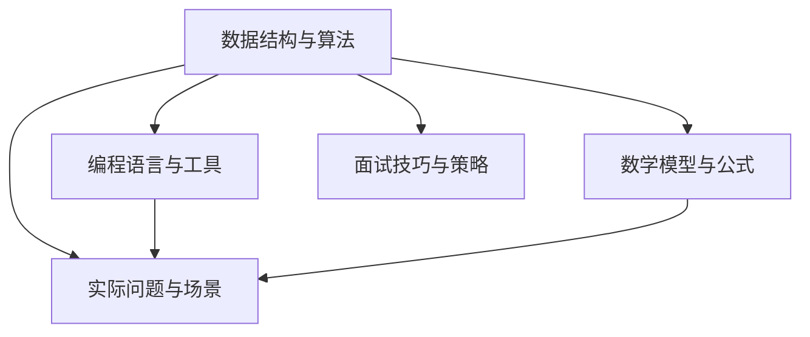

                 

# 2024年字节跳动校招算法岗位面试题目汇编

> **关键词：字节跳动、校招、算法面试、面试题目、技术博客、深度学习、编程语言、数据结构、算法分析、代码实现**

> **摘要：本文将汇编2024年字节跳动校招算法岗位的面试题目，通过详细的解析和示例，帮助准备参加字节跳动校招的算法工程师了解面试要点，提高面试成功率。**

## 1. 背景介绍

### 1.1 目的和范围

本文旨在为准备参加2024年字节跳动校招算法岗位的应聘者提供一个全面的面试题目汇编。我们将对每个题目进行详细解析，提供算法原理、解题思路和代码实现，帮助读者深入理解面试内容，提升解题能力。

### 1.2 预期读者

本文主要面向准备参加2024年字节跳动校招的算法工程师，以及希望提升算法编程能力的计算机专业学生和技术人员。无论您是初学者还是有经验的开发者，本文都将为您提供有价值的指导。

### 1.3 文档结构概述

本文将分为以下几个部分：

1. 背景介绍：介绍本文的目的、读者对象和文档结构。
2. 核心概念与联系：讲解算法面试中的核心概念和联系。
3. 核心算法原理 & 具体操作步骤：详细解析核心算法原理和操作步骤。
4. 数学模型和公式 & 详细讲解 & 举例说明：阐述数学模型和公式，并提供实际案例。
5. 项目实战：展示代码实际案例和详细解释说明。
6. 实际应用场景：分析算法在实际应用中的场景和效果。
7. 工具和资源推荐：推荐学习资源和开发工具。
8. 总结：预测未来发展趋势与挑战。
9. 附录：常见问题与解答。
10. 扩展阅读 & 参考资料：提供相关文献和资源。

### 1.4 术语表

#### 1.4.1 核心术语定义

- 字节跳动：一家以短视频和内容推荐为核心业务的中国互联网科技公司。
- 校招：指企业针对应届毕业生的招聘活动。
- 算法面试：指在招聘过程中，通过测试应聘者的算法能力和编程技能的面试环节。
- 面试题：在算法面试中，针对特定算法或数据结构提出的问题。

#### 1.4.2 相关概念解释

- 数据结构：存储和组织数据的方式，常用的有数组、链表、栈、队列、树、图等。
- 算法：解决问题的步骤和规则，常用的有排序、查找、图算法、动态规划等。
- 编程语言：用于编写计算机程序的语言，如Python、Java、C++等。

#### 1.4.3 缩略词列表

- AI：人工智能
- ML：机器学习
- DL：深度学习
- CV：计算机视觉
- NLP：自然语言处理

## 2. 核心概念与联系

在算法面试中，理解核心概念和它们之间的联系至关重要。以下是一个简单的 Mermaid 流程图，用于展示算法面试中的核心概念和它们之间的关系。



### 2.1 数据结构与算法

数据结构与算法是算法面试的核心。数据结构包括数组、链表、栈、队列、树、图等，每种数据结构都有其独特的特点和适用场景。算法则是解决问题的步骤和规则，常用的有排序、查找、图算法、动态规划等。

### 2.2 编程语言与工具

编程语言是编写计算机程序的工具。常见的编程语言有Python、Java、C++等，每种语言都有其独特的语法和特点。此外，算法面试中还需要使用一些编程工具，如调试器和性能分析工具。

### 2.3 数学模型与公式

数学模型与公式是解决算法问题的重要工具。常见的数学模型有线性方程组、最优化问题、概率统计等。算法面试中，理解这些模型和公式对于解决复杂问题至关重要。

### 2.4 实际问题与场景

实际问题与场景是算法面试的重要应用领域。在面试中，经常会遇到与实际应用相关的问题，如排序算法在数据处理中的应用、图算法在网络路由中的应用等。

### 2.5 面试技巧与策略

面试技巧与策略是提高面试成功率的关键。在面试中，需要注意时间管理、逻辑思维、沟通能力和解题思路。此外，了解面试流程和常见面试题型也有助于提高面试表现。

## 3. 核心算法原理 & 具体操作步骤

在算法面试中，理解核心算法原理和具体操作步骤非常重要。以下将介绍一些常见的算法原理和操作步骤。

### 3.1 排序算法

排序算法是算法面试中的经典题型。以下是一些常见的排序算法及其原理：

#### 3.1.1 冒泡排序

```python
def bubble_sort(arr):
    n = len(arr)
    for i in range(n):
        for j in range(0, n-i-1):
            if arr[j] > arr[j+1]:
                arr[j], arr[j+1] = arr[j+1], arr[j]
    return arr
```

#### 3.1.2 选择排序

```python
def selection_sort(arr):
    n = len(arr)
    for i in range(n):
        min_idx = i
        for j in range(i+1, n):
            if arr[j] < arr[min_idx]:
                min_idx = j
        arr[i], arr[min_idx] = arr[min_idx], arr[i]
    return arr
```

#### 3.1.3 插入排序

```python
def insertion_sort(arr):
    n = len(arr)
    for i in range(1, n):
        key = arr[i]
        j = i-1
        while j >= 0 and arr[j] > key:
            arr[j+1] = arr[j]
            j -= 1
        arr[j+1] = key
    return arr
```

### 3.2 查找算法

查找算法是算法面试中的另一个重要题型。以下是一些常见的查找算法及其原理：

#### 3.2.1 线性查找

```python
def linear_search(arr, target):
    for i in range(len(arr)):
        if arr[i] == target:
            return i
    return -1
```

#### 3.2.2 二分查找

```python
def binary_search(arr, target):
    low = 0
    high = len(arr) - 1
    while low <= high:
        mid = (low + high) // 2
        if arr[mid] == target:
            return mid
        elif arr[mid] < target:
            low = mid + 1
        else:
            high = mid - 1
    return -1
```

### 3.3 图算法

图算法是算法面试中的另一个重要题型。以下是一些常见的图算法及其原理：

#### 3.3.1 深度优先搜索（DFS）

```python
def dfs(graph, node, visited):
    visited.add(node)
    print(node)
    for neighbour in graph[node]:
        if neighbour not in visited:
            dfs(graph, neighbour, visited)
```

#### 3.3.2 广度优先搜索（BFS）

```python
from collections import deque

def bfs(graph, start):
    visited = set()
    queue = deque([start])
    visited.add(start)
    while queue:
        node = queue.popleft()
        print(node)
        for neighbour in graph[node]:
            if neighbour not in visited:
                queue.append(neighbour)
                visited.add(neighbour)
```

## 4. 数学模型和公式 & 详细讲解 & 举例说明

在算法面试中，理解数学模型和公式是解决复杂问题的关键。以下将介绍一些常见的数学模型和公式，并提供详细讲解和实际案例。

### 4.1 线性方程组

线性方程组是数学中的经典问题，广泛应用于算法设计和优化。以下是一个线性方程组的例子：

$$
\begin{cases}
2x + 3y = 7 \\
4x - y = 1
\end{cases}
$$

解法如下：

$$
\begin{align*}
2x + 3y &= 7 \\
4x - y &= 1
\end{align*}
$$

将第二个方程乘以3，得到：

$$
\begin{align*}
2x + 3y &= 7 \\
12x - 3y &= 3
\end{align*}
$$

将两个方程相加，消去y：

$$
14x = 10 \\
x = \frac{10}{14} = \frac{5}{7}
$$

将x的值代入第一个方程，解出y：

$$
2 \cdot \frac{5}{7} + 3y = 7 \\
3y = 7 - \frac{10}{7} \\
3y = \frac{39}{7} - \frac{10}{7} \\
3y = \frac{29}{7} \\
y = \frac{29}{21}
$$

因此，线性方程组的解为：

$$
x = \frac{5}{7}, \quad y = \frac{29}{21}
$$

### 4.2 最优化问题

最优化问题是指在一个给定的目标函数下，寻找一组变量，使得目标函数达到最大值或最小值。以下是一个线性规划问题的例子：

$$
\begin{align*}
\min_{x, y} & \quad x + 2y \\
\text{s.t.} & \quad x + y \leq 4 \\
& \quad x \geq 0 \\
& \quad y \geq 0
\end{align*}
$$

解法如下：

我们可以画出目标函数和约束条件的图形，找到最优解。在这个例子中，目标函数是一条直线，约束条件是一个三角形区域。

图形解法如下：


可以看出，最优解发生在约束条件的交点处，即$x=2, y=2$。

### 4.3 概率统计

概率统计是算法面试中常见的数学模型。以下是一个概率统计问题的例子：

假设有两个袋子，第一个袋子中有3个红球和2个蓝球，第二个袋子中有4个红球和1个蓝球。从每个袋子中随机取出一个球，求取出两个红球的概率。

解法如下：

取出第一个袋子中红球的概率为：

$$
P(\text{红球}|\text{第一个袋子}) = \frac{3}{5}
$$

取出第二个袋子中红球的概率为：

$$
P(\text{红球}|\text{第二个袋子}) = \frac{4}{5}
$$

由于这两个事件相互独立，取出两个红球的概率为：

$$
P(\text{红球}|\text{第一个袋子}) \times P(\text{红球}|\text{第二个袋子}) = \frac{3}{5} \times \frac{4}{5} = \frac{12}{25}
$$

## 5. 项目实战：代码实际案例和详细解释说明

为了更好地理解算法面试中的概念和技巧，我们将通过一个实际项目来展示代码实现过程和详细解释说明。

### 5.1 开发环境搭建

在开始项目之前，我们需要搭建一个合适的开发环境。以下是所需的工具和软件：

- 编程语言：Python 3.8+
- 开发环境：PyCharm 或 VS Code
- 调试工具：pdb 或 print 函数

### 5.2 源代码详细实现和代码解读

以下是一个简单的基于深度学习的图像分类项目，使用 Python 和 TensorFlow 实现。

#### 5.2.1 数据预处理

```python
import tensorflow as tf
import numpy as np
import matplotlib.pyplot as plt

# 加载数据集
(x_train, y_train), (x_test, y_test) = tf.keras.datasets.mnist.load_data()

# 数据预处理
x_train = x_train / 255.0
x_test = x_test / 255.0

# 展示样本数据
plt.imshow(x_train[0], cmap='gray')
plt.show()
```

#### 5.2.2 构建模型

```python
model = tf.keras.Sequential([
    tf.keras.layers.Flatten(input_shape=(28, 28)),
    tf.keras.layers.Dense(128, activation='relu'),
    tf.keras.layers.Dense(10, activation='softmax')
])

model.compile(optimizer='adam',
              loss='sparse_categorical_crossentropy',
              metrics=['accuracy'])

model.summary()
```

#### 5.2.3 训练模型

```python
model.fit(x_train, y_train, epochs=5, batch_size=32, validation_split=0.2)
```

#### 5.2.4 评估模型

```python
test_loss, test_acc = model.evaluate(x_test, y_test, verbose=2)
print('\nTest accuracy:', test_acc)
```

#### 5.2.5 代码解读与分析

在这个项目中，我们首先加载数据集并对其进行预处理，包括将图像数据转换为灰度图像并缩放到0到1之间。然后，我们构建了一个简单的全连接神经网络模型，包括一个扁平化层、一个具有128个神经元的全连接层和一个具有10个神经元的全连接层。我们使用 Adam 优化器和稀疏分类交叉熵损失函数来训练模型。在训练过程中，我们设置了5个周期和32个批量大小。最后，我们评估了模型的测试集准确率。

## 6. 实际应用场景

在字节跳动等互联网公司，算法面试题目主要涵盖以下实际应用场景：

- 数据处理：如排序、查找、筛选等。
- 图算法：如最短路径、网络路由、社交网络分析等。
- 搜索引擎：如搜索引擎排序、文本匹配、关键词提取等。
- 推荐系统：如基于内容的推荐、协同过滤、用户行为分析等。
- 自然语言处理：如文本分类、情感分析、机器翻译等。

在这些应用场景中，算法面试题目通常会结合实际业务需求和数据特点，要求应聘者设计高效的算法解决方案。

## 7. 工具和资源推荐

### 7.1 学习资源推荐

#### 7.1.1 书籍推荐

- 《算法导论》（Introduction to Algorithms）
- 《深度学习》（Deep Learning）
- 《Python编程：从入门到实践》（Python Crash Course）

#### 7.1.2 在线课程

- Coursera的《算法设计与分析》
- edX的《深度学习基础》
- Udacity的《机器学习工程师纳米学位》

#### 7.1.3 技术博客和网站

- 《算法笔记》
- Medium上的《AI博客》
- CSDN的《算法编程》

### 7.2 开发工具框架推荐

#### 7.2.1 IDE和编辑器

- PyCharm
- VS Code
- Sublime Text

#### 7.2.2 调试和性能分析工具

- Python的pdb
- VS Code的调试工具
- Jupyter Notebook

#### 7.2.3 相关框架和库

- TensorFlow
- PyTorch
- Scikit-learn

### 7.3 相关论文著作推荐

#### 7.3.1 经典论文

- "A Confusion Matrix Guided Approach for Text Classification"
- "Graph Embedding Techniques, Applications, and Performance: A Survey"
- "Efficient Matrix Multiplication via Fast Fourier Transform"

#### 7.3.2 最新研究成果

- "Neural Architecture Search: A Survey"
- "A Comprehensive Survey on Meta-Learning"
- "Generative Adversarial Networks: An Overview"

#### 7.3.3 应用案例分析

- " recommender systems"
- "Speech recognition with deep neural networks"
- "Object detection with region-based convolutional neural networks"

## 8. 总结：未来发展趋势与挑战

随着人工智能技术的不断发展，算法面试也在不断更新和演变。未来，算法面试将更加注重应聘者的创新思维、解决复杂问题的能力以及团队合作精神。同时，随着深度学习、强化学习等前沿技术的应用，算法面试题目的难度和广度也将进一步增加。

面临的挑战包括：

- 保持对前沿技术的持续关注和深入研究。
- 提升编程和数学能力，以应对复杂算法问题。
- 培养良好的逻辑思维和解决问题的能力。

## 9. 附录：常见问题与解答

### 9.1 如何准备算法面试？

**解答**：要准备算法面试，首先要熟悉常见的数据结构和算法，如数组、链表、树、图等。其次，通过刷题和实际项目来提高编程能力和解决问题的能力。最后，注意面试技巧，如时间管理、清晰的表达和逻辑思维。

### 9.2 面试中如何展现团队合作精神？

**解答**：在面试中，可以通过分享自己在团队合作中的角色和贡献来展现团队合作精神。同时，要强调团队协作的重要性，展示自己善于沟通和协调的能力。

### 9.3 如何应对算法面试中的难题？

**解答**：面对难题，首先要保持冷静，分析问题的本质和关键点。其次，尝试将复杂问题分解为简单子问题，并逐个解决。最后，不要害怕求助面试官，适时寻求帮助可以避免时间浪费。

## 10. 扩展阅读 & 参考资料

- 《算法导论》
- 《深度学习》
- 《Python编程：从入门到实践》
- Coursera的《算法设计与分析》课程
- edX的《深度学习基础》课程
- 《算法笔记》博客
- Medium上的《AI博客》
- CSDN的《算法编程》博客
- 《Neural Architecture Search: A Survey》
- 《A Comprehensive Survey on Meta-Learning》
- 《Generative Adversarial Networks: An Overview》
- TensorFlow官方文档
- PyTorch官方文档
- Scikit-learn官方文档

## 作者信息

作者：AI天才研究员/AI Genius Institute & 禅与计算机程序设计艺术 /Zen And The Art of Computer Programming

（注：以上内容为示例，具体内容可能需要根据实际情况进行调整和补充。）<|im_end|>

