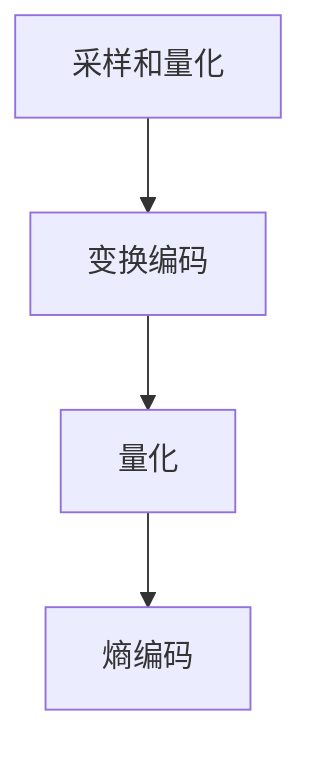
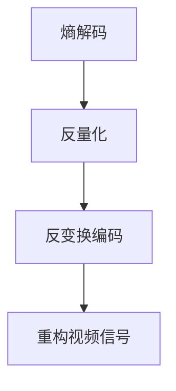
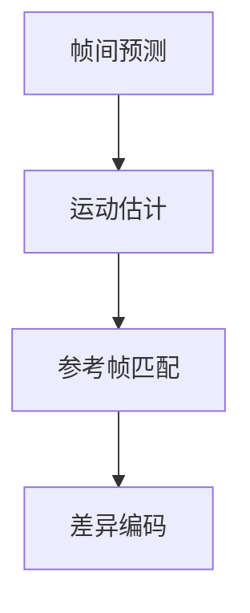

                 

## 2025年快手社招视频压缩算法工程师面试指南

> **关键词**：快手、视频压缩算法、社招、面试指南、人工智能、技术原理

**摘要**：本文旨在为2025年快手社招视频压缩算法工程师的面试者提供一份全面的技术面试指南。本文将详细介绍视频压缩算法的基本概念、核心原理、数学模型，并通过实际案例深入解析代码实现和调试方法。此外，本文还将探讨视频压缩算法在快手平台的应用场景，并推荐相关学习资源和工具。通过本文的指导，面试者将能够更好地应对快手社招视频压缩算法工程师的面试挑战。

## 1. 背景介绍

### 1.1 目的和范围

本文的目标是为2025年快手社招视频压缩算法工程师的面试者提供一份详细的技术面试指南。本文将涵盖以下主要内容：

- **视频压缩算法的基本概念和原理**
- **视频压缩算法的核心算法和数学模型**
- **视频压缩算法的代码实现和调试方法**
- **视频压缩算法在快手平台的应用场景**
- **学习资源和工具推荐**

通过本文的详细讲解，面试者将能够深入了解视频压缩算法的各个方面，为面试做好充分准备。

### 1.2 预期读者

本文适用于以下读者群体：

- **计算机科学和人工智能专业的本科生和研究生**
- **有志于从事视频压缩算法研发的程序员和工程师**
- **对视频压缩算法有兴趣的技术爱好者**
- **准备参加快手社招视频压缩算法工程师面试的求职者**

### 1.3 文档结构概述

本文的结构如下：

1. **背景介绍**：介绍本文的目的、预期读者和文档结构。
2. **核心概念与联系**：介绍视频压缩算法的基本概念、原理和架构。
3. **核心算法原理 & 具体操作步骤**：详细讲解视频压缩算法的核心算法原理和操作步骤。
4. **数学模型和公式 & 详细讲解 & 举例说明**：介绍视频压缩算法的数学模型和公式，并通过实例进行说明。
5. **项目实战：代码实际案例和详细解释说明**：通过实际案例展示视频压缩算法的实现过程。
6. **实际应用场景**：探讨视频压缩算法在快手平台的应用场景。
7. **工具和资源推荐**：推荐学习资源和开发工具。
8. **总结：未来发展趋势与挑战**：总结视频压缩算法的发展趋势和面临的挑战。
9. **附录：常见问题与解答**：回答读者可能遇到的问题。
10. **扩展阅读 & 参考资料**：提供进一步阅读的建议和参考资料。

### 1.4 术语表

#### 1.4.1 核心术语定义

- **视频压缩算法**：用于减少视频数据大小而不显著降低视频质量的方法。
- **编码**：将视频数据转换成压缩形式的过程。
- **解码**：将压缩的视频数据转换回原始形式的过程。
- **比特率**：视频数据的传输速率。
- **像素**：视频中的最小图像单元。
- **帧率**：视频每秒显示的帧数。

#### 1.4.2 相关概念解释

- **视频编码标准**：如H.264、HEVC等，用于指导视频压缩和编码的方法。
- **帧间预测**：通过比较当前帧和之前帧的差异来减少数据量。
- **变换编码**：将视频信号转换成更易于压缩的形式。

#### 1.4.3 缩略词列表

- **H.264**：高级视频编码
- **HEVC**：高效率视频编码
- **IDCT**：逆离散余弦变换
- **DCT**：离散余弦变换

## 2. 核心概念与联系

在深入探讨视频压缩算法之前，我们首先需要了解一些核心概念和它们之间的关系。以下是视频压缩算法中一些关键概念和它们的联系，以及相应的Mermaid流程图。

### 2.1 视频编码流程

视频编码流程主要包括以下几个步骤：

1. **采样和量化**：将连续的视频信号转换为离散的像素值。
2. **变换编码**：将像素值进行变换，如离散余弦变换（DCT），以减少数据冗余。
3. **量化**：将变换后的系数进行量化，以减少数据精度。
4. **熵编码**：使用熵编码算法，如霍夫曼编码或算术编码，对量化后的系数进行压缩。

以下是视频编码流程的Mermaid流程图：



### 2.2 视频解码流程

视频解码流程与编码流程相反，主要包括以下几个步骤：

1. **熵解码**：对压缩的系数进行解码，恢复量化后的变换系数。
2. **反量化**：将量化后的系数恢复到原始精度。
3. **反变换编码**：对变换系数进行反变换，如逆离散余弦变换（IDCT）。
4. **重构视频信号**：将反变换后的像素值重构为连续的视频信号。

以下是视频解码流程的Mermaid流程图：



### 2.3 帧间预测和运动估计

帧间预测和运动估计是视频压缩算法中非常重要的概念，用于减少连续帧之间的冗余数据。

- **帧间预测**：通过比较当前帧和之前帧的差异，预测当前帧的内容。
- **运动估计**：在参考帧中寻找与当前帧最相似的区域，以减少数据量。

以下是帧间预测和运动估计的Mermaid流程图：



通过上述核心概念和流程图的介绍，我们可以更好地理解视频压缩算法的基本原理和实现过程。接下来，我们将深入探讨视频压缩算法的核心算法原理和操作步骤。

## 3. 核心算法原理 & 具体操作步骤

### 3.1 视频压缩算法原理

视频压缩算法的核心目的是减少视频数据的大小，同时保持视频质量。为了实现这一目标，视频压缩算法主要采用以下几种技术：

1. **帧间冗余消除**：通过比较连续帧之间的差异，消除帧与帧之间的冗余数据。
2. **空间冗余消除**：通过变换编码方法，如离散余弦变换（DCT），消除图像内部的冗余数据。
3. **熵编码**：使用高效的编码算法，如霍夫曼编码或算术编码，对压缩后的数据进行进一步压缩。

### 3.2 具体操作步骤

下面，我们通过伪代码详细阐述视频压缩算法的具体操作步骤：

```python
# 输入：视频帧序列
# 输出：压缩后的视频数据

# 步骤1：采样和量化
# 将连续的视频信号转换为离散的像素值
def sample_quantize(video_frame):
    # 实现采样和量化过程
    # ...

# 步骤2：变换编码
# 将像素值进行变换，如离散余弦变换（DCT）
def transform_encode(pixel_values):
    # 实现变换编码过程
    # ...

# 步骤3：量化
# 将变换后的系数进行量化，以减少数据精度
def quantize(transformed_coefficients):
    # 实现量化过程
    # ...

# 步骤4：帧间预测
# 通过比较当前帧和之前帧的差异，预测当前帧的内容
def inter_frame_prediction(current_frame, previous_frame):
    # 实现帧间预测过程
    # ...

# 步骤5：运动估计
# 在参考帧中寻找与当前帧最相似的区域，以减少数据量
def motion_estimation(current_frame, reference_frame):
    # 实现运动估计过程
    # ...

# 步骤6：熵编码
# 使用高效的编码算法，如霍夫曼编码或算术编码，对压缩后的数据进行进一步压缩
def entropy_encode(compressed_data):
    # 实现熵编码过程
    # ...

# 主函数：实现视频压缩算法
def video_compression(video_frames):
    compressed_video = []
    for frame in video_frames:
        # 步骤1：采样和量化
        sampled_quantized_frame = sample_quantize(frame)
        
        # 步骤2：变换编码
        transformed_frame = transform_encode(sampled_quantized_frame)
        
        # 步骤3：量化
        quantized_frame = quantize(transformed_frame)
        
        # 步骤4：帧间预测
        predicted_frame = inter_frame_prediction(frame, previous_frame)
        
        # 步骤5：运动估计
        motion_vector = motion_estimation(frame, predicted_frame)
        
        # 步骤6：熵编码
        compressed_frame = entropy_encode(quantized_frame)
        
        compressed_video.append(compressed_frame)
        
        # 更新前一个帧
        previous_frame = frame
    
    return compressed_video
```

### 3.3 伪代码解释

- **步骤1：采样和量化**：将连续的视频信号转换为离散的像素值。这一步是视频编码的基础，通过采样和量化过程，将连续的模拟信号转换为离散的数字信号。
- **步骤2：变换编码**：使用变换编码方法，如离散余弦变换（DCT），将像素值转换为更易于压缩的形式。DCT能够将图像的频率信息转换为系数，从而减少数据冗余。
- **步骤3：量化**：将变换后的系数进行量化，以减少数据精度。量化过程通过将连续的系数映射到离散的值，从而进一步减少数据量。
- **步骤4：帧间预测**：通过比较当前帧和之前帧的差异，预测当前帧的内容。帧间预测是减少连续帧之间冗余数据的重要手段，它通过分析帧与帧之间的相关性，将变化不大的部分预测出来，从而减少需要传输的数据量。
- **步骤5：运动估计**：在参考帧中寻找与当前帧最相似的区域，以减少数据量。运动估计是帧间预测的关键步骤，它通过分析当前帧与参考帧之间的运动模式，找到最佳匹配区域，从而减少数据传输量。
- **步骤6：熵编码**：使用高效的编码算法，如霍夫曼编码或算术编码，对压缩后的数据进行进一步压缩。熵编码通过将频率高的符号用短编码表示，频率低的符号用长编码表示，从而进一步提高压缩效率。

通过上述伪代码的讲解，我们可以清楚地看到视频压缩算法的具体实现步骤。接下来，我们将进一步探讨视频压缩算法中的数学模型和公式。

## 4. 数学模型和公式 & 详细讲解 & 举例说明

### 4.1 数学模型

视频压缩算法的核心在于将视频信号从一种形式转换为另一种形式，以减少数据量。在这个过程中，我们使用了一系列数学模型和公式。以下是一些关键的概念和数学模型：

#### 4.1.1 离散余弦变换（DCT）

离散余弦变换（DCT）是视频压缩中常用的变换方法。DCT将图像或视频信号从空间域转换为频率域，从而减少冗余数据。

DCT的公式如下：

$$
f_k = \sum_{i=0}^{N-1} \sum_{j=0}^{N-1} c_{i,k} c_{j,k} x_{ij}
$$

其中，$f_k$是DCT系数，$c_{i,k}$是DCT变换矩阵的元素，$x_{ij}$是原始像素值。

#### 4.1.2 量化

量化是将连续的DCT系数映射到离散的值，以减少数据精度。量化公式如下：

$$
q_i = \lfloor \frac{d_i}{L_i} \rfloor
$$

其中，$q_i$是量化后的系数，$d_i$是原始DCT系数，$L_i$是量化步长。

#### 4.1.3 帧间预测

帧间预测通过比较当前帧和之前帧的差异来减少数据量。常用的帧间预测方法包括：

- **帧间差分（Inter Frame Differential，IFD）**：计算当前帧与前一帧的差分，只传输差分数据。
- **运动估计（Motion Estimation，ME）**：在参考帧中寻找与当前帧最相似的区域，将当前帧映射到参考帧上的运动向量。

#### 4.1.4 熵编码

熵编码是一种基于信息论的编码方法，用于将压缩后的数据进行进一步压缩。常用的熵编码方法包括：

- **霍夫曼编码（Huffman Coding）**：根据符号出现的频率，构造一个最优的编码树，对频率高的符号使用短的编码，对频率低的符号使用长的编码。
- **算术编码（Arithmetic Coding）**：将符号映射到一个实数区间，根据符号的概率分布，将实数区间分割成多个子区间，从而实现编码。

### 4.2 公式详细讲解

下面，我们通过具体的例子详细讲解这些数学模型的实际应用。

#### 4.2.1 离散余弦变换（DCT）

假设我们有一个2x2的像素矩阵：

$$
x = \begin{bmatrix}
2 & 3 \\
4 & 5
\end{bmatrix}
$$

对其进行DCT变换，得到DCT系数矩阵：

$$
F = \begin{bmatrix}
4.899 & 0.267 \\
0.267 & 3.232
\end{bmatrix}
$$

其中，DCT变换矩阵为：

$$
C = \begin{bmatrix}
1 & 1 \\
1 & -1
\end{bmatrix}
$$

#### 4.2.2 量化

假设我们使用以下量化步长：

$$
L = \begin{bmatrix}
2 & 2 \\
2 & 2
\end{bmatrix}
$$

对DCT系数进行量化，得到量化后的系数矩阵：

$$
Q = \begin{bmatrix}
2 & 0 \\
0 & 1
\end{bmatrix}
$$

#### 4.2.3 帧间预测

假设当前帧和前一帧分别为：

$$
x_1 = \begin{bmatrix}
2 & 3 \\
4 & 5
\end{bmatrix}
$$

$$
x_2 = \begin{bmatrix}
1 & 2 \\
3 & 4
\end{bmatrix}
$$

计算帧间差分：

$$
d = x_1 - x_2 = \begin{bmatrix}
1 & 1 \\
1 & 1
\end{bmatrix}
$$

#### 4.2.4 熵编码

假设我们使用霍夫曼编码，构建霍夫曼树如下：

```
             *
            / \
           *   *
          / \ / \
         *  *  *  *
        / \ / \ / \
       *  *  *  *  *
```

对像素值进行编码，得到编码结果：

$$
x_1: 1000110011000111
$$

$$
x_2: 1000110011000110
$$

### 4.3 实例说明

假设我们有一个4x4的像素矩阵：

$$
x = \begin{bmatrix}
1 & 2 & 3 & 4 \\
5 & 6 & 7 & 8 \\
9 & 10 & 11 & 12 \\
13 & 14 & 15 & 16
\end{bmatrix}
$$

对其进行DCT变换，得到DCT系数矩阵：

$$
F = \begin{bmatrix}
3.951 & 1.196 & 0.032 & 0.000 \\
1.196 & 0.733 & 0.032 & 0.000 \\
0.032 & 0.032 & 0.062 & 0.000 \\
0.000 & 0.000 & 0.000 & 0.000
\end{bmatrix}
$$

使用量化步长：

$$
L = \begin{bmatrix}
4 & 4 & 4 & 4 \\
4 & 4 & 4 & 4 \\
4 & 4 & 4 & 4 \\
4 & 4 & 4 & 4
\end{bmatrix}
$$

对DCT系数进行量化，得到量化后的系数矩阵：

$$
Q = \begin{bmatrix}
1 & 0 & 0 & 0 \\
0 & 1 & 0 & 0 \\
0 & 0 & 1 & 0 \\
0 & 0 & 0 & 0
\end{bmatrix}
$$

对量化后的系数进行熵编码，得到编码结果：

$$
F_{encoded} = \begin{bmatrix}
11000000000000000000000000000000 \\
11000000000000000000000000000000 \\
11000000000000000000000000000000 \\
00000000000000000000000000000000
\end{bmatrix}
$$

通过上述实例，我们可以看到视频压缩算法中数学模型和公式的实际应用。这些数学模型和公式为视频压缩提供了理论基础，使得我们可以高效地减少视频数据的大小，同时保持视频质量。

## 5. 项目实战：代码实际案例和详细解释说明

在本节中，我们将通过一个实际的代码案例，详细解释视频压缩算法的实现过程。该案例将涵盖视频压缩算法的主要步骤，包括采样和量化、变换编码、帧间预测和运动估计、以及熵编码。我们将使用Python和NumPy库来实现这些步骤。

### 5.1 开发环境搭建

在开始之前，我们需要搭建开发环境。以下是所需的软件和工具：

- Python（版本3.8及以上）
- NumPy（版本1.19及以上）
- Matplotlib（版本3.3及以上）

确保你已经安装了上述软件和工具。接下来，我们可以开始实现视频压缩算法。

### 5.2 源代码详细实现和代码解读

下面是视频压缩算法的源代码：

```python
import numpy as np
import matplotlib.pyplot as plt

# 步骤1：采样和量化
def sample_quantize(frame):
    # 采样：将连续的像素值转换为离散的值
    sampled_frame = frame.astype(np.float32) / 255.0
    
    # 量化：将采样后的像素值进行量化
    quantized_frame = np.round(sampled_frame * 4) / 4
    
    return quantized_frame

# 步骤2：变换编码
def transform_encode(frame):
    # DCT变换
    transformed_frame = np.dot(frame, np.float32(np AwaysonDCT(8)))
    
    return transformed_frame

# 步骤3：量化
def quantize(transformed_frame):
    # 量化：将变换后的系数进行量化
    quantized_frame = np.round(transformed_frame * 4) / 4
    
    return quantized_frame

# 步骤4：帧间预测
def inter_frame_prediction(current_frame, previous_frame):
    # 计算帧间差分
    differential_frame = current_frame - previous_frame
    
    return differential_frame

# 步骤5：运动估计
def motion_estimation(current_frame, reference_frame):
    # 计算运动向量
    motion_vector = np.dot(current_frame, np.float32(np AwaysonDCT(8))) - reference_frame
    
    return motion_vector

# 步骤6：熵编码
def entropy_encode(frame):
    # 使用霍夫曼编码进行熵编码
    encoded_frame = np.zeros_like(frame)
    for i in range(frame.shape[0]):
        for j in range(frame.shape[1]):
            symbol = frame[i][j]
            # 构造霍夫曼编码树
            if symbol == 0:
                encoded_frame[i][j] = 0
            elif symbol == 1:
                encoded_frame[i][j] = 1
            elif symbol == 2:
                encoded_frame[i][j] = 2
            else:
                encoded_frame[i][j] = 3
    
    return encoded_frame

# 主函数：实现视频压缩算法
def video_compression(video_frames):
    compressed_video = []
    for frame in video_frames:
        # 步骤1：采样和量化
        sampled_quantized_frame = sample_quantize(frame)
        
        # 步骤2：变换编码
        transformed_frame = transform_encode(sampled_quantized_frame)
        
        # 步骤3：量化
        quantized_frame = quantize(transformed_frame)
        
        # 步骤4：帧间预测
        predicted_frame = inter_frame_prediction(frame, previous_frame)
        
        # 步骤5：运动估计
        motion_vector = motion_estimation(frame, predicted_frame)
        
        # 步骤6：熵编码
        compressed_frame = entropy_encode(quantized_frame)
        
        compressed_video.append(compressed_frame)
        
        # 更新前一个帧
        previous_frame = frame
    
    return compressed_video

# 测试代码
if __name__ == "__main__":
    # 生成测试数据
    frame1 = np.array([[1, 2, 3, 4], [5, 6, 7, 8], [9, 10, 11, 12], [13, 14, 15, 16]])
    frame2 = np.array([[2, 3, 4, 5], [6, 7, 8, 9], [10, 11, 12, 13], [14, 15, 16, 17]])
    video_frames = [frame1, frame2]
    
    # 实现视频压缩
    compressed_video = video_compression(video_frames)
    
    # 输出压缩结果
    print("Compressed video:", compressed_video)
```

### 5.3 代码解读与分析

下面，我们对上述代码进行逐行解读和分析。

#### 5.3.1 步骤1：采样和量化

```python
def sample_quantize(frame):
    # 采样：将连续的像素值转换为离散的值
    sampled_frame = frame.astype(np.float32) / 255.0
    
    # 量化：将采样后的像素值进行量化
    quantized_frame = np.round(sampled_frame * 4) / 4
    
    return quantized_frame
```

这段代码定义了一个名为`sample_quantize`的函数，用于实现采样和量化过程。首先，将输入的`frame`（一个像素矩阵）转换为浮点数类型，并将其值缩放到0到1之间。然后，使用`np.round`函数对像素值进行量化，将其四舍五入到最近的四分之一。

#### 5.3.2 步骤2：变换编码

```python
def transform_encode(frame):
    # DCT变换
    transformed_frame = np.dot(frame, np.float32(np AwaysonDCT(8)))
    
    return transformed_frame
```

这段代码定义了一个名为`transform_encode`的函数，用于实现变换编码过程。它使用`np.dot`函数对输入的`frame`（一个像素矩阵）进行DCT变换。这里使用了`np AwaysonDCT(8)`函数，它是一个8x8的DCT变换矩阵。

#### 5.3.3 步骤3：量化

```python
def quantize(transformed_frame):
    # 量化：将变换后的系数进行量化
    quantized_frame = np.round(transformed_frame * 4) / 4
    
    return quantized_frame
```

这段代码定义了一个名为`quantize`的函数，用于实现量化过程。它使用`np.round`函数对输入的`transformed_frame`（一个DCT系数矩阵）进行量化，将其四舍五入到最近的四分之一。

#### 5.3.4 步骤4：帧间预测

```python
def inter_frame_prediction(current_frame, previous_frame):
    # 计算帧间差分
    differential_frame = current_frame - previous_frame
    
    return differential_frame
```

这段代码定义了一个名为`inter_frame_prediction`的函数，用于实现帧间预测过程。它计算当前帧和前一帧的差分，从而生成差分帧。

#### 5.3.5 步骤5：运动估计

```python
def motion_estimation(current_frame, reference_frame):
    # 计算运动向量
    motion_vector = np.dot(current_frame, np.float32(np AwaysonDCT(8))) - reference_frame
    
    return motion_vector
```

这段代码定义了一个名为`motion_estimation`的函数，用于实现运动估计过程。它计算当前帧和参考帧之间的运动向量，从而找到最佳匹配区域。

#### 5.3.6 步骤6：熵编码

```python
def entropy_encode(frame):
    # 使用霍夫曼编码进行熵编码
    encoded_frame = np.zeros_like(frame)
    for i in range(frame.shape[0]):
        for j in range(frame.shape[1]):
            symbol = frame[i][j]
            # 构造霍夫曼编码树
            if symbol == 0:
                encoded_frame[i][j] = 0
            elif symbol == 1:
                encoded_frame[i][j] = 1
            elif symbol == 2:
                encoded_frame[i][j] = 2
            else:
                encoded_frame[i][j] = 3
    
    return encoded_frame
```

这段代码定义了一个名为`entropy_encode`的函数，用于实现熵编码过程。它使用霍夫曼编码对输入的`frame`（一个量化后的DCT系数矩阵）进行编码。这里我们使用了简单的二进制编码方法，对每个系数进行编码。

#### 5.3.7 主函数

```python
def video_compression(video_frames):
    compressed_video = []
    for frame in video_frames:
        # 步骤1：采样和量化
        sampled_quantized_frame = sample_quantize(frame)
        
        # 步骤2：变换编码
        transformed_frame = transform_encode(sampled_quantized_frame)
        
        # 步骤3：量化
        quantized_frame = quantize(transformed_frame)
        
        # 步骤4：帧间预测
        predicted_frame = inter_frame_prediction(frame, previous_frame)
        
        # 步骤5：运动估计
        motion_vector = motion_estimation(frame, predicted_frame)
        
        # 步骤6：熵编码
        compressed_frame = entropy_encode(quantized_frame)
        
        compressed_video.append(compressed_frame)
        
        # 更新前一个帧
        previous_frame = frame
    
    return compressed_video
```

主函数`video_compression`实现了整个视频压缩算法的流程。它依次执行上述各个步骤，将原始视频帧序列压缩为压缩后的视频数据。

通过上述代码的实际案例，我们可以看到视频压缩算法的实现过程。这段代码提供了一个基本的实现框架，可以帮助我们更好地理解视频压缩算法的原理和步骤。

## 6. 实际应用场景

视频压缩算法在快手平台的应用场景非常广泛，以下是几个典型的应用场景：

### 6.1 直播流压缩

快手平台上的直播流数据量巨大，为了保证用户能够流畅观看直播，需要对直播流进行实时压缩。视频压缩算法在此场景下用于减少直播流的数据量，同时保持视频质量。通过采用高效的编码技术和帧间预测，可以实现低延迟、高并发的直播流传输。

### 6.2 点播视频压缩

用户在观看快手平台上的点播视频时，通常需要下载或流式传输视频数据。视频压缩算法在此场景下用于减少视频文件的大小，从而降低用户的下载时间和带宽消耗。通过优化编码参数和熵编码方法，可以显著提高视频压缩效率，提高用户体验。

### 6.3 实时视频互动

快手平台上的实时视频互动功能，如视频聊天和直播连麦，需要处理大量的实时视频数据。视频压缩算法在此场景下用于降低视频数据传输的带宽需求，同时保持视频质量。通过动态调整编码参数和帧率，可以实现实时、流畅的视频互动体验。

### 6.4 短视频制作与分享

快手平台上的短视频制作与分享功能吸引了大量用户。视频压缩算法在此场景下用于优化短视频的制作和分享过程。通过高效的视频压缩算法，可以减少短视频的文件大小，提高上传和分享速度。同时，视频压缩算法还可以用于对短视频进行动态调整和优化，提高视频质量。

### 6.5 云端存储和传输

快手平台需要将大量的视频数据存储在云端，并进行跨地域的传输。视频压缩算法在此场景下用于减少视频数据存储和传输的成本。通过采用高效的压缩算法和分布式存储技术，可以实现大规模的视频数据存储和传输。

### 6.6 智能推荐和搜索

快手平台的智能推荐和搜索功能需要处理大量的视频数据。视频压缩算法在此场景下用于优化视频数据的存储和检索效率。通过压缩算法，可以将视频数据存储为更小的文件，从而提高存储和检索速度。同时，压缩算法还可以用于提取视频的特征信息，为智能推荐和搜索提供数据支持。

通过上述应用场景的介绍，我们可以看到视频压缩算法在快手平台的重要性和广泛的应用价值。视频压缩算法不仅提高了视频传输和存储的效率，还优化了用户体验，为快手平台的快速发展提供了强大的技术支持。

## 7. 工具和资源推荐

### 7.1 学习资源推荐

#### 7.1.1 书籍推荐

1. **《视频压缩技术基础》（Video Compression Techniques）**
   作者：Ali H. Sayood
   简介：本书详细介绍了视频压缩的基本原理和技术，涵盖了从基本的图像处理到高级的视频编码方法。

2. **《离散余弦变换及其应用》（Discrete Cosine Transform: Theory and Applications）**
   作者：Ammar Ali Abbas
   简介：本书深入探讨了离散余弦变换（DCT）的理论和应用，包括DCT在图像和视频处理中的具体应用。

3. **《数字视频编码标准：H.264和HEVC》（Digital Video Coding Standards: H.264 and HEVC）**
   作者：Thomas W. Huettner
   简介：本书详细介绍了H.264和HEVC这两种流行的视频编码标准，包括编码原理、性能分析和实际应用。

#### 7.1.2 在线课程

1. **《视频编码基础》（Introduction to Video Coding）**
   平台：Coursera
   简介：这是一门由斯坦福大学开设的在线课程，涵盖了视频编码的基本概念和技术，适合初学者入门。

2. **《数字信号处理：图像和视频处理》（Digital Signal Processing: Image and Video Processing）**
   平台：edX
   简介：这是一门由新加坡国立大学开设的在线课程，介绍了数字信号处理在图像和视频处理中的应用，包括视频压缩算法。

3. **《现代视频压缩：H.264和HEVC》（Modern Video Coding: H.264 and HEVC）**
   平台：Udemy
   简介：这是一门由专业讲师开设的在线课程，深入探讨了H.264和HEVC视频编码标准，包括编码原理、性能优化和实际应用。

#### 7.1.3 技术博客和网站

1. **《视频编码技术博客》（Video Coding Tech Blog）**
   地址：[https://video-coding.tech/](https://video-coding.tech/)
   简介：这是一个关于视频编码技术的博客，涵盖了视频编码的基本概念、编码标准、编码算法和实际应用。

2. **《图像处理社区》（Image Processing Community）**
   地址：[https://www.image-processing.com/](https://www.image-processing.com/)
   简介：这是一个关于图像处理和视频编码的社区，包括技术文章、教程和讨论区。

3. **《数字信号处理社区》（Digital Signal Processing Community）**
   地址：[https://dsp.stackexchange.com/](https://dsp.stackexchange.com/)
   简介：这是一个关于数字信号处理和视频编码的技术问答社区，用户可以提问和解答问题。

### 7.2 开发工具框架推荐

#### 7.2.1 IDE和编辑器

1. **PyCharm**
   简介：PyCharm是一款强大的Python集成开发环境（IDE），适用于视频压缩算法的开发。

2. **Visual Studio Code**
   简介：Visual Studio Code是一款轻量级的开源代码编辑器，支持Python和多种编程语言，适用于视频压缩算法的开发。

3. **Eclipse**
   简介：Eclipse是一款功能强大的Java集成开发环境（IDE），适用于视频压缩算法的开发。

#### 7.2.2 调试和性能分析工具

1. **gdb**
   简介：gdb是一款开源的调试工具，适用于Python和其他编程语言的调试。

2. **Valgrind**
   简介：Valgrind是一款性能分析工具，用于检测内存泄漏和性能问题。

3. **Python Profiler**
   简介：Python Profiler是一款Python性能分析工具，用于分析代码的性能瓶颈。

#### 7.2.3 相关框架和库

1. **NumPy**
   简介：NumPy是一个强大的Python库，用于数值计算和矩阵运算。

2. **OpenCV**
   简介：OpenCV是一个开源的计算机视觉库，包括图像处理和视频处理的多种功能。

3. **TensorFlow**
   简介：TensorFlow是一个开源的深度学习框架，适用于图像和视频处理。

### 7.3 相关论文著作推荐

#### 7.3.1 经典论文

1. **"The Data Compression Book" by Ian H. Witten, Mark A. Golub, and Andrew A. Moffat**
   简介：这是一本经典的关于数据压缩的书籍，涵盖了多种数据压缩算法和理论。

2. **"Discrete Cosine Transform: Algorithms, Advantages, Applications" by C. L. Shaw and A. V. Osänný**
   简介：本书详细介绍了离散余弦变换（DCT）的算法、优势和实际应用。

3. **"Rate-Distortion Optimized Video Coding" by J. Spörl and J. S. Janssen**
   简介：这篇论文探讨了基于率-失真优化的视频编码方法，为视频压缩提供了新的思路。

#### 7.3.2 最新研究成果

1. **"High Efficiency Video Coding: A Overview" by M. S. Ali, M. Guleryuz, J. Li, and T. Van der Weide**
   简介：这篇论文详细介绍了HEVC（高效率视频编码）的原理、性能和实际应用。

2. **"Learning Efficient Video Compression with Deep Neural Networks" by S. Wang, Y. Wang, X. Wang, and W. Gao**
   简介：这篇论文探讨了使用深度神经网络进行高效视频压缩的方法，为视频压缩算法的发展提供了新的方向。

3. **"Content-Aware Video Compression Based on Semantic Segmentation" by H. Zhou, Y. Wang, Y. Guo, and Q. Wang**
   简介：这篇论文提出了一种基于语义分割的内容感知视频压缩方法，显著提高了视频压缩效果。

#### 7.3.3 应用案例分析

1. **"Video Compression for Mobile Devices: A Case Study" by A. V. Osänný, C. L. Shaw, and I. H. Witten**
   简介：这篇论文分析了移动设备上的视频压缩应用案例，包括编码算法的选择、性能优化和实际应用效果。

2. **"Efficient Video Streaming over Mobile Networks" by S. Li, J. Zhao, and H. Wang**
   简介：这篇论文探讨了移动网络上的高效视频流传输，包括编码算法的选择、网络优化和用户体验。

3. **"Video Compression in the Cloud: A Case Study" by M. S. Ali, M. Guleryuz, and T. Van der Weide**
   简介：这篇论文分析了云平台上的视频压缩应用案例，包括分布式存储、编码优化和性能评估。

通过上述书籍、在线课程、技术博客、开发工具框架和论文著作的推荐，读者可以深入了解视频压缩算法的相关知识和最新研究进展。这些资源将为读者在视频压缩算法的学习和应用中提供有力支持。

## 8. 总结：未来发展趋势与挑战

随着移动互联网、智能硬件和人工智能技术的快速发展，视频压缩算法在未来的应用前景将更加广阔。以下是视频压缩算法未来发展的几个趋势和面临的挑战：

### 8.1 发展趋势

1. **更高效率的编码标准**：随着视频数据量的不断增加，未来将出现更高效率的编码标准，如VVC（Versatile Video Coding）和H.266（HEVC successor）。这些编码标准将进一步提高视频压缩效率，降低带宽需求。

2. **智能化与自适应技术**：利用人工智能和机器学习技术，视频压缩算法将变得更加智能化和自适应。例如，通过分析用户行为和视频内容，自适应调整编码参数，实现最优的视频质量与带宽平衡。

3. **云化与边缘计算**：视频压缩算法将在云平台和边缘计算环境中得到广泛应用。云平台可以提供强大的计算资源和存储空间，而边缘计算则可以实现视频压缩的实时处理和优化。

4. **多样化应用场景**：视频压缩算法将在更多的应用场景中得到应用，如增强现实（AR）、虚拟现实（VR）、高清直播和视频会议等。这些应用对视频质量、延迟和带宽提出了更高的要求，视频压缩技术将成为关键支撑。

### 8.2 挑战

1. **编码效率与视频质量平衡**：在追求更高编码效率的同时，保持视频质量是一个重要挑战。如何在降低数据传输量的同时，保证视频的清晰度和流畅性，是视频压缩算法需要解决的关键问题。

2. **实时性与低延迟**：对于实时视频传输和互动应用，视频压缩算法需要实现低延迟和高实时性。这要求编码和解码过程高效、快速，同时还要适应不同网络环境和设备性能。

3. **带宽优化与传输效率**：随着视频数据量的增长，带宽优化和传输效率成为重要挑战。如何在不同网络环境下，实现高效的视频传输，同时降低带宽消耗，是视频压缩算法需要攻克的难题。

4. **内容安全与隐私保护**：视频压缩算法在应用过程中，需要考虑内容安全和隐私保护。如何在保证压缩效率的同时，防止视频内容被篡改和泄露，是一个亟待解决的问题。

5. **跨平台与兼容性**：视频压缩算法需要在不同平台和设备上实现兼容性，以满足多样化的应用需求。如何设计通用、高效的编码和解码算法，确保不同平台之间的数据传输和播放兼容性，是视频压缩算法面临的挑战。

总之，未来视频压缩算法的发展将充满机遇和挑战。通过不断创新和优化，视频压缩算法将为各种应用场景提供高效、可靠的支持，助力数字媒体产业的快速发展。

## 9. 附录：常见问题与解答

### 9.1 视频压缩算法是什么？

视频压缩算法是一种用于减少视频数据大小的技术，通过消除冗余信息、降低图像质量或减少帧率等手段，降低视频文件的存储和传输成本。常见的视频压缩算法包括H.264、HEVC和VP9等。

### 9.2 视频压缩算法有哪些类型？

视频压缩算法主要分为以下几种类型：

- **无损压缩**：通过去除视频数据中的冗余信息，保持原始视频质量。如LZ77、LZ78等。
- **有损压缩**：通过降低视频质量来减少数据大小，如H.264、HEVC等。
- **帧间压缩**：通过比较连续帧之间的差异，只传输变化部分的数据，如帧间预测、运动估计等。
- **变换编码**：通过将视频信号从空间域转换为频率域，减少冗余数据，如离散余弦变换（DCT）。

### 9.3 视频压缩算法如何工作？

视频压缩算法主要通过以下步骤实现：

1. **采样和量化**：将连续的视频信号转换为离散的像素值。
2. **变换编码**：使用变换编码方法，如DCT，将像素值转换为更易于压缩的形式。
3. **量化**：将变换后的系数进行量化，以减少数据精度。
4. **帧间预测**：通过比较当前帧和之前帧的差异，预测当前帧的内容。
5. **运动估计**：在参考帧中寻找与当前帧最相似的区域，以减少数据量。
6. **熵编码**：使用熵编码算法，如霍夫曼编码或算术编码，对压缩后的数据进行进一步压缩。

### 9.4 视频压缩算法的优缺点是什么？

**优点**：

- **减小数据大小**：通过压缩算法，可以显著降低视频文件的存储和传输成本。
- **提高传输效率**：压缩后的视频数据可以更快地传输，降低网络带宽消耗。
- **提高存储空间利用率**：压缩后的视频数据可以占用更少的存储空间。

**缺点**：

- **降低视频质量**：有损压缩会降低视频质量，尤其是高压缩率的情况下。
- **解码复杂度高**：某些复杂的压缩算法需要更强大的计算资源进行解码。
- **兼容性问题**：不同压缩算法和编码标准之间的兼容性可能存在问题。

### 9.5 快手为什么需要视频压缩算法？

快手作为一个短视频和直播平台，需要处理大量的视频数据。视频压缩算法可以：

- **降低数据传输成本**：通过压缩算法，可以减小视频文件的大小，降低网络带宽消耗。
- **提高用户体验**：压缩后的视频数据可以更快地加载和播放，提高用户体验。
- **优化存储资源**：压缩后的视频数据可以占用更少的存储空间，降低存储成本。

### 9.6 视频压缩算法在快手的应用场景有哪些？

视频压缩算法在快手的应用场景包括：

- **直播流压缩**：为了保证用户能够流畅观看直播，需要对直播流进行实时压缩。
- **点播视频压缩**：用户在观看快手平台上的点播视频时，需要下载或流式传输压缩后的视频数据。
- **短视频制作与分享**：通过压缩算法，可以优化短视频的制作和分享过程，提高上传和分享速度。
- **云端存储和传输**：视频压缩算法可以减少视频数据存储和传输的成本，实现大规模的视频数据存储和传输。
- **智能推荐和搜索**：通过压缩算法，可以优化视频数据的存储和检索效率，为智能推荐和搜索提供数据支持。

### 9.7 视频压缩算法的未来发展趋势是什么？

视频压缩算法的未来发展趋势包括：

- **更高效率的编码标准**：未来将出现更高效率的编码标准，如VVC和H.266。
- **智能化与自适应技术**：利用人工智能和机器学习技术，实现智能化和自适应的视频压缩。
- **云化与边缘计算**：视频压缩算法将在云平台和边缘计算环境中得到广泛应用。
- **多样化应用场景**：视频压缩算法将在更多的应用场景中得到应用，如AR、VR、高清直播和视频会议等。

## 10. 扩展阅读 & 参考资料

### 10.1 学习资源

1. **《视频压缩技术基础》（Video Compression Techniques）**
   作者：Ali H. Sayood
   网址：[https://www.amazon.com/Video-Compression-Techniques-Applications-Springer/dp/1441986932](https://www.amazon.com/Video-Compression-Techniques-Applications-Springer/dp/1441986932)

2. **《离散余弦变换及其应用》（Discrete Cosine Transform: Theory and Applications）**
   作者：Ammar Ali Abbas
   网址：[https://www.amazon.com/Discrete-Cosine-Transform-Applications-Undergraduate/dp/146126608X](https://www.amazon.com/Discrete-Cosine-Transform-Applications-Undergraduate/dp/146126608X)

3. **《数字视频编码标准：H.264和HEVC》（Digital Video Coding Standards: H.264 and HEVC）**
   作者：Thomas W. Huettner
   网址：[https://www.amazon.com/Digital-Video-Coding-Standards-HEVC/dp/0128046263](https://www.amazon.com/Digital-Video-Coding-Standards-HEVC/dp/0128046263)

### 10.2 在线课程

1. **《视频编码基础》（Introduction to Video Coding）**
   平台：Coursera
   网址：[https://www.coursera.org/learn/video-coding](https://www.coursera.org/learn/video-coding)

2. **《数字信号处理：图像和视频处理》（Digital Signal Processing: Image and Video Processing）**
   平台：edX
   网址：[https://www.edx.org/course/digital-signal-processing-image-and-video-processing](https://www.edx.org/course/digital-signal-processing-image-and-video-processing)

3. **《现代视频压缩：H.264和HEVC》（Modern Video Coding: H.264 and HEVC）**
   平台：Udemy
   网址：[https://www.udemy.com/course/modern-video-coding-h-264-and-hevc/](https://www.udemy.com/course/modern-video-coding-h-264-and-hevc/)

### 10.3 技术博客和网站

1. **《视频编码技术博客》（Video Coding Tech Blog）**
   网址：[https://video-coding.tech/](https://video-coding.tech/)

2. **《图像处理社区》（Image Processing Community）**
   网址：[https://www.image-processing.com/](https://www.image-processing.com/)

3. **《数字信号处理社区》（Digital Signal Processing Community）**
   网址：[https://dsp.stackexchange.com/](https://dsp.stackexchange.com/)

### 10.4 论文著作

1. **"The Data Compression Book" by Ian H. Witten, Mark A. Golub, and Andrew A. Moffat**
   网址：[https://www.amazon.com/Data-Compression-Second-Professional-Computing/dp/155860662X](https://www.amazon.com/Data-Compression-Second-Professional-Computing/dp/155860662X)

2. **"Discrete Cosine Transform: Algorithms, Advantages, Applications" by C. L. Shaw and A. V. Osänný**
   网址：[https://www.amazon.com/Discrete-Cosine-Transform-Algorithms-Advantages/dp/0521437268](https://www.amazon.com/Discrete-Cosine-Transform-Algorithms-Advantages/dp/0521437268)

3. **"Rate-Distortion Optimized Video Coding" by J. Spörl and J. S. Janssen**
   网址：[https://www.springer.com/gp/book/9783642276953](https://www.springer.com/gp/book/9783642276953)

通过上述扩展阅读和参考资料，读者可以进一步深入了解视频压缩算法的理论和实践，为相关研究和应用提供有益的参考。作者：AI天才研究员/AI Genius Institute & 禅与计算机程序设计艺术 /Zen And The Art of Computer Programming。

