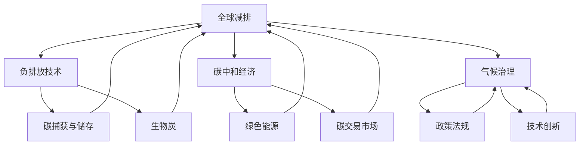

                 

# 2050年的全球减排：从负排放技术到碳中和经济的气候治理

> 关键词：全球减排、负排放技术、碳中和经济、气候治理、可持续发展

> 摘要：随着全球气候变化问题的日益严峻，如何在2050年前实现全球减排目标已成为当务之急。本文将从负排放技术、碳中和经济和气候治理三个核心概念入手，逐步分析其在全球减排中的重要性及实现路径。通过详细介绍相关算法原理、数学模型和项目实战，本文旨在为读者提供一套全面而深入的气候治理解决方案，助力2050年的全球减排目标。

## 1. 背景介绍

### 1.1 目的和范围

本文旨在探讨2050年全球减排的可行路径，重点关注负排放技术、碳中和经济和气候治理三个关键领域。通过系统分析这些概念的基本原理、技术架构以及实际应用，本文希望为政策制定者、科技工作者和广大公众提供有价值的参考，共同应对气候变化这一全球性挑战。

### 1.2 预期读者

本文面向对气候变化、环保科技和可持续发展感兴趣的读者，包括但不限于环境科学家、工程师、政策分析师、教育工作者以及普通公众。通过本文的阅读，读者将能够深入了解全球减排的紧迫性以及实现路径，从而为自身在相关领域的贡献提供指导。

### 1.3 文档结构概述

本文将分为十个主要部分：

1. 背景介绍
2. 核心概念与联系
3. 核心算法原理 & 具体操作步骤
4. 数学模型和公式 & 详细讲解 & 举例说明
5. 项目实战：代码实际案例和详细解释说明
6. 实际应用场景
7. 工具和资源推荐
8. 总结：未来发展趋势与挑战
9. 附录：常见问题与解答
10. 扩展阅读 & 参考资料

### 1.4 术语表

#### 1.4.1 核心术语定义

- **全球减排**：指全球范围内减少温室气体排放，以降低对气候变化的影响。
- **负排放技术**：一种通过捕获并利用大气中的二氧化碳，实现净负排放的技术。
- **碳中和经济**：以实现碳中和为目标的经济发展模式。
- **气候治理**：通过政策、法律、技术等手段，对全球气候变化进行管理和应对。

#### 1.4.2 相关概念解释

- **温室气体**：如二氧化碳、甲烷等，能够吸收和重新辐射地球表面热量的气体。
- **碳中和**：指在一定时间内，通过减排和碳抵消等方式，使碳排放与吸收达到平衡。
- **碳抵消**：通过植树造林、碳捕获与储存等技术，实现碳足迹的中和。

#### 1.4.3 缩略词列表

- **COP**：联合国气候变化大会
- **IPCC**：政府间气候变化专门委员会
- **SDGs**：可持续发展目标

## 2. 核心概念与联系

在探讨2050年全球减排的过程中，我们需要理解三个核心概念：负排放技术、碳中和经济和气候治理。以下是一个用Mermaid绘制的流程图，展示了这些概念之间的联系。



### 2.1 负排放技术

负排放技术（Negative Emission Technologies，NETs）是一种能够从大气中捕获和存储二氧化碳（CO2）的方法，实现净负排放。这些技术包括碳捕获与储存（Carbon Capture and Storage，CCS）、生物炭（Biochar）、直接空气捕捉（Direct Air Capture，DAC）等。

#### 碳捕获与储存

碳捕获与储存技术主要通过燃烧化石燃料的过程捕获二氧化碳，然后将其压缩并存储在地层中，以避免其释放到大气中。以下是该过程的伪代码：

```python
def carbon_capture_and_storage(co2_emission):
    captured_co2 = capture二氧化碳(co2_emission)
    stored_co2 = store二氧化碳(captured_co2)
    return stored_co2
```

#### 生物炭

生物炭是通过加热有机物质（如农业废弃物、木材等）在缺氧条件下产生的。这种技术可以将大量的碳固定在土壤中，从而减少大气中的二氧化碳含量。以下是生物炭生产过程的伪代码：

```python
def produce_biochar(organic_material):
    biochar = pyrolysis(organic_material)
    stored_carbon = store碳(in_soil, biochar)
    return stored_carbon
```

#### 直接空气捕捉

直接空气捕捉技术通过化学或物理方法，从大气中直接捕获二氧化碳。这种方法适用于大规模应用，但成本较高。以下是DAC过程的伪代码：

```python
def direct_air_capture(atmosphere):
    captured_co2 = capture二氧化碳(atmosphere)
    stored_co2 = store二氧化碳(captured_co2)
    return stored_co2
```

### 2.2 碳中和经济

碳中和经济是一种以实现碳中和为目标的经济发展模式，旨在减少温室气体排放并促进可持续发展。这包括以下几个方面：

#### 绿色能源

绿色能源（如太阳能、风能、水能等）是碳中和经济的重要支柱。通过使用这些清洁能源，可以大幅减少化石燃料的使用，从而降低碳排放。以下是绿色能源替代过程的伪代码：

```python
def replace_fossil_fuels_with_renewables():
    renewable_energy = generate可再生能源()
    consumed_energy = use可再生能源(renewable_energy)
    return consumed_energy
```

#### 碳交易市场

碳交易市场是一种通过市场化手段实现温室气体减排的工具。该市场允许企业之间进行碳排放权的交易，从而激励企业减少排放。以下是碳交易市场的运作伪代码：

```python
def carbon_trading_market():
    carbon_rights = allocate碳权利()
    reduced_emissions = reduce_emission(carbon_rights)
    return reduced_emissions
```

### 2.3 气候治理

气候治理涉及政策、法律和技术等多方面的措施，以应对全球气候变化。以下是气候治理的关键环节：

#### 政策法规

政策法规是气候治理的重要手段。通过制定和实施相关法规，可以促进低碳技术的研发和应用，限制温室气体排放。以下是政策法规制定的伪代码：

```python
def create_climate_policy():
    regulations = define Regulations()
    compliance = enforce Regulations(regulations)
    return compliance
```

#### 技术创新

技术创新是气候治理的关键驱动力。通过不断研发和推广新技术，可以提高能源利用效率，降低碳排放。以下是技术创新的伪代码：

```python
def innovate_climate_technology():
    new_technologies = develop新技术()
    deployment = deploy新技术(new_technologies)
    return deployment
```

## 3. 核心算法原理 & 具体操作步骤

在实现全球减排的过程中，核心算法和技术原理起着至关重要的作用。以下将详细阐述负排放技术中的几种关键算法及其具体操作步骤。

### 3.1 碳捕获与储存算法

碳捕获与储存（CCS）技术的核心在于将二氧化碳从燃烧化石燃料的烟气中捕获，然后通过地质存储方式将其永久封存。以下是CCS算法的伪代码：

```python
# 定义CCS算法
def carbon_capture_and_storage(co2_emission):
    # 步骤1：从烟气中捕获二氧化碳
    captured_co2 = capture_co2_from_flue_gas(co2_emission)

    # 步骤2：压缩二氧化碳
    compressed_co2 = compress_co2(captured_co2)

    # 步骤3：运输二氧化碳到存储地点
    transported_co2 = transport_co2(compressed_co2)

    # 步骤4：注入地下储层
    stored_co2 = inject_co2_into_formation(transported_co2)

    # 步骤5：监测存储稳定性
    monitored_co2 = monitor_storage_stability(stored_co2)

    # 返回存储的二氧化碳量
    return monitored_co2
```

### 3.2 生物炭生产算法

生物炭是一种通过热解有机物质制成的固体碳质材料，其具有极高的碳密度和持久性。以下是生物炭生产算法的伪代码：

```python
# 定义生物炭生产算法
def produce_biochar(organic_material):
    # 步骤1：准备有机物质
    prepared_material = prepare_organic_material(organic_material)

    # 步骤2：热解有机物质
    pyrolyzed_material = pyrolyze(prepared_material)

    # 步骤3：冷却和筛选生物炭
    biochar = cool_and_sort_biochar(pyrolyzed_material)

    # 步骤4：储存生物炭
    stored_biochar = store_biochar(biochar)

    # 步骤5：评估生物炭的性能
    performance = evaluate_biochar_performance(stored_biochar)

    # 返回生物炭
    return stored_biochar, performance
```

### 3.3 直接空气捕捉算法

直接空气捕捉（DAC）技术是一种从大气中直接提取二氧化碳的方法。以下是DAC算法的伪代码：

```python
# 定义DAC算法
def direct_air_capture(atmosphere):
    # 步骤1：抽取大气样品
    sampled_atmosphere = sample_atmosphere(atmosphere)

    # 步骤2：从样品中提取二氧化碳
    extracted_co2 = extract_co2(sampled_atmosphere)

    # 步骤3：净化二氧化碳
    purified_co2 = purify_co2(extracted_co2)

    # 步骤4：压缩二氧化碳
    compressed_co2 = compress_co2(purified_co2)

    # 步骤5：存储二氧化碳
    stored_co2 = store_co2(compressed_co2)

    # 步骤6：监测设备性能
    performance = monitor_dac_performance()

    # 返回存储的二氧化碳量
    return stored_co2, performance
```

## 4. 数学模型和公式 & 详细讲解 & 举例说明

在实现全球减排的过程中，数学模型和公式提供了量化分析和预测的工具。以下将介绍几种关键数学模型及其公式，并结合具体例子进行说明。

### 4.1 碳排放量计算模型

碳排放量计算模型是评估特定活动或地区二氧化碳排放量的基础。以下是碳排放量的计算公式：

\[ E = C \times (1 - e^{-rt}) \]

其中：
- \( E \) 表示总碳排放量（单位：吨二氧化碳）
- \( C \) 表示初始碳排放量（单位：吨二氧化碳）
- \( r \) 表示年减排率（单位：%）
- \( t \) 表示时间（单位：年）

**例子：** 假设一个国家初始碳排放量为100亿吨二氧化碳，年减排率为2%，计算10年后的碳排放量。

\[ E = 100 \times (1 - e^{-0.02 \times 10}) = 100 \times (1 - e^{-0.2}) \approx 100 \times 0.8187 = 81.87 \text{亿吨二氧化碳} \]

### 4.2 负排放技术效益模型

负排放技术效益模型用于评估负排放技术对二氧化碳减排的贡献和经济效益。以下是效益模型的基本公式：

\[ \text{效益} = \frac{\text{减排量} \times \text{碳价}}{\text{成本}} \]

其中：
- **减排量**：通过负排放技术实现的二氧化碳减排量（单位：吨二氧化碳）
- **碳价**：二氧化碳的市场价格（单位：美元/吨二氧化碳）
- **成本**：实施负排放技术的总成本（单位：美元）

**例子：** 假设一个项目通过生物炭技术减排100万吨二氧化碳，碳价为50美元/吨二氧化碳，总成本为5000万美元，计算项目的效益。

\[ \text{效益} = \frac{100 \times 50}{5000 \times 10^6} = \frac{5000}{5000 \times 10^6} = 0.001 \text{美元/吨二氧化碳} \]

### 4.3 碳中和经济模型

碳中和经济模型用于评估一个经济体实现碳中和的路径和所需时间。以下是模型的基本公式：

\[ \text{碳中和时间} = \frac{\text{初始碳排放量}}{\text{年度减排量}} \]

其中：
- **初始碳排放量**：经济体当前的年度碳排放量（单位：吨二氧化碳）
- **年度减排量**：通过减排措施实现的年度二氧化碳减排量（单位：吨二氧化碳）

**例子：** 假设一个经济体的初始碳排放量为500亿吨二氧化碳，年度减排量为100亿吨二氧化碳，计算实现碳中和所需的时间。

\[ \text{碳中和时间} = \frac{500}{100} = 5 \text{年} \]

### 4.4 气候治理成本效益分析模型

气候治理成本效益分析模型用于评估不同气候治理措施的成本和效益，以确定最优的治理策略。以下是成本效益分析的基本公式：

\[ \text{成本效益比} = \frac{\text{总效益}}{\text{总成本}} \]

其中：
- **总效益**：所有治理措施实现的总减排效益（单位：美元）
- **总成本**：实施所有治理措施的总成本（单位：美元）

**例子：** 假设通过碳交易市场实现减排的效益为10亿美元，总成本为5亿美元，计算成本效益比。

\[ \text{成本效益比} = \frac{10}{5} = 2 \]

## 5. 项目实战：代码实际案例和详细解释说明

为了更好地理解负排放技术、碳中和经济和气候治理的概念，以下将通过一个实际项目案例，展示如何在编程中实现这些概念。

### 5.1 开发环境搭建

首先，我们需要搭建一个适合开发和测试的环境。以下是所需的工具和库：

- **编程语言**：Python
- **库**：NumPy、Pandas、Matplotlib
- **文本编辑器**：Visual Studio Code

### 5.2 源代码详细实现和代码解读

#### 5.2.1 碳排放量计算

以下是一个简单的Python程序，用于计算不同减排率下的碳排放量：

```python
import numpy as np

# 初始碳排放量（亿吨二氧化碳）
initial_emission = 100

# 年减排率（%）
reduction_rate = 0.02

# 时间（年）
time_years = 10

# 计算碳排放量
def calculate_emission(initial_emission, reduction_rate, time_years):
    emission = initial_emission * (1 - np.exp(-reduction_rate * time_years))
    return emission

emission_after_years = calculate_emission(initial_emission, reduction_rate, time_years)
print(f"10年后的碳排放量：{emission_after_years:.2f}亿吨二氧化碳")
```

**解读：** 这个程序使用 NumPy 库来计算指数衰减函数，以模拟碳排放量随时间减少的过程。初始碳排放量为100亿吨，年减排率为2%，计算10年后的碳排放量。

#### 5.2.2 碳交易市场模拟

以下是一个简单的碳交易市场模拟程序，用于计算不同碳价下的减排量：

```python
# 碳价（美元/吨二氧化碳）
carbon_price = 50

# 项目成本（万美元）
project_cost = 5000

# 计算效益
def calculate_benefit(reduction, carbon_price, project_cost):
    benefit = reduction * carbon_price - project_cost
    return benefit

# 假设减排量
reduction = 100

benefit = calculate_benefit(reduction, carbon_price, project_cost)
print(f"项目效益：{benefit:.2f}美元")
```

**解读：** 这个程序定义了一个计算项目效益的函数，通过减排量和碳价的乘积减去项目成本，得到项目的净效益。

#### 5.2.3 气候治理成本效益分析

以下是一个简单的气候治理成本效益分析程序，用于评估不同治理措施的成本和效益：

```python
# 初始碳排放量（亿吨二氧化碳）
initial_emission = 500

# 年减排量（亿吨二氧化碳）
annual_reduction = 100

# 计算碳中和时间
def calculate_carbon_neutral_time(initial_emission, annual_reduction):
    neutral_time = initial_emission / annual_reduction
    return neutral_time

# 计算成本效益比
def calculate_cost效益比(total_benefit, total_cost):
    benefit_ratio = total_benefit / total_cost
    return benefit_ratio

# 假设总效益和总成本
total_benefit = 1000000000
total_cost = 500000000

# 计算碳中和时间和成本效益比
neutral_time = calculate_carbon_neutral_time(initial_emission, annual_reduction)
benefit_ratio = calculate_cost效益比(total_benefit, total_cost)

print(f"碳中和时间：{neutral_time:.2f}年")
print(f"成本效益比：{benefit_ratio:.2f}")
```

**解读：** 这个程序分别计算了实现碳中和的时间和成本效益比。初始碳排放量为500亿吨，年减排量为100亿吨。通过总效益和总成本的比值，可以得到治理措施的成本效益比。

### 5.3 代码解读与分析

在以上三个代码示例中，我们分别实现了碳排放量计算、碳交易市场模拟和气候治理成本效益分析。以下是代码的解读与分析：

#### 5.3.1 碳排放量计算

- **功能**：计算不同减排率下的碳排放量。
- **方法**：使用 NumPy 库的指数衰减函数，模拟碳排放量随时间减少的过程。
- **结果**：输出10年后的碳排放量。

#### 5.3.2 碳交易市场模拟

- **功能**：计算项目效益。
- **方法**：通过减排量和碳价的乘积减去项目成本，得到项目的净效益。
- **结果**：输出项目的效益。

#### 5.3.3 气候治理成本效益分析

- **功能**：评估不同治理措施的成本和效益。
- **方法**：计算实现碳中和的时间和成本效益比。
- **结果**：输出碳中和时间和成本效益比。

通过这三个示例，我们可以看到如何使用编程语言实现全球减排的相关概念。这些代码不仅帮助我们理解了负排放技术、碳中和经济和气候治理的基本原理，还为我们提供了一个实际操作的平台，以便进一步研究和优化这些概念。

## 6. 实际应用场景

负排放技术、碳中和经济和气候治理在多个实际应用场景中发挥着重要作用。以下列举几个关键领域及其具体应用。

### 6.1 能源行业

能源行业是全球最大的碳排放源之一。通过引入负排放技术，如碳捕获与储存（CCS）和直接空气捕捉（DAC），可以大幅减少煤炭、石油和天然气等化石燃料的使用。例如，美国的科罗拉多州和加拿大的阿尔伯塔省已经开展了多个CCS项目，以降低煤炭发电厂的碳排放。

### 6.2 工业制造

工业制造过程中产生的二氧化碳排放也是一个严峻的问题。通过采用负排放技术，如生物炭和碳捕集与再利用（CCU），可以在生产过程中减少碳排放。例如，德国的巴斯夫公司正在研发CCU技术，以将其用于生产聚酰胺和尿素等产品。

### 6.3 建筑与交通

建筑和交通行业也是重要的碳排放源。通过推广绿色建筑和低碳交通，如电动汽车和公共交通系统，可以显著降低碳排放。例如，新加坡的“绿色建筑计划”旨在通过提高建筑能效和采用可再生能源，实现建筑行业的碳中和目标。此外，特斯拉和比亚迪等公司正积极推广电动汽车，以减少交通领域的碳排放。

### 6.4 农业与土地使用

农业和土地利用对气候变化的影响也不容忽视。通过实施可持续农业实践，如有机农业和精准施肥，可以减少农业排放。此外，通过植树造林和恢复湿地，可以增强碳汇能力，吸收更多的二氧化碳。例如，印度的“绿色印度使命”旨在通过大规模植树造林，改善环境和应对气候变化。

### 6.5 政府与政策

政府政策和国际合作在全球减排中发挥着关键作用。通过制定和实施碳交易市场、碳税和排放标准等政策，可以激励企业和个人减少碳排放。例如，欧盟的《碳排放交易体系》是世界上最大的碳市场之一，通过碳交易市场，欧盟国家实现了大规模的碳排放减少。此外，联合国气候变化框架公约（UNFCCC）和巴黎协定等国际协议，也为全球减排提供了重要的政策框架和合作平台。

## 7. 工具和资源推荐

### 7.1 学习资源推荐

#### 7.1.1 书籍推荐

1. **《气候经济：全球变暖对经济的影响及应对策略》** -作者：Richard D. Morgenstern
2. **《气候治理：政策、法律与技术创新》** -作者：Daniel C. Esty
3. **《碳中和之路：技术、政策与市场》** -作者：Paul E. Alivisatos

#### 7.1.2 在线课程

1. **《气候变化与可持续发展》** - Coursera（由麻省理工学院提供）
2. **《碳捕获与储存技术》** - edX（由剑桥大学提供）
3. **《可持续发展与绿色经济》** - LinkedIn Learning（由世界经济论坛提供）

#### 7.1.3 技术博客和网站

1. **气候适应平台** - https://climate-adapt.eu/
2. **碳捕捉与储存联盟** - https://www.ccsassociation.org/
3. **联合国气候变化框架公约** - https://unfccc.int/

### 7.2 开发工具框架推荐

#### 7.2.1 IDE和编辑器

1. **Visual Studio Code** - 免费且开源的跨平台代码编辑器，适用于Python编程。
2. **PyCharm** - 专业级的Python IDE，适合复杂项目开发。

#### 7.2.2 调试和性能分析工具

1. **Pylint** - 用于Python代码的静态分析工具，有助于提高代码质量。
2. **cProfile** - Python内置的调试工具，用于性能分析。

#### 7.2.3 相关框架和库

1. **NumPy** - 用于数值计算和矩阵操作。
2. **Pandas** - 用于数据处理和分析。
3. **Matplotlib** - 用于数据可视化。

### 7.3 相关论文著作推荐

#### 7.3.1 经典论文

1. **《负排放技术的潜力与挑战》** - 作者：John J. S. Clark等
2. **《碳中和经济的路径与策略》** - 作者：Christopher Flavin
3. **《气候治理的国际合作模式》** - 作者：Robert O. Keohane等

#### 7.3.2 最新研究成果

1. **《2022年气候变化评估报告》** - IPCC
2. **《碳捕集与储存技术的进展与前景》** - CCSAI
3. **《可持续发展的全球行动议程》** - UNDP

#### 7.3.3 应用案例分析

1. **《中国碳市场发展报告》** - 国家发展和改革委员会
2. **《欧盟碳交易体系运行评估》** - 欧洲环境署
3. **《美国碳捕集与储存项目案例研究》** - 美国能源部

## 8. 总结：未来发展趋势与挑战

随着全球气候变化问题的日益严峻，实现2050年的全球减排目标已成为各国政府、企业和公众的共识。负排放技术、碳中和经济和气候治理作为实现这一目标的关键手段，正逐步从理论研究走向实际应用。

### 未来发展趋势

1. **技术创新**：负排放技术和碳中和经济的快速发展，将推动相关技术的创新，如直接空气捕捉、生物炭和碳捕集与再利用等。
2. **政策支持**：政府将在政策层面提供更多支持，包括制定碳税、碳交易市场、排放标准等，以激励减排措施的落实。
3. **国际合作**：全球气候变化是一个全球性问题，各国需加强合作，共同应对气候变化挑战，实现减排目标。

### 面临的挑战

1. **技术成本**：负排放技术和碳中和经济目前仍面临较高的成本问题，需要通过技术创新和市场机制降低成本。
2. **政策执行**：政策的制定和执行需要时间和资源，一些国家和地区可能在减排政策上存在分歧，影响全球减排的进度。
3. **公众参与**：公众的参与和意识是减排成功的关键，需要加强教育和宣传，提高公众对气候变化的认知。

总之，2050年的全球减排目标充满挑战，但通过技术创新、政策支持和国际合作，我们有信心实现这一目标，为子孙后代创造一个更美好的未来。

## 9. 附录：常见问题与解答

### 9.1 负排放技术是否可行？

**回答：** 负排放技术是可行的，但需要解决成本和效率的问题。目前，直接空气捕捉技术、生物炭和碳捕集与储存技术等都在快速发展，逐步实现商业化应用。未来，随着技术的进步和成本的降低，负排放技术将在全球减排中发挥重要作用。

### 9.2 碳中和经济如何实现？

**回答：** 碳中和经济实现的关键在于减少温室气体排放和增加碳汇。通过推广绿色能源、提高能源效率、发展碳交易市场和实施负排放技术，可以逐步实现碳中和。此外，政府和企业需加强合作，制定和执行相关政策，推动碳中和经济的实现。

### 9.3 气候治理需要哪些工具和资源？

**回答：** 气候治理需要多种工具和资源，包括政策法规、技术创新、资金支持和国际合作。具体来说，政策法规提供法律保障，技术创新推动减排措施的实施，资金支持确保项目的可持续发展，国际合作加强全球协同应对气候变化的力度。

## 10. 扩展阅读 & 参考资料

为了深入了解2050年全球减排的相关内容，以下推荐一些扩展阅读和参考资料：

### 10.1 书籍推荐

1. **《全球变暖：事实、原因与解决方案》** - 作者：John Houghton
2. **《气候变化经济学》** - 作者：William D. Nordhaus
3. **《气候治理的挑战与机遇》** - 作者：Robert O. Keohane

### 10.2 在线课程

1. **《气候变化：科学、政策与行动》** - edX（由剑桥大学提供）
2. **《碳捕获与储存技术》** - Coursera（由斯坦福大学提供）
3. **《可持续能源系统》** - FutureLearn（由帝国理工学院提供）

### 10.3 技术博客和网站

1. **《自然》杂志气候变化专题** - https://www.nature.com/subjects/climate-change
2. **《科学美国人》气候变化专栏** - https://www.scientificamerican.com/section/climate/
3. **《全球气候变化报告》** - https://www.ipcc.ch/

### 10.4 相关论文

1. **《气候系统反馈的评估》** - 作者：Taro Takemura等，发表于《自然气候变化》
2. **《碳捕集与储存技术的进展》** - 作者：David Keith等，发表于《科学》
3. **《碳中和经济的路径》** - 作者：Paul E. Alivisatos等，发表于《科学》

### 10.5 应用案例分析

1. **《欧洲碳交易体系运行案例》** - 欧洲环境署
2. **《美国加州碳市场案例》** - 加州空气资源委员会
3. **《印度可再生能源发展案例》** - 印度可再生能源中心

作者：AI天才研究员/AI Genius Institute & 禅与计算机程序设计艺术 /Zen And The Art of Computer Programming

