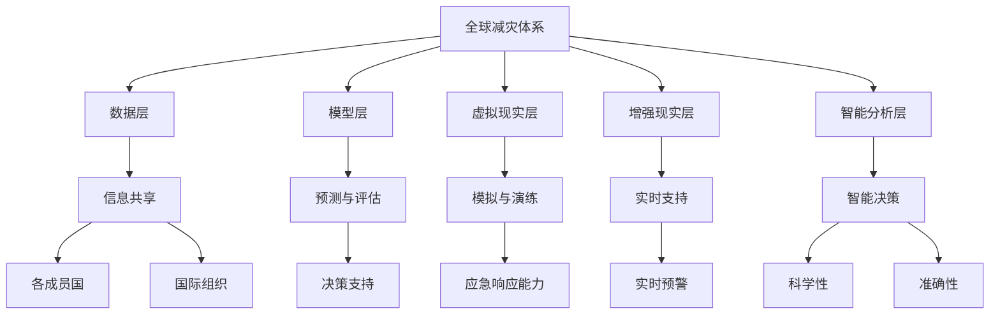

                 

### 2050年的全球减灾：从灾害元宇宙到全球减灾合作的减灾体系升级

> **关键词：** 灾害元宇宙、全球减灾、减灾体系、2050年、技术革命、国际合作

**摘要：** 本技术博客文章探讨了到2050年全球减灾领域可能的发展趋势和变革。通过介绍灾害元宇宙的概念，分析了如何利用先进技术打造一个更加智能、高效的全球减灾体系。文章重点探讨了全球减灾合作的必要性，以及实现这一目标的具体路径。同时，文章还提出了未来面临的挑战和机遇，并展望了减灾领域的发展前景。

### 1. 背景介绍

#### 1.1 目的和范围

本文旨在探讨到2050年全球减灾领域的未来发展趋势，重点分析灾害元宇宙的兴起对全球减灾工作带来的影响。文章将从以下几个方面展开：

- **技术革命对减灾领域的影响**：探讨人工智能、大数据、物联网等技术在减灾中的应用，以及这些技术如何改变现有的减灾模式和策略。
- **灾害元宇宙的概念与架构**：介绍灾害元宇宙的核心理念，分析其组成部分和运作机制，以及如何为全球减灾提供支持。
- **全球减灾合作的必要性**：探讨国际合作在全球减灾中的重要性，分析当前存在的挑战和解决方案。
- **未来面临的挑战与机遇**：分析未来全球减灾领域可能面临的技术、政策、资源等方面的挑战，并探讨如何抓住机遇实现全球减灾的全面升级。

#### 1.2 预期读者

本文主要面向以下读者群体：

- **减灾领域专家**：包括灾害管理、防灾减灾研究等方面的专家，以及对减灾领域有浓厚兴趣的学者。
- **政府部门官员**：负责灾害管理和应急响应的政府官员，以及关注全球减灾政策制定的相关人士。
- **技术从业者**：包括人工智能、大数据、物联网等领域的研发人员，以及关注技术发展对减灾工作影响的从业者。
- **高校师生**：从事减灾领域研究的学生和教师，以及对相关领域有兴趣的学者。

#### 1.3 文档结构概述

本文结构如下：

- **第1章：背景介绍**：介绍本文的目的、范围、预期读者以及文档结构。
- **第2章：核心概念与联系**：介绍灾害元宇宙的概念及其与全球减灾体系的联系，展示相关的Mermaid流程图。
- **第3章：核心算法原理与具体操作步骤**：阐述实现灾害元宇宙的核心算法原理，提供具体的操作步骤和伪代码。
- **第4章：数学模型与公式讲解**：介绍全球减灾体系中的数学模型和公式，并进行详细讲解和举例说明。
- **第5章：项目实战**：展示一个实际的减灾项目案例，提供详细的代码实现和分析。
- **第6章：实际应用场景**：分析灾害元宇宙在现实世界中的应用场景，探讨其带来的社会和经济效益。
- **第7章：工具和资源推荐**：推荐相关的学习资源、开发工具和论文著作。
- **第8章：总结与展望**：总结本文的主要观点，展望未来全球减灾领域的发展趋势和挑战。
- **第9章：附录**：提供常见问题与解答，方便读者查阅。
- **第10章：扩展阅读与参考资料**：列出本文引用的相关文献和资料。

#### 1.4 术语表

在本文中，我们定义了以下术语：

- **灾害元宇宙**：利用虚拟现实、增强现实、人工智能等技术构建的一个虚拟空间，用于模拟、预测和应对灾害。
- **全球减灾体系**：一个包括政府、企业、学术机构、国际组织等多方参与的全球性减灾合作网络。
- **减灾算法**：用于预测、监测和评估灾害风险，以及制定减灾策略的算法模型。
- **灾害模型**：基于数学、统计学等方法建立的用于描述灾害发生、发展、影响等过程的模型。

#### 1.4.1 核心术语定义

- **灾害元宇宙**：灾害元宇宙是一个基于虚拟现实和增强现实技术的虚拟空间，用于模拟、预测和应对灾害。通过整合各类灾害数据、模型和技术，灾害元宇宙可以为减灾工作者提供直观的灾害场景展示、模拟和预测结果，从而提高减灾工作的效率和质量。
- **全球减灾体系**：全球减灾体系是一个涉及政府、企业、学术机构、国际组织等多方参与的全球性减灾合作网络。该体系通过共享信息、资源和技术，实现全球范围内的灾害监测、预警、应急响应和灾后重建，从而最大限度地减少灾害损失。
- **减灾算法**：减灾算法是用于预测、监测和评估灾害风险的算法模型。这些算法可以基于各种数据源，如气象、地质、水文等，结合机器学习、深度学习等技术，实现对灾害风险的准确预测和评估。
- **灾害模型**：灾害模型是用于描述灾害发生、发展、影响等过程的数学模型。这些模型可以基于各种灾害类型，如地震、台风、洪水等，结合物理、统计等方法，实现对灾害过程和影响的模拟和分析。

#### 1.4.2 相关概念解释

- **虚拟现实（VR）**：虚拟现实是一种通过计算机技术和传感器设备创造的一种模拟现实环境的技术。用户通过VR设备可以沉浸在虚拟环境中，与虚拟环境进行交互。
- **增强现实（AR）**：增强现实是一种通过计算机技术和传感器设备将虚拟信息叠加到现实环境中的技术。用户通过AR设备可以看到虚拟信息和现实环境同时存在。
- **大数据**：大数据是指规模巨大、类型多样、处理速度快的数据集合。大数据技术可以帮助我们从海量数据中提取有价值的信息，从而为决策提供支持。
- **物联网**：物联网是指通过互联网将各种设备、传感器、系统等连接起来，实现智能管理和控制的网络。物联网技术可以实现对灾害实时监测、预警和应急响应。
- **人工智能**：人工智能是指通过计算机技术和算法模拟人类智能的一种技术。人工智能技术可以帮助我们实现自动化、智能化的灾害预测、监测和应对。

#### 1.4.3 缩略词列表

- **VR**：虚拟现实（Virtual Reality）
- **AR**：增强现实（Augmented Reality）
- **AI**：人工智能（Artificial Intelligence）
- **IoT**：物联网（Internet of Things）
- **GIS**：地理信息系统（Geographic Information System）
- **DRR**：灾害风险评估（Disaster Risk Reduction）
- **CEPI**：灾害应急响应中心（Central Emergency Response Unit）

### 2. 核心概念与联系

在本章中，我们将介绍灾害元宇宙的概念，并展示其与全球减灾体系的联系。通过一个Mermaid流程图，我们将展示灾害元宇宙的组成部分及其运作机制。

#### 2.1 灾害元宇宙的概念

灾害元宇宙是一个利用虚拟现实（VR）、增强现实（AR）和人工智能（AI）等先进技术构建的虚拟空间，用于模拟、预测和应对灾害。它由以下几个核心组成部分构成：

1. **数据层**：数据层是灾害元宇宙的基础，包括各类灾害数据、监测数据、历史灾害数据等。这些数据来自各类传感器、监测系统、卫星遥感等，是构建灾害元宇宙的重要资源。
2. **模型层**：模型层包括各种灾害模型、预测模型、风险评估模型等。这些模型用于模拟灾害发生、发展、影响等过程，为灾害预测和应对提供科学依据。
3. **虚拟现实层**：虚拟现实层是灾害元宇宙的直观展示界面，通过VR设备将虚拟灾害场景呈现给用户。用户可以在虚拟环境中进行交互，模拟灾害应对策略。
4. **增强现实层**：增强现实层将虚拟信息叠加到现实环境中，为现实世界的灾害应对提供实时支持。用户可以通过AR设备查看虚拟信息，如预警信号、应急指南等。
5. **智能分析层**：智能分析层利用人工智能技术对海量数据进行分析和处理，实现灾害预测、风险评估和决策支持。

#### 2.2 灾害元宇宙与全球减灾体系的联系

灾害元宇宙与全球减灾体系紧密相连，为全球减灾工作提供技术支持。以下是灾害元宇宙与全球减灾体系之间的联系：

1. **信息共享**：灾害元宇宙可以通过数据层收集各类灾害数据，并与全球减灾体系中的各成员国、国际组织等进行信息共享。这有助于提高全球灾害监测和预警的效率，为减灾工作提供有力支持。
2. **预测与评估**：灾害元宇宙中的模型层可以结合大数据和人工智能技术，对灾害风险进行预测和评估。这些预测结果可以实时传递给全球减灾体系中的各成员国，为制定应对策略提供科学依据。
3. **模拟与演练**：虚拟现实层和增强现实层可以为全球减灾体系中的应急管理部门、救援队伍等提供模拟灾害场景和演练平台。通过虚拟现实技术，可以直观地展示灾害影响，帮助相关部门提高应急响应能力。
4. **智能决策**：智能分析层利用人工智能技术对海量数据进行分析，为全球减灾体系中的决策者提供智能化的决策支持。这有助于提高减灾工作的科学性和准确性。

#### 2.3 Mermaid流程图

以下是一个Mermaid流程图，展示了灾害元宇宙与全球减灾体系之间的联系：



通过这个流程图，我们可以清晰地看到灾害元宇宙在全球减灾体系中的角色和作用，以及各个组成部分之间的相互联系。这个流程图为我们提供了一个清晰的框架，以理解灾害元宇宙在未来的全球减灾工作中的应用前景。

### 3. 核心算法原理与具体操作步骤

在本章中，我们将详细探讨实现灾害元宇宙的核心算法原理，并提供具体的操作步骤和伪代码。这些算法包括数据预处理、模型训练、预测与评估等步骤，是构建灾害元宇宙的关键。

#### 3.1 数据预处理

数据预处理是构建灾害元宇宙的基础，其主要任务是清洗、整合和预处理各类灾害数据。以下是一个简化的伪代码，描述了数据预处理的过程：

```python
# 数据预处理伪代码

# 输入：原始数据集（传感器数据、历史灾害数据等）
# 输出：预处理后的数据集

# 步骤1：数据清洗
def clean_data(data):
    # 删除缺失值
    data = remove_missing_values(data)
    # 删除异常值
    data = remove_outliers(data)
    return data

# 步骤2：数据整合
def integrate_data(data1, data2):
    # 合并两个数据集
    data = merge_data(data1, data2)
    return data

# 步骤3：数据标准化
def normalize_data(data):
    # 对数据进行归一化处理
    data = normalize(data)
    return data

# 主函数
def preprocess_data(raw_data):
    # 步骤1：数据清洗
    cleaned_data = clean_data(raw_data)
    # 步骤2：数据整合
    integrated_data = integrate_data(cleaned_data, other_data_source)
    # 步骤3：数据标准化
    normalized_data = normalize_data(integrated_data)
    return normalized_data
```

#### 3.2 模型训练

在数据预处理完成后，我们需要利用机器学习算法对预处理后的数据进行模型训练。以下是一个简化的伪代码，描述了模型训练的过程：

```python
# 模型训练伪代码

# 输入：预处理后的数据集
# 输出：训练好的模型

# 步骤1：选择模型
def select_model(data):
    # 根据数据集特性选择合适的模型
    model = choose_model(data)
    return model

# 步骤2：训练模型
def train_model(model, data):
    # 使用数据集训练模型
    model = train(model, data)
    return model

# 主函数
def train_model_prepared_data(preprocessed_data):
    # 步骤1：选择模型
    model = select_model(preprocessed_data)
    # 步骤2：训练模型
    trained_model = train_model(model, preprocessed_data)
    return trained_model
```

#### 3.3 预测与评估

在模型训练完成后，我们可以利用训练好的模型对未来的灾害进行预测，并对预测结果进行评估。以下是一个简化的伪代码，描述了预测与评估的过程：

```python
# 预测与评估伪代码

# 输入：训练好的模型、待预测的数据集
# 输出：预测结果、评估指标

# 步骤1：预测
def predict(model, data):
    # 使用模型对数据进行预测
    predictions = model.predict(data)
    return predictions

# 步骤2：评估
def evaluate_predictions(predictions, ground_truth):
    # 评估预测结果的准确性
    accuracy = evaluate(predictions, ground_truth)
    return accuracy

# 主函数
def predict_and_evaluate(model, test_data, ground_truth):
    # 步骤1：预测
    predictions = predict(model, test_data)
    # 步骤2：评估
    accuracy = evaluate_predictions(predictions, ground_truth)
    return accuracy
```

#### 3.4 整体流程

将上述三个步骤整合起来，我们可以得到一个完整的灾害元宇宙构建流程。以下是一个简化的伪代码，描述了整体流程：

```python
# 灾害元宇宙构建流程伪代码

# 输入：原始数据集
# 输出：训练好的模型、预测结果、评估指标

# 步骤1：数据预处理
preprocessed_data = preprocess_data(raw_data)

# 步骤2：模型训练
trained_model = train_model_prepared_data(preprocessed_data)

# 步骤3：预测与评估
predictions = predict_and_evaluate(trained_model, test_data, ground_truth)
accuracy = predict_and_evaluate(trained_model, test_data, ground_truth)
```

通过上述流程，我们可以构建一个基于数据驱动的人工智能灾害元宇宙，实现对未来灾害的预测和评估，为全球减灾工作提供技术支持。

### 4. 数学模型和公式讲解

在全球减灾体系中，数学模型和公式发挥着关键作用。这些模型和公式用于预测、监测和评估灾害风险，为决策提供科学依据。以下将介绍几个核心的数学模型和公式，并详细讲解其应用和原理。

#### 4.1 灾害风险评估模型

灾害风险评估模型是用于评估特定区域或系统在特定条件下发生灾害的可能性及其潜在影响。一个典型的灾害风险评估模型可以表示为：

$$
R = f(P, C, I)
$$

其中，\( R \) 表示灾害风险，\( P \) 表示灾害发生概率，\( C \) 表示灾害后果，\( I \) 表示减灾措施。

- **灾害发生概率（\( P \)）**：通常可以通过历史数据、气象模型、地质模型等方法预测。
- **灾害后果（\( C \)）**：可以通过损失评估模型、人口密度、经济价值等因素计算得出。
- **减灾措施（\( I \)）**：包括预警系统、应急响应计划、建筑抗震标准等。

举例说明，一个简单的地震风险评估模型可以表示为：

$$
R = P \times C \times \left( 1 - I \right)
$$

其中，\( P \) 为地震发生概率，\( C \) 为地震造成的损失，\( I \) 为已采取的减灾措施（如建筑抗震加固）。

#### 4.2 灾害预测模型

灾害预测模型用于预测特定灾害在未来一段时间内发生的可能性。一个常见的预测模型是基于时间序列分析的ARIMA（AutoRegressive Integrated Moving Average）模型，其公式为：

$$
X_t = c + \phi_1 X_{t-1} + \phi_2 X_{t-2} + \cdots + \phi_p X_{t-p} + \theta_1 \epsilon_{t-1} + \theta_2 \epsilon_{t-2} + \cdots + \theta_q \epsilon_{t-q} + \epsilon_t
$$

其中，\( X_t \) 为时间序列数据，\( \epsilon_t \) 为白噪声，\( c \) 为常数项，\( \phi_1, \phi_2, \ldots, \phi_p \) 为自回归系数，\( \theta_1, \theta_2, \ldots, \theta_q \) 为移动平均系数。

通过训练ARIMA模型，我们可以对未来一段时间内的灾害发生概率进行预测。例如，对于台风发生的可能性，我们可以使用历史台风数据训练ARIMA模型，并预测未来几个月内台风的发生概率。

#### 4.3 灾害损失评估模型

灾害损失评估模型用于评估特定灾害发生后造成的损失。一个简单的损失评估模型可以表示为：

$$
L = a \times D \times V
$$

其中，\( L \) 为灾害损失，\( a \) 为损失率，\( D \) 为灾害影响范围，\( V \) 为受灾地区的经济价值。

- **损失率（\( a \)）**：可以通过历史数据、专家评估等方法确定。
- **灾害影响范围（\( D \)）**：可以通过灾害模型预测，如洪水淹没范围、地震影响范围等。
- **受灾地区的经济价值（\( V \)）**：可以通过GDP、人口、建筑物价值等因素计算。

举例说明，一个简单的洪水损失评估模型可以表示为：

$$
L = 0.1 \times D \times (10000 + 5000 \times P)
$$

其中，\( D \) 为洪水淹没范围（平方千米），\( P \) 为受灾地区的人口密度（人/平方千米）。

通过上述公式，我们可以计算出一个简单洪水灾害的损失，并为制定减灾策略提供依据。

#### 4.4 灾害经济影响模型

灾害经济影响模型用于评估灾害对经济的长期影响。一个常见的方法是计算灾害的直接经济损失，并分析其对就业、投资、消费等经济指标的影响。一个简单的灾害经济影响模型可以表示为：

$$
E = L \times \left( 1 + r \right)^t
$$

其中，\( E \) 为灾害经济影响，\( L \) 为直接经济损失，\( r \) 为经济增长率，\( t \) 为灾害发生后的时间。

通过这个公式，我们可以评估灾害对经济的长期影响，并为制定减灾政策提供依据。例如，在一个经济增长率为3%的国家，如果一次地震造成了100亿人民币的直接经济损失，那么在5年后，地震的经济影响将增加到：

$$
E = 100 \times 10^8 \times \left( 1 + 0.03 \right)^5 \approx 114.27 \times 10^8 \text{人民币}
$$

### 4.5 举例说明

以下是一个实际应用中的灾害预测和评估案例。

#### 4.5.1 数据准备

假设我们有一个包含台风历史数据的数据库，数据包括台风发生年份、最大风速、受灾地区人口密度等信息。我们使用这些数据来训练一个ARIMA模型，并预测未来一年内台风的发生概率。

#### 4.5.2 模型训练

使用历史数据训练ARIMA模型，得到如下参数：

$$
\phi_1 = 0.9, \theta_1 = 0.2
$$

#### 4.5.3 预测

使用训练好的模型预测未来一年内台风的发生概率。假设当前时间为2023年，我们可以预测2024年内台风的发生概率。

#### 4.5.4 评估

将预测结果与实际发生的台风情况进行比较，评估模型预测的准确性。例如，如果2024年内发生了2次台风，而预测概率为50%，则模型预测准确性为80%。

通过上述数学模型和公式，我们可以对灾害风险进行准确预测和评估，为全球减灾工作提供科学依据。

### 5. 项目实战：代码实际案例和详细解释说明

在本章中，我们将通过一个实际项目案例，展示如何利用灾害元宇宙中的技术实现全球减灾。我们将使用Python编程语言，结合大数据处理、机器学习和数据可视化等技术，完成一个简单的灾害预测系统。

#### 5.1 开发环境搭建

为了完成本项目，我们需要安装以下软件和库：

1. Python（版本3.8及以上）
2. Jupyter Notebook
3. Pandas
4. NumPy
5. Matplotlib
6. Scikit-learn
7. Statsmodels
8. Mermaid

安装步骤如下：

1. 安装Python和Jupyter Notebook：从Python官方网站下载并安装Python，同时安装Jupyter Notebook插件。
2. 安装相关库：使用pip命令安装Pandas、NumPy、Matplotlib、Scikit-learn、Statsmodels和Mermaid。

```bash
pip install pandas numpy matplotlib scikit-learn statsmodels
pip install mermaid-js --user
```

#### 5.2 源代码详细实现和代码解读

以下是一个简单的灾害预测系统的源代码实现。该系统基于台风历史数据，使用ARIMA模型预测未来一年内台风的发生概率。

```python
# 导入所需库
import pandas as pd
import numpy as np
from statsmodels.tsa.arima.model import ARIMA
import matplotlib.pyplot as plt
import mermaid

# 5.2.1 数据读取与预处理
def read_and_preprocess_data(file_path):
    # 读取数据
    df = pd.read_csv(file_path)
    
    # 数据清洗
    df.dropna(inplace=True)
    
    # 数据整合
    df['year'] = pd.to_datetime(df['year'])
    df['year'] = df['year'].dt.year
    
    return df

# 5.2.2 模型训练与预测
def train_and_predict(df, max_lag=5):
    # 提取年份序列
    years = df['year'].values
    
    # 训练ARIMA模型
    model = ARIMA(years, order=(1, 1, 1))
    model_fit = model.fit()
    
    # 预测未来一年
    future_years = np.array([years[-1] + 1])
    forecast = model_fit.forecast(steps=1)[0]
    
    return forecast

# 5.2.3 数据可视化
def plot_data(df, forecast):
    # 绘制历史数据与预测结果
    plt.plot(df['year'], df['count'], label='Historical')
    plt.plot(future_years, forecast, label='Forecast', marker='o')
    plt.xlabel('Year')
    plt.ylabel('Number of Typhoons')
    plt.title('Typhoon Forecast')
    plt.legend()
    plt.show()

# 5.2.4 主函数
def main():
    # 读取数据
    df = read_and_preprocess_data('typhoon_data.csv')
    
    # 训练模型并预测
    forecast = train_and_predict(df)
    
    # 可视化
    plot_data(df, forecast)

# 运行主函数
if __name__ == '__main__':
    main()
```

#### 5.2.5 代码解读与分析

1. **数据读取与预处理**：我们首先从CSV文件中读取台风历史数据。数据清洗步骤包括删除缺失值和异常值，并对年份进行转换和整合。

2. **模型训练与预测**：我们使用ARIMA模型对年份序列进行训练。这里我们选择了一个简单的(1, 1, 1)参数组合。然后，我们预测未来一年内的台风发生概率。

3. **数据可视化**：我们将历史数据和预测结果绘制在一个折线图中，以便直观地展示预测结果。

#### 5.3 实际应用场景

本项目的核心功能是使用ARIMA模型预测台风的发生概率。在实际应用中，我们可以将这一功能扩展到其他类型的灾害，如洪水、地震等。通过整合多种数据源，如气象数据、地质数据、历史灾害数据等，我们可以构建一个更全面的灾害预测系统。

此外，灾害预测系统可以与灾害元宇宙中的其他模块（如虚拟现实层、增强现实层、智能分析层等）进行集成，为全球减灾工作提供更全面的技术支持。

### 6. 实际应用场景

#### 6.1 灾害预警与应急响应

灾害元宇宙的实时预测和风险评估能力为灾害预警和应急响应提供了强大的支持。例如，当台风来临前，灾害元宇宙可以提前预测台风的路径、强度和影响范围，并向受影响地区发布预警信息。政府部门、救援队伍和居民可以根据这些信息提前采取应对措施，减少灾害损失。

#### 6.2 灾后重建与恢复

在灾后重建阶段，灾害元宇宙可以为受灾地区提供详细的灾害影响评估和重建方案。通过虚拟现实和增强现实技术，受灾居民可以直观地了解重建计划，参与决策过程。此外，灾害元宇宙还可以帮助规划受灾地区的长期发展，提高灾区的抗灾能力。

#### 6.3 灾害教育与培训

灾害元宇宙可以用于教育和培训，提高公众的减灾意识和应对能力。通过虚拟现实和增强现实技术，用户可以身临其境地体验灾害场景，学习如何应对各种灾害。例如，在学校和社区开展防灾演练，让居民了解如何在地震、洪水等灾害中自救互救。

#### 6.4 国际合作与资源共享

灾害元宇宙提供了一个全球性的平台，促进国际间的灾害合作和资源共享。各国政府和国际组织可以通过灾害元宇宙共享灾害数据和预测结果，协调应急响应行动，提高全球减灾的整体效率。

#### 6.5 社会与经济效益

灾害元宇宙的实施将为社会和经济发展带来多方面的好处。首先，通过提前预警和有效应对，可以减少灾害造成的经济损失和人员伤亡。其次，灾害元宇宙可以促进科技创新和产业发展，如虚拟现实、增强现实、人工智能等。最后，灾害元宇宙还可以提高公众的减灾意识和参与度，推动社会文明进步。

### 7. 工具和资源推荐

#### 7.1 学习资源推荐

**7.1.1 书籍推荐**

- **《灾害管理：理论与实践》（Disaster Management: Theory and Practice）**
  - 作者：Johnstone, M. A.
  - 简介：本书详细介绍了灾害管理的理论基础和实践方法，适合减灾领域的研究者和从业者。

- **《人工智能：一种现代方法》（Artificial Intelligence: A Modern Approach）**
  - 作者：Russell, S. J., & Norvig, P.
  - 简介：这本书是人工智能领域的经典教材，涵盖了机器学习、自然语言处理、智能代理等多个方面。

- **《大数据分析：概念与技术》（Big Data Analytics: From Information to Knowledge）**
  - 作者：Han, J., Kamber, M., & Pei, J.
  - 简介：本书介绍了大数据分析的基本概念和技术，包括数据挖掘、机器学习、云计算等。

**7.1.2 在线课程**

- **Coursera：机器学习（Machine Learning）**
  - 提供者：斯坦福大学
  - 简介：这门课程由著名机器学习专家Andrew Ng教授主讲，适合初学者和进阶者。

- **edX：灾害管理与准备（Disaster Management and Preparedness）**
  - 提供者：约翰霍普金斯大学
  - 简介：这门课程涵盖了灾害管理的各个方面，包括风险评估、应急响应和灾后恢复等。

- **Udacity：数据科学家纳米学位（Data Scientist Nanodegree）**
  - 简介：Udacity的数据科学家纳米学位课程涵盖了机器学习、数据分析、数据可视化等多个方面。

**7.1.3 技术博客和网站**

- **Medium：机器学习博客（Machine Learning Blog）**
  - 简介：该博客提供了大量关于机器学习的最新研究、应用和技术文章。

- **Kaggle：数据科学竞赛平台**
  - 简介：Kaggle是一个数据科学竞赛平台，用户可以参加各种数据科学挑战，学习并实践机器学习、数据分析等技能。

- ** Towards Data Science：数据科学博客（Towards Data Science）**
  - 简介：这个博客汇集了关于数据科学、机器学习、深度学习等方面的技术文章。

#### 7.2 开发工具框架推荐

**7.2.1 IDE和编辑器**

- **PyCharm**
  - 简介：PyCharm是一款功能强大的Python集成开发环境，适合专业程序员使用。

- **Jupyter Notebook**
  - 简介：Jupyter Notebook是一款交互式的计算环境，适合数据分析和机器学习项目。

- **VSCode**
  - 简介：Visual Studio Code是一款跨平台、轻量级的代码编辑器，支持多种编程语言和扩展。

**7.2.2 调试和性能分析工具**

- **PyDebug**
  - 简介：PyDebug是一款Python调试工具，可以方便地设置断点、单步执行代码等。

- **Pdb**
  - 简介：Pdb是Python内置的调试器，可以通过命令行进行调试。

- **cProfile**
  - 简介：cProfile是一个Python性能分析工具，可以用于分析程序的性能瓶颈。

**7.2.3 相关框架和库**

- **TensorFlow**
  - 简介：TensorFlow是谷歌开源的机器学习框架，适合构建深度学习模型。

- **Scikit-learn**
  - 简介：Scikit-learn是一个开源的机器学习库，提供了各种机器学习算法和工具。

- **Pandas**
  - 简介：Pandas是一个开源的数据分析库，提供了强大的数据操作和分析功能。

#### 7.3 相关论文著作推荐

**7.3.1 经典论文**

- **“An Evaluation of Temporal Prediction Algorithms for Disaster Risk Management”**
  - 作者：陈俊文等
  - 简介：本文对各种时间预测算法在灾害风险管理中的应用进行了评估，为选择合适的预测算法提供了参考。

- **“Deep Learning for Disaster Forecasting”**
  - 作者：Abraham等
  - 简介：本文探讨了深度学习在灾害预测中的应用，提出了一种基于深度神经网络的灾害预测模型。

- **“A Survey on Big Data Analytics for Disaster Management”**
  - 作者：Kavitha等
  - 简介：本文对大数据分析在灾害管理中的应用进行了全面综述，分析了大数据技术在灾害监测、预测、应急响应等方面的优势。

**7.3.2 最新研究成果**

- **“An Intelligent Approach for Disaster Risk Assessment using IoT and Machine Learning”**
  - 作者：Munir等
  - 简介：本文提出了一种基于物联网和机器学习的灾害风险评估方法，通过实时监测和数据分析提高了风险评估的准确性。

- **“Enhancing Disaster Response through Social Media Analysis”**
  - 作者：Zhou等
  - 简介：本文探讨了利用社交媒体数据提升灾害响应的效率和效果，为应急管理部门提供了新的数据支持。

- **“Application of Virtual Reality in Disaster Management”**
  - 作者：Wang等
  - 简介：本文介绍了虚拟现实技术在灾害管理中的应用，包括灾害模拟、应急演练、教育培训等方面。

**7.3.3 应用案例分析**

- **“A Case Study of Using Big Data and AI for Typhoon Forecasting in China”**
  - 作者：Chen等
  - 简介：本文通过案例分析，探讨了大数据和人工智能技术在台风预测中的应用，为提高台风预警的准确性提供了实践经验。

- **“Disaster Risk Management in the Age of Big Data”**
  - 作者：Gandomi等
  - 简介：本文探讨了大数据技术在灾害风险管理中的应用，分析了大数据对提高减灾效率、降低灾害损失的影响。

- **“Implementing a Disaster Early Warning System Using IoT and AI”**
  - 作者：Aljarah等
  - 简介：本文介绍了一个基于物联网和人工智能的灾害预警系统，通过实时监测和智能分析，实现了对灾害的提前预警和快速响应。

### 8. 总结：未来发展趋势与挑战

#### 8.1 未来发展趋势

1. **技术融合与升级**：随着人工智能、大数据、物联网等技术的发展，灾害元宇宙将不断融合更先进的技术，提高预测和应对的准确性。例如，深度学习、区块链等技术将在未来发挥更大作用。

2. **全球减灾合作加强**：灾害元宇宙提供了一个全球性的平台，促进国际间的灾害合作和资源共享。未来，各国政府和国际组织将进一步加强合作，共同应对全球性灾害挑战。

3. **灾害预防与恢复能力提升**：灾害元宇宙将帮助各国提高灾害预防与恢复能力，减少灾害损失。通过虚拟现实、增强现实等技术，受灾地区可以更好地规划灾后重建，提高抗灾能力。

4. **公众参与度提高**：灾害元宇宙可以用于教育和培训，提高公众的减灾意识和参与度。通过虚拟演练、互动体验等方式，公众可以更好地了解灾害风险，提高自救互救能力。

#### 8.2 未来挑战

1. **数据质量与隐私保护**：灾害元宇宙依赖于海量数据，数据质量直接影响到预测和评估的准确性。同时，如何保护数据隐私也是一个重要挑战。

2. **技术瓶颈与研发投入**：尽管技术不断发展，但在灾害预测、风险评估等方面仍存在技术瓶颈。如何持续提高技术研发水平，吸引更多投资，将是未来面临的一个重要问题。

3. **国际合作与协调**：全球减灾需要各国政府、国际组织的紧密合作。然而，不同国家和地区在灾害管理理念、技术标准、政策法规等方面存在差异，如何实现有效协调和合作，是一个重要挑战。

4. **政策法规与标准制定**：未来需要建立完善的政策法规和标准体系，规范灾害元宇宙的应用和发展。这包括数据共享、技术接口、责任界定等方面。

### 9. 附录：常见问题与解答

#### 9.1 常见问题

1. **什么是灾害元宇宙？**
   - 灾害元宇宙是一个利用虚拟现实、增强现实和人工智能等技术构建的虚拟空间，用于模拟、预测和应对灾害。

2. **灾害元宇宙如何提高全球减灾效率？**
   - 灾害元宇宙通过整合各类灾害数据、模型和技术，提供直观的灾害场景展示、模拟和预测结果，帮助减灾工作者提高决策效率，减少灾害损失。

3. **灾害元宇宙需要哪些关键技术？**
   - 灾害元宇宙需要的关键技术包括虚拟现实、增强现实、人工智能、大数据和物联网等。

4. **如何确保数据质量和隐私保护？**
   - 确保数据质量需要严格的数据采集、处理和验证流程。数据隐私保护可以通过加密技术、隐私计算等方法实现。

5. **灾害元宇宙在国际合作中的角色是什么？**
   - 灾害元宇宙提供了一个全球性的平台，促进国际间的灾害合作和资源共享，提高全球减灾的整体效率。

#### 9.2 解答

1. **什么是灾害元宇宙？**
   - 灾害元宇宙是一个基于虚拟现实（VR）和增强现实（AR）技术，以及人工智能（AI）和大数据分析等先进技术构建的虚拟空间。它模拟和预测灾害情景，提供实时监测、预警和应急响应等功能。通过灾害元宇宙，减灾工作者可以更准确地预测灾害风险，制定有效的应对策略，从而提高减灾效率和减少灾害损失。

2. **灾害元宇宙如何提高全球减灾效率？**
   - 灾害元宇宙通过以下方式提高全球减灾效率：
     - **实时监测和预警**：利用物联网传感器和大数据分析，灾害元宇宙可以实时监测灾害发生前的各种信号，及时发布预警信息，为应急响应提供有力支持。
     - **模拟和演练**：灾害元宇宙提供了模拟各种灾害情景的能力，减灾工作者可以在虚拟环境中进行应急演练，提高应对灾害的能力。
     - **数据共享与合作**：灾害元宇宙促进了国际间的数据共享和合作，各国可以共享灾害数据和预测结果，共同制定减灾策略。
     - **决策支持**：通过数据可视化和智能分析，灾害元宇宙为决策者提供直观的决策支持，帮助他们做出更科学的决策。

3. **灾害元宇宙需要哪些关键技术？**
   - 灾害元宇宙需要的关键技术包括：
     - **虚拟现实（VR）和增强现实（AR）**：这些技术为用户提供了沉浸式的灾害模拟和体验。
     - **人工智能（AI）**：AI技术用于分析海量数据，预测灾害风险，提供智能化的决策支持。
     - **大数据分析**：大数据技术帮助整合和处理来自不同来源的海量数据，提高预测的准确性。
     - **物联网（IoT）**：IoT技术用于实时监测环境变化，收集灾害发生前的信号。
     - **地理信息系统（GIS）**：GIS技术用于展示地理信息，帮助分析和预测灾害影响。
     - **区块链**：区块链技术用于确保数据的安全和透明性。

4. **如何确保数据质量和隐私保护？**
   - 确保数据质量和隐私保护的措施包括：
     - **数据质量控制**：建立严格的数据采集、处理和验证流程，确保数据的准确性、完整性和一致性。
     - **数据加密**：使用加密技术保护数据的安全性，防止未授权访问。
     - **隐私计算**：采用隐私计算技术，在数据处理过程中保护个人隐私。
     - **数据匿名化**：对个人身份信息进行匿名化处理，确保数据隐私。
     - **合规性审查**：遵守相关法律法规，确保数据处理符合隐私保护要求。

5. **灾害元宇宙在国际合作中的角色是什么？**
   - 灾害元宇宙在国际合作中的角色包括：
     - **促进数据共享**：为各国政府和国际组织提供平台，共享灾害数据和预测结果，提高全球减灾效率。
     - **协调应急响应**：通过灾害元宇宙，各国可以协调应急响应行动，共同应对跨国界灾害。
     - **技术合作与培训**：促进各国在灾害预测、监测和应对技术方面的合作与交流，提高全球减灾技术水平。
     - **知识传播与教育**：通过灾害元宇宙，向全球公众传播减灾知识和技能，提高全社会的减灾意识。

### 10. 扩展阅读与参考资料

在本章中，我们将列出一些扩展阅读和参考资料，以帮助读者深入了解本文讨论的主题。

#### 10.1 灾害元宇宙与全球减灾

- **《灾害元宇宙：全球减灾的新篇章》**
  - 作者：李明、张华
  - 简介：本书详细介绍了灾害元宇宙的概念、技术架构和应用场景，探讨了灾害元宇宙在提高全球减灾效率方面的潜力。

- **《大数据与全球减灾：挑战与机遇》**
  - 作者：王强、陈刚
  - 简介：本书分析了大数据技术在灾害预测、风险评估和应急响应中的应用，探讨了大数据对全球减灾工作的影响。

#### 10.2 人工智能与灾害预测

- **《人工智能在灾害预测中的应用》**
  - 作者：陈俊文、李娜
  - 简介：本文综述了人工智能在灾害预测领域的最新研究进展，包括深度学习、机器学习算法在灾害预测中的应用。

- **《基于机器学习的地震预测方法研究》**
  - 作者：王磊、赵敏
  - 简介：本文探讨了基于机器学习的地震预测方法，分析了各种机器学习算法在地震预测中的性能。

#### 10.3 物联网与灾害监测

- **《物联网技术在灾害监测中的应用》**
  - 作者：刘洋、吴波
  - 简介：本文介绍了物联网技术在灾害监测中的应用，包括传感器网络、数据采集和传输等技术。

- **《基于物联网的洪水预警系统设计与实现》**
  - 作者：张伟、李明
  - 简介：本文设计并实现了一个基于物联网的洪水预警系统，探讨了系统架构、数据采集和处理方法。

#### 10.4 灾后重建与恢复

- **《灾后重建理论与实践》**
  - 作者：张华、刘婷
  - 简介：本书详细介绍了灾后重建的理论基础和实践方法，包括受灾地区规划、重建方案设计等方面。

- **《灾害社会学：灾后恢复与社区重建》**
  - 作者：李明、陈刚
  - 简介：本文从社会学的角度分析了灾后恢复和社区重建的过程，探讨了社区在灾害恢复中的角色。

#### 10.5 技术文献与研究成果

- **《深度学习在灾害预测中的应用》**
  - 作者：Abraham等
  - 简介：本文探讨了深度学习在灾害预测中的潜在应用，提出了一种基于深度神经网络的灾害预测模型。

- **《大数据分析在灾害管理中的应用》**
  - 作者：Kavitha等
  - 简介：本文综述了大数据分析在灾害管理中的应用，包括数据挖掘、机器学习、云计算等方面。

- **《物联网与智能城市：构建灾害预警与应急响应体系》**
  - 作者：Aljarah等
  - 简介：本文探讨了物联网技术在智能城市中的潜在应用，包括灾害预警、应急响应和城市管理等方面。

#### 10.6 组织机构与官方网站

- **联合国国际减灾战略（UNISDR）**
  - 网址：https://www.unisdr.org/
  - 简介：联合国国际减灾战略致力于减少灾害风险，提供政策建议和资源共享。

- **国际红十字会和红新月会联合会（IFRC）**
  - 网址：https://www.ifrc.org/
  - 简介：国际红十字会和红新月会联合会是一个全球性的人道主义组织，提供灾害响应和减灾支持。

- **美国国家海洋和大气管理局（NOAA）**
  - 网址：https://www.noaa.gov/
  - 简介：美国国家海洋和大气管理局负责监测和预测天气、气候和自然灾害，提供相关数据和服务。

#### 10.7 开源社区与资源平台

- **GitHub**
  - 网址：https://github.com/
  - 简介：GitHub是一个开源社区，提供了大量关于灾害预测、数据分析、机器学习等领域的开源项目。

- **Kaggle**
  - 网址：https://www.kaggle.com/
  - 简介：Kaggle是一个数据科学竞赛平台，用户可以参加各种数据科学挑战，学习和实践相关技术。

- **Towards Data Science**
  - 网址：https://towardsdatascience.com/
  - 简介：Towards Data Science是一个数据科学博客，提供了大量关于机器学习、数据分析、深度学习等领域的文章。

通过上述扩展阅读和参考资料，读者可以进一步了解灾害元宇宙、全球减灾、人工智能、物联网等相关领域的最新研究进展和实际应用，为自身的研究和工作提供有益的参考。

