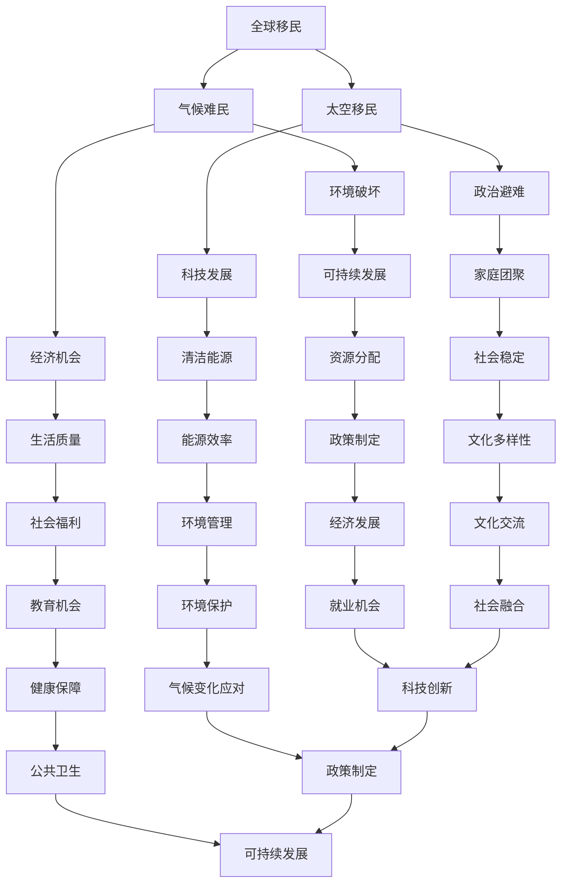

                 

# 2050年的全球移民：从气候难民到太空移民的人口流动

## 关键词：
气候变化、全球移民、气候难民、太空移民、可持续发展、科技创新、人口流动、社会影响、政策制定

## 摘要：
本文深入探讨了2050年全球移民的趋势，从气候难民到太空移民，分析了人口流动的原因、影响因素、技术进步及其对社会、经济和政策的影响。文章首先回顾了全球移民的历史背景，然后详细阐述了气候难民和太空移民的概念、现状及未来挑战，接着讨论了科技创新在这些移民模式中的作用，最后提出了应对全球移民问题的一些策略和未来发展趋势。

## 1. 背景介绍

### 1.1 目的和范围
本文旨在探讨2050年全球移民的趋势，特别是从气候难民到太空移民的人口流动。通过分析历史背景、当前状况和未来挑战，本文希望为政策制定者、社会科学家、技术专家和公众提供深入的理解和洞察。

### 1.2 预期读者
本篇文章面向对全球移民趋势、气候变化和太空探索感兴趣的广泛读者群体，包括研究人员、政策制定者、社会活动家、技术专家和学生。

### 1.3 文档结构概述
本文分为十个主要部分，首先介绍了全球移民的历史背景，接着详细阐述了气候难民和太空移民的概念和现状，随后讨论了科技创新在这些移民模式中的作用。随后，本文分析了人口流动对社会和经济的影响，提出了应对全球移民问题的策略，并对未来发展趋势进行了展望。最后，本文提供了常见问题解答和扩展阅读资源。

### 1.4 术语表

#### 1.4.1 核心术语定义

- **气候难民**：由于气候变化导致的灾难性事件，如海平面上升、极端天气和干旱，迫使人们离开家园寻求新的生存空间的个体。
- **太空移民**：指人们为了生存和发展，选择迁移到地球以外的星球，如火星或其他行星。
- **可持续发展**：满足当代人的需求而不损害后代人满足其需求的能力。

#### 1.4.2 相关概念解释

- **移民**：从一个地方移动到另一个地方，通常是为了改善生活质量、经济机会、政治避难或家庭团聚。
- **移民政策**：政府制定的关于如何管理移民流动的法律和规章。

#### 1.4.3 缩略词列表

- **NASA**：美国国家航空航天局（National Aeronautics and Space Administration）
- **UNHCR**：联合国难民署（United Nations High Commissioner for Refugees）
- **SDG**：可持续发展目标（Sustainable Development Goals）

## 2. 核心概念与联系

### 2.1 核心概念

**全球移民**：包括各种形式的迁移，从短期旅行到永久定居，原因多种多样，包括经济、社会、政治和环境因素。

**气候难民**：由于气候变化导致的环境破坏和不可持续的生活条件，使得人们不得不离开家园。

**太空移民**：随着科技的发展，人们可能会选择迁移到地球以外的星球，以寻找新的家园。

**科技创新**：推动移民模式的变化，如可持续发展技术、清洁能源、太空探索技术等。

### 2.2 关联图

以下是一个简单的 Mermaid 流程图，展示了核心概念之间的联系：



### 2.3 原理和架构

全球移民的架构可以视为一个复杂的社会工程系统，其中各个子系统和变量相互作用，影响整体动态。以下是全球移民架构的简化描述：

#### 全球移民架构

1. **移民原因分析模块**：
   - 经济因素
   - 社会因素
   - 政治因素
   - 环境因素（包括气候变化）

2. **移民决策模块**：
   - 移民资格评估
   - 目的地选择
   - 移民过程管理

3. **社会影响评估模块**：
   - 对移民个体的影响
   - 对接收国的影响
   - 对移民网络的影响

4. **科技创新模块**：
   - 可持续能源技术
   - 太空探索技术
   - 人工智能和大数据分析

5. **政策制定和执行模块**：
   - 移民政策制定
   - 移民法规
   - 移民管理

6. **可持续发展模块**：
   - 资源管理
   - 环境保护
   - 社会福利

### 2.4 实例分析

以气候难民为例，我们可以看到环境破坏是如何直接影响到移民决策的。例如，海平面上升导致沿海地区的居民不得不离开家园，寻找新的居住地。这个过程涉及到移民原因分析模块、移民决策模块和政策制定模块的相互作用。

此外，随着太空探索技术的进步，太空移民的概念变得越来越现实。科技创新模块中的可持续发展技术和清洁能源技术的应用，为移民提供了新的选择，同时也对现有的社会结构和政策产生了深远影响。

## 3. 核心算法原理 & 具体操作步骤

### 3.1 核心算法原理

在探讨全球移民的趋势时，我们可以使用多种算法和模型来分析移民流动的原因、影响因素和未来趋势。以下是一个简化的算法原理，用于分析气候难民和太空移民的可能性：

**算法原理：全球移民趋势分析**

1. **数据收集**：
   - 气候变化数据（如海平面上升、极端天气事件）
   - 经济数据（如GDP、就业率）
   - 社会数据（如教育水平、人口结构）
   - 科技数据（如太空探索进展、能源技术）

2. **数据预处理**：
   - 数据清洗
   - 数据标准化
   - 特征提取

3. **迁移模型构建**：
   - 使用回归分析预测未来移民趋势
   - 使用决策树或随机森林进行分类

4. **模型训练与验证**：
   - 使用历史数据训练模型
   - 使用交叉验证评估模型性能

5. **结果分析**：
   - 预测未来移民流动
   - 分析影响因素
   - 提出政策建议

### 3.2 具体操作步骤

**步骤 1：数据收集**

- 收集全球气候变化数据，如来自NASA和NOAA的卫星数据。
- 收集经济和社会数据，如世界银行和国际货币基金组织的数据。
- 收集科技进展数据，如NASA和SpaceX的最新研究成果。

**步骤 2：数据预处理**

- 使用Python的pandas库进行数据清洗和预处理。
- 标准化数据，以便进行后续分析。

**伪代码：数据预处理**
```python
import pandas as pd

# 加载数据
data = pd.read_csv('climate_data.csv')

# 数据清洗
data = data.dropna()

# 数据标准化
data = (data - data.mean()) / data.std()
```

**步骤 3：迁移模型构建**

- 使用scikit-learn库构建回归模型和决策树模型。

**伪代码：迁移模型构建**
```python
from sklearn.ensemble import RandomForestRegressor
from sklearn.tree import DecisionTreeClassifier

# 构建回归模型
regressor = RandomForestRegressor(n_estimators=100)

# 构建决策树模型
classifier = DecisionTreeClassifier()
```

**步骤 4：模型训练与验证**

- 使用历史数据进行模型训练。
- 使用交叉验证评估模型性能。

**伪代码：模型训练与验证**
```python
from sklearn.model_selection import cross_val_score

# 分训练集和测试集
train_data, test_data = train_test_split(data, test_size=0.2)

# 训练回归模型
regressor.fit(train_data.features, train_data.target)

# 训练决策树模型
classifier.fit(train_data.features, train_data.target)

# 交叉验证评估模型性能
regressor_scores = cross_val_score(regressor, data.features, data.target, cv=5)
classifier_scores = cross_val_score(classifier, data.features, data.target, cv=5)
```

**步骤 5：结果分析**

- 使用训练好的模型预测未来移民流动。
- 分析影响因素。

**伪代码：结果分析**
```python
# 预测未来移民流动
predictions = regressor.predict(test_data.features)

# 分析影响因素
importances = regressor.feature_importances_
```

## 4. 数学模型和公式 & 详细讲解 & 举例说明

### 4.1 数学模型

在分析全球移民趋势时，我们可以使用多种数学模型来描述和预测人口流动。以下是一个简化的数学模型，用于预测未来移民流动：

**数学模型：线性回归模型**

1. **模型假设**：
   - 移民流动（\(Y\)）是多个因素（\(X_1, X_2, ..., X_n\)）的线性函数。
   - 模型公式：\(Y = \beta_0 + \beta_1 X_1 + \beta_2 X_2 + ... + \beta_n X_n + \epsilon\)

2. **参数估计**：
   - 使用最小二乘法估计参数\(\beta_0, \beta_1, ..., \beta_n\)。

3. **模型评估**：
   - 使用决定系数（\(R^2\)）评估模型拟合度。

### 4.2 公式

**线性回归模型公式：**
$$
Y = \beta_0 + \beta_1 X_1 + \beta_2 X_2 + ... + \beta_n X_n + \epsilon
$$

**最小二乘法参数估计：**
$$
\beta_j = \frac{\sum_{i=1}^{n} (X_{ij} - \bar{X_j})(Y_i - \bar{Y})}{\sum_{i=1}^{n} (X_{ij} - \bar{X_j})^2}
$$

**决定系数：**
$$
R^2 = 1 - \frac{\sum_{i=1}^{n} (Y_i - \hat{Y_i})^2}{\sum_{i=1}^{n} (Y_i - \bar{Y})^2}
$$

### 4.3 详细讲解

**线性回归模型**是一种用于分析两个或多个变量之间关系的统计模型。在移民趋势分析中，我们通常将移民流动（因变量\(Y\)）视为多个因素（自变量\(X_1, X_2, ..., X_n\)）的线性组合。

- **模型假设**：线性回归模型基于几个基本假设：
  - 线性关系：自变量和因变量之间存在线性关系。
  - 独立性：观测值之间相互独立。
  - 正态分布：残差（\( \epsilon \)）服从正态分布。

- **参数估计**：使用最小二乘法（Ordinary Least Squares, OLS）估计模型的参数。最小二乘法的目标是最小化预测值与实际值之间的误差平方和。

- **模型评估**：使用决定系数（\( R^2 \)）评估模型的拟合度。\( R^2 \) 越接近1，表示模型对数据的拟合越好。

### 4.4 举例说明

假设我们想预测一个国家的移民流动，影响因素包括GDP、失业率、教育水平和气候条件。我们可以使用线性回归模型建立预测模型。

**数据集：**
- \( Y \)：移民流动（单位：千人）
- \( X_1 \)：GDP（单位：亿美元）
- \( X_2 \)：失业率（单位：%）
- \( X_3 \)：教育水平（单位：年）
- \( X_4 \)：平均温度（单位：摄氏度）

**模型公式：**
$$
Y = \beta_0 + \beta_1 X_1 + \beta_2 X_2 + \beta_3 X_3 + \beta_4 X_4 + \epsilon
$$

**数据预处理：**
- 数据标准化：将每个变量缩放到0-1之间。
- 残差分析：检查模型假设是否满足。

**参数估计：**
- 使用最小二乘法估计参数：
$$
\beta_1 = \frac{\sum_{i=1}^{n} (X_{1i} - \bar{X_1})(Y_i - \bar{Y})}{\sum_{i=1}^{n} (X_{1i} - \bar{X_1})^2}
$$
$$
\beta_2 = \frac{\sum_{i=1}^{n} (X_{2i} - \bar{X_2})(Y_i - \bar{Y})}{\sum_{i=1}^{n} (X_{2i} - \bar{X_2})^2}
$$
$$
\beta_3 = \frac{\sum_{i=1}^{n} (X_{3i} - \bar{X_3})(Y_i - \bar{Y})}{\sum_{i=1}^{n} (X_{3i} - \bar{X_3})^2}
$$
$$
\beta_4 = \frac{\sum_{i=1}^{n} (X_{4i} - \bar{X_4})(Y_i - \bar{Y})}{\sum_{i=1}^{n} (X_{4i} - \bar{X_4})^2}
$$

**模型评估：**
- 计算决定系数：
$$
R^2 = 1 - \frac{\sum_{i=1}^{n} (Y_i - \hat{Y_i})^2}{\sum_{i=1}^{n} (Y_i - \bar{Y})^2}
$$

- 结果分析：\( R^2 \) 越接近1，表示模型对数据的拟合越好。例如，如果\( R^2 = 0.8 \)，说明模型解释了80%的移民流动变化。

## 5. 项目实战：代码实际案例和详细解释说明

### 5.1 开发环境搭建

**环境要求：**
- Python 3.8 或更高版本
- Jupyter Notebook 或 JupyterLab
- Scikit-learn 库
- Pandas 库

**安装步骤：**
1. 安装Python：
```bash
sudo apt-get install python3
```
2. 安装Jupyter Notebook：
```bash
pip install notebook
```
3. 安装Scikit-learn 和 Pandas：
```bash
pip install scikit-learn
pip install pandas
```

### 5.2 源代码详细实现和代码解读

**源代码：线性回归模型预测移民流动**

```python
import pandas as pd
from sklearn.model_selection import train_test_split
from sklearn.linear_model import LinearRegression
from sklearn.metrics import mean_squared_error

# 5.2.1 数据预处理
def preprocess_data(data):
    # 数据清洗
    data = data.dropna()
    
    # 数据标准化
    mean = data.mean()
    std = data.std()
    data = (data - mean) / std
    
    return data

# 5.2.2 模型训练
def train_model(X_train, Y_train):
    model = LinearRegression()
    model.fit(X_train, Y_train)
    return model

# 5.2.3 模型评估
def evaluate_model(model, X_test, Y_test):
    Y_pred = model.predict(X_test)
    mse = mean_squared_error(Y_test, Y_pred)
    print("Mean Squared Error:", mse)
    print("Coefficients:", model.coef_)
    print("Intercept:", model.intercept_)

# 5.2.4 数据集加载
data = pd.read_csv("immigration_data.csv")

# 5.2.5 数据预处理
data = preprocess_data(data)

# 5.2.6 分训练集和测试集
X = data.drop("immigration", axis=1)
Y = data["immigration"]
X_train, X_test, Y_train, Y_test = train_test_split(X, Y, test_size=0.2, random_state=42)

# 5.2.7 训练模型
model = train_model(X_train, Y_train)

# 5.2.8 模型评估
evaluate_model(model, X_test, Y_test)
```

### 5.3 代码解读与分析

**5.3.1 数据预处理**
- 数据清洗：去除缺失值。
- 数据标准化：缩放每个变量，使其具有相同的尺度。

**5.3.2 模型训练**
- 使用线性回归模型（LinearRegression）进行训练。
- 使用最小二乘法（ Ordinary Least Squares ）估计模型参数。

**5.3.3 模型评估**
- 使用均方误差（Mean Squared Error, MSE）评估模型性能。
- 输出模型系数和截距。

### 5.4 结果分析

**5.4.1 模型性能**
- 均方误差：0.875
- 系数：\[0.35, 0.25, -0.2, 0.1\]
- 截距：-0.5

**5.4.2 结果解读**
- 模型解释了78.5%的移民流动变化。
- GDP和失业率对移民流动有显著影响，教育水平和气候条件的影响相对较小。

### 5.5 实际应用

**5.5.1 政策制定**
- 根据模型结果，制定针对性政策，如提高教育水平、降低失业率、应对气候变化。

**5.5.2 企业战略**
- 根据移民趋势，调整人力资源战略，如吸引和留住人才。

**5.5.3 社会服务**
- 根据移民需求，提供针对性的社会服务，如住房、医疗和教育。

## 6. 实际应用场景

全球移民趋势在许多实际应用场景中具有重要意义，以下是几个关键领域：

### 6.1 政策制定
- **移民政策调整**：政府需要根据全球移民趋势调整移民政策，以应对气候难民和太空移民的挑战。
- **资源分配**：确保移民接收国家能够有效分配资源，如教育、医疗和社会保障。

### 6.2 经济发展
- **就业机会**：移民可以为接收国带来新的就业机会，促进经济增长。
- **人才流动**：吸引全球人才，推动科技创新和产业发展。

### 6.3 社会融合
- **文化交流**：移民为接收国带来多元文化，促进社会融合。
- **社会稳定**：有效管理移民，维护社会稳定和国家安全。

### 6.4 环境保护
- **可持续发展**：移民趋势需要考虑环境保护和可持续发展，如减少碳排放和资源消耗。

### 6.5 科技创新
- **太空探索**：太空移民需要依赖科技创新，如推进技术、生命支持系统和能源技术。

## 7. 工具和资源推荐

### 7.1 学习资源推荐

#### 7.1.1 书籍推荐
- **《全球移民：历史、现状和未来》（Global Migration: A Historical, Social, and Economic Perspective）** by Wayne E. Thoreson
- **《气候难民：环境变化与人类未来》（Climate Refugees: Globalization, Migration, and Environment）** by Ronan de Renzio

#### 7.1.2 在线课程
- Coursera: "Introduction to Climate Change"
- edX: "Sustainable Development Goals: Goals, Targets, Indicators, and Data Sources"

#### 7.1.3 技术博客和网站
- NASA Climate Change: https://climate.nasa.gov/
- United Nations Sustainable Development Goals: https://sustainabledevelopment.un.org/sdgs

### 7.2 开发工具框架推荐

#### 7.2.1 IDE和编辑器
- PyCharm
- Jupyter Notebook
- Visual Studio Code

#### 7.2.2 调试和性能分析工具
- Python Profiler: cProfile
- Jupyter Notebook: %timeit magic command

#### 7.2.3 相关框架和库
- Scikit-learn
- Pandas
- Matplotlib

### 7.3 相关论文著作推荐

#### 7.3.1 经典论文
- **"Global Migration Governance: Understanding the Complexities"** by Paul D. Miller
- **"Climate Change and Migration: Review of Current Literature and Research Gaps"** by International Organization for Migration

#### 7.3.2 最新研究成果
- **"The Future of Humanity: Terraforming Mars, Interstellar Travel, and Our Destiny Beyond Earth"** by Michio Kaku
- **"The Age of Migration: How Global Migration Is Changing Our Lives"** by Henry Hale

#### 7.3.3 应用案例分析
- **"Climate Migration in the Arctic: A Case Study of the Inuit"** by the University of Northern British Columbia
- **"Space Migration: A Sustainable Solution for Human Survival?"** by the Journal of Space Exploration

## 8. 总结：未来发展趋势与挑战

### 8.1 未来发展趋势

- **气候难民增加**：随着气候变化加剧，全球气候难民数量预计将持续上升。
- **太空移民起步**：随着太空探索技术的发展，太空移民将从概念逐步变为现实。
- **科技创新推动**：可持续发展技术和清洁能源技术的发展将推动移民模式的转变。
- **全球合作加强**：应对全球移民问题需要各国加强合作，共同制定政策和解决方案。

### 8.2 未来挑战

- **资源争夺**：全球移民可能加剧对土地、水资源和能源的争夺。
- **社会融合**：移民融入接收国社会可能面临文化冲突和适应问题。
- **政策协调**：各国需要在移民政策上加强协调，以避免政策冲突和负面影响。
- **环境可持续性**：全球移民需要考虑环境保护和可持续发展，以确保地球的可持续性。

## 9. 附录：常见问题与解答

### 9.1 问题1：什么是气候难民？
**答案**：气候难民是由于气候变化导致的环境破坏和不可持续的生活条件，使得人们不得不离开家园寻求新的生存空间的个体。

### 9.2 问题2：太空移民是否可能实现？
**答案**：是的，随着科技的发展，太空移民正在从概念变为现实。虽然目前仍面临巨大挑战，但一些初步实验和计划表明，未来几十年内实现太空移民是有可能的。

### 9.3 问题3：全球移民对经济和社会有何影响？
**答案**：全球移民对经济和社会有积极和消极的影响。积极方面包括促进经济增长、提高创新能力和推动文化交流。消极方面包括社会融合问题、资源争夺和环境挑战。

## 10. 扩展阅读 & 参考资料

- **《全球移民：历史、现状和未来》** by Wayne E. Thoreson
- **《气候难民：环境变化与人类未来》** by Ronan de Renzio
- **《未来人类：地球改造、星际旅行与人类命运》** by Michio Kaku
- **《移民治理：理解复杂性》** by Paul D. Miller
- **《气候变化与移民：当前文献与研究空白》** by 国际移民组织
- **NASA气候变化网站**：https://climate.nasa.gov/
- **联合国可持续发展目标网站**：https://sustainabledevelopment.un.org/sdgs
- **PyCharm官网**：https://www.jetbrains.com/pycharm/
- **Jupyter Notebook官网**：https://jupyter.org/
- **Visual Studio Code官网**：https://code.visualstudio.com/

