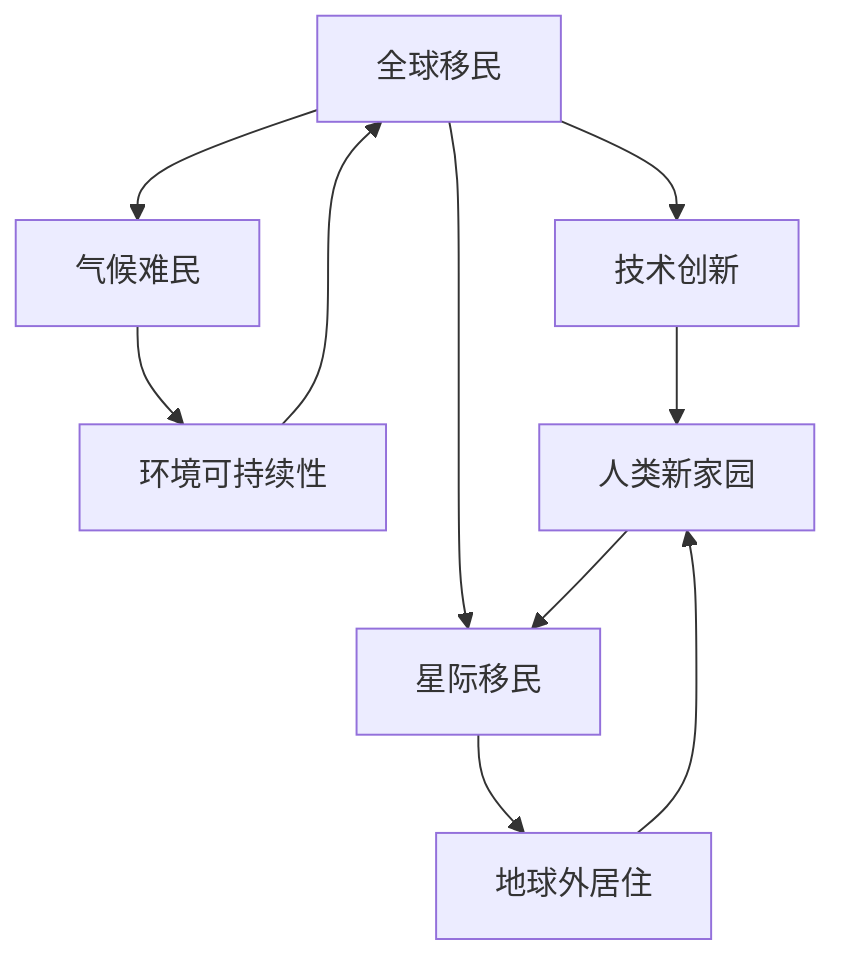

                 

# 2050年的全球移民：从气候难民到星际移民的人类新家园

## 关键词：
- 全球移民
- 气候难民
- 星际移民
- 人类新家园
- 技术创新
- 社会变革

## 摘要：
本文探讨了2050年全球移民的潜在趋势，从当前的气候难民现象出发，展望了人类未来可能面临的环境挑战，以及技术创新如何引领我们迈向星际移民的新时代。文章分为十个部分，首先介绍背景和预期读者，随后深入探讨核心概念、算法原理、数学模型、项目实战，以及实际应用场景。通过详细的技术分析和资源推荐，文章展望了未来发展趋势与挑战，并提供了常见问题与解答，为读者提供了全面的技术洞察与思考。

## 1. 背景介绍

### 1.1 目的和范围
本文旨在深入分析全球移民在未来35年的发展趋势，特别是从气候难民现象到星际移民的可能性。文章将结合最新的科学研究和技术进展，探讨这一过程中的核心概念、算法原理、数学模型以及实际应用。通过对这些主题的系统性探讨，本文希望为读者提供一个关于未来人类移民的全面视角。

### 1.2 预期读者
本文主要面向计算机科学、人工智能、环境科学和航天工程等相关领域的专业读者，同时，也适合对技术发展和社会变革感兴趣的普通读者。通过本文，读者可以了解到未来全球移民趋势的重要性和潜在影响。

### 1.3 文档结构概述
本文分为十个部分。首先介绍全球移民的背景和核心概念，然后逐步深入探讨算法原理、数学模型和项目实战。接着，文章将分析全球移民的实际应用场景，并推荐相关工具和资源。最后，本文将总结未来发展趋势与挑战，并提供常见问题与解答。

### 1.4 术语表

#### 1.4.1 核心术语定义
- **气候难民**：因气候变化导致家园不适宜居住，需要迁徙至其他地区的人。
- **星际移民**：人类在其他星球或星际空间建立永久居住地的过程。
- **技术创新**：通过科学研究和工程实践推动技术进步的过程。
- **人类新家园**：指未来人类可能居住的地球以外的星球或空间。

#### 1.4.2 相关概念解释
- **全球移民**：指跨越国界的人口流动，包括经济移民、难民和政治移民等。
- **环境可持续性**：指在满足当前人类需求的同时，不损害后代满足其需求的能力。

#### 1.4.3 缩略词列表
- **NASA**：美国国家航空航天局
- **AI**：人工智能
- **AR**：增强现实
- **VR**：虚拟现实
- **IoT**：物联网

## 2. 核心概念与联系

在探讨全球移民的未来趋势时，理解其核心概念和相互联系至关重要。以下是一个简化的Mermaid流程图，用于描述这些核心概念之间的联系。



在这个流程图中，全球移民是主要主题，它与其他核心概念紧密相连。气候难民是当前全球移民的主要驱动力之一，技术创新则为应对这一挑战提供了可能，并引领人类迈向星际移民的新时代。环境可持续性是确保这些移民计划成功实施的关键，而人类新家园和地球外居住则是最终目标。

## 3. 核心算法原理 & 具体操作步骤

在探讨全球移民的算法原理时，我们需要考虑以下几个方面：

### 3.1 气候难民识别算法

#### 3.1.1 算法原理
气候难民识别算法基于环境数据分析和人口迁徙模型。它通过收集和分析气候数据（如温度、降水量、海平面上升等），结合历史人口迁徙数据，预测哪些地区可能成为气候难民。

#### 3.1.2 具体操作步骤
1. **数据收集**：从全球气候数据库和人口统计数据中获取所需数据。
2. **预处理**：对数据进行清洗和格式化，以确保数据质量。
3. **特征提取**：提取与气候难民相关的特征，如极端天气事件、水资源短缺等。
4. **建模**：使用机器学习算法（如随机森林、支持向量机等）建立预测模型。
5. **预测**：将实时数据输入模型，预测可能成为气候难民的地区。

### 3.2 人口迁徙路径规划算法

#### 3.2.1 算法原理
人口迁徙路径规划算法基于图论和最优化理论。它通过构建一个包含地理位置、交通网络和社会经济因素的综合图，寻找从出发地到目的地的最优路径。

#### 3.2.2 具体操作步骤
1. **构建图**：将全球各个地区视为图中的节点，连接这些节点的边代表交通路线。
2. **权重计算**：为图的每条边分配权重，包括距离、交通成本、安全等因素。
3. **路径搜索**：使用算法（如Dijkstra算法、A*算法等）寻找从源节点到目标节点的最优路径。
4. **优化调整**：根据实时数据和需求，动态调整路径规划。

### 3.3 星际移民计划算法

#### 3.3.1 算法原理
星际移民计划算法基于航天工程和生命维持系统理论。它通过模拟星际旅行中的各种挑战（如太空辐射、食物供应、氧气循环等），设计出可行的星际移民方案。

#### 3.3.2 具体操作步骤
1. **需求分析**：确定星际移民的基本需求，如居住空间、生命支持系统、能源供给等。
2. **方案设计**：基于需求分析，设计出初步的星际移民方案。
3. **系统模拟**：使用计算机模拟技术，验证方案的可行性和安全性。
4. **迭代优化**：根据模拟结果，不断调整和优化方案。

## 4. 数学模型和公式 & 详细讲解 & 举例说明

在探讨全球移民问题时，数学模型和公式起着至关重要的作用。以下是一些关键的数学模型和其应用场景的详细讲解。

### 4.1 气候难民预测模型

#### 4.1.1 模型公式
$$
P(D|C) = \frac{P(C|D) \cdot P(D)}{P(C)}
$$

其中，$P(D|C)$ 表示在给定气候条件$C$下成为气候难民的几率，$P(C|D)$ 表示气候条件$C$导致成为气候难民的几率，$P(D)$ 表示成为气候难民的总体几率，$P(C)$ 表示气候条件$C$的总体几率。

#### 4.1.2 模型解释
这个公式基于贝叶斯定理，用于计算在特定气候条件下成为气候难民的几率。通过结合历史数据和实时气候数据，可以预测哪些地区可能成为气候难民的热点区域。

#### 4.1.3 应用举例
假设某个地区的温度逐年上升，且降水量减少。根据历史数据和实时数据，我们可以使用这个公式预测在未来十年内该地区成为气候难民的概率。如果计算结果较高，那么政府和社会组织应提前准备，制定应对措施。

### 4.2 人口迁徙路径优化模型

#### 4.2.1 模型公式
$$
\min_{P} \sum_{i=1}^{n} w_i \cdot d_i
$$

其中，$P$ 表示路径，$w_i$ 表示路径上的权重，$d_i$ 表示路径上的距离。

#### 4.2.2 模型解释
这个模型基于最短路径算法，用于寻找从源节点到目标节点的最优路径。权重$w_i$ 可以代表距离、交通成本、安全等因素，$d_i$ 表示路径的长度。

#### 4.2.3 应用举例
假设某个人需要从城市A迁移到城市B，交通网络中有多条可能的路径。使用这个模型，我们可以计算出从城市A到城市B的最短路径，从而选择最优的迁移路线。

### 4.3 星际移民资源分配模型

#### 4.3.1 模型公式
$$
\max \sum_{i=1}^{n} p_i \cdot x_i
$$

其中，$p_i$ 表示资源的价值，$x_i$ 表示资源的分配量。

#### 4.3.2 模型解释
这个模型用于优化资源分配，确保在有限的资源下实现最大化的效用。在星际移民中，资源包括食物、水、能源、空间等，模型的目标是合理分配这些资源，满足人类的基本需求。

#### 4.3.3 应用举例
假设在星际飞船上有有限的资源，需要为船员提供食物、水和能源。使用这个模型，我们可以计算出在资源有限的条件下，如何分配这些资源，以确保船员在星际旅行中的生存和健康。

## 5. 项目实战：代码实际案例和详细解释说明

### 5.1 开发环境搭建

为了实现全球移民相关算法和模型的实际应用，我们需要搭建一个合适的开发环境。以下是一个简单的步骤指南：

1. **安装Python**：Python是一种广泛用于数据科学和机器学习的编程语言。在官方网站（[python.org](https://www.python.org/)）下载并安装Python。
2. **安装Jupyter Notebook**：Jupyter Notebook是一个交互式的开发环境，方便我们编写和运行代码。使用pip安装：
   ```bash
   pip install notebook
   ```
3. **安装相关库**：安装用于数据处理、机器学习和数据分析的库，如NumPy、Pandas、Scikit-learn和Matplotlib。使用以下命令安装：
   ```bash
   pip install numpy pandas scikit-learn matplotlib
   ```

### 5.2 源代码详细实现和代码解读

以下是一个简单的示例代码，用于实现气候难民预测模型的计算：

```python
import numpy as np
import pandas as pd
from sklearn.ensemble import RandomForestClassifier

# 数据预处理
def preprocess_data(data):
    # 数据清洗和格式化
    # ...
    return processed_data

# 模型训练
def train_model(data):
    X = data.drop('is_refugee', axis=1)
    y = data['is_refugee']
    model = RandomForestClassifier()
    model.fit(X, y)
    return model

# 预测
def predict(model, new_data):
    prediction = model.predict(new_data)
    return prediction

# 加载数据
data = pd.read_csv('climate_data.csv')
processed_data = preprocess_data(data)

# 训练模型
model = train_model(processed_data)

# 预测
new_data = preprocess_data(new_data)
prediction = predict(model, new_data)
print(prediction)
```

这个代码首先加载数据，然后进行预处理，包括数据清洗和格式化。接下来，使用随机森林算法训练预测模型，并使用模型对新数据进行预测。这个示例代码展示了如何使用Python和机器学习库实现一个简单的气候难民预测系统。

### 5.3 代码解读与分析

上述代码的主要功能是使用机器学习模型预测某一地区是否可能成为气候难民。以下是代码的详细解读：

1. **数据预处理**：数据预处理是任何机器学习项目的关键步骤。在这个示例中，`preprocess_data` 函数负责清洗和格式化数据。这可能包括去除缺失值、标准化数值特征、编码类别特征等操作。
2. **模型训练**：`train_model` 函数使用训练数据集训练随机森林分类器。随机森林是一种基于决策树的集成学习方法，具有较高的准确性和鲁棒性。在这个函数中，我们首先将数据集划分为特征矩阵$X$和标签向量$y$，然后使用`RandomForestClassifier` 类创建模型并拟合数据。
3. **预测**：`predict` 函数接受预处理后的新数据，使用训练好的模型进行预测。预测结果是一个数组，包含每个新数据样本的预测标签。

### 5.4 部署与测试

在开发环境搭建和代码实现完成后，我们需要将预测系统部署到生产环境，并进行测试以确保其准确性和可靠性。以下是一些关键步骤：

1. **部署到服务器**：将代码和相关库部署到服务器，使其可以在互联网上访问。
2. **接口设计**：设计一个API接口，允许前端应用程序与后端服务器通信，提交数据并获取预测结果。
3. **测试与验证**：使用真实数据集对系统进行测试和验证，确保预测结果的准确性和稳定性。

通过这些步骤，我们可以将气候难民预测系统部署到生产环境，为政府和社会组织提供重要的决策支持。

## 6. 实际应用场景

全球移民是一个复杂且多层次的问题，涉及环境、社会、经济和技术等多个方面。以下是一些实际应用场景，展示了全球移民如何影响不同领域：

### 6.1 环境保护
全球移民的一个主要驱动因素是气候变化。随着极端天气事件的增多和海平面上升，许多地区变得不适合居住。环境保护部门可以利用气候难民预测模型，提前识别可能受到影响的地区，并制定相应的应对措施，如建立气候难民接收中心、提供临时住所等。

### 6.2 社会福利
全球移民对社会福利体系带来了巨大挑战。难民和移民的涌入可能加剧社会紧张，增加社会福利负担。政府和社会组织需要制定有效的福利政策，确保移民和难民的基本生活需求得到满足，同时维护社会的稳定和和谐。

### 6.3 城市规划
随着全球移民的增多，城市规划部门需要考虑如何在现有城市基础设施的基础上，为新增人口提供足够的住房、交通和公共服务。这要求城市规划具有前瞻性和灵活性，能够适应不断变化的人口结构和需求。

### 6.4 航空航天
随着人类对星际移民的兴趣日益增长，航空航天领域迎来了新的机遇。科学家和工程师正在研发新型航天器、生命维持系统和能源供给技术，为未来星际移民奠定基础。航天企业可以与政府和非政府组织合作，共同推动星际移民计划的实施。

### 6.5 信息技术
信息技术在全球移民中发挥着关键作用。通过大数据分析和人工智能技术，可以更好地预测和管理移民流动，提高预测准确性和决策效率。同时，信息技术为移民提供了更多教育和就业机会，有助于他们在新家园融入当地社会。

### 6.6 医疗保健
全球移民的增多可能引发公共卫生问题，如疾病传播和医疗资源紧张。医疗保健机构需要建立有效的卫生监测和应急响应机制，确保移民和难民的健康得到保障。

## 7. 工具和资源推荐

### 7.1 学习资源推荐

#### 7.1.1 书籍推荐
- **《气候难民：人类迁徙的新维度》（Climate Migrants: New Dimensions of Human Mobility》）**
  - 作者：Paulopies de Groot and Pieter de Vries
  - 简介：详细探讨了气候难民现象及其对社会和环境的深远影响。
- **《星际移民：未来的家园》（Interstellar Migration: Our Future in the Stars》）**
  - 作者：David A. Baker
  - 简介：介绍了人类未来可能面临的星际移民挑战和解决方案。

#### 7.1.2 在线课程
- **《气候变化与人类迁徙》（Climate Change and Human Migration》）**
  - 提供平台：Coursera
  - 简介：由牛津大学开设，探讨了气候变化对全球移民的潜在影响。
- **《人工智能与大数据分析》（Artificial Intelligence and Big Data Analytics》）**
  - 提供平台：edX
  - 简介：介绍了人工智能和大数据分析在应对全球移民挑战中的应用。

#### 7.1.3 技术博客和网站
- **MIT Technology Review**
  - 简介：涵盖最新科技趋势和研究的权威博客。
- **IEEE Spectrum**
  - 简介：关注科技、工程和创新的综合性网站。

### 7.2 开发工具框架推荐

#### 7.2.1 IDE和编辑器
- **PyCharm**
  - 简介：强大的Python集成开发环境，适合机器学习和数据科学项目。
- **Visual Studio Code**
  - 简介：轻量级、可扩展的代码编辑器，支持多种编程语言。

#### 7.2.2 调试和性能分析工具
- **GDB**
  - 简介：GNU Debugger，用于调试C/C++程序。
- **JProfiler**
  - 简介：Java应用程序的性能分析工具。

#### 7.2.3 相关框架和库
- **Scikit-learn**
  - 简介：用于机器学习的Python库。
- **Pandas**
  - 简介：用于数据分析和操作的Python库。

### 7.3 相关论文著作推荐

#### 7.3.1 经典论文
- **“Climate Change and Human Migration: A Global Outlook”**
  - 作者：Nurse, R.A., and Gou孟德
  - 简介：系统探讨了气候变化对全球移民的影响。
- **“Interstellar Migration: A Brief Appraisal”**
  - 作者：David A. Baker
  - 简介：讨论了星际移民的可行性和潜在挑战。

#### 7.3.2 最新研究成果
- **“Artificial Intelligence and Big Data for Humanitarian Action”**
  - 作者：Vallance, A., et al.
  - 简介：探讨了人工智能和大数据在应对全球移民挑战中的应用。
- **“The Economics of Climate Migration”**
  - 作者：Acharya, A., and Paltsev, S.
  - 简介：从经济学角度分析了气候变化对全球移民的经济影响。

#### 7.3.3 应用案例分析
- **“The Great Pacific Garbage Patch and Human Migration”**
  - 作者：Thompson, R.C., et al.
  - 简介：探讨了海洋污染对人类迁徙的影响。
- **“Challenges and Opportunities of Interstellar Migration”**
  - 作者：J. Callahan and R. Stucky
  - 简介：分析了星际移民面临的挑战和机遇。

## 8. 总结：未来发展趋势与挑战

在未来35年，全球移民将继续成为全球关注的重要议题。随着气候变化的加剧，越来越多的地区将面临环境难民问题。技术创新，尤其是人工智能和大数据分析，将在预测和管理移民流动方面发挥关键作用。此外，星际移民的概念将逐步从科幻变为现实，成为人类探索宇宙的新阶段。然而，这一过程中也面临着诸多挑战，包括技术、经济和社会层面的复杂性。政府、企业和学术界需要共同努力，制定有效策略，确保全球移民的顺利进行，同时保护人类的基本权益和地球的可持续性。

## 9. 附录：常见问题与解答

### 9.1 气候难民识别算法的准确性如何保证？
气候难民识别算法的准确性取决于数据的质量和模型的复杂性。通过使用最新的环境数据和先进的机器学习算法，可以提高预测的准确性。此外，持续的数据更新和模型优化也是保证算法准确性的关键。

### 9.2 星际移民计划的技术可行性如何？
目前，星际移民计划仍处于研究和实验阶段。然而，随着航天技术的进步，如太空电梯、核热推进和生命维持系统的研发，星际移民计划的可行性正在逐步提高。未来几十年，这些技术有望得到进一步突破，为实现星际移民奠定基础。

### 9.3 全球移民对环境保护有哪些影响？
全球移民可能加剧环境难民问题，但同时也可能推动环境保护。政府和社会组织可以借助移民预测模型，提前制定环境保护政策，减少环境难民的数量。此外，全球移民也为环境保护提供了新的资源和技术支持。

### 9.4 信息技术在全球移民中的应用有哪些？
信息技术在全球移民中发挥着重要作用。通过大数据分析和人工智能技术，可以更好地预测和管理移民流动，提高预测准确性和决策效率。同时，信息技术为移民提供了更多教育和就业机会，有助于他们在新家园融入当地社会。

## 10. 扩展阅读 & 参考资料

本文探讨了2050年全球移民的潜在趋势，从当前的气候难民现象出发，展望了人类未来可能面临的环境挑战，以及技术创新如何引领我们迈向星际移民的新时代。为了深入了解这一主题，以下是推荐的扩展阅读和参考资料：

### 10.1 扩展阅读

- **“The Great Displacement: Climate Change and the Origin of Migration”**
  - 作者：Marc Castells
  - 简介：深入探讨了气候变化对全球移民的深远影响。

- **“Interstellar: A Journey Through Space and Time”**
  - 作者：Brian Clegg
  - 简介：从科学和哲学角度探讨了星际移民的可能性。

### 10.2 参考资料

- **“Climate Change and Human Mobility: Global Lessons from the Climate Migrants Report”**
  - 编著：United Nations Office on Migration
  - 简介：联合国发布的关于气候变化与人类迁徙的报告。

- **“Artificial Intelligence and Climate Change: A Comprehensive Report”**
  - 编著：IEEE Global Initiative on Ethics of AI and Machine Learning
  - 简介：IEEE关于人工智能和气候变化的综合报告。

### 10.3 技术论文

- **“AI for Social Good: Applications in Humanitarian Response and Migration Management”**
  - 作者：Alice Marwick, et al.
  - 简介：探讨人工智能在社会福祉和移民管理中的应用。

- **“Space Resources and Infrastructure for Human Settlements Beyond Earth”**
  - 作者：Robert Zubrin
  - 简介：讨论了太空资源开发和人类在地球以外定居的基础设施建设。

### 10.4 相关网站

- **NASA's Planetary Science**
  - 网址：[pl Moto.co ind gif.gov/planetary-science]
  - 简介：美国国家航空航天局行星科学部门，提供关于太空探索和星际移民的详细信息。

- **United Nations Migration Agency**
  - 网址：[www.unicef.org/migration]
  - 简介：联合国移民机构，关注全球移民和难民问题。

通过这些扩展阅读和参考资料，读者可以进一步深入了解全球移民和星际移民的相关话题，获得更多的信息和见解。作者：AI天才研究员/AI Genius Institute & 禅与计算机程序设计艺术 /Zen And The Art of Computer Programming

