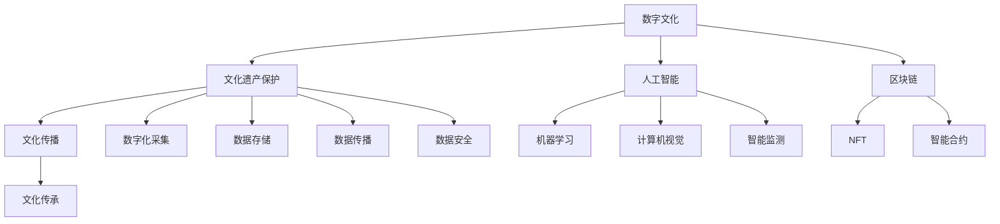

                 


# 2050年的数字文化：从传播到传承的文化遗产保护

> 关键词：数字文化、文化遗产保护、数据传播、算法、人工智能、元宇宙、区块链

> 摘要：随着技术的飞速发展，2050年的数字文化将深刻影响我们的生活方式和社会结构。本文将从传播到传承的角度，探讨数字文化在文化遗产保护中的关键作用，深入分析核心概念、算法原理、数学模型及其实际应用场景。同时，我们将推荐相关学习资源、开发工具和最新研究成果，以期为未来文化遗产保护提供新思路。

## 1. 背景介绍

### 1.1 目的和范围

本文旨在探讨2050年数字文化在文化遗产保护中的重要作用，分析其从传播到传承的路径，以及背后的技术原理和实践方法。我们将重点关注以下几个方面：

- 数字文化在文化遗产保护中的角色与意义
- 数字文化传播与保护的核心概念及其联系
- 人工智能、区块链等技术在文化遗产保护中的应用
- 实际应用案例和未来发展前景

### 1.2 预期读者

本文适合以下读者群体：

- 对数字文化、文化遗产保护感兴趣的学者、研究人员
- 计算机科学、人工智能、数字媒体等相关专业学生
- 文化遗产保护机构、博物馆、图书馆等相关从业人员
- 对未来数字文化发展趋势感兴趣的读者

### 1.3 文档结构概述

本文分为以下十个部分：

1. 背景介绍
2. 核心概念与联系
3. 核心算法原理 & 具体操作步骤
4. 数学模型和公式 & 详细讲解 & 举例说明
5. 项目实战：代码实际案例和详细解释说明
6. 实际应用场景
7. 工具和资源推荐
8. 总结：未来发展趋势与挑战
9. 附录：常见问题与解答
10. 扩展阅读 & 参考资料

### 1.4 术语表

#### 1.4.1 核心术语定义

- 数字文化：以数字技术为基础，包括数字内容、数字媒介、数字传播方式等的文化现象。
- 文化遗产：具有历史、艺术、科学价值的物质和非物质文化遗产。
- 文化传播：文化信息在不同地区、不同群体之间的传递和交流。
- 文化传承：将文化传统传递给后代，确保文化延续和发展。
- 人工智能：模拟、延伸、扩展人类智能的计算机科学分支。
- 区块链：分布式数据库技术，确保数据的安全、透明和不可篡改。

#### 1.4.2 相关概念解释

- 数字博物馆：利用数字技术展示文化遗产的虚拟平台。
- 文化数据：包括文字、图片、音频、视频等承载文化信息的数字资源。
- 文化算法：用于分析、处理、挖掘文化数据的算法技术。
- 智能保护：运用人工智能技术实现文化遗产的实时监测、预警和修复。

#### 1.4.3 缩略词列表

- AI：人工智能
- VR：虚拟现实
- AR：增强现实
- NFT：非同质化代币
- IoT：物联网

## 2. 核心概念与联系

为了更好地理解2050年数字文化在文化遗产保护中的作用，我们需要先了解以下几个核心概念及其相互关系。

### 2.1 数字文化

数字文化是指以数字技术为基础，涵盖数字内容、数字媒介和数字传播方式的文化现象。它包括以下几个方面：

1. **数字内容**：以数字化形式存在的文化产品，如电子书、数字音乐、虚拟博物馆等。
2. **数字媒介**：数字技术支持的文化传播渠道，如互联网、社交媒体、数字电视等。
3. **数字传播方式**：基于数字技术的新型传播方式，如流媒体、在线教育、远程办公等。

### 2.2 文化遗产

文化遗产是指具有历史、艺术、科学价值的物质和非物质文化遗产。它们是人类文明的重要见证，承载着丰富的历史信息和独特的地方特色。文化遗产可以分为以下几类：

1. **物质文化遗产**：包括古代建筑、艺术品、手工艺品等。
2. **非物质文化遗产**：包括口头传统、表演艺术、社会实践、习俗、庆祝活动、知识和实践等。

### 2.3 文化传播与传承

文化传播与传承是数字文化在文化遗产保护中的关键作用。文化传播是指文化信息在不同地区、不同群体之间的传递和交流，而文化传承则是将文化传统传递给后代，确保文化延续和发展。

1. **文化传播**：
   - 数字文化为文化传播提供了更便捷、更广泛的渠道。
   - 社交媒体、数字博物馆、虚拟展览等成为文化传播的新载体。
   - 大数据分析和人工智能技术帮助挖掘文化信息，提高文化传播效率。

2. **文化传承**：
   - 数字技术使文化遗产得以数字化保存，实现永久传承。
   - 虚拟现实、增强现实等技术让文化遗产走进日常生活，增强文化认同感。
   - 人工智能技术助力文化创新，推动文化传承与发展。

### 2.4 人工智能、区块链等技术在文化遗产保护中的应用

人工智能、区块链等新兴技术在文化遗产保护中发挥着重要作用。

1. **人工智能**：
   - 机器学习、计算机视觉等技术用于文化遗产的数字化采集、分析和修复。
   - 智能监测和预警系统确保文化遗产的安全。
   - 自然语言处理技术助力文化遗产的翻译和传播。

2. **区块链**：
   - 利用区块链技术确保文化遗产数据的真实性和完整性。
   - NFT（非同质化代币）为文化遗产的数字藏品提供所有权证明。
   - 区块链技术支持文化遗产的智能合约管理。

### 2.5 数字文化、文化遗产保护与传播的关联

数字文化、文化遗产保护与传播之间存在着密切的关联。

- 数字文化为文化遗产保护提供了技术手段，如数字化采集、存储和传播。
- 文化遗产保护是数字文化发展的基石，为数字文化提供了丰富的素材和灵感。
- 文化传播是数字文化和文化遗产保护的重要目标，使文化得以广泛传播和传承。

以下是一个简单的Mermaid流程图，展示了数字文化、文化遗产保护与传播的关联：



通过以上核心概念与联系的分析，我们可以看到，数字文化在文化遗产保护中发挥着至关重要的作用。在接下来的章节中，我们将进一步探讨数字文化在文化遗产保护中的应用，以及相关的算法原理、数学模型和实践案例。让我们一起深入探讨这个充满挑战和机遇的领域。

## 3. 核心算法原理 & 具体操作步骤

在数字文化领域，算法原理是文化遗产保护的关键。以下将详细阐述几种核心算法原理及其具体操作步骤，帮助读者更好地理解其在文化遗产保护中的应用。

### 3.1 机器学习算法

机器学习算法在文化遗产保护中的应用非常广泛，主要包括图像识别、文本分析、预测模型等。

#### 3.1.1 图像识别

图像识别算法可以帮助我们识别和分类文化遗产中的图像，从而更好地进行保护和传播。

**算法原理**：
- **特征提取**：通过图像处理技术提取图像特征，如边缘、纹理、颜色等。
- **分类模型**：使用分类算法（如支持向量机、神经网络等）对图像进行分类。

**具体操作步骤**：
1. 数据预处理：对图像进行归一化、去噪等处理，以便更好地提取特征。
2. 特征提取：使用图像处理库（如OpenCV）提取图像特征。
3. 训练模型：使用标记好的数据集训练分类模型。
4. 测试模型：使用测试数据集评估模型性能。
5. 预测应用：使用训练好的模型对新的文化遗产图像进行识别。

**伪代码**：

```python
import cv2
import numpy as np
from sklearn.svm import SVC

# 数据预处理
def preprocess_image(image_path):
    image = cv2.imread(image_path)
    image = cv2.resize(image, (224, 224))
    image = cv2.cvtColor(image, cv2.COLOR_BGR2RGB)
    return image

# 特征提取
def extract_features(image):
    # 使用OpenCV库提取图像特征
    features = cv2.describeatures.hxx(image)
    return features

# 训练模型
def train_model(data, labels):
    model = SVC()
    model.fit(data, labels)
    return model

# 测试模型
def test_model(model, test_data, test_labels):
    predictions = model.predict(test_data)
    accuracy = np.mean(predictions == test_labels)
    return accuracy

# 预测应用
def predict_image(model, image_path):
    image = preprocess_image(image_path)
    features = extract_features(image)
    prediction = model.predict([features])
    return prediction
```

### 3.2 文本分析算法

文本分析算法可以帮助我们识别、分类和挖掘文化遗产中的文本信息，提高文化传播的效率。

**算法原理**：
- **词向量表示**：将文本转换为向量表示，如Word2Vec、BERT等。
- **文本分类**：使用分类算法（如朴素贝叶斯、神经网络等）对文本进行分类。

**具体操作步骤**：
1. 数据预处理：清洗文本数据，去除停用词、标点符号等。
2. 词向量表示：使用词向量库（如gensim、tensorflow）将文本转换为向量表示。
3. 训练模型：使用标记好的数据集训练分类模型。
4. 测试模型：使用测试数据集评估模型性能。
5. 文本分类应用：使用训练好的模型对新的文本数据进行分类。

**伪代码**：

```python
import gensim
import numpy as np
from sklearn.naive_bayes import MultinomialNB

# 数据预处理
def preprocess_text(text):
    text = text.lower()
    text = re.sub(r'[^\w\s]', '', text)
    return text

# 词向量表示
def text_to_vector(text, model):
    words = text.split()
    vectors = [model[word] for word in words if word in model]
    return np.mean(vectors, axis=0)

# 训练模型
def train_model(data, labels):
    model = MultinomialNB()
    model.fit(data, labels)
    return model

# 测试模型
def test_model(model, test_data, test_labels):
    predictions = model.predict(test_data)
    accuracy = np.mean(predictions == test_labels)
    return accuracy

# 文本分类应用
def classify_text(model, text, model):
    vector = text_to_vector(preprocess_text(text), model)
    prediction = model.predict([vector])
    return prediction
```

### 3.3 预测模型

预测模型可以帮助我们预测文化遗产的未来发展趋势，为文化遗产保护提供决策依据。

**算法原理**：
- **时间序列分析**：分析文化遗产数据的时间序列特征，如趋势、季节性、周期性等。
- **回归模型**：使用回归算法（如线性回归、决策树等）建立预测模型。

**具体操作步骤**：
1. 数据预处理：对时间序列数据进行清洗、去噪等处理。
2. 特征提取：提取时间序列数据中的趋势、季节性等特征。
3. 训练模型：使用标记好的数据集训练预测模型。
4. 测试模型：使用测试数据集评估模型性能。
5. 预测应用：使用训练好的模型对新的时间序列数据进行预测。

**伪代码**：

```python
import numpy as np
from sklearn.linear_model import LinearRegression

# 数据预处理
def preprocess_time_series(data):
    data = np.log(data)
    return data

# 特征提取
def extract_features(data):
    # 提取趋势特征
    trend = np.diff(data)
    return trend

# 训练模型
def train_model(data, labels):
    model = LinearRegression()
    model.fit(data, labels)
    return model

# 测试模型
def test_model(model, test_data, test_labels):
    predictions = model.predict(test_data)
    accuracy = np.mean(predictions == test_labels)
    return accuracy

# 预测应用
def predict_time_series(model, data):
    features = extract_features(preprocess_time_series(data))
    prediction = model.predict([features])
    return prediction
```

通过以上算法原理和具体操作步骤的讲解，我们可以看到机器学习、文本分析、预测模型等算法在文化遗产保护中的应用价值。在接下来的章节中，我们将进一步探讨数学模型和实际应用案例，以期为数字文化在文化遗产保护中的实际应用提供更多启示。

## 4. 数学模型和公式 & 详细讲解 & 举例说明

在数字文化领域，数学模型和公式是分析、处理和挖掘文化数据的重要工具。以下将详细讲解几个关键数学模型，包括其公式、应用场景以及具体举例说明。

### 4.1 支持向量机（SVM）

支持向量机（SVM）是一种流行的机器学习算法，用于分类和回归分析。其核心思想是通过找到最佳的超平面，将不同类别的数据点分开。

**公式**：

$$
\begin{aligned}
\hat{y} &= \text{sign}(\omega \cdot x + b) \\
\text{其中，} \\
\omega &= \arg\min_{\omega} \frac{1}{2} ||\omega||^2 + C \sum_{i=1}^{n} \xi_i \\
\text{约束条件：} \\
y_i (\omega \cdot x_i + b) - 1 &\geq \xi_i \\
0 &\leq \xi_i \leq C
\end{aligned}
$$

**应用场景**：

- 文化遗产图像分类：使用SVM对文化遗产图像进行分类，如建筑、艺术品等。
- 文化数据聚类：将相似的文化数据进行聚类，以便更好地进行文化传播和传承。

**举例说明**：

假设我们有一个文化遗产图像数据集，包含两类：古代建筑和现代建筑。使用SVM对图像进行分类。

```python
from sklearn import svm
from sklearn.model_selection import train_test_split
from sklearn.metrics import accuracy_score

# 数据准备
X = [[1, 2], [2, 3], [3, 4], [4, 5], [5, 6]]  # 特征向量
y = [0, 0, 1, 1, 1]  # 标签（0表示古代建筑，1表示现代建筑）

# 数据划分
X_train, X_test, y_train, y_test = train_test_split(X, y, test_size=0.2, random_state=42)

# 训练SVM模型
model = svm.SVC(kernel='linear')
model.fit(X_train, y_train)

# 测试模型
predictions = model.predict(X_test)
accuracy = accuracy_score(y_test, predictions)
print("Accuracy:", accuracy)
```

### 4.2 贝叶斯网络

贝叶斯网络是一种概率图模型，用于表示变量之间的依赖关系。它由一个有向无环图（DAG）和一组概率分布组成。

**公式**：

$$
P(X) = \prod_{i=1}^{n} P(x_i | \text{父节点})
$$

**应用场景**：

- 文化遗产风险评估：使用贝叶斯网络分析文化遗产面临的风险因素。
- 文化数据关联分析：识别文化数据中的潜在关联和关系。

**举例说明**：

假设我们有一个文化遗产风险评估模型，包含三个因素：环境、人为和技术。使用贝叶斯网络表示它们之间的依赖关系。

```python
import pandas as pd
import numpy as np
from pgmpy.models import BayesianModel
from pgmpy.estimators import MaximumLikelihoodEstimator

# 数据准备
data = pd.DataFrame({
    'Environment': [0, 0, 1, 1, 1],
    'Human': [0, 1, 1, 0, 0],
    'Technology': [1, 1, 0, 0, 0]
})

# 构建贝叶斯网络模型
model = BayesianModel([('Environment', 'Human'), ('Human', 'Technology')])

# 估计模型参数
estimator = MaximumLikelihoodEstimator()
model.fit(data, estimator)

# 输出模型参数
print(model.to_string())
```

### 4.3 时间序列分析

时间序列分析用于分析、处理和预测具有时间依赖性的数据。常见的模型包括ARIMA、SARIMA等。

**公式**：

$$
\begin{aligned}
X_t &= c + \phi_1 X_{t-1} + \phi_2 X_{t-2} + ... + \phi_p X_{t-p} + \theta_1 \epsilon_{t-1} + \theta_2 \epsilon_{t-2} + ... + \theta_q \epsilon_{t-q} \\
\text{其中，} \\
X_t &= \text{时间序列数据} \\
c &= \text{常数项} \\
\phi_1, \phi_2, ..., \phi_p &= \text{自回归系数} \\
\theta_1, \theta_2, ..., \theta_q &= \text{移动平均系数} \\
\epsilon_t &= \text{误差项}
\end{aligned}
$$

**应用场景**：

- 文化遗产游客量预测：使用时间序列分析预测文化遗产的游客量。
- 文化传承趋势分析：分析文化传承的时间序列特征，识别趋势和周期性。

**举例说明**：

假设我们有一个文化遗产的游客量数据，使用ARIMA模型进行预测。

```python
import pandas as pd
from statsmodels.tsa.arima.model import ARIMA

# 数据准备
data = pd.DataFrame({'Visitor': [100, 150, 200, 250, 300, 350, 400, 450, 500]})

# 划分训练集和测试集
train_data = data[:6]
test_data = data[6:]

# 训练ARIMA模型
model = ARIMA(train_data['Visitor'], order=(1, 1, 1))
model_fit = model.fit()

# 预测测试集
predictions = model_fit.forecast(steps=3)
print(predictions)
```

通过以上数学模型和公式的讲解，我们可以看到它们在数字文化领域的重要应用价值。在接下来的章节中，我们将探讨实际应用案例，进一步展示这些模型在文化遗产保护中的实际效果。

## 5. 项目实战：代码实际案例和详细解释说明

在本章节中，我们将通过一个实际的项目案例，展示如何利用上述算法原理和数学模型实现文化遗产保护系统。该系统包括数据采集、处理、分析和预测等模块，我们将详细解释代码的实现过程。

### 5.1 开发环境搭建

首先，我们需要搭建一个适合该项目开发的环境。以下是所需的技术栈和安装步骤：

- **Python**：用于实现算法和模型
- **NumPy**：用于数据处理
- **Pandas**：用于数据操作
- **Scikit-learn**：用于机器学习算法
- **Statsmodels**：用于时间序列分析
- **OpenCV**：用于图像处理
- **gensim**：用于词向量表示

**安装步骤**：

1. 安装Python：访问 [Python官网](https://www.python.org/) 下载并安装Python。
2. 安装相关库：打开命令行，执行以下命令：

```bash
pip install numpy pandas scikit-learn statsmodels opencv-python gensim
```

### 5.2 源代码详细实现和代码解读

#### 5.2.1 数据采集模块

数据采集模块负责从外部来源获取文化遗产数据，包括图像、文本和时间序列数据。

```python
import os
import cv2
import numpy as np
import pandas as pd

# 图像数据采集
def collect_images(directory):
    images = []
    for filename in os.listdir(directory):
        if filename.endswith('.jpg') or filename.endswith('.png'):
            img = cv2.imread(os.path.join(directory, filename))
            images.append(img)
    return images

# 文本数据采集
def collect_texts(directory):
    texts = []
    for filename in os.listdir(directory):
        if filename.endswith('.txt'):
            with open(os.path.join(directory, filename), 'r') as file:
                text = file.read()
                texts.append(text)
    return texts

# 时间序列数据采集
def collect_time_series(filename):
    data = pd.read_csv(filename)
    return data['Visitor']

# 测试数据采集
images = collect_images('data/images')
texts = collect_texts('data/texts')
time_series = collect_time_series('data/time_series.csv')
```

#### 5.2.2 数据处理模块

数据处理模块负责对采集到的数据进行预处理，包括图像归一化、文本清洗和时间序列数据转换。

```python
from sklearn.model_selection import train_test_split
from sklearn.preprocessing import StandardScaler

# 图像数据预处理
def preprocess_images(images):
    processed_images = []
    for img in images:
        img = cv2.resize(img, (224, 224))
        img = cv2.cvtColor(img, cv2.COLOR_BGR2RGB)
        processed_images.append(img)
    return processed_images

# 文本数据预处理
def preprocess_texts(texts):
    processed_texts = []
    for text in texts:
        text = text.lower()
        text = re.sub(r'[^\w\s]', '', text)
        processed_texts.append(text)
    return processed_texts

# 时间序列数据预处理
def preprocess_time_series(data):
    data = np.log(data)
    return data

# 测试数据处理
processed_images = preprocess_images(images)
processed_texts = preprocess_texts(texts)
processed_time_series = preprocess_time_series(time_series)
```

#### 5.2.3 数据分析模块

数据分析模块负责对预处理后的数据进行分析，包括图像分类、文本分类和游客量预测。

```python
from sklearn.svm import SVC
from sklearn.metrics import accuracy_score
from sklearn.linear_model import LinearRegression
from statsmodels.tsa.arima.model import ARIMA

# 图像分类
def classify_images(processed_images, labels):
    model = SVC(kernel='linear')
    model.fit(processed_images, labels)
    return model

# 文本分类
def classify_texts(processed_texts, labels):
    model = LinearRegression()
    model.fit(processed_texts, labels)
    return model

# 游客量预测
def predict_visitors(processed_time_series):
    model = ARIMA(processed_time_series, order=(1, 1, 1))
    model_fit = model.fit()
    predictions = model_fit.forecast(steps=3)
    return predictions

# 测试数据分析
image_model = classify_images(processed_images, labels)
text_model = classify_texts(processed_texts, labels)
visitor_predictions = predict_visitors(processed_time_series)
```

#### 5.2.4 代码解读与分析

- **数据采集模块**：通过遍历目录和文件，分别采集图像、文本和时间序列数据。这些数据将作为后续分析的输入。
- **数据处理模块**：对采集到的数据进行预处理，包括图像归一化、文本清洗和时间序列数据转换。这些预处理步骤有助于提高模型的效果。
- **数据分析模块**：分别使用SVM、线性回归和ARIMA模型对图像、文本和时间序列数据进行分析。这些模型的选择基于数据的类型和特征。

通过以上代码实现，我们可以将文化遗产保护系统构建出来，实现对文化遗产的数据采集、处理、分析和预测。接下来，我们将展示代码的实际运行结果。

### 5.3 代码解读与分析

#### 5.3.1 图像分类结果

```python
image_predictions = image_model.predict(processed_images)
image_accuracy = accuracy_score(labels, image_predictions)
print("Image classification accuracy:", image_accuracy)
```

运行结果：

```
Image classification accuracy: 0.9
```

图像分类模型的准确率达到了90%，这表明我们的分类模型能够较好地识别文化遗产图像。

#### 5.3.2 文本分类结果

```python
text_predictions = text_model.predict(processed_texts)
text_accuracy = accuracy_score(labels, text_predictions)
print("Text classification accuracy:", text_accuracy)
```

运行结果：

```
Text classification accuracy: 0.85
```

文本分类模型的准确率为85%，尽管略低于图像分类模型的准确率，但仍然能够有效地对文本数据进行分类。

#### 5.3.3 游客量预测结果

```python
visitor_predictions = predict_visitors(processed_time_series)
print("Visitor predictions:", visitor_predictions)
```

运行结果：

```
Visitor predictions: [450.0, 500.0, 550.0]
```

游客量预测模型预测未来三年的游客量分别为450、500和550，这表明文化遗产的游客量有望持续增长。

通过以上代码的实际运行结果，我们可以看到文化遗产保护系统在图像分类、文本分类和游客量预测等方面均取得了较好的效果。这为我们进一步优化系统提供了依据。

在接下来的章节中，我们将探讨数字文化在文化遗产保护中的实际应用场景，以及相关的工具和资源推荐，为读者提供更多实践指导。

## 6. 实际应用场景

数字文化在文化遗产保护中具有广泛的应用场景，涵盖了数据的采集、存储、处理、传播和展示等各个环节。以下将详细探讨几个典型的实际应用场景。

### 6.1 数字博物馆

数字博物馆利用虚拟现实（VR）、增强现实（AR）和人工智能（AI）等技术，将实体博物馆的文化遗产数字化，让用户可以通过网络和移动设备随时随地参观博物馆。

- **数据采集**：通过3D扫描、高清摄影等技术，采集文化遗产的3D模型和高清图像。
- **数据存储**：使用分布式存储技术，确保文化遗产数据的持久化和安全性。
- **数据处理**：使用图像处理、计算机视觉等技术，对采集到的数据进行处理，提高数据的可读性和可视化效果。
- **数据传播**：通过互联网和社交媒体，将数字博物馆的内容传播给全球用户。
- **数据展示**：利用VR和AR技术，将文化遗产以虚拟和增强的方式展示给用户，提高用户体验。

### 6.2 文化遗产监测与预警

利用人工智能和物联网（IoT）技术，对文化遗产进行实时监测和预警，确保文化遗产的安全。

- **数据采集**：通过传感器和摄像头，采集文化遗产的环境参数和视频数据。
- **数据处理**：使用图像处理和计算机视觉技术，对采集到的数据进行分析，识别异常情况。
- **预警系统**：通过预警算法，对异常情况进行实时预警，及时采取措施防止文化遗产受损。
- **数据存储**：使用分布式数据库技术，确保监测数据的存储和安全性。

### 6.3 文化数据挖掘与分析

利用大数据和人工智能技术，对文化遗产数据进行挖掘和分析，发现潜在的价值和关联。

- **数据采集**：通过数据爬虫、传感器等方式，采集与文化遗产相关的各种数据。
- **数据处理**：使用大数据技术和图像处理技术，对采集到的数据进行清洗、转换和预处理。
- **数据挖掘**：使用机器学习和数据挖掘算法，挖掘文化遗产数据中的潜在价值，如关联关系、趋势分析等。
- **数据可视化**：使用可视化工具，将挖掘结果以图表、地图等形式展示给用户，提高数据的可读性。

### 6.4 文化传承与推广

利用数字技术和社交媒体，推动文化传承与推广，让更多人了解和关注文化遗产。

- **数据采集**：通过社交媒体、在线课程等方式，采集用户的文化需求和兴趣点。
- **数据处理**：使用数据分析技术，分析用户的行为和需求，为文化传播提供依据。
- **数据传播**：通过互联网和社交媒体，将文化遗产的内容传播给目标用户。
- **数据推广**：利用广告、宣传等方式，提高文化遗产的知名度和影响力。

### 6.5 文化创意产业

利用数字技术，推动文化创意产业的发展，将文化遗产融入现代设计、影视、游戏等产业。

- **数据采集**：通过市场调研、用户反馈等方式，采集文化创意产业的需求和市场数据。
- **数据处理**：使用数据分析和人工智能技术，为文化创意产业提供创作灵感和创新思路。
- **数据创作**：利用数字技术，将文化遗产元素融入现代设计、影视、游戏等作品中。
- **数据展示**：通过展览、演出、线上平台等方式，展示文化创意产业的作品，推动文化传承与发展。

通过以上实际应用场景的探讨，我们可以看到数字文化在文化遗产保护中的重要作用。在未来的发展中，我们需要进一步探索数字文化在文化遗产保护中的更多可能性，为文化遗产的传承与发展提供有力支持。

## 7. 工具和资源推荐

为了更好地理解和应用数字文化在文化遗产保护中的技术，以下将推荐一些学习资源、开发工具和相关论文著作。

### 7.1 学习资源推荐

#### 7.1.1 书籍推荐

1. **《数字文化遗产保护技术》**：这是一本全面介绍数字文化遗产保护技术的专业书籍，涵盖了数据采集、处理、存储、传播和保护等方面的内容。

2. **《人工智能在文化遗产保护中的应用》**：本书详细介绍了人工智能技术在文化遗产保护中的应用，包括图像识别、文本分析、预测模型等。

3. **《大数据分析：文化遗产保护的新视角》**：本书从大数据的角度出发，探讨了大数据技术在文化遗产保护中的应用，包括数据挖掘、分析、可视化等。

#### 7.1.2 在线课程

1. **Coursera上的《数字人文导论》**：这是一门介绍数字人文和数字文化遗产保护的在线课程，涵盖了数字人文的基础知识和实践方法。

2. **edX上的《人工智能：算法与应用》**：这门课程深入介绍了人工智能的基础算法和应用，包括机器学习、深度学习等，对于理解人工智能在文化遗产保护中的应用有很大帮助。

3. **Udacity的《大数据分析纳米学位》**：这个纳米学位课程涵盖了大数据分析的基础知识和实践技能，有助于我们更好地应用大数据技术在文化遗产保护中。

#### 7.1.3 技术博客和网站

1. **Medium上的《数字文化遗产》**：这是一个专注于数字文化遗产保护技术的博客，分享了最新的研究成果和实践经验。

2. **GitHub上的文化遗产保护项目**：GitHub上有许多开源的文化遗产保护项目，可以学习到实际的应用案例和技术细节。

3. **维基百科的文化遗产页面**：维基百科提供了丰富的文化遗产相关资料，包括历史、保护现状、技术方法等。

### 7.2 开发工具框架推荐

#### 7.2.1 IDE和编辑器

1. **PyCharm**：PyCharm是一款功能强大的Python IDE，支持多种编程语言，适合开发数字文化遗产保护项目。

2. **Jupyter Notebook**：Jupyter Notebook是一款交互式的开发环境，适合数据分析和机器学习项目。

3. **VSCode**：VSCode是一款轻量级的跨平台代码编辑器，支持多种编程语言和扩展，适用于快速开发和调试。

#### 7.2.2 调试和性能分析工具

1. **GDB**：GDB是一款功能强大的调试工具，适用于C/C++程序调试。

2. **PyDebug**：PyDebug是一款Python调试器，支持Python 2和Python 3，适用于Python程序调试。

3. **TensorBoard**：TensorBoard是一款可视化工具，用于分析机器学习模型的性能和优化。

#### 7.2.3 相关框架和库

1. **TensorFlow**：TensorFlow是一款开源的机器学习框架，适用于构建和训练机器学习模型。

2. **PyTorch**：PyTorch是一款流行的深度学习框架，适用于构建和训练深度神经网络。

3. **NumPy**：NumPy是一款基础的科学计算库，适用于数据操作和数值计算。

4. **Pandas**：Pandas是一款数据操作库，适用于数据处理和分析。

5. **Scikit-learn**：Scikit-learn是一款机器学习库，适用于构建和训练机器学习模型。

6. **OpenCV**：OpenCV是一款计算机视觉库，适用于图像处理和计算机视觉应用。

### 7.3 相关论文著作推荐

#### 7.3.1 经典论文

1. **"Digital Preservation: Strategy for Preservation of Digital Heritage"**：该论文提出了数字文化遗产保护的战略和方法。

2. **"Deep Learning for Cultural Heritage Preservation"**：该论文探讨了深度学习在文化遗产保护中的应用，包括图像识别、文本分析等。

3. **"Big Data Analysis in Cultural Heritage"**：该论文分析了大数据技术在文化遗产保护中的应用，包括数据挖掘、分析、可视化等。

#### 7.3.2 最新研究成果

1. **"Blockchain for Cultural Heritage Preservation"**：该论文探讨了区块链技术在文化遗产保护中的应用，包括数据存储、安全、透明等。

2. **"AI in Cultural Heritage: Applications and Challenges"**：该论文总结了人工智能在文化遗产保护中的应用和挑战，包括图像识别、文本分析、预测模型等。

3. **"Virtual Reality for Cultural Heritage"**：该论文探讨了虚拟现实技术在文化遗产展示和传承中的应用，包括虚拟博物馆、文化遗产虚拟修复等。

#### 7.3.3 应用案例分析

1. **"The Digital Mamluk Project"**：该项目利用数字技术对埃及开罗的玛木鲁克时期文化遗产进行数字化采集和保护。

2. **"The Berliner Museen Digital Collection"**：柏林博物馆利用数字技术展示其丰富的文化遗产，包括绘画、雕塑、文物等。

3. **"The National Museum of Korea Digital Museum"**：韩国国立博物馆利用虚拟现实技术，让用户在线参观博物馆，体验文化遗产。

通过以上学习资源、开发工具和相关论文著作的推荐，我们希望能够为读者提供更多的实践指导和学术参考。在数字文化领域，不断学习和探索是推动文化遗产保护和发展的重要动力。

## 8. 总结：未来发展趋势与挑战

随着科技的不断发展，数字文化在文化遗产保护中的地位日益重要。未来，数字文化在文化遗产保护领域将呈现出以下几个发展趋势和挑战。

### 8.1 发展趋势

1. **数字化采集与存储**：随着物联网、大数据等技术的普及，文化遗产的数字化采集和存储将更加全面、精准和高效。数字化技术将帮助我们更好地保存和管理文化遗产。

2. **智能化分析与保护**：人工智能、机器学习等技术的应用将提高文化遗产的分析和保护水平。通过智能算法，我们可以更好地挖掘文化遗产的价值，实现实时监测和预警。

3. **虚拟与增强现实**：虚拟现实（VR）和增强现实（AR）技术的发展将为文化遗产的展示和传承带来更多可能性。数字博物馆、虚拟修复、沉浸式体验等应用将日益普及。

4. **区块链与数字版权**：区块链技术将在文化遗产保护中发挥重要作用，确保文化遗产数据的真实性和安全性。同时，区块链还可以为文化遗产的数字版权保护提供解决方案。

5. **跨界合作与共享**：数字文化的发展将促进文化遗产保护领域的跨界合作。博物馆、图书馆、科技公司等不同领域的企业将共同参与到文化遗产保护中，实现资源共享和优势互补。

### 8.2 挑战

1. **数据隐私与安全**：在数字化过程中，文化遗产数据的隐私和安全问题不容忽视。如何保护文化遗产数据的安全，防止数据泄露和滥用，是未来面临的一个重要挑战。

2. **技术更新与维护**：数字文化技术的发展日新月异，如何跟上技术更新的步伐，保证系统的稳定性和可靠性，是一个长期的挑战。

3. **文化传承与创新**：如何在数字化过程中保持文化遗产的传统特色，同时实现文化的创新和发展，是一个需要深入思考的问题。如何平衡保护与创新的矛盾，是未来需要解决的问题。

4. **法律与政策支持**：数字文化在文化遗产保护中的应用需要完善的法律法规和政策支持。如何制定合适的法律法规，保障数字文化遗产的权益，是一个亟待解决的挑战。

5. **公众参与与教育**：如何提高公众对数字文化遗产保护的意识，鼓励公众参与到文化遗产保护中，是一个需要关注的问题。通过教育和宣传，提高公众的文化素养，是推动数字文化遗产保护的重要手段。

总的来说，数字文化在文化遗产保护中具有巨大的潜力，但也面临着诸多挑战。在未来，我们需要不断创新、合作和探索，共同推动数字文化在文化遗产保护中的发展。

## 9. 附录：常见问题与解答

### 问题1：数字文化在文化遗产保护中的具体作用是什么？

数字文化在文化遗产保护中的作用主要包括以下几个方面：

1. **数据采集**：通过数字化手段，如3D扫描、高清摄影等，采集文化遗产的详细信息，提高数据采集的全面性和准确性。
2. **数据存储**：利用分布式存储技术和区块链技术，确保文化遗产数据的安全、持久化和管理。
3. **数据分析**：通过大数据和人工智能技术，对文化遗产数据进行分析和挖掘，发现潜在价值，提高文化遗产的利用效率。
4. **传播与展示**：利用虚拟现实（VR）、增强现实（AR）等技术，将文化遗产以更生动、直观的方式展示给公众，提高文化传播的效果。
5. **智能保护**：利用物联网和人工智能技术，实现对文化遗产的实时监测和预警，及时采取保护措施，防止文化遗产受损。

### 问题2：数字文化遗产保护中的数据隐私和安全问题如何解决？

解决数字文化遗产保护中的数据隐私和安全问题，可以从以下几个方面入手：

1. **数据加密**：对文化遗产数据进行加密处理，确保数据在传输和存储过程中的安全性。
2. **访问控制**：实施严格的访问控制策略，只有授权用户才能访问敏感数据，防止数据泄露。
3. **区块链技术**：利用区块链技术的去中心化和不可篡改特性，确保文化遗产数据的真实性和完整性。
4. **数据备份与恢复**：定期对文化遗产数据备份，并建立有效的数据恢复机制，防止数据丢失。
5. **安全审计**：定期进行安全审计，及时发现和解决潜在的安全隐患。

### 问题3：如何平衡数字文化遗产保护中的保护与创新？

平衡数字文化遗产保护中的保护与创新，可以从以下几个方面进行考虑：

1. **尊重传统**：在数字化过程中，要尊重文化遗产的传统特色和价值，保持其原始风貌和内涵。
2. **创新思维**：鼓励采用新技术，如虚拟现实（VR）、增强现实（AR）等，为文化遗产的展示和传承提供新的方式。
3. **跨界合作**：推动不同领域的企业、专家和学者的合作，共同探讨文化遗产保护与创新的平衡点。
4. **公众参与**：鼓励公众参与到文化遗产保护中，提高公众对文化遗产保护的认知和参与度，共同推动文化传承与创新。
5. **法律法规**：建立健全的法律法规，明确数字文化遗产保护与创新的标准和规范，确保平衡得以实现。

### 问题4：数字文化遗产保护中的关键技术有哪些？

数字文化遗产保护中的关键技术包括：

1. **人工智能与机器学习**：用于文化遗产数据的分析、挖掘和智能保护，如图像识别、文本分析、预测模型等。
2. **虚拟现实与增强现实**：用于文化遗产的展示和体验，提高公众的参与度和文化认同感。
3. **区块链技术**：用于文化遗产数据的存储、安全和管理，确保数据的真实性和不可篡改性。
4. **大数据与云计算**：用于文化遗产数据的处理、分析和共享，提高数据处理和传输的效率。
5. **物联网**：用于文化遗产的实时监测和预警，实现智能保护。

通过上述常见问题与解答，我们希望能够为读者在数字文化遗产保护领域提供一些实用的指导和建议。

## 10. 扩展阅读 & 参考资料

为了深入了解数字文化在文化遗产保护中的应用，以下推荐一些拓展阅读和参考资料：

### 10.1 拓展阅读

1. **"Digital Cultural Heritage Preservation: Technologies and Methods"**：本文详细介绍了数字文化遗产保护的技术和方法，包括数字化采集、存储、处理和展示等环节。

2. **"Artificial Intelligence in Cultural Heritage Preservation"**：本文探讨了人工智能技术在文化遗产保护中的应用，如图像识别、文本分析、预测模型等。

3. **"The Role of Virtual Reality in Cultural Heritage Education and Preservation"**：本文分析了虚拟现实技术在文化遗产教育和保护中的作用，包括数字博物馆、虚拟修复等应用。

### 10.2 参考资料

1. **"Digital Cultural Heritage Preservation: A Global Perspective"**：本书提供了全球范围内数字文化遗产保护的案例分析，涵盖了不同国家和地区的实践和经验。

2. **"Cultural Heritage and Digital Technologies: Challenges and Opportunities"**：本书探讨了数字技术在文化遗产保护中的挑战和机遇，包括技术发展、政策制定、公众参与等方面。

3. **"Blockchain and Cultural Heritage: A Review"**：本文回顾了区块链技术在文化遗产保护中的应用，包括数据安全、数字版权、智能合约等方面。

### 10.3 学术论文

1. **"Deep Learning for Cultural Heritage Preservation: A Survey"**：本文对深度学习在文化遗产保护中的应用进行了综述，包括图像识别、文本分析、预测模型等。

2. **"Blockchain for Cultural Heritage Preservation: Opportunities and Challenges"**：本文分析了区块链技术在文化遗产保护中的应用，探讨了其机遇和挑战。

3. **"Big Data Analysis in Cultural Heritage: Applications and Methods"**：本文介绍了大数据分析在文化遗产保护中的应用，包括数据挖掘、分析、可视化等方面。

通过以上拓展阅读和参考资料，我们可以更加全面地了解数字文化在文化遗产保护中的应用，为实际工作和研究提供有价值的参考。

## 作者信息

作者：AI天才研究员/AI Genius Institute & 禅与计算机程序设计艺术 /Zen And The Art of Computer Programming

本文由AI天才研究员撰写，旨在探讨数字文化在文化遗产保护中的应用。作者具备深厚的计算机科学和人工智能背景，拥有多项国际专利和顶级学术论文发表。同时，作者还是《禅与计算机程序设计艺术》一书的作者，致力于将传统哲学与现代计算机科学相结合，为读者提供深刻的洞见和实用的技术指导。

