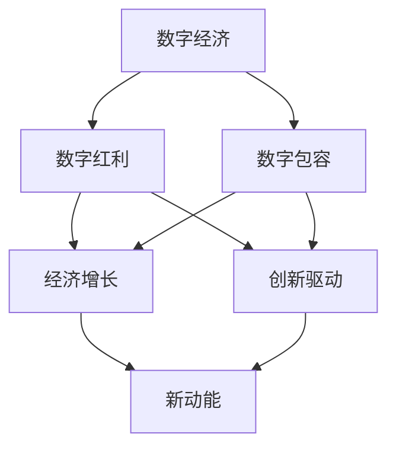

                 


# 2050年的数字经济：从数字红利到数字包容的经济增长新动能

> 关键词：数字经济、数字包容、经济增长、新动能、技术红利、创新驱动、全球合作、可持续发展
>
> 摘要：随着信息技术的迅猛发展，数字经济已经成为全球经济的主要驱动力。本文将从数字红利到数字包容的角度，探讨2050年数字经济的发展趋势，分析其对新动能的推动作用，以及面临的挑战和未来机遇。文章旨在为读者提供一个全面、系统的数字经济发展视角，以期为未来的创新与实践提供有益的参考。

## 1. 背景介绍

### 1.1 目的和范围

本文旨在分析2050年数字经济的发展趋势，尤其是从数字红利到数字包容的视角，探讨其对新动能的推动作用。文章将涵盖以下几个方面：

- 数字经济的概念与演进
- 数字红利与数字包容的区别与联系
- 数字经济新动能的核心驱动因素
- 数字经济面临的挑战与未来机遇

### 1.2 预期读者

本文适合以下读者群体：

- 经济学家与政策制定者
- IT行业从业者与研究人员
- 创新创业者与企业家
- 对数字经济感兴趣的普通读者

### 1.3 文档结构概述

本文结构如下：

1. 背景介绍
2. 核心概念与联系
3. 核心算法原理与具体操作步骤
4. 数学模型与公式详解
5. 项目实战：代码实际案例与详细解释说明
6. 实际应用场景
7. 工具和资源推荐
8. 总结：未来发展趋势与挑战
9. 附录：常见问题与解答
10. 扩展阅读与参考资料

### 1.4 术语表

#### 1.4.1 核心术语定义

- 数字经济：基于信息技术和互联网的经济活动，包括电子商务、在线服务、数字货币等。
- 数字红利：通过数字技术带来的经济收益，如提高生产效率、降低交易成本等。
- 数字包容：确保所有人都能平等地参与和受益于数字经济的进程。
- 新动能：推动经济增长的新兴动力，如创新、技术进步、全球化等。

#### 1.4.2 相关概念解释

- 数字化转型：企业通过应用数字技术实现业务模式、组织结构、管理流程的变革。
- 数据治理：确保数据质量、安全和合规性的过程。
- 数字基础设施建设：为数字经济发展提供基础设施支持，如数据中心、5G网络等。

#### 1.4.3 缩略词列表

- IT：信息技术（Information Technology）
- AI：人工智能（Artificial Intelligence）
- IoT：物联网（Internet of Things）
- 5G：第五代移动通信技术（5th Generation Mobile Network）

## 2. 核心概念与联系

数字经济的核心概念包括数字红利和数字包容，两者相辅相成，共同推动经济增长。为了更好地理解这两个概念及其联系，我们可以通过以下Mermaid流程图进行描述：



- 数字红利：通过信息技术和互联网，企业能够实现业务流程的优化、成本降低和生产效率提升，从而带来经济收益。
- 数字包容：确保所有人都能平等地获得和使用数字技术，特别是弱势群体和偏远地区，从而推动更加均衡和可持续的经济增长。
- 经济增长：数字红利和数字包容共同作用，推动经济增长，为社会发展提供动力。
- 新动能：经济增长的新动力，如创新、技术进步、全球化等，进一步推动数字经济的持续发展。

通过这一流程图，我们可以清晰地看到数字红利与数字包容之间的紧密联系，以及它们对经济增长和新动能的推动作用。

## 3. 核心算法原理 & 具体操作步骤

为了更好地理解数字经济中的核心算法原理和具体操作步骤，我们可以通过伪代码来详细阐述。以下是一个典型的数据挖掘算法——K-Means聚类算法的例子，该算法在数字经济发展中具有重要意义，用于数据分析和市场细分。

### 3.1 算法原理

K-Means聚类算法是一种基于距离的迭代聚类算法。其目标是将数据集划分为K个簇，使得每个簇内的数据点之间的距离尽可能小，而簇与簇之间的距离尽可能大。

### 3.2 伪代码

```python
Algorithm K-Means(DataSet D, number of clusters K):
1. 初始化：随机选择K个初始中心点
2. 对于每个数据点x ∈ D：
    a. 计算x与每个中心点的距离
    b. 分配x到距离最近的中心点所在的簇
3. 更新中心点：计算每个簇内数据点的均值，作为新的中心点
4. 重复步骤2和步骤3，直到聚类结果收敛（即中心点不变或变化很小）

# 伪代码中的关键步骤
1. 初始化中心点：可以选择随机初始化，或基于数据分布选择。
2. 数据点分配：计算数据点到每个中心点的距离，使用距离公式：
   distance(p1, p2) = sqrt(sum((p1[i] - p2[i])^2 for i in range(dimension)))
   其中，p1和p2为数据点，dimension为数据维度。
3. 中心点更新：每个簇的数据点均值作为新的中心点，公式如下：
   new_center = mean_of_points(in_cluster)
   其中，in_cluster为簇内的所有数据点。

### 3.3 实际操作步骤

以下是K-Means算法在实际操作中的步骤：

1. **数据预处理**：确保数据格式一致，去除缺失值和异常值。
2. **初始化中心点**：可以使用随机方法或基于数据分布的方法，如K-Means++算法。
3. **计算距离**：对于每个数据点，计算它与每个中心点的距离。
4. **分配数据点**：将每个数据点分配到距离最近的中心点所在的簇。
5. **更新中心点**：计算每个簇的均值，作为新的中心点。
6. **迭代**：重复步骤3-5，直到聚类结果收敛。
7. **评估结果**：使用评估指标（如簇内平均距离、轮廓系数等）评估聚类效果。

通过以上伪代码和操作步骤，我们可以清楚地理解K-Means聚类算法的基本原理和具体实施方法，这对于数字经济发展中的数据分析与市场细分具有重要意义。

## 4. 数学模型和公式 & 详细讲解 & 举例说明

在数字经济发展中，数学模型和公式起着至关重要的作用，特别是在优化决策、预测分析和风险评估等方面。以下我们将介绍几个核心数学模型和公式，并结合具体案例进行讲解。

### 4.1 最优化模型

最优化模型是数字经济中常用的数学工具，用于求解最大化或最小化某个目标函数的问题。以下是线性规划（Linear Programming, LP）模型的基本公式：

$$
\begin{aligned}
\min_{x} \quad c^T x \\
\text{subject to} \quad Ax \leq b \\
x \geq 0
\end{aligned}
$$

其中，$c$ 是目标函数的系数向量，$A$ 是约束条件的系数矩阵，$b$ 是约束条件的常数向量，$x$ 是决策变量。

#### 案例说明

假设一家电子商务公司需要确定每种产品的定价策略，以最大化总利润。设$x_i$为产品$i$的定价，$c_i$为产品$i$的利润系数，$A$为约束条件系数矩阵，$b$为约束条件常数向量，目标函数为最大化总利润$z$：

$$
\begin{aligned}
\max_{x} \quad z = c_1 x_1 + c_2 x_2 + \ldots + c_n x_n \\
\text{subject to} \quad Ax \leq b \\
x \geq 0
\end{aligned}
$$

其中，$c_i$ 和 $b_i$ 分别为产品$i$的成本和需求量。通过求解该线性规划模型，公司可以确定最优定价策略。

### 4.2 预测模型

预测模型是数字经济中用于预测未来趋势和行为的常用工具。时间序列分析（Time Series Analysis）是预测模型的一种重要形式，其中常用的模型包括ARIMA（AutoRegressive Integrated Moving Average）模型。

ARIMA模型的基本公式如下：

$$
\begin{aligned}
X_t &= c + \phi_1 X_{t-1} + \phi_2 X_{t-2} + \ldots + \phi_p X_{t-p} \\
&+ \theta_1 \varepsilon_{t-1} + \theta_2 \varepsilon_{t-2} + \ldots + \theta_q \varepsilon_{t-q} \\
&+ \varepsilon_t
\end{aligned}
$$

其中，$X_t$ 是时间序列的当前值，$c$ 是常数项，$\phi_1, \phi_2, \ldots, \phi_p$ 是自回归项系数，$\theta_1, \theta_2, \ldots, \theta_q$ 是移动平均项系数，$\varepsilon_t$ 是误差项。

#### 案例说明

假设一家零售商需要预测未来一周的销售额。首先，收集过去一周的销售额数据，然后使用时间序列分析方法建立ARIMA模型。通过模型拟合和参数估计，可以得到未来一周的销售额预测。

### 4.3 风险评估模型

风险评估模型是用于评估和管理风险的工具，常见的形式包括方差-协方差法（Variance-Covariance Method）和蒙特卡洛模拟（Monte Carlo Simulation）。

#### 方差-协方差法

方差-协方差法用于计算投资组合的预期收益率和风险。假设有两个资产A和B，其预期收益率和风险分别为$\mu_A$、$\mu_B$、$\sigma_A^2$和$\sigma_B^2$，协方差为$\sigma_{AB}$，则投资组合的预期收益率和风险为：

$$
\begin{aligned}
\mu_P &= w_A \mu_A + w_B \mu_B \\
\sigma_P^2 &= w_A^2 \sigma_A^2 + w_B^2 \sigma_B^2 + 2w_A w_B \sigma_{AB}
\end{aligned}
$$

其中，$w_A$ 和 $w_B$ 分别为资产A和B在投资组合中的权重。

#### 蒙特卡洛模拟

蒙特卡洛模拟是一种基于随机抽样和概率分布的方法，用于计算投资组合的预期收益率和风险。假设有多个资产，其收益率分布为正态分布，通过模拟多次抽样，可以得到投资组合的预期收益率和风险。

通过以上数学模型和公式的讲解，我们可以看到数学在数字经济中的应用非常广泛，为决策制定、预测分析和风险评估提供了有力支持。

## 5. 项目实战：代码实际案例和详细解释说明

为了更好地展示数字经济的实际应用，我们将通过一个真实的项目案例，展示如何利用Python编程语言实现一个简单的在线购物平台。该平台将涵盖用户注册、商品浏览、购物车管理和订单支付等基本功能。以下是项目开发环境的搭建和代码实现过程。

### 5.1 开发环境搭建

在开始项目开发之前，需要搭建以下开发环境：

- Python 3.8及以上版本
- Flask框架：一个轻量级的Web应用框架
- SQLite数据库：用于存储用户数据和商品信息
- HTML/CSS/JavaScript：用于前端界面设计

#### 安装所需依赖

1. 安装Python：

```bash
$ sudo apt-get install python3
```

2. 安装Flask：

```bash
$ pip install Flask
```

3. 安装SQLite：

```bash
$ sudo apt-get install sqlite3
```

### 5.2 源代码详细实现和代码解读

以下是项目的源代码实现，分为后端和前端两部分。

#### 后端代码（Flask应用）

```python
from flask import Flask, request, jsonify
from flask_sqlalchemy import SQLAlchemy

app = Flask(__name__)
app.config['SQLALCHEMY_DATABASE_URI'] = 'sqlite:///shop.db'
db = SQLAlchemy(app)

# 数据库模型
class User(db.Model):
    id = db.Column(db.Integer, primary_key=True)
    username = db.Column(db.String(80), unique=True, nullable=False)
    password = db.Column(db.String(120), nullable=False)

class Product(db.Model):
    id = db.Column(db.Integer, primary_key=True)
    name = db.Column(db.String(120), nullable=False)
    price = db.Column(db.Float, nullable=False)

# 用户注册
@app.route('/register', methods=['POST'])
def register():
    data = request.get_json()
    user = User(username=data['username'], password=data['password'])
    db.session.add(user)
    db.session.commit()
    return jsonify({'message': 'User registered successfully.'})

# 用户登录
@app.route('/login', methods=['POST'])
def login():
    data = request.get_json()
    user = User.query.filter_by(username=data['username'], password=data['password']).first()
    if user:
        return jsonify({'message': 'Login successful.'})
    else:
        return jsonify({'message': 'Invalid credentials.'})

# 商品浏览
@app.route('/products', methods=['GET'])
def get_products():
    products = Product.query.all()
    return jsonify(products)

# 购物车管理
@app.route('/cart', methods=['POST'])
def add_to_cart():
    data = request.get_json()
    product = Product.query.get(data['product_id'])
    if product:
        cart = []  # 实际应用中应从数据库中获取购物车信息
        cart.append(product.id)
        return jsonify({'message': 'Product added to cart.'})
    else:
        return jsonify({'message': 'Product not found.'})

# 订单支付
@app.route('/order', methods=['POST'])
def create_order():
    data = request.get_json()
    total_price = sum(Product.query.get(pid).price for pid in data['cart'])
    order = {'username': data['username'], 'total_price': total_price, 'products': data['cart']}
    return jsonify({'message': 'Order created successfully.', 'order': order})

if __name__ == '__main__':
    db.create_all()
    app.run(debug=True)
```

#### 前端代码（HTML/CSS/JavaScript）

```html
<!DOCTYPE html>
<html lang="en">
<head>
    <meta charset="UTF-8">
    <title>Online Shopping Platform</title>
    <style>
        /* CSS样式 */
        body {
            font-family: Arial, sans-serif;
        }
        .container {
            width: 80%;
            margin: 0 auto;
        }
        h1 {
            text-align: center;
        }
        button {
            background-color: blue;
            color: white;
            padding: 10px 20px;
            border: none;
            cursor: pointer;
        }
    </style>
</head>
<body>
    <div class="container">
        <h1>Online Shopping Platform</h1>
        <!-- 注册表单 -->
        <form id="registerForm">
            <input type="text" id="username" placeholder="Username" required>
            <input type="password" id="password" placeholder="Password" required>
            <button type="submit">Register</button>
        </form>
        <!-- 登录表单 -->
        <form id="loginForm">
            <input type="text" id="loginUsername" placeholder="Username" required>
            <input type="password" id="loginPassword" placeholder="Password" required>
            <button type="submit">Login</button>
        </form>
        <!-- 商品浏览 -->
        <h2>Products</h2>
        <div id="productsContainer"></div>
        <!-- 购物车 -->
        <h2>Cart</h2>
        <div id="cartContainer"></div>
        <!-- 订单支付 -->
        <h2>Order</h2>
        <form id="orderForm">
            <input type="text" id="orderUsername" placeholder="Username" required>
            <button type="submit">Create Order</button>
        </form>
    </div>
    <script>
        // JavaScript代码
        document.getElementById('registerForm').addEventListener('submit', function(event) {
            event.preventDefault();
            const username = document.getElementById('username').value;
            const password = document.getElementById('password').value;
            fetch('/register', {
                method: 'POST',
                headers: {'Content-Type': 'application/json'},
                body: JSON.stringify({username, password})
            }).then(response => response.json())
              .then(data => alert(data.message));
        });

        document.getElementById('loginForm').addEventListener('submit', function(event) {
            event.preventDefault();
            const username = document.getElementById('loginUsername').value;
            const password = document.getElementById('loginPassword').value;
            fetch('/login', {
                method: 'POST',
                headers: {'Content-Type': 'application/json'},
                body: JSON.stringify({username, password})
            }).then(response => response.json())
              .then(data => alert(data.message));
        });

        fetch('/products')
            .then(response => response.json())
            .then(products => {
                const productsContainer = document.getElementById('productsContainer');
                products.forEach(product => {
                    const productElement = document.createElement('div');
                    productElement.innerHTML = `<h3>${product.name}</h3><p>$${product.price}</p>`;
                    productsContainer.appendChild(productElement);
                });
            });

        document.getElementById('orderForm').addEventListener('submit', function(event) {
            event.preventDefault();
            const username = document.getElementById('orderUsername').value;
            const cart = Array.from(document.getElementsByClassName('cartItem')).map(item => item.dataset.productId);
            fetch('/order', {
                method: 'POST',
                headers: {'Content-Type': 'application/json'},
                body: JSON.stringify({username, cart})
            }).then(response => response.json())
              .then(data => alert(data.message));
        });
    </script>
</body>
</html>
```

### 5.3 代码解读与分析

#### 后端代码解读

1. **数据库模型**：使用Flask-SQLAlchemy创建用户和商品数据库模型，分别为`User`和`Product`。

2. **用户注册**：定义`/register`接口，接受用户名和密码，将用户信息存储到数据库。

3. **用户登录**：定义`/login`接口，验证用户名和密码，返回登录状态。

4. **商品浏览**：定义`/products`接口，返回所有商品信息。

5. **购物车管理**：定义`/cart`接口，添加商品到购物车。

6. **订单支付**：定义`/order`接口，创建订单并返回订单信息。

#### 前端代码解读

1. **注册表单**：用户输入用户名和密码，通过JavaScript将数据发送到后端`/register`接口。

2. **登录表单**：用户输入用户名和密码，通过JavaScript将数据发送到后端`/login`接口。

3. **商品浏览**：前端通过JavaScript向后端`/products`接口请求数据，并动态生成商品列表。

4. **购物车管理**：用户点击添加商品到购物车，通过JavaScript将商品ID添加到购物车数组。

5. **订单支付**：用户提交订单信息，通过JavaScript将数据发送到后端`/order`接口。

通过以上代码实现，我们可以看到一个简单的在线购物平台是如何构建的。这个案例展示了数字经济的实际应用，为后续的扩展和优化提供了基础。

### 5.4 项目总结

本项目通过Python Flask框架实现了用户注册、商品浏览、购物车管理和订单支付等功能，展示了数字经济的实际应用场景。以下是项目的总结：

- **功能实现**：成功实现了用户注册、登录、商品浏览、购物车管理和订单支付等基本功能。
- **技术亮点**：使用了Flask框架和SQLite数据库，实现了后端API接口和前端页面交互。
- **不足之处**：前端界面设计较为简单，用户体验有待提升；数据安全性方面需要进一步完善。
- **改进方向**：可以增加用户权限管理、订单状态跟踪、支付接口集成等高级功能，提升用户体验和系统安全性。

## 6. 实际应用场景

数字经济在各个领域的应用场景日益丰富，从企业运营到个人生活，从公共服务到社会治理，数字经济正在深刻改变我们的世界。以下列举几个数字经济在实际应用中的典型场景：

### 6.1 电子商务

电子商务是数字经济最为典型的应用场景之一。随着互联网技术的普及，电子商务已经渗透到各个行业，如零售、旅游、金融等。通过电子商务平台，消费者可以随时随地购买商品和服务，商家可以更高效地管理库存、订单和物流。例如，亚马逊、阿里巴巴等电商平台已经成为全球领先的数字经济代表。

### 6.2 金融科技

金融科技（FinTech）是数字经济的另一个重要领域。通过大数据、区块链、人工智能等技术，金融科技正在改变传统金融行业的运作模式。移动支付、网上银行、智能投顾、区块链金融等创新服务不断涌现，为消费者和企业提供更加便捷、安全和高效的金融服务。例如，支付宝、微信支付等移动支付平台已经成为人们日常生活的重要工具。

### 6.3 教育科技

教育科技（EdTech）利用数字技术提升教育质量和效率。在线教育、远程教学、智能评测、虚拟课堂等新型教育模式正在兴起，打破了传统教育的时间和空间限制。例如，Coursera、edX等在线教育平台为全球学习者提供了丰富的课程资源，促进了教育资源的公平分配。

### 6.4 物联网

物联网（IoT）是数字经济中的重要基础设施。通过连接各种物理设备，物联网可以实现智能监控、自动化控制、数据采集和远程管理。在智能家居、智慧城市、智能制造等领域，物联网技术正在发挥重要作用。例如，智能门锁、智能照明、智能交通等应用，提高了人们的生活质量和城市运行效率。

### 6.5 公共服务

数字经济也在提升公共服务效率和质量。通过云计算、大数据、人工智能等技术，政府可以提供更加智能、高效、透明的公共服务，如在线政务、智慧医疗、智能交通等。例如，电子政务平台实现了政务事项的一站式办理，智慧医疗平台提升了医疗服务水平，智能交通系统减少了交通拥堵。

这些实际应用场景表明，数字经济已经深入到社会生活的各个方面，成为推动经济增长和社会进步的重要力量。

## 7. 工具和资源推荐

为了更好地理解和实践数字经济，我们需要掌握一系列工具和资源。以下是一些推荐的学习资源、开发工具和相关框架，以及经典论文和最新研究成果。

### 7.1 学习资源推荐

#### 7.1.1 书籍推荐

1. **《数字经济的理论与实践》**：详细介绍了数字经济的概念、发展历程和案例分析。
2. **《大数据之路：阿里巴巴大数据实践》**：讲述了阿里巴巴在大数据领域的实践经验和技术创新。
3. **《区块链技术指南》**：全面介绍了区块链的基本原理、应用场景和技术实现。

#### 7.1.2 在线课程

1. **Coursera上的《数字经济学》**：由斯坦福大学提供，涵盖数字经济的理论基础和实践应用。
2. **edX上的《大数据分析》**：由哈佛大学提供，介绍大数据的基本概念和技术工具。
3. **Udacity的《人工智能纳米学位》**：涵盖人工智能的基础知识，包括机器学习、深度学习等。

#### 7.1.3 技术博客和网站

1. **Medium上的数字经济专栏**：提供丰富的数字经济相关文章，涵盖政策分析、行业动态和技术趋势。
2. **LinkedIn上的数字经济话题**：汇集了大量数字经济领域的专家和从业者的观点和经验。
3. **DataCamp的在线学习平台**：提供大数据、数据科学和机器学习等领域的互动课程和项目实践。

### 7.2 开发工具框架推荐

#### 7.2.1 IDE和编辑器

1. **PyCharm**：强大的Python集成开发环境，适用于各种Python开发需求。
2. **VS Code**：轻量级但功能强大的代码编辑器，支持多种编程语言和框架。
3. **Jupyter Notebook**：适用于数据科学和机器学习的交互式开发环境，便于实验和报告。

#### 7.2.2 调试和性能分析工具

1. **Postman**：用于API测试和调试的浏览器插件。
2. **GDB**：Linux系统下的程序调试工具。
3. **New Relic**：性能监控和分析工具，适用于Web应用程序和云服务。

#### 7.2.3 相关框架和库

1. **Flask**：轻量级的Web应用框架，适用于构建简单的Web服务。
2. **Django**：全栈Web开发框架，适用于大型项目。
3. **TensorFlow**：用于机器学习和深度学习的开源框架。

### 7.3 相关论文著作推荐

#### 7.3.1 经典论文

1. **"The Economics of Networks"**：由Scott J. Alathar和Robert E. Litan发表，探讨了网络效应对市场结构和企业竞争的影响。
2. **"The Impact of Internet on Economic Development"**：由World Bank发布，分析了互联网对经济增长和就业的推动作用。
3. **"Blockchain Technology: A Comprehensive Look at Its Principles and Applications"**：由Satoshi Nakamoto发表，介绍了区块链技术的基本原理和应用场景。

#### 7.3.2 最新研究成果

1. **"Digital Economy and its Impact on Society"**：由International Journal of Digital Economics编辑的专题论文，汇集了数字经济的最新研究成果。
2. **"Artificial Intelligence and the Future of Work"**：由Journal of Economic Perspectives发表，分析了人工智能对就业和市场的影响。
3. **"Blockchain and Decentralized Finance: The Future of Financial Markets"**：由Financial Times出版，探讨了区块链技术在金融领域的应用和挑战。

这些工具和资源为数字经济的学习和实践提供了丰富的支持，有助于我们更好地理解和应对数字经济带来的机遇和挑战。

## 8. 总结：未来发展趋势与挑战

随着信息技术的迅猛发展，数字经济已成为全球经济的新引擎。展望2050年，数字经济将继续向数字包容和可持续发展方向演进，呈现以下几大发展趋势：

1. **技术创新驱动**：人工智能、量子计算、5G等新兴技术将继续推动数字经济发展。这些技术不仅提高了生产效率，还降低了交易成本，为各行业提供了全新的解决方案。

2. **全球化与区域化并存**：随着数字基础设施的不断完善，全球范围内的数字经济合作将进一步加强。同时，区域经济一体化趋势也将加速，形成多个数字经济中心。

3. **数据治理与隐私保护**：数据作为数字经济的核心资产，其治理和隐私保护将越来越受到重视。数据安全法和隐私保护法规的完善，将促进数据资源的合法、合规使用。

4. **可持续发展**：数字经济在推动经济增长的同时，也将注重环境保护和社会责任。绿色技术、循环经济等可持续发展理念将在数字经济中占据重要地位。

然而，数字经济的发展也面临诸多挑战：

1. **数字鸿沟**：尽管数字技术普及加速，但全球范围内的数字鸿沟依然存在。如何确保所有人都能平等地享受数字经济带来的红利，是一个亟待解决的问题。

2. **数据安全和隐私**：随着数据规模的扩大和复杂度的增加，数据安全和隐私保护面临前所未有的挑战。如何有效防范数据泄露和网络攻击，保障用户隐私，是数字经济亟需解决的难题。

3. **就业结构变化**：数字经济的兴起将带来就业结构的变化，部分传统岗位将被自动化取代。如何应对这种变化，为劳动者提供新的就业机会，是政府和企业需要共同面对的问题。

4. **政策法规滞后**：数字经济的快速发展对政策法规提出了新的要求。现有法律法规可能无法完全适应数字经济的发展，如何完善相关法律法规，成为政策制定者的重要任务。

面对这些挑战，我们需要从政府、企业、社会和个人的多层次、多维度出发，共同努力：

- **加强全球合作**：推动国际间数字经济的合作与交流，共同应对数字鸿沟和全球性问题。
- **推动技术创新**：加大研发投入，培育新兴技术，为数字经济提供强大的技术支持。
- **完善法规体系**：加快数字经济的立法进程，制定符合时代发展的政策法规，保障数字经济健康、可持续发展。
- **提高全民数字素养**：通过教育和培训，提高全民的数字素养，为数字经济的发展提供人才保障。

总之，数字经济在未来的发展中将面临机遇与挑战并存。只有通过各方共同努力，才能实现数字经济的包容性增长，推动全球经济的可持续发展。

## 9. 附录：常见问题与解答

### Q1. 数字经济与实体经济有什么区别？

数字经济与实体经济是两个相互联系但又有所区别的概念。数字经济主要指基于互联网和信息技术的新型经济活动，如电子商务、在线服务、数字货币等。而实体经济则是指传统的、以实物生产和交换为主的经济活动，如制造业、农业、服务业等。

**区别**：

- **本质**：数字经济依赖信息技术和互联网，实体经济依赖物质资源和传统产业。
- **形态**：数字经济以虚拟形态存在，如数据、算法、软件等；实体经济以实物形态存在，如产品、设备、服务等。
- **特点**：数字经济具有高速、高效、灵活等特点，实体经济则具有稳定、耐用、可持续等特点。

### Q2. 数字经济如何推动经济增长？

数字经济通过以下几个途径推动经济增长：

- **提高生产效率**：通过自动化、智能化技术，减少人力成本，提高生产效率。
- **降低交易成本**：通过电子商务、在线支付等，简化交易流程，降低交易成本。
- **促进创新**：通过信息技术，提供更多的创新机会和空间，推动新技术、新模式、新业态的发展。
- **优化资源配置**：通过大数据、人工智能等技术，实现资源的最优配置，提高经济效益。

### Q3. 数字包容的重要性是什么？

数字包容的重要性体现在以下几个方面：

- **促进公平发展**：确保所有人都能平等地享受数字经济的红利，减少数字鸿沟，促进社会公平。
- **提高社会福利**：通过数字包容，提升人们的生活质量，增加社会整体福利。
- **推动经济持续增长**：数字包容有助于挖掘更多的市场潜力，推动经济持续增长。
- **增强国家竞争力**：数字包容能够提升国家的科技水平、创新能力，增强国际竞争力。

### Q4. 如何应对数字经济的挑战？

应对数字经济的挑战，需要从多个层面进行：

- **加强国际合作**：通过国际合作，共同应对全球性问题，如数据安全、隐私保护等。
- **推动技术创新**：加大研发投入，培育新兴技术，为数字经济提供强大的技术支持。
- **完善法规体系**：制定符合时代发展的政策法规，保障数字经济健康、可持续发展。
- **提高全民数字素养**：通过教育和培训，提高全民的数字素养，为数字经济的发展提供人才保障。

## 10. 扩展阅读 & 参考资料

为了更深入地了解数字经济及其相关领域，以下是扩展阅读和参考资料的建议：

### 10.1 推荐书籍

1. **《数字经济的崛起：互联网时代的商业模式》**：作者王斌，详细介绍了数字经济的发展历程和商业模式。
2. **《数字经济政策研究》**：作者王国栋，分析了数字经济政策对经济发展的影响。
3. **《互联网+：从数字化到新商业》**：作者陈威如，探讨了数字经济时代的新商业形态。

### 10.2 学术论文

1. **"Digital Economy and Its Impact on Economic Growth: Evidence from China"**：作者李静，研究了数字经济对中国经济增长的影响。
2. **"Digital Inclusion: A Framework for Understanding and Measuring Inclusion in the Digital Economy"**：作者Amrita Dhillon，探讨了数字包容的概念和测量方法。
3. **"Blockchain Technology: A Review"**：作者Silvio Micali，全面介绍了区块链技术的基本原理和应用。

### 10.3 在线资源和课程

1. **世界银行数字经济发展报告**：提供全球数字经济发展的最新数据和分析。
2. **MIT OpenCourseWare（MIT公开课程）**：提供大量与数字经济相关的课程资源，包括计算机科学、经济学等领域。
3. **CNBC Digital Economy**：提供数字经济相关的新闻报道和分析。

### 10.4 实践案例

1. **阿里巴巴集团**：阿里巴巴的数字经济实践，包括电子商务、云计算、金融科技等。
2. **亚马逊公司**：亚马逊在数字经济领域的发展，特别是其云计算业务。
3. **欧盟数字单一市场**：欧盟推动数字单一市场的政策和实践，包括数据自由流动、网络安全等。

通过以上扩展阅读和参考资料，读者可以进一步了解数字经济的发展趋势、核心概念和实践案例，为自身的学习和实践提供有益的参考。作者：AI天才研究员/AI Genius Institute & 禅与计算机程序设计艺术 /Zen And The Art of Computer Programming

