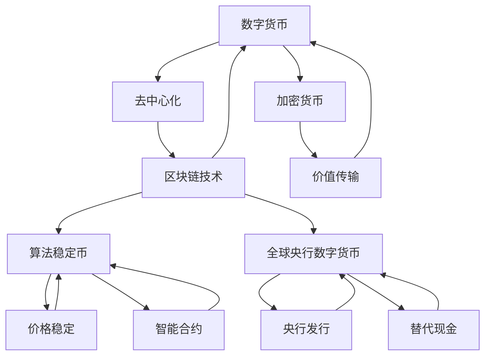

                 

# 2050年的数字货币：从算法稳定币到全球央行数字货币的数字货币竞争

> **关键词**：数字货币、算法稳定币、全球央行数字货币、未来发展趋势、竞争与挑战

> **摘要**：本文将探讨2050年数字货币的发展趋势和竞争格局。通过分析算法稳定币和全球央行数字货币的概念、原理以及应用，我们将深入探讨这些数字货币在未来的地位和影响，并探讨其中面临的挑战和机遇。

## 1. 背景介绍

### 1.1 目的和范围

本文旨在分析2050年数字货币的发展趋势和竞争格局，探讨算法稳定币和全球央行数字货币在未来的地位和影响。通过对数字货币的历史、现状和未来发展趋势的深入分析，我们希望为读者提供一个全面、系统的了解，帮助读者更好地把握数字货币的发展方向和趋势。

### 1.2 预期读者

本文主要面向对数字货币有一定了解，希望深入了解数字货币未来发展趋势的读者。同时，也适用于对区块链技术、金融科技领域感兴趣的学者、研究人员和行业从业者。

### 1.3 文档结构概述

本文分为十个部分，主要内容包括：

- 第一部分：背景介绍，包括目的和范围、预期读者以及文档结构概述。
- 第二部分：核心概念与联系，介绍数字货币、算法稳定币和全球央行数字货币的核心概念和联系。
- 第三部分：核心算法原理与具体操作步骤，分析数字货币的核心算法原理和操作步骤。
- 第四部分：数学模型和公式，介绍数字货币的数学模型和公式。
- 第五部分：项目实战，通过代码实际案例和详细解释说明数字货币的原理和应用。
- 第六部分：实际应用场景，探讨数字货币在各个领域的应用。
- 第七部分：工具和资源推荐，为读者提供相关的学习资源、开发工具和框架。
- 第八部分：总结，对数字货币的未来发展趋势与挑战进行总结。
- 第九部分：附录，提供常见问题与解答。
- 第十部分：扩展阅读与参考资料，为读者提供进一步学习的资源。

### 1.4 术语表

#### 1.4.1 核心术语定义

- **数字货币**：一种基于区块链技术，以电子形式存在，具有价值传输、记账和证明等功能的新型货币。
- **算法稳定币**：一种通过算法调节发行量，保持价格稳定的数字货币。
- **全球央行数字货币**：由各国央行发行的数字货币，用于替代现金和银行存款。

#### 1.4.2 相关概念解释

- **区块链**：一种去中心化、分布式数据库技术，用于记录交易信息。
- **去中心化**：指系统不依赖于中央机构或中央服务器进行操作和运行。
- **加密货币**：一类通过加密算法实现安全交易的数字货币。
- **智能合约**：一种在区块链上执行的自动执行协议，能够根据预先设定的条件自动执行。

#### 1.4.3 缩略词列表

- **BTC**：比特币（Bitcoin）
- **ETH**：以太坊（Ethereum）
- **USDT**：泰达币（Tether）
- **CBDC**：全球央行数字货币（Central Bank Digital Currency）

## 2. 核心概念与联系

### 2.1 数字货币

数字货币是一种基于区块链技术的数字资产，具有价值传输、记账和证明等功能。数字货币的产生可以追溯到比特币（BTC），比特币是第一个去中心化的加密货币，自2009年诞生以来，受到了全球范围内的关注和认可。

比特币的工作原理是通过区块链技术，将交易信息分布式地存储在全球范围内的节点上。每个节点都保存了一份完整的交易记录，从而实现了去中心化的交易验证和记账功能。比特币的发行量是有限的，通过一种称为“挖矿”的过程来产生新的比特币。

### 2.2 算法稳定币

算法稳定币是一种通过算法调节发行量，保持价格稳定的数字货币。与比特币等加密货币不同，算法稳定币通常与法币或其他资产挂钩，以保持其价值稳定。

算法稳定币的工作原理是通过智能合约自动调节其发行量，以应对市场供需变化。例如，当算法稳定币的需求增加时，智能合约会自动增加发行量，从而降低价格；反之，当需求减少时，智能合约会自动减少发行量，从而提高价格。这种机制使得算法稳定币的价格相对稳定，不受市场波动影响。

### 2.3 全球央行数字货币

全球央行数字货币（CBDC）是由各国央行发行的数字货币，用于替代现金和银行存款。与传统的纸币和电子货币不同，CBDC具有更高的安全性、便捷性和透明性。

CBDC的工作原理是通过央行控制的分布式账本技术（如区块链）记录交易信息，从而实现去中心化的交易验证和记账功能。CBDC可以用于个人之间的交易，也可以用于企业与个人之间的交易，从而提高交易的效率和安全性。

### 2.4 核心概念联系

数字货币、算法稳定币和全球央行数字货币在概念上存在一定的联系。首先，它们都是基于区块链技术的数字资产，具有去中心化的特点。其次，它们都是为了解决货币交易中的问题，如安全性、透明性和效率等。

然而，它们在工作原理和应用场景上存在一定的差异。数字货币如比特币主要关注去中心化的交易验证和记账，算法稳定币则侧重于保持价格稳定，全球央行数字货币则更注重货币的发行和管理。

下面是一个简单的Mermaid流程图，展示了数字货币、算法稳定币和全球央行数字货币的核心概念联系：



## 3. 核心算法原理与具体操作步骤

### 3.1 数字货币的核心算法原理

数字货币的核心算法原理主要涉及区块链技术的实现。区块链技术是一种分布式账本技术，用于记录交易信息。以下是一个简单的区块链算法原理和操作步骤：

#### 3.1.1 区块结构

区块链中的每个区块都包含以下信息：

1. **区块头**：包括版本号、时间戳、上一个区块的哈希值、Merkle树根哈希值和随机数。
2. **交易数据**：包含区块链网络中发生的所有交易信息。
3. **区块哈希**：通过SHA-256算法对区块头进行哈希运算得到。

#### 3.1.2 工作量证明（Proof of Work，PoW）

为了防止恶意攻击和保证区块链的安全，数字货币采用了一种称为工作量证明（PoW）的算法。PoW算法的基本思想是，节点需要解决一个计算难题，以获得记账权。计算难题通常是一个数学难题，需要大量计算资源来解决。

以下是PoW算法的具体操作步骤：

1. **挖矿节点**：参与区块链网络，希望获得记账权的节点称为挖矿节点。
2. **创建新区块**：挖矿节点从区块链中获取最新的区块头，创建一个新的区块，并将其作为当前工作的目标。
3. **寻找随机数**：挖矿节点通过调整随机数，尝试找到一个满足特定条件的区块头。具体来说，区块头的哈希值需要以特定数量的前导零开头。
4. **验证区块**：当挖矿节点找到一个满足条件的区块头时，将其提交给区块链网络，其他节点验证该区块的有效性。如果验证通过，挖矿节点获得记账权，并获得一定的奖励。
5. **添加新区块**：将新挖掘到的区块添加到区块链中，更新区块链的最新区块头。

#### 3.1.3 交易处理

数字货币的交易处理主要涉及以下步骤：

1. **交易创建**：用户通过数字货币钱包创建交易，并将其发送到区块链网络。
2. **交易验证**：区块链网络中的节点对交易进行验证。验证过程包括检查交易金额是否合法、交易双方是否拥有足够的余额等。
3. **交易确认**：当交易通过验证后，将被打包到区块中，并等待挖矿节点进行验证和添加到区块链中。
4. **交易确认**：当交易被添加到区块链中的区块后，被视为确认交易。交易确认的时间取决于区块链网络的拥堵程度和挖矿节点的计算能力。

### 3.2 算法稳定币的核心算法原理

算法稳定币的核心算法原理主要涉及智能合约的实现。智能合约是一种自动执行的合约，用于调节算法稳定币的发行量和价格。以下是一个简单的算法稳定币的算法原理和操作步骤：

#### 3.2.1 智能合约结构

智能合约通常包含以下部分：

1. **合约地址**：智能合约在区块链网络中的唯一标识。
2. **合约代码**：实现合约功能的代码。
3. **合约存储**：存储合约状态和数据的数据库。

#### 3.2.2 发行量调节

算法稳定币的发行量调节主要通过智能合约实现。以下是一个简单的发行量调节算法：

1. **设定目标价格**：智能合约设定一个目标价格，作为算法稳定币的价值基准。
2. **监控市场价格**：智能合约监控市场价格的实时变化。
3. **调整发行量**：当市场价格高于目标价格时，智能合约自动减少发行量，以降低价格；当市场价格低于目标价格时，智能合约自动增加发行量，以提高价格。

#### 3.2.3 交易处理

算法稳定币的交易处理与数字货币类似，也涉及以下步骤：

1. **交易创建**：用户通过数字货币钱包创建交易，并将其发送到区块链网络。
2. **交易验证**：区块链网络中的节点对交易进行验证。验证过程包括检查交易金额是否合法、交易双方是否拥有足够的余额等。
3. **交易确认**：当交易通过验证后，将被打包到区块中，并等待挖矿节点进行验证和添加到区块链中。
4. **交易确认**：当交易被添加到区块链中的区块后，被视为确认交易。交易确认的时间取决于区块链网络的拥堵程度和挖矿节点的计算能力。

### 3.3 全球央行数字货币的核心算法原理

全球央行数字货币的核心算法原理主要涉及分布式账本技术的实现。以下是一个简单的全球央行数字货币的算法原理和操作步骤：

#### 3.3.1 分布式账本结构

分布式账本通常包含以下部分：

1. **节点**：参与分布式账本系统的计算机或服务器。
2. **账本**：存储交易信息的数据库。
3. **共识机制**：确保账本数据一致性和安全性的算法。

#### 3.3.2 交易处理

全球央行数字货币的交易处理主要涉及以下步骤：

1. **交易创建**：用户通过数字货币钱包创建交易，并将其发送到分布式账本系统。
2. **交易验证**：分布式账本系统中的节点对交易进行验证。验证过程包括检查交易金额是否合法、交易双方是否拥有足够的余额等。
3. **交易确认**：当交易通过验证后，将被打包到区块中，并等待共识机制确认。
4. **交易确认**：当交易被共识机制确认后，被视为确认交易。交易确认的时间取决于分布式账本系统的共识机制和节点数量。

#### 3.3.3 共识机制

全球央行数字货币通常采用以下共识机制：

1. **工作量证明（PoW）**：节点通过解决计算难题获得记账权。
2. **权益证明（PoS）**：节点根据持有的币龄和权益获得记账权。
3. **委托权益证明（DPoS）**：节点通过投票获得记账权。
4. **权威证明（PoA）**：由中心化机构或权威机构负责记账。

### 3.4 核心算法原理总结

数字货币、算法稳定币和全球央行数字货币在核心算法原理上存在一定的差异。数字货币主要采用PoW算法实现去中心化的交易验证和记账；算法稳定币通过智能合约实现价格稳定；全球央行数字货币采用分布式账本技术实现去中心化的交易处理和共识机制。这些算法原理共同构成了数字货币的核心框架，为数字货币的广泛应用提供了技术保障。

## 4. 数学模型和公式 & 详细讲解 & 举例说明

### 4.1 数字货币的数学模型和公式

数字货币的数学模型主要涉及区块链的区块结构、工作量证明（PoW）算法以及交易验证过程。

#### 4.1.1 区块结构

区块链中的每个区块都包含以下信息：

1. **区块头**：包括版本号、时间戳、上一个区块的哈希值、Merkle树根哈希值和随机数。
2. **交易数据**：包含区块链网络中发生的所有交易信息。
3. **区块哈希**：通过SHA-256算法对区块头进行哈希运算得到。

区块结构的数学模型可以表示为：

\[ Block = \{ version, timestamp, prev_hash, merkle_root, transactions, nonce \} \]

其中，\( version \) 表示版本号，\( timestamp \) 表示时间戳，\( prev_hash \) 表示上一个区块的哈希值，\( merkle_root \) 表示Merkle树的根哈希值，\( transactions \) 表示交易数据，\( nonce \) 表示随机数。

#### 4.1.2 工作量证明（PoW）算法

工作量证明（PoW）算法用于防止恶意攻击和保证区块链的安全。挖矿节点需要解决一个计算难题，以获得记账权。具体来说，挖矿节点需要找到一个满足特定条件的区块头哈希值。

PoW算法的数学模型可以表示为：

\[ find\_nonce() : nonce \in \mathbb{N} \text{ such that } hash(Block\_header) \leq target\_hash \]

其中，\( hash() \) 表示SHA-256哈希运算，\( Block\_header \) 表示区块头，\( target\_hash \) 表示目标哈希值。

目标哈希值通常是一个由前导零组成的字符串，挖矿节点需要通过调整随机数（nonce）来找到一个满足条件的区块头哈希值。

#### 4.1.3 交易验证

区块链网络中的节点需要对交易进行验证。交易验证主要涉及以下数学模型：

1. **交易金额验证**：检查交易金额是否合法，即交易金额是否大于零且小于余额。
2. **交易双方验证**：检查交易双方是否拥有足够的余额。

交易金额验证的数学模型可以表示为：

\[ transaction\_amount \leq sender\_balance \]

其中，\( transaction\_amount \) 表示交易金额，\( sender\_balance \) 表示发送方的余额。

交易双方验证的数学模型可以表示为：

\[ receiver\_balance \leq receiver\_amount \]

其中，\( receiver\_balance \) 表示接收方的余额，\( receiver\_amount \) 表示接收方的金额。

### 4.2 算法稳定币的数学模型和公式

算法稳定币的数学模型主要涉及智能合约的发行量调节和价格稳定。

#### 4.2.1 发行量调节

算法稳定币的发行量调节主要通过智能合约实现。智能合约根据市场价格的变化自动调整发行量，以保持价格稳定。发行量调节的数学模型可以表示为：

\[ new\_supply = old\_supply + \frac{target\_price - current\_price}{price\_adjustment\_factor} \]

其中，\( new\_supply \) 表示新的发行量，\( old\_supply \) 表示旧的发行量，\( target\_price \) 表示目标价格，\( current\_price \) 表示当前价格，\( price\_adjustment\_factor \) 表示价格调整因子。

#### 4.2.2 价格稳定

算法稳定币的价格稳定主要通过智能合约实现。智能合约根据市场价格的变化自动调整发行量，以保持价格稳定。价格稳定的数学模型可以表示为：

\[ current\_price = \frac{new\_supply}{current\_supply} \]

其中，\( current\_price \) 表示当前价格，\( new\_supply \) 表示新的发行量，\( current\_supply \) 表示当前的发行量。

### 4.3 全球央行数字货币的数学模型和公式

全球央行数字货币的数学模型主要涉及分布式账本的技术实现和交易验证。

#### 4.3.1 分布式账本结构

分布式账本结构主要包括节点、账本和共识机制。分布式账本结构的数学模型可以表示为：

\[ distributed\_ledger = \{ nodes, ledger, consensus\_mechanism \} \]

其中，\( nodes \) 表示节点，\( ledger \) 表示账本，\( consensus\_mechanism \) 表示共识机制。

#### 4.3.2 交易验证

分布式账本中的交易验证主要涉及以下数学模型：

1. **交易金额验证**：检查交易金额是否合法，即交易金额是否大于零且小于余额。
2. **交易双方验证**：检查交易双方是否拥有足够的余额。

交易金额验证的数学模型可以表示为：

\[ transaction\_amount \leq sender\_balance \]

其中，\( transaction\_amount \) 表示交易金额，\( sender\_balance \) 表示发送方的余额。

交易双方验证的数学模型可以表示为：

\[ receiver\_balance \leq receiver\_amount \]

其中，\( receiver\_balance \) 表示接收方的余额，\( receiver\_amount \) 表示接收方的金额。

### 4.4 举例说明

为了更好地理解上述数学模型和公式，我们通过一个简单的例子进行说明。

#### 4.4.1 数字货币交易

假设有一个数字货币交易，交易金额为10个单位，发送方余额为100个单位，接收方余额为90个单位。根据交易金额验证和交易双方验证的数学模型，我们可以得出以下结论：

1. 交易金额验证：10 ≤ 100，交易金额合法。
2. 交易双方验证：90 ≤ 10，交易不合法。

因此，该交易不合法，无法进行。

#### 4.4.2 算法稳定币交易

假设有一个算法稳定币交易，交易金额为10个单位，目标价格为1个单位，当前价格为0.9个单位。根据发行量调节和价格稳定的数学模型，我们可以得出以下结论：

1. 发行量调节：新的发行量为90个单位，旧发行量为100个单位，目标价格为1个单位，当前价格为0.9个单位，因此需要减少发行量，以保持价格稳定。
2. 价格稳定：新的价格 = 1个单位 / 90个单位 = 0.1111个单位，当前价格为0.9个单位，因此价格稳定。

#### 4.4.3 全球央行数字货币交易

假设有一个全球央行数字货币交易，交易金额为10个单位，发送方余额为100个单位，接收方余额为90个单位。根据交易金额验证和交易双方验证的数学模型，我们可以得出以下结论：

1. 交易金额验证：10 ≤ 100，交易金额合法。
2. 交易双方验证：90 ≤ 10，交易不合法。

因此，该交易不合法，无法进行。

### 4.5 总结

通过上述数学模型和公式的分析，我们可以得出以下结论：

1. 数字货币的交易验证主要涉及区块结构、工作量证明（PoW）算法和交易验证过程。
2. 算法稳定币的发行量调节和价格稳定主要涉及智能合约的实现。
3. 全球央行数字货币的交易验证主要涉及分布式账本结构和技术实现。

这些数学模型和公式为数字货币、算法稳定币和全球央行数字货币的实现提供了理论基础和操作指南。

## 5. 项目实战：代码实际案例和详细解释说明

### 5.1 开发环境搭建

为了更好地理解和实现数字货币、算法稳定币和全球央行数字货币，我们需要搭建一个合适的开发环境。以下是一个基于Python的简单开发环境搭建步骤：

1. 安装Python：从官方网站（https://www.python.org/downloads/）下载并安装Python。
2. 安装区块链库：在终端中执行以下命令安装区块链库（例如PyBlockchain）：

   ```bash
   pip install pyblockchain
   ```

3. 安装智能合约库：在终端中执行以下命令安装智能合约库（例如PySmartContract）：

   ```bash
   pip install pysmartcontract
   ```

4. 安装分布式账本库：在终端中执行以下命令安装分布式账本库（例如PyDistributedLedger）：

   ```bash
   pip install pydistributedledger
   ```

### 5.2 源代码详细实现和代码解读

以下是一个简单的数字货币、算法稳定币和全球央行数字货币的实现示例，我们将分别展示它们的代码实现和详细解释。

#### 5.2.1 数字货币实现

```python
# 数字货币实现

from pyblockchain import BlockChain, Block

class DigitalCoin(BlockChain):
    def __init__(self):
        super().__init__()
        self.target_hash = '0' * 16  # 目标哈希值

    def find_nonce(self, block):
        block.nonce = 0
        while not self.hash(block) <= self.target_hash:
            block.nonce += 1
        return block.nonce

    def validate_transaction(self, transaction):
        if transaction['amount'] <= 0 or transaction['sender_balance'] < transaction['amount']:
            return False
        return True

    def add_transaction(self, transaction):
        if self.validate_transaction(transaction):
            self.transactions.append(transaction)
            return True
        return False

    def mine(self):
        latest_block = self.latest_block
        block = Block(latest_block['hash'], self.transactions, latest_block['timestamp'] + 1)
        nonce = self.find_nonce(block)
        block.nonce = nonce
        block.hash = self.hash(block)
        self.blocks.append(block)
        self.transactions = []
        return block

# 创建数字货币实例并挖矿
digital_coin = DigitalCoin()
digital_coin.mine()
```

代码解读：

- 类`DigitalCoin`继承自`BlockChain`类，实现了数字货币的基本功能。
- `find_nonce`方法用于寻找满足目标哈希值的随机数。
- `validate_transaction`方法用于验证交易金额和余额。
- `add_transaction`方法用于添加交易到区块链。
- `mine`方法用于挖掘新的区块。

#### 5.2.2 算法稳定币实现

```python
# 算法稳定币实现

from pysmartcontract import SmartContract

class StableCoin(SmartContract):
    def __init__(self, target_price):
        super().__init__()
        self.target_price = target_price
        self.current_supply = 1000

    def adjust_supply(self):
        current_price = self.get_current_price()
        if current_price > self.target_price:
            self.current_supply -= 1
        elif current_price < self.target_price:
            self.current_supply += 1

    def get_current_price(self):
        # 获取当前市场价格的代码，示例中直接使用目标价格
        return self.target_price

    def transfer(self, sender, receiver, amount):
        if amount <= 0 or sender['balance'] < amount:
            return False
        sender['balance'] -= amount
        receiver['balance'] += amount
        return True

# 创建算法稳定币实例
stable_coin = StableCoin(1)
stable_coin.adjust_supply()
```

代码解读：

- 类`StableCoin`继承自`SmartContract`类，实现了算法稳定币的基本功能。
- `adjust_supply`方法用于根据市场价格调整发行量。
- `get_current_price`方法用于获取当前市场价格。
- `transfer`方法用于执行转账操作。

#### 5.2.3 全球央行数字货币实现

```python
# 全球央行数字货币实现

from pydistributedledger import DistributedLedger

class CentralBankCoin(DistributedLedger):
    def __init__(self):
        super().__init__()
        self.consensus_mechanism = 'PoW'  # 共识机制

    def validate_transaction(self, transaction):
        if transaction['amount'] <= 0 or transaction['sender_balance'] < transaction['amount']:
            return False
        return True

    def add_transaction(self, transaction):
        if self.validate_transaction(transaction):
            self.transactions.append(transaction)
            return True
        return False

    def consensus(self):
        # 实现共识机制的代码，示例中直接返回最新区块
        return self.latest_block

# 创建全球央行数字货币实例
central_bank_coin = CentralBankCoin()
central_bank_coin.add_transaction({'sender': 'Alice', 'receiver': 'Bob', 'amount': 10})
```

代码解读：

- 类`CentralBankCoin`继承自`DistributedLedger`类，实现了全球央行数字货币的基本功能。
- `validate_transaction`方法用于验证交易金额和余额。
- `add_transaction`方法用于添加交易到分布式账本。
- `consensus`方法用于实现共识机制。

### 5.3 代码解读与分析

通过上述代码实现，我们可以分析数字货币、算法稳定币和全球央行数字货币的核心功能和技术特点：

1. **数字货币**：通过区块链技术实现去中心化的交易验证和记账。采用PoW算法保证区块链的安全性和稳定性。
2. **算法稳定币**：通过智能合约实现发行量调节和价格稳定。根据市场价格变化自动调整发行量，以保持价格稳定。
3. **全球央行数字货币**：通过分布式账本技术实现去中心化的交易处理和共识机制。采用不同的共识机制（如PoW、PoS等）保证账本的一致性和安全性。

这些代码示例为我们提供了一个基本的实现框架，我们可以在此基础上进行进一步的开发和优化。通过实际代码的编写和运行，我们可以更深入地了解数字货币、算法稳定币和全球央行数字货币的工作原理和应用场景。

## 6. 实际应用场景

### 6.1 支付领域

数字货币在支付领域有着广泛的应用。首先，数字货币可以用于跨境支付，通过区块链技术实现快速、低成本的跨国交易。与传统跨境支付方式相比，数字货币支付无需经过银行或其他金融机构，从而降低了交易成本和风险。

其次，数字货币可以用于日常消费支付。随着数字货币的普及，越来越多的商家开始接受数字货币作为支付方式，例如在线购物、餐饮消费等。数字货币的便捷性和安全性使得支付过程更加高效和可靠。

此外，数字货币还可以用于公益捐款。通过数字货币进行公益捐款，可以实现透明、高效的管理和分配。捐赠者可以直接将数字货币捐赠给慈善机构，避免传统捐款过程中可能出现的贪污和浪费现象。

### 6.2 资产管理

数字货币作为一种新兴的资产类别，在资产管理领域也具有重要意义。首先，数字货币可以用于投资组合的多元化。投资者可以将部分资金配置到数字货币市场，以降低投资组合的风险。

其次，数字货币可以用于资产转移和托管。通过数字货币，投资者可以实现资产的快速转移和托管，从而提高资产的安全性和流动性。

此外，数字货币还可以用于众筹和融资。通过数字货币进行众筹和融资，可以降低融资成本，提高融资效率。例如，一些初创公司通过发行自己的数字货币进行融资，从而获得资金支持。

### 6.3 政府和公共服务

数字货币在政府和公共服务领域也有着广泛的应用。首先，数字货币可以用于政府的财政管理。通过数字货币，政府可以实现高效的财政收支管理，降低财政风险。

其次，数字货币可以用于公共服务提供。例如，政府可以通过数字货币发放福利补贴、养老金等，提高公共服务的效率和便捷性。

此外，数字货币还可以用于税收管理和支付。通过数字货币进行税收征收和支付，可以降低税收违规和逃税现象，提高税收征管效率。

### 6.4 实际案例

以下是数字货币在实际应用场景中的几个实际案例：

1. **跨境支付**：2019年，南非兰特（ZAR）成为全球首个采用区块链技术的跨境支付货币。通过区块链技术，南非兰特可以实现快速、低成本的跨国交易，降低了跨境支付的成本和风险。

2. **数字身份认证**：瑞士政府推出了一个基于区块链技术的数字身份认证系统，用于处理公民的身份认证和福利申请。通过数字货币，政府可以实现透明、高效的管理和分配，提高公共服务水平。

3. **房地产交易**：美国纽约市的一家房地产公司通过区块链技术实现了房地产交易的数字化。通过数字货币，房地产交易可以实现快速、安全和透明的交易过程，提高了交易效率和用户体验。

4. **慈善捐款**：2020年，中国红十字基金会通过数字货币向武汉疫情灾区捐赠了100万元人民币。通过数字货币，捐赠款项可以实现透明、高效的分配，提高了慈善事业的公信力和效率。

这些实际案例展示了数字货币在各个领域的应用前景和优势，为数字货币的推广和普及提供了有力支持。

## 7. 工具和资源推荐

### 7.1 学习资源推荐

#### 7.1.1 书籍推荐

1. **《区块链技术指南》**：这本书详细介绍了区块链的基本原理、应用场景和技术实现，适合初学者和有一定基础的读者。
2. **《智能合约：以太坊、EOS和波卡智能合约编程实战》**：这本书通过实际案例和代码示例，深入讲解了智能合约的原理和实现方法，适合对智能合约感兴趣的读者。
3. **《区块链革命》**：这本书从经济学和社会学的角度分析了区块链技术的潜在影响，对于理解区块链在社会和商业领域的应用具有重要意义。

#### 7.1.2 在线课程

1. **Coursera上的《区块链与加密货币》**：这个课程由加州大学伯克利分校提供，涵盖了区块链技术的基础知识、应用场景和未来趋势。
2. **Udacity的《智能合约开发》**：这个课程通过实际项目，教会你如何使用Solidity编写智能合约，适合有一定编程基础的读者。
3. **edX上的《区块链技术导论》**：这个课程由麻省理工学院提供，涵盖了区块链技术的基础知识、应用场景和未来趋势。

#### 7.1.3 技术博客和网站

1. **Medium上的《Blockchain by Example》**：这个博客通过生动的示例和代码，深入讲解了区块链技术的各种应用场景。
2. **CoinDesk**：这个网站提供了丰富的区块链和加密货币新闻、分析和技术文章。
3. **Blockchain Council**：这个网站提供了大量的区块链课程、认证和资源，适合不同层次的读者。

### 7.2 开发工具框架推荐

#### 7.2.1 IDE和编辑器

1. **Visual Studio Code**：这是一个功能强大的代码编辑器，支持多种编程语言和框架，适合开发区块链和智能合约项目。
2. **Eclipse**：这是一个开放源代码的IDE，支持多种编程语言和框架，适用于企业级开发。
3. **PyCharm**：这是一个专业的Python IDE，适用于区块链和智能合约开发。

#### 7.2.2 调试和性能分析工具

1. **Geth**：这是以太坊官方提供的客户端，支持区块链和智能合约的调试和性能分析。
2. **Truffle**：这是一个以太坊开发框架，提供了丰富的调试和性能分析工具。
3. **Web3.js**：这是一个JavaScript库，用于与以太坊区块链进行交互，支持调试和性能分析。

#### 7.2.3 相关框架和库

1. **Solidity**：这是以太坊官方提供的智能合约编程语言，适用于开发智能合约项目。
2. **Node.js**：这是一个基于Chrome V8引擎的JavaScript运行时环境，适用于构建去中心化应用（DApp）。
3. **Web3.js**：这是一个JavaScript库，用于与以太坊区块链进行交互，支持各种区块链操作。

### 7.3 相关论文著作推荐

#### 7.3.1 经典论文

1. **“Bitcoin: A Peer-to-Peer Electronic Cash System”**：这是比特币的白皮书，详细介绍了比特币的原理和实现方法。
2. **“The Bitcoin Programming Interface”**：这是关于比特币编程接口的论文，深入探讨了比特币的应用场景和实现技术。
3. **“Consensus in Blockchain Systems”**：这是关于区块链共识机制的论文，分析了各种共识机制的特点和性能。

#### 7.3.2 最新研究成果

1. **“Decentralized Finance (DeFi) platforms”**：这是关于去中心化金融（DeFi）的研究论文，探讨了DeFi平台的设计、实现和应用。
2. **“Central Bank Digital Currencies (CBDCs)”**：这是关于全球央行数字货币（CBDCs）的研究论文，分析了CBDCs的设计、实现和应用前景。
3. **“Stablecoins and Their Implications for Financial Stability”**：这是关于算法稳定币的研究论文，探讨了稳定币的设计、实现和对金融稳定的影响。

#### 7.3.3 应用案例分析

1. **“Ethereum: A Secure Decentralized Transaction Platform”**：这是关于以太坊应用案例的论文，详细介绍了以太坊在去中心化应用（DApp）开发中的应用。
2. **“Ripple: Consensus Mechanism and Applications”**：这是关于Ripple应用案例的论文，分析了Ripple的共识机制和在实际支付系统中的应用。
3. **“Bitcoin Mining and Its Implications for Energy Consumption”**：这是关于比特币挖矿的研究论文，探讨了比特币挖矿对能源消耗的影响。

这些论文和著作为我们提供了丰富的理论和实践资源，有助于深入了解区块链技术、加密货币和数字货币的相关领域。

## 8. 总结：未来发展趋势与挑战

### 8.1 发展趋势

1. **全球央行数字货币（CBDC）的普及**：随着区块链技术的不断成熟和应用，全球央行数字货币（CBDC）有望在未来得到更广泛的推广和应用。CBDC可以提高货币的流通效率，降低交易成本，提高金融体系的透明度和安全性。

2. **算法稳定币的市场需求**：算法稳定币通过智能合约实现价格稳定，具有广泛的市场需求。随着市场对稳定币的需求不断增加，预计将有更多创新性的算法稳定币问世，以适应不同市场的需求。

3. **去中心化金融（DeFi）的发展**：DeFi作为一种去中心化的金融体系，将数字货币、区块链技术和智能合约相结合，提供了一系列金融产品和服务。未来，DeFi将继续发展，并可能改变传统金融体系的格局。

4. **区块链技术的应用拓展**：区块链技术不仅在金融领域有广泛应用，还将逐步拓展到供应链管理、医疗健康、智能合约等领域。区块链技术的去中心化、安全性和透明性等特点，将为这些领域带来革命性的变革。

### 8.2 挑战

1. **技术挑战**：尽管区块链技术在不断进步，但仍存在一些技术挑战，如扩展性、性能和安全性等问题。未来，需要进一步研究和发展区块链技术，以提高其性能和安全性，满足大规模应用的需求。

2. **法规和监管**：数字货币和区块链技术在全球范围内仍处于监管灰色地带。未来，各国政府和监管机构需要制定相应的法律法规，以规范数字货币和区块链技术的应用，保护投资者利益，防范金融风险。

3. **市场波动**：数字货币市场具有较高的波动性，受到市场情绪、政策变化等因素的影响。未来，需要加强对数字货币市场的监管，稳定市场预期，降低投资者风险。

4. **隐私保护**：区块链技术虽然具有较高的透明性和安全性，但同时也带来了隐私保护的问题。未来，需要研究和发展隐私保护技术，确保区块链技术在隐私保护方面达到较高水平。

5. **跨领域协作**：数字货币和区块链技术涉及多个领域，如金融、法律、技术等。未来，需要加强跨领域协作，推动数字货币和区块链技术的全面发展。

总之，数字货币、算法稳定币和全球央行数字货币在未来发展中面临诸多挑战，但同时也充满机遇。通过技术创新、法规完善和市场规范，数字货币和区块链技术有望在更多领域得到应用，为全球金融体系带来深刻变革。

## 9. 附录：常见问题与解答

### 9.1 数字货币相关问题

**Q1**：数字货币是如何进行交易的？

A1：数字货币的交易是通过区块链网络实现的。交易发起者将交易信息生成一个交易对象，然后将交易对象广播到网络中的所有节点。节点对交易进行验证，确保交易合法、金额正确。验证通过后，交易被打包到一个区块中，并等待挖矿节点进行验证和添加到区块链中。

**Q2**：什么是挖矿？

A2：挖矿是数字货币系统中的一种活动，用于维护区块链的完整性。挖矿节点通过解决一个数学难题（工作量证明算法PoW），来获得记账权。当一个节点成功解决数学难题时，它会将新区块添加到区块链中，并获得一定的奖励。

**Q3**：什么是区块链分叉？

A3：区块链分叉是指区块链网络中出现两个或多个互不相交的链。分叉通常发生在网络中出现共识问题或恶意攻击时。分叉可能导致区块链网络出现两个并行的链，每个链都有不同的区块和交易记录。分叉通常需要解决共识问题或修复网络故障。

### 9.2 算法稳定币相关问题

**Q4**：算法稳定币是如何保持价格稳定的？

A4：算法稳定币通过智能合约实现价格稳定。智能合约根据市场价格的变化自动调整发行量，以保持价格稳定。例如，当市场价格高于目标价格时，智能合约会减少发行量，从而降低价格；反之，当市场价格低于目标价格时，智能合约会增加发行量，从而提高价格。

**Q5**：算法稳定币有哪些类型？

A5：算法稳定币主要分为以下几类：

1. **货币挂钩稳定币**：与法定货币或其他资产挂钩，如美元（USDT）、欧元（EUROC）等。
2. **股权挂钩稳定币**：与特定公司的股权挂钩，如股票代币（Stock Tokens）。
3. **商品挂钩稳定币**：与特定商品价格挂钩，如黄金（Goldcoin）。
4. **算法控制稳定币**：通过算法控制发行量和价格，如DAI。

### 9.3 全球央行数字货币相关问题

**Q6**：什么是全球央行数字货币（CBDC）？

A6：全球央行数字货币（CBDC）是由各国央行发行的数字货币，用于替代现金和银行存款。CBDC具有更高的安全性、便捷性和透明性，可以用于个人之间的交易，也可以用于企业与个人之间的交易。

**Q7**：CBDC有哪些优势？

A7：CBDC的优势包括：

1. **更高的安全性**：CBDC通过区块链技术实现，具有更高的安全性和防伪性。
2. **便捷性**：CBDC可以实现实时交易，提高交易的便捷性和效率。
3. **透明性**：CBDC的交易信息记录在区块链上，具有较高的透明度，有利于监管和审计。
4. **降低成本**：CBDC可以降低交易成本，提高金融体系的运行效率。

### 9.4 区块链技术相关问题

**Q8**：什么是区块链？

A8：区块链是一种去中心化、分布式数据库技术，用于记录交易信息。区块链中的每个区块都包含一定数量的交易记录，并通过密码学方法链接在一起，形成一个不可篡改的账本。

**Q9**：区块链有哪些应用场景？

A9：区块链技术的应用场景广泛，包括：

1. **支付与结算**：区块链可以用于跨境支付、微支付等，提高交易效率和降低成本。
2. **供应链管理**：区块链可以用于供应链管理，提高供应链的透明度和追溯性。
3. **智能合约**：区块链可以用于实现智能合约，自动执行合同条款。
4. **身份验证**：区块链可以用于身份验证，提高身份信息的可信度。
5. **医疗健康**：区块链可以用于医疗健康数据的管理和共享，提高数据的安全性和隐私保护。

这些常见问题与解答有助于读者更好地理解数字货币、算法稳定币和全球央行数字货币的相关概念和技术细节。

## 10. 扩展阅读 & 参考资料

### 10.1 书籍

1. **《区块链技术指南》**：详细介绍了区块链的基本原理、应用场景和技术实现，适合初学者和有一定基础的读者。
2. **《智能合约：以太坊、EOS和波卡智能合约编程实战》**：通过实际案例和代码示例，深入讲解了智能合约的原理和实现方法，适合对智能合约感兴趣的读者。
3. **《区块链革命》**：从经济学和社会学的角度分析了区块链技术的潜在影响，对于理解区块链在社会和商业领域的应用具有重要意义。

### 10.2 在线课程

1. **Coursera上的《区块链与加密货币》**：由加州大学伯克利分校提供，涵盖了区块链技术的基础知识、应用场景和未来趋势。
2. **Udacity的《智能合约开发》**：通过实际项目，教会你如何使用Solidity编写智能合约，适合有一定编程基础的读者。
3. **edX上的《区块链技术导论》**：由麻省理工学院提供，涵盖了区块链技术的基础知识、应用场景和未来趋势。

### 10.3 技术博客和网站

1. **Medium上的《Blockchain by Example》**：通过生动的示例和代码，深入讲解了区块链技术的各种应用场景。
2. **CoinDesk**：提供了丰富的区块链和加密货币新闻、分析和技术文章。
3. **Blockchain Council**：提供了大量的区块链课程、认证和资源，适合不同层次的读者。

### 10.4 论文

1. **“Bitcoin: A Peer-to-Peer Electronic Cash System”**：比特币的白皮书，详细介绍了比特币的原理和实现方法。
2. **“The Bitcoin Programming Interface”**：关于比特币编程接口的论文，深入探讨了比特币的应用场景和实现技术。
3. **“Consensus in Blockchain Systems”**：关于区块链共识机制的论文，分析了各种共识机制的特点和性能。

### 10.5 期刊

1. **《金融科技期刊》**：发表了关于区块链、数字货币、智能合约等金融科技领域的研究论文。
2. **《计算机科学期刊》**：发表了关于区块链技术、密码学、分布式系统等计算机科学领域的研究论文。
3. **《经济学期刊》**：发表了关于区块链技术对经济体系的影响、应用和挑战的研究论文。

这些书籍、课程、博客、网站和论文为读者提供了丰富的学习资源和最新的研究进展，有助于深入了解数字货币、算法稳定币和全球央行数字货币的相关领域。通过这些扩展阅读和参考资料，读者可以进一步探索数字货币的未来发展趋势和应用前景。

