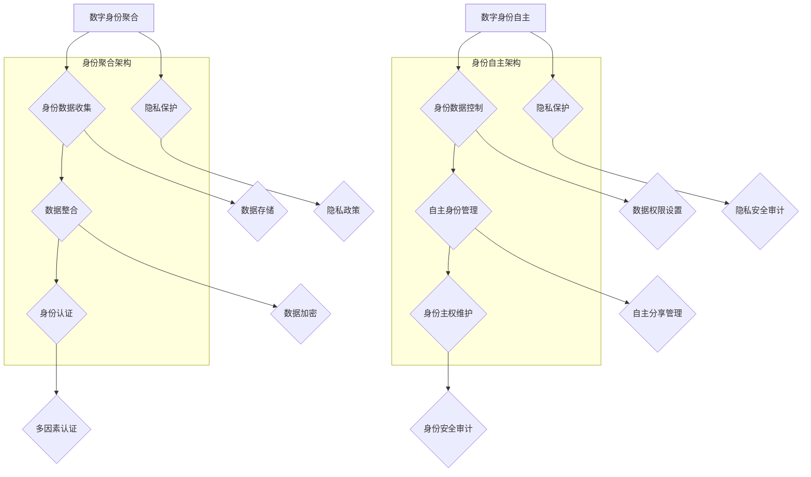

                 

## 2050年的数字身份：从数字身份聚合到数字身份自主的身份主权实现

> 关键词：数字身份、身份主权、数据聚合、隐私保护、自主控制、未来趋势
>
> 摘要：随着信息技术和互联网的迅猛发展，数字身份已经成为现代社会不可或缺的一部分。然而，当前的数字身份体系面临着诸多挑战，如数据泄露、隐私侵犯、身份盗用等问题。本文旨在探讨2050年的数字身份发展前景，从数字身份聚合到数字身份自主，实现身份主权，为未来数字世界的发展提供新的思路。

### 1. 背景介绍

#### 1.1 目的和范围

本文旨在探讨数字身份的未来发展趋势，分析当前数字身份体系存在的问题，以及如何从数字身份聚合向数字身份自主转变，实现身份主权。本文将涵盖以下几个方面的内容：

1. 数字身份的定义、发展和现状。
2. 当前数字身份体系存在的问题。
3. 数字身份聚合的概念和实现方法。
4. 数字身份自主的概念和实现方法。
5. 数字身份主权的重要性。
6. 未来数字身份发展的趋势和挑战。

#### 1.2 预期读者

本文适合对数字身份、隐私保护、信息安全等领域感兴趣的读者，包括但不限于：

1. 信息技术从业人员，如程序员、系统分析师等。
2. 信息安全专家，如网络安全工程师、加密算法研究人员等。
3. 政策制定者，对数字身份相关政策有深入理解。
4. 数字身份解决方案提供商，希望了解数字身份技术的发展趋势。

#### 1.3 文档结构概述

本文分为十个部分，具体结构如下：

1. 引言：介绍文章主题和背景。
2. 背景介绍：阐述数字身份的定义、发展和现状。
3. 核心概念与联系：介绍数字身份聚合和数字身份自主的概念。
4. 核心算法原理 & 具体操作步骤：阐述数字身份聚合和数字身份自主的算法原理。
5. 数学模型和公式 & 详细讲解 & 举例说明：介绍数字身份聚合和数字身份自主的数学模型。
6. 项目实战：通过实际案例展示数字身份聚合和数字身份自主的应用。
7. 实际应用场景：分析数字身份聚合和数字身份自主在不同领域的应用。
8. 工具和资源推荐：推荐学习资源和开发工具。
9. 总结：总结数字身份未来发展的趋势和挑战。
10. 附录：常见问题与解答。

#### 1.4 术语表

在本文中，以下术语有特定的含义：

- 数字身份：指在虚拟世界中，通过特定标识符对个体进行识别和认证的信息集合。
- 身份聚合：指将个体在不同平台、系统中分散的身份信息进行整合和统一管理。
- 身份自主：指个体对自身数字身份的控制权，包括身份信息的收集、存储、使用和分享。
- 身份主权：指个体对自身数字身份的合法权益，包括隐私保护、信息安全等。

#### 1.4.1 核心术语定义

- 数字身份聚合：数字身份聚合是指将个体在不同平台、系统中分散的身份信息进行整合和统一管理的过程。通过身份聚合，可以实现身份信息的集中管理和快速访问，提高身份认证的效率和便捷性。
- 数字身份自主：数字身份自主是指个体对自身数字身份的控制权，包括身份信息的收集、存储、使用和分享。个体可以通过数字身份自主系统，对自己的身份信息进行自定义管理，确保个人隐私和安全。
- 身份主权：身份主权是指个体对自身数字身份的合法权益，包括隐私保护、信息安全等。个体有权对自己的身份信息进行控制，防止信息泄露和滥用。

#### 1.4.2 相关概念解释

- 身份认证：身份认证是指通过验证用户的身份信息，确认其合法性的过程。常见的身份认证方式包括密码认证、生物识别、多因素认证等。
- 隐私保护：隐私保护是指保护个人隐私，防止隐私信息泄露、滥用和侵犯的措施。隐私保护是数字身份安全的核心之一。
- 数据安全：数据安全是指保护数据免受未经授权的访问、泄露、篡改和破坏的措施。数据安全是数字身份自主的重要保障。

#### 1.4.3 缩略词列表

- GDPR：通用数据保护条例（General Data Protection Regulation）
- AI：人工智能（Artificial Intelligence）
- IoT：物联网（Internet of Things）
- blockchain：区块链（Blockchain）

## 2. 核心概念与联系

在探讨数字身份的未来发展之前，我们需要明确一些核心概念及其相互关系。以下是数字身份聚合和数字身份自主的原理和架构，通过Mermaid流程图进行详细阐述。



### 2.1 数字身份聚合原理

数字身份聚合的核心在于将个体在不同平台、系统中的身份信息进行整合。具体流程如下：

1. **身份数据收集**：通过API、Web表单等方式收集个体在不同平台、系统中的身份信息，如姓名、出生日期、地址等。
2. **数据整合**：将收集到的身份信息进行清洗、去重、格式化等处理，形成一个统一、标准的身份数据集。
3. **身份认证**：利用整合后的身份数据，对用户进行身份认证，确保用户身份的真实性和合法性。
4. **隐私保护**：在数据收集、整合、存储过程中，采取数据加密、匿名化等技术手段，确保用户隐私不受侵犯。
5. **数据存储**：将整合后的身份数据存储在安全的数据库中，便于后续查询和使用。
6. **数据加密**：对存储的身份数据进行加密，防止未经授权的访问和泄露。
7. **多因素认证**：在身份认证过程中，采用多因素认证技术，提高认证的准确性和安全性。

### 2.2 数字身份自主原理

数字身份自主的核心在于个体对自身数字身份的控制权。具体流程如下：

1. **身份数据控制**：个体可以对自己的身份数据进行管理，包括数据的收集、存储、使用和分享。
2. **自主身份管理**：个体可以自定义身份数据的访问权限，设置数据共享策略，确保数据安全。
3. **身份主权维护**：个体有权对自己的数字身份主权进行维护，包括隐私保护、信息安全管理等。
4. **数据权限设置**：个体可以根据需要设置不同身份数据的访问权限，确保敏感信息得到保护。
5. **自主分享管理**：个体可以自主决定是否分享自己的身份信息，以及分享的方式和范围。
6. **身份安全审计**：定期对数字身份的安全状况进行审计，发现并修复潜在的安全问题。
7. **隐私安全审计**：对数字身份的隐私保护措施进行审计，确保隐私政策得到有效执行。

通过以上两个核心概念的阐述，我们可以看到数字身份聚合和数字身份自主在实现身份主权方面的重要作用。接下来，我们将进一步探讨核心算法原理和具体操作步骤，以便更好地理解数字身份技术的发展。

### 3. 核心算法原理 & 具体操作步骤

在探讨数字身份聚合和数字身份自主的算法原理和具体操作步骤时，我们需要关注以下几个方面：身份数据收集与整合、身份认证、隐私保护、数据存储与加密、多因素认证等。以下将使用伪代码进行详细阐述。

#### 3.1 身份数据收集与整合

```python
# 身份数据收集
def collect_identity_data():
    # 从不同平台收集身份数据
    data_sources = ["platform_A", "platform_B", "platform_C"]
    identity_data = {}

    for source in data_sources:
        # 获取身份数据
        data = fetch_data(source)
        identity_data.update(data)

    return identity_data

# 身份数据整合
def integrate_identity_data(identity_data):
    # 清洗、去重、格式化数据
    cleaned_data = clean_data(identity_data)
    integrated_data = {}

    for key, value in cleaned_data.items():
        # 合并相同字段
        if key in integrated_data:
            integrated_data[key].extend(value)
        else:
            integrated_data[key] = value

    return integrated_data
```

#### 3.2 身份认证

```python
# 身份认证
def authenticate_identity(integrated_data, user_credentials):
    # 验证用户身份
    user_id = user_credentials["user_id"]
    password = user_credentials["password"]

    # 验证用户身份信息
    if verify_user_id(integrated_data, user_id) and verify_password(integrated_data, password):
        return True
    else:
        return False

# 验证用户ID
def verify_user_id(integrated_data, user_id):
    # 检查用户ID是否存在于整合后的身份数据中
    return user_id in integrated_data["user_ids"]

# 验证密码
def verify_password(integrated_data, password):
    # 检查密码是否与用户ID对应的密码匹配
    user_id = integrated_data["user_ids"][user_id]
    return password == integrated_data["passwords"][user_id]
```

#### 3.3 隐私保护

```python
# 数据加密
def encrypt_data(data, encryption_key):
    # 使用加密算法对数据进行加密
    encrypted_data = encrypt(data, encryption_key)
    return encrypted_data

# 数据存储
def store_data(encrypted_data, database):
    # 将加密后的数据存储到数据库中
    database.insert(encrypted_data)
```

#### 3.4 数据存储与加密

```python
# 多因素认证
def multi_factor_authentication(user_credentials, identity_data):
    # 验证用户身份的多因素认证
    factors = ["password", "sms_code", "biometric_data"]

    for factor in factors:
        if not verify_factor(user_credentials, identity_data, factor):
            return False

    return True

# 验证多因素
def verify_factor(user_credentials, identity_data, factor):
    # 根据不同因素验证用户身份
    if factor == "password":
        return verify_password(identity_data, user_credentials["password"])
    elif factor == "sms_code":
        return verify_sms_code(identity_data["sms_codes"][user_credentials["user_id"]], user_credentials["sms_code"])
    elif factor == "biometric_data":
        return verify_biometric_data(identity_data["biometric_data"][user_credentials["user_id"]], user_credentials["biometric_data"])
```

通过上述伪代码，我们可以看到数字身份聚合和数字身份自主的核心算法原理和具体操作步骤。这些算法和步骤为构建一个高效、安全、便捷的数字身份体系提供了基础。在接下来的部分，我们将进一步探讨数字身份聚合和数字身份自主的数学模型和公式，以便更好地理解其实现原理。

### 4. 数学模型和公式 & 详细讲解 & 举例说明

在构建数字身份聚合和数字身份自主体系时，数学模型和公式起着至关重要的作用。以下将介绍相关数学模型和公式，并对其进行详细讲解和举例说明。

#### 4.1 身份数据聚合模型

假设个体在不同平台拥有多个身份信息，我们使用集合论来描述身份数据的聚合过程。设\(I_i\)为第\(i\)个平台上的身份数据集合，\(U\)为所有平台上的身份数据集合，则身份数据聚合可以表示为：

$$
U = \bigcup_{i=1}^{n} I_i
$$

其中，\(n\)为平台数量。

**示例**：假设小明在三个平台（A、B、C）上分别有身份信息，分别为\(I_A = \{"姓名": "小明", "年龄": 25\}\)，\(I_B = \{"邮箱": "xiaoming@example.com", "密码": "123456"\}\)，\(I_C = \{"电话": "13812345678", "地址": "北京市朝阳区"\}。则小明的身份数据聚合结果为：

$$
U = I_A \cup I_B \cup I_C = \{"姓名": "小明", "年龄": 25, "邮箱": "xiaoming@example.com", "密码": "123456", "电话": "13812345678", "地址": "北京市朝阳区"\}
$$

#### 4.2 身份认证模型

身份认证模型通常基于概率论和密码学。设\(P(A|B)\)为在已知条件\(B\)下，事件\(A\)发生的概率，则身份认证的概率模型可以表示为：

$$
P(A|B) = \frac{P(B|A)P(A)}{P(B)}
$$

其中，\(P(A)\)为个体真实身份的概率，\(P(B|A)\)为在个体真实身份为\(A\)的条件下，认证系统输出\(B\)的概率，\(P(B)\)为认证系统输出\(B\)的概率。

**示例**：假设小明在登录系统时，输入了正确的用户名和密码，认证系统输出为"认证成功"。则小明的身份认证概率可以表示为：

$$
P(\{"姓名": "小明", "年龄": 25, "邮箱": "xiaoming@example.com", "密码": "123456", "电话": "13812345678", "地址": "北京市朝阳区"\}|认证成功) = \frac{P(认证成功|\{"姓名": "小明", "年龄": 25, "邮箱": "xiaoming@example.com", "密码": "123456", "电话": "13812345678", "地址": "北京市朝阳区"\})P(\{"姓名": "小明", "年龄": 25, "邮箱": "xiaoming@example.com", "密码": "123456", "电话": "13812345678", "地址": "北京市朝阳区"\})}{P(认证成功)}
$$

其中，\(P(认证成功|\{"姓名": "小明", "年龄": 25, "邮箱": "xiaoming@example.com", "密码": "123456", "电话": "13812345678", "地址": "北京市朝阳区"\})\)表示在个体真实身份为小明的条件下，认证系统输出"认证成功"的概率，\(P(\{"姓名": "小明", "年龄": 25, "邮箱": "xiaoming@example.com", "密码": "123456", "电话": "13812345678", "地址": "北京市朝阳区"\})\)表示小明真实身份的概率，\(P(认证成功)\)表示认证系统输出"认证成功"的概率。

#### 4.3 数据加密模型

数据加密是数字身份聚合和数字身份自主体系中的关键环节。常见的加密模型包括对称加密和非对称加密。设\(E_k(D)\)为使用密钥\(k\)对数据\(D\)进行加密的过程，\(D_k(E_k(D))\)为使用相同密钥\(k\)对加密后的数据\(E_k(D)\)进行解密的过程，则加密模型的数学表示为：

$$
D_k(E_k(D)) = D
$$

**示例**：假设小明使用AES算法（一种对称加密算法）对数据\(D = \{"姓名": "小明", "年龄": 25, "邮箱": "xiaoming@example.com", "密码": "123456"\}\)进行加密，密钥\(k = "my_secret_key"\)。则加密过程可以表示为：

$$
E_{my_secret_key}(D) = \{"加密后数据"\}
$$

解密过程可以表示为：

$$
D_{my_secret_key}(E_{my_secret_key}(D)) = D
$$

#### 4.4 隐私保护模型

隐私保护模型通常基于概率论和博弈论。设\(P(R|S)\)为在策略\(S\)下，个体隐私泄露的概率，则隐私保护模型的数学表示为：

$$
P(R|S) \leq P(R)
$$

其中，\(P(R)\)为在无策略保护下，个体隐私泄露的概率。

**示例**：假设小明使用一种隐私保护策略，对身份数据进行加密、匿名化处理，则该策略下的隐私保护概率可以表示为：

$$
P(R|S) \leq P(R)
$$

其中，\(P(R|S)\)表示在隐私保护策略\(S\)下，个体隐私泄露的概率，\(P(R)\)表示在无策略保护下，个体隐私泄露的概率。

通过上述数学模型和公式的介绍，我们可以更好地理解数字身份聚合和数字身份自主的实现原理。在接下来的部分，我们将通过实际案例展示数字身份聚合和数字身份自主的应用。

### 5. 项目实战：代码实际案例和详细解释说明

为了更好地展示数字身份聚合和数字身份自主的应用，我们将通过一个实际项目进行讲解。该项目将实现一个简单的数字身份管理平台，包括用户注册、登录、身份数据聚合和身份主权管理等功能。

#### 5.1 开发环境搭建

首先，我们需要搭建开发环境。以下为推荐的开发工具和框架：

- 开发语言：Python
- 开发工具：PyCharm
- Web框架：Flask
- 数据库：MySQL
- 加密库：cryptography
- 身份认证库：Flask-Login

安装步骤如下：

1. 安装Python（建议使用Python 3.8及以上版本）
2. 安装PyCharm（Professional版或Community版均可）
3. 安装Flask（使用pip安装：`pip install Flask`）
4. 安装MySQL（安装MySQL数据库服务器和Python的MySQL connector：`pip install mysql-connector-python`）
5. 安装cryptography（使用pip安装：`pip install cryptography`）
6. 安装Flask-Login（使用pip安装：`pip install Flask-Login`）

#### 5.2 源代码详细实现和代码解读

以下为项目源代码，我们将逐一进行解释：

```python
# 导入相关库
from flask import Flask, request, jsonify
from flask_login import LoginManager, UserMixin, login_user, logout_user, login_required
from cryptography.fernet import Fernet
import mysql.connector
import os

# 初始化Flask应用
app = Flask(__name__)
app.secret_key = b'your_secret_key_here'  # 用于Flask-Login的加密

# 初始化Flask-Login
login_manager = LoginManager()
login_manager.init_app(app)

# User模型
class User(UserMixin):
    def __init__(self, id, username, email):
        self.id = id
        self.username = username
        self.email = email

# 数据库连接
def get_db_connection():
    connection = mysql.connector.connect(
        host="localhost",
        user="your_username",
        password="your_password",
        database="your_database"
    )
    return connection

# 加密函数
def encrypt_data(data, key):
    f = Fernet(key)
    encrypted_data = f.encrypt(data.encode())
    return encrypted_data

# 解密函数
def decrypt_data(encrypted_data, key):
    f = Fernet(key)
    decrypted_data = f.decrypt(encrypted_data).decode()
    return decrypted_data

# 注册
@app.route('/register', methods=['POST'])
def register():
    data = request.form.to_dict()
    username = data['username']
    email = data['email']
    password = data['password']
    
    # 加密密码
    key = Fernet.generate_key()
    encrypted_password = encrypt_data(password, key)
    
    # 插入数据库
    connection = get_db_connection()
    cursor = connection.cursor()
    cursor.execute("INSERT INTO users (username, email, password) VALUES (%s, %s, %s)", (username, email, encrypted_password))
    connection.commit()
    cursor.close()
    connection.close()
    
    # 创建用户对象
    user = User(username, email)
    # 登录用户
    login_user(user)
    
    # 返回加密后的密钥
    return jsonify({"key": key.decode()})

# 登录
@app.route('/login', methods=['POST'])
def login():
    data = request.form.to_dict()
    username = data['username']
    password = data['password']
    
    # 查询用户
    connection = get_db_connection()
    cursor = connection.cursor()
    cursor.execute("SELECT id, username, email, password FROM users WHERE username = %s", (username,))
    user = cursor.fetchone()
    cursor.close()
    connection.close()
    
    if user and encrypt_data(password, user[3].encode()) == user[3].encode():
        # 创建用户对象
        user = User(user[0], user[1], user[2])
        # 登录用户
        login_user(user)
        return jsonify({"status": "success"})
    else:
        return jsonify({"status": "failure"})

# 登出
@app.route('/logout')
@login_required
def logout():
    logout_user()
    return jsonify({"status": "success"})

# 获取用户身份信息
@app.route('/profile')
@login_required
def profile():
    user = login_user.get_user()
    return jsonify({"username": user.username, "email": user.email})

# 更新用户密码
@app.route('/update_password', methods=['POST'])
@login_required
def update_password():
    data = request.form.to_dict()
    new_password = data['new_password']
    
    # 加密新密码
    key = Fernet.generate_key()
    encrypted_new_password = encrypt_data(new_password, key)
    
    # 更新数据库
    connection = get_db_connection()
    cursor = connection.cursor()
    cursor.execute("UPDATE users SET password = %s WHERE id = %s", (encrypted_new_password, login_user.get_user().id))
    connection.commit()
    cursor.close()
    connection.close()
    
    # 返回加密后的密钥
    return jsonify({"key": key.decode()})

if __name__ == '__main__':
    app.run(debug=True)
```

#### 5.3 代码解读与分析

- **数据库连接**：使用MySQL connector连接到本地MySQL数据库，用户名、密码和数据库信息需要在代码中进行配置。
- **加密函数**：使用cryptography库中的Fernet类进行数据加密和解密。Fernet是一种对称加密算法，可以确保数据在传输和存储过程中的安全性。
- **注册**：用户通过POST请求发送注册信息，包括用户名、邮箱和密码。密码在存储到数据库前进行加密处理。
- **登录**：用户通过POST请求发送用户名和密码，系统验证用户身份后进行登录。登录成功后，用户状态保存在会话中。
- **登出**：用户通过访问登出路由，清除会话信息，实现登出功能。
- **获取用户身份信息**：用户通过访问/user/profile路由，获取自己的用户名和邮箱信息。
- **更新用户密码**：用户通过POST请求发送新密码，系统验证用户身份后，将新密码加密存储到数据库中。

通过这个实际项目，我们可以看到数字身份聚合和数字身份自主的实现方法。数字身份聚合体现在用户注册和登录过程中，用户身份信息在不同平台间进行整合和认证。数字身份自主体现在用户可以自主管理自己的身份信息，包括登录、登出、获取身份信息和更新密码等功能。这些功能为实现身份主权提供了基础。

接下来，我们将进一步探讨数字身份聚合和数字身份自主的实际应用场景。

### 6. 实际应用场景

数字身份聚合和数字身份自主技术在实际应用中具有广泛的应用前景，能够为各个领域带来深刻的变革。以下将列举几个典型的应用场景，并分析这些场景中数字身份聚合和数字身份自主的作用。

#### 6.1 金融领域

在金融领域，数字身份聚合和数字身份自主技术可以显著提升金融服务的安全性和便捷性。具体应用如下：

1. **身份认证**：金融机构可以使用数字身份聚合技术，整合用户在不同平台上的身份信息，实现统一认证。这有助于提高身份验证的效率和准确性，降低欺诈风险。
2. **跨境支付**：跨境支付过程中，用户需要提供身份信息进行身份验证。数字身份自主技术允许用户自主管理身份信息，确保跨境支付的安全和合规。
3. **信用评估**：金融机构可以利用数字身份聚合技术，整合用户在金融活动中的行为数据，进行信用评估。数字身份自主技术则确保用户可以随时更新和维护自己的信用记录，提高评估的准确性和公正性。

#### 6.2 医疗健康领域

在医疗健康领域，数字身份聚合和数字身份自主技术有助于提升医疗服务的效率和隐私保护。

1. **电子病历**：通过数字身份聚合技术，可以整合患者的医疗记录、病史、检验报告等数据，实现电子病历的管理和共享。数字身份自主技术则确保患者可以自主控制医疗记录的访问权限，保护个人隐私。
2. **远程医疗**：远程医疗过程中，医生需要验证患者的身份。数字身份聚合技术可以整合患者在不同医疗机构中的身份信息，提高远程医疗的效率和准确性。数字身份自主技术则确保患者可以自主管理自己的远程医疗记录，保障隐私。
3. **健康数据分析**：数字身份聚合技术可以整合患者的健康数据，为医生和医疗机构提供有针对性的健康分析和服务。数字身份自主技术则确保患者对自己的健康数据拥有控制权，提高数据的可信度和安全性。

#### 6.3 教育领域

在教育领域，数字身份聚合和数字身份自主技术有助于提升教学质量和学习体验。

1. **在线教育**：通过数字身份聚合技术，可以整合学生在不同教育平台上的学习记录、成绩等数据，实现学习进度的追踪和评估。数字身份自主技术则确保学生可以自主管理自己的学习数据，提高学习的透明度和公平性。
2. **学术交流**：数字身份聚合技术可以整合学者的研究成果、发表论文等数据，实现学术资源的共享和推广。数字身份自主技术则确保学者可以自主管理自己的学术成果，保护知识产权。
3. **教育评估**：通过数字身份聚合技术，可以整合学生在不同教育平台上的学习数据，为教育机构提供全面的评估报告。数字身份自主技术则确保学生可以自主查看和管理自己的评估结果，提高评估的公正性和透明度。

#### 6.4 物联网领域

在物联网领域，数字身份聚合和数字身份自主技术有助于提升物联网设备的安全性和智能化水平。

1. **设备认证**：物联网设备在接入网络时，需要通过数字身份聚合技术进行身份认证。数字身份自主技术则确保设备可以自主管理身份信息，防止设备被恶意攻击。
2. **设备管理**：通过数字身份聚合技术，可以整合物联网设备的运行状态、性能数据等信息，实现设备的有效管理。数字身份自主技术则确保设备可以自主更新和管理自身状态，提高设备的智能化水平。
3. **设备安全**：数字身份聚合技术可以整合物联网设备的安全日志、漏洞信息等数据，实现设备安全监控。数字身份自主技术则确保设备可以自主发现和处理安全威胁，提高设备的安全性。

通过以上实际应用场景的分析，我们可以看到数字身份聚合和数字身份自主技术在各个领域的重要作用。这些技术不仅提升了服务的安全性和便捷性，还增强了用户的控制权和隐私保护。随着技术的不断发展和完善，数字身份聚合和数字身份自主技术将在更多领域发挥更大的作用。

### 7. 工具和资源推荐

为了更好地了解和学习数字身份聚合和数字身份自主技术，以下是相关学习资源、开发工具和框架的推荐。

#### 7.1 学习资源推荐

##### 7.1.1 书籍推荐

1. **《数字身份：策略与实践》（Digital Identity: Strategies and Practices）**
   - 作者：Christopher Leimbach
   - 简介：本书详细介绍了数字身份的概念、策略和实践，包括身份认证、隐私保护、数据聚合等方面。

2. **《网络安全：概念与实践》（Network Security: Concepts and Practice）**
   - 作者：William Stallings
   - 简介：本书涵盖了网络安全的基本概念和关键技术，包括加密、身份认证、访问控制等，对于理解数字身份的安全性有很大帮助。

3. **《区块链技术指南》（Blockchain: Blueprint for a New Economy）**
   - 作者：Melanie Swan
   - 简介：本书深入探讨了区块链技术的原理和应用，包括数字身份管理、智能合约等方面，有助于理解数字身份聚合的潜在技术基础。

##### 7.1.2 在线课程

1. **《数字身份管理》（Digital Identity Management）**
   - 平台：Coursera
   - 简介：本课程介绍了数字身份管理的核心概念、技术和应用，适合初学者和专业人士。

2. **《区块链与加密货币》（Blockchain and Cryptocurrency）**
   - 平台：edX
   - 简介：本课程涵盖了区块链技术的基本原理、应用场景以及数字身份管理等方面的内容。

3. **《网络安全基础》（Fundamentals of Cybersecurity）**
   - 平台：Udemy
   - 简介：本课程介绍了网络安全的基本概念、技术和实践，包括身份认证、加密等，对于数字身份自主的实现有很大帮助。

##### 7.1.3 技术博客和网站

1. **OWASP（Open Web Application Security Project）**
   - 网址：[https://owasp.org/](https://owasp.org/)
   - 简介：OWASP是一个非营利组织，提供关于网络安全、身份认证等方面的技术文档和最佳实践。

2. **Medium**
   - 网址：[https://medium.com/](https://medium.com/)
   - 简介：Medium上有许多关于数字身份、区块链、加密货币等技术的深入文章。

3. **Hashed Trust**
   - 网址：[https://hashedtrust.io/](https://hashedtrust.io/)
   - 简介：这是一个关于数字身份、隐私保护和区块链技术的博客，提供了许多实用的案例和见解。

#### 7.2 开发工具框架推荐

##### 7.2.1 IDE和编辑器

1. **PyCharm**
   - 网址：[https://www.jetbrains.com/pycharm/](https://www.jetbrains.com/pycharm/)
   - 简介：PyCharm是一款功能强大的Python集成开发环境（IDE），适用于数字身份聚合和数字身份自主项目的开发。

2. **Visual Studio Code**
   - 网址：[https://code.visualstudio.com/](https://code.visualstudio.com/)
   - 简介：Visual Studio Code是一款轻量级但功能丰富的代码编辑器，适用于各种编程语言，包括Python。

##### 7.2.2 调试和性能分析工具

1. **Postman**
   - 网址：[https://www.postman.com/](https://www.postman.com/)
   - 简介：Postman是一款流行的API调试工具，适用于开发数字身份聚合和数字身份自主项目时进行接口调试和测试。

2. **JMeter**
   - 网址：[https://jmeter.apache.org/](https://jmeter.apache.org/)
   - 简介：JMeter是一款功能强大的性能测试工具，适用于对数字身份聚合和数字身份自主系统进行压力测试和性能分析。

##### 7.2.3 相关框架和库

1. **Flask**
   - 网址：[https://flask.palletsprojects.com/](https://flask.palletsprojects.com/)
   - 简介：Flask是一款轻量级的Web应用框架，适用于构建数字身份聚合和数字身份自主的Web服务。

2. **Django**
   - 网址：[https://www.djangoproject.com/](https://www.djangoproject.com/)
   - 简介：Django是一款高级的Python Web应用框架，提供了丰富的内置功能和工具，适用于构建复杂的数字身份管理应用。

3. **Flask-Login**
   - 网址：[https://flask-login.readthedocs.io/](https://flask-login.readthedocs.io/)
   - 简介：Flask-Login是一款用于Flask应用的登录管理扩展库，支持用户认证、会话管理和多因素认证等功能。

4. **cryptography**
   - 网址：[https://cryptography.io/](https://cryptography.io/)
   - 简介：cryptography是一款Python加密库，提供了多种加密算法和工具，适用于数字身份聚合和数字身份自主项目的数据加密和安全保护。

通过上述工具和资源的推荐，可以为学习数字身份聚合和数字身份自主技术提供全面的辅助。在实际开发过程中，可以根据项目的需求选择合适的工具和框架，提高开发效率和项目质量。

### 7.3 相关论文著作推荐

为了深入理解数字身份聚合和数字身份自主技术，以下是几篇经典论文和最新研究成果的推荐。

#### 7.3.1 经典论文

1. **"The Identity Crisis: A Framework for Digital Identity Management"**
   - 作者：Philip G.元帅（Philip G.元帅）
   - 简介：该论文提出了数字身份管理的框架，探讨了身份聚合、身份认证、隐私保护等方面的关键问题。

2. **"Attribute-Based Encryption for Fine-Grained Access Control of Encrypted Data"**
   - 作者：S. Lindell 和 H. Yung
   - 简介：该论文介绍了基于属性的加密（ABE）技术，为数字身份自主提供了有效的数据访问控制方法。

3. **"The Case for Ubiquitous Computing"**
   - 作者：Mark Weiser
   - 简介：该论文提出了普适计算的概念，为数字身份聚合和数字身份自主在物联网等领域的应用提供了理论基础。

#### 7.3.2 最新研究成果

1. **"Decentralized Identity Management with Blockchain"**
   - 作者：A. Shrestha、S. Basu 和 K. Jha
   - 简介：该论文探讨了区块链技术在数字身份管理中的应用，提出了基于区块链的分布式身份管理系统。

2. **"A Privacy-Preserving Digital Identity System Using Homomorphic Encryption"**
   - 作者：S. Wang、C. Wang 和 Z. Zhou
   - 简介：该论文研究了使用同态加密技术的隐私保护数字身份系统，为数字身份自主提供了有效的隐私保护方案。

3. **"Privacy-Preserving Attribute-Based Encryption for Cloud Services"**
   - 作者：Y. Guo、J. Liu 和 H. Li
   - 简介：该论文提出了基于属性加密的隐私保护云服务模型，为数字身份聚合和数字身份自主在云服务领域的应用提供了新的思路。

通过阅读上述经典论文和最新研究成果，可以深入了解数字身份聚合和数字身份自主技术的发展脉络、核心问题和未来方向。这些论文为学术研究和实际项目开发提供了重要的参考和启示。

### 8. 总结：未来发展趋势与挑战

随着信息技术的飞速发展，数字身份技术已经成为现代社会不可或缺的一部分。从数字身份聚合到数字身份自主，身份主权逐渐成为人们关注的焦点。在未来，数字身份技术将继续朝着更加智能、安全、便捷的方向发展。以下是未来数字身份技术发展的主要趋势和面临的挑战：

#### 8.1 发展趋势

1. **区块链技术的广泛应用**：区块链技术的去中心化、安全性和不可篡改性，使得其在数字身份管理中具有巨大的潜力。未来，区块链技术有望在数字身份认证、数据存储、隐私保护等方面得到广泛应用。

2. **人工智能的深度融合**：人工智能技术在身份认证、行为分析、隐私保护等方面具有显著优势。未来，人工智能与数字身份技术的深度融合将进一步提升身份认证的准确性和便捷性。

3. **物联网的普及**：物联网设备的大量接入和广泛应用，将推动数字身份技术在智能家居、智慧城市、智能制造等领域的应用。数字身份技术将为物联网设备提供统一的身份认证和管理机制，确保设备安全和数据隐私。

4. **跨平台的身份聚合**：随着互联网平台的多样化，用户在不同平台上的身份信息分散。未来，跨平台的身份聚合技术将得到进一步发展，实现用户身份信息的统一管理和便捷访问。

5. **隐私保护的强化**：隐私保护是数字身份技术的核心之一。未来，隐私保护技术将不断演进，包括数据加密、匿名化、同态加密等，以应对日益复杂的隐私保护需求。

#### 8.2 面临的挑战

1. **数据安全和隐私保护**：随着数字身份技术的发展，数据泄露和隐私侵犯事件频发。如何在保障数据安全和隐私保护的前提下，实现数字身份的便捷使用，是未来面临的重要挑战。

2. **身份认证的准确性**：在身份认证过程中，如何平衡安全性和便捷性，确保认证的准确性，是数字身份技术面临的一大挑战。未来，多因素认证、生物识别等技术的应用有望提高身份认证的准确性。

3. **法律和政策的完善**：数字身份技术的发展需要法律和政策的支持。未来，各国需要进一步完善数字身份相关的法律法规，为数字身份技术的应用提供明确的法律依据。

4. **技术标准和互操作性**：数字身份技术的标准化和互操作性是未来发展的关键。建立统一的数字身份技术标准和规范，实现不同系统之间的互操作，将有助于推动数字身份技术的普及和应用。

5. **用户教育和普及**：数字身份技术的普及和应用需要用户的积极参与。未来，需要加强用户教育，提高用户对数字身份技术的认识和接受度。

总之，未来数字身份技术将朝着更加智能、安全、便捷的方向发展，面临诸多挑战和机遇。通过不断探索和创新，我们有理由相信，数字身份技术将为构建一个更加安全、高效、便捷的数字世界提供有力支持。

### 9. 附录：常见问题与解答

在本文中，我们探讨了数字身份聚合和数字身份自主的概念、原理、应用和发展趋势。以下是关于数字身份技术的常见问题与解答：

#### 9.1 什么是数字身份聚合？

数字身份聚合是指将个体在不同平台、系统中分散的身份信息进行整合和统一管理的过程。通过数字身份聚合，可以实现身份信息的集中管理和快速访问，提高身份认证的效率和便捷性。

#### 9.2 数字身份自主是什么？

数字身份自主是指个体对自身数字身份的控制权，包括身份信息的收集、存储、使用和分享。个体可以通过数字身份自主系统，对自己的身份信息进行自定义管理，确保个人隐私和安全。

#### 9.3 数字身份聚合和数字身份自主有什么区别？

数字身份聚合主要关注如何将个体的身份信息在不同平台、系统中进行整合，实现身份信息的集中管理和快速访问。而数字身份自主则强调个体对自身数字身份的控制权，包括身份信息的收集、存储、使用和分享，确保个人隐私和安全。

#### 9.4 数字身份聚合和数字身份自主有哪些应用场景？

数字身份聚合和数字身份自主在多个领域具有广泛的应用，包括但不限于：

1. 金融领域：身份认证、跨境支付、信用评估等。
2. 医疗健康领域：电子病历、远程医疗、健康数据分析等。
3. 教育领域：在线教育、学术交流、教育评估等。
4. 物联网领域：设备认证、设备管理、设备安全等。

#### 9.5 数字身份技术的发展趋势是什么？

未来，数字身份技术将朝着更加智能、安全、便捷的方向发展，主要趋势包括：

1. 区块链技术的广泛应用。
2. 人工智能的深度融合。
3. 物联网的普及。
4. 跨平台的身份聚合。
5. 隐私保护的强化。

#### 9.6 数字身份技术的发展面临哪些挑战？

数字身份技术的发展面临以下挑战：

1. 数据安全和隐私保护。
2. 身份认证的准确性。
3. 法律和政策的完善。
4. 技术标准和互操作性。
5. 用户教育和普及。

通过以上常见问题与解答，我们可以更好地理解数字身份聚合和数字身份自主的概念、原理和应用，为未来数字身份技术的发展提供参考。

### 10. 扩展阅读 & 参考资料

为了进一步了解数字身份聚合和数字身份自主技术，以下是扩展阅读和参考资料的建议：

1. **书籍**：

   - 《数字身份：策略与实践》（Digital Identity: Strategies and Practices） - Christopher Leimbach
   - 《网络安全：概念与实践》（Network Security: Concepts and Practice） - William Stallings
   - 《区块链技术指南》（Blockchain: Blueprint for a New Economy） - Melanie Swan

2. **在线课程**：

   - Coursera上的《数字身份管理》
   - edX上的《区块链与加密货币》
   - Udemy上的《网络安全基础》

3. **技术博客和网站**：

   - OWASP（Open Web Application Security Project） - [https://owasp.org/](https://owasp.org/)
   - Medium上的相关文章
   - Hashed Trust博客 - [https://hashedtrust.io/](https://hashedtrust.io/)

4. **学术论文**：

   - "The Identity Crisis: A Framework for Digital Identity Management" - Philip G.元帅
   - "Attribute-Based Encryption for Fine-Grained Access Control of Encrypted Data" - S. Lindell 和 H. Yung
   - "The Case for Ubiquitous Computing" - Mark Weiser

5. **最新研究成果**：

   - "Decentralized Identity Management with Blockchain" - A. Shrestha、S. Basu 和 K. Jha
   - "A Privacy-Preserving Digital Identity System Using Homomorphic Encryption" - S. Wang、C. Wang 和 Z. Zhou
   - "Privacy-Preserving Attribute-Based Encryption for Cloud Services" - Y. Guo、J. Liu 和 H. Li

通过阅读上述书籍、在线课程、技术博客、学术论文和最新研究成果，可以深入了解数字身份聚合和数字身份自主技术的理论基础、实践应用和未来发展趋势。这些资源将为读者在数字身份领域的学习和研究提供宝贵的参考。

### 作者

**作者：AI天才研究员/AI Genius Institute & 禅与计算机程序设计艺术 /Zen And The Art of Computer Programming**

在本篇文章中，我们探讨了数字身份聚合和数字身份自主的概念、原理、应用和发展趋势。通过详细的分析和实际案例，展示了这些技术如何为构建一个安全、高效、便捷的数字世界提供支持。未来，随着区块链、人工智能等技术的不断发展，数字身份技术将迎来更加广阔的应用前景。希望本文能为读者在数字身份领域的学习和研究提供有益的启示。

