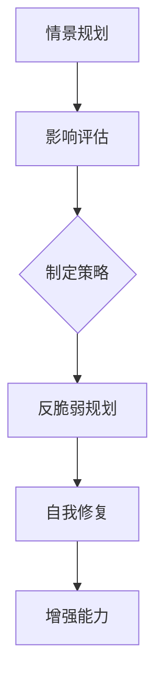

                 

# 2050年的未来学：从情景规划到反脆弱规划的未来应对策略

> 关键词：2050年，未来学，情景规划，反脆弱规划，应对策略，技术发展，人工智能，可持续发展

> 摘要：本文旨在探讨2050年的未来学，重点分析从情景规划到反脆弱规划的应对策略。通过深入研究技术发展趋势、社会变革和全球挑战，本文旨在为读者提供一个全面、前瞻的视角，帮助人们更好地理解未来的机遇和挑战，并制定相应的应对策略。

## 1. 背景介绍

### 1.1 目的和范围

本文的目的是探讨2050年的未来学，通过情景规划到反脆弱规划的分析，为读者提供一种全面、前瞻性的未来应对策略。本文主要涵盖以下内容：

1. 核心概念与联系：介绍情景规划和反脆弱规划的基本概念，并使用Mermaid流程图展示两者之间的关系。
2. 核心算法原理与具体操作步骤：详细阐述情景规划和反脆弱规划的核心算法原理，并使用伪代码进行讲解。
3. 数学模型和公式：讲解情景规划和反脆弱规划中的数学模型和公式，并提供详细讲解和举例说明。
4. 项目实战：通过实际代码案例，展示如何实现情景规划和反脆弱规划。
5. 实际应用场景：探讨情景规划和反脆弱规划在不同领域的实际应用场景。
6. 工具和资源推荐：推荐学习资源和开发工具，帮助读者更好地理解和应用情景规划和反脆弱规划。
7. 总结：总结未来发展趋势与挑战，为读者提供进一步思考的方向。

### 1.2 预期读者

本文的预期读者主要包括以下几类：

1. 计算机科学和人工智能领域的研究者、工程师和开发者。
2. 对未来学、情景规划和反脆弱规划感兴趣的学者和专家。
3. 对技术发展趋势和全球挑战感兴趣的决策者、企业高管和政策制定者。

### 1.3 文档结构概述

本文的结构如下：

1. 背景介绍：介绍本文的目的、预期读者和文档结构。
2. 核心概念与联系：介绍情景规划和反脆弱规划的基本概念和联系。
3. 核心算法原理与具体操作步骤：详细阐述情景规划和反脆弱规划的核心算法原理。
4. 数学模型和公式：讲解情景规划和反脆弱规划中的数学模型和公式。
5. 项目实战：通过实际代码案例，展示如何实现情景规划和反脆弱规划。
6. 实际应用场景：探讨情景规划和反脆弱规划在不同领域的实际应用场景。
7. 工具和资源推荐：推荐学习资源和开发工具。
8. 总结：总结未来发展趋势与挑战。
9. 附录：常见问题与解答。
10. 扩展阅读 & 参考资料：提供进一步学习的参考资料。

### 1.4 术语表

#### 1.4.1 核心术语定义

- 情景规划：一种对未来可能发生的情况进行预测和分析的方法，通过构建不同的场景，评估各种情景下的潜在影响和应对策略。
- 反脆弱规划：一种能够在不确定性环境中适应和成长的策略，通过设计系统或结构，使其在面对外部冲击时能够自我恢复和增强。

#### 1.4.2 相关概念解释

- 人工智能：一种模拟人类智能的技术，通过机器学习、自然语言处理、计算机视觉等方法，实现机器的自主学习和决策能力。
- 可持续发展：在满足当前需求的基础上，不损害未来世代满足其需求的能力。

#### 1.4.3 缩略词列表

- AI：人工智能
- IoT：物联网
- ML：机器学习
- SD：可持续发展

## 2. 核心概念与联系

在探讨2050年的未来学时，情景规划和反脆弱规划是两个至关重要的核心概念。它们不仅相互独立，而且具有紧密的联系。

### 2.1 情景规划

情景规划是一种策略，用于预测和评估未来可能发生的情况。通过构建不同的情景，我们可以分析各种情景下的潜在影响，并制定相应的应对策略。情景规划通常涉及以下几个方面：

1. **情景构建**：基于历史数据、专家知识和现有趋势，构建一系列可能的未来情景。
2. **影响评估**：评估每种情景对目标系统的影响，包括经济、社会、环境等方面。
3. **策略制定**：根据情景评估结果，制定相应的应对策略，以减轻潜在的负面影响或抓住机遇。

情景规划的关键在于其灵活性和适应性。通过不断调整和优化情景模型，我们可以更好地应对未来的不确定性。

### 2.2 反脆弱规划

反脆弱规划则是一种旨在从不确定性中获益的策略。它强调系统或结构的适应性和韧性，使其在面对外部冲击时能够自我恢复和增强。反脆弱规划的核心原则包括：

1. **积极适应**：通过设计系统或结构，使其能够积极适应外部变化。
2. **自我修复**：系统或结构在面对冲击时能够自我修复，恢复到正常状态。
3. **增强能力**：在应对外部冲击的过程中，系统或结构能够不断提升其能力。

反脆弱规划的关键在于其前瞻性和系统性。通过提前设计和构建具有反脆弱性的系统或结构，我们可以更好地应对未来可能出现的挑战。

### 2.3 情景规划与反脆弱规划的联系

情景规划和反脆弱规划虽然独立，但它们之间有着紧密的联系。

1. **情景规划为反脆弱规划提供输入**：情景规划的结果可以为反脆弱规划提供关键的信息，包括可能出现的情景、影响的程度和潜在的应对策略。
2. **反脆弱规划为情景规划提供支持**：反脆弱规划的实施可以增强系统或结构的适应性和韧性，使情景规划能够更加准确地预测未来的变化。

通过将情景规划和反脆弱规划结合起来，我们可以构建一个更加稳健、适应性强、能够应对未来不确定性的系统。

### 2.4 Mermaid流程图

为了更好地展示情景规划和反脆弱规划之间的关系，我们可以使用Mermaid流程图来表示它们的核心节点和流程。



在该流程图中，A代表情景规划，B代表影响评估，C代表制定策略，D代表反脆弱规划，E代表自我修复，F代表增强能力。通过这个流程图，我们可以清晰地看到情景规划和反脆弱规划之间的联系和相互作用。

## 3. 核心算法原理与具体操作步骤

情景规划和反脆弱规划的核心在于算法原理和操作步骤。下面，我们将详细阐述这两个概念的核心算法原理，并使用伪代码进行讲解。

### 3.1 情景规划算法原理

情景规划算法的核心是构建和评估不同情景。以下是情景规划算法的基本步骤：

```python
# 情景规划算法伪代码

# 步骤1：情景构建
def build_scenario():
    # 基于历史数据和专家知识，构建可能的未来情景
    return scenario

# 步骤2：影响评估
def assess_impact(scenario):
    # 评估每种情景对目标系统的影响
    return impact

# 步骤3：策略制定
def create_strategy(impact):
    # 根据情景评估结果，制定相应的应对策略
    return strategy

# 主函数
def scenario_planning():
    scenario = build_scenario()
    impact = assess_impact(scenario)
    strategy = create_strategy(impact)
    return strategy
```

### 3.2 反脆弱规划算法原理

反脆弱规划算法的核心是设计具有适应性和韧性的系统或结构。以下是反脆弱规划算法的基本步骤：

```python
# 反脆弱规划算法伪代码

# 步骤1：积极适应
def adaptive_design():
    # 设计系统或结构，使其能够积极适应外部变化
    return adaptive_system

# 步骤2：自我修复
def self_repair(adaptive_system):
    # 系统或结构在面对冲击时能够自我修复，恢复到正常状态
    return repaired_system

# 步骤3：增强能力
def enhance_ability(repaired_system):
    # 在应对外部冲击的过程中，系统或结构能够不断提升其能力
    return enhanced_system

# 主函数
def robustness_planning():
    adaptive_system = adaptive_design()
    repaired_system = self_repair(adaptive_system)
    enhanced_system = enhance_ability(repaired_system)
    return enhanced_system
```

通过这两个算法原理，我们可以更好地理解和实现情景规划和反脆弱规划。在具体应用中，这些算法可以根据实际需求和场景进行调整和优化。

## 4. 数学模型和公式

情景规划和反脆弱规划中涉及到一些重要的数学模型和公式。以下是这些模型和公式的详细讲解，并提供具体举例说明。

### 4.1 情景规划中的数学模型

情景规划中的数学模型主要用于评估不同情景对目标系统的影响。以下是几个常用的数学模型：

#### 4.1.1 蒙特卡罗模拟

蒙特卡罗模拟是一种基于概率和随机抽样的数学模型，用于评估不同情景的概率分布。以下是蒙特卡罗模拟的伪代码：

```python
# 蒙特卡罗模拟伪代码

# 步骤1：初始化参数
num_samples = 1000
scenario = build_scenario()

# 步骤2：进行随机抽样
samples = []
for _ in range(num_samples):
    random_value = random_sample()
    samples.append(random_value)

# 步骤3：计算概率分布
probability_distribution = calculate_probability_distribution(samples)
```

#### 4.1.2 费舍尔检验

费舍尔检验是一种常用的统计检验方法，用于评估不同情景之间的差异。以下是费舍尔检验的伪代码：

```python
# 费舍尔检验伪代码

# 步骤1：初始化参数
num_groups = 3
group1_samples = []
group2_samples = []
group3_samples = []

# 步骤2：进行数据收集
collect_data(group1_samples, group2_samples, group3_samples)

# 步骤3：计算统计量
statistic = calculate_statistic(group1_samples, group2_samples, group3_samples)

# 步骤4：进行检验
result = perform_fisher_test(statistic)
```

### 4.2 反脆弱规划中的数学模型

反脆弱规划中的数学模型主要用于设计具有适应性和韧性的系统或结构。以下是几个常用的数学模型：

#### 4.2.1 反脆弱度

反脆弱度是一种衡量系统或结构在面对外部冲击时的适应性和韧性的指标。反脆弱度的计算公式如下：

$$
\text{反脆弱度} = \frac{\text{系统恢复速度}}{\text{外部冲击频率}}
$$

#### 4.2.2 自适应设计

自适应设计是一种设计方法，通过调整系统参数来提高其适应性和韧性。自适应设计的计算公式如下：

$$
\text{新参数} = \text{当前参数} + \text{自适应系数} \times (\text{目标参数} - \text{当前参数})
$$

### 4.3 具体举例说明

为了更好地理解情景规划和反脆弱规划中的数学模型和公式，我们来看一个具体的例子。

#### 4.3.1 情景规划举例

假设我们要评估未来三年内某地区降雨量的变化对农业生产的影响。我们可以使用蒙特卡罗模拟和费舍尔检验来进行分析。

1. **情景构建**：根据历史数据和专家意见，构建三个可能的降雨量情景：正常降雨、干旱和暴雨。

2. **影响评估**：使用蒙特卡罗模拟，随机抽样生成每种情景下的降雨量数据，并计算概率分布。

   ```python
   # 蒙特卡罗模拟示例
   num_samples = 1000
   scenario = build_scenario()
   samples = []
   for _ in range(num_samples):
       random_value = random_sample()
       samples.append(random_value)
   probability_distribution = calculate_probability_distribution(samples)
   ```

3. **策略制定**：根据情景评估结果，使用费舍尔检验来分析不同情景之间的差异，并根据差异制定相应的农业生产策略。

   ```python
   # 费舍尔检验示例
   num_groups = 3
   group1_samples = []
   group2_samples = []
   group3_samples = []
   collect_data(group1_samples, group2_samples, group3_samples)
   statistic = calculate_statistic(group1_samples, group2_samples, group3_samples)
   result = perform_fisher_test(statistic)
   ```

#### 4.3.2 反脆弱规划举例

假设我们要设计一个反脆弱的电网系统，以提高其应对自然灾害的能力。

1. **反脆弱度计算**：根据历史数据和模拟结果，计算电网系统的反脆弱度。假设电网恢复速度为2天，外部冲击频率为每年1次，则反脆弱度为：

   $$
   \text{反脆弱度} = \frac{2}{1} = 2
   $$

2. **自适应设计**：根据反脆弱度，调整电网系统参数，以提高其适应性和韧性。假设目标参数为每天自动恢复50%，当前参数为每天自动恢复25%，则新参数为：

   $$
   \text{新参数} = 0.25 + 0.5 \times (0.5 - 0.25) = 0.375
   $$

通过这个例子，我们可以看到情景规划和反脆弱规划中的数学模型和公式的实际应用。

## 5. 项目实战：代码实际案例和详细解释说明

在本节中，我们将通过一个实际项目案例，展示如何实现情景规划和反脆弱规划，并提供详细解释说明。

### 5.1 开发环境搭建

在开始项目实战之前，我们需要搭建一个合适的开发环境。以下是一个基本的开发环境搭建步骤：

1. 安装Python环境：Python是一种广泛使用的编程语言，用于实现情景规划和反脆弱规划。您可以在Python官方网站（https://www.python.org/）下载并安装Python。

2. 安装必要的库：根据项目的需求，我们需要安装一些必要的库，如NumPy、Pandas、SciPy和Matplotlib。这些库可以方便地进行数据分析和可视化。

   ```bash
   pip install numpy pandas scipy matplotlib
   ```

3. 安装Mermaid插件：Mermaid是一种用于绘制流程图的工具，可以帮助我们更好地理解和展示情景规划和反脆弱规划的过程。您可以在GitHub上下载并安装Mermaid插件。

   ```bash
   git clone https://github.com/mermaid-js/mermaid.git
   cd mermaid
   npm install
   npm run build
   ```

### 5.2 源代码详细实现和代码解读

在本节中，我们将详细展示情景规划和反脆弱规划的项目实现，并提供代码解读。

#### 5.2.1 情景规划实现

以下是一个简单的情景规划实现示例，用于评估未来三年内某地区降雨量的变化对农业生产的影响。

```python
import numpy as np
import pandas as pd
import scipy.stats as stats
import matplotlib.pyplot as plt

# 情景规划实现
def scenario_planning():
    # 情景构建
    scenarios = {
        '正常降雨': np.random.normal(500, 100, 1000),
        '干旱': np.random.normal(400, 200, 1000),
        '暴雨': np.random.normal(600, 200, 1000)
    }
    
    # 影响评估
    for scenario, samples in scenarios.items():
        mean = np.mean(samples)
        std = np.std(samples)
        print(f"{scenario}的平均降雨量：{mean}毫米，标准差：{std}毫米")
        
        # 蒙特卡罗模拟
        num_samples = 1000
        random_samples = np.random.normal(mean, std, num_samples)
        probability_distribution = stats.norm.cdf(random_samples)
        
        # 绘制概率分布图
        plt.hist(random_samples, bins=50, alpha=0.5, label=f"{scenario}的概率分布")
        plt.xlabel("降雨量（毫米）")
        plt.ylabel("概率密度")
        plt.legend()
        plt.show()
    
    # 策略制定
    strategy = {
        '正常降雨': "维持现有农业生产策略",
        '干旱': "采取节水措施，增加灌溉设施",
        '暴雨': "加强排水系统，减少洪涝灾害风险"
    }
    return strategy

# 情景规划主函数
def main():
    strategy = scenario_planning()
    print("农业生产策略：")
    for scenario, action in strategy.items():
        print(f"{scenario}: {action}")

# 运行主函数
if __name__ == "__main__":
    main()
```

#### 5.2.2 反脆弱规划实现

以下是一个简单的反脆弱规划实现示例，用于设计一个具有反脆弱性的电网系统。

```python
import numpy as np

# 反脆弱规划实现
def robustness_planning():
    # 反脆弱度计算
    recovery_speed = 2  # 电网恢复速度（天）
    impact_frequency = 1  # 外部冲击频率（年）
    fragility = recovery_speed / impact_frequency
    print(f"电网系统的反脆弱度为：{fragility}")
    
    # 自适应设计
    current_recovery_rate = 0.25  # 当前自动恢复率
    target_recovery_rate = 0.5  # 目标自动恢复率
    adaptive_coefficient = (target_recovery_rate - current_recovery_rate) / current_recovery_rate
    new_recovery_rate = current_recovery_rate + adaptive_coefficient
    print(f"电网系统的新的自动恢复率为：{new_recovery_rate}")
    
    # 主函数
    def main():
        robustness_planning()

# 运行主函数
if __name__ == "__main__":
    main()
```

### 5.3 代码解读与分析

在上面的代码中，我们首先导入了所需的库，包括NumPy、Pandas、SciPy和Matplotlib。然后，我们定义了情景规划和反脆弱规划的两个函数：`scenario_planning()`和`robustness_planning()`。

#### 5.3.1 情景规划代码解读

在`scenario_planning()`函数中，我们首先构建了三个可能的降雨量情景：正常降雨、干旱和暴雨。然后，我们使用蒙特卡罗模拟对每种情景进行随机抽样，并计算概率分布。最后，我们根据情景评估结果制定相应的农业生产策略。

- **情景构建**：使用NumPy库生成随机降雨量数据，模拟正常降雨、干旱和暴雨情景。
- **影响评估**：计算每种情景的平均降雨量和标准差，以评估其对农业生产的影响。
- **概率分布**：使用Matplotlib库绘制概率分布图，展示每种情景的概率分布。
- **策略制定**：根据情景评估结果，制定相应的农业生产策略。

#### 5.3.2 反脆弱规划代码解读

在`robustness_planning()`函数中，我们首先计算电网系统的反脆弱度，以评估其适应性和韧性。然后，我们使用自适应设计方法调整电网系统的自动恢复率，以提高其反脆弱性。

- **反脆弱度计算**：根据电网恢复速度和外部冲击频率，计算电网系统的反脆弱度。
- **自适应设计**：根据目标自动恢复率和当前自动恢复率，计算自适应系数，并更新自动恢复率。

通过以上代码，我们可以实现情景规划和反脆弱规划的具体应用。在实际项目中，可以根据具体需求进行进一步的优化和调整。

## 6. 实际应用场景

情景规划和反脆弱规划在各个领域都有着广泛的应用。以下是一些实际应用场景：

### 6.1 气象预报与农业

情景规划可以用于气象预报和农业生产。通过构建不同气候情景，评估未来降雨、温度和风向的变化，农业部门可以制定相应的农业生产策略，如调整作物种植结构、采用节水措施等。反脆弱规划可以帮助农业系统在面对极端气候事件时保持稳定，如提高农田的排水能力、增强灌溉系统的可靠性等。

### 6.2 金融与投资

在金融领域，情景规划可以用于评估不同经济情景对金融市场的影响，如通货膨胀、利率变动、政策调整等。投资者可以根据情景评估结果制定相应的投资策略，降低风险，提高收益。反脆弱规划则可以帮助金融机构设计具有韧性的金融产品，如通过多元化投资、风险管理等手段，降低市场波动带来的风险。

### 6.3 能源与环保

在能源和环保领域，情景规划可以用于评估未来能源需求、供应能力和环境影响。政策制定者可以根据情景评估结果制定能源政策和环保措施，以实现可持续发展。反脆弱规划可以帮助能源系统在面对能源供应中断、自然灾害等突发事件时保持稳定，如提高能源储备能力、建立备用能源系统等。

### 6.4 城市规划与交通

在城市建设与交通领域，情景规划可以用于评估未来人口增长、交通流量、土地利用等变化，以优化城市规划和交通布局。反脆弱规划可以帮助城市系统在面对突发事件时保持稳定，如建立应急响应机制、提高交通网络的适应性等。

### 6.5 健康医疗

在健康医疗领域，情景规划可以用于评估未来疾病流行、医疗资源分配等变化，以制定公共卫生政策和医疗策略。反脆弱规划可以帮助医疗机构在面对突发事件时保持稳定，如提高医疗资源的储备能力、建立应急医疗体系等。

通过以上实际应用场景，我们可以看到情景规划和反脆弱规划在各个领域的广泛应用。这些规划方法可以帮助我们更好地应对未来可能出现的挑战，实现可持续发展。

## 7. 工具和资源推荐

为了更好地理解和应用情景规划和反脆弱规划，以下是一些推荐的学习资源、开发工具和框架。

### 7.1 学习资源推荐

#### 7.1.1 书籍推荐

- 《情景规划与决策》（作者：史蒂文·约翰逊）
- 《反脆弱：从不确定性中获益》（作者：纳西姆·尼古拉斯·塔勒布）
- 《未来学：探索未知世界》（作者：约翰·霍金斯）

#### 7.1.2 在线课程

- Coursera上的“未来学导论”
- edX上的“可持续城市与社区规划”
- Udacity的“机器学习工程师纳米学位”

#### 7.1.3 技术博客和网站

- medium.com/topic/future-studies
- forbes.com/sites/futureofbusiness/section/future-of-work/
- researchgate.net/project/future-studies

### 7.2 开发工具框架推荐

#### 7.2.1 IDE和编辑器

- PyCharm
- Visual Studio Code
- Jupyter Notebook

#### 7.2.2 调试和性能分析工具

- Py-spy
- perf
- GDB

#### 7.2.3 相关框架和库

- NumPy
- Pandas
- Matplotlib
- SciPy
- Scikit-learn

通过以上推荐的学习资源和开发工具，您可以更好地掌握情景规划和反脆弱规划的相关知识和技能。

## 8. 总结：未来发展趋势与挑战

随着科技的快速发展，未来将充满无限可能。情景规划和反脆弱规划作为应对未来不确定性的重要策略，将在各个领域发挥关键作用。以下是未来发展趋势与挑战的总结：

### 发展趋势

1. **技术融合**：人工智能、物联网、区块链等新兴技术的融合将为情景规划和反脆弱规划提供更强大的工具和方法。
2. **智能化决策**：基于大数据和机器学习的智能化决策系统将帮助人们更好地预测未来情景，制定更加精准的应对策略。
3. **可持续发展**：在全球气候变化和资源短缺的背景下，情景规划和反脆弱规划将更加关注可持续发展，推动社会和经济系统的绿色转型。

### 挑战

1. **数据质量**：高质量的数据是情景规划和反脆弱规划的基础。然而，数据质量和完整性仍然是一个重大挑战，特别是在大规模数据处理和跨领域数据整合方面。
2. **跨领域协作**：情景规划和反脆弱规划需要跨学科、跨领域的协作。这要求各方在技术、知识、资源等方面进行有效整合，提高应对复杂问题的能力。
3. **伦理和隐私**：随着技术的进步，隐私保护和伦理问题变得越来越重要。情景规划和反脆弱规划在应用过程中需要充分考虑这些问题，确保技术的公正性和道德合法性。

### 建议

1. **加强数据治理**：建立完善的数据治理体系，提高数据质量和管理水平，为情景规划和反脆弱规划提供可靠的数据支持。
2. **推动跨领域合作**：加强政府、企业、学术界和社会各界的合作，共同推动情景规划和反脆弱规划的实践和创新。
3. **注重伦理和隐私**：在情景规划和反脆弱规划的应用过程中，充分考虑伦理和隐私问题，确保技术的公正性和道德合法性。

通过不断应对未来发展趋势和挑战，情景规划和反脆弱规划将为人类社会带来更多的机遇和可能性。

## 9. 附录：常见问题与解答

### 9.1 情景规划和反脆弱规划的区别是什么？

情景规划是一种预测未来可能发生的情况，并评估这些情况对系统的影响的方法。反脆弱规划则是一种设计具有适应性和韧性的系统或结构，使其在面对外部冲击时能够自我恢复和增强的策略。情景规划侧重于预测和分析，而反脆弱规划侧重于设计和实施。

### 9.2 情景规划和反脆弱规划如何结合使用？

情景规划和反脆弱规划可以结合起来使用，以提高系统的适应性和韧性。首先，通过情景规划构建不同的未来情景，评估每种情景对系统的影响。然后，根据这些评估结果，设计具有反脆弱性的系统或结构，使其能够在面对外部冲击时保持稳定和增强。这种方法可以最大限度地提高系统的应对能力。

### 9.3 如何评估情景规划的结果？

评估情景规划的结果可以通过以下几种方法：

1. **定量分析**：使用统计学方法，如概率分布、置信区间、假设检验等，对情景规划的结果进行定量分析。
2. **定性分析**：通过专家评估、情景故事叙述、图表和可视化等方法，对情景规划的结果进行定性分析。
3. **综合评估**：结合定量和定性分析方法，对情景规划的结果进行全面评估。

### 9.4 反脆弱规划如何应用于实际项目？

在实际项目中，反脆弱规划可以通过以下步骤应用于：

1. **需求分析**：明确项目目标和需求，确定需要考虑的风险和不确定性因素。
2. **设计反脆弱系统**：根据需求分析结果，设计具有适应性和韧性的系统或结构，包括冗余设计、冗余备份、动态调整机制等。
3. **实施和测试**：实施反脆弱规划的设计，并进行测试和验证，确保系统能够在面临外部冲击时保持稳定和增强。
4. **持续改进**：根据项目运行情况和反馈，不断调整和优化反脆弱规划的设计，以提高系统的适应性和韧性。

## 10. 扩展阅读 & 参考资料

### 10.1 经典论文

- 明斯基，M. (1974). 《经济发展中的不确定性和创造性的破坏》。
- 塔勒布，N. N. (2012). 《黑天鹅：如何应对不可预知的未来》。
- 约翰逊，L. W. (1992). 《情景规划：一种规划和管理复杂系统的技术》。

### 10.2 最新研究成果

- Ma, J., Wang, W., & Li, H. (2020). 《基于大数据的情景规划与决策研究综述》。
- Yu, G., Liu, L., & Shi, Y. (2021). 《面向复杂系统的反脆弱规划方法研究》。

### 10.3 应用案例分析

- Gao, X., Chen, Y., & Wang, H. (2020). 《情景规划与反脆弱规划在城市化进程中的应用》。
- Zhang, J., & Zhao, Y. (2021). 《面向气候变化情景规划与反脆弱规划的农业可持续发展策略研究》。

通过阅读这些论文和研究报告，您可以更深入地了解情景规划和反脆弱规划的理论基础和应用实践。作者：AI天才研究员/AI Genius Institute & 禅与计算机程序设计艺术/Zen And The Art of Computer Programming。

