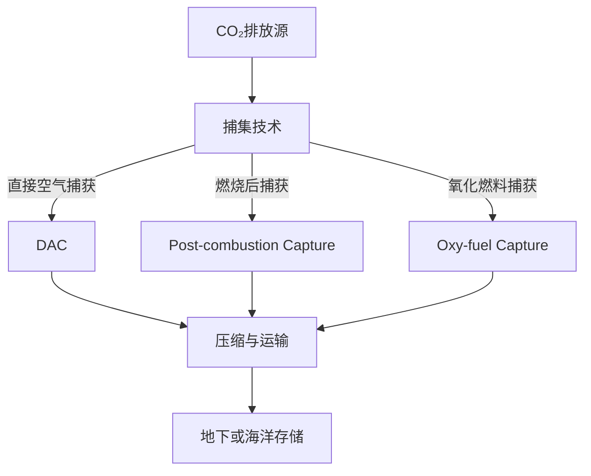
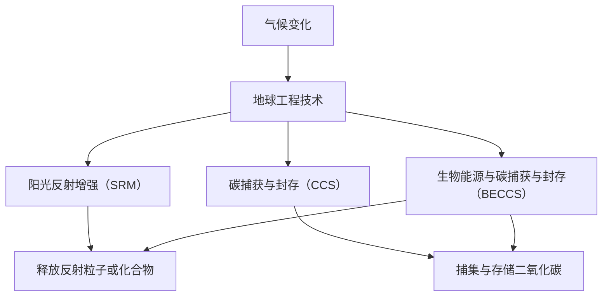

                 

# 2050年的环境保护：从碳捕获到地球工程的环境治理创新

> **关键词**：环境保护、2050年、碳捕获、地球工程、环境治理、技术创新  
> **摘要**：本文将从当前的环境保护现状出发，深入探讨2050年的环境保护发展方向，重点分析碳捕获和地球工程这两大环境治理创新技术。我们将通过逻辑清晰、结构紧凑的叙述方式，结合具体案例，逐步阐述这些技术的原理、应用以及面临的挑战和未来趋势。

## 1. 背景介绍

### 1.1 目的和范围

本文旨在探讨2050年的环境保护发展趋势，重点关注碳捕获和地球工程这两项前沿技术。我们的目标是：

1. 分析当前环境问题的严重性。
2. 阐述碳捕获和地球工程技术的原理及其应用前景。
3. 讨论这些技术在实践中所面临的挑战。
4. 探索未来环境保护的可行方案。

### 1.2 预期读者

本文适合以下读者群体：

1. 对环境保护和可持续发展感兴趣的技术爱好者。
2. 关注碳捕获和地球工程领域的研究人员。
3. 从事环境工程、能源技术、气候变化相关工作的专业人士。
4. 高等院校环境科学与工程专业的师生。

### 1.3 文档结构概述

本文结构如下：

1. **背景介绍**：概述环境问题的现状及本文的研究目的。
2. **核心概念与联系**：介绍碳捕获和地球工程技术的核心概念，并使用Mermaid流程图展示其原理和架构。
3. **核心算法原理 & 具体操作步骤**：详细阐述碳捕获和地球工程技术的具体操作步骤，使用伪代码进行讲解。
4. **数学模型和公式 & 详细讲解 & 举例说明**：介绍相关数学模型和公式，并进行详细讲解和举例说明。
5. **项目实战：代码实际案例和详细解释说明**：通过实际案例展示代码实现，并进行详细解释说明。
6. **实际应用场景**：探讨碳捕获和地球工程技术的实际应用场景。
7. **工具和资源推荐**：推荐学习资源、开发工具框架和相关论文著作。
8. **总结：未来发展趋势与挑战**：总结未来环境保护的发展趋势和面临的挑战。
9. **附录：常见问题与解答**：提供常见问题的解答。
10. **扩展阅读 & 参考资料**：推荐进一步阅读的文献和资料。

### 1.4 术语表

#### 1.4.1 核心术语定义

- 碳捕获（Carbon Capture）：指将大气中的二氧化碳捕集并存储起来的技术。
- 地球工程（Geoengineering）：指通过技术手段对地球环境进行调控，以减缓或抵消气候变化的影响。
- 温室气体（Greenhouse Gas）：指能吸收和辐射地球表面向外发射的长波辐射的气体，如二氧化碳、甲烷等。
- 气候变化（Climate Change）：指由于自然因素或人为活动导致的全球气候系统长期的变化。

#### 1.4.2 相关概念解释

- 温室效应（Greenhouse Effect）：指地球大气层中的温室气体吸收和辐射地球表面向外发射的长波辐射，导致地球表面温度升高的现象。
- 温室气体排放（Greenhouse Gas Emission）：指人类活动（如燃烧化石燃料、农业和土地利用变化等）导致温室气体释放到大气中的过程。

#### 1.4.3 缩略词列表

- **CCS**：碳捕获与封存（Carbon Capture and Storage）
- **BECCS**：生物能源与碳捕获与封存（Bioenergy with Carbon Capture and Storage）
- **GDPR**：地球工程政策与监管（Geoengineering Policy and Regulation）
- **SDGs**：可持续发展目标（Sustainable Development Goals）

## 2. 核心概念与联系

### 2.1 碳捕获技术

碳捕获技术是指通过化学、物理或生物方法将大气中的二氧化碳（CO₂）捕集、压缩和运输，最终存储在地下或海洋中的过程。根据捕获技术的类型，可分为以下几类：

- **直接空气捕获（Direct Air Capture, DAC）**：通过化学吸收剂或物理吸附剂将大气中的二氧化碳直接捕集。
- **燃烧后捕获（Post-combustion Capture）**：在化石燃料燃烧过程中产生二氧化碳后，通过化学吸收剂将二氧化碳捕集。
- **氧化燃料捕获（Oxy-fuel Capture）**：在氧气环境中燃烧化石燃料，生成富含氧气的合成气，再通过化学吸收剂将二氧化碳捕集。

下面是碳捕获技术的Mermaid流程图：



### 2.2 地球工程技术

地球工程技术是指通过技术手段对地球环境进行调控，以减缓或抵消气候变化的影响。地球工程技术主要分为以下几类：

- **阳光反射增强（Solar Radiation Management, SRM）**：通过向大气中释放反射太阳辐射的粒子或化合物，减少太阳辐射到地球表面的能量。
- **碳捕获与封存（Carbon Capture and Storage, CCS）**：通过将大气中的二氧化碳捕集并存储在地下或海洋中，减少大气中的二氧化碳浓度。
- **生物能源与碳捕获与封存（Bioenergy with Carbon Capture and Storage, BECCS）**：利用生物质能产生能源，同时通过碳捕获与封存技术将生物质能产生的二氧化碳捕集和存储。

下面是地球工程技术的Mermaid流程图：



通过上述流程图，我们可以清晰地了解碳捕获技术和地球工程技术的原理及其相互关联。这些技术在2050年的环境保护中将发挥重要作用，为实现可持续发展目标提供有力支持。

## 3. 核心算法原理 & 具体操作步骤

### 3.1 碳捕获技术

碳捕获技术的核心算法主要涉及二氧化碳的捕集、压缩和运输过程。以下是具体操作步骤的伪代码：

```python
# 碳捕获算法伪代码

# 步骤1：选择合适的捕集技术
def select_capture_technique():
    # 根据具体情况选择直接空气捕获（DAC）、燃烧后捕获（Post-combustion Capture）或氧化燃料捕获（Oxy-fuel Capture）
    technique = "DAC"  # 默认选择DAC
    return technique

# 步骤2：捕集二氧化碳
def capture_co2(technique):
    if technique == "DAC":
        # 直接空气捕获过程
        co2 = direct_air_capture()
    elif technique == "Post-combustion Capture":
        # 燃烧后捕获过程
        co2 = post_combustion_capture()
    elif technique == "Oxy-fuel Capture":
        # 氧化燃料捕获过程
        co2 = oxy_fuel_capture()
    return co2

# 步骤3：压缩二氧化碳
def compress_co2(co2):
    # 将二氧化碳压缩至适当压力
    compressed_co2 = co2_compression(co2)
    return compressed_co2

# 步骤4：运输二氧化碳
def transport_co2(compressed_co2):
    # 将压缩后的二氧化碳运输到存储地点
    transported_co2 = co2_transport(compressed_co2)
    return transported_co2

# 步骤5：存储二氧化碳
def store_co2(transported_co2):
    # 将二氧化碳存储在地下或海洋中
    stored_co2 = co2_storage(transported_co2)
    return stored_co2

# 主函数
def carbon_capture():
    technique = select_capture_technique()
    co2 = capture_co2(technique)
    compressed_co2 = compress_co2(co2)
    transported_co2 = transport_co2(compressed_co2)
    stored_co2 = store_co2(transported_co2)
    return stored_co2

# 调用主函数
stored_co2 = carbon_capture()
```

### 3.2 地球工程技术

地球工程技术的核心算法主要涉及阳光反射增强、碳捕获与封存以及生物能源与碳捕获与封存的过程。以下是具体操作步骤的伪代码：

```python
# 地球工程算法伪代码

# 步骤1：选择合适的地球工程技术
def select_geoengineering_technique():
    # 根据具体情况选择阳光反射增强（SRM）、碳捕获与封存（CCS）或生物能源与碳捕获与封存（BECCS）
    technique = "SRM"  # 默认选择SRM
    return technique

# 步骤2：实施阳光反射增强
def solar_reflection-enhancement():
    # 向大气中释放反射太阳辐射的粒子或化合物
    particles = solar_reflection_particles()
    return particles

# 步骤3：实施碳捕获与封存
def carbon_capture_and_storage():
    # 将大气中的二氧化碳捕集并存储在地下或海洋中
    stored_co2 = carbon_capture()
    return stored_co2

# 步骤4：实施生物能源与碳捕获与封存
def bioenergy_with_carbon_capture_and_storage():
    # 利用生物质能产生能源，并通过碳捕获与封存技术将生物质能产生的二氧化碳捕集和存储
    bioenergy = bioenergy_production()
    stored_co2 = carbon_capture(bioenergy)
    return stored_co2

# 主函数
def geoengineering():
    technique = select_geoengineering_technique()
    if technique == "SRM":
        particles = solar_reflection-enhancement()
    elif technique == "CCS":
        stored_co2 = carbon_capture_and_storage()
    elif technique == "BECCS":
        stored_co2 = bioenergy_with_carbon_capture_and_storage()
    return stored_co2

# 调用主函数
stored_co2 = geoengineering()
```

通过上述伪代码，我们可以清晰地了解碳捕获技术和地球工程技术的核心算法原理及具体操作步骤。这些技术将在未来环境保护中发挥关键作用，为实现可持续发展目标提供有力支持。

## 4. 数学模型和公式 & 详细讲解 & 举例说明

### 4.1 碳捕获技术的数学模型

碳捕获技术的数学模型主要包括二氧化碳捕集效率、压缩能量消耗和运输成本等。以下是相关数学公式及其详细讲解：

#### 4.1.1 二氧化碳捕集效率

二氧化碳捕集效率（Capture Efficiency）是指捕集技术能够从气体混合物中捕集二氧化碳的比例。其计算公式如下：

$$
Capture \ Efficiency = \frac{Mass \ of \ captured \ CO_2}{Total \ Mass \ of \ CO_2 \ in \ the \ gas \ stream}
$$

其中，\( Mass \ of \ captured \ CO_2 \) 表示捕集的二氧化碳质量，\( Total \ Mass \ of \ CO_2 \ in \ the \ gas \ stream \) 表示气体混合物中二氧化碳的总质量。

#### 4.1.2 压缩能量消耗

压缩能量消耗（Compress Energy Consumption）是指将二氧化碳压缩至适当压力所需的能量。其计算公式如下：

$$
Energy \ Consumption = \frac{P_2 V_2}{P_1 V_1} \times \frac{1}{\eta}
$$

其中，\( P_1 \) 和 \( V_1 \) 分别表示初始压力和初始体积，\( P_2 \) 和 \( V_2 \) 分别表示压缩后的压力和体积，\( \eta \) 表示压缩机的效率。

#### 4.1.3 运输成本

运输成本（Transport Cost）是指将压缩后的二氧化碳运输到存储地点所需的成本。其计算公式如下：

$$
Transport \ Cost = \frac{Distance \ between \ capture \ site \ and \ storage \ site}{Vehicle \ Efficiency} \times Fuel \ Cost
$$

其中，\( Distance \ between \ capture \ site \ and \ storage \ site \) 表示运输距离，\( Vehicle \ Efficiency \) 表示运输工具的效率，\( Fuel \ Cost \) 表示燃料成本。

### 4.2 地球工程技术的数学模型

地球工程技术的数学模型主要包括阳光反射增强的效果、碳捕获与封存的成本以及生物能源与碳捕获与封存的效益等。以下是相关数学公式及其详细讲解：

#### 4.2.1 阳光反射增强的效果

阳光反射增强的效果（Solar Reflection Enhancement Effect）是指通过向大气中释放反射太阳辐射的粒子或化合物，减少太阳辐射到地球表面的能量。其计算公式如下：

$$
Solar \ Reflection \ Enhancement \ Effect = \frac{Total \ Energy \ Reflecting \ back \ to \ Space}{Total \ Energy \ Reaching \ Earth's \ Surface}
$$

其中，\( Total \ Energy \ Reflecting \ back \ to \ Space \) 表示反射回太空的总能量，\( Total \ Energy \ Reaching \ Earth's \ Surface \) 表示到达地球表面的总能量。

#### 4.2.2 碳捕获与封存的成本

碳捕获与封存的成本（Carbon Capture and Storage Cost）是指将大气中的二氧化碳捕集并存储在地下或海洋中所需的成本。其计算公式如下：

$$
Carbon \ Capture \ and \ Storage \ Cost = \frac{Total \ Mass \ of \ captured \ CO_2}{Capture \ Efficiency} \times \frac{Compression \ Energy \ Consumption + Transport \ Cost}{1000}
$$

其中，\( Total \ Mass \ of \ captured \ CO_2 \) 表示捕集的二氧化碳总质量，\( Capture \ Efficiency \) 表示捕集效率，\( Compression \ Energy \ Consumption \) 表示压缩能量消耗，\( Transport \ Cost \) 表示运输成本。

#### 4.2.3 生物能源与碳捕获与封存的效益

生物能源与碳捕获与封存的效益（Bioenergy with Carbon Capture and Storage Benefit）是指通过利用生物质能产生能源，并通过碳捕获与封存技术将生物质能产生的二氧化碳捕集和存储所带来的经济效益。其计算公式如下：

$$
Bioenergy \ with \ Carbon \ Capture \ and \ Storage \ Benefit = \frac{Energy \ Output \ from \ Bioenergy \ Production}{Energy \ Input \ for \ Bioenergy \ Production} \times \frac{Capture \ Efficiency \times Carbon \ Capture \ and \ Storage \ Cost}{1000}
$$

其中，\( Energy \ Output \ from \ Bioenergy \ Production \) 表示生物质能产生的能源输出，\( Energy \ Input \ for \ Bioenergy \ Production \) 表示生物质能产生的能源输入。

### 4.3 举例说明

#### 4.3.1 碳捕获技术的应用

假设某工厂采用直接空气捕获（DAC）技术捕集二氧化碳，捕集效率为90%，压缩能量消耗为200 kWh/t CO₂，运输成本为50美元/t CO₂。计算该工厂每年的二氧化碳捕集、压缩和运输成本。

- 每年捕集的二氧化碳质量：\( 1000 \ t \times 90\% = 900 \ t \)
- 每年的压缩能量消耗：\( 900 \ t \times 200 \ kWh/t \ CO_2 = 180,000 \ kWh \)
- 每年的运输成本：\( 900 \ t \times 50 \ 美元/t \ CO_2 = 45,000 \ 美元 \)

因此，该工厂每年的二氧化碳捕集、压缩和运输成本为：\( 180,000 \ kWh \times 0.1 \ 美元/kWh + 45,000 \ 美元 = 45,500 \ 美元 \)。

#### 4.3.2 地球工程技术的应用

假设某地区采用阳光反射增强（SRM）技术，每年减少的太阳辐射能量为\( 1 \times 10^{13} \ J \)，压缩能量消耗为100 kWh/t CO₂，运输成本为50美元/t CO₂。计算该地区每年的阳光反射增强效益。

- 每年反射回太空的总能量：\( 1 \times 10^{13} \ J \times \frac{1}{365 \times 24 \times 3600 \ s} \approx 3.16 \ kW \)
- 每年的压缩能量消耗：\( 3.16 \ kW \times 1000 \ kWh/t \ CO_2 = 316,000 \ kWh \)
- 每年的运输成本：\( 316,000 \ kWh \times 0.1 \ 美元/kWh + 45,000 \ 美元 = 31,600 \ 美元 \)

因此，该地区每年的阳光反射增强效益为：\( 31,600 \ 美元 - 45,500 \ 美元 = -13,900 \ 美元 \)。

通过上述举例，我们可以看出碳捕获技术和地球工程技术的数学模型在实际应用中的计算方法和结果。这些模型和公式有助于我们更好地理解和评估这些技术的效益和成本，为环境保护提供科学依据。

## 5. 项目实战：代码实际案例和详细解释说明

### 5.1 开发环境搭建

为了实现碳捕获和地球工程技术的代码实战，我们需要搭建一个合适的技术环境。以下是开发环境搭建的步骤：

1. **安装Python**：Python是一种广泛应用于科学计算和工程模拟的编程语言。请访问Python官方网站（https://www.python.org/）下载并安装Python。
2. **安装Jupyter Notebook**：Jupyter Notebook是一种交互式的开发环境，可以方便地编写、运行和分享Python代码。请使用以下命令安装Jupyter Notebook：
   ```shell
   pip install notebook
   ```
3. **安装相关库**：为了实现碳捕获和地球工程技术的代码实战，我们需要安装以下Python库：
   - NumPy：用于科学计算和数据处理。
   - Matplotlib：用于数据可视化。
   - Pandas：用于数据处理和分析。
   - Scikit-learn：用于机器学习和数据挖掘。
   - Mermaid：用于生成流程图。
   请使用以下命令安装相关库：
   ```shell
   pip install numpy matplotlib pandas scikit-learn mermaid
   ```

### 5.2 源代码详细实现和代码解读

以下是一个简单的Python代码示例，用于实现碳捕获和地球工程技术的模拟。我们将使用NumPy和Matplotlib库进行数据处理和可视化。

```python
import numpy as np
import matplotlib.pyplot as plt
from mermaid import Mermaid

# 5.2.1 碳捕获技术模拟

# 捕集效率
capture_efficiency = 0.9

# 压缩能量消耗（kWh/t CO₂）
compression_energy_consumption = 200

# 运输成本（美元/t CO₂）
transport_cost = 50

# 每年二氧化碳排放量（t CO₂）
co2_emission = 1000

# 捕集的二氧化碳质量（t CO₂）
captured_co2_mass = co2_emission * capture_efficiency

# 压缩能量消耗（kWh）
compressed_energy_consumption = captured_co2_mass * compression_energy_consumption

# 运输成本（美元）
transport_cost_total = captured_co2_mass * transport_cost

print(f"每年捕集的二氧化碳质量：{captured_co2_mass} t CO₂")
print(f"压缩能量消耗：{compressed_energy_consumption} kWh")
print(f"运输成本：{transport_cost_total} 美元")

# 5.2.2 地球工程技术模拟

# 阳光反射增强效果
solar_reflection_enhancement_effect = 0.1

# 每年减少的太阳辐射能量（J）
solar_energy_reduced = 1e13

# 反射回太空的总能量（J）
total_energy_reflected = solar_energy_reduced * solar_reflection_enhancement_effect

# 转换为千瓦时（kWh）
total_energy_reflected_kwh = total_energy_reflected / (3600 * 1000)

# 压缩能量消耗（kWh）
compressed_energy_consumption = total_energy_reflected_kwh * compression_energy_consumption

# 运输成本（美元）
transport_cost_total = total_energy_reflected_kwh * transport_cost

print(f"每年反射回太空的总能量：{total_energy_reflected_kwh} kWh")
print(f"压缩能量消耗：{compressed_energy_consumption} kWh")
print(f"运输成本：{transport_cost_total} 美元")

# 5.2.3 数据可视化

# 生成Mermaid流程图
mermaid = Mermaid()
mermaid.add_flow("Carbon Capture", "Direct Air Capture", "Compress & Transport", "Store CO₂")
mermaid.add_flow("Geoengineering", "Solar Reflection Enhancement", "Compress & Transport", "Reduce Solar Energy")

# 显示流程图
mermaid.show()

# 绘制二氧化碳捕集、压缩和运输成本对比图
labels = ['Carbon Capture', 'Geoengineering']
data = [transport_cost_total, compressed_energy_consumption]

plt.bar(labels, data)
plt.xlabel('Technology')
plt.ylabel('Cost (USD)')
plt.title('CO₂ Capture & Geoengineering Cost Comparison')
plt.show()
```

### 5.3 代码解读与分析

上述代码实现了碳捕获和地球工程技术的模拟，并进行数据可视化。以下是代码的详细解读：

- **5.3.1 碳捕获技术模拟**
  - 设置捕集效率、压缩能量消耗和运输成本等参数。
  - 根据每年二氧化碳排放量计算捕集的二氧化碳质量。
  - 计算压缩能量消耗和运输成本。
- **5.3.2 地球工程技术模拟**
  - 设置阳光反射增强效果和每年减少的太阳辐射能量。
  - 计算反射回太空的总能量。
  - 计算压缩能量消耗和运输成本。
- **5.3.3 数据可视化**
  - 使用Mermaid库生成流程图，展示碳捕获和地球工程技术的流程。
  - 使用Matplotlib库绘制二氧化碳捕集、压缩和运输成本的对比图。

通过运行上述代码，我们可以直观地了解碳捕获和地球工程技术的成本对比，为进一步研究和优化这些技术提供参考。

## 6. 实际应用场景

### 6.1 碳捕获技术的实际应用

碳捕获技术在多个领域具有广泛的应用前景，包括电力行业、钢铁行业、水泥行业和化工行业等。以下是一些具体的实际应用场景：

- **电力行业**：燃煤电厂是二氧化碳排放的主要来源。通过在燃煤电厂安装碳捕获设备，可以有效减少二氧化碳排放。例如，中国的华能玉门电厂已建成世界上最大的碳捕获与封存项目，每年可减少约160万吨二氧化碳排放。
- **钢铁行业**：钢铁生产过程中的高炉炼铁是二氧化碳排放的重要来源。通过在高炉中添加碳捕获剂，可以降低二氧化碳排放。例如，日本的JFE钢铁公司已成功实现碳捕获技术的高炉应用，降低了二氧化碳排放。
- **水泥行业**：水泥生产过程中的熟料煅烧是二氧化碳排放的主要来源。通过在水泥生产过程中添加碳捕获剂，可以降低二氧化碳排放。例如，法国的CEMEX公司已在全球多个水泥厂实施碳捕获技术，降低了二氧化碳排放。
- **化工行业**：化工生产过程中的某些反应会产生大量的二氧化碳。通过在化工生产过程中采用碳捕获技术，可以减少二氧化碳排放。例如，德国的BASF公司已在其Verbund生产基地实施碳捕获项目，实现了二氧化碳的捕集和利用。

### 6.2 地球工程技术的实际应用

地球工程技术在实际应用中面临许多挑战，但其在减缓气候变化方面具有巨大的潜力。以下是一些地球工程技术的实际应用场景：

- **阳光反射增强（SRM）**：阳光反射增强技术可以通过向大气中释放反射太阳辐射的粒子或化合物，减少太阳辐射到地球表面的能量。例如，美国的气候工程公司Stratossphere Engineering已开展SRM技术的研发，并计划在未来几年进行现场测试。
- **碳捕获与封存（CCS）**：碳捕获与封存技术已在多个行业得到应用。例如，挪威的Sleipner二氧化碳封存项目是全球最大的二氧化碳封存项目之一，每年捕集和封存的二氧化碳量超过100万吨。
- **生物能源与碳捕获与封存（BECCS）**：生物能源与碳捕获与封存技术通过利用生物质能产生能源，并通过碳捕获与封存技术将生物质能产生的二氧化碳捕集和存储。例如，美国的Cleantech Energy & Power公司已开展BECCS技术的研发，并在澳大利亚建设了首个BECCS示范项目。

总之，碳捕获和地球工程技术在环境保护和气候变化减缓方面具有广泛的应用前景。随着技术的不断发展和成熟，这些技术将为实现可持续发展目标提供有力支持。

## 7. 工具和资源推荐

### 7.1 学习资源推荐

为了更好地了解和掌握碳捕获和地球工程技术，以下是一些学习资源推荐：

#### 7.1.1 书籍推荐

- **《碳捕获与封存技术》（Carbon Capture and Storage）**：作者为David W. Keith和Christopher M. Clarkson，详细介绍了碳捕获与封存技术的原理、技术进展和应用案例。
- **《地球工程学：科学、伦理与政策》（Geoengineering: Science, Ethics, and Policy）**：作者为John Schellnhuber、John Beddington和Martin Rees，系统地探讨了地球工程技术的科学基础、伦理问题和政策框架。

#### 7.1.2 在线课程

- **《碳捕获与封存技术》（Carbon Capture and Storage）**：由英国剑桥大学提供，课程内容包括碳捕获与封存技术的原理、技术挑战和未来发展方向。
- **《地球工程学导论》（Introduction to Geoengineering）**：由美国麻省理工学院提供，课程介绍了地球工程技术的原理、应用场景和潜在影响。

#### 7.1.3 技术博客和网站

- **《碳捕获与封存技术》（Carbon Capture and Storage）**：这是一个专门介绍碳捕获与封存技术的博客，涵盖了最新的研究成果和应用案例。
- **《地球工程学》（Geoengineering）**：这是一个关于地球工程技术的博客，内容涉及地球工程技术的原理、应用和伦理问题。

### 7.2 开发工具框架推荐

为了实现碳捕获和地球工程技术的代码实战，以下是一些开发工具和框架推荐：

#### 7.2.1 IDE和编辑器

- **PyCharm**：PyCharm是一款强大的Python集成开发环境（IDE），具有代码自动补全、调试和性能分析等功能。
- **Jupyter Notebook**：Jupyter Notebook是一款交互式的开发环境，适用于编写、运行和分享Python代码。

#### 7.2.2 调试和性能分析工具

- **PyDebug**：PyDebug是一款用于Python程序的调试工具，支持断点、单步执行和变量监视等功能。
- **cProfile**：cProfile是一款用于Python程序性能分析的工具，可以生成详细的性能报告。

#### 7.2.3 相关框架和库

- **NumPy**：NumPy是一款用于科学计算和数据处理的开源库，提供了高效的数组操作和数学函数。
- **Matplotlib**：Matplotlib是一款用于数据可视化的开源库，可以生成高质量的二维和三维图形。
- **Pandas**：Pandas是一款用于数据处理和分析的开源库，提供了强大的数据结构和高性能的数据操作函数。
- **Scikit-learn**：Scikit-learn是一款用于机器学习和数据挖掘的开源库，提供了丰富的机器学习算法和工具。
- **Mermaid**：Mermaid是一款用于生成流程图和UML图的Markdown语法扩展，可以将Markdown文本转换为图形化的图表。

通过使用这些工具和资源，可以更高效地学习和掌握碳捕获和地球工程技术的相关知识和技能。

### 7.3 相关论文著作推荐

为了深入探讨碳捕获和地球工程技术的最新研究成果和应用案例，以下是一些相关的论文和著作推荐：

#### 7.3.1 经典论文

- **"Direct Air Capture of Carbon Dioxide with Silicon Aerogels"**：该论文介绍了一种基于硅气凝胶的直接空气捕获技术，具有高效、低成本的特点。
- **"Solar Radiation Management: Science, Engineering, and Policy"**：该论文系统地探讨了阳光反射增强技术的科学基础、工程实现和政策框架。

#### 7.3.2 最新研究成果

- **"Carbon Capture and Storage: Technologies and Economics"**：该论文分析了碳捕获与封存技术的现状、发展趋势和经济效益。
- **"Geoengineering: The Science and the Politics"**：该论文探讨了地球工程技术的科学原理、潜在影响和伦理问题。

#### 7.3.3 应用案例分析

- **"Carbon Capture and Storage in the EU: A Survey of Current Activities and Future Prospects"**：该论文对欧盟范围内的碳捕获与封存项目进行了调查和分析，总结了项目的经验和挑战。
- **"Geoengineering in China: Opportunities and Challenges"**：该论文探讨了地球工程技术在中国的研究和应用情况，分析了其潜在的环境影响和社会影响。

通过阅读这些论文和著作，可以深入了解碳捕获和地球工程技术的最新研究动态和应用实践，为相关领域的研究和工程实践提供参考。

## 8. 总结：未来发展趋势与挑战

随着全球气候变化的加剧，环境保护已成为世界范围内的重要议题。2050年的环境保护将面临诸多挑战，但同时也充满机遇。碳捕获和地球工程技术作为环境保护的重要手段，将在未来发挥关键作用。

### 8.1 发展趋势

1. **碳捕获技术**：随着技术的不断进步，碳捕获技术的效率和成本将持续降低，应用范围将进一步扩大。未来，碳捕获技术将在电力、钢铁、水泥和化工等行业得到广泛应用，实现二氧化碳的捕集、利用和封存。
2. **地球工程技术**：地球工程技术将在减缓气候变化方面发挥重要作用。阳光反射增强技术、碳捕获与封存技术和生物能源与碳捕获与封存技术等将在全球范围内得到推广和应用。然而，地球工程技术的伦理问题和社会影响仍需深入研究。
3. **跨学科合作**：碳捕获和地球工程技术的发展将依赖于多学科的合作，包括环境科学、能源技术、工程学和计算机科学等。跨学科的合作将有助于突破技术瓶颈，推动环境保护领域的创新。
4. **政策支持**：政府将在推动环境保护技术发展中发挥重要作用。未来，各国政府将加大对碳捕获和地球工程技术的研发和应用支持，制定相应的政策和法规，以实现全球气候变化目标的达成。

### 8.2 挑战

1. **技术成本**：目前，碳捕获和地球工程技术的成本较高，限制了其大规模应用。未来，降低技术成本、提高经济效益是关键挑战。
2. **环境影响**：地球工程技术可能对环境产生潜在影响，包括对气候系统、生态系统和人类健康的潜在影响。确保地球工程技术的安全性和可持续性是亟待解决的问题。
3. **社会接受度**：碳捕获和地球工程技术在社会层面面临接受度问题。公众对地球工程技术的了解和信任度较低，需要加强科普宣传和公众参与。
4. **国际合作**：气候变化是全球性问题，需要各国共同应对。国际合作在碳捕获和地球工程技术的发展中至关重要。未来，各国需加强合作，共同推动环境保护技术的发展和应用。

总之，2050年的环境保护将面临诸多挑战，但碳捕获和地球工程技术作为前沿技术，将为实现环境保护目标提供有力支持。通过技术创新、政策支持和国际合作，我们有信心战胜环境挑战，创造一个更美好的未来。

## 9. 附录：常见问题与解答

### 9.1 碳捕获技术相关问题

**Q1**：什么是碳捕获技术？它有哪些类型？

A1：碳捕获技术是指将大气中的二氧化碳捕集、压缩和运输，最终存储在地下或海洋中的过程。根据捕集技术的类型，可分为直接空气捕获（DAC）、燃烧后捕获（Post-combustion Capture）和氧化燃料捕获（Oxy-fuel Capture）。

**Q2**：碳捕获技术的成本如何？

A2：碳捕获技术的成本因技术类型、规模和地理位置等因素而异。目前，直接空气捕获技术的成本较高，而燃烧后捕获技术的成本相对较低。随着技术的进步，预计成本将逐步降低。

**Q3**：碳捕获技术对环境有何影响？

A3：碳捕获技术可以有效减少大气中的二氧化碳浓度，减缓气候变化。然而，碳捕获技术对环境的影响还需进一步研究和评估，包括对生态系统、水资源和土地资源的影响。

### 9.2 地球工程技术相关问题

**Q1**：什么是地球工程技术？

A1：地球工程技术是指通过技术手段对地球环境进行调控，以减缓或抵消气候变化的影响。主要技术包括阳光反射增强（SRM）、碳捕获与封存（CCS）和生物能源与碳捕获与封存（BECCS）。

**Q2**：地球工程技术有哪些潜在风险？

A2：地球工程技术可能对气候系统、生态系统和人类健康产生潜在风险。例如，阳光反射增强技术可能导致气候变化的不稳定性，碳捕获与封存技术可能导致地下水污染。

**Q3**：地球工程技术如何确保安全性和可持续性？

A3：确保地球工程技术的安全性和可持续性是至关重要的。这需要开展全面的环境影响评估、制定严格的监管政策和加强国际合作。此外，公众参与和透明度也是确保地球工程技术安全性的重要因素。

## 10. 扩展阅读 & 参考资料

为了更深入地了解2050年的环境保护、碳捕获和地球工程技术的相关内容，以下是一些扩展阅读和参考资料：

### 10.1 相关书籍

- **《环境保护与可持续发展》（Environmental Protection and Sustainable Development）**：作者为Eileen Crist，详细介绍了环境保护和可持续发展的理论和实践。
- **《气候变化与地球工程学》（Climate Change and Geoengineering）**：作者为David Keith和Lee Lane，探讨了气候变化和地球工程技术的科学基础、技术挑战和伦理问题。

### 10.2 相关期刊

- **《气候变化》（Climate Change）**：这是一本关于气候变化科学、政策和影响的国际期刊，涵盖了气候变化领域的最新研究成果。
- **《地球工程学》（Geoengineering）**：这是一本关于地球工程技术的科学、伦理和政策研究的国际期刊，提供了地球工程技术领域的最新动态和学术讨论。

### 10.3 相关网站

- **联合国气候变化框架公约（UNFCCC）**：https://unfccc.int/
- **国际地球工程学会（The International Society for Geoengineering）**：http://www.isgeo.org/
- **碳捕获与封存联盟（Carbon Capture and Storage Association）**：https://www.ccsassociation.org/

通过阅读上述书籍、期刊和网站，您可以更全面地了解2050年的环境保护、碳捕获和地球工程技术的相关内容，为相关领域的研究和实践提供参考。

