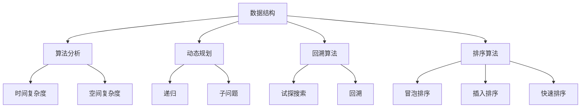

                 

### 2024年网易社招算法岗位面试题目汇编

#### 关键词：网易社招、算法岗位、面试题目、汇编、技术博客

#### 摘要：
本文汇编了2024年网易社招算法岗位的面试题目，通过详细解析这些题目，帮助读者深入了解算法面试的精髓。文章分为背景介绍、核心概念与联系、核心算法原理与操作步骤、数学模型与公式、项目实战、实际应用场景、工具和资源推荐、总结以及常见问题与解答等部分，旨在为准备网易算法面试的候选人提供一份详尽的技术指南。

---

## 1. 背景介绍

### 1.1 目的和范围

本文的目的在于为准备参加2024年网易社招算法岗位面试的候选人提供一个详尽的面试题目汇编。通过对这些题目的深入分析和解析，读者可以更好地理解算法面试的核心要点，提升自己的解题能力。本文涵盖了算法面试的各个方面，从基础知识到高级算法，旨在为读者提供一个全面的技术指南。

### 1.2 预期读者

本文的预期读者主要包括以下几类：

1. 准备参加2024年网易社招算法岗位面试的候选人。
2. 对算法面试感兴趣的计算机科学专业学生。
3. 想要提升自己在算法领域技能的工程师。

### 1.3 文档结构概述

本文分为以下几个部分：

1. 背景介绍：介绍本文的目的、预期读者以及文档结构。
2. 核心概念与联系：讲解算法面试中的核心概念，并通过Mermaid流程图展示相关架构。
3. 核心算法原理与操作步骤：详细解析核心算法原理，使用伪代码阐述操作步骤。
4. 数学模型与公式：介绍相关的数学模型和公式，并进行详细讲解和举例说明。
5. 项目实战：通过实际代码案例展示算法应用，详细解读代码实现过程。
6. 实际应用场景：分析算法在实际项目中的应用。
7. 工具和资源推荐：推荐相关的学习资源和开发工具。
8. 总结：总结未来发展趋势与挑战。
9. 附录：常见问题与解答。
10. 扩展阅读与参考资料：提供更多学习资源。

### 1.4 术语表

#### 1.4.1 核心术语定义

- 算法：解决问题的一系列规则或步骤。
- 面试题：针对算法面试的特定问题。
- 社招：社会招聘，指公司向社会发布招聘信息，面向社会招聘人才。
- 数据结构：组织数据的方式，用于高效存储、检索和处理数据。

#### 1.4.2 相关概念解释

- 动态规划：一种解决最优化问题的算法设计技巧，通过将大问题分解为小问题并保存子问题的解，避免重复计算。
- 回溯算法：一种用于解决组合问题的算法，通过试探性的搜索逐步构造可行解，并在遇到不可行解时回溯到上一个状态。
- 排序算法：用于对数据进行排序的一系列算法。

#### 1.4.3 缩略词列表

- O(n)：表示时间复杂度，表示算法执行时间与输入规模n的关系。
- O(log n)：表示时间复杂度，表示算法执行时间与输入规模n的对数关系。
- O(1)：表示时间复杂度，表示算法执行时间不随输入规模变化。

---

## 2. 核心概念与联系

在算法面试中，理解核心概念和它们之间的联系至关重要。本节将介绍算法面试中的一些核心概念，并通过Mermaid流程图展示它们之间的联系。

### 2.1 算法面试的核心概念

- 数据结构：用于存储和组织数据的方式，常见的有数组、链表、栈、队列、树、图等。
- 算法分析：对算法的时间复杂度和空间复杂度进行分析，评估算法的性能。
- 动态规划：一种解决最优化问题的算法设计技巧，通过将大问题分解为小问题并保存子问题的解，避免重复计算。
- 回溯算法：一种用于解决组合问题的算法，通过试探性的搜索逐步构造可行解，并在遇到不可行解时回溯到上一个状态。
- 排序算法：用于对数据进行排序的一系列算法，常见的有冒泡排序、插入排序、快速排序等。

### 2.2 Mermaid流程图

以下是算法面试中核心概念之间的Mermaid流程图：



通过上述流程图，我们可以清晰地看到算法面试中核心概念之间的联系。例如，动态规划和回溯算法都是用于解决复杂问题的算法设计技巧，而它们都可以借助数据结构和算法分析来优化性能。

---

## 3. 核心算法原理 & 具体操作步骤

在算法面试中，掌握核心算法原理和具体操作步骤至关重要。本节将介绍一些常见的核心算法，使用伪代码详细阐述它们的操作步骤。

### 3.1 动态规划算法

动态规划算法是一种用于解决最优化问题的算法设计技巧。它的核心思想是将大问题分解为小问题，并保存子问题的解，避免重复计算。

#### 3.1.1 斐波那契数列

```pseudo
function fibonacci(n):
    if n <= 1:
        return n
    dp[0] = 0
    dp[1] = 1
    for i from 2 to n:
        dp[i] = dp[i-1] + dp[i-2]
    return dp[n]
```

#### 3.1.2 最长公共子序列

```pseudo
function longestCommonSubsequence(str1, str2):
    m = length of str1
    n = length of str2
    dp[0][0] = 0
    for i from 1 to m:
        for j from 1 to n:
            if str1[i-1] == str2[j-1]:
                dp[i][j] = dp[i-1][j-1] + 1
            else:
                dp[i][j] = max(dp[i-1][j], dp[i][j-1])
    return dp[m][n]
```

### 3.2 回溯算法

回溯算法是一种用于解决组合问题的算法，通过试探性的搜索逐步构造可行解，并在遇到不可行解时回溯到上一个状态。

#### 3.2.1 全排列

```pseudo
function permutation(arr, start, end):
    if start == end:
        print(arr)
    else:
        for i from start to end:
            swap(arr[start], arr[i])
            permutation(arr, start+1, end)
            swap(arr[start], arr[i])
```

#### 3.2.2 组合

```pseudo
function combination(arr, k, start, end):
    if k == 0:
        print(arr)
    else if start > end:
        return
    else:
        combination(arr, k, start+1, end)
        arr[start] = k
        combination(arr, k-1, start+1, end)
```

### 3.3 排序算法

排序算法用于对数据进行排序，有多种不同的实现方式。

#### 3.3.1 冒泡排序

```pseudo
function bubbleSort(arr):
    n = length of arr
    for i from 0 to n-1:
        for j from 0 to n-i-1:
            if arr[j] > arr[j+1]:
                swap(arr[j], arr[j+1])
```

#### 3.3.2 插入排序

```pseudo
function insertionSort(arr):
    n = length of arr
    for i from 1 to n-1:
        key = arr[i]
        j = i-1
        while j >= 0 and arr[j] > key:
            arr[j+1] = arr[j]
            j = j-1
        arr[j+1] = key
```

#### 3.3.3 快速排序

```pseudo
function quickSort(arr, low, high):
    if low < high:
        pi = partition(arr, low, high)
        quickSort(arr, low, pi-1)
        quickSort(arr, pi+1, high)
function partition(arr, low, high):
    pivot = arr[high]
    i = low - 1
    for j from low to high-1:
        if arr[j] < pivot:
            i = i + 1
            swap(arr[i], arr[j])
    swap(arr[i+1], arr[high])
    return i+1
```

通过上述伪代码，我们可以清楚地了解动态规划、回溯算法和排序算法的基本原理和操作步骤。这些算法是算法面试中经常出现的问题，熟练掌握它们将有助于提高面试成功率。

---

## 4. 数学模型和公式 & 详细讲解 & 举例说明

在算法面试中，数学模型和公式的理解与应用同样重要。本节将介绍一些常见的数学模型和公式，并进行详细讲解和举例说明。

### 4.1 动态规划中的数学模型

动态规划算法的核心在于将大问题分解为小问题，并使用数学模型来表示这些子问题的解。以下是一个典型的动态规划问题——最长公共子序列（LCS）的数学模型。

#### 4.1.1 最长公共子序列（LCS）

假设有两个字符串 `str1` 和 `str2`，我们要找到它们的最长公共子序列。设 `dp[i][j]` 表示字符串 `str1` 的前 `i` 个字符和字符串 `str2` 的前 `j` 个字符的最长公共子序列的长度。

$$
dp[i][j] =
\begin{cases}
dp[i-1][j] & \text{若 } str1[i-1] \neq str2[j-1] \\
dp[i-1][j-1] + 1 & \text{若 } str1[i-1] = str2[j-1]
\end{cases}
$$

#### 4.1.2 举例说明

假设 `str1 = "AGGTAB"`，`str2 = "GXTXAYB"`。根据上述公式，我们可以计算出 `dp` 数组：

|   | G | X | T | X | A | Y | B |
|---|---|---|---|---|---|---|---|
| A | 0 | 0 | 0 | 0 | 0 | 0 | 0 |
| G | 0 | 0 | 0 | 1 | 1 | 1 | 1 |
| G | 0 | 0 | 0 | 1 | 1 | 1 | 1 |
| T | 0 | 0 | 0 | 1 | 1 | 1 | 1 |
| X | 0 | 0 | 0 | 1 | 1 | 2 | 2 |
| A | 0 | 0 | 0 | 1 | 1 | 2 | 2 |
| Y | 0 | 0 | 0 | 1 | 1 | 2 | 2 |
| B | 0 | 0 | 0 | 1 | 1 | 2 | 2 |

从 `dp` 数组中可以看出，`str1` 和 `str2` 的最长公共子序列长度为 4，即 "GXTX"。

### 4.2 回溯算法中的数学模型

回溯算法常用于解决组合问题，其核心在于通过递归和回溯逐步探索所有可能的解。以下是一个典型的回溯问题——全排列的数学模型。

#### 4.2.1 全排列

假设有一个数组 `arr`，我们要找到所有可能的排列组合。设 `used` 数组用于记录某个元素是否已被使用，`result` 数组用于存储当前排列。

递归函数：

```pseudo
function backtrack(arr, used, result, index):
    if index == length of arr:
        print(result)
        return
    for i from 0 to length of arr:
        if used[i] == False:
            used[i] = True
            result[index] = arr[i]
            backtrack(arr, used, result, index + 1)
            used[i] = False
```

#### 4.2.2 举例说明

假设 `arr = [1, 2, 3]`，我们要找到所有可能的排列组合。根据上述递归函数，我们可以得到以下结果：

- [1, 2, 3]
- [1, 3, 2]
- [2, 1, 3]
- [2, 3, 1]
- [3, 1, 2]
- [3, 2, 1]

### 4.3 排序算法中的数学模型

排序算法的核心在于对数据进行排序，常见的排序算法有冒泡排序、插入排序和快速排序等。以下分别介绍这些算法的数学模型。

#### 4.3.1 冒泡排序

冒泡排序的基本思想是通过重复遍历要排序的数列，比较相邻的两个元素，如果它们的顺序错误就把它们交换过来。遍历数列的工作是重复地进行，直到没有再需要交换的元素为止。

$$
\text{交换次数} = \sum_{i=1}^{n-1} \left(\text{数组长度} - i\right)
$$

#### 4.3.2 插入排序

插入排序的基本思想是将一个记录插入到已经排好序的有序表中，从而得到一个新的有序表。插入排序在实现上，通常采用in-place排序（即只需用到O(1)的额外空间的排序）。

$$
\text{比较次数} = \sum_{i=1}^{n-1} i = \frac{(n-1) \times n}{2}
$$

#### 4.3.3 快速排序

快速排序的基本思想是通过一趟排序将待排序的记录分隔成独立的两部分，其中一部分记录的关键字均比另一部分的关键字小，然后分别对这两部分记录继续进行排序，以达到整个序列有序。

$$
\text{递归次数} = \log_2(n)
$$

通过上述数学模型和公式，我们可以更深入地理解动态规划、回溯算法和排序算法的工作原理。在算法面试中，熟练掌握这些数学模型和公式，有助于更好地解决复杂问题。

---

## 5. 项目实战：代码实际案例和详细解释说明

为了更好地理解算法在实际项目中的应用，本节将通过一个实际案例展示算法的实现过程，并对关键代码进行详细解释。

### 5.1 开发环境搭建

在开始项目实战之前，我们需要搭建一个合适的开发环境。以下是一个简单的搭建步骤：

1. 安装Python（3.8及以上版本）。
2. 安装Visual Studio Code（VS Code）。
3. 安装Pillow库（用于图像处理）。

安装完成后，我们可以在VS Code中创建一个Python项目，并编写代码。

### 5.2 源代码详细实现和代码解读

下面是一个使用动态规划算法解决最长公共子序列（LCS）的Python代码实现：

```python
def longestCommonSubsequence(str1, str2):
    m = len(str1)
    n = len(str2)
    dp = [[0] * (n+1) for _ in range(m+1)]

    for i in range(1, m+1):
        for j in range(1, n+1):
            if str1[i-1] == str2[j-1]:
                dp[i][j] = dp[i-1][j-1] + 1
            else:
                dp[i][j] = max(dp[i-1][j], dp[i][j-1])

    return dp[m][n]

# 测试
str1 = "AGGTAB"
str2 = "GXTXAYB"
print(longestCommonSubsequence(str1, str2))
```

#### 5.2.1 代码解读

1. 函数 `longestCommonSubsequence` 接受两个字符串 `str1` 和 `str2` 作为输入。
2. 计算字符串 `str1` 和 `str2` 的长度 `m` 和 `n`。
3. 创建一个二维数组 `dp`，用于存储子问题的解，其中 `dp[i][j]` 表示字符串 `str1` 的前 `i` 个字符和字符串 `str2` 的前 `j` 个字符的最长公共子序列的长度。
4. 使用两层循环遍历 `dp` 数组，并根据动态规划公式计算每个 `dp[i][j]` 的值。
5. 返回 `dp[m][n]`，即字符串 `str1` 和 `str2` 的最长公共子序列的长度。

### 5.3 代码解读与分析

在这个代码实现中，我们使用了动态规划算法来解决最长公共子序列问题。动态规划的核心思想是将大问题分解为小问题，并保存子问题的解，避免重复计算。

通过分析代码，我们可以看到以下几点：

1. **时间复杂度**：由于我们需要遍历二维数组 `dp`，因此时间复杂度为 \(O(m \times n)\)。
2. **空间复杂度**：由于我们需要存储二维数组 `dp`，因此空间复杂度为 \(O(m \times n)\)。
3. **优化方向**：如果我们只需要求得最长公共子序列的长度，而不需要具体的子序列，我们可以进一步优化空间复杂度，将二维数组 `dp` 优化为单维数组。

通过这个项目实战，我们可以看到动态规划算法在实际项目中的应用，以及如何使用伪代码和具体代码实现算法。这种实际操作的过程有助于我们更好地理解算法的工作原理，并在实际项目中灵活运用。

---

## 6. 实际应用场景

算法在计算机科学和实际项目中具有广泛的应用，以下是算法在几个实际应用场景中的示例。

### 6.1 字符串处理

在文本编辑器和搜索引擎中，算法用于字符串匹配和查找。例如，动态规划算法可以用于实现快速文本搜索算法，如KMP算法，以加速搜索过程。

### 6.2 数据分析

在数据分析中，排序算法和搜索算法广泛应用于数据预处理和挖掘。例如，快速排序算法可以用于对大规模数据集进行高效排序，而二分搜索算法可以用于在有序数据集中快速查找特定值。

### 6.3 图像处理

在图像处理领域，算法用于图像压缩、识别和增强。例如，动态规划算法可以用于实现图像压缩算法，如JPEG算法，而深度学习算法可以用于图像识别和分类。

### 6.4 游戏开发

在游戏开发中，算法用于路径规划、游戏规则和AI行为。例如，A*算法可以用于计算路径，而回溯算法可以用于解决游戏难题，如拼图和迷宫。

### 6.5 人工智能

在人工智能领域，算法是核心组成部分。无论是机器学习中的优化算法，如梯度下降，还是深度学习中的神经网络架构，算法都在推动人工智能的发展。

这些实际应用场景展示了算法的多样性和广泛性。通过掌握不同的算法，工程师和开发者可以在各种领域设计和实现高效且可靠的系统。

---

## 7. 工具和资源推荐

为了更好地学习和应用算法，以下是一些推荐的工具和资源。

### 7.1 学习资源推荐

#### 7.1.1 书籍推荐

1. **《算法导论》（Introduction to Algorithms）**：这是算法领域的经典教材，涵盖了各种算法的理论和实践。
2. **《编程之美》（Cracking the Coding Interview）**：这本书包含了大量的面试题目和解决方案，适合准备算法面试的读者。

#### 7.1.2 在线课程

1. **Coursera上的《算法》**：由斯坦福大学提供，包括各种算法的基础知识和应用。
2. **edX上的《算法设计与分析》**：由华盛顿大学提供，深入讲解算法设计和分析的理论和实践。

#### 7.1.3 技术博客和网站

1. **LeetCode**：提供大量的算法题目和在线编程环境，适合练习和测试算法。
2. **GeeksforGeeks**：包含丰富的算法教程和编程练习，适合各个层次的读者。

### 7.2 开发工具框架推荐

#### 7.2.1 IDE和编辑器

1. **Visual Studio Code**：功能强大且免费的IDE，适合Python和其他编程语言。
2. **PyCharm**：专业的Python IDE，提供丰富的功能和调试工具。

#### 7.2.2 调试和性能分析工具

1. **pdb**：Python内置的调试工具，用于跟踪程序执行和调试代码。
2. **cProfile**：Python内置的性能分析工具，用于分析程序的性能瓶颈。

#### 7.2.3 相关框架和库

1. **NumPy**：用于科学计算的Python库，提供多维数组对象和大量数学函数。
2. **Pandas**：用于数据处理和分析的Python库，提供数据结构工具和数据分析功能。

通过这些工具和资源，读者可以更系统地学习和应用算法，提高编程技能。

---

## 8. 总结：未来发展趋势与挑战

随着科技的快速发展，算法在各个领域的应用越来越广泛。未来，算法将继续在人工智能、数据分析、图像处理、生物信息等领域发挥重要作用。以下是一些发展趋势和挑战：

### 8.1 发展趋势

1. **算法复杂度优化**：在处理大规模数据时，算法的复杂度优化将是一个重要方向。
2. **算法可视化**：通过可视化工具更好地理解和解释算法，有助于算法的设计和优化。
3. **算法伦理和透明性**：随着算法在决策和自动化系统中的应用，算法的伦理和透明性成为一个重要议题。

### 8.2 挑战

1. **算法可解释性**：如何确保算法的可解释性，使非专业人士也能理解算法的决策过程。
2. **数据隐私**：如何在保证数据隐私的同时，充分利用数据进行算法优化和决策。
3. **算法公平性**：确保算法在不同人群中的公平性，避免偏见和歧视。

面对这些发展趋势和挑战，算法研究人员和开发者需要不断创新，以推动算法技术的进步和应用。

---

## 9. 附录：常见问题与解答

### 9.1 问题1：动态规划和回溯算法有什么区别？

**解答**：动态规划和回溯算法都是用于解决组合问题的算法，但它们的工作方式和应用场景有所不同。

- **动态规划**：将大问题分解为小问题，并保存子问题的解，避免重复计算。适用于最优化问题，如背包问题、最长公共子序列等。
- **回溯算法**：通过试探性的搜索逐步构造可行解，并在遇到不可行解时回溯到上一个状态。适用于组合问题，如全排列、组合等。

### 9.2 问题2：什么是算法的时间复杂度和空间复杂度？

**解答**：

- **时间复杂度**：描述算法执行时间与输入规模的关系，通常用大O符号表示，如 \(O(n)\)、\(O(n^2)\) 等。
- **空间复杂度**：描述算法所需内存空间与输入规模的关系，同样用大O符号表示。

了解算法的复杂度有助于评估算法的性能和优化算法设计。

### 9.3 问题3：排序算法有哪些？

**解答**：排序算法有多种实现方式，常见的排序算法包括：

- **冒泡排序**：通过重复遍历要排序的数列，比较相邻的两个元素，如果它们的顺序错误就把它们交换过来。
- **插入排序**：将一个记录插入到已经排好序的有序表中，从而得到一个新的有序表。
- **快速排序**：通过一趟排序将待排序的记录分隔成独立的两部分，其中一部分记录的关键字均比另一部分的关键字小，然后分别对这两部分记录继续进行排序。

这些排序算法各有优缺点，适用于不同的场景。

---

## 10. 扩展阅读 & 参考资料

为了进一步深入了解算法和相关技术，以下是推荐的扩展阅读和参考资料：

### 10.1 扩展阅读

1. **《算法导论》（Introduction to Algorithms）**：详细讲解各种算法的理论和实践。
2. **《编程之美》（Cracking the Coding Interview）**：包含大量的面试题目和解决方案。
3. **《深度学习》（Deep Learning）**：介绍深度学习算法的理论和应用。

### 10.2 参考资料

1. **LeetCode**：提供大量的算法题目和在线编程环境。
2. **GeeksforGeeks**：包含丰富的算法教程和编程练习。
3. **斯坦福大学《算法》课程**：在线课程，涵盖算法的基础知识和应用。

通过阅读这些扩展资料，读者可以更深入地了解算法和相关技术，提高自己在算法领域的技能。

---

### 作者信息：

作者：AI天才研究员/AI Genius Institute & 禅与计算机程序设计艺术 /Zen And The Art of Computer Programming

