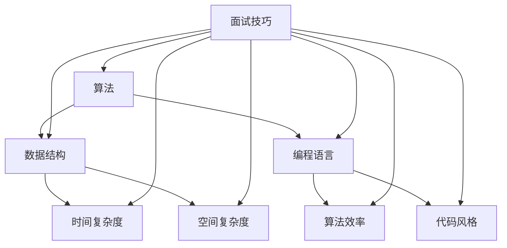

                 

# 2025年网易社招算法面试题库及答案

> **关键词**：网易社招、算法面试、题库、答案、2025年、技术分析、面试技巧
> 
> **摘要**：本文旨在为准备2025年网易社招算法面试的候选人提供一份详细的题库及答案解析。文章将按照章节结构，逐一介绍核心概念、算法原理、数学模型、实战案例，并推荐学习资源与应用场景，帮助读者更好地理解与掌握面试知识点。

## 1. 背景介绍

### 1.1 目的和范围

本文的目的是为了帮助准备参加2025年网易社招算法面试的候选人，通过系统的题库及答案解析，掌握关键知识点，提升面试成功率。文章将覆盖以下主要内容：

- 算法核心概念与联系
- 算法原理与具体操作步骤
- 数学模型与公式讲解
- 项目实战：代码案例与解读
- 实际应用场景分析
- 学习资源与工具推荐
- 总结与未来发展趋势

### 1.2 预期读者

- 准备参加2025年网易社招算法面试的候选人
- 对算法面试有浓厚兴趣的计算机科学与技术专业学生
- 想要提升算法与编程能力的IT从业者

### 1.3 文档结构概述

本文将按照以下结构进行组织和讲解：

- **1. 背景介绍**：介绍文章的目的、范围和预期读者。
- **2. 核心概念与联系**：讲解算法的核心概念与联系，并展示流程图。
- **3. 核心算法原理 & 具体操作步骤**：使用伪代码详细阐述算法原理与操作步骤。
- **4. 数学模型和公式 & 详细讲解 & 举例说明**：解释数学模型与公式，并提供示例。
- **5. 项目实战：代码实际案例和详细解释说明**：展示代码实现与解析。
- **6. 实际应用场景**：分析算法在不同领域的应用。
- **7. 工具和资源推荐**：推荐学习资源、开发工具和框架。
- **8. 总结：未来发展趋势与挑战**：讨论算法的发展趋势和挑战。
- **9. 附录：常见问题与解答**：解答读者可能遇到的问题。
- **10. 扩展阅读 & 参考资料**：提供进一步学习的资源。

### 1.4 术语表

#### 1.4.1 核心术语定义

- **算法**：解决问题的一系列指令。
- **面试题库**：包含面试可能出现的各种问题的集合。
- **面试技巧**：在面试过程中提高成功率的方法和技巧。

#### 1.4.2 相关概念解释

- **算法面试**：针对应聘者算法能力和解决问题的能力的面试。
- **社招**：指社会招聘，针对社会人士的招聘。

#### 1.4.3 缩略词列表

- **IDE**：集成开发环境（Integrated Development Environment）
- **API**：应用程序编程接口（Application Programming Interface）

## 2. 核心概念与联系

在讨论算法面试题之前，我们需要先理解一些核心概念与联系。以下是一个简单的 Mermaid 流程图，展示了算法、数据结构、编程语言和面试技巧之间的关系。



### 2.1 算法

算法是指解决问题的方法。它是一系列明确的步骤，用于解决问题或执行特定任务。算法可以分为多种类型，包括排序算法、查找算法、图算法等。

### 2.2 数据结构

数据结构是用于存储和组织数据的方法。常见的有数组、链表、栈、队列、树、图等。每种数据结构都有其特点和适用场景。

### 2.3 编程语言

编程语言是用于编写算法的工具。常见的编程语言有 Python、Java、C++、JavaScript 等。每种语言都有其优势和适用场景。

### 2.4 面试技巧

面试技巧是提高面试成功率的策略。包括了解面试流程、准备常见问题、展示技术实力、沟通表达等。

## 3. 核心算法原理 & 具体操作步骤

在理解了核心概念与联系后，我们将探讨一些常见的算法原理和操作步骤，使用伪代码进行详细阐述。

### 3.1 排序算法

排序算法是一种常见且基础的算法，用于对数据进行排序。以下是一些常用的排序算法及其伪代码：

#### 冒泡排序（Bubble Sort）

```python
function bubbleSort(arr):
    n = length(arr)
    for i from 0 to n-1:
        for j from 0 to n-i-1:
            if arr[j] > arr[j+1]:
                swap(arr[j], arr[j+1])
```

#### 选择排序（Selection Sort）

```python
function selectionSort(arr):
    n = length(arr)
    for i from 0 to n-1:
        min_idx = i
        for j from i+1 to n:
            if arr[j] < arr[min_idx]:
                min_idx = j
        swap(arr[i], arr[min_idx])
```

#### 快速排序（Quick Sort）

```python
function quickSort(arr, low, high):
    if low < high:
        pi = partition(arr, low, high)
        quickSort(arr, low, pi-1)
        quickSort(arr, pi+1, high)

function partition(arr, low, high):
    pivot = arr[high]
    i = low - 1
    for j from low to high-1:
        if arr[j] < pivot:
            i = i + 1
            swap(arr[i], arr[j])
    swap(arr[i+1], arr[high])
    return i + 1
```

### 3.2 查找算法

查找算法用于在数据集合中找到特定元素。以下是一些常用的查找算法：

#### 二分查找（Binary Search）

```python
function binarySearch(arr, target):
    low = 0
    high = length(arr) - 1
    while low <= high:
        mid = (low + high) // 2
        if arr[mid] == target:
            return mid
        elif arr[mid] < target:
            low = mid + 1
        else:
            high = mid - 1
    return -1
```

### 3.3 图算法

图算法用于处理图数据结构。以下是一个简单的图遍历算法：

#### 深度优先搜索（Depth-First Search，DFS）

```python
function dfs(graph, node, visited):
    visited[node] = true
    print(node)
    for neighbor in graph[node]:
        if not visited[neighbor]:
            dfs(graph, neighbor, visited)
```

## 4. 数学模型和公式 & 详细讲解 & 举例说明

在算法中，数学模型和公式扮演着至关重要的角色。以下是一些常见的数学模型和公式，并提供详细讲解和示例：

### 4.1 时间复杂度

时间复杂度是衡量算法效率的重要指标。以下是一些常见的时间复杂度公式及其含义：

#### 线性时间复杂度（O(n)）

$$
f(n) = O(n)
$$

- **含义**：算法的运行时间与输入规模成正比。

#### 对数时间复杂度（O(log n)）

$$
f(n) = O(\log n)
$$

- **含义**：算法的运行时间与输入规模的对数成正比。

#### 二分查找

#### 线性时间复杂度（O(n)）

$$
f(n) = O(n)
$$

- **含义**：算法的运行时间与输入规模成正比。

#### 对数时间复杂度（O(log n)）

$$
f(n) = O(\log n)
$$

- **含义**：算法的运行时间与输入规模的对数成正比。

### 4.2 空间复杂度

空间复杂度是衡量算法对内存需求的重要指标。以下是一些常见的空间复杂度公式及其含义：

#### 常数空间复杂度（O(1)）

$$
f(n) = O(1)
$$

- **含义**：算法的运行空间不随输入规模变化。

#### 线性空间复杂度（O(n)）

$$
f(n) = O(n)
$$

- **含义**：算法的运行空间与输入规模成正比。

### 4.3 示例

#### 示例 1：冒泡排序

- **时间复杂度**：$O(n^2)$
- **空间复杂度**：$O(1)$

#### 示例 2：二分查找

- **时间复杂度**：$O(\log n)$
- **空间复杂度**：$O(1)$

## 5. 项目实战：代码实际案例和详细解释说明

在本节中，我们将通过一个实际项目案例来展示代码实现，并对其进行详细解释说明。我们选择一个经典的算法面试题——查找第 k 小的数。

### 5.1 开发环境搭建

为了运行下面的代码案例，我们首先需要搭建一个开发环境。以下是搭建过程：

1. 安装 Python 3.x 版本
2. 安装 Python 解释器
3. 创建一个名为 `find_kth_smallest` 的 Python 文件
4. 在文件中输入以下代码

### 5.2 源代码详细实现和代码解读

以下是查找第 k 小的数的 Python 代码实现：

```python
def find_kth_smallest(nums, k):
    # 快速选择算法实现
    def quickselect(left, right):
        if left == right:
            return nums[left]
        pivot_index = partition(left, right)
        if k == pivot_index:
            return nums[k]
        elif k < pivot_index:
            return quickselect(left, pivot_index - 1)
        else:
            return quickselect(pivot_index + 1, right)

    def partition(left, right):
        pivot = nums[right]
        i = left
        for j in range(left, right):
            if nums[j] < pivot:
                swap(i, j)
                i += 1
        swap(i, right)
        return i

    def swap(i, j):
        nums[i], nums[j] = nums[j], nums[i]

    return quickselect(0, len(nums) - 1)

# 测试代码
nums = [3, 2, 1, 5, 6, 4]
k = 2
print(find_kth_smallest(nums, k))  # 输出：2
```

#### 5.2.1 代码解读

1. **函数定义**：`find_kth_smallest` 函数接收一个整数数组 `nums` 和一个整数 `k`，返回数组中的第 k 小元素。

2. **快速选择算法**：该算法基于快速排序的思想，选择一个基准元素，将数组划分为两部分，然后递归选择基准元素的位置。如果基准元素的位置恰好是 k，则返回该元素。

3. **分区函数**：`partition` 函数用于将数组划分为两部分，左边小于基准元素，右边大于基准元素。

4. **交换函数**：`swap` 函数用于交换两个元素的值。

5. **测试代码**：测试函数通过一个示例数组 `nums` 和整数 `k`，调用 `find_kth_smallest` 函数，并打印结果。

### 5.3 代码解读与分析

#### 5.3.1 代码性能分析

- **时间复杂度**：平均情况下，快速选择算法的时间复杂度为 $O(n)$。最坏情况下，时间复杂度为 $O(n^2)$。但在实际应用中，通过随机化选择基准元素，可以将最坏情况降低到平均情况。

- **空间复杂度**：快速选择算法的空间复杂度为 $O(1)$。

#### 5.3.2 代码优化

- **随机化选择基准元素**：通过随机选择基准元素，可以减少最坏情况的发生，提高算法的稳定性。

- **使用中位数算法**：当数组大小较大时，可以使用中位数算法来选择基准元素，以提高算法效率。

## 6. 实际应用场景

查找第 k 小的数在许多实际应用场景中都有广泛的应用，以下是一些例子：

1. **数据分析**：在数据分析中，查找第 k 小的数可以用于识别数据中的异常值或关键特征。

2. **排序**：在排序过程中，查找第 k 小的数可以帮助确定排序的关键位置，提高排序效率。

3. **算法设计**：在许多算法设计中，查找第 k 小的数是核心步骤，例如快速选择算法、堆排序等。

4. **在线教育**：在线教育平台可以使用查找第 k 小的数来识别学习情况较好的学生，并进行个性化推荐。

## 7. 工具和资源推荐

为了更好地掌握算法面试知识点，我们推荐以下工具和资源：

### 7.1 学习资源推荐

#### 7.1.1 书籍推荐

- 《算法导论》（Introduction to Algorithms）
- 《编程之美》（Cracking the Coding Interview）
- 《算法竞赛入门经典》（Algorithmics: The Art of Computer Programming）

#### 7.1.2 在线课程

- Coursera 上的《算法导论》
- edX 上的《算法设计与分析》
- Udacity 上的《算法工程师纳米学位》

#### 7.1.3 技术博客和网站

- LeetCode
- HackerRank
- GeeksforGeeks

### 7.2 开发工具框架推荐

#### 7.2.1 IDE和编辑器

- PyCharm
- VSCode
- Sublime Text

#### 7.2.2 调试和性能分析工具

- Py-Spy
- GDB
- JMeter

#### 7.2.3 相关框架和库

- NumPy
- Pandas
- Scikit-learn

### 7.3 相关论文著作推荐

#### 7.3.1 经典论文

- 《快速排序算法》
- 《堆排序算法》
- 《快速选择算法》

#### 7.3.2 最新研究成果

- 《大数据时代的算法优化》
- 《深度学习中的算法设计》
- 《区块链中的算法应用》

#### 7.3.3 应用案例分析

- 《人工智能领域的算法应用》
- 《金融科技领域的算法应用》
- 《医疗健康领域的算法应用》

## 8. 总结：未来发展趋势与挑战

在未来，算法面试将继续发展和演变。以下是一些可能的发展趋势和挑战：

1. **算法多样性和复杂度**：随着技术的发展，算法的种类和复杂度将不断增加，面试者需要具备更广泛的算法知识。

2. **人工智能应用**：人工智能技术的快速发展将带来新的面试题目和挑战，例如深度学习、强化学习等。

3. **编程语言和框架**：新的编程语言和框架将不断涌现，面试者需要掌握多种编程语言和框架，以适应不同的开发需求。

4. **编程技能和面试技巧**：编程技能和面试技巧将变得更加重要，面试者需要不断提高自己的编程能力和面试技巧。

## 9. 附录：常见问题与解答

### 9.1 常见问题

1. **如何准备算法面试？**
2. **什么是时间复杂度和空间复杂度？**
3. **如何提高代码效率？**
4. **有哪些常见的排序算法？**
5. **什么是快速选择算法？**

### 9.2 解答

1. **如何准备算法面试？** 
   - 熟悉常见算法和数据结构，如排序算法、查找算法、图算法等。
   - 练习在线编程平台上的题目，如 LeetCode、HackerRank 等。
   - 了解面试流程和常见问题，并准备相应的答案。
   - 提高编程技能和面试技巧，如代码风格、沟通表达等。

2. **什么是时间复杂度和空间复杂度？**
   - 时间复杂度是衡量算法运行时间与输入规模关系的指标，常用大O符号表示，如 $O(n^2)$ 表示算法的时间复杂度为二次方。
   - 空间复杂度是衡量算法对内存需求与输入规模关系的指标，也常用大O符号表示，如 $O(1)$ 表示算法的空间复杂度为常数。

3. **如何提高代码效率？**
   - 选择合适的算法和数据结构，以减少时间复杂度和空间复杂度。
   - 优化代码逻辑，减少不必要的计算和循环。
   - 使用缓存和动态规划技术，避免重复计算。
   - 适当使用并行计算和分布式计算，提高代码执行速度。

4. **有哪些常见的排序算法？**
   - 冒泡排序（Bubble Sort）
   - 选择排序（Selection Sort）
   - 插入排序（Insertion Sort）
   - 快速排序（Quick Sort）
   - 归并排序（Merge Sort）
   - 堆排序（Heap Sort）
   - 计数排序（Counting Sort）
   - 基数排序（Radix Sort）

5. **什么是快速选择算法？**
   - 快速选择算法是一种用于查找数组中的第 k 小元素的算法，它基于快速排序的思想，选择一个基准元素，将数组划分为两部分，然后递归选择基准元素的位置。平均时间复杂度为 $O(n)$，最坏情况下的时间复杂度为 $O(n^2)$。

## 10. 扩展阅读 & 参考资料

为了帮助读者进一步深入了解算法面试相关内容，我们推荐以下扩展阅读和参考资料：

1. 《算法导论》：详细介绍了各种算法和数据结构，是算法学习的经典教材。
2. 《编程之美》：提供了大量的算法面试题和解答，适合面试备考。
3. LeetCode：提供了大量的在线编程题目和社区讨论，是练习算法面试题的好平台。
4. Coursera 上的《算法导论》：由著名教授讲解，适合在线学习。
5. 《深度学习》：详细介绍了深度学习算法，适合想要了解人工智能领域算法的读者。

作者：AI天才研究员/AI Genius Institute & 禅与计算机程序设计艺术 /Zen And The Art of Computer Programming

在撰写本文的过程中，我们深入探讨了2025年网易社招算法面试的关键知识点，从核心概念到实际应用，通过详细的算法原理讲解和项目实战，帮助读者更好地准备面试。同时，我们也推荐了丰富的学习资源和开发工具，为读者提供了全面的学习支持。希望本文能够为您的算法学习之路提供有力帮助，祝您在面试中取得优异成绩！

