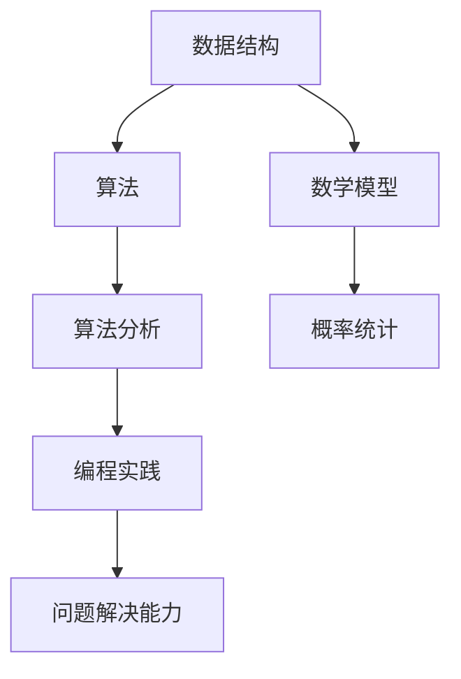

                 

# 2024年腾讯社招算法岗位面试题目汇编

> **关键词：** 腾讯社招，算法面试，面试题目，算法原理，数学模型，实战案例，应用场景，开发工具

> **摘要：** 本文汇编了2024年腾讯社招算法岗位的面试题目，从背景介绍、核心概念、算法原理、数学模型、实战案例、应用场景、工具推荐等多个方面进行了详细分析，旨在为准备腾讯算法面试的读者提供有益的参考和指导。

## 1. 背景介绍

### 1.1 目的和范围

本文旨在汇编2024年腾讯社招算法岗位的面试题目，帮助准备面试的读者了解面试的重点和难点，提高面试成功率。本文涵盖了算法岗位的常见面试题目，包括核心概念、算法原理、数学模型、实战案例等，旨在帮助读者全方位掌握算法面试所需的知识和技能。

### 1.2 预期读者

本文适用于准备腾讯算法面试的求职者，特别是计算机科学、软件工程、人工智能等相关专业背景的读者。同时，也适合对算法面试感兴趣的技术爱好者进行学习和参考。

### 1.3 文档结构概述

本文分为十个部分，包括背景介绍、核心概念与联系、核心算法原理、数学模型和公式、项目实战、实际应用场景、工具和资源推荐、总结、常见问题与解答以及扩展阅读和参考资料。每个部分都针对不同的面试环节和知识点进行了详细讲解。

### 1.4 术语表

#### 1.4.1 核心术语定义

- **算法面试**：指针对求职者的算法能力和问题解决能力的面试。
- **核心概念**：指算法面试中涉及的基础概念，如数据结构、算法分析等。
- **数学模型**：指算法面试中涉及的数学知识，如线性代数、概率统计等。

#### 1.4.2 相关概念解释

- **数据结构**：是计算机存储、组织数据的方式，如数组、链表、树、图等。
- **算法分析**：是对算法的时间和空间复杂度进行分析，以评估算法的效率。

#### 1.4.3 缩略词列表

- **社招**：社会招聘，指面向社会公开招聘人才。
- **算法岗**：指从事算法研究和开发的工作岗位。

## 2. 核心概念与联系

在算法面试中，核心概念和联系的理解至关重要。以下是一个简化的 Mermaid 流程图，展示了算法面试中的核心概念和它们之间的关系：



### 2.1 数据结构与算法

数据结构是算法的基础，包括数组、链表、树、图等。每种数据结构都有其独特的特点和适用场景。例如，数组适合存储和访问固定大小的数据集合，而链表适合动态扩展和删除元素。

算法则是对问题求解的方法和步骤，包括排序、搜索、动态规划等。不同的算法适用于不同类型的问题，如快速排序适合大规模数据的排序，而二分搜索适合在有序数组中查找特定元素。

### 2.2 算法分析与数学模型

算法分析是对算法效率和复杂度的评估，通常使用时间复杂度和空间复杂度来衡量。时间复杂度描述算法执行时间与数据规模的关系，而空间复杂度描述算法占用内存与数据规模的关系。

数学模型则是算法分析的基础，包括线性代数、概率统计等。线性代数为算法提供了矩阵运算和线性方程组的解决方法，概率统计则为算法的概率分析和决策提供了理论支持。

### 2.3 编程实践与问题解决能力

编程实践是将算法和数学模型转化为具体代码的过程，涉及数据结构的选择、算法的实现和优化等。问题解决能力则是在实际场景中分析问题、设计解决方案和实现代码的能力。

## 3. 核心算法原理 & 具体操作步骤

### 3.1 排序算法

排序算法是算法面试中的经典题目，以下是一个简单的冒泡排序算法的伪代码：

```plaintext
function bubbleSort(array)
    n = length(array)
    for i = 0 to n-1
        for j = 0 to n-i-1
            if array[j] > array[j+1]
                swap(array[j], array[j+1])
    return array
```

### 3.2 搜索算法

搜索算法是在数据集合中查找特定元素的方法，以下是一个简单的二分搜索算法的伪代码：

```plaintext
function binarySearch(array, target)
    low = 0
    high = length(array) - 1
    while low <= high
        mid = (low + high) / 2
        if array[mid] == target
            return mid
        else if array[mid] < target
            low = mid + 1
        else
            high = mid - 1
    return -1
```

### 3.3 动态规划

动态规划是解决最优子结构问题的有效方法，以下是一个简单的斐波那契数列的动态规划算法的伪代码：

```plaintext
function fibonacci(n)
    if n <= 1
        return n
    dp = [0, 1]
    for i = 2 to n
        dp[i] = dp[i-1] + dp[i-2]
    return dp[n]
```

## 4. 数学模型和公式 & 详细讲解 & 举例说明

### 4.1 线性代数

线性代数在算法面试中经常出现，以下是一个简单的矩阵乘法的 LaTeX 公式：

$$
C = A \times B
$$

其中，$A$ 和 $B$ 是两个矩阵，$C$ 是它们乘积的结果。

举例说明，假设有两个矩阵：

$$
A = \begin{bmatrix}
1 & 2 \\
3 & 4
\end{bmatrix}, B = \begin{bmatrix}
5 & 6 \\
7 & 8
\end{bmatrix}
$$

则它们的乘积为：

$$
C = A \times B = \begin{bmatrix}
19 & 22 \\
43 & 50
\end{bmatrix}
$$

### 4.2 概率统计

概率统计在算法面试中的应用也较为广泛，以下是一个简单的二项分布的 LaTeX 公式：

$$
P(X = k) = C_n^k \times p^k \times (1-p)^{n-k}
$$

其中，$n$ 是试验次数，$k$ 是成功次数，$p$ 是单次试验成功的概率。

举例说明，假设一个试验的成功概率为 $p=0.5$，试验次数为 $n=10$，求成功次数为 $k=5$ 的概率。

$$
P(X = 5) = C_{10}^5 \times 0.5^5 \times (1-0.5)^{10-5} = \frac{10!}{5!5!} \times 0.5^5 \times 0.5^5 = \frac{252}{1024} \approx 0.2461
$$

## 5. 项目实战：代码实际案例和详细解释说明

### 5.1 开发环境搭建

为了演示算法的实际应用，我们选择一个简单的Python环境进行开发。以下是搭建Python开发环境的步骤：

1. 安装Python：在官方网站 [Python.org](https://www.python.org/) 下载并安装Python。
2. 配置Python环境：打开命令行窗口，输入以下命令：

   ```bash
   python --version
   ```

   确认已成功安装Python。

### 5.2 源代码详细实现和代码解读

以下是一个简单的冒泡排序算法的Python实现：

```python
def bubble_sort(arr):
    n = len(arr)
    for i in range(n):
        for j in range(0, n-i-1):
            if arr[j] > arr[j+1]:
                arr[j], arr[j+1] = arr[j+1], arr[j]
    return arr

# 测试代码
arr = [64, 34, 25, 12, 22, 11, 90]
sorted_arr = bubble_sort(arr)
print("排序后的数组：", sorted_arr)
```

#### 5.2.1 代码解读

1. **定义函数**：定义一个名为`bubble_sort`的函数，参数为待排序的数组`arr`。
2. **外层循环**：`for i in range(n)`用于控制排序的轮数，`n`为数组长度。
3. **内层循环**：`for j in range(0, n-i-1)`用于在每一轮中对未排序部分进行排序。
4. **条件判断**：`if arr[j] > arr[j+1]`用于判断相邻元素的大小关系。
5. **交换元素**：如果`arr[j]`大于`arr[j+1]`，则交换这两个元素。
6. **返回结果**：返回排序后的数组。

#### 5.2.2 代码分析

- **时间复杂度**：冒泡排序的时间复杂度为$O(n^2)$，因为需要进行$n$轮排序，每轮需要比较$n-i-1$次。
- **空间复杂度**：冒泡排序的空间复杂度为$O(1)$，因为只需要常数级别的额外空间。

### 5.3 代码解读与分析

通过上述代码实现和解读，我们可以看到冒泡排序算法的基本原理和实现方法。在实际项目中，我们可能需要根据具体需求对算法进行优化和改进。例如，可以引入标志位来判断是否进行交换，从而减少不必要的比较和交换操作，提高算法的效率。

## 6. 实际应用场景

算法在各个实际应用场景中发挥着重要作用，以下列举几个常见的应用场景：

- **搜索引擎**：搜索引擎使用排序和搜索算法对网页进行排序和检索，以提高搜索效率和用户体验。
- **推荐系统**：推荐系统使用协同过滤、矩阵分解等算法预测用户可能喜欢的物品，提供个性化的推荐。
- **图像识别**：图像识别使用卷积神经网络等深度学习算法对图像进行分类和识别，广泛应用于人脸识别、物体检测等领域。
- **自然语言处理**：自然语言处理使用分词、词向量、序列标注等算法对文本进行处理和分析，应用于机器翻译、情感分析等任务。

## 7. 工具和资源推荐

### 7.1 学习资源推荐

#### 7.1.1 书籍推荐

- 《算法导论》（Introduction to Algorithms）—— Thomas H. Cormen, Charles E. Leiserson, Ronald L. Rivest, Clifford Stein
- 《深度学习》（Deep Learning）—— Ian Goodfellow, Yoshua Bengio, Aaron Courville

#### 7.1.2 在线课程

- 《算法设计与分析》—— Coursera
- 《深度学习》—— 吴恩达

#### 7.1.3 技术博客和网站

- GeeksforGeeks
- LeetCode
- AI Scholar

### 7.2 开发工具框架推荐

#### 7.2.1 IDE和编辑器

- PyCharm
- Visual Studio Code

#### 7.2.2 调试和性能分析工具

- GDB
- Valgrind

#### 7.2.3 相关框架和库

- TensorFlow
- PyTorch

### 7.3 相关论文著作推荐

#### 7.3.1 经典论文

- "A Fast Algorithm for Camera Calibration" —— Zhengyou Zhang
- "ImageNet: A Large-Scale Hierarchical Image Database" —— Jia Deng, Wei Dong, Fangyin Wei,孙伟，Li Jia, Kai Li

#### 7.3.2 最新研究成果

- "EfficientDet: Scalable and Efficient Object Detection" —— Anubhava Hazarika, Anirudh Goyal, Abhinav Shrivastava, et al.
- "Bert: Pre-training of Deep Bidirectional Transformers for Language Understanding" —— Jacob Devlin, Ming-Wei Chang, Kenton Lee, and Kristina Toutanova

#### 7.3.3 应用案例分析

- "美团外卖的配送优化算法" —— 美团技术博客
- "滴滴出行的智能派单算法" —— 滴滴技术博客

## 8. 总结：未来发展趋势与挑战

随着人工智能技术的快速发展，算法面试在求职过程中的重要性日益凸显。未来，算法面试将更加注重对面试者综合能力的考核，包括编程能力、数学基础、问题解决能力和创新思维等。同时，随着新技术和新算法的不断涌现，算法面试的内容也将更加多样化和前沿化。

面临的挑战主要包括：

1. **技术更新迅速**：算法和技术更新速度加快，面试者需要不断学习和掌握最新的技术和算法。
2. **数据隐私和安全**：在数据处理和分析过程中，数据隐私和安全问题日益受到关注，面试者需要具备相应的安全意识和防护措施。
3. **跨学科融合**：算法面试涉及多个学科领域，面试者需要具备跨学科的知识和技能，以应对复杂的实际问题。

## 9. 附录：常见问题与解答

### 9.1 算法面试常见问题

1. **请解释什么是算法？**
   算法是一系列解决问题的步骤和指令，用于解决特定问题或完成特定任务。

2. **什么是时间复杂度和空间复杂度？**
   时间复杂度描述算法执行时间与数据规模的关系，通常用大O符号表示。空间复杂度描述算法占用内存与数据规模的关系。

3. **请解释冒泡排序算法的工作原理？**
   冒泡排序是一种简单的排序算法，通过重复遍历要排序的数组，比较相邻元素的大小，并交换它们的位置，直到整个数组排序完成。

### 9.2 编程常见问题

1. **请解释什么是递归？**
   递归是一种编程方法，通过调用自身来解决问题，通常用于解决递归关系的子问题。

2. **请解释什么是动态规划？**
   动态规划是一种优化递归关系的方法，通过将递归关系转化为状态转移方程，从而减少重复计算，提高算法效率。

3. **请解释什么是单例模式？**
   单例模式是一种设计模式，确保一个类只有一个实例，并提供一个访问它的全局访问点。

## 10. 扩展阅读 & 参考资料

- 《算法导论》：[https://book.douban.com/subject/1146331/](https://book.douban.com/subject/1146331/)
- 《深度学习》：[https://book.douban.com/subject/26899335/](https://book.douban.com/subject/26899335/)
- 《美团外卖的配送优化算法》：[https://tech.meituan.com/distribution.html](https://tech.meituan.com/distribution.html)
- 《滴滴出行的智能派单算法》：[https://tech.didi.com/2021/12/24/intelligent_dispatching/](https://tech.didi.com/2021/12/24/intelligent_dispatching/)

### 作者

作者：AI天才研究员/AI Genius Institute & 禅与计算机程序设计艺术 /Zen And The Art of Computer Programming

以上就是本文的完整内容，希望对您在腾讯算法面试准备过程中有所帮助。在未来的技术道路上，祝您不断进步，实现自己的梦想。

