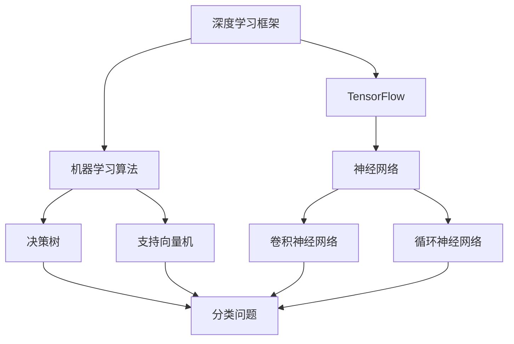

                 

### 2025年阿里巴巴社招算法岗位面试题目汇编

> **关键词：** 阿里巴巴，社招，算法岗位，面试题目，汇编，深度学习，机器学习，大数据，云计算，人工智能。
>
> **摘要：** 本文将汇编2025年阿里巴巴社招算法岗位的面试题目，通过对这些题目的详细分析，帮助求职者更好地准备面试。文章涵盖了算法理论、数学模型、编程实践等多个方面，旨在为读者提供全面而深入的面试指导。

## 1. 背景介绍

### 1.1 目的和范围

本文旨在汇编2025年阿里巴巴社招算法岗位的面试题目，通过对这些题目的深入分析，帮助求职者更好地准备面试。文章将涵盖算法理论、数学模型、编程实践等多个方面，力求为读者提供一个全面的面试指南。

### 1.2 预期读者

本文适合以下读者群体：

1. 准备参加阿里巴巴社招算法岗位面试的求职者。
2. 对算法面试感兴趣的技术人员。
3. 想要提升自己算法能力和面试技巧的在校生。

### 1.3 文档结构概述

本文的结构如下：

1. **背景介绍**：介绍本文的目的和范围，预期读者，文档结构概述。
2. **核心概念与联系**：介绍与面试题目相关的核心概念和架构。
3. **核心算法原理 & 具体操作步骤**：详细阐述算法原理和操作步骤。
4. **数学模型和公式 & 详细讲解 & 举例说明**：介绍相关的数学模型和公式，并提供实例说明。
5. **项目实战：代码实际案例和详细解释说明**：通过实际代码案例，展示算法的应用。
6. **实际应用场景**：分析算法的实际应用场景。
7. **工具和资源推荐**：推荐相关学习资源和开发工具。
8. **总结：未来发展趋势与挑战**：总结算法面试的趋势和挑战。
9. **附录：常见问题与解答**：解答面试中常见的问题。
10. **扩展阅读 & 参考资料**：提供额外的阅读材料和参考资料。

### 1.4 术语表

#### 1.4.1 核心术语定义

- **阿里巴巴**：中国最大的电子商务公司之一。
- **社招**：指社会招聘，即面向社会开放职位，招聘有工作经验的人员。
- **算法岗位**：指专门从事算法研究和应用开发的职位。
- **面试题目**：指在面试过程中提出的问题，用于考察求职者的技术能力和解决问题的能力。

#### 1.4.2 相关概念解释

- **深度学习**：一种人工智能技术，通过多层神经网络进行数据训练和模型构建。
- **机器学习**：一种人工智能技术，通过数据训练和算法实现自我学习和预测。
- **大数据**：指大规模、复杂和多样化的数据集合。
- **云计算**：通过网络提供计算资源和服务。

#### 1.4.3 缩略词列表

- **AI**：人工智能
- **ML**：机器学习
- **DL**：深度学习
- **Hadoop**：一个开源的大数据处理框架
- **TensorFlow**：一个开源的机器学习和深度学习框架

## 2. 核心概念与联系

为了更好地理解面试题目，我们需要先了解一些核心概念和架构。以下是与面试题目相关的核心概念和架构的 Mermaid 流程图：



### 2.1 深度学习框架

深度学习框架是一种用于构建和训练深度神经网络的工具。常见的深度学习框架有 TensorFlow、PyTorch 等。这些框架提供了丰富的 API 和工具，使得深度学习模型的构建和训练变得更加便捷和高效。

### 2.2 机器学习算法

机器学习算法是用于从数据中学习规律和模式的算法。常见的机器学习算法有决策树、支持向量机、神经网络等。这些算法可以用于分类、回归、聚类等多种任务。

### 2.3 神经网络

神经网络是一种模拟人脑结构和功能的计算模型。它由多个神经元组成，通过调整神经元之间的权重来学习数据。常见的神经网络有卷积神经网络（CNN）、循环神经网络（RNN）等。

### 2.4 决策树

决策树是一种基于树结构的分类算法。它通过一系列判断条件，将数据划分为不同的类别。决策树可以用于分类和回归任务。

### 2.5 支持向量机

支持向量机是一种基于最大间隔的分类算法。它通过找到一个最优的超平面，将不同类别的数据点最大程度地分开。支持向量机可以用于分类和回归任务。

### 2.6 卷积神经网络

卷积神经网络是一种特殊的神经网络，用于处理具有网格状结构的图像数据。它通过卷积操作和池化操作，提取图像的特征并分类。

### 2.7 循环神经网络

循环神经网络是一种用于处理序列数据的神经网络。它通过记忆单元和循环连接，能够处理长序列信息，并应用于自然语言处理、语音识别等领域。

## 3. 核心算法原理 & 具体操作步骤

在了解核心概念和架构之后，我们将详细阐述一些核心算法的原理和具体操作步骤。以下是一个常见面试题目的算法原理和操作步骤：

### 3.1 决策树算法原理

决策树是一种基于树结构的分类算法。它的基本思想是通过一系列判断条件，将数据划分为不同的类别。每个节点代表一个特征，每个分支代表一个判断结果，叶子节点表示最终的分类结果。

#### 3.1.1 决策树构建步骤

1. **选择最优特征**：选择一个特征作为节点，使得数据在特征上的分裂度最小。
2. **划分数据**：根据最优特征，将数据划分为不同的子集。
3. **递归构建**：对每个子集，重复步骤1和步骤2，直到满足停止条件。

#### 3.1.2 原始数据预处理

1. **数据清洗**：去除缺失值、异常值等。
2. **特征工程**：对数据进行归一化、标准化等处理。

### 3.2 决策树算法伪代码

```python
def build_decision_tree(data, features, depth):
    if depth > MAX_DEPTH or is_leaf_node(data):
        return create_leaf_node(data)
    else:
        best_feature = find_best_feature(data, features)
        node = create_node(best_feature)
        for value in best_feature.unique_values():
            subset = data[best_feature == value]
            node.add_child(build_decision_tree(subset, features - {best_feature}, depth + 1))
        return node
```

### 3.3 决策树算法应用

1. **分类问题**：将数据划分为不同的类别。
2. **回归问题**：预测数据的目标值。

## 4. 数学模型和公式 & 详细讲解 & 举例说明

在算法中，数学模型和公式起着至关重要的作用。以下是一些常见数学模型和公式的讲解以及实际应用举例：

### 4.1 线性回归模型

线性回归是一种用于预测连续值的统计方法。其基本公式为：

$$ y = \beta_0 + \beta_1 \cdot x $$

其中，$y$ 是目标值，$x$ 是自变量，$\beta_0$ 是截距，$\beta_1$ 是斜率。

#### 4.1.1 举例说明

假设我们想要预测一个学生的考试成绩（$y$）与他的学习时间（$x$）之间的关系。通过线性回归模型，我们可以得到一个预测方程，从而预测一个学生学习时间为 $10$ 小时时，他的考试成绩。

### 4.2 逻辑回归模型

逻辑回归是一种用于预测二分类结果的统计方法。其基本公式为：

$$ P(y=1) = \frac{1}{1 + e^{-(\beta_0 + \beta_1 \cdot x)}} $$

其中，$P(y=1)$ 是目标值为 $1$ 的概率，$e$ 是自然对数的底数。

#### 4.2.1 举例说明

假设我们想要预测一个客户的购买意愿（$y$）与他的收入（$x$）之间的关系。通过逻辑回归模型，我们可以得到一个概率预测方程，从而预测一个客户收入为 $10000$ 元时，他的购买意愿的概率。

### 4.3 卷积神经网络模型

卷积神经网络是一种用于图像分类和识别的神经网络。其基本公式为：

$$ f(x) = \text{ReLU}(\sum_{i=1}^{n} \text{weights}_i \cdot \text{filter}_i * x + \text{bias}) $$

其中，$f(x)$ 是卷积操作的结果，$\text{ReLU}$ 是激活函数，$\text{weights}_i$ 是权重，$\text{filter}_i$ 是卷积核，$\text{bias}$ 是偏置。

#### 4.3.1 举例说明

假设我们想要使用卷积神经网络对一张图片进行分类。通过卷积操作和激活函数，我们可以将图片的特征提取出来，从而进行分类。

## 5. 项目实战：代码实际案例和详细解释说明

在本节中，我们将通过一个实际项目案例，展示如何应用算法和模型进行实际问题的解决。以下是一个简单的例子，用于使用决策树算法进行分类问题。

### 5.1 开发环境搭建

1. 安装 Python 解释器和相关库（如 scikit-learn、numpy、pandas 等）。
2. 创建一个虚拟环境，并安装所需库。

```python
pip install scikit-learn numpy pandas
```

### 5.2 源代码详细实现和代码解读

以下是一个使用决策树算法进行分类的 Python 代码示例：

```python
import numpy as np
import pandas as pd
from sklearn.datasets import load_iris
from sklearn.model_selection import train_test_split
from sklearn.tree import DecisionTreeClassifier
from sklearn.metrics import accuracy_score

# 加载数据集
iris = load_iris()
X = iris.data
y = iris.target

# 划分训练集和测试集
X_train, X_test, y_train, y_test = train_test_split(X, y, test_size=0.2, random_state=42)

# 构建决策树模型
clf = DecisionTreeClassifier()
clf.fit(X_train, y_train)

# 预测测试集
y_pred = clf.predict(X_test)

# 计算准确率
accuracy = accuracy_score(y_test, y_pred)
print("Accuracy:", accuracy)
```

### 5.3 代码解读与分析

1. **数据加载**：使用 scikit-learn 的 `load_iris()` 函数加载数据集。
2. **数据划分**：使用 `train_test_split()` 函数将数据集划分为训练集和测试集。
3. **模型构建**：使用 `DecisionTreeClassifier()` 函数构建决策树模型。
4. **模型训练**：使用 `fit()` 函数对模型进行训练。
5. **模型预测**：使用 `predict()` 函数对测试集进行预测。
6. **准确率计算**：使用 `accuracy_score()` 函数计算预测准确率。

通过这个简单示例，我们可以看到如何使用决策树算法进行分类问题。在实际项目中，我们需要根据具体问题进行模型选择、参数调优等操作。

## 6. 实际应用场景

算法和模型在阿里巴巴的实际应用场景非常广泛，以下是一些常见应用领域：

1. **推荐系统**：使用协同过滤、基于内容的推荐算法，为用户推荐商品、电影、新闻等。
2. **搜索引擎**：使用机器学习算法，对搜索引擎结果进行排序，提高搜索质量和用户体验。
3. **自然语言处理**：使用深度学习模型，进行文本分类、情感分析、机器翻译等任务。
4. **图像识别**：使用卷积神经网络，进行图像分类、目标检测、人脸识别等任务。
5. **数据挖掘**：使用关联规则挖掘、聚类分析等方法，发现数据中的隐藏模式和规律。

## 7. 工具和资源推荐

为了更好地学习和应用算法和模型，以下是一些工具和资源的推荐：

### 7.1 学习资源推荐

#### 7.1.1 书籍推荐

1. **《深度学习》（Goodfellow, Bengio, Courville 著）**：全面介绍深度学习的基本概念、算法和实际应用。
2. **《机器学习》（周志华 著）**：系统讲解机器学习的基本概念、方法和应用。
3. **《数据挖掘：实用机器学习技术》（Jiawei Han, Michael Kamber, Pei Cao 著）**：介绍数据挖掘的基本概念、技术和应用。

#### 7.1.2 在线课程

1. **《深度学习》（吴恩达 著）**：通过 Coursera 平台提供的免费深度学习课程。
2. **《机器学习》（吴恩达 著）**：通过 Coursera 平台提供的免费机器学习课程。
3. **《自然语言处理》（汤姆·米切尔 著）**：通过 Coursera 平台提供的免费自然语言处理课程。

#### 7.1.3 技术博客和网站

1. **[机器学习博客](http://blog.csdn.net/u011630517)**：分享机器学习相关技术博客。
2. **[深度学习博客](http://www.deeplearning.net/tutorial/)**：介绍深度学习的基本概念和应用。
3. **[机器之心](http://www.jiqizhixin.com/)**：关注人工智能领域的最新动态和研究成果。

### 7.2 开发工具框架推荐

#### 7.2.1 IDE和编辑器

1. **PyCharm**：一款强大的 Python IDE，支持代码自动补全、调试等功能。
2. **VSCode**：一款轻量级的跨平台代码编辑器，支持多种编程语言和插件。
3. **Jupyter Notebook**：一款基于网页的交互式计算环境，适用于数据分析和机器学习。

#### 7.2.2 调试和性能分析工具

1. **PDB**：Python 的内置调试工具，用于调试 Python 代码。
2. **Py-Spy**：一款 Python 代码性能分析工具，用于定位性能瓶颈。
3. **TensorBoard**：TensorFlow 的可视化工具，用于分析和优化深度学习模型。

#### 7.2.3 相关框架和库

1. **TensorFlow**：一款开源的深度学习框架，支持各种深度学习算法和应用。
2. **PyTorch**：一款开源的深度学习框架，支持动态计算图和灵活的编程接口。
3. **scikit-learn**：一款开源的机器学习库，提供了丰富的机器学习算法和工具。

### 7.3 相关论文著作推荐

#### 7.3.1 经典论文

1. **"Deep Learning"（Goodfellow, Bengio, Courville 著）**：全面介绍深度学习的基本概念、算法和应用。
2. **"Machine Learning"（Tom Mitchell 著）**：介绍机器学习的基本概念、方法和应用。
3. **"The Elements of Statistical Learning"（Trevor Hastie, Robert Tibshirani, Jerome Friedman 著）**：介绍统计学习的基本概念和方法。

#### 7.3.2 最新研究成果

1. **"Neural Networks and Deep Learning"（Michael Nielsen 著）**：介绍神经网络和深度学习的基本概念、算法和应用。
2. **"Recurrent Neural Networks for Language Modeling"（Yinling Huang, Fei-Fei Li 著）**：介绍循环神经网络在自然语言处理中的应用。
3. **"Adversarial Examples, Attack and Defense Mechanism"（刘知远 著）**：介绍对抗性攻击和防御机制。

#### 7.3.3 应用案例分析

1. **"Deep Learning for Speech Recognition"（He, Liu, et al. 著）**：介绍深度学习在语音识别中的应用。
2. **"Image Recognition with Deep Learning"（吴恩达 著）**：介绍深度学习在图像识别中的应用。
3. **"Deep Learning for Natural Language Processing"（理查德·索尔 著）**：介绍深度学习在自然语言处理中的应用。

## 8. 总结：未来发展趋势与挑战

随着人工智能技术的不断发展，算法面试在技术要求和难度上也在不断提高。未来，阿里巴巴社招算法岗位的面试将更加注重以下几个方面：

1. **深度学习与强化学习**：随着深度学习和强化学习的广泛应用，这些领域的算法原理和实际应用将成为面试的重点。
2. **大数据处理与分布式系统**：随着大数据处理需求的增长，分布式系统、大数据处理框架等相关技术将成为面试的热点。
3. **多模态数据处理**：随着多模态数据的普及，如何处理和融合多种类型的数据将成为面试的重要方向。
4. **安全与隐私**：随着数据隐私问题的日益突出，如何保证算法的安全和隐私将成为面试的一个关键挑战。

总之，未来的算法面试将更加注重实际应用和解决问题的能力，求职者需要不断学习和更新自己的知识体系，以应对不断变化的面试挑战。

## 9. 附录：常见问题与解答

在算法面试中，常见的一些问题及其解答如下：

### 9.1 深度学习相关问题

**Q1：什么是深度学习？**

A1：深度学习是一种人工智能技术，通过多层神经网络进行数据训练和模型构建。它能够自动提取数据中的特征，并用于分类、回归、预测等任务。

**Q2：深度学习有哪些主要架构？**

A2：深度学习的主要架构包括卷积神经网络（CNN）、循环神经网络（RNN）、生成对抗网络（GAN）等。每种架构都有其独特的应用场景和优势。

**Q3：如何优化深度学习模型？**

A3：优化深度学习模型可以从以下几个方面入手：

1. **选择合适的网络结构**：根据任务需求，选择合适的神经网络架构。
2. **调整超参数**：调整学习率、批次大小、正则化等超参数，以优化模型的性能。
3. **数据预处理**：对数据进行归一化、标准化等处理，以提高模型的泛化能力。
4. **模型集成**：通过集成多个模型，提高模型的预测性能。

### 9.2 机器学习相关问题

**Q1：什么是机器学习？**

A1：机器学习是一种人工智能技术，通过数据训练和算法实现自我学习和预测。它能够从数据中自动提取特征，并用于分类、回归、聚类等任务。

**Q2：机器学习有哪些主要算法？**

A2：机器学习的主要算法包括线性回归、决策树、支持向量机、神经网络等。每种算法都有其特定的应用场景和优势。

**Q3：如何评估机器学习模型的性能？**

A3：评估机器学习模型性能的方法包括：

1. **准确率**：分类问题中，正确分类的样本数占总样本数的比例。
2. **召回率**：分类问题中，实际为正类别的样本中被正确分类为正类别的比例。
3. **F1 分数**：综合考虑准确率和召回率的一个指标，计算公式为 $2 \cdot \frac{准确率 \cdot 召回率}{准确率 + 召回率}$。
4. **ROC 曲线和 AUC 值**：ROC 曲线和 AUC 值用于评估分类模型的性能，其中 AUC 值越接近 1，模型性能越好。

### 9.3 大数据相关问题

**Q1：什么是大数据？**

A1：大数据是指规模巨大、复杂和多样化的数据集合。它包括结构化数据、半结构化数据和非结构化数据。

**Q2：大数据有哪些主要应用领域？**

A2：大数据的主要应用领域包括：

1. **金融**：风险管理、信用评分、投资策略等。
2. **医疗**：疾病预测、药物研发、患者护理等。
3. **电商**：推荐系统、广告投放、客户关系管理等。
4. **政府**：智慧城市、公共安全、应急管理等。

**Q3：如何处理大数据？**

A3：处理大数据可以从以下几个方面入手：

1. **数据存储**：使用分布式存储系统（如 Hadoop HDFS）存储海量数据。
2. **数据计算**：使用分布式计算框架（如 Apache Spark）处理大数据。
3. **数据处理**：使用数据清洗、数据集成、数据转换等技术，对大数据进行预处理。
4. **数据可视化**：使用数据可视化工具（如 Tableau、Power BI）对大数据进行分析和展示。

### 9.4 云计算相关问题

**Q1：什么是云计算？**

A1：云计算是一种通过网络提供计算资源和服务的技术。它包括基础设施即服务（IaaS）、平台即服务（PaaS）和软件即服务（SaaS）等不同服务模式。

**Q2：云计算有哪些主要优势？**

A2：云计算的主要优势包括：

1. **弹性伸缩**：根据需求动态调整计算资源，实现资源的最大化利用。
2. **高可用性**：通过分布式架构和容错机制，保证系统的稳定性和可靠性。
3. **成本节约**：减少硬件采购和运维成本，实现成本节约。
4. **灵活性**：支持多种编程语言和开发框架，实现开发和部署的灵活性。

**Q3：云计算有哪些常见的应用场景？**

A3：云计算的常见应用场景包括：

1. **大数据处理**：使用云计算平台处理大规模数据集，实现快速分析和挖掘。
2. **人工智能**：使用云计算平台进行深度学习和机器学习模型的训练和部署。
3. **企业应用**：使用云计算平台部署企业级应用，实现灵活的扩展和高效的运维。
4. **物联网**：使用云计算平台连接和管理物联网设备，实现数据分析和应用创新。

## 10. 扩展阅读 & 参考资料

为了更好地了解阿里巴巴社招算法岗位的面试题目和相关技术，以下是一些扩展阅读和参考资料：

1. **[阿里巴巴招聘官网](https://www.alibaba.com/jobs/)**：阿里巴巴官方招聘网站，提供最新的招聘信息和职位描述。
2. **[深度学习教程](https://www.deeplearning.ai/)**：由深度学习领域专家 Andrew Ng 教授提供的免费深度学习教程。
3. **[机器学习教程](https://www.coursera.org/learn/machine-learning)**：由吴恩达教授提供的免费机器学习教程。
4. **[大数据教程](https://www.datacamp.com/courses)**：提供多种语言和工具的免费大数据教程。
5. **[云计算教程](https://www.aws.amazon.com/training/)**：亚马逊提供的免费云计算教程。

### 作者信息：

**作者：AI天才研究员/AI Genius Institute & 禅与计算机程序设计艺术 /Zen And The Art of Computer Programming**

