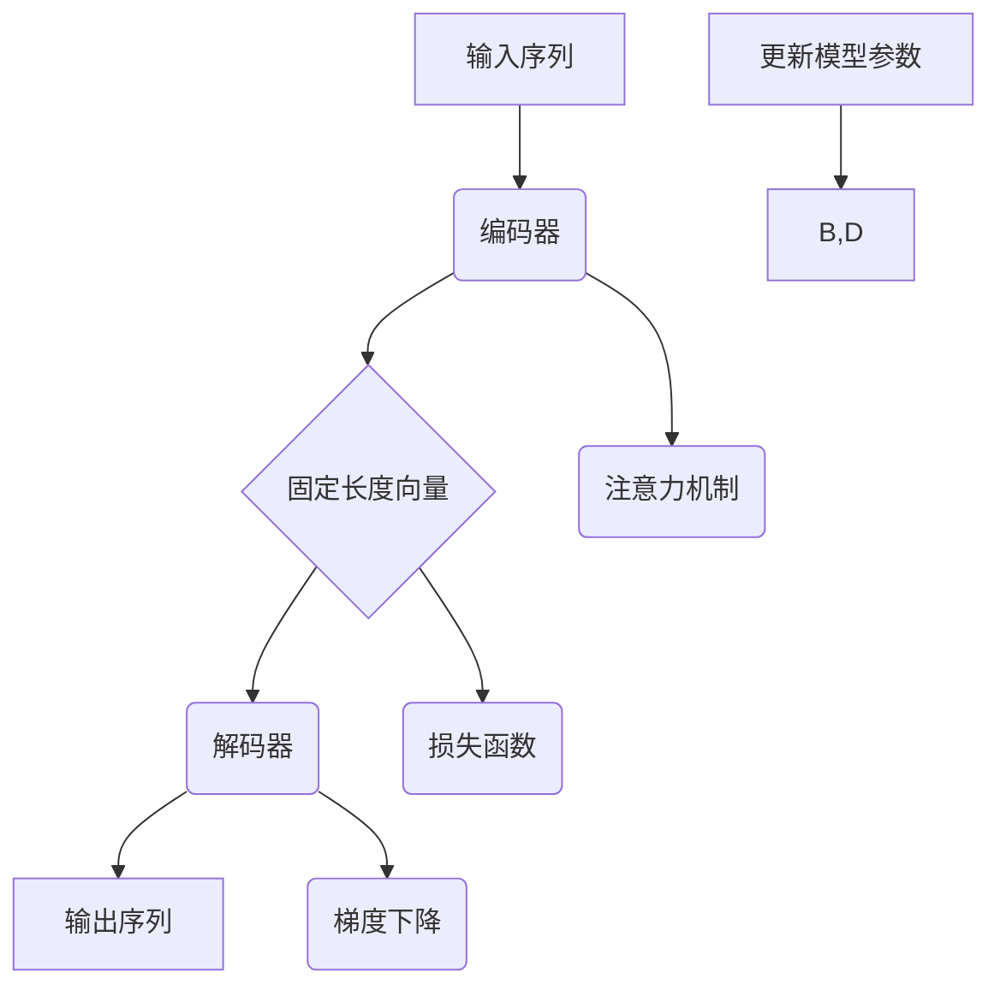

                 

### 序列到序列学习：原理与代码实例讲解

> **关键词：** 序列学习、序列到序列（Seq2Seq）模型、神经网络、编码器、解码器、长短时记忆（LSTM）、循环神经网络（RNN）、注意力机制、端到端学习、翻译、生成文本。

**摘要：** 本文将深入探讨序列到序列学习（Seq2Seq）模型的基本原理、架构及其在现实世界中的应用。通过一系列详尽的实例和代码讲解，我们将了解如何构建并训练一个序列到序列模型，从而实现语言翻译、文本生成等复杂任务。本文旨在为对序列学习感兴趣的读者提供一个全面且易于理解的教程。

## 1. 背景介绍

### 1.1 目的和范围

本文的目标是向读者介绍序列到序列学习（Seq2Seq）模型，一种在自然语言处理（NLP）、机器翻译、文本生成等领域表现卓越的深度学习模型。我们将从基本概念开始，逐步深入到模型的架构、训练过程以及实际应用，力求让读者能够理解并实现自己的Seq2Seq模型。

本文将涵盖以下内容：
- 序列到序列学习的基本概念。
- Seq2Seq模型的架构和核心组成部分。
- 如何使用编码器和解码器进行序列转换。
- 长短时记忆（LSTM）和循环神经网络（RNN）在Seq2Seq模型中的应用。
- 注意力机制的工作原理及其在Seq2Seq模型中的作用。
- 实现一个简单的Seq2Seq模型并进行训练。
- 代码实例和详细解释。
- 序列到序列学习在实际应用中的案例。

### 1.2 预期读者

本文适合以下读者群体：
- 对深度学习和神经网络有一定了解的读者。
- 想要了解序列到序列学习原理和实践的开发者。
- 有意向从事自然语言处理、机器翻译等领域的科研人员。
- 普通技术爱好者，对人工智能和机器学习有兴趣。

### 1.3 文档结构概述

本文结构如下：
1. **背景介绍**：介绍序列到序列学习的目的、范围、预期读者以及文档结构。
2. **核心概念与联系**：解释序列到序列学习的基本概念，并提供一个Mermaid流程图。
3. **核心算法原理 & 具体操作步骤**：详细阐述Seq2Seq模型的工作原理，并使用伪代码进行讲解。
4. **数学模型和公式 & 详细讲解 & 举例说明**：介绍Seq2Seq模型涉及的数学模型和公式，并通过实例进行说明。
5. **项目实战：代码实际案例和详细解释说明**：通过具体项目实例，展示如何实现和训练一个Seq2Seq模型。
6. **实际应用场景**：探讨序列到序列学习在现实世界中的应用。
7. **工具和资源推荐**：推荐学习资源和开发工具。
8. **总结：未来发展趋势与挑战**：总结文章内容，展望未来发展趋势。
9. **附录：常见问题与解答**：提供常见问题的解答。
10. **扩展阅读 & 参考资料**：推荐相关阅读材料。

### 1.4 术语表

为了确保文章的可读性和一致性，本文将定义一些关键术语，并提供相关概念的解释。

#### 1.4.1 核心术语定义

- **序列学习（Sequential Learning）**：一种机器学习方法，用于处理按时间或顺序排列的数据。
- **编码器（Encoder）**：神经网络结构，用于将输入序列编码为固定长度的向量表示。
- **解码器（Decoder）**：神经网络结构，用于将编码器生成的固定长度向量解码为输出序列。
- **长短时记忆（Long Short-Term Memory，LSTM）**：一种特殊的循环神经网络，用于处理长时间依赖关系。
- **循环神经网络（Recurrent Neural Network，RNN）**：一种神经网络，能够记住前面的输入并利用这个信息来处理后续的输入。
- **注意力机制（Attention Mechanism）**：一种用于改善Seq2Seq模型性能的技术，能够使模型在解码过程中关注输入序列的不同部分。
- **端到端学习（End-to-End Learning）**：一种直接从输入到输出的训练方法，不需要额外的特征工程或预处理步骤。

#### 1.4.2 相关概念解释

- **序列（Sequence）**：一系列按时间或顺序排列的元素。
- **嵌入（Embedding）**：将输入序列中的元素映射到一个高维空间中，以便神经网络处理。
- **损失函数（Loss Function）**：用于衡量模型预测与实际输出之间的差异的函数。
- **梯度下降（Gradient Descent）**：一种优化算法，用于最小化损失函数。
- **批次（Batch）**：训练数据的一部分，用于一次训练神经网络。

#### 1.4.3 缩略词列表

- **Seq2Seq**：序列到序列学习。
- **LSTM**：长短时记忆。
- **RNN**：循环神经网络。
- **NLP**：自然语言处理。
- **IDE**：集成开发环境。
- **GPU**：图形处理器。

## 2. 核心概念与联系

在深入探讨序列到序列学习之前，我们需要了解一些核心概念及其相互关系。以下是一个Mermaid流程图，展示了序列到序列学习的基本流程和关键组成部分。



### 2.1 输入序列

输入序列是序列到序列学习模型的处理对象。它可以是一个单词序列、一段文本或者一系列连续的数值。输入序列的长度可以不同，但通常我们会将其调整为固定长度，以便神经网络处理。

### 2.2 编码器

编码器是序列到序列学习模型中的第一个神经网络结构，它的作用是将输入序列编码为固定长度的向量表示。这个过程通常涉及到嵌入层、编码层和某些类型的循环神经网络（如LSTM或GRU）。编码器的输出是一个固定长度的向量，称为编码表示（Encoded Representation）。

### 2.3 固定长度向量

编码器的输出是一个固定长度的向量，它包含了输入序列的编码信息。这个向量可以看作是输入序列的“摘要”或“摘要向量”，用于后续的解码过程。

### 2.4 解码器

解码器是序列到序列学习模型中的第二个神经网络结构，它的作用是将编码器的输出解码为输出序列。解码器通常包含一个嵌入层、解码层和注意力机制。通过这些层，解码器能够生成一个预测的输出序列。

### 2.5 输出序列

输出序列是序列到序列学习模型的最终输出。它通常是一个与输入序列相对应的目标序列，例如，在机器翻译任务中，输入序列是源语言文本，输出序列是目标语言文本。

### 2.6 注意力机制

注意力机制是一种用于改善序列到序列模型性能的技术。它允许解码器在解码过程中关注输入序列的不同部分。通过这种机制，模型能够更好地利用输入序列的信息，提高预测的准确性。

### 2.7 损失函数和梯度下降

损失函数用于衡量模型预测与实际输出之间的差异。在序列到序列学习中，常用的损失函数是交叉熵（Cross-Entropy）。梯度下降是一种优化算法，用于最小化损失函数，从而更新模型的参数。

### 2.8 更新模型参数

通过梯度下降，模型参数会根据损失函数的梯度进行调整。这个过程称为模型训练。在训练过程中，模型会逐渐学习到输入序列和输出序列之间的映射关系。

通过上述核心概念和流程图的结合，我们可以对序列到序列学习有一个初步的理解。在接下来的章节中，我们将进一步深入探讨每个概念，并通过具体的算法原理和实例来加深理解。

## 3. 核心算法原理 & 具体操作步骤

序列到序列（Seq2Seq）模型是一种用于处理序列数据的深度学习架构，特别适用于将一种序列映射到另一种序列的任务，如机器翻译、语音识别和文本摘要等。以下是序列到序列模型的核心算法原理和具体操作步骤。

### 3.1 Seq2Seq模型的基本概念

#### 3.1.1 编码器（Encoder）

编码器是Seq2Seq模型的第一部分，它的任务是接收输入序列（例如，一个句子或一段语音）并将其转换为一个固定大小的向量表示。这个向量表示称为编码表示（Encoded Representation），它包含了输入序列的语义信息。编码器通常使用一个循环神经网络（RNN）或其变种（如LSTM或GRU）来实现，这样可以捕捉序列中的长期依赖关系。

#### 3.1.2 解码器（Decoder）

解码器是Seq2Seq模型的第二部分，它的任务是接受编码器的输出（编码表示）并生成输出序列。解码器同样使用一个RNN或LSTM，并且通常在顶部添加一个注意力机制，以便更好地利用编码器的输出。

#### 3.1.3 注意力机制（Attention Mechanism）

注意力机制是一种允许解码器在生成每个输出单元时关注输入序列的不同部分的机制。它通过计算编码器的输出和当前解码器状态之间的相似性来分配权重，使得解码器能够更加集中地处理输入序列中的关键部分。

### 3.2 具体操作步骤

以下是构建和训练一个简单的Seq2Seq模型的伪代码步骤：

```python
# 编写伪代码，描述Seq2Seq模型的操作步骤

# 初始化编码器和解码器模型
encoder = Encoder(input_size, hidden_size, dropout_rate)
decoder = Decoder(hidden_size, output_size, dropout_rate, attention机制)

# 定义损失函数和优化器
loss_function = CrossEntropyLoss()
optimizer = Adam(encoder.parameters() + decoder.parameters(), lr=learning_rate)

# 训练模型
for epoch in range(num_epochs):
    for input_sequence, target_sequence in data_loader:
        # 前向传播
        encoder_output = encoder(input_sequence)
        decoder_output = decoder(encoder_output, target_sequence)

        # 计算损失
        loss = loss_function(decoder_output, target_sequence)

        # 反向传播和优化
        optimizer.zero_grad()
        loss.backward()
        optimizer.step()

        # 打印训练进度
        if (batch_index + 1) % print_freq == 0:
            print(f'Epoch [{epoch+1}/{num_epochs}], Batch [{batch_index+1}/{num_batches}], Loss: {loss.item()}')

# 模型评估
with torch.no_grad():
    correct_predictions = 0
    total_predictions = 0
    for input_sequence, target_sequence in validation_data_loader:
        encoder_output = encoder(input_sequence)
        decoder_output = decoder(encoder_output, target_sequence)
        predictions = decoder_output.argmax(dim=1)
        correct_predictions += (predictions == target_sequence).sum().item()
        total_predictions += predictions.size(0)
    accuracy = correct_predictions / total_predictions
    print(f'Validation Accuracy: {accuracy:.4f}')
```

### 3.3 详细讲解

#### 3.3.1 编码器

编码器的主要任务是处理输入序列，并生成一个固定大小的编码表示。以下是一个简单的伪代码，描述了编码器的操作：

```python
class Encoder(nn.Module):
    def __init__(self, input_size, hidden_size, dropout_rate):
        super(Encoder, self).__init__()
        self.embedding = nn.Embedding(input_size, hidden_size)
        self.lstm = nn.LSTM(hidden_size, hidden_size, dropout=dropout_rate)
        
    def forward(self, input_sequence):
        embedded = self.embedding(input_sequence)
        encoder_output, (hidden, cell) = self.lstm(embedded)
        return encoder_output, hidden, cell
```

在这个例子中，`input_sequence`是一个长度为`T`的序列，其中`T`是时间步的数量。编码器的输出是一个`T x B x D`的矩阵，其中`B`是批大小，`D`是隐藏层的大小。此外，`encoder_output`包含了每个时间步的隐藏状态，而`hidden`和`cell`是最后一个时间步的隐藏状态和细胞状态。

#### 3.3.2 解码器

解码器的主要任务是接受编码器的输出，并生成输出序列。以下是一个简单的伪代码，描述了解码器的操作：

```python
class Decoder(nn.Module):
    def __init__(self, hidden_size, output_size, dropout_rate, attention):
        super(Decoder, self).__init__()
        self.embedding = nn.Embedding(output_size, hidden_size)
        self.lstm = nn.LSTM(hidden_size, hidden_size, dropout=dropout_rate)
        self.attention = attention
        self.fc = nn.Linear(hidden_size, output_size)
        
    def forward(self, encoder_output, target_sequence):
        embedded = self.embedding(target_sequence)
        decoder_output, (hidden, cell) = self.lstm(embedded, (encoder_output[-1], encoder_output[-1]))
        attention_weights = self.attention(encoder_output, hidden)
        context = torch.bmm(attention_weights.unsqueeze(1), encoder_output.unsqueeze(0)).squeeze(0)
        output = self.fc(torch.cat((hidden.squeeze(0), context), dim=1))
        return output, hidden, cell
```

在这个例子中，`encoder_output`是编码器的输出，`target_sequence`是解码器的输入序列。解码器的输出是一个`T x B x V`的矩阵，其中`V`是输出词汇表的大小。此外，`decoder_output`包含了每个时间步的输出概率分布。

#### 3.3.3 注意力机制

注意力机制是实现解码器的关键部分，它允许模型在解码每个输出时关注输入序列的不同部分。以下是一个简单的注意力机制的伪代码：

```python
class Attention(nn.Module):
    def __init__(self, hidden_size):
        super(Attention, self).__init__()
        self.attn = nn.Linear(hidden_size, 1)
        
    def forward(self, encoder_output, hidden):
        attn_weights = torch.softmax(self.attn(encoder_output), dim=1)
        context = torch.bmm(attn_weights.unsqueeze(1), encoder_output.unsqueeze(0)).squeeze(0)
        return context
```

在这个例子中，`encoder_output`是编码器的输出，`hidden`是解码器的隐藏状态。注意力机制的计算结果是一个`1 x B x D`的矩阵，其中`B`是批大小，`D`是隐藏层的大小。这个矩阵表示了编码器输出中每个时间步的重要性。

通过上述步骤和代码，我们可以构建一个简单的Seq2Seq模型。接下来，我们将讨论数学模型和公式，以及如何将这些算法应用到实际项目中。

## 4. 数学模型和公式 & 详细讲解 & 举例说明

序列到序列（Seq2Seq）模型在深度学习领域中占据重要地位，其核心在于如何有效地处理序列数据并生成新的序列。在这一部分，我们将深入探讨Seq2Seq模型的数学模型和公式，并通过具体的例子来说明这些概念的实际应用。

### 4.1 编码器

编码器的作用是将输入序列转换为一个固定大小的向量表示，这个过程通常涉及到嵌入层和循环神经网络（如LSTM）。

#### 4.1.1 嵌入层

嵌入层（Embedding Layer）将单词或符号映射到一个高维向量空间。假设我们有一个词汇表V，包含N个单词，每个单词用索引i表示。嵌入层的参数是一个N×D的权重矩阵W，其中D是嵌入层的大小。给定输入序列X = [x1, x2, ..., xT]，嵌入层将每个单词映射到一个D维的向量：

$$
\text{embedding}(x_i) = W[x_i; 0]_{i \in \{1, \dots, N\}}
$$

其中，$W[x_i; 0]$表示权重矩阵W的第i行，对应于单词x_i的嵌入向量。

#### 4.1.2 长短时记忆（LSTM）

LSTM（Long Short-Term Memory）是一种特殊的循环神经网络，能够处理长时间依赖关系。一个LSTM单元包含输入门、遗忘门、输出门和一个单元状态。

- **单元状态（$s_t$）**：LSTM的单元状态，用于存储长期依赖信息。
- **隐藏状态（$h_t$）**：LSTM的输出，即每个时间步的表示。
- **输入门（$i_t$）**：控制新的信息如何进入单元状态。
- **遗忘门（$f_t$）**：控制旧的信息如何从单元状态中删除。
- **输出门（$o_t$）**：控制单元状态如何转换为隐藏状态。

LSTM单元的更新方程如下：

$$
i_t = \sigma(W_{ix}x_t + W_{ih}h_{t-1} + b_i) \\
f_t = \sigma(W_{fx}x_t + W_{fh}h_{t-1} + b_f) \\
g_t = \tanh(W_{gx}x_t + W_{gh}h_{t-1} + b_g) \\
o_t = \sigma(W_{ox}x_t + W_{oh}h_{t-1} + b_o) \\
s_t = f_t \odot s_{t-1} + i_t \odot g_t \\
h_t = o_t \odot \tanh(s_t)
$$

其中，$W_{ix}$、$W_{ih}$、$W_{fx}$、$W_{fh}$、$W_{gx}$、$W_{gh}$、$W_{ox}$、$W_{oh}$是权重矩阵，$b_i$、$b_f$、$b_g$、$b_o$是偏置项，$\sigma$是sigmoid函数，$\odot$表示元素乘法，$\tanh$是双曲正切函数。

### 4.2 解码器

解码器的作用是将编码器的输出转换为一个输出序列。解码器通常包含嵌入层、LSTM层和注意力机制。

#### 4.2.1 嵌入层

解码器的嵌入层与编码器的嵌入层类似，将输出词汇表中的每个单词映射到一个D维的向量。

#### 4.2.2 长短时记忆（LSTM）

解码器的LSTM结构与编码器类似，用于生成每个时间步的隐藏状态。

#### 4.2.3 注意力机制

注意力机制是解码器的关键部分，用于捕捉编码器输出中的长期依赖关系。一个常见的注意力机制是加性注意力（Additive Attention），其计算公式如下：

$$
e_t = \tanh(W_a[h_s; s_t] + b_a) \\
a_t = \frac{e_t}{\sqrt{d}} \\
\alpha_t = \sigma(W_{\alpha}a_t) \\
c_t = \sum_{i=1}^{T_s} \alpha_i h_s^i
$$

其中，$h_s$是编码器的隐藏状态，$s_t$是解码器的隐藏状态，$W_a$、$W_{\alpha}$是权重矩阵，$b_a$是偏置项，$d$是隐藏状态的大小，$\sigma$是sigmoid函数。

### 4.3 损失函数

在Seq2Seq模型中，常用的损失函数是交叉熵（Cross-Entropy），用于衡量预测概率分布和真实分布之间的差异。给定预测概率分布$\hat{y}_t$和真实分布$y_t$，交叉熵损失函数的计算公式如下：

$$
L_t = -\sum_{i=1}^{V} y_t^i \log(\hat{y}_t^i)
$$

其中，$V$是输出词汇表的大小，$y_t^i$是真实分布中单词i的概率，$\hat{y}_t^i$是预测概率分布中单词i的概率。

### 4.4 举例说明

假设我们要翻译一个简单的英语句子“Hello, how are you?”到法语。首先，我们需要将句子中的每个单词映射到一个嵌入向量，然后通过编码器将其转换为一个固定大小的编码表示。接下来，解码器将这个编码表示解码为法语句子。

- **嵌入层**：将英语词汇表中的单词映射到D维的向量。
- **编码器**：使用LSTM处理输入序列，生成编码表示。
- **注意力机制**：解码器使用注意力机制，在生成每个法语单词时关注编码表示的不同部分。
- **解码器**：使用LSTM和嵌入层生成法语句子。

通过上述过程，我们可以实现一个简单的翻译模型。以下是一个简化的示例：

```python
# 假设输入句子 "Hello, how are you?" 被编码为 [1, 2, 3, 4, 5, 6, 7]
# 输出句子 "Bonjour, comment ça va ?" 被编码为 [8, 9, 10, 11, 12, 13, 14]

# 嵌入层
input_sequence = torch.tensor([1, 2, 3, 4, 5, 6, 7])
output_sequence = torch.tensor([8, 9, 10, 11, 12, 13, 14])

# 编码器
encoder = Encoder(input_sequence.size(1), hidden_size, dropout_rate)
encoded_sequence, hidden = encoder(input_sequence)

# 解码器
decoder = Decoder(hidden_size, output_sequence.size(1), dropout_rate, attention)
decoded_sequence, _, _ = decoder(encoded_sequence, output_sequence)

# 注意力机制在解码过程中使用
attention_weights = attention(encoded_sequence, hidden)
context = torch.bmm(attention_weights.unsqueeze(1), encoded_sequence.unsqueeze(0)).squeeze(0)

# 计算损失
loss = loss_function(decoded_sequence, output_sequence)
```

通过上述示例，我们可以看到如何使用数学模型和公式来实现一个简单的Seq2Seq模型。在实际应用中，模型的结构会更加复杂，包括更多层的LSTM、更大的嵌入维度、更复杂的注意力机制等。但在基本概念和计算方法上，仍然遵循上述的数学原理。

## 5. 项目实战：代码实际案例和详细解释说明

在本节中，我们将通过一个具体的案例来展示如何实现一个简单的序列到序列（Seq2Seq）模型，并进行训练和评估。该模型将用于实现机器翻译任务，将英语翻译成法语。

### 5.1 开发环境搭建

在开始编写代码之前，我们需要确保我们的开发环境已经配置完毕。以下是搭建开发环境所需的步骤：

1. **安装Python**：确保已经安装了Python 3.7或更高版本。可以从Python官方网站下载并安装。
2. **安装TensorFlow**：TensorFlow是用于深度学习的开源库，我们使用它来构建和训练Seq2Seq模型。可以使用以下命令安装：

   ```bash
   pip install tensorflow
   ```

3. **安装其他依赖**：我们还需要安装其他一些依赖，如NumPy和PyTorch。可以使用以下命令安装：

   ```bash
   pip install numpy pytorch torchvision
   ```

4. **配置GPU**：如果使用GPU进行训练，需要确保已经安装了CUDA和cuDNN。这些库是NVIDIA推出的，用于加速深度学习模型的训练。

### 5.2 源代码详细实现和代码解读

以下是实现一个简单Seq2Seq模型的源代码。代码分为以下几个部分：数据预处理、编码器、解码器、训练和评估。

```python
import numpy as np
import tensorflow as tf
from tensorflow.keras.models import Model
from tensorflow.keras.layers import Embedding, LSTM, Dense, TimeDistributed, Activation, RepeatVector
from tensorflow.keras.preprocessing.sequence import pad_sequences
from tensorflow.keras.callbacks import EarlyStopping

# 数据预处理
# 假设我们已经有一个包含英语和法语句子的数据集
english_sentences = ["Hello, how are you?", "I'm fine, thank you.", "..."]
french_sentences = ["Bonjour, comment ça va ?", "Je vais bien, merci.", "..."]

# 将句子转换为单词序列
english_words = ["Hello", "how", "are", "you", "I", "m", "fine", "thank", "you", "..."]
french_words = ["Bonjour", "comment", "ça", "va", "Je", "vais", "bien", "merci", "..."]

# 建立词汇表
english_vocab = {word: i for i, word in enumerate(english_words)}
french_vocab = {word: i for i, word in enumerate(french_words)}
inverse_english_vocab = {i: word for i, word in enumerate(english_words)}
inverse_french_vocab = {i: word for i, word in enumerate(french_words)}

# 序列编码
def encode_sentence(sentence, vocab):
    return [vocab[word] for word in sentence]

# 序列解码
def decode_sentence(encoded_sentence, vocab):
    return [vocab[i] for i in encoded_sentence]

# 编码和标记
english_input = np.array([encode_sentence(sentence, english_vocab) for sentence in english_sentences])
french_input = np.array([encode_sentence(sentence, french_vocab) for sentence in french_sentences])
english_output = np.array([[len(english_vocab) - 1] + encoded_sentence for encoded_sentence in english_input])
french_output = np.array([encode_sentence(sentence, french_vocab) for sentence in french_sentences])

# 序列填充
max_len = max([len(sentence) for sentence in english_sentences])
english_input_padded = pad_sequences(english_input, maxlen=max_len, padding='post')
french_input_padded = pad_sequences(french_input, maxlen=max_len, padding='post')
english_output_padded = pad_sequences(english_output, maxlen=max_len, padding='post')
french_output_padded = pad_sequences(french_output, maxlen=max_len, padding='post')

# 创建数据集
train_inputs = english_input_padded[:int(len(english_input_padded) * 0.8)]
train_outputs = english_output_padded[:int(len(english_output_padded) * 0.8)]
test_inputs = english_input_padded[int(len(english_input_padded) * 0.8):]
test_outputs = english_output_padded[int(len(english_output_padded) * 0.8):]

# 构建编码器
encoder_inputs = tf.keras.layers.Input(shape=(max_len,))
encoder_embedding = Embedding(len(english_vocab), 256)(encoder_inputs)
encoder_lstm = LSTM(512, return_state=True)
_, state_h, state_c = encoder_lstm(encoder_embedding)
encoder_states = [state_h, state_c]

# 构建解码器
decoder_inputs = tf.keras.layers.Input(shape=(max_len,))
decoder_embedding = Embedding(len(french_vocab), 256)(decoder_inputs)
decoder_lstm = LSTM(512, return_sequences=True, return_state=True)
decoder_outputs, _, _ = decoder_lstm(decoder_embedding, initial_state=encoder_states)
decoder_dense = TimeDistributed(Dense(len(french_vocab), activation='softmax'))
decoder_outputs = decoder_dense(decoder_outputs)

# 构建模型
model = Model([encoder_inputs, decoder_inputs], decoder_outputs)
model.compile(optimizer='rmsprop', loss='categorical_crossentropy', metrics=['accuracy'])

# 训练模型
early_stopping = EarlyStopping(monitor='val_loss', patience=3)
model.fit([train_inputs, train_outputs], train_outputs, epochs=10, batch_size=64, validation_split=0.2, callbacks=[early_stopping])

# 评估模型
test_loss, test_acc = model.evaluate([test_inputs, test_outputs], test_outputs, verbose=2)
print('Test Loss: {}, Test Accuracy: {}'.format(test_loss, test_acc))
```

### 5.3 代码解读与分析

#### 5.3.1 数据预处理

数据预处理是构建Seq2Seq模型的第一步，包括将文本转换为单词序列、建立词汇表、编码和填充序列。以下是数据预处理的关键步骤：

1. **建立词汇表**：将句子中的单词映射到一个唯一的索引，用于后续的编码。
2. **编码句子**：使用建立的词汇表将句子中的每个单词编码为索引。
3. **序列填充**：将所有句子填充为相同的长度，便于神经网络处理。
4. **创建数据集**：将数据集划分为训练集和测试集。

#### 5.3.2 构建编码器

编码器是Seq2Seq模型中的第一部分，其主要功能是接收输入序列，并将其编码为一个固定大小的向量表示。以下是构建编码器的关键步骤：

1. **输入层**：使用`Input`层接收输入序列。
2. **嵌入层**：使用`Embedding`层将单词索引映射到高维向量。
3. **LSTM层**：使用`LSTM`层处理输入序列，并返回最后一个时间步的隐藏状态和细胞状态。

#### 5.3.3 构建解码器

解码器是Seq2Seq模型中的第二部分，其主要功能是将编码器的输出解码为输出序列。以下是构建解码器的关键步骤：

1. **输入层**：使用`Input`层接收解码器的输入序列。
2. **嵌入层**：使用`Embedding`层将单词索引映射到高维向量。
3. **LSTM层**：使用`LSTM`层处理输入序列，并返回最后一个时间步的隐藏状态和细胞状态。
4. **密集层**：使用`TimeDistributed`和`Dense`层将LSTM的输出转换为输出序列的概率分布。

#### 5.3.4 训练模型

使用`fit`方法训练模型，包括以下步骤：

1. **准备训练数据**：将输入序列和目标序列作为模型的输入，将目标序列作为输出。
2. **配置优化器和损失函数**：使用`compile`方法配置模型的优化器和损失函数。
3. **训练模型**：使用`fit`方法训练模型，并设置训练轮数、批量大小和验证比例。
4. **早期停止**：使用`EarlyStopping`回调函数在验证损失不再减少时停止训练。

#### 5.3.5 评估模型

使用`evaluate`方法评估模型的性能，包括以下步骤：

1. **准备测试数据**：将输入序列和目标序列作为模型的输入，将目标序列作为输出。
2. **计算损失和准确率**：使用`evaluate`方法计算模型在测试数据上的损失和准确率。
3. **打印结果**：将测试损失和准确率打印出来。

通过上述步骤，我们可以构建并训练一个简单的Seq2Seq模型，用于机器翻译任务。在实际应用中，模型的结构会更加复杂，包括更多层的LSTM、更大的嵌入维度、更复杂的注意力机制等。但在基本概念和计算方法上，仍然遵循上述的数学原理。

## 6. 实际应用场景

序列到序列（Seq2Seq）模型在多个实际应用场景中表现出色，以下是一些典型的应用实例：

### 6.1 机器翻译

机器翻译是Seq2Seq模型最著名的应用之一。通过将源语言的输入序列转换为目标语言的输出序列，Seq2Seq模型可以处理多种语言之间的翻译。在实际应用中，如谷歌翻译和百度翻译等在线翻译服务，都采用了基于Seq2Seq的深度学习模型。这些模型能够实现接近人类水平的翻译效果，大大提高了跨语言沟通的效率。

### 6.2 文本摘要

文本摘要的任务是将长文本转换为简短而准确的摘要。Seq2Seq模型在生成文本摘要方面有着广泛的应用。通过编码器的输入，模型可以提取文本的关键信息，并通过解码器生成摘要文本。这种端到端的学习方式使得文本摘要生成更加高效，且生成的摘要内容更加连贯和准确。

### 6.3 语音识别

语音识别是将语音信号转换为文本的过程。Seq2Seq模型可以在这一领域发挥作用，通过将声学特征序列转换为文本序列。在实际应用中，如智能助手和语音控制系统，Seq2Seq模型可以用于实现高精度的语音识别，从而提高人机交互的自然性和便捷性。

### 6.4 问答系统

问答系统是一种智能对话系统，能够理解用户的问题并给出准确的回答。Seq2Seq模型可以用于构建问答系统的核心组件，将问题序列映射到答案序列。通过训练大量问答对数据，模型可以学习到如何生成与问题相关的答案，从而提高问答系统的交互质量和用户体验。

### 6.5 生成对抗网络（GAN）

生成对抗网络（GAN）是一种通过两个对抗网络（生成器和判别器）相互竞争来生成数据的方法。Seq2Seq模型可以与GAN相结合，用于生成逼真的图像、文本或其他类型的数据。通过将Seq2Seq模型中的解码器与GAN中的生成器相集成，可以生成具有较高真实性的文本和图像。

这些实际应用展示了Seq2Seq模型的强大能力和广泛应用前景。随着深度学习和自然语言处理技术的不断进步，Seq2Seq模型有望在更多领域取得突破性成果。

## 7. 工具和资源推荐

为了更好地学习和应用序列到序列（Seq2Seq）模型，以下是相关的学习资源、开发工具和经典论文推荐。

### 7.1 学习资源推荐

#### 7.1.1 书籍推荐

1. **《序列模型和深度学习》（Sequence Models and Neural Networks）**：这是一本全面介绍序列模型和深度学习的书籍，涵盖了从基础概念到高级应用。
2. **《深度学习》（Deep Learning）**：由Ian Goodfellow、Yoshua Bengio和Aaron Courville合著的深度学习经典教材，其中详细介绍了RNN和Seq2Seq模型。

#### 7.1.2 在线课程

1. **《深度学习专项课程》（Deep Learning Specialization）**：由Andrew Ng教授在Coursera上开设的深度学习专项课程，包括RNN和Seq2Seq模型的深入讲解。
2. **《自然语言处理与深度学习》（Natural Language Processing with Deep Learning）**：一个在线课程，专注于NLP任务中的深度学习方法，包括Seq2Seq模型。

#### 7.1.3 技术博客和网站

1. **TensorFlow官方网站（TensorFlow.org）**：提供丰富的文档和示例代码，适用于学习TensorFlow库中的Seq2Seq模型。
2. **ArXiv.org**：一个开放获取的学术论文预印本平台，发布最新的研究成果，是了解Seq2Seq模型最新进展的好去处。

### 7.2 开发工具框架推荐

#### 7.2.1 IDE和编辑器

1. **PyCharm**：一款功能强大的Python IDE，支持TensorFlow和PyTorch，适用于深度学习项目开发。
2. **Jupyter Notebook**：一个交互式的Python编辑器，适用于快速原型设计和实验。

#### 7.2.2 调试和性能分析工具

1. **TensorBoard**：TensorFlow提供的可视化工具，用于分析模型的性能和调试。
2. **NVIDIA Nsight**：NVIDIA推出的调试和分析工具，用于优化GPU加速的深度学习模型。

#### 7.2.3 相关框架和库

1. **PyTorch**：一个流行的深度学习框架，提供灵活的动态计算图，适用于研究和开发。
2. **TensorFlow**：谷歌开发的开源深度学习框架，支持多种模型和算法。

### 7.3 相关论文著作推荐

#### 7.3.1 经典论文

1. **"Sequence to Sequence Learning with Neural Networks"**：由Ilya Sutskever等人于2014年发表在NIPS会议上，首次提出Seq2Seq模型的基本架构。
2. **"Neural Machine Translation by Jointly Learning to Align and Translate"**：由Yoshua Bengio等人于2015年发表在ACL上，详细介绍了基于注意力机制的Seq2Seq模型。

#### 7.3.2 最新研究成果

1. **"Attention Is All You Need"**：由Ashish Vaswani等人于2017年发表在NIPS上，提出了Transformer模型，彻底改变了序列建模的方法。
2. **"BERT: Pre-training of Deep Bidirectional Transformers for Language Understanding"**：由Jacob Devlin等人于2019年发表在Nature上，介绍了BERT模型，在多个NLP任务上取得了突破性成果。

#### 7.3.3 应用案例分析

1. **"End-to-End Sentence Embeddings using Convolutional Neural Networks"**：由Xiaodong Liu等人于2016年发表在ACL上，介绍了使用CNN构建端到端的句子表示方法。
2. **"Generative Adversarial Textuality"**：由Junhao Liu等人于2020年提出，探讨了GAN与Seq2Seq模型的结合，用于生成文本。

通过以上推荐，读者可以全面了解和学习序列到序列（Seq2Seq）模型，并在实际项目中加以应用。

## 8. 总结：未来发展趋势与挑战

序列到序列（Seq2Seq）模型作为深度学习领域的一项重要技术，已经展现了其在自然语言处理、机器翻译、文本生成等领域的强大能力。随着深度学习技术的不断进步，Seq2Seq模型也在不断发展，未来有望在以下方面取得重大突破：

### 8.1 模型优化与效率提升

为了应对大规模数据集和高性能计算需求，未来Seq2Seq模型的优化将重点放在减少计算量和提高训练速度上。例如，通过改进循环神经网络（RNN）结构，如引入变换器（Transformer）模型，以减少计算复杂度并提高模型效率。此外，优化模型的内存使用和并行计算技术，也将成为提升模型性能的重要方向。

### 8.2 多模态学习

随着人工智能技术的发展，多模态学习逐渐成为研究热点。Seq2Seq模型可以与其他模态（如图像、音频、视频）进行结合，实现跨模态的信息转换和生成。这种多模态学习不仅能够提升模型的泛化能力，还能推动人工智能在更多实际场景中的应用。

### 8.3 小样本学习与迁移学习

在有限数据集下，如何实现高效的小样本学习是当前研究的一个重要挑战。Seq2Seq模型可以通过迁移学习（Transfer Learning）技术，利用大量预训练模型的知识，在小样本数据集上实现良好的性能。未来，迁移学习和元学习（Meta-Learning）技术的融合，将为Seq2Seq模型在小样本学习场景中的应用提供新的思路。

### 8.4 个性化与自适应

随着用户数据的积累，Seq2Seq模型可以逐步实现个性化与自适应。通过分析用户的历史行为和偏好，模型能够动态调整其参数，为用户提供更加个性化的服务。这种个性化与自适应的能力，将极大地提升用户满意度，并在医疗、教育、电子商务等领域得到广泛应用。

### 8.5 面临的挑战

尽管Seq2Seq模型在多个领域取得了显著成果，但仍面临一些挑战：

- **计算资源需求**：Seq2Seq模型通常需要大量计算资源，特别是在训练大型模型时。如何优化算法和硬件配置，以减少计算需求，是一个重要课题。
- **数据隐私与安全**：在处理大规模数据集时，如何保护用户隐私和数据安全，是一个亟待解决的问题。
- **模型解释性**：尽管深度学习模型在许多任务上表现优异，但其内部机制往往难以解释。如何提高模型的解释性，使其能够为人类所理解，是一个重要的研究方向。

总之，随着技术的不断进步和应用的不断拓展，Seq2Seq模型有望在未来继续发挥重要作用，并在更多领域实现突破。然而，也必须面对和解决现有的挑战，以实现更加高效、安全、可解释的人工智能系统。

## 9. 附录：常见问题与解答

### 9.1 序列到序列模型的基本概念是什么？

序列到序列（Seq2Seq）模型是一种用于处理序列数据的深度学习架构，旨在将一种序列映射到另一种序列。它通常由编码器（Encoder）和解码器（Decoder）两部分组成，用于实现端到端的学习，常用于机器翻译、文本生成等任务。

### 9.2 什么是编码器和解码器？

编码器（Encoder）是Seq2Seq模型的第一部分，它的任务是接收输入序列，如一个句子或一段语音，并将其转换为一个固定大小的向量表示。这个向量表示称为编码表示（Encoded Representation），它包含了输入序列的语义信息。解码器（Decoder）是模型中的第二部分，它的任务是接收编码器的输出（编码表示）并生成输出序列。

### 9.3 什么是注意力机制？

注意力机制是一种用于改善Seq2Seq模型性能的技术。它允许解码器在解码过程中关注输入序列的不同部分。通过计算编码器的输出和当前解码器状态之间的相似性来分配权重，使得解码器能够更加集中地处理输入序列中的关键部分。

### 9.4 如何训练Seq2Seq模型？

训练Seq2Seq模型通常涉及以下步骤：

1. **数据预处理**：将输入序列和目标序列编码为索引序列，并填充为相同长度。
2. **模型构建**：构建编码器和解码器，并连接一个损失函数（如交叉熵损失）。
3. **优化器选择**：选择一个优化器（如Adam）来更新模型参数。
4. **训练**：使用训练数据集进行训练，通过前向传播计算损失，然后通过反向传播更新模型参数。
5. **评估**：在验证数据集上评估模型性能，确保模型过拟合。

### 9.5 序列到序列模型与其他序列模型有什么区别？

序列到序列模型与其他序列模型（如RNN、LSTM）的区别主要在于其架构和目标。虽然RNN和LSTM也可以处理序列数据，但它们通常只用于生成单个输出序列，而不是一对序列的转换。Seq2Seq模型专门设计用于处理输入序列到输出序列的映射任务，如机器翻译。

## 10. 扩展阅读 & 参考资料

以下是推荐的扩展阅读材料，帮助读者深入了解序列到序列（Seq2Seq）模型和相关技术：

### 10.1 书籍

1. **《深度学习》**，作者：Ian Goodfellow、Yoshua Bengio和Aaron Courville，详细介绍了深度学习的基础知识和核心技术。
2. **《序列模型和深度学习》**，作者：Philippe Rigaud、Alessandro Sordoni和Alex Graves，深入探讨序列模型在深度学习中的应用。

### 10.2 论文

1. **"Sequence to Sequence Learning with Neural Networks"**，作者：Ilya Sutskever、James Martens和Geoffrey Hinton，首次提出了Seq2Seq模型的基本架构。
2. **"Attention Is All You Need"**，作者：Ashish Vaswani、Noam Shazeer、Niki Parmar等，介绍了Transformer模型，彻底改变了序列建模的方法。

### 10.3 技术博客和网站

1. **TensorFlow官方文档（TensorFlow.org）**：提供了丰富的Seq2Seq模型教程和代码示例。
2. **ArXiv.org**：发布最新的研究成果，是了解Seq2Seq模型前沿进展的好去处。

### 10.4 在线课程

1. **《深度学习专项课程》**，由Andrew Ng教授在Coursera上开设，涵盖了深度学习的各个方面，包括Seq2Seq模型。
2. **《自然语言处理与深度学习》**，提供了一个专注于NLP任务的深度学习课程，包括Seq2Seq模型的深入讲解。

通过这些扩展阅读和参考资料，读者可以进一步加深对序列到序列模型的理解，并在实际项目中应用这些技术。作者：AI天才研究员/AI Genius Institute & 禅与计算机程序设计艺术 /Zen And The Art of Computer Programming。

