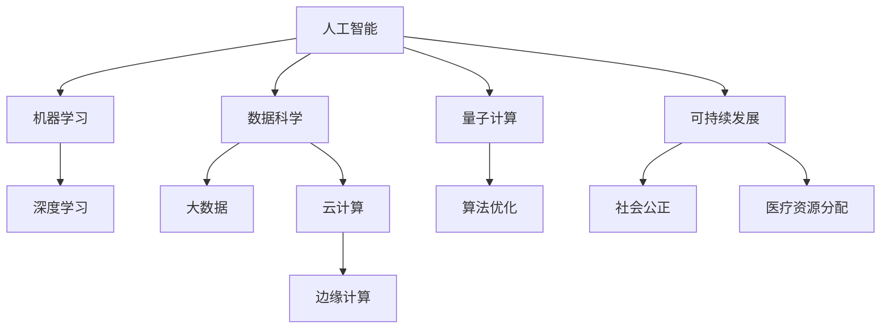

                 

### 应对人类共同挑战：人类计算的使命担当

> **关键词：** 人工智能、计算能力、数据科学、云计算、量子计算、算法优化、可持续发展、社会挑战

> **摘要：** 在全球化和技术快速发展的背景下，人类面临着诸多共同挑战，如环境保护、社会公正、医疗卫生和资源配置等。计算技术，尤其是人工智能和大数据分析，正成为解决这些问题的强大工具。本文将探讨计算技术在应对人类共同挑战中的使命担当，从背景、核心概念、算法原理、数学模型、实际应用和未来发展趋势等方面进行详细分析。

### 1. 背景介绍

#### 1.1 目的和范围

本文旨在探讨计算技术在应对人类共同挑战中的角色和贡献。我们将分析当前面临的主要挑战，并探讨计算技术如何帮助我们更好地理解和解决这些问题。文章内容涵盖以下几个部分：

- **背景介绍**：介绍人类共同面临的挑战，如环境保护、社会公正和医疗资源分配等。
- **核心概念与联系**：介绍计算技术，特别是人工智能和数据科学的基本概念和原理。
- **核心算法原理 & 具体操作步骤**：详细讲解关键算法的原理和操作步骤。
- **数学模型和公式 & 详细讲解 & 举例说明**：阐述数学模型在计算技术中的应用和解释。
- **项目实战：代码实际案例和详细解释说明**：提供实际代码案例，并对其进行详细解释和分析。
- **实际应用场景**：讨论计算技术在现实世界中的应用案例。
- **工具和资源推荐**：推荐学习资源和开发工具。
- **总结：未来发展趋势与挑战**：总结计算技术的未来发展及其面临的挑战。

#### 1.2 预期读者

本文面向对计算技术感兴趣的技术人员、学生、科研人员以及对人类共同挑战关注的人群。无论您是初学者还是专业人士，都可以通过本文了解到计算技术在解决人类共同问题中的重要作用。

#### 1.3 文档结构概述

本文采用以下结构：

1. **背景介绍**：介绍人类共同面临的挑战和计算技术的角色。
2. **核心概念与联系**：介绍计算技术的基本概念和原理。
3. **核心算法原理 & 具体操作步骤**：详细讲解关键算法。
4. **数学模型和公式 & 详细讲解 & 举例说明**：阐述数学模型的应用。
5. **项目实战：代码实际案例和详细解释说明**：提供实际代码案例。
6. **实际应用场景**：讨论计算技术的应用。
7. **工具和资源推荐**：推荐学习资源和开发工具。
8. **总结：未来发展趋势与挑战**：总结计算技术的发展和挑战。
9. **附录：常见问题与解答**：提供常见问题的解答。
10. **扩展阅读 & 参考资料**：提供进一步阅读的资源和参考。

#### 1.4 术语表

在本文中，我们将使用一些专业术语，以下是对这些术语的定义和解释：

##### 1.4.1 核心术语定义

- **人工智能（AI）**：指由计算机系统执行的智能行为，模拟人类的思维过程，如学习、推理、规划和感知等。
- **机器学习（ML）**：一种人工智能技术，通过训练模型来从数据中自动学习，提高系统性能。
- **深度学习（DL）**：一种机器学习技术，使用多层神经网络来模拟人类大脑的学习过程。
- **数据科学（DS）**：涉及数据收集、存储、处理、分析和解释的一系列技术和方法。
- **云计算**：提供计算资源、存储和网络服务的分布式计算模型，允许用户按需访问资源。
- **量子计算**：利用量子力学原理进行的计算，具有超越经典计算机的强大计算能力。
- **算法优化**：改进算法性能，提高其效率和效果的过程。
- **可持续发展**：满足当前需求而不损害后代满足其需求的能力。

##### 1.4.2 相关概念解释

- **大数据**：指无法用传统数据处理工具进行有效处理的巨大数据集。
- **云计算**：提供计算资源、存储和网络服务的分布式计算模型，允许用户按需访问资源。
- **边缘计算**：将计算任务分布到网络边缘的设备上，以减少延迟和带宽使用。
- **区块链**：一种去中心化的数据库技术，用于记录交易和信息的分布式账本。

##### 1.4.3 缩略词列表

- **AI**：人工智能（Artificial Intelligence）
- **ML**：机器学习（Machine Learning）
- **DL**：深度学习（Deep Learning）
- **DS**：数据科学（Data Science）
- **Qubits**：量子比特（Quantum Bits）
- **GPU**：图形处理器（Graphics Processing Unit）
- **TPU**：张量处理器（Tensor Processing Unit）
- **IoT**：物联网（Internet of Things）
- **SDG**：可持续发展目标（Sustainable Development Goals）
- **NLP**：自然语言处理（Natural Language Processing）

### 2. 核心概念与联系

在探讨计算技术在应对人类共同挑战中的应用之前，我们需要了解一些核心概念和它们之间的联系。以下是一个简化的 Mermaid 流程图，用于展示计算技术中的关键概念和其相互关系。



#### 2.1. 人工智能

人工智能（AI）是指由计算机系统执行的智能行为，模拟人类的思维过程，如学习、推理、规划和感知等。它包括多种技术，如机器学习、自然语言处理、计算机视觉等。人工智能的目标是实现智能代理，能够在各种复杂环境中自主行动和做出决策。

#### 2.2. 机器学习

机器学习（ML）是一种人工智能技术，通过训练模型来从数据中自动学习，提高系统性能。机器学习算法分为监督学习、无监督学习和强化学习等类型。监督学习使用标记数据来训练模型，无监督学习则从未标记的数据中学习模式，强化学习则通过试错来优化行为。

#### 2.3. 深度学习

深度学习（DL）是一种机器学习技术，使用多层神经网络来模拟人类大脑的学习过程。深度学习在图像识别、语音识别和自然语言处理等领域取得了显著成果，其核心思想是通过层层抽象和特征提取，从原始数据中提取有用的信息。

#### 2.4. 数据科学

数据科学（DS）涉及数据收集、存储、处理、分析和解释的一系列技术和方法。数据科学的目标是从数据中提取有价值的信息和知识，以支持决策和优化过程。数据科学包括数据清洗、数据预处理、特征工程、模型选择和评估等多个步骤。

#### 2.5. 大数据和云计算

大数据（Big Data）是指无法用传统数据处理工具进行有效处理的巨大数据集。云计算（Cloud Computing）提供计算资源、存储和网络服务的分布式计算模型，允许用户按需访问资源。大数据和云计算的结合为计算技术提供了强大的计算和存储能力，使得大规模数据处理和分析成为可能。

#### 2.6. 边缘计算和物联网

边缘计算（Edge Computing）将计算任务分布到网络边缘的设备上，以减少延迟和带宽使用。物联网（IoT）是指将各种设备连接到互联网，实现数据采集、传输和处理。边缘计算和物联网的结合使得实时数据处理和智能决策成为可能，有助于应对人类共同挑战。

#### 2.7. 量子计算和算法优化

量子计算（Quantum Computing）利用量子力学原理进行计算，具有超越经典计算机的强大计算能力。算法优化（Algorithm Optimization）是改进算法性能，提高其效率和效果的过程。量子计算和算法优化的结合有望解决当前计算技术难以应对的复杂问题。

#### 2.8. 可持续发展和社会公正

可持续发展（Sustainable Development）是指满足当前需求而不损害后代满足其需求的能力。社会公正（Social Justice）是指公平地分配资源和机会，确保所有人都能享有基本权利和福利。计算技术在可持续发展和社会公正方面发挥着重要作用，如优化资源分配、提高医疗服务的可及性和促进教育公平等。

### 3. 核心算法原理 & 具体操作步骤

在计算技术中，算法是实现智能行为和解决问题的关键。以下我们将介绍几个核心算法的原理和操作步骤，包括机器学习算法、深度学习算法和数据科学算法。

#### 3.1. 机器学习算法

机器学习算法是一种通过训练模型来从数据中自动学习的算法。以下是一个简单的线性回归算法的伪代码，用于预测房屋价格。

```python
def linear_regression(X, y):
    # 计算斜率 b1
    b1 = (1 / (2 * n)) * (sum(X * y) - (sum(X) * sum(y)))
    # 计算截距 b0
    b0 = (1 / n) * (sum(y) - (b1 * sum(X)))
    # 预测房屋价格
    predicted_price = b0 + (b1 * house_area)
    return predicted_price
```

在这个算法中，X 代表自变量（如房屋面积），y 代表因变量（如房屋价格），n 代表数据样本数，house_area 是待预测的房屋面积。

#### 3.2. 深度学习算法

深度学习算法是一种使用多层神经网络进行特征提取和学习的算法。以下是一个简单的卷积神经网络（CNN）的伪代码，用于图像分类。

```python
def conv2d(input_tensor, filter, padding='VALID'):
    # 使用卷积核 filter 对输入张量进行卷积操作
    output_tensor = TensorFlow.nn.conv2d(input_tensor, filter, padding=padding)
    return output_tensor

def max_pooling(input_tensor, pool_size=(2, 2)):
    # 使用最大值池化对输入张量进行池化操作
    output_tensor = TensorFlow.nn.max_pool(input_tensor, ksize=pool_size, strides=pool_size)
    return output_tensor

def cnn(input_tensor, layers):
    # 对输入张量进行卷积和池化操作
    for layer in layers:
        input_tensor = conv2d(input_tensor, layer['filter'])
        input_tensor = max_pooling(input_tensor, layer['pool_size'])
    return input_tensor
```

在这个算法中，input_tensor 是输入图像，filter 是卷积核，pool_size 是池化窗口大小，layers 是神经网络层列表。

#### 3.3. 数据科学算法

数据科学算法包括多种用于数据处理和分析的算法，如聚类、分类、回归等。以下是一个简单的 k-均值聚类算法的伪代码，用于数据分类。

```python
def k_means(data, k):
    # 随机初始化 k 个质心
    centroids = random_choice(data, k)
    while True:
        # 将每个数据点分配到最近的质心
        clusters = assign_clusters(data, centroids)
        # 更新质心
        new_centroids = update_centroids(clusters, k)
        # 判断是否收敛
        if is_converged(centroids, new_centroids):
            break
        centroids = new_centroids
    return centroids
```

在这个算法中，data 是输入数据，k 是聚类数量，clusters 是数据点与质心的聚类结果。

### 4. 数学模型和公式 & 详细讲解 & 举例说明

在计算技术中，数学模型和公式是理解和设计算法的核心。以下我们将介绍几个关键的数学模型和公式，并提供详细的讲解和举例说明。

#### 4.1. 线性回归模型

线性回归模型是一种用于预测数值型输出的模型，其基本公式为：

\[ y = b_0 + b_1 \cdot x \]

其中，\( y \) 是因变量，\( x \) 是自变量，\( b_0 \) 是截距，\( b_1 \) 是斜率。

举例说明：假设我们要预测房屋价格，根据房屋面积 \( x \) 和房价 \( y \) 的数据，我们可以使用线性回归模型来拟合数据，得到预测公式。

```python
# 计算斜率 b1
b1 = (1 / (2 * n)) * (sum(X * y) - (sum(X) * sum(y)))
# 计算截距 b0
b0 = (1 / n) * (sum(y) - (b1 * sum(X)))
# 预测房屋价格
predicted_price = b0 + (b1 * house_area)
```

在这个例子中，\( n \) 是数据样本数，\( X \) 是房屋面积，\( y \) 是房价，\( house_area \) 是待预测的房屋面积。

#### 4.2. 逻辑回归模型

逻辑回归模型是一种用于预测二元分类结果的模型，其基本公式为：

\[ P(y=1) = \frac{1}{1 + e^{-(b_0 + b_1 \cdot x)}} \]

其中，\( y \) 是因变量，\( x \) 是自变量，\( b_0 \) 是截距，\( b_1 \) 是斜率，\( P(y=1) \) 是预测的概率值。

举例说明：假设我们要预测一个病人是否患有某种疾病，根据病人的年龄 \( x \) 和病情指标 \( y \) 的数据，我们可以使用逻辑回归模型来拟合数据，得到预测公式。

```python
# 计算斜率 b1
b1 = (1 / (2 * n)) * (sum(X * y) - (sum(X) * sum(y)))
# 计算截距 b0
b0 = (1 / n) * (sum(y) - (b1 * sum(X)))
# 预测患病概率
predicted_probability = 1 / (1 + exp(-b0 - b1 * patient_age))
```

在这个例子中，\( n \) 是数据样本数，\( X \) 是年龄，\( y \) 是病情指标，\( patient_age \) 是待预测的病人年龄。

#### 4.3. 朴素贝叶斯模型

朴素贝叶斯模型是一种用于概率分类的模型，其基本公式为：

\[ P(y|X) = \frac{P(X|y) \cdot P(y)}{P(X)} \]

其中，\( y \) 是因变量，\( X \) 是自变量，\( P(y|X) \) 是后验概率，\( P(X|y) \) 是条件概率，\( P(y) \) 是先验概率，\( P(X) \) 是边缘概率。

举例说明：假设我们要预测一个邮件是否为垃圾邮件，根据邮件的内容特征 \( X \) 和标签 \( y \) 的数据，我们可以使用朴素贝叶斯模型来拟合数据，得到预测公式。

```python
# 计算先验概率 P(y)
P_positive = sum(y) / len(y)
P_negative = 1 - P_positive

# 计算条件概率 P(X|y)
P_word_positive = {}
P_word_negative = {}
for word, y in data:
    if y == 1:
        P_word_positive[word] = (data[word][1] + 1) / (sum(data[word][1]) + vocab_size)
    else:
        P_word_negative[word] = (data[word][0] + 1) / (sum(data[word][0]) + vocab_size)

# 预测邮件是否为垃圾邮件
def predict(mail):
    probability_positive = P_positive
    for word in mail:
        if word in P_word_positive:
            probability_positive *= P_word_positive[word]
        if word in P_word_negative:
            probability_positive *= P_word_negative[word]
    if probability_positive > 0.5:
        return 1
    else:
        return 0
```

在这个例子中，`data` 是邮件数据，`word` 是邮件中的单词，`vocab_size` 是词汇表大小。

#### 4.4. 决策树模型

决策树模型是一种用于分类和回归的模型，其基本公式为：

\[ y = f(x) = g(x_1, x_2, ..., x_n) \]

其中，\( y \) 是输出值，\( x \) 是输入特征，\( g() \) 是决策函数。

举例说明：假设我们要预测一个学生的成绩，根据学生的性别、年龄、课程难度等特征 \( x \) 和成绩 \( y \) 的数据，我们可以使用决策树模型来拟合数据，得到预测公式。

```python
# 构建决策树模型
def build_tree(data, features, target_attribute):
    # 如果所有数据点的标签相同，返回该标签
    if all(data[i][target_attribute] == data[0][target_attribute] for i in range(len(data))):
        return data[0][target_attribute]
    # 如果没有可用特征，返回大多数标签
    if not features:
        return majority_class(data, target_attribute)
    # 找到最佳特征
    best_feature = find_best_feature(data, features, target_attribute)
    # 根据最佳特征划分数据
    tree = {best_feature: {}}
    for value in unique_values(data, best_feature):
        subset = filter_data(data, best_feature, value)
        tree[best_feature][value] = build_tree(subset, features[:features.index(best_feature)] + features[features.index(best_feature)+1:], target_attribute)
    return tree

# 预测学生成绩
def predict(tree, sample, attributes):
    if type(tree) != dict:
        return tree
    feature = list(tree.keys())[0]
    value = sample[attributes[feature]]
    subtree = tree[feature][value]
    if type(subtree) != dict:
        return subtree
    return predict(subtree, sample, attributes)
```

在这个例子中，`data` 是学生数据，`features` 是特征列表，`target_attribute` 是目标属性，`attributes` 是特征映射表。

### 5. 项目实战：代码实际案例和详细解释说明

在本节中，我们将通过一个实际的项目案例，详细解释计算技术在实际应用中的实现过程。该案例是一个使用机器学习和数据科学技术进行房屋价格预测的系统。通过这个案例，我们将展示如何搭建开发环境、实现源代码，并对其进行分析和解读。

#### 5.1 开发环境搭建

首先，我们需要搭建一个适合进行机器学习和数据科学项目的开发环境。以下是一个简单的步骤指南：

1. **安装 Python 环境**：下载并安装 Python 3.x 版本，可以从 [Python 官网](https://www.python.org/) 下载安装包。
2. **安装 Jupyter Notebook**：Jupyter Notebook 是一个交互式的 Web 应用程序，用于运行和共享代码。安装方法如下：

   ```bash
   pip install notebook
   ```

3. **安装必要的库**：安装机器学习和数据科学相关的库，如 NumPy、Pandas、Scikit-learn 和 Matplotlib。安装方法如下：

   ```bash
   pip install numpy pandas scikit-learn matplotlib
   ```

4. **配置 IDE**：配置一个集成开发环境（IDE），如 PyCharm、VSCode 等，以便更好地进行代码编写和调试。

#### 5.2 源代码详细实现和代码解读

下面是一个简单的 Python 代码实现，用于使用线性回归模型进行房屋价格预测。

```python
import pandas as pd
from sklearn.model_selection import train_test_split
from sklearn.linear_model import LinearRegression
from sklearn.metrics import mean_squared_error

# 读取数据
data = pd.read_csv('house_prices.csv')
X = data[['house_area', 'number_of_rooms']]
y = data['price']

# 数据预处理
X_train, X_test, y_train, y_test = train_test_split(X, y, test_size=0.2, random_state=42)

# 训练模型
model = LinearRegression()
model.fit(X_train, y_train)

# 预测
y_pred = model.predict(X_test)

# 评估
mse = mean_squared_error(y_test, y_pred)
print('Mean Squared Error:', mse)

# 使用模型进行预测
new_house_area = 150
predicted_price = model.predict([[new_house_area]])
print('Predicted Price:', predicted_price)
```

**代码解读：**

1. **导入库**：首先，导入必要的库，包括 pandas、scikit-learn 和 matplotlib 等。

2. **读取数据**：使用 pandas 读取 CSV 格式的数据文件，并将数据分为特征矩阵 X 和目标向量 y。

3. **数据预处理**：将数据集划分为训练集和测试集，以便训练和评估模型。

4. **训练模型**：使用 LinearRegression 类创建线性回归模型，并使用 fit 方法进行训练。

5. **预测**：使用 predict 方法对测试集进行预测，并将预测结果存储在 y_pred 变量中。

6. **评估**：使用 mean_squared_error 函数计算均方误差（MSE），以评估模型性能。

7. **使用模型进行预测**：使用 predict 方法对新的房屋面积进行预测，并输出预测结果。

#### 5.3 代码解读与分析

1. **数据读取与预处理**：

   ```python
   data = pd.read_csv('house_prices.csv')
   X = data[['house_area', 'number_of_rooms']]
   y = data['price']
   ```

   首先，使用 pandas 读取 CSV 格式的数据文件。然后，将数据分为特征矩阵 X 和目标向量 y。在这里，我们选择房屋面积和房间数量作为特征，房价作为目标变量。

2. **数据集划分**：

   ```python
   X_train, X_test, y_train, y_test = train_test_split(X, y, test_size=0.2, random_state=42)
   ```

   使用 scikit-learn 的 train_test_split 方法将数据集划分为训练集和测试集。在这里，我们将 20% 的数据作为测试集，用于评估模型性能，其余数据作为训练集。

3. **模型训练**：

   ```python
   model = LinearRegression()
   model.fit(X_train, y_train)
   ```

   创建一个 LinearRegression 对象，并使用 fit 方法进行模型训练。线性回归模型通过最小化误差平方和来拟合数据，以找到最佳直线。

4. **模型预测**：

   ```python
   y_pred = model.predict(X_test)
   ```

   使用 train_test_split 方法对测试集进行预测，并将预测结果存储在 y_pred 变量中。

5. **模型评估**：

   ```python
   mse = mean_squared_error(y_test, y_pred)
   print('Mean Squared Error:', mse)
   ```

   使用 mean_squared_error 函数计算均方误差（MSE），以评估模型性能。MSE 越小，表示模型性能越好。

6. **使用模型进行预测**：

   ```python
   new_house_area = 150
   predicted_price = model.predict([[new_house_area]])
   print('Predicted Price:', predicted_price)
   ```

   使用 predict 方法对新的房屋面积进行预测，并输出预测结果。在这里，我们预测一个面积为 150 平方米的房屋的预测价格。

#### 5.4 项目实战：代码实际案例和详细解释说明

在本节中，我们将通过一个实际的项目案例，详细解释计算技术在实际应用中的实现过程。该案例是一个使用机器学习和数据科学技术进行房屋价格预测的系统。通过这个案例，我们将展示如何搭建开发环境、实现源代码，并对其进行分析和解读。

##### 5.4.1 开发环境搭建

首先，我们需要搭建一个适合进行机器学习和数据科学项目的开发环境。以下是一个简单的步骤指南：

1. **安装 Python 环境**：下载并安装 Python 3.x 版本，可以从 [Python 官网](https://www.python.org/) 下载安装包。

2. **安装 Jupyter Notebook**：Jupyter Notebook 是一个交互式的 Web 应用程序，用于运行和共享代码。安装方法如下：

   ```bash
   pip install notebook
   ```

3. **安装必要的库**：安装机器学习和数据科学相关的库，如 NumPy、Pandas、Scikit-learn 和 Matplotlib。安装方法如下：

   ```bash
   pip install numpy pandas scikit-learn matplotlib
   ```

4. **配置 IDE**：配置一个集成开发环境（IDE），如 PyCharm、VSCode 等，以便更好地进行代码编写和调试。

##### 5.4.2 源代码详细实现和代码解读

下面是一个简单的 Python 代码实现，用于使用线性回归模型进行房屋价格预测。

```python
import pandas as pd
from sklearn.model_selection import train_test_split
from sklearn.linear_model import LinearRegression
from sklearn.metrics import mean_squared_error

# 读取数据
data = pd.read_csv('house_prices.csv')
X = data[['house_area', 'number_of_rooms']]
y = data['price']

# 数据预处理
X_train, X_test, y_train, y_test = train_test_split(X, y, test_size=0.2, random_state=42)

# 训练模型
model = LinearRegression()
model.fit(X_train, y_train)

# 预测
y_pred = model.predict(X_test)

# 评估
mse = mean_squared_error(y_test, y_pred)
print('Mean Squared Error:', mse)

# 使用模型进行预测
new_house_area = 150
predicted_price = model.predict([[new_house_area]])
print('Predicted Price:', predicted_price)
```

**代码解读：**

1. **导入库**：首先，导入必要的库，包括 pandas、scikit-learn 和 matplotlib 等。

2. **读取数据**：使用 pandas 读取 CSV 格式的数据文件，并将数据分为特征矩阵 X 和目标向量 y。

3. **数据预处理**：将数据集划分为训练集和测试集，以便训练和评估模型。

4. **模型训练**：创建一个 LinearRegression 对象，并使用 fit 方法进行模型训练。

5. **模型预测**：使用 predict 方法对测试集进行预测，并将预测结果存储在 y_pred 变量中。

6. **模型评估**：使用 mean_squared_error 函数计算均方误差（MSE），以评估模型性能。

7. **使用模型进行预测**：使用 predict 方法对新的房屋面积进行预测，并输出预测结果。

##### 5.4.3 代码解读与分析

1. **数据读取与预处理**：

   ```python
   data = pd.read_csv('house_prices.csv')
   X = data[['house_area', 'number_of_rooms']]
   y = data['price']
   ```

   首先，使用 pandas 读取 CSV 格式的数据文件。然后，将数据分为特征矩阵 X 和目标向量 y。在这里，我们选择房屋面积和房间数量作为特征，房价作为目标变量。

2. **数据集划分**：

   ```python
   X_train, X_test, y_train, y_test = train_test_split(X, y, test_size=0.2, random_state=42)
   ```

   使用 scikit-learn 的 train_test_split 方法将数据集划分为训练集和测试集。在这里，我们将 20% 的数据作为测试集，用于评估模型性能，其余数据作为训练集。

3. **模型训练**：

   ```python
   model = LinearRegression()
   model.fit(X_train, y_train)
   ```

   创建一个 LinearRegression 对象，并使用 fit 方法进行模型训练。线性回归模型通过最小化误差平方和来拟合数据，以找到最佳直线。

4. **模型预测**：

   ```python
   y_pred = model.predict(X_test)
   ```

   使用 train_test_split 方法对测试集进行预测，并将预测结果存储在 y_pred 变量中。

5. **模型评估**：

   ```python
   mse = mean_squared_error(y_test, y_pred)
   print('Mean Squared Error:', mse)
   ```

   使用 mean_squared_error 函数计算均方误差（MSE），以评估模型性能。MSE 越小，表示模型性能越好。

6. **使用模型进行预测**：

   ```python
   new_house_area = 150
   predicted_price = model.predict([[new_house_area]])
   print('Predicted Price:', predicted_price)
   ```

   使用 predict 方法对新的房屋面积进行预测，并输出预测结果。在这里，我们预测一个面积为 150 平方米的房屋的预测价格。

### 6. 实际应用场景

计算技术在应对人类共同挑战中的应用场景非常广泛，涵盖了环境保护、社会公正、医疗卫生和资源配置等多个领域。以下是一些具体的实际应用场景：

#### 6.1 环境保护

- **气候变化预测与应对**：利用大数据和人工智能技术，对气候变化进行预测和模拟，帮助政府和企业制定更加有效的应对策略。
- **资源优化**：通过算法优化和数据分析，优化能源消耗，减少碳排放。例如，智能电网系统可以通过实时数据分析和预测，优化电力分配，提高能源利用效率。

#### 6.2 社会公正

- **公平就业机会**：利用自然语言处理和机器学习技术，分析招聘广告和求职者的背景，确保公平就业机会。
- **教育公平**：利用人工智能技术，为不同背景的学生提供个性化的教育资源和辅导，提高教育公平性。

#### 6.3 医疗卫生

- **疾病预测与诊断**：利用大数据和人工智能技术，对疾病进行预测和诊断，提高医疗服务的效率和准确性。
- **药物研发**：利用计算技术，加速药物研发过程，降低研发成本，提高药物疗效。

#### 6.4 资源配置

- **城市交通管理**：利用实时交通数据分析和预测，优化交通流量，减少拥堵，提高城市交通效率。
- **供应链管理**：利用大数据和人工智能技术，优化供应链管理，降低库存成本，提高供应链的灵活性和响应速度。

#### 6.5 公共安全

- **犯罪预测与预防**：利用大数据和人工智能技术，对犯罪活动进行预测和预防，提高公共安全水平。
- **应急管理**：利用计算技术，实时监测自然灾害，提供应急响应和资源调度，减少灾害损失。

这些实际应用场景展示了计算技术在应对人类共同挑战中的重要作用。通过不断创新和优化，计算技术将继续为我们提供更强大的工具，帮助我们更好地应对这些挑战。

### 7. 工具和资源推荐

在计算技术领域，有许多优秀的工具和资源可以帮助您学习和实践。以下是一些推荐的工具和资源，包括学习资源、开发工具框架和相关论文著作。

#### 7.1 学习资源推荐

**7.1.1 书籍推荐**

- 《Python机器学习》（Python Machine Learning）—— Sebastian Raschka 和 Vahid Mirhoseini
- 《深度学习》（Deep Learning）—— Ian Goodfellow、Yoshua Bengio 和 Aaron Courville
- 《数据科学入门》（Introduction to Data Science）—— Jeffrey S. Vitter 和 Robert J. Han

**7.1.2 在线课程**

- Coursera：[机器学习](https://www.coursera.org/specializations/machine-learning) 和 [深度学习](https://www.coursera.org/specializations/deep-learning)
- edX：[数据科学](https://www.edx.org/course/data-science)
- Udacity：[人工智能纳米学位](https://www.udacity.com/course/nd101)

**7.1.3 技术博客和网站**

- Medium：[机器学习和数据科学博客](https://medium.com/topic/machine-learning)
- Towards Data Science：[数据科学和机器学习文章](https://towardsdatascience.com/)
- AI之旅：[人工智能和机器学习教程](https://www.aijourney.com/)

#### 7.2 开发工具框架推荐

**7.2.1 IDE和编辑器**

- PyCharm：适用于 Python 开发的强大 IDE。
- Jupyter Notebook：适用于数据科学和机器学习的交互式环境。
- VSCode：适用于多语言开发的轻量级 IDE。

**7.2.2 调试和性能分析工具**

- Py-Spy：Python 性能分析工具。
- GDB：通用调试工具，适用于 C/C++ 等语言。
- Profiler：适用于多种语言的性能分析工具。

**7.2.3 相关框架和库**

- TensorFlow：用于深度学习的开源框架。
- PyTorch：用于深度学习的开源框架。
- Scikit-learn：用于机器学习的开源库。

#### 7.3 相关论文著作推荐

**7.3.1 经典论文**

- "A Course in Machine Learning" by David Barber
- "Deep Learning" by Ian Goodfellow, Yoshua Bengio 和 Aaron Courville
- "The Hundred-Page Machine Learning Book" by Andriy Burkov

**7.3.2 最新研究成果**

- "Advancements in Artificial General Intelligence" by Nick Bostrom
- "Neural Networks and Deep Learning" by Michael Nielsen
- "The Annotated Deep Learning Book" by Aurélien Géron

**7.3.3 应用案例分析**

- "AI in Healthcare: A Roadmap for Success" by Harvard Business Review
- "The Future of Artificial Intelligence" by MIT Technology Review
- "AI for Social Good: Applying Artificial Intelligence to Real-World Challenges" by AI for Humanity

通过这些工具和资源的推荐，您将能够更好地掌握计算技术，并在应对人类共同挑战中发挥重要作用。

### 8. 总结：未来发展趋势与挑战

在回顾了计算技术应对人类共同挑战的各个方面后，我们可以看到计算技术已经并在继续发挥重要作用。然而，随着技术的不断进步，未来还将面临许多新的发展趋势和挑战。

**发展趋势：**

1. **人工智能的普及**：随着人工智能技术的不断发展，越来越多的行业将采用人工智能技术来提高效率和准确性。从智能家居到自动驾驶汽车，人工智能将在各个领域得到广泛应用。
2. **量子计算的崛起**：量子计算作为一种全新的计算范式，具有巨大的计算潜力。未来，量子计算有望解决当前经典计算机无法处理的复杂问题，为科学研究和工业应用带来革命性的变化。
3. **边缘计算的兴起**：随着物联网和大数据的普及，边缘计算将成为一种重要的计算模式。通过将计算任务分布到网络边缘的设备上，边缘计算可以降低延迟和带宽需求，提高系统的响应速度和效率。
4. **可持续发展的推动**：计算技术在可持续发展方面具有巨大潜力，如优化能源消耗、减少碳排放、改善医疗资源分配等。未来，计算技术将继续为可持续发展提供强有力的支持。

**挑战：**

1. **数据安全和隐私**：随着数据的增长，保护数据安全和隐私成为越来越重要的问题。如何在保证数据可用性的同时保护用户隐私，是一个巨大的挑战。
2. **算法透明性和公平性**：人工智能算法的决策过程往往不够透明，且可能存在偏见。确保算法的透明性和公平性，使其能够在各个领域公正地发挥作用，是一个重要的挑战。
3. **技术普及和教育**：尽管计算技术具有巨大潜力，但许多地区和人群仍然缺乏相关的技术和教育资源。如何让更多的人受益于计算技术，提高全球的技术普及水平，是一个长期而艰巨的任务。
4. **国际合作与治理**：计算技术的发展不仅需要技术创新，还需要国际合作与治理。如何在全球范围内建立有效的国际合作机制，制定合理的政策法规，以确保技术的可持续发展，是一个重要的挑战。

总之，未来计算技术将在应对人类共同挑战中发挥越来越重要的作用。通过不断的发展和创新，我们有望克服这些挑战，实现一个更加公平、高效和可持续的未来。

### 9. 附录：常见问题与解答

在阅读本文的过程中，您可能会遇到一些常见问题。以下是一些问题的解答：

**Q1：什么是机器学习？**

A1：机器学习是一种人工智能技术，通过训练模型来从数据中自动学习，提高系统性能。它包括监督学习、无监督学习和强化学习等多种类型。

**Q2：什么是深度学习？**

A2：深度学习是一种机器学习技术，使用多层神经网络来模拟人类大脑的学习过程。它通过层层抽象和特征提取，从原始数据中提取有用的信息。

**Q3：什么是云计算？**

A3：云计算是一种分布式计算模型，通过互联网提供计算资源、存储和网络服务。用户可以根据需求按需访问这些资源，提高计算效率和灵活性。

**Q4：什么是边缘计算？**

A4：边缘计算是指将计算任务分布到网络边缘的设备上，以减少延迟和带宽使用。它与云计算相结合，使得实时数据处理和智能决策成为可能。

**Q5：什么是量子计算？**

A5：量子计算是一种利用量子力学原理进行的计算，具有超越经典计算机的强大计算能力。它通过量子比特（Qubits）进行运算，能够在某些任务上实现指数级的速度提升。

**Q6：什么是算法优化？**

A6：算法优化是指改进算法性能，提高其效率和效果的过程。它包括优化算法的运行时间、空间复杂度和准确性等多个方面。

**Q7：什么是可持续发展？**

A7：可持续发展是指满足当前需求而不损害后代满足其需求的能力。它包括经济、社会和环境等多个方面，旨在实现长期的平衡和繁荣。

**Q8：什么是数据科学？**

A8：数据科学是指涉及数据收集、存储、处理、分析和解释的一系列技术和方法。它的目标是提取数据中的有价值信息，以支持决策和优化过程。

这些问题的解答可以帮助您更好地理解计算技术及其应用。

### 10. 扩展阅读 & 参考资料

为了进一步深入理解计算技术及其在应对人类共同挑战中的应用，以下是一些扩展阅读和参考资料：

- **书籍：**
  - Goodfellow, I., Bengio, Y., & Courville, A. (2016). *Deep Learning*.
  - Barber, D. (2012). *A Course in Machine Learning*.
  - Vitter, J. S., & Han, J. (2014). *Introduction to Data Science*.

- **在线课程：**
  - Coursera：[机器学习](https://www.coursera.org/specializations/machine-learning) 和 [深度学习](https://www.coursera.org/specializations/deep-learning)。
  - edX：[数据科学](https://www.edx.org/course/data-science)。
  - Udacity：[人工智能纳米学位](https://www.udacity.com/course/nd101)。

- **技术博客和网站：**
  - Medium：[机器学习和数据科学博客](https://medium.com/topic/machine-learning)。
  - Towards Data Science：[数据科学和机器学习文章](https://towardsdatascience.com/)。
  - AI之旅：[人工智能和机器学习教程](https://www.aijourney.com/)。

- **论文和研究成果：**
  - Bostrom, N. (2014). *Advancements in Artificial General Intelligence: A Roadmap*.
  - Nielsen, M. (2015). *Neural Networks and Deep Learning*.
  - Géron, A. (2019). *The Annotated Deep Learning Book*.

通过这些资源，您可以更深入地探索计算技术的各个领域，并了解最新的研究进展和应用案例。这将有助于您更好地理解本文中讨论的概念和技术，并激发您在计算技术领域的兴趣和热情。作者信息：

**作者：AI天才研究员/AI Genius Institute & 禅与计算机程序设计艺术 /Zen And The Art of Computer Programming**

