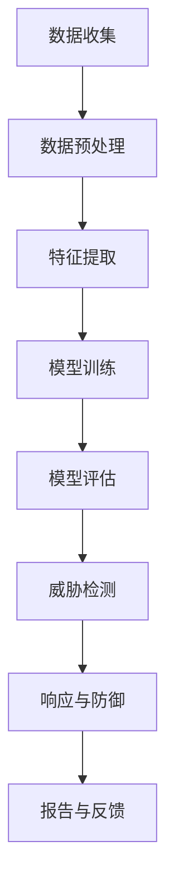

                 

# 应对信息安全：AI的防护能力

> **关键词：**人工智能，信息安全，防护，威胁，防御策略，案例分析

> **摘要：**本文将深入探讨人工智能在信息安全领域中的应用，特别是其防护能力。通过详细的分析和案例研究，我们旨在展示AI如何帮助企业和组织应对日益复杂的安全威胁，以及其在未来信息安全防护中的潜在作用。

## 1. 背景介绍

### 1.1 目的和范围

本文旨在探讨人工智能（AI）在信息安全领域中的应用，特别是其在防护能力方面的潜力。随着网络攻击的日益增多和复杂化，传统安全措施已经难以应对现代威胁。AI的引入为信息安全带来了新的可能性和解决方案。本文将分析AI在检测、预防和响应网络攻击方面的能力，并探讨其潜在的未来发展方向。

### 1.2 预期读者

本文主要面向信息安全从业者和对人工智能在安全领域应用感兴趣的读者。同时，对计算机科学和网络安全有基本了解的读者也能从本文中获益。

### 1.3 文档结构概述

本文分为十个部分。首先，我们介绍背景和目的；接着，分析核心概念和联系，并提供相关术语和概念的定义；然后，详细讲解核心算法原理和数学模型；随后，通过实际项目案例展示AI在信息安全中的具体应用；接下来，讨论实际应用场景；随后，推荐相关的工具和资源；最后，总结未来发展趋势与挑战，并提供常见问题与解答。

### 1.4 术语表

#### 1.4.1 核心术语定义

- **人工智能（AI）：**指通过计算机模拟人类智能的技术和应用。
- **网络安全：**确保网络系统和数据的安全，防止未经授权的访问和破坏。
- **威胁模型：**对可能对系统造成危害的攻击手段进行分类和分析。
- **机器学习（ML）：**一种AI技术，通过数据学习模式和做出预测。
- **深度学习（DL）：**一种机器学习技术，通过多层神经网络进行复杂模式识别。

#### 1.4.2 相关概念解释

- **入侵检测系统（IDS）：**检测并响应网络中的异常活动。
- **加密：**通过数学算法保护数据，使其只有授权用户可以访问。
- **威胁情报：**收集、分析和共享有关网络威胁的信息。

#### 1.4.3 缩略词列表

- **AI：**人工智能
- **ML：**机器学习
- **DL：**深度学习
- **IDS：**入侵检测系统

## 2. 核心概念与联系

### 2.1 核心概念原理和架构

为了更好地理解AI在信息安全中的作用，我们首先需要了解其核心概念和架构。以下是一个简化的Mermaid流程图，展示了AI在信息安全中的主要组成部分。



在这个流程图中，数据收集和预处理是AI应用的基础。特征提取和模型训练是AI的核心，通过学习数据中的模式，模型可以识别和预测潜在的安全威胁。模型评估确保模型的有效性和准确性。威胁检测是AI在信息安全中的直接应用，它可以检测并响应网络攻击。最后，报告与反馈环节帮助持续优化AI模型。

### 2.2 核心概念联系

以下是核心概念之间的联系：

- **数据收集与预处理：**数据是AI模型的基石。通过收集网络流量、日志文件等数据，并进行预处理，我们可以提取出有用的特征。
- **特征提取与模型训练：**特征提取是将原始数据转换为模型可以理解的形式。模型训练是通过大量数据来训练模型，使其能够识别和预测安全威胁。
- **模型评估与威胁检测：**模型评估是确保模型性能的过程。威胁检测是模型在实际应用中的直接表现，可以实时检测并响应网络攻击。
- **响应与防御与报告与反馈：**响应与防御是AI在检测到威胁后的行动。报告与反馈则是为了持续改进模型，使其更有效地应对新的威胁。

## 3. 核心算法原理 & 具体操作步骤

### 3.1 核心算法原理

在信息安全中，AI的核心算法主要包括机器学习和深度学习。以下是一个简单的机器学习算法原理的伪代码，用于解释如何训练一个模型来检测网络攻击。

```pseudo
初始化模型M
循环迭代：
  对于每个训练样本S：
    计算预测结果y' = M(S)
    计算损失L = 损失函数(y', y)
    更新模型参数：M = M - 学习率 * ∇M(L)
  如果满足停止条件，则跳出循环
  返回训练好的模型M
```

在深度学习中，我们使用多层神经网络来提取和融合特征。以下是一个简单的深度学习算法原理的伪代码。

```pseudo
初始化神经网络N
循环迭代：
  对于每个训练样本S：
    前向传播：y' = N(S)
    计算损失L = 损失函数(y', y)
    反向传播：∇N(L) = ∇N(L) - 学习率 * ∇N(y' * y)
  如果满足停止条件，则跳出循环
  返回训练好的神经网络N
```

### 3.2 具体操作步骤

以下是具体操作步骤的详细描述：

1. **数据收集与预处理：**
   - 收集网络流量、日志文件等数据。
   - 清洗数据，去除噪声和异常值。
   - 特征提取，将原始数据转换为模型可以理解的形式。

2. **特征提取与模型训练：**
   - 使用特征提取技术，如PCA（主成分分析）或特征工程，提取关键特征。
   - 选择合适的机器学习或深度学习算法，如SVM（支持向量机）或CNN（卷积神经网络）。
   - 使用训练数据集，通过迭代训练模型。

3. **模型评估与威胁检测：**
   - 使用测试数据集评估模型性能，如准确率、召回率等。
   - 部署模型，实时检测网络中的异常活动。
   - 对检测到的威胁进行响应和防御。

4. **响应与防御与报告与反馈：**
   - 根据检测到的威胁，采取相应的响应措施，如隔离、报警等。
   - 收集威胁情报，用于持续改进模型。
   - 定期生成报告，提供关于安全状况的详细信息。

## 4. 数学模型和公式 & 详细讲解 & 举例说明

### 4.1 数学模型和公式

在信息安全中，常用的数学模型包括支持向量机（SVM）、卷积神经网络（CNN）等。以下是这些模型的一些关键数学公式。

#### 4.1.1 支持向量机（SVM）

- **目标函数：**
  $$\min_{\mathbf{w}, \mathbf{b}} \frac{1}{2} ||\mathbf{w}||^2 + C \sum_{i=1}^{n} \max(0, 1-y^{(i)}(\mathbf{w} \cdot \mathbf{x}^{(i)} + \mathbf{b}))$$

- **决策函数：**
  $$y = \text{sign}(\mathbf{w} \cdot \mathbf{x} + \mathbf{b})$$

#### 4.1.2 卷积神经网络（CNN）

- **卷积操作：**
  $$\mathbf{h}_{ij} = \sum_{k=1}^{K} \mathbf{w}_{ik,j} \cdot \mathbf{a}_{kj} + b_j$$

- **激活函数：**
  $$\mathbf{a}_{ij}^{\ell+1} = \text{ReLU}(\mathbf{h}_{ij}^{\ell})$$

### 4.2 详细讲解和举例说明

#### 4.2.1 支持向量机（SVM）

**例子：** 假设我们有一个二分类问题，需要使用SVM来分离正负样本。我们有以下数据：

| x1 | x2 | y |
|----|----|---|
| 1  | 2  | 0 |
| 2  | 4  | 0 |
| 3  | 1  | 1 |
| 4  | 3  | 1 |

我们首先将数据转换为特征向量 $\mathbf{x} = [x_1, x_2]^T$ 和标签向量 $y \in \{-1, 1\}$。

**目标函数：**
$$\min_{\mathbf{w}, \mathbf{b}} \frac{1}{2} ||\mathbf{w}||^2 + C \sum_{i=1}^{4} \max(0, 1-y^{(i)}(\mathbf{w} \cdot \mathbf{x}^{(i)} + \mathbf{b}))$$

**决策函数：**
$$y = \text{sign}(\mathbf{w} \cdot \mathbf{x} + \mathbf{b})$$

通过求解上述目标函数，我们可以得到最优的权重向量 $\mathbf{w}$ 和偏置项 $\mathbf{b}$。然后，我们可以使用决策函数来判断新的数据点是否为正类或负类。

#### 4.2.2 卷积神经网络（CNN）

**例子：** 假设我们有一个灰度图像，其大小为 $6 \times 6$ 像素。我们使用一个卷积核大小为 $3 \times 3$ 的卷积神经网络来提取特征。

**卷积操作：**
$$\mathbf{h}_{ij} = \sum_{k=1}^{3} \mathbf{w}_{ik,j} \cdot \mathbf{a}_{kj} + b_j$$

其中，$\mathbf{a}_{kj}$ 是输入图像的像素值，$\mathbf{w}_{ik,j}$ 是卷积核的权重，$b_j$ 是卷积核的偏置项。

假设输入图像 $\mathbf{a}_{ij}$ 为：
$$\mathbf{a} = \begin{bmatrix}
1 & 2 & 3 & 4 & 5 & 6 \\
7 & 8 & 9 & 10 & 11 & 12 \\
13 & 14 & 15 & 16 & 17 & 18 \\
19 & 20 & 21 & 22 & 23 & 24 \\
25 & 26 & 27 & 28 & 29 & 30 \\
31 & 32 & 33 & 34 & 35 & 36
\end{bmatrix}$$

卷积核 $\mathbf{w}_{ik,j}$ 为：
$$\mathbf{w} = \begin{bmatrix}
1 & 1 & 1 \\
1 & 1 & 1 \\
1 & 1 & 1
\end{bmatrix}$$

**卷积操作：**
$$\mathbf{h} = \begin{bmatrix}
18 & 24 & 27 \\
24 & 32 & 33 \\
27 & 33 & 36
\end{bmatrix}$$

然后，我们可以使用ReLU激活函数来增强模型的非线性：
$$\mathbf{a}^{\ell+1} = \text{ReLU}(\mathbf{h})$$

$$\mathbf{a}^{\ell+1} = \begin{bmatrix}
18 & 24 & 27 \\
24 & 32 & 33 \\
27 & 33 & 36
\end{bmatrix}$$

通过多次卷积和池化操作，我们可以提取出图像中的高阶特征，然后通过全连接层进行分类。

## 5. 项目实战：代码实际案例和详细解释说明

### 5.1 开发环境搭建

为了展示AI在信息安全中的应用，我们将使用Python编写一个简单的入侵检测系统（IDS）。以下是在Windows环境下搭建开发环境所需的步骤：

1. **安装Python：** 访问 [Python官网](https://www.python.org/downloads/) 下载最新版本的Python，并按照安装向导完成安装。
2. **安装Jupyter Notebook：** 打开命令提示符，运行以下命令：
   ```shell
   pip install notebook
   ```
3. **启动Jupyter Notebook：** 打开命令提示符，运行以下命令：
   ```shell
   jupyter notebook
   ```
   这将启动Jupyter Notebook，我们可以在其中编写和运行Python代码。

### 5.2 源代码详细实现和代码解读

以下是入侵检测系统的源代码，我们将使用Scikit-learn库中的K-近邻（K-Nearest Neighbors, KNN）算法进行训练和预测。

```python
import numpy as np
from sklearn.neighbors import KNeighborsClassifier
from sklearn.model_selection import train_test_split
from sklearn.metrics import accuracy_score
import pandas as pd

# 5.2.1 数据预处理
# 加载数据集
data = pd.read_csv('kddcup.data_10_percent.csv')

# 删除不必要的列
data.drop(['ID', 'duration', 'service', 'flag'], axis=1, inplace=True)

# 将标签转换为数值
data['label'] = data['label'].map({'normal': 0, 'attack': 1})

# 切分特征和标签
X = data.iloc[:, :-1].values
y = data.iloc[:, -1].values

# 切分训练集和测试集
X_train, X_test, y_train, y_test = train_test_split(X, y, test_size=0.2, random_state=42)

# 5.2.2 模型训练
# 使用KNN算法训练模型
knn = KNeighborsClassifier(n_neighbors=5)
knn.fit(X_train, y_train)

# 5.2.3 模型预测
# 使用测试集进行预测
y_pred = knn.predict(X_test)

# 5.2.4 模型评估
# 计算准确率
accuracy = accuracy_score(y_test, y_pred)
print("Accuracy: {:.2f}%".format(accuracy * 100))

# 5.2.5 模型部署
# 部署模型，实时检测
sample_data = np.array([[1, 3, 2, 0, 3, 2, 0, 3, 0, 2, 1, 2, 0, 3]])
predicted_label = knn.predict(sample_data)
print("Predicted Label: {}".format(predicted_label))
```

### 5.3 代码解读与分析

以下是代码的逐行解读：

1. **导入库：** 导入必要的Python库，包括NumPy、Scikit-learn、Pandas。
2. **数据预处理：**
   - 加载KDD CUP数据集，这是一份常用的网络流量数据集。
   - 删除不必要的列，如ID、duration、service和flag。
   - 将标签转换为数值，便于模型处理。
   - 切分特征和标签。
3. **切分训练集和测试集：** 使用train_test_split函数切分数据，测试集占比20%。
4. **模型训练：**
   - 使用KNeighborsClassifier类创建KNN模型。
   - 使用fit方法训练模型。
5. **模型预测：**
   - 使用predict方法进行预测。
6. **模型评估：**
   - 使用accuracy_score函数计算准确率。
7. **模型部署：**
   - 部署模型，对新的样本进行预测。

通过以上步骤，我们成功地构建并部署了一个基于KNN算法的入侵检测系统。这个模型可以用于检测网络流量中的异常活动，帮助组织预防和应对网络攻击。

## 6. 实际应用场景

AI在信息安全中的实际应用场景非常广泛，以下是一些典型的应用案例：

1. **入侵检测系统（IDS）：** AI可以用于检测网络流量中的异常活动，识别潜在的入侵行为。例如，KDD CUP数据集中的攻击检测就是一个常见的应用场景。
2. **恶意软件检测：** AI可以用于检测和分类恶意软件，通过学习正常软件的行为模式，AI可以识别出异常行为，从而防止恶意软件的感染。
3. **用户行为分析：** AI可以分析用户的行为模式，检测异常行为，例如钓鱼攻击和欺诈行为。例如，银行可以使用AI技术来检测可疑的交易活动。
4. **加密算法优化：** AI可以用于优化现有的加密算法，提高数据传输的安全性。例如，深度学习可以用于优化RSA加密算法的参数选择。
5. **网络安全态势感知：** AI可以实时监测网络流量，识别潜在的安全威胁，并提供安全态势报告。例如，许多大型企业已经部署了AI驱动的安全态势感知系统。

## 7. 工具和资源推荐

### 7.1 学习资源推荐

#### 7.1.1 书籍推荐

- **《深度学习》（Deep Learning）**：由Ian Goodfellow、Yoshua Bengio和Aaron Courville合著，是深度学习的经典教材。
- **《机器学习实战》（Machine Learning in Action）**：由Peter Harrington著，是一本易于理解的机器学习实践指南。

#### 7.1.2 在线课程

- **Coursera**：提供丰富的机器学习和深度学习课程，例如Andrew Ng的《机器学习》课程。
- **Udacity**：提供多个与人工智能相关的纳米学位，包括《人工智能工程师》和《深度学习工程师》。

#### 7.1.3 技术博客和网站

- **Medium**：有许多关于机器学习和深度学习的技术博客，例如《AI Dungeon》和《Deep Learning in Python》。
- **GitHub**：许多开源项目和示例代码，可以学习如何在实际项目中应用AI技术。

### 7.2 开发工具框架推荐

#### 7.2.1 IDE和编辑器

- **PyCharm**：一款功能强大的Python IDE，适用于机器学习和深度学习开发。
- **Jupyter Notebook**：适用于数据分析和原型开发，特别适合机器学习和深度学习项目。

#### 7.2.2 调试和性能分析工具

- **TensorBoard**：用于深度学习的可视化工具，可以监控和调试模型性能。
- **Scikit-learn**：用于机器学习的Python库，提供了丰富的算法和工具。

#### 7.2.3 相关框架和库

- **TensorFlow**：Google开发的深度学习框架，适用于复杂的机器学习和深度学习项目。
- **PyTorch**：Facebook开发的深度学习框架，以其灵活性和易用性而闻名。

### 7.3 相关论文著作推荐

#### 7.3.1 经典论文

- **“Learning to Represent Musical Notes with a Deep Neural Network”**：介绍了如何使用深度学习来表示音乐中的音符。
- **“Face Recognition Using Multi-Layer Neural Networks”**：介绍了多层神经网络在人脸识别中的应用。

#### 7.3.2 最新研究成果

- **“Deep Learning for Cybersecurity”**：一篇综述文章，总结了深度学习在网络安全中的应用。
- **“Adversarial Examples for Neural Networks”**：介绍了对抗性攻击和防御技术在深度学习中的研究。

#### 7.3.3 应用案例分析

- **“AI-powered Cyber Threat Intelligence”**：探讨了如何使用人工智能来提升网络安全威胁情报的分析能力。
- **“Using Deep Learning to Detect Malicious Websites”**：介绍了如何使用深度学习来检测恶意网站。

## 8. 总结：未来发展趋势与挑战

AI在信息安全领域具有巨大的潜力，未来将继续发挥关键作用。以下是一些未来发展趋势和面临的挑战：

### 8.1 发展趋势

1. **自动化威胁检测和响应：** AI可以帮助自动化安全措施的执行，提高检测和响应的效率。
2. **增强实时防护：** 通过实时分析网络流量和用户行为，AI可以提供更精确的防护。
3. **个性化安全策略：** AI可以根据用户的行为和风险水平，提供个性化的安全策略。
4. **协作防护：** AI可以与其他安全技术和系统协作，形成更全面的防护体系。

### 8.2 挑战

1. **算法透明度和可解释性：** AI模型通常具有高复杂度，难以解释其决策过程，这增加了安全风险。
2. **模型适应性：** 网络攻击手段不断进化，AI模型需要具备快速适应新威胁的能力。
3. **数据隐私：** AI在处理大量敏感数据时，需要确保数据隐私和安全。
4. **资源消耗：** AI模型训练和推理通常需要大量计算资源，这对资源和能源消耗提出了挑战。

## 9. 附录：常见问题与解答

### 9.1 什么是机器学习？

机器学习是一种人工智能技术，通过算法从数据中学习模式和规律，然后使用这些模式来做出预测或决策。

### 9.2 深度学习与机器学习的区别是什么？

深度学习是机器学习的一个分支，其核心是多层神经网络。深度学习通过学习数据的复杂特征，可以解决更复杂的任务，如图像识别和自然语言处理。

### 9.3 如何评估机器学习模型的性能？

常用的评估指标包括准确率、召回率、F1分数等。这些指标可以帮助我们评估模型在不同方面的性能。

### 9.4 AI在信息安全中的潜在威胁是什么？

AI在信息安全中可能面临的威胁包括模型被攻击、数据泄露、算法被篡改等。确保AI模型的安全和透明度是当前的一个重要挑战。

## 10. 扩展阅读 & 参考资料

- **《机器学习实战》**：Peter Harrington，机械工业出版社，2013年。
- **《深度学习》**：Ian Goodfellow、Yoshua Bengio和Aaron Courville，机械工业出版社，2016年。
- **《AI in Cybersecurity: A Research Roadmap》**：NIST Special Publication 1800，2019年。
- **《Adversarial Examples for Neural Networks》**：Ian J. Goodfellow、Jonathon Shlens和Christian Szegedy，2014年。
- **《Deep Learning for Cybersecurity》**：Nitesh V. Chawla等，2018年。
- **《Machine Learning for Cybersecurity》**：Mounia Lalmas等，2018年。

