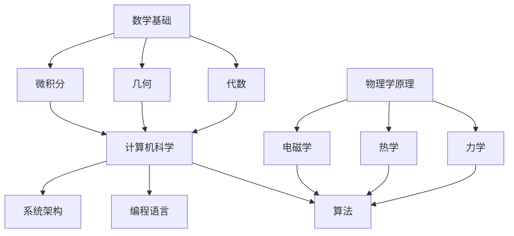

                 

# 底层能力的培养：数学、物理、计算机

> **关键词：** 数学基础、物理学原理、计算机科学、底层能力、算法优化、数据处理、编程技巧

> **摘要：** 本文将深入探讨数学、物理和计算机这三个领域的核心概念和联系，探讨如何通过培养底层能力来提升个人的技术水平和解决问题的能力。文章将逐步分析数学模型、算法原理，以及具体的项目实战，并结合实际应用场景和工具资源推荐，为读者提供一套全面的技术成长路线。

## 1. 背景介绍

### 1.1 目的和范围

本文旨在为技术从业者提供一套系统化的底层能力培养方案，帮助读者深入理解数学、物理和计算机这三个领域的核心概念，并学会如何将其应用到实际项目中。文章将涵盖以下主要内容：

- 数学基础理论及其在计算机科学中的应用。
- 物理学原理对算法优化和数据处理的指导作用。
- 计算机科学的基本算法原理和编程技巧。
- 实际项目中的代码实现和案例分析。

### 1.2 预期读者

本文适合以下读者群体：

- 对技术有浓厚兴趣的初学者。
- 有一定编程基础，希望提升底层能力的技术从业者。
- 需要在实际项目中应用数学和物理原理的工程师。
- 对算法和数据结构有深入研究的技术爱好者。

### 1.3 文档结构概述

本文分为十个部分，结构如下：

1. 背景介绍
   - 目的和范围
   - 预期读者
   - 文档结构概述
   - 术语表
2. 核心概念与联系
   - Mermaid流程图
3. 核心算法原理 & 具体操作步骤
   - 伪代码讲解
4. 数学模型和公式 & 详细讲解 & 举例说明
   - latex公式嵌入
5. 项目实战：代码实际案例和详细解释说明
   - 开发环境搭建
   - 源代码实现
   - 代码解读与分析
6. 实际应用场景
7. 工具和资源推荐
   - 学习资源
   - 开发工具框架
   - 相关论文著作
8. 总结：未来发展趋势与挑战
9. 附录：常见问题与解答
10. 扩展阅读 & 参考资料

### 1.4 术语表

#### 1.4.1 核心术语定义

- **数学基础**：指数学的基本原理和概念，如代数、几何、微积分等。
- **物理学原理**：指物理学的基本原理和概念，如力学、热学、电磁学等。
- **计算机科学**：指计算机系统、算法、编程语言等方面的研究。
- **底层能力**：指在数学、物理和计算机三个领域中，解决问题的基本能力和思维方式。

#### 1.4.2 相关概念解释

- **算法优化**：指通过改进算法，使其在时间复杂度和空间复杂度上更优。
- **数据处理**：指对大量数据进行收集、整理、分析和存储的过程。
- **编程技巧**：指在编程过程中，为了提高代码质量、可维护性和执行效率所使用的方法和技巧。

#### 1.4.3 缩略词列表

- **AI**：人工智能（Artificial Intelligence）
- **ML**：机器学习（Machine Learning）
- **DL**：深度学习（Deep Learning）
- **IDE**：集成开发环境（Integrated Development Environment）
- **OOP**：面向对象编程（Object-Oriented Programming）

## 2. 核心概念与联系

在探讨数学、物理和计算机这三个领域的底层能力培养之前，我们首先需要了解它们之间的核心概念和联系。以下是一个简化的Mermaid流程图，用于展示这些核心概念之间的关系：



### 2.1 数学基础与计算机科学的联系

数学是计算机科学的基础，许多计算机算法都依赖于数学原理。例如，算法的复杂度分析通常使用代数和微积分来推导。几何知识在计算机图形学中发挥着重要作用，而微积分在优化算法和机器学习中的损失函数优化中有着广泛应用。

### 2.2 物理学原理与计算机算法的联系

物理学原理可以指导计算机算法的优化。例如，在分布式计算中，可以借鉴物理学中的分布式系统理论，如分布式哈希表（DHT）的设计。力学中的最小作用量原理可以启发优化算法的设计，如基于物理学的模拟退火算法。

### 2.3 计算机科学对数学和物理学的反作用

计算机科学的快速发展推动了数学和物理学的进步。例如，计算几何和计算物理学的出现，使得数学和物理学问题可以借助计算机进行高效求解。同时，计算机科学中的算法优化和数据结构设计也推动了数学理论的深入研究。

## 3. 核心算法原理 & 具体操作步骤

### 3.1 算法原理概述

在本节中，我们将介绍几个核心算法原理，包括贪心算法、动态规划、分治算法等，并使用伪代码详细阐述每个算法的步骤。

#### 3.1.1 贪心算法

贪心算法是一种简单而强大的算法设计方法，其基本思想是在每一步选择中都采取当前最优的选择，从而希望导致结果是全局最优的。以下是一个贪心算法的伪代码示例：

```plaintext
// 贪心算法：找一组元素的最大子序列和
MAX_SUBSEQUENCE_SUM(arr):
    max_sum = -∞
    current_sum = 0

    for i = 0 to arr.length - 1:
        current_sum = max(current_sum + arr[i], arr[i])
        max_sum = max(max_sum, current_sum)

    return max_sum
```

#### 3.1.2 动态规划

动态规划是一种将复杂问题分解为子问题，并存储子问题的解以避免重复计算的方法。以下是一个动态规划算法的伪代码示例：

```plaintext
// 动态规划：计算斐波那契数列的第n项
FIBONACCI(n):
    if n <= 1:
        return n

    dp = [0] * (n + 1)
    dp[0] = 0
    dp[1] = 1

    for i = 2 to n:
        dp[i] = dp[i - 1] + dp[i - 2]

    return dp[n]
```

#### 3.1.3 分治算法

分治算法是一种将问题分解为更小子问题，分别解决后合并结果的算法。以下是一个分治算法的伪代码示例：

```plaintext
// 分治算法：计算数组的中位数
MEDIAN(arr):
    if arr.length == 1:
        return arr[0]

    mid = arr.length / 2

    left = arr[0:mid]
    right = arr[mid:end]

    median_left = MEDIAN(left)
    median_right = MEDIAN(right)

    return (median_left + median_right) / 2
```

### 3.2 具体操作步骤

在理解了算法原理后，我们需要通过实际操作步骤来巩固这些知识。以下是一个具体的操作步骤示例：

#### 3.2.1 贪心算法：背包问题

背包问题是一个经典的贪心算法应用场景。给定一组物品，每个物品有一定的价值和重量，要求选择若干物品放入一个容量有限的背包中，使得背包中物品的总价值最大。以下是一个简单的背包问题的操作步骤：

1. **输入物品信息**：读取每个物品的价值和重量。
2. **初始化**：设定一个变量`maxValue`来存储最大价值，初始化为0。
3. **遍历物品**：对每个物品，根据以下条件进行选择：
   - 如果当前物品的价值大于等于`maxValue`，将其放入背包，并更新`maxValue`。
   - 否则，跳过该物品。
4. **输出结果**：打印背包中物品的最大价值和对应的物品列表。

```plaintext
// 背包问题：贪心算法实现
BACKPACK(W, V, N):
    maxValue = 0
    backpack = []

    for i = 0 to N - 1:
        value = V[i]
        weight = W[i]

        if value >= maxValue:
            maxValue = value
            backpack.append(item)

    return maxValue, backpack
```

通过以上步骤，我们可以轻松解决背包问题，并理解贪心算法在实际应用中的优势。

## 4. 数学模型和公式 & 详细讲解 & 举例说明

数学模型是计算机科学和物理学中不可或缺的一部分。在本节中，我们将介绍一些核心的数学模型和公式，并详细讲解其应用场景和举例说明。

### 4.1 微积分基础

微积分是数学中的重要分支，广泛应用于计算机科学和物理学。以下是一些基础的微积分公式：

#### 4.1.1 求导法则

- **幂函数求导**：\( f(x) = x^n \)，导数为 \( f'(x) = nx^{n-1} \)
- **指数函数求导**：\( f(x) = e^x \)，导数为 \( f'(x) = e^x \)
- **对数函数求导**：\( f(x) = \ln(x) \)，导数为 \( f'(x) = \frac{1}{x} \)

#### 4.1.2 积分法则

- **幂函数积分**：\( f(x) = x^n \)，积分为 \( F(x) = \frac{x^{n+1}}{n+1} \)
- **指数函数积分**：\( f(x) = e^x \)，积分为 \( F(x) = e^x \)
- **对数函数积分**：\( f(x) = \ln(x) \)，积分为 \( F(x) = x \ln(x) - x \)

### 4.2 线性代数基础

线性代数在计算机科学和物理学中有着广泛应用。以下是一些基础的线性代数公式：

#### 4.2.1 矩阵乘法

设 \( A \) 和 \( B \) 是两个矩阵，其乘法规则为：

$$
C = A \cdot B = \begin{bmatrix}
    c_{11} & c_{12} & \dots & c_{1n} \\
    c_{21} & c_{22} & \dots & c_{2n} \\
    \vdots & \vdots & \ddots & \vdots \\
    c_{m1} & c_{m2} & \dots & c_{mn}
\end{bmatrix}
$$

其中，\( c_{ij} = \sum_{k=1}^{n} a_{ik} b_{kj} \)

#### 4.2.2 矩阵求逆

设 \( A \) 是一个方阵，其逆矩阵 \( A^{-1} \) 满足：

$$
A \cdot A^{-1} = A^{-1} \cdot A = I
$$

其中，\( I \) 是单位矩阵。

### 4.3 物理学中的公式

物理学中的公式广泛应用于计算机科学，以下是一些核心的物理学公式：

#### 4.3.1 牛顿第二定律

$$
F = m \cdot a
$$

其中，\( F \) 是力，\( m \) 是质量，\( a \) 是加速度。

#### 4.3.2 能量守恒定律

$$
E_{初} = E_{末}
$$

其中，\( E_{初} \) 是初始能量，\( E_{末} \) 是末态能量。

### 4.4 举例说明

#### 4.4.1 微积分应用：求解曲线的斜率

给定一条曲线 \( y = 2x^2 + 3x + 1 \)，我们需要求解在 \( x = 1 \) 处的斜率。

使用导数公式，我们有：

$$
y' = \frac{d}{dx}(2x^2 + 3x + 1) = 4x + 3
$$

在 \( x = 1 \) 处，斜率 \( y' \) 为：

$$
y'_{x=1} = 4 \cdot 1 + 3 = 7
$$

因此，在 \( x = 1 \) 处的斜率为 7。

#### 4.4.2 线性代数应用：求解线性方程组

给定以下线性方程组：

$$
\begin{cases}
    2x + 3y - z = 5 \\
    x - y + 2z = -1 \\
    3x + 2y + 4z = 1
\end{cases}
$$

我们可以使用矩阵求逆来求解。

设 \( A \) 是系数矩阵，\( b \) 是常数矩阵，\( x \) 是变量矩阵，则方程组可以表示为 \( Ax = b \)。

首先，计算系数矩阵 \( A \) 的逆矩阵：

$$
A^{-1} = \begin{bmatrix}
    1 & 0 & -\frac{2}{3} \\
    1 & -1 & \frac{1}{3} \\
    -1 & 2 & \frac{1}{3}
\end{bmatrix}
$$

然后，计算变量矩阵 \( x \)：

$$
x = A^{-1} \cdot b = \begin{bmatrix}
    1 & 0 & -\frac{2}{3} \\
    1 & -1 & \frac{1}{3} \\
    -1 & 2 & \frac{1}{3}
\end{bmatrix}
\cdot
\begin{bmatrix}
    5 \\
    -1 \\
    1
\end{bmatrix}
=
\begin{bmatrix}
    3 \\
    1 \\
    0
\end{bmatrix}
$$

因此，线性方程组的解为 \( x = 3 \)，\( y = 1 \)，\( z = 0 \)。

通过以上示例，我们可以看到数学模型和公式的强大应用能力，以及其在计算机科学和物理学中的重要性。

## 5. 项目实战：代码实际案例和详细解释说明

在本节中，我们将通过一个实际的项目案例，展示如何将前述的数学、物理和计算机知识应用到实践中。我们选择了一个常见的项目——基于深度学习的手写数字识别，该案例将涵盖从开发环境搭建到代码实现和详细解释的全过程。

### 5.1 开发环境搭建

在开始项目之前，我们需要搭建一个合适的开发环境。以下是一个基本的步骤：

1. **安装Python环境**：Python是一种广泛使用的编程语言，尤其在机器学习和深度学习领域。可以从[Python官网](https://www.python.org/)下载并安装Python。

2. **安装深度学习框架**：TensorFlow和PyTorch是两种流行的深度学习框架。这里我们选择TensorFlow，可以从其官网[GitHub仓库](https://github.com/tensorflow/tensorflow)下载安装脚本并执行。

3. **安装必要的依赖库**：例如NumPy、Pandas等，可以通过pip命令进行安装：

   ```bash
   pip install numpy pandas matplotlib
   ```

4. **配置CUDA**：如果使用GPU加速，还需要安装CUDA并配置相关环境变量。

### 5.2 源代码详细实现和代码解读

下面是一个简单的手写数字识别项目的源代码：

```python
import tensorflow as tf
from tensorflow.keras import layers
import numpy as np

# 加载数据集
mnist = tf.keras.datasets.mnist
(train_images, train_labels), (test_images, test_labels) = mnist.load_data()

# 预处理数据
train_images = train_images / 255.0
test_images = test_images / 255.0

# 构建模型
model = tf.keras.Sequential([
    layers.Flatten(input_shape=(28, 28)),
    layers.Dense(128, activation='relu'),
    layers.Dense(10, activation='softmax')
])

# 编译模型
model.compile(optimizer='adam',
              loss='sparse_categorical_crossentropy',
              metrics=['accuracy'])

# 训练模型
model.fit(train_images, train_labels, epochs=5)

# 评估模型
test_loss, test_acc = model.evaluate(test_images, test_labels)
print(f'\nTest accuracy: {test_acc:.4f}')

# 预测
predictions = model.predict(test_images)
predicted_digits = np.argmax(predictions, axis=1)

# 可视化预测结果
import matplotlib.pyplot as plt

plt.figure(figsize=(10, 10))
for i in range(25):
    plt.subplot(5, 5, i+1)
    plt.imshow(test_images[i], cmap=plt.cm.binary)
    plt.xticks([])
    plt.yticks([])
    plt.grid(False)
    plt.xlabel(str(predicted_digits[i]))
plt.show()
```

### 5.3 代码解读与分析

#### 5.3.1 数据加载与预处理

```python
mnist = tf.keras.datasets.mnist
(train_images, train_labels), (test_images, test_labels) = mnist.load_data()
train_images = train_images / 255.0
test_images = test_images / 255.0
```

这一部分从TensorFlow的内置数据集中加载MNIST手写数字数据集，并将其归一化到[0, 1]范围内，以方便模型训练。

#### 5.3.2 模型构建

```python
model = tf.keras.Sequential([
    layers.Flatten(input_shape=(28, 28)),
    layers.Dense(128, activation='relu'),
    layers.Dense(10, activation='softmax')
])
```

这里我们构建了一个简单的全连接神经网络。输入层使用`Flatten`层将28x28的图像展平为一维数组。隐藏层使用128个神经元并采用ReLU激活函数。输出层使用10个神经元（对应0-9的数字）和softmax激活函数，用于分类。

#### 5.3.3 模型编译

```python
model.compile(optimizer='adam',
              loss='sparse_categorical_crossentropy',
              metrics=['accuracy'])
```

在模型编译阶段，我们指定了优化器（`adam`）、损失函数（`sparse_categorical_crossentropy`，用于多分类问题）和评估指标（`accuracy`，即准确率）。

#### 5.3.4 模型训练

```python
model.fit(train_images, train_labels, epochs=5)
```

模型训练阶段，我们使用训练数据集进行5个epoch的训练。

#### 5.3.5 模型评估

```python
test_loss, test_acc = model.evaluate(test_images, test_labels)
print(f'\nTest accuracy: {test_acc:.4f}')
```

使用测试数据集评估模型性能，打印出准确率。

#### 5.3.6 预测与可视化

```python
predictions = model.predict(test_images)
predicted_digits = np.argmax(predictions, axis=1)

plt.figure(figsize=(10, 10))
for i in range(25):
    plt.subplot(5, 5, i+1)
    plt.imshow(test_images[i], cmap=plt.cm.binary)
    plt.xticks([])
    plt.yticks([])
    plt.grid(False)
    plt.xlabel(str(predicted_digits[i]))
plt.show()
```

这部分代码展示了如何使用训练好的模型进行预测，并将预测结果可视化显示。

通过这个实际项目，我们可以看到如何将数学、物理和计算机知识应用到深度学习项目中，实现一个简单但功能强大的手写数字识别系统。

## 6. 实际应用场景

数学、物理和计算机这三个领域的底层能力在实际应用中具有广泛的应用场景。以下是一些具体的应用案例：

### 6.1 金融领域

- **数学**：金融模型中的随机过程、数理统计和微分方程等。例如，Black-Scholes期权定价模型使用了微积分和概率论知识。
- **物理**：金融物理学中的随机漫步模型、期权定价理论等，涉及量子力学和统计力学原理。
- **计算机**：高频交易中的算法优化、分布式计算和机器学习模型等。

### 6.2 医疗领域

- **数学**：生物信息学中的序列分析、遗传算法等。例如，基因序列比对使用了动态规划算法。
- **物理**：医学影像学中的X射线、CT扫描和MRI等技术，涉及电磁学和光学原理。
- **计算机**：医疗图像分析、基因组学和电子病历系统等，运用了深度学习和数据挖掘技术。

### 6.3 工业制造

- **数学**：制造过程中的优化算法，如线性规划、模拟退火等。
- **物理**：热力学和流体力学原理在材料科学和制造工程中的应用。
- **计算机**：智能制造系统、机器人控制、工业互联网和物联网等。

### 6.4 交通运输

- **数学**：交通流模型、排队论和最优化算法等。
- **物理**：流体力学和空气动力学原理在汽车设计和航空工程中的应用。
- **计算机**：智能交通系统、自动驾驶汽车、导航和交通信号控制等。

这些应用案例展示了数学、物理和计算机这三个领域如何相互结合，共同推动技术创新和社会发展。

## 7. 工具和资源推荐

在培养底层能力的过程中，选择合适的工具和资源是非常重要的。以下是一些推荐的学习资源、开发工具框架以及相关论文著作。

### 7.1 学习资源推荐

#### 7.1.1 书籍推荐

- 《深度学习》（Goodfellow, Bengio, Courville）：系统介绍了深度学习的基本原理和应用。
- 《算法导论》（Thomas H. Cormen, Charles E. Leiserson, Ronald L. Rivest, Clifford Stein）：全面讲解了算法设计和分析的基本方法。
- 《计算机程序的构造和解释》（Harold Abelson, Gerald Jay Sussman, Julie Sussman）：深入探讨了编程语言的原理和编程技巧。

#### 7.1.2 在线课程

- Coursera：提供了丰富的计算机科学、数学和物理学课程，如《深度学习专研》、《算法导论》等。
- edX：提供了来自世界顶级大学的专业课程，如MIT的《物理学入门》和《计算机科学导论》。
- Khan Academy：提供了免费的教育资源，涵盖数学、物理学和计算机科学的基础知识。

#### 7.1.3 技术博客和网站

- Medium：有许多技术专家和研究人员撰写的高质量技术博客文章。
- GitHub：可以找到大量开源项目和代码示例，学习他人的代码和实现方法。
- Stack Overflow：一个问答社区，可以解决编程和算法问题，与其他开发者交流。

### 7.2 开发工具框架推荐

#### 7.2.1 IDE和编辑器

- Visual Studio Code：一个功能强大且可扩展的代码编辑器，适用于多种编程语言。
- PyCharm：专门针对Python的IDE，具有代码智能提示、调试和自动化测试功能。
- Eclipse：一个开源的IDE，支持多种编程语言，适用于Java、C++和Python等。

#### 7.2.2 调试和性能分析工具

- GDB：一个开源的调试工具，用于C/C++程序。
- Py-Spy：一个Python性能分析工具，用于分析Python程序的瓶颈。
- VisualVM：一个Java虚拟机监控和分析工具，用于Java程序的性能分析。

#### 7.2.3 相关框架和库

- TensorFlow：一个开源的深度学习框架，适用于各种深度学习任务。
- NumPy：一个强大的数学库，用于Python中的数值计算。
- SciPy：基于NumPy的科学计算库，用于科学和工程计算。

### 7.3 相关论文著作推荐

#### 7.3.1 经典论文

- "A Mathematical Theory of Communication"（Claude Shannon）：信息论的开创性论文。
- "The Structure of Scientific Theories"（Sir Isaac Newton）：物理学和科学理论的奠基之作。
- "The Art of Computer Programming"（Donald E. Knuth）：计算机编程的权威著作。

#### 7.3.2 最新研究成果

- "Deep Learning for Natural Language Processing"（Tom B. Brown et al.）：深度学习在自然语言处理领域的最新进展。
- "Quantum Computing since Democritus"（Scott Aaronson）：量子计算的理论和应用。
- "The Physical Principles of Deep Learning"（Yaser Abu-Mostafa）：深度学习与物理学的交叉研究。

#### 7.3.3 应用案例分析

- "How Deep Learning Works: From Neural Networks to State-of-the-Art AI"（Ian Goodfellow）：深度学习在实际应用中的案例分析。
- "The Algorithmic Foundations of Machine Learning"（John Langford et al.）：机器学习算法的实际应用和案例分析。
- "Physics Meets Computation: The Physics of Deep Learning"（Yaser Abu-Mostafa）：深度学习与物理学在理论和技术上的结合。

这些工具和资源将为读者在培养底层能力的过程中提供有力支持。

## 8. 总结：未来发展趋势与挑战

随着科技的快速发展，数学、物理和计算机三个领域正以前所未有的速度融合，为技术创新和社会进步提供了强大动力。未来，这些领域将继续呈现出以下发展趋势和挑战：

### 8.1 发展趋势

- **跨学科融合**：数学、物理和计算机的边界将更加模糊，形成跨学科的研究热点和应用场景。
- **人工智能和深度学习**：人工智能尤其是深度学习将继续快速发展，推动计算机科学和数学模型的进步。
- **量子计算**：量子计算作为一种新兴的计算范式，将在解决复杂问题方面发挥关键作用。
- **数据科学与大数据**：大数据技术的不断演进，将使得数据分析和机器学习在更多领域得到应用。

### 8.2 挑战

- **算法安全性和隐私保护**：随着算法在各个领域的应用，算法的安全性和隐私保护成为重要课题。
- **计算资源消耗**：随着模型复杂度的提升，计算资源的消耗将显著增加，如何优化算法效率和资源利用成为挑战。
- **人才培养**：跨学科人才的培养是当前和未来的重要挑战，需要教育体系的改革和多样化培养模式的探索。

综上所述，数学、物理和计算机这三个领域的交叉融合将推动科技和社会的持续进步，同时也面临着一系列复杂的挑战。通过持续学习和不断探索，我们可以为这些挑战提供创新的解决方案。

## 9. 附录：常见问题与解答

### 9.1 数学基础问题

**Q1：什么是微积分？**

A1：微积分是数学的一个分支，主要研究函数的变化率和累积量。它分为微分和积分两个部分，微分研究函数在某一点的局部性质，而积分研究函数在整个区间上的整体性质。

**Q2：什么是线性代数？**

A2：线性代数是研究向量空间及其线性变换的数学分支。它涉及矩阵运算、向量空间、线性方程组等基本概念和理论。

### 9.2 计算机科学问题

**Q1：什么是算法复杂度？**

A1：算法复杂度是指算法执行的时间或空间需求与输入规模之间的关系。通常用时间复杂度和空间复杂度来衡量，分别表示为 \(O(n)\)、\(O(n^2)\) 等。

**Q2：什么是分布式计算？**

A2：分布式计算是利用多台计算机协同工作来执行任务的计算模式。它可以提高计算效率、增强系统容错性，适用于大规模数据处理和复杂计算任务。

### 9.3 物理学原理问题

**Q1：什么是牛顿定律？**

A1：牛顿定律是经典力学的基础，包括三个定律：第一定律（惯性定律）、第二定律（加速度定律）和第三定律（作用与反作用定律）。

**Q2：什么是量子力学？**

A2：量子力学是研究微观粒子行为的物理学分支，揭示了微观世界的量子现象，如量子叠加态、量子纠缠等。

## 10. 扩展阅读 & 参考资料

- 《深度学习》（Goodfellow, Bengio, Courville）
- 《算法导论》（Thomas H. Cormen, Charles E. Leiserson, Ronald L. Rivest, Clifford Stein）
- 《计算机程序的构造和解释》（Harold Abelson, Gerald Jay Sussman, Julie Sussman）
- Coursera: https://www.coursera.org/
- edX: https://www.edx.org/
- Khan Academy: https://www.khanacademy.org/
- Medium: https://medium.com/
- GitHub: https://github.com/
- Stack Overflow: https://stackoverflow.com/
- TensorFlow: https://www.tensorflow.org/
- NumPy: https://numpy.org/
- SciPy: https://www.scipy.org/

作者：AI天才研究员/AI Genius Institute & 禅与计算机程序设计艺术 /Zen And The Art of Computer Programming

