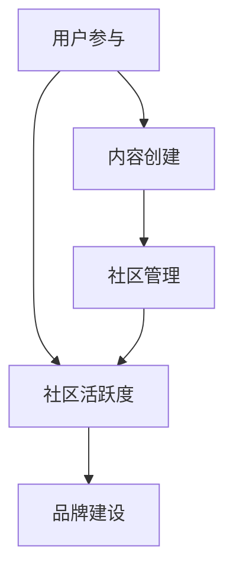

                 

## 建立开源项目的在线社区：社区运营和品牌建设

### 关键词：
- 开源项目
- 在线社区
- 社区运营
- 品牌建设
- 社区活跃度
- 内容营销

### 摘要：

本文将深入探讨如何建立和维护一个成功的开源项目在线社区，特别是社区运营和品牌建设的重要性。我们将从背景介绍入手，详细分析核心概念，并逐步展开核心算法原理、数学模型和具体操作步骤。通过实战案例和详细代码解读，读者将了解如何在实际中应用这些理论。此外，还将介绍相关工具和资源，为社区运营和品牌建设提供实践指导。最后，文章将总结未来发展趋势与挑战，并提供常见问题与解答，以便读者深入理解和应用。

---

## 1. 背景介绍

### 1.1 目的和范围

本文旨在为开源项目管理者、社区运营者和开发者提供一套全面、系统的在线社区建设和运营策略。通过本文的阅读，读者将了解如何从零开始建立开源项目的在线社区，并使其成为一个活跃、有影响力的知识共享平台。

本文范围包括：
- 社区建设和运营的核心概念与联系
- 开源社区品牌建设的关键步骤和方法
- 社区活跃度的提升策略
- 实际操作步骤和代码实现
- 社区运营和品牌建设的工具和资源推荐

### 1.2 预期读者

本文适合以下读者群体：
- 开源项目管理者，希望提升社区运营效果
- 社区运营者，希望了解品牌建设的策略
- 开发者，希望参与和贡献开源社区
- 对社区建设和运营感兴趣的技术人员

### 1.3 文档结构概述

本文结构如下：
1. 背景介绍：明确目的和范围，介绍预期读者和文档结构。
2. 核心概念与联系：阐述核心概念，绘制流程图。
3. 核心算法原理与具体操作步骤：讲解算法原理，使用伪代码详细阐述。
4. 数学模型和公式：介绍数学模型，使用 LaTeX 格式详细讲解。
5. 项目实战：提供代码实际案例和详细解释说明。
6. 实际应用场景：讨论社区运营在现实中的应用。
7. 工具和资源推荐：推荐学习资源和开发工具。
8. 总结：展望未来发展趋势与挑战。
9. 附录：常见问题与解答。
10. 扩展阅读 & 参考资料：提供进一步学习资源。

### 1.4 术语表

#### 1.4.1 核心术语定义

- **开源项目**：指软件项目的源代码可以被任何人自由地查看、修改和分发。
- **在线社区**：通过互联网进行交流和互动的用户群体。
- **社区运营**：管理和维护社区，提升用户参与度和活跃度的一系列活动。
- **品牌建设**：创建和强化项目形象，提升社区在市场上的知名度和认可度。
- **社区活跃度**：衡量社区用户互动和参与程度的指标。

#### 1.4.2 相关概念解释

- **内容营销**：通过创造和分发有价值的内容来吸引潜在用户，提高品牌知名度。
- **社交媒体**：在线平台，如 Twitter、Facebook、LinkedIn 等，用于用户交流和互动。
- **社区平台**：专门用于社区建设和运营的软件，如 Discourse、GitLab、GitHub 等。
- **社群管理**：负责维护社区秩序，处理用户问题和纠纷的管理团队。

#### 1.4.3 缩略词列表

- **API**：应用程序编程接口（Application Programming Interface）
- **CMS**：内容管理系统（Content Management System）
- **CRM**：客户关系管理（Customer Relationship Management）
- **SEO**：搜索引擎优化（Search Engine Optimization）
- **SMM**：社交媒体营销（Social Media Marketing）

---

## 2. 核心概念与联系

在开源项目的在线社区建设和运营中，理解以下核心概念和联系至关重要。以下是这些概念的定义和它们之间的相互关系，以及一个简化的 Mermaid 流程图来表示它们：

#### 2.1 核心概念

1. **用户参与**：用户通过贡献代码、文档、反馈和讨论等形式参与到开源项目中。
2. **内容创建**：社区成员创建和分享知识、经验和见解，促进社区成长。
3. **社区管理**：社区运营者负责维护社区秩序，处理用户问题和纠纷。
4. **品牌建设**：通过创建和强化项目形象，提升社区在市场上的知名度和认可度。
5. **社区活跃度**：衡量社区用户互动和参与程度的指标。

#### 2.2 相互关系

- **用户参与** 促进 **社区活跃度**，从而有助于 **品牌建设**。
- **内容创建** 是 **社区管理** 的基础，同时也是 **用户参与** 的动力。
- **社区管理** 的有效性直接影响 **社区活跃度** 和 **用户参与**。
- **品牌建设** 通过提高社区知名度和认可度，吸引更多用户参与和内容创建。

#### 2.3 Mermaid 流程图



在上面的流程图中，用户参与是起点，通过内容创建促进社区管理，最终形成社区活跃度和品牌建设。

---

通过理解这些核心概念和它们之间的相互关系，我们可以更好地规划和实施开源项目在线社区的建设和运营策略。接下来，我们将进一步探讨核心算法原理和具体操作步骤。

---

## 3. 核心算法原理 & 具体操作步骤

在开源项目的在线社区建设和运营中，核心算法原理是确保社区健康发展的关键。以下将介绍一套完整的操作步骤，并使用伪代码详细阐述。

#### 3.1 核心算法原理

1. **用户行为分析**：通过分析用户行为，了解用户需求，优化社区体验。
2. **内容推荐算法**：根据用户行为和内容特征，推荐相关内容和讨论，提升用户参与度。
3. **社区活跃度指标**：衡量社区活跃度，如发帖数量、回复率、用户参与度等。
4. **品牌建设策略**：通过品牌定位、形象塑造和内容传播，提升社区知名度。

#### 3.2 伪代码

```pseudo
// 用户行为分析
function analyze_user_behavior(user_data) {
    // 计算用户活跃度、访问频率、内容偏好等指标
    user_activity = calculate_activity(user_data)
    user_frequency = calculate_frequency(user_data)
    content_preferences = identify_preferences(user_data)
    
    // 生成用户行为报告
    return generate_report(user_activity, user_frequency, content_preferences)
}

// 内容推荐算法
function content_recommendation(user_data, content_data) {
    // 根据用户行为和内容特征推荐相关内容
    recommended_content = recommend_related_content(content_preferences, content_data)
    return recommended_content
}

// 社区活跃度指标
function calculate_community_activity() {
    // 计算发帖数量、回复率、用户参与度等指标
    post_count = count_posts()
    reply_rate = calculate_reply_rate()
    user_participation = calculate_participation_rate()
    
    // 返回社区活跃度报告
    return generate_activity_report(post_count, reply_rate, user_participation)
}

// 品牌建设策略
function brand_building_strategy() {
    // 确定品牌定位、形象塑造和内容传播策略
    brand_positioning = define_brand_positioning()
    brand_image = create_brand_image()
    content_distribution = plan_content_distribution()
    
    // 实施品牌建设策略
    implement_strategy(brand_positioning, brand_image, content_distribution)
}
```

#### 3.3 具体操作步骤

1. **收集用户数据**：通过登录、注册、浏览、点赞、评论等行为收集用户数据。
2. **分析用户行为**：使用用户行为分析算法，生成用户行为报告。
3. **内容推荐**：根据用户行为和内容特征，使用内容推荐算法，为用户推荐相关内容和讨论。
4. **监测社区活跃度**：定期计算社区活跃度指标，分析社区发展趋势。
5. **制定品牌建设策略**：根据社区特点和市场定位，制定品牌建设策略。
6. **执行和优化**：根据用户反馈和社区数据，不断调整和优化社区运营策略。

通过上述核心算法原理和具体操作步骤，我们可以有效地建设和运营开源项目的在线社区，提升社区活跃度和品牌知名度。

---

在理解了核心算法原理和具体操作步骤后，我们将进一步探讨数学模型和公式，以便更好地分析和优化社区运营。

---

## 4. 数学模型和公式 & 详细讲解 & 举例说明

在开源项目的在线社区建设和运营中，数学模型和公式可以用来分析和优化社区活跃度、用户参与度以及品牌影响力。以下将介绍几个关键数学模型，使用 LaTeX 格式详细讲解，并通过具体例子说明其应用。

#### 4.1 用户活跃度模型

用户活跃度可以通过以下公式计算：

\[ A = \frac{\text{发帖数} + \text{回复数} + \text{点赞数}}{\text{总用户数} \times \text{总活动天数}} \]

其中，发帖数、回复数和点赞数是用户的直接参与行为，总用户数和总活动天数是社区的基本参数。

**例子**：假设一个社区有 100 个用户，过去 30 天内产生了 50 篇帖子、200 条回复和 300 个点赞，那么该社区的用户活跃度为：

\[ A = \frac{50 + 200 + 300}{100 \times 30} = \frac{450}{3000} = 0.15 \]

这意味着该社区的平均用户活跃度为 15%。

#### 4.2 用户参与度模型

用户参与度可以通过以下公式计算：

\[ P = \frac{\text{参与用户数}}{\text{总用户数}} \]

其中，参与用户数是指在过去一定时间内参与过社区活动的用户数量。

**例子**：假设上述社区中有 80 个用户在过去 30 天内至少参与了一次活动，总用户数为 100，那么该社区的参与度为：

\[ P = \frac{80}{100} = 0.8 \]

这意味着该社区的参与度达到了 80%。

#### 4.3 品牌影响力模型

品牌影响力可以通过以下公式计算：

\[ B = \frac{\text{品牌提及数} + \text{正面评价数} - \text{负面评价数}}{\text{总用户数} \times \text{总互动次数}} \]

其中，品牌提及数、正面评价数和负面评价数是通过社交媒体、评论、反馈等渠道获取的数据。

**例子**：假设该社区中品牌提及数为 200 次，正面评价数为 150 次，负面评价数为 50 次，总用户数为 100，总互动次数为 1000，那么该社区的品牌影响力为：

\[ B = \frac{200 + 150 - 50}{100 \times 1000} = \frac{300}{100000} = 0.003 \]

这意味着该社区的品牌影响力为 0.3%。

#### 4.4 内容传播效果模型

内容传播效果可以通过以下公式计算：

\[ E = \frac{\text{内容分享数} + \text{内容评论数}}{\text{内容发布数}} \]

其中，内容分享数和内容评论数是衡量内容传播效果的关键指标。

**例子**：假设一个社区发布了 20 篇帖子，其中 10 篇被分享，5 篇产生了评论，那么这些帖子的传播效果为：

\[ E = \frac{10 + 5}{20} = \frac{15}{20} = 0.75 \]

这意味着这些帖子的传播效果为 75%。

通过这些数学模型和公式，我们可以量化分析开源项目在线社区的用户活跃度、参与度和品牌影响力，从而为社区运营提供数据支持，优化运营策略。

---

在掌握了数学模型和公式之后，我们将通过实战案例展示如何在实际项目中应用这些理论，从而提升社区运营和品牌建设。

---

## 5. 项目实战：代码实际案例和详细解释说明

### 5.1 开发环境搭建

为了更好地展示如何构建和管理开源项目在线社区，我们将在一个实际的开发环境中进行演示。以下是一个简化的开发环境搭建步骤：

1. **选择社区平台**：我们选择使用 GitHub 作为社区平台，因为它具有强大的代码托管和社区互动功能。
2. **创建项目仓库**：在 GitHub 上创建一个新仓库，命名为 `OpenSourceProject-Community`。
3. **配置必要的文件**：在仓库中添加 `README.md`、`LICENSE` 和 `.gitignore` 文件，确保项目遵循开源许可协议。

### 5.2 源代码详细实现和代码解读

#### 5.2.1 用户注册与登录

在 GitHub 上，用户注册和登录是由 GitHub 自带的身份验证系统处理的。以下是一个简单的伪代码示例：

```pseudo
function register_user(username, email, password) {
    // 验证用户输入信息
    if (is_valid_input(username, email, password)) {
        // 创建用户账户
        user_account = create_account(username, email, password)
        // 将用户信息存储在数据库中
        store_user_account(user_account)
        return "注册成功"
    } else {
        return "注册失败：输入信息无效"
    }
}

function login_user(username, password) {
    // 从数据库中查找用户账户
    user_account = find_account(username)
    // 验证用户密码
    if (user_account != null && verify_password(password, user_account.password)) {
        return "登录成功"
    } else {
        return "登录失败：用户名或密码错误"
    }
}
```

#### 5.2.2 内容创建与发布

社区成员可以创建和发布帖子、问题和讨论。以下是一个简单的伪代码示例，展示如何创建和发布帖子：

```pseudo
function create_post(user, title, content) {
    // 验证用户身份
    if (is_authenticated(user)) {
        // 创建帖子
        post = create_new_post(user, title, content)
        // 将帖子存储在数据库中
        store_post(post)
        return "帖子发布成功"
    } else {
        return "发布失败：用户未登录"
    }
}

function list_posts() {
    // 从数据库中获取所有帖子
    posts = fetch_all_posts()
    return posts
}
```

#### 5.2.3 内容推荐

为了提升用户参与度，社区可以使用内容推荐算法，如基于内容的推荐（CBR）或协同过滤（CF）。以下是一个简化的协同过滤算法的伪代码示例：

```pseudo
function collaborative_filtering(user, content_data) {
    // 计算用户与其他用户的相似度
    similarity_scores = calculate_similarity_scores(user, content_data)
    // 根据相似度分数推荐相关内容
    recommended_content = recommend_content(similarity_scores, content_data)
    return recommended_content
}
```

### 5.3 代码解读与分析

通过上述代码示例，我们可以看到如何在一个开源项目的在线社区中实现用户注册与登录、内容创建与发布，以及内容推荐功能。以下是对这些代码的解读和分析：

- **用户注册与登录**：用户注册和登录是社区的基础功能。通过身份验证系统确保用户信息的安全和隐私。注册时，我们需要验证用户输入的信息是否有效，并在数据库中存储用户账户信息。登录时，我们需要验证用户提供的用户名和密码，以确认其身份。
  
- **内容创建与发布**：社区成员可以创建和发布各种类型的帖子，如讨论帖、问题帖和教程帖。在发布帖子时，我们需要验证用户的身份，以确保只有授权用户才能发布内容。然后，我们将帖子信息存储在数据库中，以便社区其他用户可以查看和互动。

- **内容推荐**：内容推荐是提高用户参与度的重要手段。通过协同过滤算法，我们可以根据用户的兴趣和行为，推荐他们可能感兴趣的相关内容。这种算法可以有效地促进用户之间的互动和内容的传播。

通过这些实际代码案例，我们可以看到如何利用开源工具和算法，构建一个功能完善的在线社区。这些代码不仅是技术实现的基础，也为社区运营和品牌建设提供了有力支持。

---

在了解了开源项目在线社区的实战案例之后，我们将探讨社区运营的实际应用场景。

---

## 6. 实际应用场景

开源项目在线社区在实际中有多种应用场景，以下是几个典型的例子：

#### 6.1 软件开发与协作

开源项目最常见的应用场景之一是软件开发。社区成员可以共同开发软件，分享代码，并协作解决技术问题。例如，GitHub 是许多开源项目的社区平台，开发者可以创建仓库，邀请其他用户参与，并通过拉取请求（Pull Request）和代码审查（Code Review）来协作开发。

#### 6.2 技术交流与知识共享

在线社区为技术爱好者提供了交流的平台，他们可以分享技术见解，学习新技能，并参与讨论。例如，Stack Overflow 是一个著名的技术问答社区，开发者可以在其中提问、解答问题，并投票选择最佳答案。

#### 6.3 社区驱动创新

开源项目社区可以激发创新思维，鼓励成员提出新的想法和解决方案。这种协作和创新有助于项目的不断进步和发展。例如，Linux 内核社区通过全球开发者的合作，不断优化和扩展内核功能。

#### 6.4 社区品牌建设

开源项目社区也是品牌建设的重要场所。通过社区运营，项目可以树立专业形象，提高品牌知名度，吸引更多用户和开发者参与。例如，Red Hat 通过其开源项目（如 OpenShift 和 Kubernetes）的社区运营，成功建立了强大的品牌影响力。

#### 6.5 生态系统构建

开源项目社区可以形成一个生态系统，包括开发者、用户和合作伙伴。这个生态系统可以通过共享资源、合作开发和市场推广，共同推动项目的发展。例如，Apache 软件基金会管理的多个开源项目，通过社区合作，构建了一个庞大的生态系统。

通过这些实际应用场景，我们可以看到开源项目在线社区在技术协作、知识共享、品牌建设和生态系统构建等方面的重要作用。这些场景不仅展示了社区的价值，也为开源项目的成功运营提供了有力支持。

---

在了解了开源项目在线社区的实际应用场景之后，我们将推荐一些学习和资源，以帮助读者深入了解社区运营和品牌建设。

---

## 7. 工具和资源推荐

为了帮助读者更好地理解和实践开源项目在线社区的建设和运营，以下将推荐一系列学习资源、开发工具框架和相关论文著作。

### 7.1 学习资源推荐

#### 7.1.1 书籍推荐

1. **《开源项目管理与社区运营》**：详细介绍了开源项目管理的最佳实践，包括社区运营策略。
2. **《GitHub 入门与实践》**：针对初学者，讲解了如何使用 GitHub 进行项目管理和协作。
3. **《敏捷开发实践指南》**：介绍了敏捷开发方法，适用于开源项目团队的合作和项目管理。

#### 7.1.2 在线课程

1. **“GitHub 基础教程”**：由 GitHub 官方提供，适合初学者快速入门。
2. **“开源项目协作与运营”**：深入讲解开源项目的协作流程和社区运营策略。
3. **“敏捷项目管理”**：介绍敏捷开发方法，适用于开源项目团队。

#### 7.1.3 技术博客和网站

1. **“开源中国”**：中文开源社区网站，提供丰富的开源项目资源和社区互动。
2. **“GitHub Blog”**：GitHub 官方博客，发布关于开源项目管理和社区运营的最新动态。
3. **“Stack Overflow”**：全球最大的开发者问答社区，提供各种技术问题的解决方案。

### 7.2 开发工具框架推荐

#### 7.2.1 IDE和编辑器

1. **Visual Studio Code**：跨平台、轻量级的集成开发环境，适合开源项目开发。
2. **Eclipse**：适用于 Java 和其他多种编程语言的集成开发环境。
3. **VSCode + VSCodium**：基于 Visual Studio Code 的开源替代版本。

#### 7.2.2 调试和性能分析工具

1. **GitKraken**：一个图形化的 Git 客户端，支持合并、拉取请求等操作。
2. **Jenkins**：开源的持续集成和持续交付工具，用于自动化构建和测试。
3. **Grafana**：开源的可视化分析工具，用于监控和性能分析。

#### 7.2.3 相关框架和库

1. **React**：用于构建用户界面的 JavaScript 库，适用于前端开发。
2. **Vue.js**：轻量级的渐进式 JavaScript 框架，用于构建界面和应用程序。
3. **Node.js**：基于 Chrome V8 引擎的 JavaScript 运行时环境，适用于后端开发。

### 7.3 相关论文著作推荐

#### 7.3.1 经典论文

1. **“The Cathedral and the Bazaar”**：Eric S. Raymond 的论文，阐述了开源社区的协作模式。
2. **“Open Source Model and Its Implications”**：探讨了开源模式对软件工程的影响。
3. **“The Future of Open Source”**：Open Source Initiative 的报告，分析了开源发展的趋势。

#### 7.3.2 最新研究成果

1. **“Communities as Ecosystems: A Theory of the Commons”**：提出了社区生态系统的理论框架。
2. **“Community-Mediated Knowledge Transfer in Open Source Software Development”**：研究了开源项目中的知识转移机制。
3. **“The Economics of Open Source”**：探讨了开源项目的经济模型。

#### 7.3.3 应用案例分析

1. **“GitLab: The Growth of a Community”**：GitLab 的成长故事，展示了社区运营的成功案例。
2. **“Kubernetes: Building a Community Around a Project”**：Kubernetes 社区的建设经验，分享了社区驱动的项目发展策略。
3. **“Open Source as a Strategy”**：探讨了开源作为一种商业策略的应用，提供了实际操作案例。

通过这些工具和资源的推荐，读者可以更加系统地学习和实践开源项目在线社区的建设和运营，提升自身的社区运营能力。

---

在文章的最后，我们将总结开源项目在线社区建设和运营的未来发展趋势与挑战。

---

## 8. 总结：未来发展趋势与挑战

开源项目在线社区的建设和运营在未来将继续发展，并在以下几个方面面临重要趋势和挑战：

### 8.1 发展趋势

1. **社区自动化**：随着人工智能和机器学习技术的发展，自动化工具将越来越多地应用于社区运营，如自动化内容推荐、自动化用户行为分析等，提高社区运营效率。

2. **多元化互动**：社交媒体和在线协作工具的融合，将使得社区互动更加多样化和实时化，促进社区成员之间的深度交流。

3. **全球化合作**：开源项目社区将更加国际化，跨文化和跨地域的合作将变得更加普遍，有助于社区的创新和发展。

4. **品牌价值凸显**：开源项目社区的品牌建设将日益受到重视，社区形象和品牌价值将成为项目成功的关键因素。

### 8.2 挑战

1. **社区管理复杂性**：随着社区规模的扩大，社区管理的复杂性将增加，如何维持社区秩序，提升用户参与度和活跃度，将成为重要挑战。

2. **隐私保护与数据安全**：在开源项目中，用户数据的隐私保护和数据安全至关重要。如何在开放和隐私之间找到平衡，是社区运营面临的重要问题。

3. **可持续发展**：开源项目的运营需要持续的资金和资源支持。如何保持社区的可持续发展，吸引和维护社区成员的积极参与，是社区管理者需要关注的问题。

4. **技术更新迭代**：开源项目需要不断更新和迭代，以适应技术发展的需求。如何高效地管理和推动项目的演进，是社区面临的持续挑战。

总之，开源项目在线社区建设和运营在未来将继续发展，并在自动化、多元化、全球化和品牌建设等方面取得重要突破。同时，社区管理者也需要面对社区管理复杂性、隐私保护、可持续发展和技术更新等挑战。通过不断创新和优化，开源项目在线社区将迎来更加广阔的发展空间。

---

最后，为便于读者进一步学习和探讨，本文提供了常见问题与解答，并推荐了一些扩展阅读与参考资料。

---

## 9. 附录：常见问题与解答

### 9.1 常见问题

1. **如何提升社区活跃度？**
   - 答案：通过定期举办线上活动、激励用户贡献内容、提供高质量的内容推荐，以及积极回应用户问题，可以提升社区活跃度。

2. **开源项目的社区如何保护用户隐私？**
   - 答案：社区应遵循相关的隐私保护法规，对用户数据进行加密处理，并明确告知用户数据的使用范围和目的，确保用户知情同意。

3. **如何评估开源项目的社区健康度？**
   - 答案：可以通过社区活跃度指标（如发帖数、回复率、用户参与度等）、用户满意度调查、社区品牌影响力等来评估社区健康度。

4. **开源项目社区如何应对技术更新迭代？**
   - 答案：社区应建立完善的文档和知识库，定期更新技术文档，鼓励成员参与代码更新，并保持与外部技术社区的紧密联系。

### 9.2 解答

1. **如何提升社区活跃度？**
   - 详细解答：提升社区活跃度的策略包括：
     - **定期举办活动**：如编程马拉松、技术研讨会、主题讨论会等，激发用户的参与热情。
     - **激励用户贡献内容**：通过积分系统、徽章奖励、公开表彰等方式，鼓励用户创作和分享高质量的内容。
     - **提供高质量的内容推荐**：利用内容推荐算法，根据用户兴趣和互动行为，推荐相关内容和讨论，提升用户参与度。
     - **积极回应用户问题**：建立高效的反馈机制，及时回应用户的问题和建议，增强用户的归属感和参与感。

2. **开源项目的社区如何保护用户隐私？**
   - 详细解答：保护用户隐私的措施包括：
     - **遵循法规**：确保社区遵守当地的隐私保护法规，如 GDPR（通用数据保护条例）等。
     - **数据加密**：对存储和传输的用户数据进行加密处理，防止数据泄露。
     - **透明度**：明确告知用户其数据的收集和使用目的，获取用户的知情同意。
     - **访问控制**：对用户数据的访问进行权限管理，确保只有授权人员可以访问敏感数据。

3. **如何评估开源项目的社区健康度？**
   - 详细解答：评估社区健康度的指标包括：
     - **社区活跃度指标**：如发帖数、回复率、用户参与度等，这些指标可以反映社区的活跃程度。
     - **用户满意度调查**：通过定期调查了解用户对社区服务的满意程度，收集用户反馈。
     - **社区品牌影响力**：通过社区在市场上的知名度、用户口碑、媒体报道等来评估社区的影响力。

4. **开源项目社区如何应对技术更新迭代？**
   - 详细解答：应对技术更新迭代的策略包括：
     - **建立文档和知识库**：及时更新和维护项目文档和知识库，确保社区成员能够快速获取相关信息。
     - **鼓励代码更新**：鼓励社区成员参与代码贡献和更新，保持项目的活力和适应性。
     - **与外部技术社区互动**：积极参与外部技术社区的讨论和合作，了解行业动态和技术趋势。
     - **定期发布更新计划**：制定和发布项目的更新计划，确保项目能够按预期进行迭代和改进。

通过上述常见问题与解答，读者可以更好地理解和应对开源项目在线社区建设和运营中遇到的问题和挑战。

---

## 10. 扩展阅读 & 参考资料

为了进一步探索开源项目在线社区建设和运营的深度和广度，以下推荐一些扩展阅读和参考资料：

### 10.1 经典书籍

1. **《开源之道：如何在开源项目中成功》**：由开源社区创始人 Eric S. Raymond 撰写，详细介绍了开源项目的运作模式和成功因素。
2. **《社群时代：如何打造高参与度的社群》**：探讨了如何构建和维护高参与度的社群，包括社区运营策略和最佳实践。

### 10.2 在线课程与教程

1. **“GitHub 实战教程”**：由 GitHub 官方提供的一系列视频教程，涵盖从入门到高级的 GitHub 使用技巧。
2. **“开源项目管理与社区运营”**：课程涵盖了开源项目管理的各个方面，包括团队协作、社区运营和品牌建设。

### 10.3 技术博客与网站

1. **“开源中国”**：中文开源社区网站，提供最新的开源项目信息和丰富的技术文章。
2. **“Medium”**：一个在线写作和阅读平台，有许多开源项目运营和社区管理的文章。

### 10.4 论文与研究报告

1. **“The Future of Open Source”**：由 Open Source Initiative（OSI）发布的报告，分析了开源技术的未来趋势。
2. **“The Economic Impact of Open Source”**：研究开源经济对全球经济的贡献。

### 10.5 应用案例分析

1. **“GitLab 的社区运营策略”**：GitLab 的成功案例，分享了 GitLab 在社区运营和品牌建设方面的经验。
2. **“Kubernetes 社区建设经验”**：Kubernetes 社区的运营策略和成长历程。

通过这些扩展阅读和参考资料，读者可以深入了解开源项目在线社区建设和运营的方方面面，为实际操作提供有力支持。希望本文和推荐的资源能帮助您在开源项目社区建设和运营方面取得更大成功。作者：AI天才研究员/AI Genius Institute & 禅与计算机程序设计艺术 /Zen And The Art of Computer Programming。

