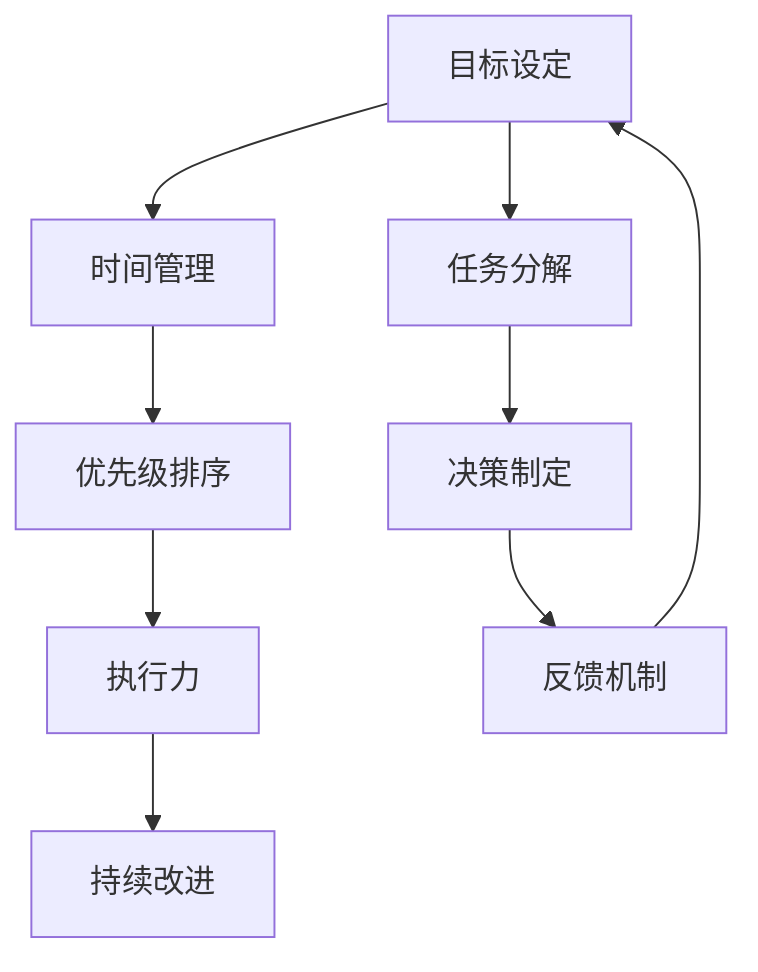

                 

# 建立高效行动体系的步骤

> **关键词：**高效行动体系、目标设定、时间管理、优先级排序、执行力、持续改进

> **摘要：**本文旨在为IT领域的技术工作者提供一套完整的建立高效行动体系的步骤。通过明确目标、合理规划、科学管理，旨在提升工作效率，实现个人和团队的目标。

## 1. 背景介绍

### 1.1 目的和范围

在快速发展的IT行业，技术工作者面临着日益增长的工作量和繁杂的任务。为了确保在高压环境下保持高效的工作状态，建立一套高效的行动体系显得尤为重要。本文将围绕这一主题，详细阐述建立高效行动体系的步骤，并提供实用的方法和技巧。

### 1.2 预期读者

本文主要面向IT行业的技术工作者，包括软件开发工程师、系统架构师、产品经理等。希望通过本文，能够帮助他们更好地规划和管理自己的工作，提升个人和团队的工作效率。

### 1.3 文档结构概述

本文将分为以下几个部分：

1. 背景介绍：阐述建立高效行动体系的必要性和重要性。
2. 核心概念与联系：介绍建立高效行动体系所需理解的核心概念。
3. 核心算法原理 & 具体操作步骤：详细讲解建立高效行动体系的方法和步骤。
4. 数学模型和公式 & 详细讲解 & 举例说明：通过数学模型和实例来说明高效行动体系的具体应用。
5. 项目实战：提供实际项目中的案例，详细解释高效行动体系的应用。
6. 实际应用场景：分析高效行动体系在不同场景中的应用。
7. 工具和资源推荐：推荐相关的工具和资源，以帮助读者进一步学习和实践。
8. 总结：展望未来发展趋势与挑战。
9. 附录：常见问题与解答。
10. 扩展阅读 & 参考资料：提供更多的阅读材料和参考文献。

### 1.4 术语表

#### 1.4.1 核心术语定义

- **目标设定**：明确想要实现的结果和期望的成果。
- **时间管理**：合理安排时间，提高工作效率。
- **优先级排序**：根据任务的重要性和紧急程度进行排序。
- **执行力**：按照计划执行任务的能力。
- **持续改进**：不断反思和优化行动体系。

#### 1.4.2 相关概念解释

- **任务分解**：将大任务拆分成小任务，便于管理和执行。
- **决策制定**：在任务执行过程中，根据实际情况进行调整和决策。
- **反馈机制**：通过反馈来评估任务执行的效果，并据此进行改进。

#### 1.4.3 缩略词列表

- **IT**：Information Technology，信息技术
- **SOP**：Standard Operating Procedure，标准操作流程

## 2. 核心概念与联系

在建立高效行动体系之前，我们需要理解几个核心概念，并了解它们之间的联系。以下是一个简单的Mermaid流程图，用于描述这些核心概念及其关系。



### 2.1 核心概念解释

- **目标设定**：目标是行动的指引，明确目标有助于集中精力和资源。目标可以是短期的，如完成一个功能模块，也可以是长期的，如提升产品用户体验。
- **时间管理**：时间管理是确保任务按时完成的关键。通过合理规划时间，避免拖延和过度工作，提高工作效率。
- **优先级排序**：在众多任务中，确定哪些任务是最重要的，有助于集中精力处理关键任务，提高整体工作效率。
- **执行力**：执行力是将计划转化为行动的能力。具备良好的执行力，意味着能够按照计划完成各项任务。
- **任务分解**：将大任务分解成小任务，有助于更好地管理和执行。小任务更容易完成，也能提供及时的反馈。
- **决策制定**：在执行过程中，需要根据实际情况做出决策。决策制定是行动体系的核心，需要综合考虑各种因素。
- **反馈机制**：通过反馈来评估任务执行的效果，并根据反馈进行改进。反馈机制有助于不断优化行动体系。

## 3. 核心算法原理 & 具体操作步骤

### 3.1 算法原理

建立高效行动体系的算法原理主要基于以下几个方面：

- **目标设定**：明确目标，确保行动有明确的方向。
- **任务分解**：将大任务分解成小任务，便于管理和执行。
- **时间管理**：合理规划时间，避免拖延和过度工作。
- **优先级排序**：根据任务的重要性和紧急程度进行排序，确保关键任务优先执行。
- **执行力**：按照计划执行任务，确保任务按时完成。
- **反馈机制**：通过反馈不断优化行动体系。

### 3.2 具体操作步骤

以下是一个具体的操作步骤，用于建立高效行动体系：

```plaintext
1. 明确目标：设定明确的目标，确保行动有明确的方向。
2. 任务分解：将大任务分解成小任务，便于管理和执行。
3. 时间管理：合理规划时间，避免拖延和过度工作。
4. 优先级排序：根据任务的重要性和紧急程度进行排序，确保关键任务优先执行。
5. 执行任务：按照计划执行任务，确保任务按时完成。
6. 反馈评估：通过反馈评估任务执行的效果，并根据反馈进行改进。
7. 持续改进：根据反馈不断优化行动体系，提高工作效率。
```

### 3.3 伪代码实现

以下是一个简化的伪代码实现，用于建立高效行动体系：

```python
# 定义目标
目标 = "提升产品用户体验"

# 任务分解
任务列表 = ["修复bug", "优化性能", "增加新功能"]

# 时间管理
时间表 = {任务:截止日期}

# 优先级排序
优先级列表 = sorted(任务列表, key=lambda x: (时间表[x],重要性))

# 执行任务
for 任务 in 优先级列表:
    执行任务(任务)

# 反馈评估
反馈 = 评估任务执行效果()

# 持续改进
改进行动体系(反馈)
```

## 4. 数学模型和公式 & 详细讲解 & 举例说明

### 4.1 数学模型

在建立高效行动体系时，我们可以使用以下数学模型：

- **时间价值函数**：衡量时间对任务完成的影响。
- **优先级排序函数**：根据任务的重要性和紧急程度进行排序。

### 4.2 公式

1. **时间价值函数**：\( V(t) = e^{-rt} \)
   - \( V(t) \)：时间价值
   - \( r \)：时间衰减率

2. **优先级排序函数**：\( P(i) = w_1 \cdot I(i) + w_2 \cdot E(i) \)
   - \( P(i) \)：任务优先级
   - \( w_1 \)：重要性权重
   - \( w_2 \)：紧急程度权重
   - \( I(i) \)：任务重要性
   - \( E(i) \)：任务紧急程度

### 4.3 详细讲解

1. **时间价值函数**：
   - 时间价值函数用于衡量时间对任务完成的影响。随着时间的推移，任务的价值会逐渐衰减。这个函数可以帮助我们理解在时间紧迫的情况下，哪些任务应该优先完成。

2. **优先级排序函数**：
   - 优先级排序函数用于根据任务的重要性和紧急程度对任务进行排序。通过这个函数，我们可以确保在资源有限的情况下，关键任务能够得到优先处理。

### 4.4 举例说明

假设我们有一个任务列表，每个任务都有重要性（I）和紧急程度（E）。我们可以使用优先级排序函数来计算每个任务的优先级，并根据优先级排序来安排任务的执行顺序。

```plaintext
任务列表：
- 修复bug（I=5，E=3）
- 优化性能（I=4，E=4）
- 增加新功能（I=3，E=5）

权重设置：
- 重要性权重（w1）= 0.6
- 紧急程度权重（w2）= 0.4

计算优先级：
- 修复bug：P = 0.6 \* 5 + 0.4 \* 3 = 3.6 + 1.2 = 4.8
- 优化性能：P = 0.6 \* 4 + 0.4 \* 4 = 2.4 + 1.6 = 4
- 增加新功能：P = 0.6 \* 3 + 0.4 \* 5 = 1.8 + 2 = 3.8

排序结果：
- 修复bug（优先级：4.8）
- 增加新功能（优先级：3.8）
- 优化性能（优先级：4）

根据优先级排序，我们应该首先完成“修复bug”，然后是“增加新功能”，最后是“优化性能”。
```

## 5. 项目实战：代码实际案例和详细解释说明

### 5.1 开发环境搭建

在开始项目实战之前，我们需要搭建一个合适的开发环境。以下是一个基本的开发环境搭建步骤：

1. 安装Python：前往Python官方网站（https://www.python.org/）下载并安装Python。
2. 安装PyCharm：下载并安装PyCharm社区版（https://www.jetbrains.com/pycharm/）。
3. 安装必要的库：在PyCharm中创建一个新的项目，并安装必要的库，如`requests`、`BeautifulSoup`等。

### 5.2 源代码详细实现和代码解读

以下是一个简单的项目案例，用于爬取一个网站的新闻列表。代码实现如下：

```python
import requests
from bs4 import BeautifulSoup

# 目标网站URL
url = "https://example.com/news"

# 发送HTTP请求
response = requests.get(url)

# 解析HTML内容
soup = BeautifulSoup(response.text, "html.parser")

# 查找新闻列表
news_list = soup.find_all("div", class_="news-item")

# 遍历新闻列表并提取信息
for news in news_list:
    title = news.find("h2").text
    link = news.find("a')['href']
    print(f"Title: {title}\nLink: {link}\n")

# 输出结果
```

### 5.3 代码解读与分析

1. **发送HTTP请求**：
   - 使用`requests`库发送HTTP GET请求，获取网站内容。

2. **解析HTML内容**：
   - 使用`BeautifulSoup`库解析获取到的HTML内容，便于提取所需信息。

3. **查找新闻列表**：
   - 使用`soup.find_all()`方法查找所有的新闻列表元素。

4. **遍历新闻列表并提取信息**：
   - 遍历新闻列表，使用`find()`方法提取每个新闻的标题和链接。

5. **输出结果**：
   - 使用`print()`方法输出每个新闻的标题和链接。

通过以上代码，我们可以轻松地爬取一个网站的新闻列表。这只是一个简单的示例，实际项目可能需要更多的功能，如分页处理、错误处理等。

### 5.4 实际应用场景

- **新闻网站爬虫**：可以用于爬取各大新闻网站的新闻列表，提供实时新闻资讯。
- **数据采集**：可以用于采集网站上的各种数据，如产品信息、用户评论等。
- **自动化测试**：可以用于自动化测试网站功能，提高测试效率。

## 6. 实际应用场景

高效行动体系在实际应用中具有广泛的场景，以下列举几个典型应用场景：

1. **项目管理工作**：在项目管理中，通过设定明确的目标、分解任务、合理规划时间和优先级，确保项目按时按质完成。
2. **软件开发**：在软件开发过程中，通过建立高效的行动体系，提高开发效率，确保按时交付高质量软件。
3. **日常任务管理**：在日常生活中，通过设定目标、分解任务、合理安排时间，提高生活质量和工作效率。
4. **团队协作**：在团队协作中，通过建立高效的行动体系，确保团队成员能够协同工作，提高团队整体执行力。

## 7. 工具和资源推荐

### 7.1 学习资源推荐

#### 7.1.1 书籍推荐

- 《高效能人士的七个习惯》（史蒂芬·柯维著）
- 《深度工作：如何有效利用每一点脑力》（卡尔·纽波特著）
- 《时间管理的艺术》（斯蒂芬·平克著）

#### 7.1.2 在线课程

- Coursera的《时间管理和优先级排序》课程
- Udemy的《Python网络爬虫从入门到精通》课程

#### 7.1.3 技术博客和网站

- GitHub（https://github.com/）：查找和分享开源项目，学习他人的优秀实践。
- Stack Overflow（https://stackoverflow.com/）：解决编程问题，获取专业建议。

### 7.2 开发工具框架推荐

#### 7.2.1 IDE和编辑器

- PyCharm（https://www.jetbrains.com/pycharm/）
- Visual Studio Code（https://code.visualstudio.com/）

#### 7.2.2 调试和性能分析工具

- Python的`pdb`模块
- PyCharm的内置调试工具

#### 7.2.3 相关框架和库

- Flask（https://flask.palletsprojects.com/）：Python的Web应用框架。
- Django（https://www.djangoproject.com/）：Python的Web开发框架。

### 7.3 相关论文著作推荐

#### 7.3.1 经典论文

- 《时间管理的艺术》（斯蒂芬·平克著）
- 《优先级排序：决策的科学》（史蒂芬·柯维著）

#### 7.3.2 最新研究成果

- 《高效能人士的七个习惯》（史蒂芬·柯维著，最新版）
- 《深度工作：如何有效利用每一点脑力》（卡尔·纽波特著，最新版）

#### 7.3.3 应用案例分析

- 《阿里巴巴：如何高效管理千亿元级资金》（阿里巴巴集团著）
- 《谷歌如何管理创新：谷歌内部管理创新实践案例》（谷歌公司著）

## 8. 总结：未来发展趋势与挑战

随着科技的快速发展，高效行动体系在IT领域的应用将越来越广泛。未来，我们可能会看到以下几个方面的发展趋势：

1. **智能化**：利用人工智能技术，实现自动化的任务分配和优先级排序。
2. **个性化**：根据个体差异，提供个性化的行动建议和方案。
3. **协作化**：通过协作工具和平台，实现跨团队的高效协作。
4. **持续改进**：利用数据分析和反馈机制，不断优化行动体系。

然而，高效行动体系也面临一些挑战，如：

1. **适应变化**：快速变化的科技环境要求行动体系具备高度的灵活性。
2. **技术壁垒**：部分高级技术和工具的掌握需要一定的时间和精力。
3. **执行难度**：在执行过程中，可能会遇到各种困难和阻力。

因此，我们需要不断学习和实践，不断提升自己的能力和执行力，以应对未来发展的挑战。

## 9. 附录：常见问题与解答

### 9.1 问题1：如何设定合理的目标？

- **解答**：设定目标时，应遵循SMART原则，即目标应具有具体性（Specific）、可衡量性（Measurable）、可实现性（Achievable）、相关性（Relevant）和时限性（Time-bound）。

### 9.2 问题2：如何进行有效的任务分解？

- **解答**：将大任务分解成小任务时，应遵循以下几个原则：
  1. 保持任务的独立性，确保每个小任务可以单独完成。
  2. 保持任务的完整性，确保所有小任务能够共同完成大任务。
  3. 确保小任务之间的逻辑关系明确。

### 9.3 问题3：如何进行优先级排序？

- **解答**：进行优先级排序时，可以考虑以下因素：
  1. 任务的重要性和紧急程度。
  2. 资源和时间的限制。
  3. 任务之间的依赖关系。

### 9.4 问题4：如何提高执行力？

- **解答**：提高执行力可以从以下几个方面入手：
  1. 建立明确的目标和计划。
  2. 保持专注，避免干扰。
  3. 培养良好的工作习惯。
  4. 建立奖励机制，激励自己。

### 9.5 问题5：如何建立有效的反馈机制？

- **解答**：建立有效的反馈机制，可以考虑以下步骤：
  1. 设定明确的评估标准和指标。
  2. 收集多方反馈，确保反馈的全面性和准确性。
  3. 分析反馈结果，找出问题和改进点。
  4. 制定改进计划，并跟踪实施情况。

## 10. 扩展阅读 & 参考资料

- 《高效能人士的七个习惯》（史蒂芬·柯维著）
- 《深度工作：如何有效利用每一点脑力》（卡尔·纽波特著）
- 《时间管理的艺术》（斯蒂芬·平克著）
- 《Python网络爬虫从入门到精通》
- 《阿里巴巴：如何高效管理千亿元级资金》（阿里巴巴集团著）
- 《谷歌如何管理创新：谷歌内部管理创新实践案例》（谷歌公司著）
- https://github.com/
- https://www.djangoproject.com/
- https://www.jetbrains.com/pycharm/
- https://stackoverflow.com/

