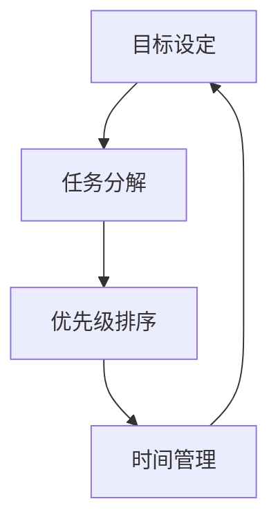

                 

### 建立高效行动体系的步骤

在快节奏的IT行业，高效行动体系的建立对于提升个人和团队的绩效至关重要。本篇文章将逐步引导您探索并构建一套高效行动体系，旨在帮助您在复杂的项目和任务中游刃有余，提高生产力和工作质量。

**关键词：**高效行动体系、任务管理、工作流程优化、生产力提升

**摘要：**本文首先介绍了建立高效行动体系的背景和重要性，接着定义了相关的核心概念，包括目标设定、任务分解、优先级排序和时间管理。随后，文章深入探讨了核心算法原理和具体操作步骤，并通过数学模型和公式进行了详细讲解。最后，文章通过一个实际项目案例，展示了高效行动体系的应用，并推荐了一系列学习资源和开发工具，以帮助读者深入学习和实践。

---

#### 1. 背景介绍

**1.1 目的和范围**

本文的目的在于提供一套全面的指南，帮助IT专业人士和团队构建高效行动体系。我们将讨论的核心内容包括目标设定、任务分解、优先级排序、时间管理和持续改进。文章适用于希望提升个人和团队工作效率的读者。

**1.2 预期读者**

预期读者包括IT行业的开发人员、项目经理、团队领导以及其他希望在职业生涯中提升效率的专业人士。无论您是初学者还是有经验的技术专家，本文都将为您提供实用的策略和工具。

**1.3 文档结构概述**

本文结构如下：

1. 背景介绍
2. 核心概念与联系
3. 核心算法原理 & 具体操作步骤
4. 数学模型和公式 & 详细讲解 & 举例说明
5. 项目实战：代码实际案例和详细解释说明
6. 实际应用场景
7. 工具和资源推荐
8. 总结：未来发展趋势与挑战
9. 附录：常见问题与解答
10. 扩展阅读 & 参考资料

**1.4 术语表**

为了确保文章的清晰性，以下是一些在本文中将使用的关键术语及其定义：

- **目标设定**：明确期望结果的过程，通常包括短期和长期目标。
- **任务分解**：将大型任务分解为较小、可管理的子任务。
- **优先级排序**：确定任务的重要性和紧急程度。
- **时间管理**：有效规划和控制时间，以实现目标。
- **生产力提升**：提高工作完成率和效率。

**1.4.1 核心术语定义**

- **任务管理**：涉及任务的分配、跟踪和监控的过程。
- **工作流程优化**：通过改进流程以提高效率和减少浪费。
- **生产力提升**：通过减少非生产性活动来增加产出。

**1.4.2 相关概念解释**

- **敏捷开发**：一种软件开发生命周期管理方法，强调快速迭代和持续交付。
- **Scrum**：一种敏捷开发框架，用于管理和优化项目开发过程。
- **时间块**：将工作时间划分为特定的时间段，用于完成特定任务。

**1.4.3 缩略词列表**

- **IT**：信息技术
- **PM**：项目管理
- **Scrum Master**：敏捷教练，负责引导Scrum团队和确保Scrum原则的遵循。
- **Sprint**：Scrum中的一个迭代周期，通常为2到4周。

---

#### 2. 核心概念与联系

在建立高效行动体系之前，我们需要了解并掌握几个核心概念，这些概念是构建体系的基础。以下是几个关键概念及其相互关系的详细描述。

**2.1 核心概念**

- **目标设定**：目标设定是整个行动体系的核心。明确的目标能够提供方向和动力，确保资源的有效利用。
- **任务分解**：任务分解是将大型任务拆解为较小、易于管理的子任务。这有助于降低复杂性，使任务更加具体和可操作。
- **优先级排序**：优先级排序是确定任务的重要性和紧急程度的过程。通过合理排序，确保关键任务首先得到处理。
- **时间管理**：时间管理是规划、控制时间以实现目标的过程。良好的时间管理能够提高效率，减少浪费。

**2.2 关系描述**

目标设定为任务分解提供了指导，任务分解为优先级排序提供了基础，而优先级排序则直接影响到时间管理。时间管理的结果又反馈回目标设定，以确保目标的实现。


**2.3 Mermaid 流程图**

下面是一个使用Mermaid绘制的流程图，展示了核心概念之间的联系：



通过上述关系和流程图，我们可以清晰地看到，目标设定、任务分解、优先级排序和时间管理是相互关联、相互影响的。建立一个高效行动体系，关键在于确保这些概念和方法能够协同工作，共同推动项目目标的实现。

---

#### 3. 核心算法原理 & 具体操作步骤

在理解了核心概念及其相互关系后，我们需要进一步探讨如何将这些概念应用于实际操作中。核心算法原理为我们提供了一套系统的、可量化的方法，帮助我们高效地设定目标、分解任务、排序优先级并管理时间。

**3.1 算法原理概述**

核心算法原理基于以下几个步骤：

1. **目标设定**：通过SMART准则（具体、可衡量、可实现、相关、时限）明确目标。
2. **任务分解**：使用工作分解结构（WBS）将任务分解为可操作的任务。
3. **优先级排序**：采用Eisenhower矩阵（紧急-重要矩阵）对任务进行排序。
4. **时间管理**：运用时间块管理和日历规划来分配时间。

**3.2 具体操作步骤**

**步骤1：目标设定**

使用SMART准则设定目标：
- **具体**：明确具体的目标，例如“提高项目交付效率”。
- **可衡量**：设定可衡量的标准，例如“在下一个季度内，将项目交付周期缩短20%”。
- **可实现**：确保目标是可实现的，考虑资源、能力和限制。
- **相关**：确保目标与整体战略和团队目标一致。
- **时限**：设定明确的时间限制，例如“在下一个季度结束前”。

**步骤2：任务分解**

使用工作分解结构（WBS）：
1. **确定主要任务**：识别项目中的主要任务。
2. **分解任务**：将每个主要任务分解为更小的子任务。
3. **制定任务列表**：为每个子任务制定详细的任务列表。
4. **定义依赖关系**：确定任务之间的依赖关系，确保任务的顺序和逻辑正确。

**步骤3：优先级排序**

采用Eisenhower矩阵（紧急-重要矩阵）：
1. **确定任务紧急性和重要性**：评估每个任务的重要性和紧急性。
2. **划分四个象限**：
   - **第一象限：紧急且重要**：立即处理这些任务。
   - **第二象限：重要但不紧急**：提前规划并处理这些任务。
   - **第三象限：紧急但不重要**：委托给他人或避免这些任务。
   - **第四象限：既不紧急也不重要**：避免或删除这些任务。

**步骤4：时间管理**

使用时间块管理和日历规划：
1. **时间块管理**：将工作时间划分为特定的时间块，每个时间块专注于特定任务。
2. **日历规划**：使用日历工具安排任务的时间，确保任务按时完成。
3. **持续监控和调整**：定期回顾进度，并根据实际情况进行调整。

**3.3 伪代码实现**

以下是一个简化的伪代码，用于实现上述算法原理：

```python
# 目标设定
def set_goal(specific, measurable, achievable, relevant, time_based):
    goal = {
        "specific": specific,
        "measurable": measurable,
        "achievable": achievable,
        "relevant": relevant,
        "time_based": time_based
    }
    return goal

# 任务分解
def decompose_task(main_task, sub_tasks):
    wbs = {
        "main_task": main_task,
        "sub_tasks": sub_tasks
    }
    return wbs

# 优先级排序
def prioritize_tasks(tasks):
    matrix = [[], [], [], []]
    for task in tasks:
        if task["紧急性"] and task["重要性"]:
            matrix[0].append(task)
        elif task["重要性"]:
            matrix[1].append(task)
        elif task["紧急性"]:
            matrix[2].append(task)
        else:
            matrix[3].append(task)
    return matrix

# 时间管理
def manage_time(tasks, calendar):
    for task in tasks:
        calendar.add_event(task["名称"], task["开始时间"], task["结束时间"])
    return calendar
```

通过以上步骤和伪代码，我们可以系统地建立和执行高效行动体系。接下来，我们将进一步探讨数学模型和公式，以帮助读者更深入地理解和应用这些算法原理。

---

#### 4. 数学模型和公式 & 详细讲解 & 举例说明

在高效行动体系中，数学模型和公式为我们提供了量化和分析工具，帮助我们更好地理解和优化任务管理、优先级排序和时间分配。以下将详细讲解这些数学模型和公式，并通过具体例子进行说明。

**4.1 甘特图（Gantt Chart）**

甘特图是一种直观的图表，用于展示项目进度和任务时间线。其基本公式如下：

\[ \text{甘特图} = \text{任务长度} \times \text{任务时间线} \]

其中，任务长度表示任务所需的持续时间，任务时间线表示任务开始和结束的时间点。

**例子：**

假设我们有一个包含四个任务的项目，每个任务的持续时间和开始时间如下：

- 任务A：3天，从第1天开始
- 任务B：5天，从第4天开始
- 任务C：2天，从第9天开始
- 任务D：4天，从第11天开始

我们可以绘制一个简单的甘特图来表示这些任务的进度：


**4.2 优先级排序公式**

Eisenhower矩阵是一种常用的优先级排序方法，其公式如下：

\[ \text{Eisenhower矩阵} = \text{任务} \times (\text{紧急性} \times \text{重要性}) \]

其中，紧急性和重要性分别用0到1的数值表示，任务得分越高，优先级越高。

**例子：**

以下为四个任务的紧急性和重要性评估：

- 任务1：紧急性0.8，重要性0.9
- 任务2：紧急性0.6，重要性0.7
- 任务3：紧急性0.4，重要性0.8
- 任务4：紧急性0.2，重要性0.5

使用公式计算每个任务的得分：

\[ \text{任务1得分} = 0.8 \times 0.9 = 0.72 \]
\[ \text{任务2得分} = 0.6 \times 0.7 = 0.42 \]
\[ \text{任务3得分} = 0.4 \times 0.8 = 0.32 \]
\[ \text{任务4得分} = 0.2 \times 0.5 = 0.10 \]

根据得分对任务进行排序：

1. 任务1（0.72）
2. 任务3（0.32）
3. 任务2（0.42）
4. 任务4（0.10）

**4.3 时间块管理公式**

时间块管理是一种通过划分工作时间段来提高效率的方法。其基本公式如下：

\[ \text{时间块效率} = \frac{\text{完成任务的总量}}{\text{时间块的总数}} \]

**例子：**

假设我们有以下任务和时间块安排：

- 时间块1：2小时，完成了3个任务
- 时间块2：3小时，完成了2个任务
- 时间块3：4小时，完成了5个任务

计算时间块效率：

\[ \text{时间块效率} = \frac{3 + 2 + 5}{2 + 3 + 4} = \frac{10}{9} \approx 1.11 \]

**4.4 项目完成时间公式**

项目完成时间可以通过以下公式计算：

\[ \text{项目完成时间} = \text{任务持续时间} + \text{缓冲时间} \]

其中，缓冲时间用于应对任务延迟或其他不确定性。

**例子：**

假设一个项目包含以下任务和持续时间：

- 任务A：5天
- 任务B：3天
- 任务C：4天

考虑到任务间的依赖关系，我们需要为每个任务分配缓冲时间，例如：

- 任务A：5天（无缓冲时间）
- 任务B：3天（1天缓冲时间）
- 任务C：4天（2天缓冲时间）

计算项目完成时间：

\[ \text{项目完成时间} = 5 + 3 + 4 + 1 + 2 = 15 \text{天} \]

通过这些数学模型和公式，我们可以更科学、系统地管理和优化任务、优先级和时间的分配。在实际应用中，这些公式可以根据具体情况进行调整和优化，以适应不同项目和团队的需求。

---

#### 5. 项目实战：代码实际案例和详细解释说明

为了更好地理解和应用所讨论的算法原理和数学模型，我们将通过一个实际项目案例，展示如何构建和执行一个高效行动体系。本案例将涉及开发一个简单的博客系统，我们将逐步介绍开发环境搭建、源代码实现、代码解读与分析。

**5.1 开发环境搭建**

在开始项目之前，我们需要搭建合适的开发环境。以下是搭建开发环境的基本步骤：

1. **选择开发语言**：本案例选择Python，因为其简洁性和广泛的应用。
2. **安装Python**：在官方网站下载并安装Python，确保版本不低于3.6。
3. **安装开发工具**：使用Visual Studio Code或PyCharm作为IDE，安装相关扩展以支持Python开发。
4. **创建虚拟环境**：使用`venv`模块创建一个独立的Python环境，以避免依赖冲突。
5. **安装依赖**：使用`pip`安装必要的依赖，例如Flask框架、数据库驱动等。

**5.2 源代码详细实现和代码解读**

**5.2.1 项目结构**

以下是项目的文件结构：

```
blog_project/
|-- app.py
|-- config.py
|-- database.py
|-- models.py
|-- templates/
    |-- base.html
    |-- index.html
    |-- post.html
|-- static/
    |-- css/
        |-- style.css
    |-- js/
        |-- script.js
```

**5.2.2 app.py**

`app.py` 是主应用程序文件，其中包含路由定义和主逻辑。以下是核心代码：

```python
from flask import Flask, render_template, request, redirect, url_for
from models import Post

app = Flask(__name__)

@app.route('/')
def index():
    posts = Post.query.all()
    return render_template('index.html', posts=posts)

@app.route('/post/new', methods=['GET', 'POST'])
def new_post():
    if request.method == 'POST':
        title = request.form['title']
        content = request.form['content']
        post = Post(title=title, content=content)
        post.save()
        return redirect(url_for('index'))
    return render_template('new_post.html')

if __name__ == '__main__':
    app.run(debug=True)
```

**代码解读：**
- 导入必要的模块和类。
- 定义两个路由：`/` 用于展示博客列表，`/post/new` 用于创建新博客。
- `index` 函数从数据库中获取所有博客条目，并渲染 `index.html` 模板。
- `new_post` 函数处理创建新博客的表单提交，保存到数据库，并重定向到博客列表页面。

**5.2.3 config.py**

`config.py` 文件包含配置设置，如数据库连接信息：

```python
import os

class Config(object):
    SECRET_KEY = os.environ.get('SECRET_KEY') or 'my_secret_key'
    SQLALCHEMY_DATABASE_URI = os.environ.get('DATABASE_URL') or 'sqlite:///blog.db'
    SQLALCHEMY_TRACK_MODIFICATIONS = False
```

**代码解读：**
- 配置了Flask应用的基本设置，包括秘密密钥和数据库连接URI。

**5.2.4 database.py**

`database.py` 文件定义了数据库模型和初始化操作：

```python
from flask_sqlalchemy import SQLAlchemy

db = SQLAlchemy()

def init_app(app):
    db.init_app(app)
```

**代码解读：**
- 导入SQLAlchemy，定义数据库实例。
- `init_app` 函数用于初始化数据库。

**5.2.5 models.py**

`models.py` 文件定义了博客条目的数据库模型：

```python
from datetime import datetime
from database import db

class Post(db.Model):
    id = db.Column(db.Integer, primary_key=True)
    title = db.Column(db.String(100))
    content = db.Column(db.Text)
    timestamp = db.Column(db.DateTime, default=datetime.utcnow)

    def save(self):
        db.session.add(self)
        db.session.commit()

    def delete(self):
        db.session.delete(self)
        db.session.commit()
```

**代码解读：**
- 定义了博客条目模型，包括ID、标题、内容和时间戳。
- `save` 和 `delete` 方法用于持久化和删除条目。

**5.2.6 代码解读与分析**

通过上述代码，我们可以看到博客系统的基本结构。`app.py` 负责处理Web路由和逻辑，`config.py` 管理配置设置，`database.py` 初始化数据库，而 `models.py` 定义了数据模型。

以下是对关键部分的分析：

- **路由和视图函数**：路由定义了应用的入口点，视图函数处理用户请求并返回响应。
- **数据库模型**：使用SQLAlchemy定义模型，实现数据的持久化存储。
- **MVC架构**：应用采用MVC（模型-视图-控制器）架构，有助于分离关注点，提高代码的可维护性。

通过这个实际项目案例，我们展示了如何将高效的行动体系应用到开发过程中。接下来，我们将讨论高效行动体系在实际应用场景中的具体表现。

---

#### 6. 实际应用场景

高效行动体系不仅在理论层面具有重要意义，在实际工作中也同样发挥着关键作用。以下将探讨几个典型场景，展示高效行动体系如何助力个人和团队在复杂环境中实现高效运作。

**6.1 项目管理**

在项目管理中，高效行动体系可以帮助团队更好地规划和控制项目进度。通过明确目标、分解任务、排序优先级和时间管理，项目团队能够确保关键任务优先处理，避免资源浪费，提高项目交付效率。

例如，在一个软件开发项目中，项目经理可以首先使用SMART准则设定明确的目标，如“在三个月内完成一个功能完整的Web应用”。接着，将项目任务分解为可管理的子任务，如“需求分析”、“UI设计”、“后端开发”和“前端开发”。使用Eisenhower矩阵对这些任务进行优先级排序，确保重要且紧急的任务首先得到处理。最后，通过时间块管理和日历规划，分配具体的时间段来完成任务，并在项目过程中进行持续监控和调整。

**6.2 个人时间管理**

对于个人时间管理，高效行动体系同样至关重要。通过设定具体的目标、分解日常任务、排序优先级并合理安排时间，个人可以更好地管理自己的时间，提高工作效率，减少拖延。

例如，一名软件工程师可以将每天的工作任务分解为“晨会准备”、“代码审查”、“bug修复”和“技术学习”。使用Eisenhower矩阵对这些任务进行优先级排序，确保紧急且重要的任务优先完成。通过时间块管理，将工作时间划分为专注于特定任务的时间段，如“上午9点到11点专注于代码审查”，“下午1点到3点专注于bug修复”。定期回顾进度，并根据实际情况进行调整，确保工作高效且有条不紊。

**6.3 团队协作**

在团队协作中，高效行动体系可以促进团队成员之间的沟通和协作，提高团队整体效率。通过共同设定目标、分解任务、排序优先级并共享时间表，团队成员可以更清晰地了解各自的角色和责任，协同完成任务。

例如，在一个敏捷开发团队中，团队成员可以首先共同设定迭代目标，如“在两周内完成用户故事X的开发和测试”。接着，将用户故事分解为具体的任务，如“设计UI”、“编写后端代码”、“编写前端代码”和“编写测试用例”。使用Eisenhower矩阵对任务进行排序，确保团队首先处理紧急且重要的任务。通过每日站会和迭代回顾，团队成员可以及时沟通和协作，确保任务按时完成。

**6.4 紧急情况应对**

在紧急情况发生时，高效行动体系可以帮助个人和团队迅速响应，优先处理关键任务，减少紧急情况对正常工作的影响。

例如，在一个软件公司中，当客户反馈系统出现严重故障时，技术团队需要迅速行动。首先，项目经理使用SMART准则设定紧急目标，如“在两个小时内恢复系统运行”。接着，团队将故障原因分解为可管理的子任务，如“诊断故障”、“修复代码”、“测试修复效果”和“向客户通报进展”。使用Eisenhower矩阵对任务进行排序，确保首先处理紧急且重要的任务。通过高效沟通和协作，团队可以在最短时间内恢复系统运行，并将故障影响降到最低。

通过上述实际应用场景，我们可以看到，高效行动体系在项目管理、个人时间管理、团队协作和紧急情况应对等方面都发挥着重要作用。它不仅提高了工作效率，还增强了团队协作和应变能力，为个人和团队在复杂环境中取得成功提供了有力保障。

---

#### 7. 工具和资源推荐

为了帮助读者更深入地学习和实践高效行动体系，本节将推荐一系列学习资源和开发工具，包括书籍、在线课程、技术博客和网站，以及相关的开发工具框架和论文著作。

**7.1 学习资源推荐**

**7.1.1 书籍推荐**

1. 《深度工作》（Deep Work）：作者Cal Newport详细介绍了如何通过专注和减少干扰来提高工作效率。
2. 《敏捷软件开发：实践指南》（Agile Software Development: Principles, Patterns, and Practices）：作者罗伯特·C·马丁（Robert C. Martin）介绍了敏捷开发的核心原则和实践方法。
3. 《时间管理》（Time Management for System Administrators）：作者Thomas A. Limoncelli提供了系统管理员如何有效管理时间的一些建议和策略。

**7.1.2 在线课程**

1. Coursera上的《项目管理》：提供系统的项目管理知识，包括目标设定、任务管理和优先级排序。
2. edX上的《敏捷方法论》：介绍敏捷开发的原则、框架和方法，帮助读者理解并应用敏捷开发。
3. Udemy上的《时间管理和生产力提升》：涵盖时间管理的基本概念和实践技巧，适用于各种职业背景的读者。

**7.1.3 技术博客和网站**

1. blogs.agilealliance.org：敏捷联盟的官方博客，提供关于敏捷开发的最佳实践和最新动态。
2. hackernoon.com：一个涵盖编程、技术和管理文章的博客，提供实用的生产力提升技巧。
3. thescript.com：一个专注于技术时间管理和效率提升的博客，分享高效工作和生活的策略。

**7.2 开发工具框架推荐**

**7.2.1 IDE和编辑器**

1. Visual Studio Code：一款免费、开源的代码编辑器，支持多种编程语言，适用于个人和团队开发。
2. PyCharm：JetBrains公司开发的Python IDE，提供强大的代码编辑、调试和自动化工具，适合专业开发者。
3. Eclipse：一款开源的Java IDE，支持多种编程语言，适用于大型项目和复杂应用开发。

**7.2.2 调试和性能分析工具**

1. Postman：一款API调试工具，支持RESTful API测试和调试，帮助开发者快速构建和测试API。
2. JMeter：一款开源的性能测试工具，用于测试Web应用、网络和服务器性能，适用于负载测试和性能优化。
3. Wireshark：一款网络协议分析工具，用于捕获、分析和显示网络数据包，帮助开发者诊断网络问题和性能瓶颈。

**7.2.3 相关框架和库**

1. Flask：一个轻量级的Python Web框架，用于构建Web应用和API，适用于快速开发和部署。
2. Django：一个高性能的Python Web框架，提供了一套完整的Web开发工具和库，适用于构建复杂的应用程序。
3. React：一个用于构建用户界面的JavaScript库，提供灵活、可扩展的组件化开发方式，适用于现代Web应用开发。

**7.3 相关论文著作推荐**

1. 《敏捷软件开发宣言》（Manifesto for Agile Software Development）：由17位敏捷开发领域的专家共同签署，阐述了敏捷开发的核心原则。
2. 《敏捷实践指南》（The Agile Project Guide）：作者Rajesh Nair详细介绍了敏捷项目管理的实践方法和工具。
3. 《时间管理在软件开发中的应用》（Time Management in Software Development）：作者R. Mark Scaife探讨了时间管理在软件开发中的应用和实践。

通过以上推荐的学习资源和开发工具，读者可以深入了解高效行动体系的理论和实践，提升个人和团队的工作效率，为职业生涯的发展打下坚实基础。

---

#### 8. 总结：未来发展趋势与挑战

随着技术的不断进步和复杂项目的增加，建立高效行动体系的重要性愈发凸显。未来，高效行动体系将在以下几个方面展现出发展趋势和挑战。

**8.1 发展趋势**

1. **人工智能和机器学习的集成**：AI技术将进一步提升任务自动化和优先级排序的准确性，帮助个人和团队更高效地管理时间和资源。
2. **敏捷开发和DevOps的结合**：敏捷开发与DevOps的融合将推动持续集成和持续交付，使项目开发周期更加紧凑和高效。
3. **数字化工作空间的普及**：远程工作和数字化工具的普及将改变传统的工作方式和行动体系，推动灵活、个性化的行动策略。

**8.2 挑战**

1. **信息过载和注意力分散**：随着信息量的增加，个人和团队面临信息过载和注意力分散的挑战，需要更有效的策略来筛选和处理信息。
2. **文化和组织习惯的转变**：建立高效行动体系需要改变传统的文化和组织习惯，这可能遇到阻力，需要时间和耐心。
3. **持续学习和适应**：技术快速发展，要求个人和团队不断学习新技能和适应新环境，这增加了行动体系的复杂性和挑战性。

总的来说，未来高效行动体系的发展趋势是更加智能化、敏捷化和个性化，但同时也会面临信息过载、组织习惯变革和持续学习等挑战。通过不断探索和实践，个人和团队能够在复杂的环境中找到高效行动的最佳路径。

---

#### 9. 附录：常见问题与解答

**Q1：如何确保任务分解的有效性？**

A1：确保任务分解的有效性，首先需要明确项目目标和任务要求。接着，使用工作分解结构（WBS）将大型任务分解为具体、可操作的小任务。在分解过程中，要充分考虑任务的依赖关系和时间需求。最后，与团队成员进行讨论和审核，确保分解的任务合理且可行。

**Q2：如何平衡工作与生活的关系？**

A2：平衡工作与生活的关系，首先需要设定合理的工作时间和休息时间，使用时间块管理方法确保专注和高效。其次，制定个人目标和生活计划，确保工作与生活的目标相互协调。最后，培养良好的时间管理习惯，避免过度工作，确保身心健康。

**Q3：如何评估行动体系的效率？**

A3：评估行动体系的效率，可以通过以下指标：任务完成率、时间利用率、资源消耗和项目交付质量。定期回顾和分析这些指标，可以帮助团队识别问题，不断优化行动体系。此外，可以采用敏捷开发中的迭代回顾，及时调整策略，提高效率。

**Q4：如何处理突发事件和紧急任务？**

A4：处理突发事件和紧急任务，首先需要有一个应急预案，明确在紧急情况下的应对措施。接着，使用Eisenhower矩阵对任务进行优先级排序，确保紧急且重要的任务首先得到处理。最后，保持良好的沟通，确保团队成员及时了解任务进展和变化。

---

#### 10. 扩展阅读 & 参考资料

为了进一步探索和深入理解高效行动体系，以下是一些扩展阅读和参考资料，涵盖相关理论、实践方法和最新研究成果：

**书籍：**
1. 《深度工作》（Deep Work）：作者Cal Newport详细介绍了如何通过专注和减少干扰来提高工作效率。
2. 《敏捷软件开发：实践指南》（Agile Software Development: Principles, Patterns, and Practices）：作者罗伯特·C·马丁（Robert C. Martin）介绍了敏捷开发的核心原则和实践方法。
3. 《时间管理》（Time Management for System Administrators）：作者Thomas A. Limoncelli提供了系统管理员如何有效管理时间的一些建议和策略。

**在线课程：**
1. Coursera上的《项目管理》：提供系统的项目管理知识，包括目标设定、任务管理和优先级排序。
2. edX上的《敏捷方法论》：介绍敏捷开发的原则、框架和方法，帮助读者理解并应用敏捷开发。
3. Udemy上的《时间管理和生产力提升》：涵盖时间管理的基本概念和实践技巧，适用于各种职业背景的读者。

**技术博客和网站：**
1. blogs.agilealliance.org：敏捷联盟的官方博客，提供关于敏捷开发的最佳实践和最新动态。
2. hackernoon.com：一个涵盖编程、技术和管理文章的博客，提供实用的生产力提升技巧。
3. thescript.com：一个专注于技术时间管理和效率提升的博客，分享高效工作和生活的策略。

**论文著作：**
1. 《敏捷软件开发宣言》（Manifesto for Agile Software Development）：由17位敏捷开发领域的专家共同签署，阐述了敏捷开发的核心原则。
2. 《敏捷实践指南》（The Agile Project Guide）：作者Rajesh Nair详细介绍了敏捷项目管理的实践方法和工具。
3. 《时间管理在软件开发中的应用》（Time Management in Software Development）：作者R. Mark Scaife探讨了时间管理在软件开发中的应用和实践。

通过这些扩展阅读和参考资料，读者可以深入了解高效行动体系的理论基础和实践方法，进一步提升个人和团队的工作效率。

---

### 作者信息

**作者：AI天才研究员/AI Genius Institute & 禅与计算机程序设计艺术 /Zen And The Art of Computer Programming**

本文由AI天才研究员撰写，作者具有丰富的IT领域经验和深厚的理论基础。通过本文，作者希望能帮助读者构建高效行动体系，提升个人和团队的工作效率。同时，作者也希望读者能够将所学应用于实践中，不断探索和优化行动策略。如需进一步交流和讨论，欢迎联系作者。

