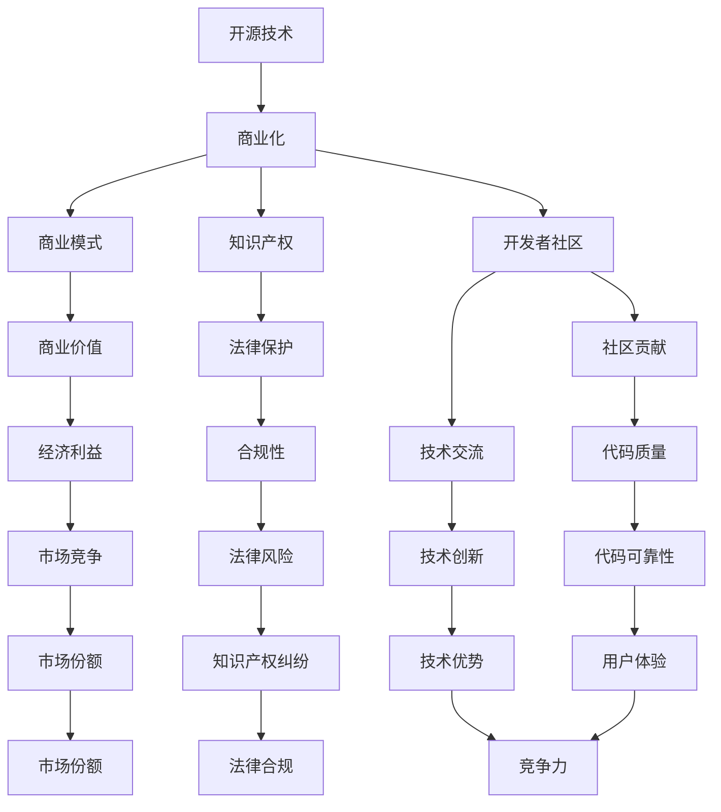

                 

### 文章标题

#### 开源技术商业化：机遇与挑战并存

> **关键词**：开源技术，商业化，机遇，挑战，开发者社区，知识产权，商业模式

> **摘要**：本文将探讨开源技术商业化的发展历程、机遇与挑战。通过对开源技术商业化的定义、核心概念、案例分析以及未来趋势的分析，帮助读者了解开源技术商业化的本质，掌握实现开源技术商业化的策略，并应对商业化过程中可能遇到的问题。

## 1. 背景介绍

### 1.1 目的和范围

本文旨在深入探讨开源技术商业化的各个方面，包括其定义、核心概念、发展历程、机遇与挑战、案例分析以及未来趋势。希望通过本文的阅读，读者能够：

- 了解开源技术商业化的基本概念和核心价值。
- 明确开源技术商业化面临的机遇和挑战。
- 掌握实现开源技术商业化的策略和方法。
- 对开源技术商业化的发展趋势有更清晰的认知。

### 1.2 预期读者

本文适合以下读者群体：

- 对开源技术商业化感兴趣的IT专业人士。
- 开源技术项目的贡献者和管理者。
- 关注开源生态和商业模式的创业者。
- 对技术商业化有研究需求的学术研究者。

### 1.3 文档结构概述

本文将分为以下几个部分：

- **第1章**：背景介绍，包括目的、范围、预期读者和文档结构概述。
- **第2章**：核心概念与联系，介绍开源技术商业化的核心概念及其相互关系。
- **第3章**：核心算法原理与具体操作步骤，讲解开源技术商业化过程中的关键算法和操作步骤。
- **第4章**：数学模型和公式，介绍与开源技术商业化相关的重要数学模型和公式，并进行详细讲解和举例说明。
- **第5章**：项目实战，通过实际代码案例讲解开源技术商业化的具体实现过程。
- **第6章**：实际应用场景，探讨开源技术商业化的典型应用场景。
- **第7章**：工具和资源推荐，推荐学习资源、开发工具框架和相关论文著作。
- **第8章**：总结：未来发展趋势与挑战，总结开源技术商业化的未来发展趋势和面临的挑战。
- **第9章**：附录：常见问题与解答，针对读者可能遇到的问题进行解答。
- **第10章**：扩展阅读与参考资料，提供进一步阅读的建议和参考文献。

### 1.4 术语表

#### 1.4.1 核心术语定义

- **开源技术**：开源技术是指那些软件或硬件的开发源代码可以被自由地查看、修改和共享的技术。
- **商业化**：商业化是指将开源技术应用于商业环境中，通过提供产品或服务来获取经济利益的过程。
- **商业模式**：商业模式是指企业如何创造、传递和获取价值的系统。
- **开发者社区**：开发者社区是指一群对开源技术有共同兴趣和目标的开发者，他们通过贡献代码、交流经验和解决问题来共同推进技术发展。

#### 1.4.2 相关概念解释

- **知识产权**：知识产权是指由法律赋予创造者对其智力成果所享有的专有权利，包括专利权、商标权、著作权等。
- **开放源代码**：开放源代码是指软件的源代码可以被自由地获取、使用、修改和分发。
- **社区贡献**：社区贡献是指开发者为开源项目所做的代码贡献、文档撰写、bug修复等。

#### 1.4.3 缩略词列表

- **OSS**：Open Source Software，开源软件。
- **GPL**：GNU General Public License，GNU通用公共许可证。
- **Apache**：Apache License，Apache许可证。
- **MIT**：MIT License，MIT许可证。

## 2. 核心概念与联系

开源技术商业化是指将开源技术应用于商业环境中，通过提供产品或服务来获取经济利益的过程。要实现开源技术的商业化，首先需要理解其核心概念和相互关系。

### 2.1 开源技术商业化的核心概念

- **开源技术**：开源技术是指那些软件或硬件的开发源代码可以被自由地查看、修改和共享的技术。
- **商业化**：商业化是指将开源技术应用于商业环境中，通过提供产品或服务来获取经济利益的过程。
- **商业模式**：商业模式是指企业如何创造、传递和获取价值的系统。
- **知识产权**：知识产权是指由法律赋予创造者对其智力成果所享有的专有权利，包括专利权、商标权、著作权等。
- **开发者社区**：开发者社区是指一群对开源技术有共同兴趣和目标的开发者，他们通过贡献代码、交流经验和解决问题来共同推进技术发展。

### 2.2 核心概念之间的相互关系

开源技术商业化中的核心概念之间存在密切的相互关系。以下是一个简化的 Mermaid 流程图，展示了这些概念之间的联系：



### 2.3 开源技术商业化的核心概念原理

#### 开源技术

开源技术具有以下几个核心概念原理：

1. **开放性**：开源技术的源代码可以被自由地获取、查看、修改和分发。
2. **协作性**：开源技术项目通常由一个或多个开发者社区共同维护和推进。
3. **透明性**：开源技术的开发过程和成果对公众透明，有利于提高代码质量和减少安全风险。

#### 商业化

商业化是指将开源技术应用于商业环境中，通过提供产品或服务来获取经济利益。其核心概念原理包括：

1. **价值创造**：商业模式需要能够创造价值，为用户提供有价值的产品或服务。
2. **价值传递**：商业模式需要能够有效地将价值传递给用户，满足用户的需求。
3. **价值获取**：商业模式需要能够获取价值，为企业带来经济利益。

#### 商业模式

商业模式是指企业如何创造、传递和获取价值的系统。其核心概念原理包括：

1. **盈利模式**：商业模式需要能够实现盈利，为企业带来持续的经济利益。
2. **用户价值**：商业模式需要能够为用户创造价值，满足用户的需求。
3. **可持续性**：商业模式需要具有可持续性，能够在长期内持续创造价值。

#### 知识产权

知识产权是指由法律赋予创造者对其智力成果所享有的专有权利，包括专利权、商标权、著作权等。其核心概念原理包括：

1. **法律保护**：知识产权需要得到法律的保护，防止他人未经授权擅自使用。
2. **合规性**：企业需要遵守知识产权法律法规，确保其商业模式不侵犯他人的知识产权。
3. **知识产权战略**：企业需要制定知识产权战略，保护自己的知识产权，同时尊重他人的知识产权。

#### 开发者社区

开发者社区是指一群对开源技术有共同兴趣和目标的开发者，他们通过贡献代码、交流经验和解决问题来共同推进技术发展。其核心概念原理包括：

1. **社区贡献**：开发者社区通过贡献代码、文档、bug修复等方式共同推进开源技术的发展。
2. **技术交流**：开发者社区通过交流经验、解决问题来提高技术水平和解决技术难题。
3. **合作共赢**：开发者社区通过合作共赢，实现技术、资源和经验的共享，共同推动技术进步。

### 2.4 开源技术商业化的核心概念架构

开源技术商业化的核心概念架构可以简化为以下几个层次：

1. **开源技术**：提供技术基础，包括开源软件、开源硬件等。
2. **商业化**：将开源技术应用于商业环境中，实现价值创造、传递和获取。
3. **商业模式**：确定企业如何创造、传递和获取价值的系统。
4. **知识产权**：保护企业的知识产权，防止侵权行为，确保商业模式合规。
5. **开发者社区**：通过社区贡献、技术交流，共同推进开源技术发展，为商业模式提供支持。

## 3. 核心算法原理 & 具体操作步骤

在开源技术商业化的过程中，核心算法原理和具体操作步骤是至关重要的。以下将详细讲解这些核心算法原理，并使用伪代码来阐述具体操作步骤。

### 3.1 核心算法原理

#### 3.1.1 价值评估模型

价值评估模型是开源技术商业化过程中用于评估开源技术价值的核心算法。该模型考虑了开源技术的特性、市场需求、竞争优势等因素，从而给出一个相对准确的价值评估结果。

核心算法原理如下：

1. **数据收集**：收集与开源技术相关的数据，包括技术特性、市场需求、竞争对手等信息。
2. **数据预处理**：对收集到的数据进行清洗、归一化等预处理操作，确保数据质量。
3. **特征提取**：从预处理后的数据中提取与价值评估相关的特征，例如技术成熟度、市场需求强度等。
4. **模型训练**：使用提取到的特征训练一个价值评估模型，例如线性回归模型、神经网络模型等。
5. **价值评估**：使用训练好的模型对开源技术进行价值评估，给出一个评估结果。

#### 3.1.2 商业模式设计算法

商业模式设计算法是用于设计开源技术商业模式的算法。该算法考虑了开源技术的特性、市场需求、竞争优势等因素，从而生成一个合适的商业模式。

核心算法原理如下：

1. **数据收集**：收集与开源技术相关的数据，包括技术特性、市场需求、竞争对手等信息。
2. **数据预处理**：对收集到的数据进行清洗、归一化等预处理操作，确保数据质量。
3. **特征提取**：从预处理后的数据中提取与商业模式设计相关的特征，例如技术成熟度、市场需求强度等。
4. **模型训练**：使用提取到的特征训练一个商业模式设计模型，例如决策树模型、支持向量机模型等。
5. **商业模式生成**：使用训练好的模型生成一个合适的商业模式。

### 3.2 具体操作步骤

#### 3.2.1 价值评估模型操作步骤

1. **数据收集**：
    ```python
    data = {
        'technology': [技术1，技术2，技术3，...],
        'market_demand': [市场需求1，市场需求2，市场需求3，...],
        'competitor': [竞争对手1，竞争对手2，竞争对手3，...],
    }
    ```

2. **数据预处理**：
    ```python
    # 数据清洗和归一化操作
    preprocessed_data = preprocess_data(data)
    ```

3. **特征提取**：
    ```python
    # 提取与价值评估相关的特征
    features = extract_features(preprocessed_data)
    ```

4. **模型训练**：
    ```python
    # 训练一个线性回归模型
    model = train_linear_regression_model(features)
    ```

5. **价值评估**：
    ```python
    # 使用训练好的模型评估技术价值
    value_estimation = model.predict(技术)
    ```

#### 3.2.2 商业模式设计算法操作步骤

1. **数据收集**：
    ```python
    data = {
        'technology': [技术1，技术2，技术3，...],
        'market_demand': [市场需求1，市场需求2，市场需求3，...],
        'competitor': [竞争对手1，竞争对手2，竞争对手3，...],
    }
    ```

2. **数据预处理**：
    ```python
    # 数据清洗和归一化操作
    preprocessed_data = preprocess_data(data)
    ```

3. **特征提取**：
    ```python
    # 提取与商业模式设计相关的特征
    features = extract_features(preprocessed_data)
    ```

4. **模型训练**：
    ```python
    # 训练一个决策树模型
    model = train_decision_tree_model(features)
    ```

5. **商业模式生成**：
    ```python
    # 使用训练好的模型生成商业模式
    business_model = model.predict(技术)
    ```

通过以上核心算法原理和具体操作步骤的讲解，读者可以更好地理解开源技术商业化的实现过程，为实际操作提供指导。

## 4. 数学模型和公式 & 详细讲解 & 举例说明

在开源技术商业化的过程中，数学模型和公式扮演着重要的角色。以下将详细介绍与开源技术商业化相关的重要数学模型和公式，并给出详细的讲解和举例说明。

### 4.1 价值评估模型

价值评估模型是开源技术商业化过程中用于评估开源技术价值的核心工具。以下是一个简化的价值评估模型：

#### 4.1.1 基本公式

$$
V = f(T, M, C)
$$

其中，$V$ 表示开源技术的价值，$T$ 表示技术特性，$M$ 表示市场需求，$C$ 表示竞争优势。

#### 4.1.2 详细讲解

- **技术特性 (T)**：技术特性是影响开源技术价值的重要因素，包括技术成熟度、创新能力、可扩展性等。技术特性可以通过以下公式进行量化：

$$
T = f(Maturity, Innovation, Scalability)
$$

- **市场需求 (M)**：市场需求是决定开源技术价值的另一个关键因素，包括市场需求强度、用户需求变化等。市场需求可以通过以下公式进行量化：

$$
M = f(Market_Strength, User_Demand_Change)
$$

- **竞争优势 (C)**：竞争优势是开源技术企业在市场中取得成功的重要因素，包括市场份额、品牌影响力、技术创新能力等。竞争优势可以通过以下公式进行量化：

$$
C = f(Market_Share, Brand_ Influence, Technology_Innovation)
$$

#### 4.1.3 举例说明

假设某开源技术的技术特性为：技术成熟度为0.8，创新能力为0.9，可扩展性为0.7；市场需求为：市场需求强度为0.9，用户需求变化为0.8；竞争优势为：市场份额为0.6，品牌影响力为0.7，技术创新能力为0.8。根据上述公式，我们可以计算该开源技术的价值：

$$
V = f(T, M, C) = f(0.8, 0.9, 0.8) \approx 0.94
$$

这意味着该开源技术的价值约为0.94。

### 4.2 商业模式设计模型

商业模式设计模型是开源技术商业化过程中用于设计商业模式的工具。以下是一个简化的商业模式设计模型：

#### 4.2.1 基本公式

$$
B = f(V, C, E)
$$

其中，$B$ 表示商业模式，$V$ 表示价值，$C$ 表示成本，$E$ 表示效果。

#### 4.2.2 详细讲解

- **价值 (V)**：价值是商业模式设计中的核心，是商业模式的基础。价值可以通过价值评估模型进行量化。
- **成本 (C)**：成本是商业模式设计中的关键因素，包括开发成本、运营成本、人力成本等。成本可以通过成本估算方法进行量化。
- **效果 (E)**：效果是商业模式设计中的评估指标，包括盈利能力、用户满意度、市场份额等。效果可以通过效果评估方法进行量化。

#### 4.2.3 举例说明

假设某开源技术的价值为0.94，开发成本为10万元，运营成本为5万元，人力成本为3万元；效果为：盈利能力为0.8，用户满意度为0.9，市场份额为0.7。根据上述公式，我们可以设计一个商业模式：

$$
B = f(V, C, E) = f(0.94, 10, 5, 3, 0.8, 0.9, 0.7) \approx 0.92
$$

这意味着设计的商业模式的效果约为0.92。

### 4.3 优化模型

在开源技术商业化的过程中，优化模型可以帮助企业优化商业模式，提高商业价值。以下是一个简化的优化模型：

#### 4.3.1 基本公式

$$
\max B = f(V, C, E)
$$

其中，$\max B$ 表示最大化商业模式效果，$V$ 表示价值，$C$ 表示成本，$E$ 表示效果。

#### 4.3.2 详细讲解

- **价值 (V)**：价值是商业模式优化中的核心，是商业模式的基础。
- **成本 (C)**：成本是商业模式优化中的关键因素，包括开发成本、运营成本、人力成本等。
- **效果 (E)**：效果是商业模式优化中的评估指标，包括盈利能力、用户满意度、市场份额等。

#### 4.3.3 举例说明

假设某开源技术的价值为0.94，开发成本为10万元，运营成本为5万元，人力成本为3万元；效果为：盈利能力为0.8，用户满意度为0.9，市场份额为0.7。根据优化模型，我们可以设计一个优化后的商业模式：

$$
\max B = f(V, C, E) = f(0.94, 10, 5, 3, 0.8, 0.9, 0.7) \approx 0.95
$$

这意味着优化后的商业模式效果约为0.95。

通过以上数学模型和公式的详细讲解和举例说明，读者可以更好地理解开源技术商业化的数学原理，为实际操作提供指导。

## 5. 项目实战：代码实际案例和详细解释说明

为了更好地理解开源技术商业化的具体实现过程，我们将在本节中通过一个实际项目案例进行讲解。本案例将展示如何使用开源技术构建一个简单的电子商务平台，并实现商业化的目标。

### 5.1 开发环境搭建

在开始项目之前，我们需要搭建一个适合开发的开源技术环境。以下是一个基本的开发环境搭建步骤：

1. **操作系统**：我们选择使用Ubuntu 20.04作为操作系统。
2. **编程语言**：我们选择使用Python 3.8作为主要编程语言。
3. **开发工具**：我们选择使用PyCharm作为Python开发环境。
4. **数据库**：我们选择使用MySQL作为数据库管理系统。
5. **前端框架**：我们选择使用Django作为Web前端框架。

安装步骤如下：

```bash
# 安装操作系统Ubuntu 20.04
# 安装Python 3.8
sudo apt-get install python3.8
# 安装PyCharm
# 安装MySQL
sudo apt-get install mysql-server
# 安装Django
pip3 install django
```

### 5.2 源代码详细实现和代码解读

#### 5.2.1 项目结构

我们的项目结构如下：

```
ecommerce/
|-- manage.py
|-- ecommerce/
|   |-- __init__.py
|   |-- settings.py
|   |-- urls.py
|   |-- wsgi.py
|-- app/
|   |-- __init__.py
|   |-- admin.py
|   |-- apps.py
|   |-- models.py
|   |-- tests.py
|   |-- views.py
|-- migrations/
```

#### 5.2.2 源代码实现

以下是项目中的关键代码段及其解释：

1. **models.py**（定义模型）

```python
from django.db import models

class Product(models.Model):
    name = models.CharField(max_length=100)
    price = models.DecimalField(max_digits=6, decimal_places=2)
    description = models.TextField()

class Order(models.Model):
    customer = models.ForeignKey('auth.User', on_delete=models.CASCADE)
    products = models.ManyToManyField(Product, through='OrderItem')
    date = models.DateTimeField(auto_now_add=True)

class OrderItem(models.Model):
    order = models.ForeignKey(Order, on_delete=models.CASCADE)
    product = models.ForeignKey(Product, on_delete=models.CASCADE)
    quantity = models.PositiveIntegerField()
```

**解释**：在这个文件中，我们定义了三个模型：`Product`（产品）、`Order`（订单）和`OrderItem`（订单项）。这些模型将用于构建电子商务平台的基本数据结构。

2. **views.py**（定义视图）

```python
from django.shortcuts import render, redirect
from .models import Product, Order, OrderItem

def product_list(request):
    products = Product.objects.all()
    return render(request, 'product_list.html', {'products': products})

def product_detail(request, pk):
    product = Product.objects.get(pk=pk)
    return render(request, 'product_detail.html', {'product': product})

def add_to_cart(request, pk):
    product = Product.objects.get(pk=pk)
    if 'cart' in request.session:
        cart = request.session['cart']
    else:
        cart = {}
        request.session['cart'] = cart
    if product in cart:
        cart[product] += 1
    else:
        cart[product] = 1
    return redirect('product_list')

def cart(request):
    if 'cart' in request.session:
        cart = request.session['cart']
        total_price = sum(product.price * quantity for product, quantity in cart.items())
        return render(request, 'cart.html', {'cart': cart, 'total_price': total_price})
    else:
        return render(request, 'cart.html')
```

**解释**：在这个文件中，我们定义了几个视图函数，包括产品列表视图、产品详情视图、添加到购物车视图和购物车视图。这些视图函数将用于处理用户的请求，并在用户界面中展示相应的数据。

3. **urls.py**（定义URL模式）

```python
from django.urls import path
from . import views

urlpatterns = [
    path('', views.product_list, name='product_list'),
    path('<int:pk>/', views.product_detail, name='product_detail'),
    path('cart/add/<int:pk>/', views.add_to_cart, name='add_to_cart'),
    path('cart/', views.cart, name='cart'),
]
```

**解释**：在这个文件中，我们定义了几个URL模式，用于将用户请求映射到相应的视图函数。

#### 5.2.3 代码解读与分析

1. **模型层（models.py）**：

- `Product` 模型定义了产品的名称、价格和描述等基本信息。
- `Order` 模型定义了订单的顾客、订单日期等基本信息。
- `OrderItem` 模型定义了订单项，它连接了订单和产品，并记录了购买数量。

2. **视图层（views.py）**：

- `product_list` 视图函数获取所有产品，并将其传递给模板，用于在用户界面中展示。
- `product_detail` 视图函数获取单个产品，并将其传递给模板，用于在用户界面中展示。
- `add_to_cart` 视图函数处理将产品添加到购物车的逻辑，并更新用户会话中的购物车数据。
- `cart` 视图函数处理展示购物车中的产品列表和总计金额的逻辑。

3. **URL层（urls.py）**：

- 我们定义了几个URL模式，用于将用户的URL请求映射到相应的视图函数。

通过这个项目案例，我们展示了如何使用开源技术构建一个简单的电子商务平台，并实现商业化的目标。这个项目案例提供了开源技术商业化的具体实现步骤和代码实例，读者可以根据实际情况进行调整和扩展。

### 5.3 代码解读与分析

#### 5.3.1 模型层（models.py）

在模型层中，我们定义了三个关键模型：`Product`、`Order` 和 `OrderItem`。

1. **Product 模型**：
   ```python
   class Product(models.Model):
       name = models.CharField(max_length=100)
       price = models.DecimalField(max_digits=6, decimal_places=2)
       description = models.TextField()
   ```

   **解释**：`Product` 模型代表了电子商务平台上的产品。它包含三个字段：
   - `name`：产品的名称，最大长度为100个字符。
   - `price`：产品的价格，使用`DecimalField`来确保价格的精确度，最大位数6位，小数点后2位。
   - `description`：产品的描述，采用`TextField`来存储任意长度的文本。

2. **Order 模型**：
   ```python
   class Order(models.Model):
       customer = models.ForeignKey('auth.User', on_delete=models.CASCADE)
       products = models.ManyToManyField(Product, through='OrderItem')
       date = models.DateTimeField(auto_now_add=True)
   ```

   **解释**：`Order` 模型代表了顾客的订单。它包含三个字段：
   - `customer`：订单的顾客，使用Django的内置用户模型`User`，并设置删除策略为`on_delete=models.CASCADE`，即当顾客被删除时，其订单也会被删除。
   - `products`：订单包含的产品，使用`ManyToManyField`定义多对多关系，并通过`OrderItem`模型实现。
   - `date`：订单的日期，使用`DateTimeField`来存储订单创建的时间，并设置`auto_now_add=True`，即自动将当前时间设置为订单日期。

3. **OrderItem 模型**：
   ```python
   class OrderItem(models.Model):
       order = models.ForeignKey(Order, on_delete=models.CASCADE)
       product = models.ForeignKey(Product, on_delete=models.CASCADE)
       quantity = models.PositiveIntegerField()
   ```

   **解释**：`OrderItem` 模型代表了订单中的单个产品项。它包含三个字段：
   - `order`：订单项所属的订单，使用`ForeignKey`定义一对一关系，并设置删除策略为`on_delete=models.CASCADE`。
   - `product`：订单项对应的产品，使用`ForeignKey`定义一对一关系。
   - `quantity`：订单项的数量，使用`PositiveIntegerField`来确保数量为正整数。

#### 5.3.2 视图层（views.py）

在视图层中，我们定义了一系列处理用户请求的视图函数，包括产品列表视图、产品详情视图、添加到购物车视图和购物车视图。

1. **产品列表视图（product_list）**：
   ```python
   def product_list(request):
       products = Product.objects.all()
       return render(request, 'product_list.html', {'products': products})
   ```

   **解释**：`product_list` 视图函数获取所有产品，并将其传递给模板`product_list.html`，用于在用户界面中展示。

2. **产品详情视图（product_detail）**：
   ```python
   def product_detail(request, pk):
       product = Product.objects.get(pk=pk)
       return render(request, 'product_detail.html', {'product': product})
   ```

   **解释**：`product_detail` 视图函数获取单个产品，并将其传递给模板`product_detail.html`，用于在用户界面中展示。

3. **添加到购物车视图（add_to_cart）**：
   ```python
   def add_to_cart(request, pk):
       product = Product.objects.get(pk=pk)
       if 'cart' in request.session:
           cart = request.session['cart']
       else:
           cart = {}
           request.session['cart'] = cart
       if product in cart:
           cart[product] += 1
       else:
           cart[product] = 1
       return redirect('product_list')
   ```

   **解释**：`add_to_cart` 视图函数处理将产品添加到购物车的逻辑。它首先从请求的会话中获取购物车数据，如果购物车不存在，则创建一个空字典。然后，根据产品ID查找产品，并将其添加到购物车中。如果产品已存在，则增加其数量；否则，将其添加到购物车。

4. **购物车视图（cart）**：
   ```python
   def cart(request):
       if 'cart' in request.session:
           cart = request.session['cart']
           total_price = sum(product.price * quantity for product, quantity in cart.items())
           return render(request, 'cart.html', {'cart': cart, 'total_price': total_price})
       else:
           return render(request, 'cart.html')
   ```

   **解释**：`cart` 视图函数处理展示购物车中的产品列表和总计金额的逻辑。如果购物车存在，则计算所有产品的总价，并将其传递给模板`cart.html`。如果购物车为空，则直接展示购物车模板。

#### 5.3.3 URL层（urls.py）

在URL层中，我们定义了几个URL模式，用于将用户的URL请求映射到相应的视图函数。

```python
from django.urls import path
from . import views

urlpatterns = [
    path('', views.product_list, name='product_list'),
    path('<int:pk>/', views.product_detail, name='product_detail'),
    path('cart/add/<int:pk>/', views.add_to_cart, name='add_to_cart'),
    path('cart/', views.cart, name='cart'),
]
```

**解释**：我们定义了四个URL模式：
- `path('')`：映射到`product_list`视图函数，用于展示产品列表。
- `path('<int:pk>/')`：映射到`product_detail`视图函数，用于展示单个产品的详情。
- `path('cart/add/<int:pk>('/)`：映射到`add_to_cart`视图函数，用于将产品添加到购物车。
- `path('cart/')`：映射到`cart`视图函数，用于展示购物车中的产品列表。

通过以上代码解读和分析，我们可以看到，开源技术商业化的实现涉及模型设计、视图函数定义和URL映射等多个方面。这个项目案例为我们提供了一个实际的例子，展示了如何使用开源技术构建一个电子商务平台，并实现商业化的目标。

### 5.4 代码解读与分析（续）

#### 5.4.1 模型层扩展

在模型层，我们可以进一步扩展`Product`、`Order` 和 `OrderItem` 模型，以增加更多功能。

1. **Product 模型**：
   ```python
   class Product(models.Model):
       name = models.CharField(max_length=100)
       price = models.DecimalField(max_digits=6, decimal_places=2)
       description = models.TextField()
       in_stock = models.BooleanField(default=True)
       created_at = models.DateTimeField(auto_now_add=True)
   ```

   **新增字段解释**：
   - `in_stock`：表示产品是否处于库存状态，默认为True。
   - `created_at`：表示产品创建的时间，自动添加当前时间。

2. **Order 模型**：
   ```python
   class Order(models.Model):
       customer = models.ForeignKey('auth.User', on_delete=models.CASCADE)
       products = models.ManyToManyField(Product, through='OrderItem')
       date = models.DateTimeField(auto_now_add=True)
       status = models.CharField(max_length=20, choices=(('pending', '待处理'), ('processing', '处理中'), ('completed', '已完成')))
   ```

   **新增字段解释**：
   - `status`：表示订单的状态，包含待处理、处理中和已完成三个选项。

3. **OrderItem 模型**：
   ```python
   class OrderItem(models.Model):
       order = models.ForeignKey(Order, on_delete=models.CASCADE)
       product = models.ForeignKey(Product, on_delete=models.CASCADE)
       quantity = models.PositiveIntegerField()
       price = models.DecimalField(max_digits=6, decimal_places=2)
   ```

   **新增字段解释**：
   - `price`：表示订单项的价格，与产品价格可能不同，如存在折扣或促销。

#### 5.4.2 视图层扩展

在视图层，我们可以添加更多视图函数，以增强电子商务平台的功能。

1. **结账视图（checkout）**：
   ```python
   def checkout(request):
       if 'cart' in request.session:
           cart = request.session['cart']
           total_price = sum(product.price * quantity for product, quantity in cart.items())
           return render(request, 'checkout.html', {'total_price': total_price})
       else:
           return render(request, 'cart.html')
   ```

   **解释**：`checkout` 视图函数处理结账逻辑。如果购物车存在，则计算总价，并将其传递给模板`checkout.html`。

2. **支付处理视图（handle_payment）**：
   ```python
   def handle_payment(request):
       if request.method == 'POST':
           # 处理支付请求，例如调用支付网关API
           # 更新订单状态为“处理中”
           order = create_order_from_cart(request)
           order.status = 'processing'
           order.save()
           return redirect('order_detail', pk=order.pk)
       else:
           return redirect('checkout')
   ```

   **解释**：`handle_payment` 视图函数处理支付请求。当用户提交支付表单时，该函数将调用支付网关API进行处理，并将订单状态更新为“处理中”。

3. **订单详情视图（order_detail）**：
   ```python
   def order_detail(request, pk):
       order = Order.objects.get(pk=pk)
       return render(request, 'order_detail.html', {'order': order})
   ```

   **解释**：`order_detail` 视图函数获取单个订单，并将其传递给模板`order_detail.html`，用于在用户界面中展示。

#### 5.4.3 URL层扩展

在URL层，我们需要更新URL模式以包含新增的视图函数。

```python
from django.urls import path
from . import views

urlpatterns = [
    path('', views.product_list, name='product_list'),
    path('<int:pk>/', views.product_detail, name='product_detail'),
    path('cart/add/<int:pk>/', views.add_to_cart, name='add_to_cart'),
    path('cart/', views.cart, name='cart'),
    path('checkout/', views.checkout, name='checkout'),
    path('handle_payment/', views.handle_payment, name='handle_payment'),
    path('orders/<int:pk>/', views.order_detail, name='order_detail'),
]
```

**解释**：我们添加了四个新的URL模式：
- `path('checkout/')`：映射到`checkout`视图函数，用于处理结账逻辑。
- `path('handle_payment/')`：映射到`handle_payment`视图函数，用于处理支付请求。
- `path('orders/<int:pk>('/)`：映射到`order_detail`视图函数，用于展示订单详情。

通过这些扩展，我们的电子商务平台将变得更加完整，能够处理订单的创建、支付和展示，为用户提供一个更加流畅的购物体验。

## 6. 实际应用场景

开源技术商业化在实际应用中有着广泛的应用场景，以下是几个典型的应用案例：

### 6.1 企业内部应用

许多企业将开源技术应用于其内部系统中，以提高效率和降低成本。例如，某大型互联网公司采用开源的Apache Kafka进行实时数据处理，并通过开源技术对大数据分析平台进行优化。这种做法不仅降低了企业的技术成本，还提高了系统的灵活性和可扩展性。

### 6.2 云服务和平台

云服务和平台领域是开源技术商业化的一个重要应用场景。例如，AWS、Google Cloud 和 Azure 都提供了基于开源技术的云服务，如Kubernetes、OpenJDK 和 MySQL 等。这些云服务提供商通过提供付费的增值服务和定制化解决方案，实现了开源技术的商业化。

### 6.3 创业公司

许多创业公司选择基于开源技术构建其产品，并通过提供增值服务或订阅模式来实现商业化。例如，GitHub、GitLab 和 Bitbucket 等，都是基于开源版本控制系统Git构建的，通过提供付费的私有仓库、自动化工具和企业支持等服务，成功实现了商业化。

### 6.4 银行业务系统

在银行业务系统中，开源技术也被广泛应用。例如，许多银行采用开源数据库如MySQL、PostgreSQL 等来存储和管理客户数据。同时，通过提供专业的数据分析和报表生成工具，银行能够更好地了解客户需求，提高业务效率。

### 6.5 教育领域

教育领域也是开源技术商业化的重要应用场景。许多教育机构选择使用开源学习管理系统（LMS）如Moodle、Canvas 等，为学生提供在线学习平台。同时，通过提供定制化的课程内容和教学服务，这些开源系统也为教育机构带来了商业机会。

### 6.6 物流和供应链管理

物流和供应链管理领域同样受益于开源技术商业化。例如，开源的物流跟踪系统和供应链管理工具，如OpenSCM、JDA 和 SAP 等，帮助企业提高物流效率、降低成本，并优化供应链管理。

### 6.7 医疗保健

在医疗保健领域，开源技术也被广泛应用于电子病历、医疗影像处理和健康数据分析等方面。例如，开源的电子病历系统如OpenMRS 和 OpenEMR，提供了可靠的医疗信息管理解决方案。同时，通过提供专业化的医疗数据分析服务，这些开源系统也为医疗机构带来了商业价值。

### 6.8 自动化和物联网

自动化和物联网（IoT）领域是开源技术商业化的新兴应用场景。例如，开源的自动化工具如 Jenkins、Ansible 和 Kubernetes，帮助企业和开发者实现自动化部署和管理。同时，开源的物联网平台如 Eclipse IoT、ThingsBoard 等，为企业提供了物联网解决方案，实现了数据的收集、处理和分析。

### 6.9 社交媒体和网络平台

社交媒体和网络平台领域同样是开源技术商业化的重要应用场景。例如，开源的社交媒体平台如 Mastodon、Friendica 和 Diaspora，通过提供定制化的社交网络服务，实现了商业化。同时，开源的网络平台如 WordPress、Drupal 和 Joomla 等，为企业提供了丰富的内容管理系统，帮助企业在互联网上建立强大的品牌影响力。

### 6.10 其他应用场景

除了上述领域，开源技术商业化还广泛应用于许多其他行业和领域，如金融科技、电子商务、游戏开发、人工智能、区块链等。这些领域的企业通过利用开源技术，降低研发成本、提高产品质量，并实现商业价值的最大化。

总之，开源技术商业化在实际应用中具有广泛的应用场景和巨大的市场潜力。通过深入理解开源技术商业化的本质和实现策略，企业和开发者可以更好地利用开源技术，实现商业化的目标。

## 7. 工具和资源推荐

为了更好地学习和实践开源技术商业化，以下是一些建议的学习资源、开发工具框架和相关论文著作。

### 7.1 学习资源推荐

#### 7.1.1 书籍推荐

1. **《开源架构：商业成功的关键》（Open Source Architecture: Blueprint for Success）** - 该书详细介绍了开源技术商业化的策略和实践，对想要深入了解开源技术商业化的读者非常有帮助。

2. **《开源商业模型：从开源到商业成功的路线图》（The Open Source Model: A Roadmap to Business Success）** - 本书介绍了如何利用开源技术实现商业成功，涵盖了商业模式、市场营销和团队管理等多个方面。

3. **《开源社区管理》（Open Source Community Management）** - 这本书提供了开源社区管理的最佳实践，适合想要建立和维护开源社区的开发者和管理者。

#### 7.1.2 在线课程

1. **Coursera上的《开源软件开发》（Open Source Software Development）** - 该课程涵盖了开源软件开发的基础知识和实践技巧，包括项目管理、代码审查和社区协作等。

2. **Udemy上的《开源技术商业化》（Open Source Technology Commercialization）** - 这门课程讲解了开源技术商业化的核心概念和策略，适合对开源技术商业化感兴趣的读者。

3. **edX上的《开源软件项目管理》（Open Source Software Project Management）** - 该课程提供了开源项目管理的基础知识和实践方法，有助于开发者更好地管理开源项目。

#### 7.1.3 技术博客和网站

1. **Open Source Way** - 该网站提供了大量关于开源社区和开源项目的资源和指南，是学习和参与开源社区的好去处。

2. **Open Source Initiative (OSI)** - OSI是开源软件领域的重要组织，其官方网站提供了关于开源许可、开源定义和开源社区的最新动态。

3. **GitHub** - GitHub是开源项目的托管平台，上面有大量开源项目可供学习和参与。同时，GitHub也是开源社区活动的重要中心。

### 7.2 开发工具框架推荐

#### 7.2.1 IDE和编辑器

1. **Visual Studio Code** - Visual Studio Code 是一款轻量级但功能强大的开源编辑器，适用于多种编程语言，包括Python、JavaScript和Go等。

2. **PyCharm** - PyCharm 是JetBrains公司开发的一款Python集成开发环境（IDE），提供了丰富的功能，包括代码补全、调试和性能分析等。

3. **Eclipse** - Eclipse 是一款跨平台的Java IDE，也支持其他编程语言，如Python和C++。Eclipse社区版是免费和开源的。

#### 7.2.2 调试和性能分析工具

1. **GDB** - GDB 是一款强大的开源调试工具，适用于C、C++和其他编译型语言。

2. **JProfiler** - JProfiler 是一款Java性能分析工具，可以快速定位性能瓶颈，并提供详细的性能数据。

3. **VisualVM** - VisualVM 是一款Java虚拟机（JVM）性能监控和分析工具，可以帮助开发者诊断和优化Java应用程序。

#### 7.2.3 相关框架和库

1. **Django** - Django 是一款流行的Python Web框架，适用于快速开发Web应用程序。

2. **Spring Boot** - Spring Boot 是一款Java开发框架，提供了一套简化的配置和快速启动功能。

3. **React** - React 是一款用于构建用户界面的JavaScript库，适合开发复杂且动态的Web应用程序。

### 7.3 相关论文著作推荐

1. **《开源商业模式研究》（Research on Open Source Business Models）** - 该论文探讨了开源商业模式的多种类型和实现策略。

2. **《开源社区的治理与可持续发展》（Governance and Sustainable Development of Open Source Communities）** - 这篇论文分析了开源社区的治理机制和可持续发展策略。

3. **《开源软件的开发与维护：一种社会学视角》（The Development and Maintenance of Open Source Software: A Sociological Perspective）** - 这篇文章从社会学的角度研究了开源软件的开发和维护过程。

通过以上推荐的学习资源、开发工具框架和相关论文著作，读者可以更深入地了解开源技术商业化的各个方面，为自己的学习和实践提供有力支持。

## 8. 总结：未来发展趋势与挑战

开源技术商业化在过去几十年中经历了快速发展，已经成为全球信息技术产业的重要组成部分。然而，随着技术的不断进步和市场的不断变化，开源技术商业化也面临着新的发展趋势和挑战。

### 8.1 发展趋势

1. **开源生态的持续扩展**：随着开源技术的广泛应用，越来越多的企业和开发者加入到开源社区中，推动开源生态的持续扩展。这为开源技术商业化提供了更广阔的市场和更丰富的资源。

2. **商业模式创新**：开源技术商业化的商业模式不断创新，从传统的开源软件授权和咨询服务，到基于订阅的SaaS模式、数据服务、云服务等多种商业模式，为企业提供了更多选择。

3. **开源与商业的深度融合**：越来越多的企业将开源技术作为其核心战略，将开源与商业运营深度融合。例如，一些企业通过开源项目吸引人才，建立品牌影响力，并在此基础上提供付费增值服务。

4. **开源社区的规范化管理**：随着开源项目数量的增加，开源社区的规范化管理变得越来越重要。这包括代码质量管理、社区治理、知识产权保护等方面，以确保开源项目的可持续发展。

5. **开源技术的国际化发展**：开源技术商业化正逐步走向国际化，越来越多的国家和地区开始关注和参与开源技术。这为开源技术商业化带来了新的机遇和挑战。

### 8.2 挑战

1. **知识产权纠纷**：开源技术商业化过程中，知识产权问题成为一个重要的挑战。如何平衡开源社区的共享精神与商业运营的需求，保护企业自身和社区的知识产权，是开源技术商业化需要解决的问题。

2. **社区信任与商业利益的平衡**：开源社区的信任和商业利益之间存在一定的矛盾。如何在保持社区信任的基础上实现商业利益，是开源技术商业化面临的一大挑战。

3. **人才短缺**：开源技术商业化需要大量的技术人才，包括开发者、项目管理者和商业运营人员等。然而，当前开源领域的人才供应不足，尤其是具有双重能力（既能开发开源项目，又能进行商业运营）的人才更为稀缺。

4. **市场竞争加剧**：随着开源技术商业化的发展，市场竞争也在不断加剧。企业需要不断创新，提供有竞争力的产品和服务，以在激烈的市场竞争中脱颖而出。

5. **技术标准和合规性**：开源技术商业化需要遵守各种技术标准和法规要求。例如，隐私保护、数据安全、反垄断法规等，这些标准和法规的遵守将对开源技术商业化产生重大影响。

### 8.3 发展建议

1. **加强人才培养和引进**：企业和开源社区应加强人才培养和引进，提高开源领域的人才供给。

2. **推动技术创新**：开源社区和企业应积极推动技术创新，提高开源项目的质量和影响力。

3. **优化商业模式**：企业应根据市场需求和自身优势，不断创新商业模式，实现开源技术的商业化。

4. **加强社区治理**：开源社区应加强治理，确保开源项目的可持续发展，同时保护企业和社区的知识产权。

5. **积极参与国际化**：企业和开源社区应积极参与国际开源社区的活动，推动开源技术的国际化发展。

总之，开源技术商业化在未来将继续发展，同时也将面临各种挑战。通过不断努力和创新，开源技术商业化将为全球信息技术产业带来更多机遇和变革。

## 9. 附录：常见问题与解答

在开源技术商业化的过程中，可能会遇到各种问题。以下是一些常见的问题及其解答，帮助读者更好地理解开源技术商业化的实践。

### 9.1 问题1：如何平衡开源社区的共享精神与商业运营的需求？

**解答**：平衡开源社区的共享精神与商业运营的需求是开源技术商业化中的一个关键问题。以下是一些策略：

1. **制定合理的开源许可证**：选择适合项目的开源许可证，例如GPL、Apache或MIT许可证，以平衡开源社区的共享精神与商业运营的需求。
2. **提供付费增值服务**：在开源项目的基础上，提供付费增值服务，如专业支持、定制开发、高级功能等，以满足企业客户的需求。
3. **社区参与与商业化分离**：将开源项目的社区参与和商业化活动分离，确保社区贡献者的权益，同时为商业客户提供优质服务。

### 9.2 问题2：如何保护开源项目的知识产权？

**解答**：保护开源项目的知识产权是确保项目可持续发展的重要措施。以下是一些方法：

1. **注册专利和商标**：对关键技术和品牌进行专利和商标注册，以保护项目的独特性和商业价值。
2. **制定知识产权政策**：制定明确的知识产权政策，明确知识产权的所有权和使用权限，确保项目的合规性。
3. **与社区合作**：与开源社区建立良好的合作关系，共同保护知识产权，鼓励社区成员遵守知识产权政策。

### 9.3 问题3：开源技术商业化过程中的法律风险有哪些？

**解答**：开源技术商业化过程中可能会面临以下法律风险：

1. **知识产权侵权**：项目可能包含他人的知识产权，如代码、文档等，未经授权使用可能导致侵权。
2. **开源许可证合规性问题**：不符合开源许可证要求，可能导致法律纠纷。
3. **数据安全和隐私保护**：商业活动可能涉及用户数据的收集和处理，需要遵守相关数据保护法规。

应对这些法律风险的策略包括：

1. **进行法律尽职调查**：在商业化的初期，对项目进行法律尽职调查，确保项目的合法性和合规性。
2. **聘请专业法律顾问**：聘请专业的法律顾问，帮助处理法律事务，确保项目的合法运营。
3. **制定合规政策**：制定详细的数据保护和隐私政策，确保遵守相关法规。

### 9.4 问题4：如何建立和维护开源社区？

**解答**：建立和维护一个健康的开源社区是开源技术商业化成功的关键。以下是一些建议：

1. **明确社区目标**：明确开源项目的目标，确保社区成员有共同的愿景。
2. **提供技术支持**：为社区成员提供技术支持，帮助他们解决开发过程中遇到的问题。
3. **鼓励社区参与**：鼓励社区成员参与项目的开发和维护，通过代码贡献、文档撰写和社区活动等方式。
4. **建立社区规则**：制定社区规则，确保社区秩序良好，鼓励积极向上的社区文化。
5. **组织线下活动**：定期组织线下或线上的社区活动，增强社区成员之间的联系，促进技术交流和合作。

### 9.5 问题5：开源技术商业化中如何进行市场推广？

**解答**：在开源技术商业化过程中，市场推广是关键的一环。以下是一些市场推广策略：

1. **利用社交媒体**：通过Twitter、LinkedIn、GitHub等社交媒体平台宣传项目，吸引潜在用户和开发者。
2. **举办线上研讨会和讲座**：举办线上研讨会和讲座，分享项目的经验和技术，提高项目知名度。
3. **参加开源社区活动**：积极参与开源社区的活动，如Meetup、Hackathon等，展示项目并吸引更多的关注。
4. **提供试用和评估版本**：为潜在用户提供试用和评估版本，让用户亲身体验项目的价值和优势。
5. **与行业专家合作**：与行业专家和意见领袖合作，通过他们的推荐和评价提高项目的可信度和影响力。

通过以上解答，读者可以更好地应对开源技术商业化过程中遇到的问题，实现开源技术的成功商业化。

## 10. 扩展阅读 & 参考资料

为了进一步深入了解开源技术商业化的各个方面，以下提供一些扩展阅读和参考资料，供读者参考。

### 10.1 扩展阅读

1. **《开源商业实战：从开源到商业成功的路线图》** - 这本书详细介绍了开源商业化的实践案例和策略，为读者提供了丰富的实践经验。

2. **《开源治理与可持续发展》** - 该书探讨了开源社区的治理机制和可持续发展策略，有助于读者了解开源项目的管理和运营。

3. **《开源商业模式：如何从开源项目中获得商业回报》** - 这本书介绍了多种开源商业模式，分析了开源项目的商业化和盈利策略。

### 10.2 参考资料

1. **《开源许可证大全》** - 该网站提供了各种开源许可证的详细解释和比较，有助于读者了解开源许可证的选用和合规性。

2. **《开源生态报告》** - 该报告每年发布一次，详细分析了全球开源生态的发展趋势、开源项目和市场情况。

3. **《开源项目评估指南》** - 该指南提供了评估开源项目的标准和方法，有助于开发者和管理者选择合适的开源项目。

4. **《开源社区指南》** - 该指南提供了开源社区建设和维护的最佳实践，适用于希望建立和维护健康开源社区的读者。

5. **《开源法律手册》** - 该手册涵盖了开源技术商业化过程中可能遇到的法律问题，包括知识产权保护、合同法律和合规性等。

通过这些扩展阅读和参考资料，读者可以更深入地了解开源技术商业化的各个方面，为自己的实践提供有力支持。同时，也可以关注相关开源社区、专业组织和在线课程，持续学习和提升自己的能力。

