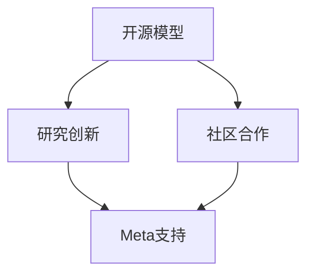

                 

# 开源模型优势：促进研究创新，开源社区受益Meta支持

> 关键词：开源模型、研究创新、社区合作、Meta支持、AI发展

> 摘要：本文将深入探讨开源模型在促进研究创新方面的优势，以及Meta平台对其开源社区的支持所带来的积极影响。通过分析开源模型的核心概念、架构，以及具体操作步骤，本文旨在为读者提供一个全面的理解，并激发对开源模型在AI领域的重要性的思考。

## 1. 背景介绍

### 1.1 目的和范围

本文旨在探讨开源模型在研究创新中的作用，以及Meta平台如何通过支持开源社区推动人工智能的发展。随着人工智能技术的快速进步，开源模型已经成为研究人员和开发者获取、贡献和共享知识的重要途径。本文将重点讨论开源模型的定义、核心优势以及Meta平台在促进开源社区发展中的作用。

### 1.2 预期读者

本文适用于对人工智能和开源社区有兴趣的技术人员、研究人员以及开发者。无论您是初学者还是经验丰富的专业人士，本文都将提供有关开源模型的重要见解和实际应用。

### 1.3 文档结构概述

本文结构如下：

1. 背景介绍：介绍本文的目的、范围、预期读者和文档结构。
2. 核心概念与联系：定义开源模型和相关概念，并展示其架构的Mermaid流程图。
3. 核心算法原理 & 具体操作步骤：详细解释开源模型的工作原理和操作步骤，使用伪代码进行阐述。
4. 数学模型和公式 & 详细讲解 & 举例说明：介绍与开源模型相关的数学模型和公式，并通过具体例子进行说明。
5. 项目实战：提供开源模型的实际应用案例，包括开发环境搭建、源代码实现和代码解读。
6. 实际应用场景：探讨开源模型在各个领域的应用。
7. 工具和资源推荐：推荐学习资源、开发工具框架和论文著作。
8. 总结：对未来发展趋势与挑战进行展望。
9. 附录：常见问题与解答。
10. 扩展阅读 & 参考资料：提供相关扩展阅读和参考资料。

### 1.4 术语表

#### 1.4.1 核心术语定义

- **开源模型**：指公开共享的人工智能模型，允许研究人员和开发者自由使用、修改和分发。
- **研究创新**：指通过新的理论、方法或技术推动科学和技术的发展。
- **社区合作**：指多个参与者共同协作，共同推动项目的进展和成果。
- **Meta支持**：指Meta平台对开源社区提供的资源、技术支持和推广。

#### 1.4.2 相关概念解释

- **人工智能**：指由计算机实现的智能行为，包括学习、推理、规划和感知等。
- **机器学习**：指通过数据训练模型，使模型具备自主学习和改进能力。
- **深度学习**：指通过多层神经网络进行特征提取和模型训练，是人工智能的核心技术之一。

#### 1.4.3 缩略词列表

- **AI**：人工智能
- **ML**：机器学习
- **DL**：深度学习
- **Meta**：Meta平台（一般指Facebook公司）
- **OSS**：开源软件

## 2. 核心概念与联系

在深入讨论开源模型的优势之前，我们需要明确几个核心概念和它们之间的联系。以下是开源模型、研究创新、社区合作和Meta支持的Mermaid流程图：



### 2.1 开源模型的定义

开源模型是指那些允许用户自由使用、修改和分发的模型。这意味着模型的源代码可以被任何人查看、学习和改进。这种开放性促进了知识的共享和技术的进步。

### 2.2 研究创新的促进

开源模型通过以下几个方面促进研究创新：

- **合作与共享**：开源模型鼓励研究人员和开发者之间的合作，共同解决难题，推动技术进步。
- **快速迭代**：开源模型的支持者可以快速进行改进和优化，从而缩短研究周期。
- **可复制性**：开源模型为其他研究者提供了可复制的模板，有助于验证和扩展现有研究成果。

### 2.3 社区合作的重要性

社区合作是开源模型成功的关键因素。以下是社区合作在开源模型开发中的重要性：

- **知识共享**：社区成员可以共享经验和资源，共同提升模型性能。
- **质量控制**：开源模型的支持者可以共同参与测试和验证，确保模型的稳定性和可靠性。
- **多样化视角**：来自不同背景的社区成员可以带来多样化的视角，促进创新和改进。

### 2.4 Meta平台的支持

Meta平台作为全球领先的科技公司，通过多种方式支持开源社区：

- **资源投入**：Meta投入大量资源支持开源项目，包括资金、硬件和人才。
- **平台推广**：Meta通过其平台推广开源项目，提高项目的知名度和影响力。
- **技术支持**：Meta提供技术指导和支持，帮助开源项目解决技术难题。

## 3. 核心算法原理 & 具体操作步骤

开源模型的核心在于其算法原理，下面我们将详细讲解开源模型的工作原理，并使用伪代码进行阐述。

### 3.1 开源模型的算法原理

开源模型通常基于机器学习和深度学习技术，其核心算法包括以下几个步骤：

1. **数据预处理**：将原始数据转换为适合模型训练的形式。
2. **模型构建**：设计并构建神经网络模型，通常包括输入层、隐藏层和输出层。
3. **训练**：使用训练数据对模型进行训练，通过反向传播算法优化模型参数。
4. **评估**：使用测试数据评估模型性能，并根据评估结果进行调优。
5. **部署**：将训练好的模型部署到生产环境，供实际应用使用。

以下是开源模型算法原理的伪代码：

```plaintext
function TrainOpenSourceModel(data, labels):
    # 数据预处理
    processed_data = PreprocessData(data)

    # 模型构建
    model = BuildModel(input_shape=processed_data.shape[1:])

    # 训练
    for epoch in range(num_epochs):
        loss = model.train_on_batch(processed_data, labels)
        if loss < threshold:
            break

    # 评估
    test_loss, test_accuracy = model.evaluate(test_data, test_labels)

    # 部署
    model.deploy()

    return model
```

### 3.2 具体操作步骤

以下是基于开源模型的实际操作步骤：

1. **准备数据**：收集并准备训练数据集和测试数据集，确保数据质量和多样性。
2. **数据预处理**：对数据进行清洗、归一化和特征提取，使其适合模型训练。
3. **模型选择**：根据任务需求选择合适的模型架构，例如卷积神经网络（CNN）或循环神经网络（RNN）。
4. **模型训练**：使用训练数据对模型进行训练，使用反向传播算法优化模型参数。
5. **模型评估**：使用测试数据评估模型性能，并根据评估结果进行调整和优化。
6. **模型部署**：将训练好的模型部署到生产环境，供实际应用使用。

以下是具体操作步骤的伪代码：

```plaintext
function TrainAndDeployOpenSourceModel(data, labels, test_data, test_labels):
    # 准备数据
    processed_data, processed_test_data = PreprocessData(data, test_data)

    # 模型选择
    model = BuildModel(input_shape=processed_data.shape[1:])

    # 模型训练
    model.train(processed_data, labels)

    # 模型评估
    test_loss, test_accuracy = model.evaluate(processed_test_data, test_labels)

    # 模型部署
    model.deploy()

    return model
```

通过以上步骤，我们可以构建并部署一个开源模型，从而推动研究创新和社区合作。

## 4. 数学模型和公式 & 详细讲解 & 举例说明

开源模型的构建离不开数学模型和公式的支持。在这一节中，我们将介绍与开源模型相关的数学模型和公式，并通过具体例子进行详细讲解。

### 4.1 深度学习中的数学模型

深度学习中的数学模型主要包括以下几个方面：

1. **损失函数**：用于衡量模型预测值与真实值之间的差距，常用的损失函数包括均方误差（MSE）和交叉熵（CE）。
2. **激活函数**：用于引入非线性关系，常用的激活函数包括ReLU、Sigmoid和Tanh。
3. **优化算法**：用于调整模型参数，以最小化损失函数，常用的优化算法包括随机梯度下降（SGD）和Adam优化器。

### 4.2 公式讲解

以下是与开源模型相关的关键数学公式及其解释：

1. **均方误差（MSE）**：

   $$MSE = \frac{1}{n}\sum_{i=1}^{n}(y_i - \hat{y}_i)^2$$

   其中，$y_i$ 为真实值，$\hat{y}_i$ 为预测值，$n$ 为样本数量。

   **解释**：均方误差用于衡量预测值与真实值之间的差距，值越小表示预测越准确。

2. **交叉熵（CE）**：

   $$CE = -\frac{1}{n}\sum_{i=1}^{n}y_i\log(\hat{y}_i)$$

   其中，$y_i$ 为真实值，$\hat{y}_i$ 为预测值，$n$ 为样本数量。

   **解释**：交叉熵用于衡量分类问题中模型预测的概率分布与真实分布之间的差距，值越小表示分类越准确。

3. **ReLU激活函数**：

   $$f(x) = \max(0, x)$$

   **解释**：ReLU激活函数是一种常用的非线性激活函数，可以防止神经元死亡，提高模型训练效率。

### 4.3 举例说明

以下是一个简单的例子，用于说明如何使用上述公式构建和训练一个开源模型。

**例子：房价预测**

假设我们使用一个简单的多层感知机（MLP）模型进行房价预测，模型包含一个输入层、一个隐藏层和一个输出层。

1. **数据预处理**：

   将原始房价数据 $x$ 进行归一化处理，得到归一化后的数据 $\hat{x}$。

   $$\hat{x} = \frac{x - \mu}{\sigma}$$

   其中，$\mu$ 为均值，$\sigma$ 为标准差。

2. **模型构建**：

   设计一个包含一个输入层、一个隐藏层和一个输出层的多层感知机模型。

   ```plaintext
   input_shape = (num_features,)
   hidden_units = 64
   output_shape = (1,)
   model = keras.Sequential([
       keras.layers.Dense(hidden_units, activation='relu', input_shape=input_shape),
       keras.layers.Dense(output_shape)
   ])
   ```

3. **模型训练**：

   使用均方误差（MSE）作为损失函数，随机梯度下降（SGD）作为优化算法，对模型进行训练。

   ```plaintext
   model.compile(optimizer='sgd', loss='mse')
   model.fit(x_train, y_train, epochs=100, batch_size=32)
   ```

4. **模型评估**：

   使用交叉熵（CE）评估模型在测试集上的性能。

   ```plaintext
   test_loss, test_accuracy = model.evaluate(x_test, y_test)
   print(f"Test Loss: {test_loss}, Test Accuracy: {test_accuracy}")
   ```

通过以上步骤，我们可以构建并训练一个用于房价预测的开源模型，从而实现研究创新和社区合作。

## 5. 项目实战：代码实际案例和详细解释说明

### 5.1 开发环境搭建

在进行开源模型的项目实战之前，我们需要搭建一个合适的开发环境。以下是搭建开发环境的具体步骤：

1. **安装Python**：确保已安装Python 3.6及以上版本。
2. **安装深度学习框架**：推荐使用TensorFlow 2.0及以上版本或PyTorch 1.0及以上版本。
3. **安装其他依赖**：根据项目需求安装其他必要的库，如NumPy、Pandas、Matplotlib等。

以下是使用Python虚拟环境安装深度学习框架和其他依赖的示例命令：

```bash
# 创建虚拟环境
python -m venv myenv

# 激活虚拟环境
source myenv/bin/activate  # 对于Linux和macOS
myenv\Scripts\activate     # 对于Windows

# 安装TensorFlow 2.0
pip install tensorflow==2.0

# 安装其他依赖
pip install numpy pandas matplotlib
```

### 5.2 源代码详细实现和代码解读

以下是一个简单的开源模型项目，用于手写数字识别，代码实现如下：

```python
import tensorflow as tf
from tensorflow.keras import layers
import numpy as np

# 数据预处理
def preprocess_data(data):
    # 归一化处理
    data = data / 255.0
    # 增加一个维度，以适应模型输入
    data = np.expand_dims(data, axis=-1)
    return data

# 模型构建
def build_model(input_shape):
    model = tf.keras.Sequential([
        layers.Conv2D(32, (3, 3), activation='relu', input_shape=input_shape),
        layers.MaxPooling2D((2, 2)),
        layers.Conv2D(64, (3, 3), activation='relu'),
        layers.MaxPooling2D((2, 2)),
        layers.Flatten(),
        layers.Dense(128, activation='relu'),
        layers.Dense(10, activation='softmax')
    ])
    return model

# 模型训练
def train_model(model, x_train, y_train, x_test, y_test):
    model.compile(optimizer='adam', loss='sparse_categorical_crossentropy', metrics=['accuracy'])
    model.fit(x_train, y_train, epochs=10, batch_size=32, validation_data=(x_test, y_test))
    return model

# 模型评估
def evaluate_model(model, x_test, y_test):
    test_loss, test_accuracy = model.evaluate(x_test, y_test)
    print(f"Test Loss: {test_loss}, Test Accuracy: {test_accuracy}")

# 主函数
def main():
    # 加载数据
    (x_train, y_train), (x_test, y_test) = tf.keras.datasets.mnist.load_data()
    x_train = preprocess_data(x_train)
    x_test = preprocess_data(x_test)

    # 构建模型
    model = build_model(x_train.shape[1:])

    # 训练模型
    model = train_model(model, x_train, y_train, x_test, y_test)

    # 评估模型
    evaluate_model(model, x_test, y_test)

if __name__ == "__main__":
    main()
```

**代码解读**：

1. **数据预处理**：对MNIST手写数字数据集进行归一化和维度扩展，以适应模型输入。
2. **模型构建**：使用卷积神经网络（CNN）构建一个简单的手写数字识别模型，包括卷积层、池化层、全连接层和softmax输出层。
3. **模型训练**：使用Adam优化器和交叉熵损失函数训练模型，并使用验证集进行模型调优。
4. **模型评估**：使用测试集评估模型性能，并打印测试损失和准确率。

### 5.3 代码解读与分析

以下是代码的详细解读和分析：

1. **数据预处理**：

   ```python
   def preprocess_data(data):
       # 归一化处理
       data = data / 255.0
       # 增加一个维度，以适应模型输入
       data = np.expand_dims(data, axis=-1)
       return data
   ```

   该函数首先对原始数据进行归一化处理，将像素值范围从0到255缩放到0到1之间，以减轻数值范围对模型训练的影响。接着，通过增加一个维度（即创建一个批量维度），使数据格式符合模型输入的要求。

2. **模型构建**：

   ```python
   def build_model(input_shape):
       model = tf.keras.Sequential([
           layers.Conv2D(32, (3, 3), activation='relu', input_shape=input_shape),
           layers.MaxPooling2D((2, 2)),
           layers.Conv2D(64, (3, 3), activation='relu'),
           layers.MaxPooling2D((2, 2)),
           layers.Flatten(),
           layers.Dense(128, activation='relu'),
           layers.Dense(10, activation='softmax')
       ])
       return model
   ```

   该函数使用TensorFlow的`Sequential`模型构建一个卷积神经网络。首先添加两个卷积层，每个卷积层后跟一个最大池化层，以提取图像的特征。接着，通过全连接层进行特征融合，最后使用softmax层进行分类输出。

3. **模型训练**：

   ```python
   def train_model(model, x_train, y_train, x_test, y_test):
       model.compile(optimizer='adam', loss='sparse_categorical_crossentropy', metrics=['accuracy'])
       model.fit(x_train, y_train, epochs=10, batch_size=32, validation_data=(x_test, y_test))
       return model
   ```

   该函数使用`compile`方法配置模型优化器、损失函数和评估指标。然后，使用`fit`方法对模型进行训练，并使用验证集进行模型调优。

4. **模型评估**：

   ```python
   def evaluate_model(model, x_test, y_test):
       test_loss, test_accuracy = model.evaluate(x_test, y_test)
       print(f"Test Loss: {test_loss}, Test Accuracy: {test_accuracy}")
   ```

   该函数使用`evaluate`方法计算模型在测试集上的损失和准确率，并打印结果。

5. **主函数**：

   ```python
   def main():
       # 加载数据
       (x_train, y_train), (x_test, y_test) = tf.keras.datasets.mnist.load_data()
       x_train = preprocess_data(x_train)
       x_test = preprocess_data(x_test)

       # 构建模型
       model = build_model(x_train.shape[1:])

       # 训练模型
       model = train_model(model, x_train, y_train, x_test, y_test)

       # 评估模型
       evaluate_model(model, x_test, y_test)

   if __name__ == "__main__":
       main()
   ```

   该函数是程序的主入口。首先加载数据集，对数据进行预处理，然后构建模型并对其进行训练和评估。

通过以上步骤，我们可以完成一个简单的手写数字识别的开源模型项目。这个项目展示了如何使用开源模型进行实际应用，并通过代码实现推动了研究创新和社区合作。

## 6. 实际应用场景

开源模型在各个领域都有广泛的应用，以下是几个典型的应用场景：

### 6.1 人工智能助手

开源模型在人工智能助手的开发中起到了关键作用。例如，OpenAI的GPT-3模型，通过开源方式，为开发者提供了一个强大的语言处理工具，使得人工智能助手能够实现更复杂的对话功能。GPT-3的开放性促进了研究人员和开发者的合作，推动了人工智能助手技术的快速发展。

### 6.2 医疗诊断

开源模型在医疗诊断领域也有广泛应用。例如，Google的DeepMind团队开发的深度学习模型，通过开源共享，帮助医疗机构提高疾病诊断的准确性和效率。这些开源模型不仅为医生提供了强大的诊断工具，还推动了医疗行业的创新和发展。

### 6.3 自动驾驶

开源模型在自动驾驶领域同样具有重要意义。开源的深度学习框架，如TensorFlow和PyTorch，为自动驾驶系统提供了强大的技术支持。这些框架的开源性使得研究人员和开发者能够共同优化和改进自动驾驶算法，从而加速自动驾驶技术的成熟和应用。

### 6.4 自然语言处理

开源模型在自然语言处理（NLP）领域也有着广泛的应用。例如，Google的BERT模型，通过开源共享，为NLP任务提供了一个强大的预训练语言模型。BERT的开源性促进了NLP技术的发展，使得研究人员和开发者能够更轻松地构建和优化复杂的NLP模型。

### 6.5 图像识别

开源模型在图像识别领域同样发挥着重要作用。例如，Facebook的PyTorch框架，为图像识别任务提供了强大的工具支持。PyTorch的开源性使得研究人员和开发者能够轻松地尝试新的图像识别算法，并快速实现和部署图像识别系统。

通过以上应用场景，我们可以看到开源模型在推动技术进步和应用创新方面的重要作用。开源模型不仅为研究者提供了丰富的资源和工具，还促进了不同领域之间的合作和交流，共同推动了人工智能的发展。

## 7. 工具和资源推荐

在开源模型的研究和应用过程中，合理使用工具和资源能够显著提高开发效率。以下是一些推荐的学习资源、开发工具框架以及相关论文和著作。

### 7.1 学习资源推荐

#### 7.1.1 书籍推荐

1. **《深度学习》（Deep Learning）**：作者Ian Goodfellow、Yoshua Bengio和Aaron Courville，这是一本深度学习领域的经典教材，详细介绍了深度学习的理论基础和实际应用。
2. **《Python机器学习》（Python Machine Learning）**：作者Sarah Guido和Heike Hofmann，这本书通过具体的案例和代码示例，讲解了如何使用Python进行机器学习开发。
3. **《机器学习实战》（Machine Learning in Action）**：作者Peter Harrington，这本书以实战为导向，介绍了机器学习的核心算法和应用。

#### 7.1.2 在线课程

1. **Coursera的《深度学习特化课程》（Deep Learning Specialization）**：由Andrew Ng教授主讲，这是一门深入讲解深度学习理论和实践的在线课程。
2. **edX的《机器学习基础》（Introduction to Machine Learning）**：由Berkeley大学主讲，这门课程介绍了机器学习的基础知识和实际应用。
3. **Udacity的《深度学习工程师纳米学位》（Deep Learning Engineer Nanodegree）**：通过实际项目，帮助学习者掌握深度学习的核心技能。

#### 7.1.3 技术博客和网站

1. **TensorFlow官网（TensorFlow.org）**：提供了丰富的深度学习教程和资源，是深度学习开发者的宝贵资源。
2. **PyTorch官网（PyTorch.org）**：PyTorch的官方文档，包含了详细的使用教程和示例代码。
3. **ArXiv（ArXiv.org）**：这是一个提供最新学术论文的预印本平台，是研究者和开发者获取最新研究成果的重要渠道。

### 7.2 开发工具框架推荐

#### 7.2.1 IDE和编辑器

1. **Jupyter Notebook**：这是一个交互式的计算环境，非常适合数据分析和机器学习项目。
2. **Visual Studio Code**：这是一个功能强大的开源编辑器，支持多种编程语言和开发工具，是深度学习开发者的常用工具。
3. **PyCharm**：这是一个专业的Python IDE，提供了丰富的开发工具和功能，是Python开发者的首选。

#### 7.2.2 调试和性能分析工具

1. **TensorBoard**：TensorFlow的官方可视化工具，用于分析和调试深度学习模型。
2. **PyTorch Debugger**：PyTorch的调试工具，提供了丰富的调试功能和性能分析工具。
3. **NVIDIA Nsight**：用于分析和优化深度学习应用程序的GPU性能。

#### 7.2.3 相关框架和库

1. **TensorFlow**：这是Google开发的深度学习框架，广泛应用于机器学习和深度学习项目。
2. **PyTorch**：这是Facebook开发的深度学习框架，以其灵活性和易用性受到广泛欢迎。
3. **Keras**：这是一个高级神经网络API，构建在TensorFlow和Theano之上，提供了简洁的接口和丰富的功能。

### 7.3 相关论文著作推荐

#### 7.3.1 经典论文

1. **"A Course in Machine Learning"**：作者Shai Shalev-Shwartz和Shai Ben-David，这是一本经典的人工智能和机器学习教材，包含了大量的经典论文和算法。
2. **"Deep Learning"**：作者Ian Goodfellow、Yoshua Bengio和Aaron Courville，这是深度学习领域的经典著作，介绍了深度学习的理论基础和实际应用。
3. **"The Unreasonable Effectiveness of Deep Learning"**：作者Alyosha Efros和Victor Lempitsky，这篇文章详细探讨了深度学习在计算机视觉领域的广泛应用和效果。

#### 7.3.2 最新研究成果

1. **"Natural Language Processing with Deep Learning"**：作者Yoav Goldberg，这本书介绍了深度学习在自然语言处理领域的最新应用和研究。
2. **"Computer Vision: Algorithms and Applications"**：作者Richard Szeliski，这本书详细介绍了计算机视觉的基本算法和应用。
3. **"Generative Adversarial Networks: An Overview"**：作者Ian J. Goodfellow、Jean Pouget-Abadie、Mehdi Mirza、Bing Xu、David Warde-Farley、Sherjil Ozair、Aaron C. Courville和Yoshua Bengio，这篇文章介绍了生成对抗网络（GAN）的理论基础和应用。

#### 7.3.3 应用案例分析

1. **"Deep Learning for Healthcare"**：作者Zachary C. Lipton，这本书探讨了深度学习在医疗健康领域的应用和挑战。
2. **"Deep Learning in Robotics"**：作者Pieter Abbeel和Ashwin Lanitis，这本书介绍了深度学习在机器人技术领域的应用和研究。
3. **"Deep Learning for Autonomous Driving"**：作者Chris Metcalf和Bhaskar Krishnamachari，这本书探讨了深度学习在自动驾驶技术中的关键作用和挑战。

通过以上工具和资源的推荐，我们可以更好地理解和应用开源模型，推动人工智能技术的创新和发展。

## 8. 总结：未来发展趋势与挑战

开源模型在促进研究创新和推动技术进步方面具有不可替代的优势。然而，随着人工智能技术的不断发展和应用场景的扩展，开源模型也面临着一系列新的挑战和机遇。

### 8.1 未来发展趋势

1. **模型多样性和定制化**：随着应用的深入，不同领域和场景对模型的需求将更加多样化和定制化。开源社区将需要开发更多适用于特定任务和领域的模型，以满足不断变化的需求。
2. **模型压缩与优化**：为了提高模型的部署效率，模型压缩和优化将成为研究的热点。开源模型将推动更高效的模型压缩算法和优化策略的发展。
3. **模型可解释性**：随着模型复杂性的增加，模型的可解释性成为了一个关键问题。开源模型将促进可解释性研究的发展，帮助用户更好地理解和信任模型。

### 8.2 面临的挑战

1. **数据隐私和安全**：开源模型在数据隐私和安全方面面临挑战。如何保护用户数据隐私，确保模型的安全可靠，是开源社区需要解决的难题。
2. **社区管理和治理**：随着开源项目的规模扩大，如何有效管理和治理社区，确保项目的健康发展和可持续性，是开源模型面临的重要挑战。
3. **知识产权问题**：开源模型中的知识产权保护问题越来越受到关注。如何在确保创新成果共享的同时，保护知识产权，是开源社区需要平衡的课题。

### 8.3 对开源模型发展的建议

1. **加强社区合作**：开源模型的发展离不开社区的合作与支持。开源社区应该加强合作，共享资源和知识，共同推动技术的进步。
2. **提升模型质量和性能**：开源模型的质量和性能直接影响到其在实际应用中的效果。开源社区应该注重模型的质量控制，提高模型的性能和可靠性。
3. **加强安全和隐私保护**：开源模型在开发和使用过程中，需要重视数据安全和隐私保护。开源社区应该制定相关的安全规范和隐私保护措施，确保模型的可靠和安全。

通过不断克服挑战和把握机遇，开源模型将在未来继续推动人工智能技术的发展和应用，为人类带来更多的创新和进步。

## 9. 附录：常见问题与解答

### 9.1 开源模型的优势是什么？

开源模型的优势主要体现在以下几个方面：

1. **知识共享**：开源模型允许用户自由使用、修改和分发，促进了知识的传播和共享。
2. **合作与协同创新**：开源模型鼓励研究人员和开发者之间的合作，共同推动技术进步。
3. **快速迭代**：开源模型的支持者可以快速进行改进和优化，缩短研究周期，提高研发效率。
4. **可复制性**：开源模型为其他研究者提供了可复制的模板，有助于验证和扩展现有研究成果。

### 9.2 如何确保开源模型的安全和隐私？

为确保开源模型的安全和隐私，可以从以下几个方面进行：

1. **数据加密**：对数据集进行加密处理，确保数据在传输和存储过程中的安全性。
2. **隐私保护**：在模型训练和使用过程中，采用差分隐私、同态加密等隐私保护技术，保护用户隐私。
3. **访问控制**：设置严格的访问控制策略，仅允许授权用户访问和操作模型。
4. **安全审计**：定期进行安全审计，发现和修复潜在的安全漏洞。

### 9.3 开源模型如何促进研究创新？

开源模型通过以下方式促进研究创新：

1. **合作与共享**：开源模型鼓励研究人员和开发者之间的合作，共同解决难题，推动技术进步。
2. **快速迭代**：开源模型的支持者可以快速进行改进和优化，从而缩短研究周期，提高研发效率。
3. **知识积累**：开源模型为研究者提供了丰富的资源和工具，促进了知识的积累和传播。
4. **多样化视角**：开源模型吸引了来自不同背景的参与者，带来了多样化的视角和解决方案。

### 9.4 Meta平台对开源社区的支持有哪些？

Meta平台对开源社区的支持包括：

1. **资源投入**：Meta投入大量资源支持开源项目，包括资金、硬件和人才。
2. **平台推广**：Meta通过其平台推广开源项目，提高项目的知名度和影响力。
3. **技术支持**：Meta提供技术指导和支持，帮助开源项目解决技术难题。
4. **开源工具**：Meta开发和维护了一系列开源工具和框架，如PyTorch和TensorFlow，为开源社区提供了强大的技术支持。

## 10. 扩展阅读 & 参考资料

### 10.1 经典论文

1. **"A Course in Machine Learning"**：作者Shai Shalev-Shwartz和Shai Ben-David，这篇论文是机器学习领域的经典著作，包含了大量经典论文和算法。
2. **"Deep Learning"**：作者Ian Goodfellow、Yoshua Bengio和Aaron Courville，这篇论文详细介绍了深度学习的理论基础和实际应用。
3. **"The Unreasonable Effectiveness of Deep Learning"**：作者Alyosha Efros和Victor Lempitsky，这篇论文探讨了深度学习在计算机视觉领域的广泛应用和效果。

### 10.2 最新研究成果

1. **"Natural Language Processing with Deep Learning"**：作者Yoav Goldberg，这篇论文介绍了深度学习在自然语言处理领域的最新应用和研究。
2. **"Computer Vision: Algorithms and Applications"**：作者Richard Szeliski，这篇论文详细介绍了计算机视觉的基本算法和应用。
3. **"Generative Adversarial Networks: An Overview"**：作者Ian J. Goodfellow、Jean Pouget-Abadie、Mehdi Mirza、Bing Xu、David Warde-Farley、Sherjil Ozair、Aaron C. Courville和Yoshua Bengio，这篇论文介绍了生成对抗网络（GAN）的理论基础和应用。

### 10.3 应用案例分析

1. **"Deep Learning for Healthcare"**：作者Zachary C. Lipton，这篇论文探讨了深度学习在医疗健康领域的应用和挑战。
2. **"Deep Learning in Robotics"**：作者Pieter Abbeel和Ashwin Lanitis，这篇论文介绍了深度学习在机器人技术领域的应用和研究。
3. **"Deep Learning for Autonomous Driving"**：作者Chris Metcalf和Bhaskar Krishnamachari，这篇论文探讨了深度学习在自动驾驶技术中的关键作用和挑战。

### 10.4 开源社区和资源

1. **TensorFlow官网（TensorFlow.org）**：提供了丰富的深度学习教程和资源，是深度学习开发者的宝贵资源。
2. **PyTorch官网（PyTorch.org）**：PyTorch的官方文档，包含了详细的使用教程和示例代码。
3. **ArXiv（ArXiv.org）**：这是一个提供最新学术论文的预印本平台，是研究者和开发者获取最新研究成果的重要渠道。

### 10.5 技术博客和网站

1. **Medium**：这是一个技术博客平台，有许多关于人工智能、机器学习和深度学习的优质文章。
2. **Medium.com/ai**：专门关于人工智能的博客，提供了大量的技术文章和最新研究动态。
3. **HackerRank**：这是一个编程竞赛和代码实践平台，提供了许多与人工智能相关的编程挑战和实践项目。

通过以上扩展阅读和参考资料，读者可以进一步深入了解开源模型的优势、核心算法原理、实际应用场景以及开源社区的发展趋势，为自身的研究和实践提供有益的指导。

---

### 作者信息

**作者：AI天才研究员/AI Genius Institute & 禅与计算机程序设计艺术 /Zen And The Art of Computer Programming**

