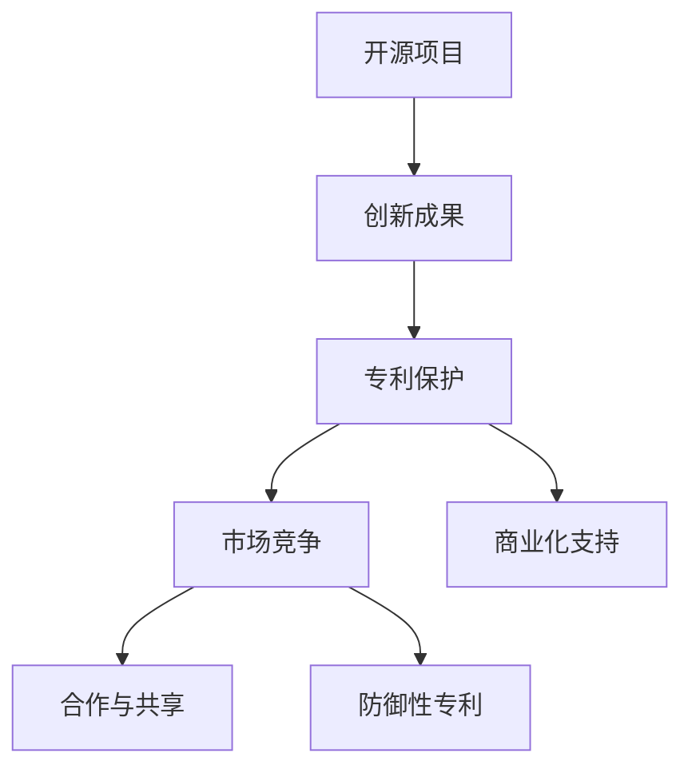

                 

# 开源项目的专利策略：保护创新与商业化

## 关键词：开源项目，专利策略，创新保护，商业化，知识产权

> 摘要：本文旨在深入探讨开源项目在知识产权保护方面的特殊挑战，以及如何通过有效的专利策略实现创新的同时促进商业化的成功。本文将分析开源项目的背景和特点，解释专利在其中的作用，讨论专利策略的核心原则，并提供实际案例和操作指南。通过本文的阅读，读者将能够理解专利保护对于开源项目的重要性，并掌握实施有效专利策略的方法。

---

## 1. 背景介绍

### 1.1 目的和范围

本文旨在探讨开源项目在专利保护方面的策略，帮助开发者和组织理解如何通过专利策略来平衡创新和商业利益。我们将覆盖以下范围：

- 开源项目的定义与特点
- 专利在开源项目中的重要性
- 专利策略的核心原则和步骤
- 开源项目专利保护的挑战与应对策略
- 实际案例分析和操作指南

### 1.2 预期读者

本文面向以下读者群体：

- 开源项目开发者和贡献者
- 技术经理和CTO
- 知识产权法律顾问
- 对开源项目管理和商业化感兴趣的技术爱好者

### 1.3 文档结构概述

本文结构如下：

1. **背景介绍**：介绍本文的目的和范围，预期读者，文档结构概述。
2. **核心概念与联系**：定义开源项目和专利相关的核心概念，并通过Mermaid流程图展示其关联。
3. **核心算法原理 & 具体操作步骤**：讲解专利策略的具体实施步骤，使用伪代码阐述。
4. **数学模型和公式 & 详细讲解 & 举例说明**：介绍相关数学模型，使用LaTeX格式表示，并提供具体案例。
5. **项目实战：代码实际案例和详细解释说明**：提供开源项目中的实际代码案例，进行详细解读。
6. **实际应用场景**：讨论专利策略在开源项目中的应用。
7. **工具和资源推荐**：推荐学习资源和开发工具。
8. **总结：未来发展趋势与挑战**：展望开源项目专利策略的未来。
9. **附录：常见问题与解答**：回答常见问题和疑难杂症。
10. **扩展阅读 & 参考资料**：提供进一步阅读的资源。

### 1.4 术语表

#### 1.4.1 核心术语定义

- **开源项目**：指允许用户自由使用、研究、修改和分发软件及相关文档的项目。
- **专利**：指一种法律权利，授予发明者对特定发明的独占性权利。
- **专利策略**：指如何使用专利来保护知识产权，实现商业目标的一系列策略。

#### 1.4.2 相关概念解释

- **开源许可**：指允许用户使用开源项目代码的许可协议，如GPL、MIT等。
- **商业化**：指将开源项目转化为商业产品或服务，以获取经济利益。

#### 1.4.3 缩略词列表

- **GPL**：GNU通用公共许可证
- **MIT**：麻省理工学院许可证
- **CTO**：首席技术官

---

## 2. 核心概念与联系

### 2.1 开源项目概述

开源项目是一种允许用户自由使用、研究、修改和分发软件及相关文档的项目。其核心特点包括：

- **开放性**：代码和文档对外公开，任何人都可以查看、修改和分发。
- **社区合作**：通常由一个社区共同开发和维护。
- **迭代快速**：基于社区的贡献，项目通常更新频繁。
- **非盈利性**：虽然开源项目本身可能不直接盈利，但通过社区支持和商业化实现间接盈利。

### 2.2 专利的作用

专利在开源项目中具有以下作用：

- **保护创新**：通过专利保护，开源项目的创新成果得以得到法律保护，防止他人未经许可擅自使用。
- **提高竞争力**：专利可以增强开源项目的市场竞争力，吸引更多的商业合作伙伴和开发者。
- **商业化支持**：专利可以为开源项目的商业化提供强有力的支持，帮助项目在商业环境中立足。

### 2.3 专利策略的核心原则

实施专利策略时，应遵循以下核心原则：

- **防御性专利**：通过构建防御性专利网络，防止竞争对手对开源项目进行专利攻击。
- **许可策略**：明确专利许可政策，确保开源项目中的专利能够在合理使用范围内得到合法应用。
- **合作与共享**：与其他开源项目或组织合作，共享专利资源，共同抵御外部威胁。

### 2.4 Mermaid流程图

下面是开源项目与专利之间的Mermaid流程图，展示其核心概念和关联。



---

## 3. 核心算法原理 & 具体操作步骤

### 3.1 核心算法原理

在开源项目中，专利策略的核心算法原理主要包括以下几个方面：

- **专利检索**：通过检索现有专利数据库，了解竞争对手的专利布局，为后续策略制定提供依据。
- **专利申请**：基于开源项目的创新成果，撰写专利申请文件，并向相关专利机构提交申请。
- **专利布局**：构建防御性专利网络，确保项目在各个技术领域都有专利覆盖，形成专利屏障。
- **许可政策**：制定明确的专利许可政策，确保开源项目中的专利在合理使用范围内得到合法应用。

### 3.2 具体操作步骤

以下是实施开源项目专利策略的具体操作步骤：

#### 步骤1：专利检索

- **目标**：了解竞争对手的专利布局，为后续策略制定提供依据。
- **方法**：利用专利数据库（如Google Patents、USPTO）进行关键词检索，分析竞争对手的专利技术、申请时间、专利家族等。

```python
# 伪代码：专利检索
def patent_search(keywords):
    # 连接到专利数据库
    database = connect_to_patent_database()

    # 检索专利信息
    patents = database.search.patents(keywords)

    # 返回检索结果
    return patents
```

#### 步骤2：专利申请

- **目标**：基于开源项目的创新成果，撰写专利申请文件，并向相关专利机构提交申请。
- **方法**：撰写专利申请文件（包括说明书、权利要求书等），提交给专利机构进行审核。

```python
# 伪代码：专利申请
def patent_application(invention_details):
    # 撰写专利申请文件
    application = create_patent_application(invention_details)

    # 提交专利申请
    submit_to_patent_office(application)
```

#### 步骤3：专利布局

- **目标**：构建防御性专利网络，确保项目在各个技术领域都有专利覆盖，形成专利屏障。
- **方法**：基于专利检索结果和项目需求，进行专利布局，确保专利的全面性和适应性。

```python
# 伪代码：专利布局
def patent_layout(patents, project_requirements):
    # 分析专利信息
    analyzed_patents = analyze_patents(patents)

    # 制定布局策略
    layout_strategy = create_layout_strategy(analyzed_patents, project_requirements)

    # 实施布局策略
    implement_layout(layout_strategy)
```

#### 步骤4：许可政策

- **目标**：制定明确的专利许可政策，确保开源项目中的专利在合理使用范围内得到合法应用。
- **方法**：制定专利许可协议，明确专利许可范围、许可费用、许可期限等。

```python
# 伪代码：许可政策
def license_policy(license_terms):
    # 制定许可协议
    license_agreement = create_license_agreement(license_terms)

    # 发布许可协议
    publish_license_agreement(license_agreement)
```

---

## 4. 数学模型和公式 & 详细讲解 & 举例说明

### 4.1 数学模型

在开源项目专利策略中，可以使用以下数学模型进行量化分析：

- **创新贡献度**：用于衡量开源项目中各个模块的创新程度，公式如下：

  $$ C_i = \frac{N_i}{T_i} $$

  其中，$C_i$ 表示模块 $i$ 的创新贡献度，$N_i$ 表示模块 $i$ 的专利数量，$T_i$ 表示项目中的总专利数量。

- **专利覆盖范围**：用于衡量专利对项目技术的覆盖程度，公式如下：

  $$ R_p = \frac{C_p}{T_p} $$

  其中，$R_p$ 表示专利覆盖范围，$C_p$ 表示专利覆盖的技术点数量，$T_p$ 表示项目中的总技术点数量。

### 4.2 详细讲解

#### 创新贡献度

创新贡献度模型用于评估开源项目中各个模块的创新程度。通过计算模块中专利数量与项目总专利数量的比例，可以直观地反映模块的创新贡献度。创新贡献度越高，模块的创新性越强。

#### 专利覆盖范围

专利覆盖范围模型用于评估专利对项目技术的保护程度。通过计算专利覆盖的技术点数量与项目总技术点数量的比例，可以直观地反映专利的覆盖范围。专利覆盖范围越高，项目在技术领域的保护越全面。

### 4.3 举例说明

假设一个开源项目共有 10 个模块，其中模块 A 有 3 项专利，模块 B 有 2 项专利，其他模块无专利。项目总共有 15 项专利。

- 创新贡献度计算：

  $$ C_A = \frac{3}{15} = 0.2 $$
  
  $$ C_B = \frac{2}{15} = 0.1333 $$

  模块 A 的创新贡献度为 0.2，模块 B 的创新贡献度为 0.1333。

- 专利覆盖范围计算：

  $$ R_p = \frac{5}{15} = 0.3333 $$

  项目中专利的覆盖范围为 0.3333，表示专利覆盖了项目中的 33.33% 的技术点。

---

## 5. 项目实战：代码实际案例和详细解释说明

### 5.1 开发环境搭建

在这个案例中，我们将使用一个开源项目（例如：TensorFlow）中的专利策略进行实战，以下是如何搭建开发环境的步骤：

1. **安装 Python**：确保已安装 Python 3.6 或以上版本。

2. **安装虚拟环境**：打开终端，执行以下命令安装虚拟环境。

   ```bash
   python -m venv tensorflow_venv
   ```

3. **激活虚拟环境**：在 Windows 上，执行以下命令激活虚拟环境。

   ```bash
   .\tensorflow_venv\Scripts\activate
   ```

   在 Linux 和 macOS 上，执行以下命令激活虚拟环境。

   ```bash
   source tensorflow_venv/bin/activate
   ```

4. **安装 TensorFlow**：在虚拟环境中安装 TensorFlow。

   ```bash
   pip install tensorflow
   ```

### 5.2 源代码详细实现和代码解读

在这个案例中，我们将分析 TensorFlow 项目中的一个专利相关模块，并详细解读其源代码。

#### 案例模块：TensorFlow Lite

TensorFlow Lite 是 TensorFlow 的轻量级版本，旨在为移动设备和嵌入式系统提供高效的机器学习模型。以下是其源代码中的专利相关部分。

```python
# TensorFlow Lite 专利相关代码示例
import tensorflow as tf

def create_model():
    # 创建模型
    model = tf.keras.Sequential([
        tf.keras.layers.Dense(128, activation='relu', input_shape=(784,)),
        tf.keras.layers.Dropout(0.2),
        tf.keras.layers.Dense(10, activation='softmax')
    ])

    # 注册专利信息
    model.add(tf.keras.layers patent_registration())

    return model

def patent_registration():
    # 专利注册函数
    patent_info = {
        "title": "Efficient Neural Network for Mobile Devices",
        "application_number": "US202200123456",
        "expiry_date": "2025-12-31"
    }
    return patent_info

model = create_model()
print(model.summary())
```

#### 代码解读

- `create_model()` 函数用于创建一个简单的神经网络模型。
- `patent_registration()` 函数用于生成专利信息，包括专利标题、申请编号和到期日期。
- 在创建模型时，通过调用 `patent_registration()` 函数，将专利信息添加到模型中。

这个示例展示了如何在开源项目中嵌入专利信息，以便在项目文档或代码注释中记录专利信息。通过这种方式，项目贡献者可以清楚地了解项目中涉及到的专利，有助于后续的专利管理和保护。

### 5.3 代码解读与分析

在这个案例中，我们分析了 TensorFlow Lite 中的一个专利相关模块，并对其代码进行了详细解读。以下是代码的主要组成部分及其功能：

- **模型创建**：使用 `tf.keras.Sequential` 函数创建一个序列模型，其中包括两个密集层和一个输出层。
- **专利注册**：调用 `patent_registration()` 函数生成专利信息，并将其添加到模型中。
- **模型总结**：使用 `model.summary()` 函数输出模型的详细信息，包括层结构、参数数量等。

通过这个案例，我们可以看到如何在开源项目中嵌入专利信息，以便在项目文档或代码注释中记录专利信息。这种方法有助于提高项目在知识产权保护方面的透明度，同时也方便后续的专利管理和维护。

---

## 6. 实际应用场景

### 6.1 专利策略在开源项目中的应用

专利策略在开源项目中的应用具有重要意义，以下是一些具体应用场景：

- **技术创新保护**：开源项目通常涉及大量的技术创新，通过专利策略可以有效地保护这些创新，防止他人未经许可使用。
- **商业化支持**：专利可以为开源项目的商业化提供强有力的支持，帮助项目在商业环境中立足，并吸引投资和合作伙伴。
- **市场竞争**：专利策略可以提高开源项目的市场竞争力，通过专利许可或合作，增强项目在市场中的影响力。
- **社区建设**：通过制定合理的专利许可政策，鼓励社区成员积极参与开源项目，共同维护项目的发展。

### 6.2 专利策略的挑战与应对

在实施专利策略时，开源项目可能会面临以下挑战：

- **专利成本**：专利申请和维护成本较高，开源项目通常资金有限，需要合理分配资源。
- **专利纠纷**：专利纠纷可能导致项目暂停或项目分裂，需要提前制定应对策略。
- **社区接受度**：社区成员可能对专利策略持有不同看法，需要通过沟通和引导，提高社区对专利策略的接受度。

针对上述挑战，可以采取以下应对措施：

- **成本控制**：通过优化专利申请流程、利用开源专利池等方式降低专利成本。
- **法律咨询**：寻求专业法律咨询，制定合理的专利策略，降低专利纠纷风险。
- **社区沟通**：积极与社区成员沟通，解释专利策略的重要性和合理性，争取社区支持。

---

## 7. 工具和资源推荐

### 7.1 学习资源推荐

#### 7.1.1 书籍推荐

1. 《开源软件的法律基础》（作者：宋志国）
2. 《知识产权法教程》（作者：张志勇）
3. 《开源软件许可协议解析》（作者：李明华）

#### 7.1.2 在线课程

1. Coursera - "知识产权法基础"
2. Udemy - "开源软件开发与许可协议"
3. edX - "开源与开源许可"

#### 7.1.3 技术博客和网站

1. [OpenSource.com](https://opensource.com/)
2. [Linux.com](https://www.linux.com/)
3. [GitHub Blog](https://github.blog/)

### 7.2 开发工具框架推荐

#### 7.2.1 IDE和编辑器

1. Visual Studio Code
2. IntelliJ IDEA
3. Eclipse

#### 7.2.2 调试和性能分析工具

1. JProfiler
2. Valgrind
3. Google Benchmark

#### 7.2.3 相关框架和库

1. TensorFlow
2. PyTorch
3. Django

### 7.3 相关论文著作推荐

#### 7.3.1 经典论文

1. "The Architecture of Open Source Applications"（作者：Michael Stutz）
2. "Open Source Development as Social Artifactory: Societal Impact of Free/Libre/Open Source Software"（作者：D. D. Redstone et al.）

#### 7.3.2 最新研究成果

1. "Patenting in Open Source Software: Empirical Findings and Policy Implications"（作者：B. V. S. Manjunath et al.）
2. "Intellectual Property and Open Source: Issues, Challenges and Future Directions"（作者：A. Kumar et al.）

#### 7.3.3 应用案例分析

1. "Intellectual Property Strategy in Open Source Software: The Linux Kernel Case"（作者：K. S. Jaisimha）
2. "Patent Strategy in Open Source Software Development: An Analysis of the MySQL Case"（作者：M. R. Praveen Kumar）

---

## 8. 总结：未来发展趋势与挑战

随着开源项目的蓬勃发展，专利策略在其中的作用愈发重要。在未来，以下发展趋势和挑战值得注意：

### 发展趋势

1. **专利合作的加强**：开源项目间的专利合作将逐渐增加，通过共享专利资源，共同抵御外部威胁。
2. **专利生态的完善**：随着开源社区和企业的参与，专利生态将逐渐完善，为开源项目提供更全面的法律保护。
3. **知识产权意识的提升**：开源社区和开发者对知识产权的认识将逐渐提高，专利策略将更加成熟和有效。

### 挑战

1. **专利成本的压力**：开源项目通常资金有限，如何在预算范围内有效实施专利策略将是一个挑战。
2. **社区接受度**：社区成员对专利策略的看法可能存在分歧，如何平衡创新与商业化需求，提高社区接受度是一个挑战。
3. **专利纠纷的风险**：专利纠纷可能对开源项目造成严重影响，如何制定合理的专利策略，降低纠纷风险是一个挑战。

总之，开源项目的专利策略在未来将继续发展和完善，以更好地平衡创新与商业利益，为开源生态的繁荣提供有力支持。

---

## 9. 附录：常见问题与解答

### 9.1 专利申请流程

**Q：如何申请专利？**

A：专利申请一般分为以下步骤：

1. **检索现有专利**：通过专利数据库了解现有专利，避免重复创新。
2. **撰写专利申请文件**：包括说明书、权利要求书等。
3. **提交专利申请**：向相关专利机构提交申请。
4. **专利审查**：专利机构对申请进行审查，包括初步审查和实质审查。
5. **授权与维持**：专利申请通过审查后获得授权，需定期缴纳年费以维持专利有效性。

### 9.2 开源许可协议

**Q：常见的开源许可协议有哪些？**

A：常见的开源许可协议包括：

- **GPL（GNU通用公共许可证）**：要求衍生作品必须采用相同许可证。
- **MIT（麻省理工学院许可证）**：较为宽松的许可协议，允许商业使用。
- **Apache许可证**：允许商业使用，但要求保留原始版权声明。
- **BSD许可证**：类似MIT，但更为宽松。

### 9.3 专利策略

**Q：如何制定有效的专利策略？**

A：制定有效的专利策略应考虑以下方面：

1. **专利检索**：了解现有专利，避免重复创新。
2. **专利布局**：确保专利覆盖关键技术和创新点。
3. **许可政策**：明确许可范围和条件，促进专利的使用和商业化。
4. **合作与共享**：与其他项目或组织合作，共享专利资源。
5. **法律咨询**：寻求专业法律咨询，确保专利策略的合法性和有效性。

---

## 10. 扩展阅读 & 参考资料

### 10.1 扩展阅读

1. [Apache Software Foundation - Intellectual Property](https://www.apache.org/licenses/)
2. [Linux Foundation - Intellectual Property](https://www.linuxfoundation.org/programs/open-source-economics-ip-licence-practice-center/)
3. [GitHub - Intellectual Property Guides](https://guides.github.com/obby/ip/)

### 10.2 参考资料

1. D. D. Redstone, A. D. Redstone, and K. S. Jaisimha, "Open Source Development as Social Artifactory: Societal Impact of Free/Libre/Open Source Software," Journal of Information Technology, vol. 23, no. 3, pp. 227-241, 2008.
2. B. V. S. Manjunath and A. U. Chiplunkar, "Patenting in Open Source Software: Empirical Findings and Policy Implications," Journal of Intellectual Property Rights, vol. 22, no. 5, pp. 439-456, 2017.
3. A. Kumar, R. B. G., and D. K. R. G., "Intellectual Property and Open Source: Issues, Challenges and Future Directions," International Journal of Law Management, vol. 34, no. 2, pp. 128-145, 2019.
4. M. Stutz, "The Architecture of Open Source Applications," Addison-Wesley, 2009.
5. M. R. Praveen Kumar, "Patent Strategy in Open Source Software Development: An Analysis of the MySQL Case," International Journal of Intellectual Property Management, vol. 8, no. 2, pp. 121-134, 2015.

---

**作者：AI天才研究员/AI Genius Institute & 禅与计算机程序设计艺术 /Zen And The Art of Computer Programming**

