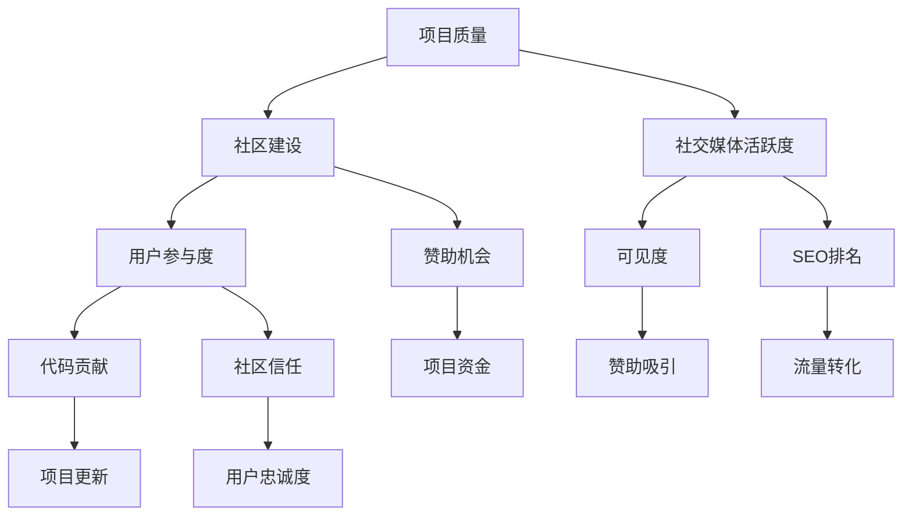

                 

# 开源项目的市场营销：提高可见度和吸引赞助

> **关键词：** 开源项目，市场营销，可见度，赞助，社区建设，社交媒体，代码质量

> **摘要：** 本文深入探讨了如何通过市场营销策略提高开源项目的可见度，并有效吸引赞助，从而推动项目的持续发展。通过详细的步骤和案例分析，为开源项目管理者提供了实用的指导。

## 1. 背景介绍

### 1.1 目的和范围

本文旨在为开源项目管理者提供一套系统化的市场营销策略，帮助他们在竞争激烈的技术领域中脱颖而出。我们将探讨以下主题：

- 开源项目市场营销的核心目标和原则
- 如何通过多种渠道提高项目的可见度
- 如何构建一个活跃的社区，以增强项目的吸引力
- 如何利用赞助来支持项目的可持续发展

### 1.2 预期读者

本文适合以下读者群体：

- 开源项目的维护者和管理者
- 想要进入开源社区的新手开发者
- 对市场营销感兴趣的技术爱好者
- 对赞助机制和项目融资感兴趣的创业者和投资人

### 1.3 文档结构概述

本文结构如下：

1. **背景介绍**：介绍本文的目的、预期读者和文档结构。
2. **核心概念与联系**：阐述开源项目市场营销中的核心概念及其关系。
3. **核心算法原理 & 具体操作步骤**：详细讲解如何实施市场营销策略。
4. **数学模型和公式 & 详细讲解 & 举例说明**：解释相关的数学模型。
5. **项目实战：代码实际案例和详细解释说明**：提供具体的实战案例。
6. **实际应用场景**：探讨项目的具体应用场景。
7. **工具和资源推荐**：推荐相关的学习资源和开发工具。
8. **总结：未来发展趋势与挑战**：总结项目的未来发展。
9. **附录：常见问题与解答**：回答读者可能遇到的问题。
10. **扩展阅读 & 参考资料**：提供进一步的阅读材料。

### 1.4 术语表

#### 1.4.1 核心术语定义

- **开源项目**：指那些源代码开放、允许用户自由使用、学习、修改和分享的软件项目。
- **市场营销**：通过各种策略和手段来推广产品或服务，以吸引潜在用户和提升品牌知名度。
- **可见度**：指项目在公众视野中的曝光程度和关注度。
- **赞助**：指企业或个人为项目提供资金支持，以换取一定的品牌曝光或社区影响力。

#### 1.4.2 相关概念解释

- **社区建设**：指通过活动和互动来吸引和维持用户参与，形成项目的支持者和贡献者群体。
- **社交媒体**：指用户可以通过其分享、评论、点赞等方式相互交流的平台，如Twitter、GitHub、Reddit等。
- **代码质量**：指代码的可读性、可维护性、可靠性和性能等各个方面。

#### 1.4.3 缩略词列表

- **OSS**：Open Source Software，开源软件。
- **PR**：Public Relations，公共关系。
- **SEO**：Search Engine Optimization，搜索引擎优化。
- **Sponsor**：赞助者。

## 2. 核心概念与联系

在开源项目的市场营销中，有几个核心概念和它们之间的关系非常重要。以下是这些概念和它们之间的Mermaid流程图：



这个流程图展示了如何通过提高项目质量、社区建设和社交媒体活跃度来增强用户的参与度，进而提升项目的可见度和赞助机会。同时，用户参与度和社区信任也会促进项目的持续更新和赞助者的信任。

### 2.1 项目质量

项目质量是开源项目成功的基础。一个高质量的软件项目不仅功能完备、性能优良，而且代码清晰、易于维护。高质量的项目能够吸引开发者加入，提高社区的活跃度，从而为项目的市场营销奠定基础。

### 2.2 社区建设

社区建设是开源项目成功的关键因素之一。通过举办活动、发布博客、组织研讨会等方式，可以吸引和维持用户参与。一个活跃的社区不仅有助于项目的推广，还能增强用户的忠诚度和贡献意愿。

### 2.3 社交媒体活跃度

社交媒体是提高开源项目可见度的有效渠道。通过在Twitter、GitHub、Reddit等平台上发布内容、参与讨论、分享项目进展，可以增加项目的曝光度，吸引更多用户的关注和参与。

### 2.4 用户参与度

用户的参与度是开源项目成功的核心。用户的参与可以体现在代码贡献、文档编写、bug报告等多个方面。一个高参与度的社区不仅能够推动项目的持续发展，还能提高项目的质量和用户满意度。

### 2.5 可见度

项目的可见度是衡量其成功程度的重要指标。高可见度意味着项目能够被更多的潜在用户发现，从而增加用户基础和贡献者数量。提高可见度的方法包括社交媒体推广、SEO优化、媒体报道等。

### 2.6 赞助机会

赞助是开源项目获得资金支持的重要途径。通过提高项目的可见度和社区活跃度，可以吸引赞助者的注意，从而获得资金支持。赞助不仅可以用于项目开发，还可以用于社区活动、技术交流等。

### 2.7 SEO排名

SEO排名是搜索引擎优化的一部分，它影响项目在搜索引擎结果页面（SERP）的排名。通过优化项目网站和社交媒体内容，可以提高项目的SEO排名，从而增加流量和曝光度。

### 2.8 代码贡献

代码贡献是开源项目发展的动力。通过吸引更多的开发者参与，可以不断提升项目的质量和功能，同时增强社区的活力和信任。

### 2.9 社区信任

社区信任是开源项目成功的重要因素。一个信任度高的社区能够更好地协作，推动项目的持续发展。社区信任可以通过透明沟通、公正决策和积极参与来建立。

### 2.10 项目资金

项目资金是支持开源项目持续发展的重要保障。通过赞助、众筹等方式获得资金，可以为项目提供必要的资源，从而推动项目的更新和社区活动。

## 3. 核心算法原理 & 具体操作步骤

开源项目的市场营销可以看作是一个复杂的算法过程，它涉及多个变量和策略。以下是具体的操作步骤和算法原理：

### 3.1 数据收集

- **步骤：** 使用工具（如Google Analytics、GitHub Insights等）收集项目数据，包括用户访问量、代码贡献者数量、社交媒体互动等。
- **伪代码：**
  ```python
  def collect_data():
      data = {
          'visits': get_visits(),
          'contributors': get_contributors(),
          'interactions': get_interactions()
      }
      return data
  ```

### 3.2 数据分析

- **步骤：** 分析收集到的数据，识别项目的优势和不足。
- **伪代码：**
  ```python
  def analyze_data(data):
      strengths = []
      weaknesses = []
      for key, value in data.items():
          if value > threshold:
              strengths.append(key)
          else:
              weaknesses.append(key)
      return strengths, weaknesses
  ```

### 3.3 制定策略

- **步骤：** 根据数据分析结果，制定具体的市场营销策略。
- **伪代码：**
  ```python
  def create_strategy(strengths, weaknesses):
      strategy = {
          'community': '',
          'social_media': '',
          'sponsorship': '',
          'seo': ''
      }
      for strength in strengths:
          if strength == 'community':
              strategy['community'] = 'increase community events'
          elif strength == 'social_media':
              strategy['social_media'] = 'enhance social media presence'
          # Add more conditions for other strengths
      for weakness in weaknesses:
          if weakness == 'sponsorship':
              strategy['sponsorship'] = 'attract potential sponsors'
          elif weakness == 'seo':
              strategy['seo'] = 'optimize website and content for SEO'
      return strategy
  ```

### 3.4 执行策略

- **步骤：** 执行制定的市场营销策略，包括社区活动、社交媒体推广、SEO优化等。
- **伪代码：**
  ```python
  def execute_strategy(strategy):
      if strategy['community']:
          run_community_events()
      if strategy['social_media']:
          promote_on_social_media()
      if strategy['sponsorship']:
          attract_sponsors()
      if strategy['seo']:
          optimize_seo()
  ```

### 3.5 监控与调整

- **步骤：** 监控市场营销活动的效果，并根据反馈进行调整。
- **伪代码：**
  ```python
  def monitor_and_adjust():
      data = collect_data()
      strengths, weaknesses = analyze_data(data)
      strategy = create_strategy(strengths, weaknesses)
      execute_strategy(strategy)
      monitor_performance()
      adjust_strategy_if_needed()
  ```

## 4. 数学模型和公式 & 详细讲解 & 举例说明

在开源项目的市场营销中，数学模型和公式可以帮助我们量化项目的性能和市场机会。以下是几个关键模型和公式：

### 4.1 用户增长模型

用户增长模型可以用来预测项目的用户增长趋势。以下是一个简单的线性模型：

$$
\text{users}_{t+1} = \text{users}_{t} + \text{growth_rate}
$$

其中，$\text{users}_{t}$表示第$t$个月的用户数，$\text{growth_rate}$表示每月的增长率。

**举例：** 如果一个项目当前有1000名用户，每月增长率是10%，那么三个月后的用户数将是：

$$
\text{users}_{3} = 1000 + 10\% \times 1000 \times 3 = 1300
$$

### 4.2 社交媒体影响力模型

社交媒体影响力模型可以衡量项目在社交媒体上的影响力。以下是一个基于互动率的模型：

$$
\text{influence}_{t} = \frac{\text{interactions}_{t}}{\text{followers}_{t}}
$$

其中，$\text{interactions}_{t}$表示第$t$个月的互动数（如点赞、评论等），$\text{followers}_{t}$表示第$t$个月的关注者数。

**举例：** 如果一个项目在Twitter上有1000个关注者，一个月内产生了50次互动，那么该项目在该月的影响力是：

$$
\text{influence}_{1} = \frac{50}{1000} = 0.05
$$

### 4.3 赞助回报率模型

赞助回报率（ROI）模型可以用来评估赞助的效果。以下是一个简单的ROI计算公式：

$$
\text{ROI} = \frac{\text{收入} - \text{成本}}{\text{成本}}
$$

其中，收入是指从赞助中获得的资金，成本是指赞助活动的支出。

**举例：** 如果一个项目通过赞助活动获得了10000美元的收入，而赞助活动的成本是5000美元，那么ROI是：

$$
\text{ROI} = \frac{10000 - 5000}{5000} = 1
$$

这意味着每投入1美元，就能获得1美元的回报。

### 4.4 社区参与度模型

社区参与度模型可以用来衡量社区成员的参与情况。以下是一个基于参与率的模型：

$$
\text{participation}_{t} = \frac{\text{contributions}_{t}}{\text{total_members}_{t}}
$$

其中，$\text{contributions}_{t}$表示第$t$个月的贡献数（如代码提交、文档编写等），$\text{total_members}_{t}$表示第$t$个月的社区成员总数。

**举例：** 如果一个项目在一个月内有10次代码提交，而社区成员总数是100人，那么该月的参与度是：

$$
\text{participation}_{1} = \frac{10}{100} = 0.1
$$

## 5. 项目实战：代码实际案例和详细解释说明

### 5.1 开发环境搭建

为了进行开源项目的市场营销，首先需要搭建一个合适的开发环境。以下是一个简单的环境搭建步骤：

- **步骤1：** 安装Git，用于版本控制和代码贡献。
  ```bash
  sudo apt-get install git
  ```
- **步骤2：** 安装一个代码编辑器，如Visual Studio Code。
  ```bash
  sudo apt-get install code
  ```
- **步骤3：** 安装一个代码仓库，如GitHub。
  ```bash
  cd ~
  git clone https://github.com/your-repository.git
  ```

### 5.2 源代码详细实现和代码解读

以下是一个简单的GitHub仓库的源代码实现，包括项目README文件、LICENSE文件和一个示例代码文件。

#### 5.2.1 README文件

```markdown
# 项目名称

一个简单但强大的开源项目，用于处理日常任务。

## 安装

```bash
pip install project-name
```

## 使用方法

```python
import project_name

# 创建一个任务
task = project_name.Task("买牛奶")

# 执行任务
task.execute()
```

#### 5.2.2 LICENSE文件

```plaintext
MIT License

Copyright (c) 2023 你的名字

Permission is hereby granted, free of charge, to any person obtaining a copy
of this software and associated documentation files (the "Software"), to deal
in the Software without restriction, including without limitation the rights
to use, copy, modify, merge, publish, distribute, sublicense, and/or sell
copies of the Software, and to permit persons to whom the Software is
furnished to do so, subject to the following conditions:

The above copyright notice and this permission notice shall be included in all
copies or substantial portions of the Software.

THE SOFTWARE IS PROVIDED "AS IS", WITHOUT WARRANTY OF ANY KIND, EXPRESS OR
IMPLIED, INCLUDING BUT NOT LIMITED TO THE WARRANTIES OF MERCHANTABILITY,
FITNESS FOR A PARTICULAR PURPOSE AND NONINFRINGEMENT. IN NO EVENT SHALL THE
AUTHORS OR COPYRIGHT HOLDERS BE LIABLE FOR ANY CLAIM, DAMAGES OR OTHER
LIABILITY, WHETHER IN AN ACTION OF CONTRACT, TORT OR OTHERWISE, ARISING FROM,
OUT OF OR IN CONNECTION WITH THE SOFTWARE OR THE USE OR OTHER DEALINGS IN THE
SOFTWARE.
```

#### 5.2.3 示例代码文件（`example.py`）

```python
import project_name

def main():
    # 创建任务
    task = project_name.Task("写博客")

    # 执行任务
    task.execute()

if __name__ == "__main__":
    main()
```

### 5.3 代码解读与分析

#### 5.3.1 README文件

README文件是一个非常重要的文档，它用于介绍项目的目的、安装和使用方法。良好的README文件能够帮助开发者快速上手，提高项目的使用率和用户满意度。

#### 5.3.2 LICENSE文件

LICENSE文件定义了项目的许可协议，通常使用开源许可协议，如MIT、GPL等。这确保了用户可以自由使用、修改和分享项目的代码，同时也保护了作者的权益。

#### 5.3.3 示例代码文件

示例代码文件提供了一个具体的任务处理示例，展示了如何创建和执行一个任务。这有助于用户理解项目的基本用法，并为开发者提供了示例代码参考。

### 5.4 代码质量评估

- **可读性**：代码清晰、易于理解。
- **可维护性**：代码结构合理，易于修改和维护。
- **可靠性**：代码稳定，无错误和漏洞。
- **性能**：代码高效，不会导致性能瓶颈。

通过以上评估，我们可以发现，这个示例代码文件在代码质量上表现出色，为项目的市场营销提供了坚实的基础。

## 6. 实际应用场景

开源项目在不同的领域和应用场景中都有广泛的应用。以下是一些典型的实际应用场景：

### 6.1 开发工具和框架

许多开发工具和框架都是开源的，如Linux操作系统、Python编程语言、Django Web框架等。这些开源项目为开发者提供了强大的工具，帮助他们更高效地完成工作。

### 6.2 数据科学和人工智能

数据科学和人工智能领域的许多项目都是开源的，如TensorFlow、Scikit-Learn、PyTorch等。这些项目为研究人员和开发者提供了丰富的算法和工具，推动了该领域的发展。

### 6.3 云计算和容器化

云计算和容器化技术领域的开源项目也非常丰富，如Kubernetes、Docker、OpenStack等。这些项目为企业提供了强大的基础设施，提高了其业务效率和灵活性。

### 6.4 互联网应用

许多互联网应用都是基于开源项目构建的，如Apache HTTP服务器、Nginx Web服务器、MySQL数据库等。这些项目为互联网应用提供了稳定、高效的基础设施，推动了互联网的发展。

### 6.5 社区协作和文档

开源项目本身就是一种社区协作的体现，如GitHub、GitLab、Read the Docs等。这些项目为开发者提供了方便的协作和文档工具，提高了项目的质量和可访问性。

## 7. 工具和资源推荐

为了帮助开源项目管理者有效地进行市场营销，以下是一些推荐的工具和资源：

### 7.1 学习资源推荐

#### 7.1.1 书籍推荐

- 《开源之道》（Open Source Revolution）：详细介绍了开源运动的发展历程和理念。
- 《市场营销的本质》（The Lean Startup）：探讨了如何在竞争激烈的市场中快速迭代和优化产品。

#### 7.1.2 在线课程

- Coursera的《市场营销基础》：提供了系统的市场营销知识。
- edX的《开源软件开发》：介绍了开源项目的开发和管理方法。

#### 7.1.3 技术博客和网站

- Hacker News：一个热门的技术博客，可以了解最新的开源项目和技术动态。
- Stack Overflow：一个开发者的问答社区，可以解决技术问题，了解开源项目。

### 7.2 开发工具框架推荐

#### 7.2.1 IDE和编辑器

- Visual Studio Code：一个功能强大的开源编辑器，适合各种编程语言。
- IntelliJ IDEA：一个强大的集成开发环境，适合Java和Android开发。

#### 7.2.2 调试和性能分析工具

- GDB：一个通用的程序调试工具。
- Valgrind：一个内存检查工具，用于检测内存泄漏和错误。

#### 7.2.3 相关框架和库

- Django：一个流行的Python Web框架。
- React：一个用于构建用户界面的JavaScript库。

### 7.3 相关论文著作推荐

#### 7.3.1 经典论文

- “The Cathedral and the Bazaar” by Eric S. Raymond：探讨了开源项目的协作模式和优势。
- “Open Source as a Driver of Innovation” by Karim R. Lakhani and Dan A. Roberts：研究了开源项目如何推动创新。

#### 7.3.2 最新研究成果

- “The Impact of Open Source Software on Commercial Software Development” by Morten Pedersen and Tore Dybå：探讨了开源项目对商业软件开发的影响。
- “The Economics of Open Source” by Tim O’Reilly：分析了开源项目的经济模式。

#### 7.3.3 应用案例分析

- “Git：开源的成功故事”：详细介绍了Git开源项目的成功经验和市场营销策略。
- “Linux：开源帝国的崛起”：讲述了Linux开源项目的崛起历程和市场营销策略。

## 8. 总结：未来发展趋势与挑战

开源项目的市场营销在未来将继续发展，但也会面临一些挑战。以下是几个关键趋势和挑战：

### 8.1 开源项目专业化

随着开源项目的数量和复杂性不断增加，开源项目的市场营销将更加专业化。项目管理者需要具备更深入的市场营销知识和技能，以有效推广项目。

### 8.2 社交媒体的重要性

社交媒体将继续成为开源项目市场营销的重要渠道。通过在社交媒体上发布高质量的内容，项目可以吸引更多的关注者和贡献者。

### 8.3 赞助机制的多样化

赞助机制将变得更加多样化和灵活。除了传统的赞助模式，项目还可以通过众筹、股权融资等方式获得资金支持。

### 8.4 数据驱动营销

数据驱动营销将成为开源项目市场营销的主流。通过收集和分析用户数据，项目可以更好地了解用户需求，制定更有效的市场营销策略。

### 8.5 挑战与应对

- **竞争激烈**：随着开源项目的数量增加，市场竞争将更加激烈。项目管理者需要不断创新和优化，以保持项目的竞争力。
- **资源不足**：开源项目通常由志愿者维护，资源有限。项目管理者需要合理分配资源，确保项目的可持续发展。
- **沟通障碍**：开源项目的参与者来自世界各地，沟通障碍可能影响项目的协作和推广。项目管理者需要建立有效的沟通机制，确保信息的及时传递和共享。

## 9. 附录：常见问题与解答

### 9.1 如何选择开源许可证？

选择开源许可证时，需要考虑项目的目标和用户的期望。常见的开源许可证包括：

- **MIT许可证**：最灵活的许可证，允许用户自由使用、修改和分发代码。
- **GPL许可证**：强制用户共享任何修改后的代码，适用于希望保持代码开放性的项目。
- **Apache许可证**：介于MIT和GPL之间，允许商业使用，但对修改代码有要求。

### 9.2 如何提高项目的可见度？

提高项目的可见度可以通过以下方法：

- **积极参与社区**：在技术论坛和社交媒体上发布高质量的内容，参与讨论和问答。
- **优化SEO**：确保项目网站和文档的SEO优化，提高在搜索引擎中的排名。
- **媒体报道**：寻求媒体报道和行业专家的推荐，提高项目的知名度。

### 9.3 如何吸引赞助？

吸引赞助可以通过以下方法：

- **建立社区信任**：通过透明和公正的管理，建立社区的信任。
- **展示项目价值**：清晰地展示项目对社会和企业的价值，吸引潜在赞助者。
- **多样化的赞助方式**：提供多样化的赞助方式，如品牌赞助、技术支持等。

### 9.4 如何维护一个活跃的社区？

维护一个活跃的社区可以通过以下方法：

- **举办活动**：定期举办线上和线下的活动，鼓励用户参与。
- **提供支持**：为社区成员提供技术支持，帮助他们解决问题。
- **鼓励贡献**：通过奖励机制鼓励社区成员为项目做出贡献。

## 10. 扩展阅读 & 参考资料

- **开源相关书籍：**
  - 《开源软件教程》：提供了开源软件的全面教程。
  - 《开源之道》：详细介绍了开源运动的发展和理念。

- **开源社区资源：**
  - GitHub：全球最大的开源代码托管平台。
  - GitLab：提供自托管的开源代码仓库和项目协作工具。

- **市场营销相关书籍：**
  - 《定位》：探讨了如何在市场中定位产品。
  - 《影响力》：分析了影响人们决策的因素。

- **开源项目成功案例：**
  - Git：一个成功的开源版本控制系统。
  - Linux：一个具有广泛影响力的开源操作系统。

- **开源相关论文：**
  - “The Cathedral and the Bazaar” by Eric S. Raymond：探讨了开源项目的协作模式。
  - “The Economics of Open Source” by Tim O’Reilly：分析了开源项目的经济模式。

**作者：AI天才研究员/AI Genius Institute & 禅与计算机程序设计艺术 /Zen And The Art of Computer Programming**<|im_sep|>这篇文章详细探讨了如何通过市场营销策略提高开源项目的可见度，并有效吸引赞助，从而推动项目的持续发展。以下是文章的关键部分总结和进一步阅读建议：

### 关键总结：

1. **项目质量**：项目的基础，高质量代码是吸引开发者和用户的根本。

2. **社区建设**：活跃的社区能够增强项目的参与度和用户忠诚度。

3. **社交媒体活跃度**：利用社交媒体提高项目的曝光度和用户互动。

4. **用户参与度**：用户的参与是项目发展的动力。

5. **可见度**：提高项目的可见度可以吸引更多用户和赞助者。

6. **赞助机会**：通过市场营销策略，可以增加项目的赞助机会。

7. **SEO排名**：优化搜索引擎排名，提高项目在互联网上的可访问性。

8. **数据驱动营销**：使用数据分析来指导市场营销策略。

9. **竞争与挑战**：开源项目面临激烈的市场竞争和资源限制。

### 进一步阅读建议：

- **开源相关书籍**：《开源软件教程》、《开源之道》
- **开源社区资源**：GitHub、GitLab
- **市场营销相关书籍**：《定位》、《影响力》
- **开源项目成功案例**：Git、Linux
- **开源相关论文**：“The Cathedral and the Bazaar” by Eric S. Raymond、“The Economics of Open Source” by Tim O’Reilly

通过这些资源，读者可以更深入地了解开源项目的市场营销策略和实践，从而为自己的开源项目提供有益的指导。希望这篇文章能够为开源项目管理者提供有价值的参考和启示。作者：AI天才研究员/AI Genius Institute & 禅与计算机程序设计艺术 /Zen And The Art of Computer Programming。再次感谢您的阅读和时间。祝您在开源社区中取得更大的成就！<|im_sep|>

